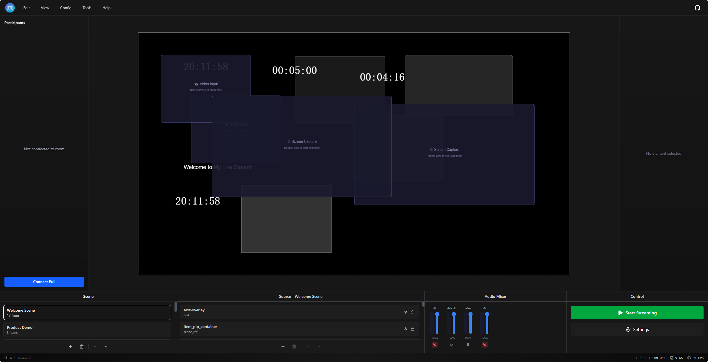

<div align="center">


# LiveMixer Web Studio

<a href="https://livemixer.github.io/livemixer-web/">🌐 Online Demo</a>

</div>

An open-source live video mixer and streaming application built with React, Konva.js, and LiveKit WebRTC.

LiveMixer Web Studio provides a browser-based video mixing experience similar to OBS Studio, enabling users to compose live video scenes with multiple sources (webcam, screen capture, media files, text, images) and stream them in real time via LiveKit.

<div align="center">
  
</div>

## Features

- **Visual Canvas Editor** - Drag, resize, and layer video sources on a Konva.js-powered canvas
- **Scene Management** - Create, reorder, and switch between multiple scenes
- **Built-in Source Plugins**
  - Webcam capture
  - Screen / window capture
  - Media source (URL-based video)
  - Image overlay
  - Text overlay
  - Timer & clock
  - Audio input with mixer panel
- **Live Streaming** - Publish the mixed canvas to a LiveKit room via WebRTC
- **Stream Pulling** - Consume remote participant streams and add them to the canvas
- **Plugin System** - Extensible architecture with a built-in plugin registry, context API, and dialog slots
- **Internationalization** - Multilingual support via i18next (English & Chinese out of the box)
- **Config Persistence** - Import and export scene configurations as JSON
- **Library Mode** - Can be used as an embeddable React component (ES + UMD builds)

## Tech Stack

| Layer | Technology |
|-------|------------|
| Framework | React 19 + TypeScript |
| Canvas Engine | Konva.js + react-konva |
| Streaming | LiveKit WebRTC (livekit-client) |
| State Management | Zustand |
| UI Components | Radix UI + Tailwind CSS v4 |
| Build Tool | Vite 7 |
| Linting & Formatting | Biome |
| i18n | i18next + react-i18next |

## Getting Started

### Prerequisites

- Node.js >= 18
- pnpm

### Install

```sh
pnpm install
```

### Development

```sh
pnpm run dev
```

### Build

```sh
# Build as a standalone web application
pnpm run build

# Build as a library (ES + UMD)
pnpm run build:lib
```

### Preview

```sh
pnpm run preview
```

## Usage as a Library

LiveMixer Web can be embedded in any React application:

```tsx
import { LiveMixerApp, type LiveMixerExtensions } from 'livemixer-web';
import 'livemixer-web/dist/livemixer-web.css';

const extensions: LiveMixerExtensions = {
  logo: <MyLogo />,
  userComponent: <UserMenu />,
};

function App() {
  return <LiveMixerApp extensions={extensions} />;
}
```

### Exported API

The library exports the following:

- `LiveMixerApp` - Main application component
- `useProtocolStore` / `useSettingsStore` - Zustand stores
- `streamingService` / `canvasCaptureService` - Service instances
- Type exports: `ProtocolData`, `Scene`, `SceneItem`, `CanvasConfig`, `LiveMixerExtensions`, `SourceType`
- UI Components: `MainLayout`, `Toolbar`, `BottomBar`, `StatusBar`, `PropertyPanel`, etc.

## Plugin System

LiveMixer Web features an extensible plugin system. Built-in plugins include:

| Plugin | Source Type | Description |
|--------|-------------|-------------|
| Webcam | `webcam` | Capture video from a webcam device |
| Audio Input | `audio_input` | Capture audio from a microphone |
| Screen Capture | `screen` / `window` | Capture screen or window |
| Media Source | `mediasource` | Play a media URL |
| Image | `image` | Display an image overlay |
| Text | `text` | Render text overlay |

See [Plugin Development Guide](./docs/plugin/example-third-party-plugin.tsx) for creating third-party plugins.

## Protocol

Scene and source configurations follow the [v1.0.0 protocol](./protocol/v1.0.0/v1.0.0.json) data model, which defines the structure for scenes, items, canvas settings, and streaming configuration.

## Contributing

Contributions are welcome! Please follow the project's code style enforced by Biome.

```sh
# Check code
pnpm run lint

# Auto-fix
pnpm run lint:fix

# Format code
pnpm run format
```

## License

[Apache-2.0](./LICENSE)
