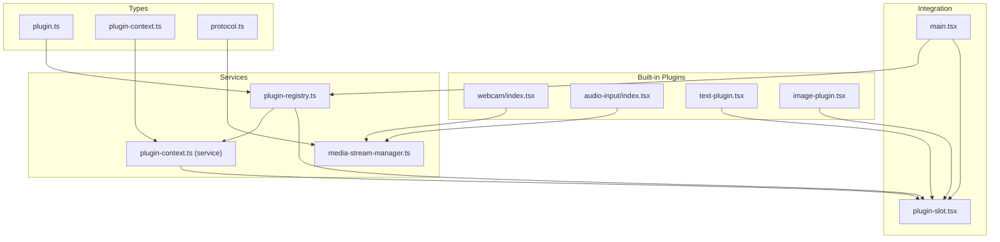
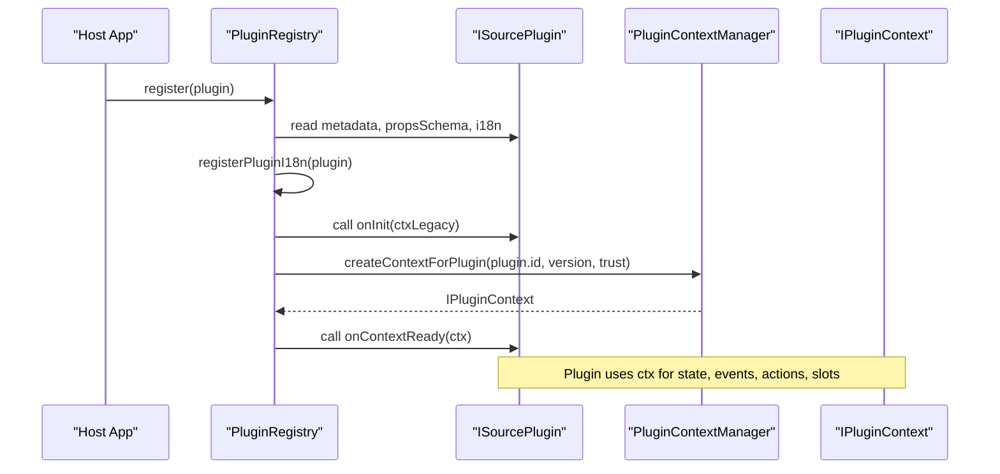
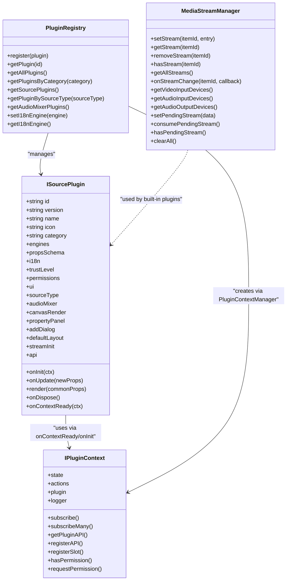

# API Reference

<cite>
**Referenced Files in This Document**
- [plugin.ts](file://src/types/plugin.ts)
- [plugin-context.ts](file://src/types/plugin-context.ts)
- [plugin-registry.ts](file://src/services/plugin-registry.ts)
- [plugin-context.ts (service)](file://src/services/plugin-context.ts)
- [media-stream-manager.ts](file://src/services/media-stream-manager.ts)
- [protocol.ts](file://src/types/protocol.ts)
- [v1.0.0.json](file://protocol/v1.0.0/v1.0.0.json)
- [plugin-slot.tsx](file://src/components/plugin-slot.tsx)
- [webcam/index.tsx](file://src/plugins/builtin/webcam/index.tsx)
- [audio-input/index.tsx](file://src/plugins/builtin/audio-input/index.tsx)
- [text-plugin.tsx](file://src/plugins/builtin/text-plugin.tsx)
- [image-plugin.tsx](file://src/plugins/builtin/image-plugin.tsx)
- [example-third-party-plugin.tsx](file://docs/plugin/example-third-party-plugin.tsx)
- [main.tsx](file://src/main.tsx)
</cite>

## Table of Contents
1. [Introduction](#introduction)
2. [Project Structure](#project-structure)
3. [Core Components](#core-components)
4. [Architecture Overview](#architecture-overview)
5. [Detailed Component Analysis](#detailed-component-analysis)
6. [Dependency Analysis](#dependency-analysis)
7. [Performance Considerations](#performance-considerations)
8. [Troubleshooting Guide](#troubleshooting-guide)
9. [Conclusion](#conclusion)
10. [Appendices](#appendices)

## Introduction
This document provides comprehensive API documentation for LiveMixer Web’s public plugin interfaces and service contracts. It covers:
- The Plugin interface and lifecycle
- The PluginContext interface for plugin-host communication and state management
- Protocol data structures for SceneItem and related configuration schemas
- Service contracts for MediaStreamManager and PluginRegistry
- Event systems, callback patterns, and integration points
- TypeScript type definitions and interface implementations
- API versioning, backward compatibility, and migration guidance

## Project Structure
LiveMixer Web organizes plugin-related code under src/types, src/services, and src/plugins/builtin. The protocol definitions reside under src/types/protocol.ts and protocol/v1.0.0. The plugin slot system integrates with React via src/components/plugin-slot.tsx.

**Diagram sources**
- [plugin.ts](file://src/types/plugin.ts)
- [plugin-context.ts](file://src/types/plugin-context.ts)
- [plugin-registry.ts](file://src/services/plugin-registry.ts)
- [plugin-context.ts (service)](file://src/services/plugin-context.ts)
- [media-stream-manager.ts](file://src/services/media-stream-manager.ts)
- [plugin-slot.tsx](file://src/components/plugin-slot.tsx)
- [webcam/index.tsx](file://src/plugins/builtin/webcam/index.tsx)
- [audio-input/index.tsx](file://src/plugins/builtin/audio-input/index.tsx)
- [text-plugin.tsx](file://src/plugins/builtin/text-plugin.tsx)
- [image-plugin.tsx](file://src/plugins/builtin/image-plugin.tsx)
- [main.tsx](file://src/main.tsx)

**Section sources**
- [plugin.ts](file://src/types/plugin.ts)
- [plugin-context.ts](file://src/types/plugin-context.ts)
- [plugin-registry.ts](file://src/services/plugin-registry.ts)
- [plugin-context.ts (service)](file://src/services/plugin-context.ts)
- [media-stream-manager.ts](file://src/services/media-stream-manager.ts)
- [protocol.ts](file://src/types/protocol.ts)
- [plugin-slot.tsx](file://src/components/plugin-slot.tsx)
- [main.tsx](file://src/main.tsx)

## Core Components
- Plugin interface (ISourcePlugin): Defines plugin metadata, compatibility, property schema, internationalization, UI configuration, lifecycle hooks, and rendering contract.
- PluginContext: Provides a secure, read-only view of application state, event subscriptions, actions, plugin communication, slot registration, permissions, and logging.
- Protocol data structures: Define SceneItem, Layout, Transform, and related configuration schemas used across the system.
- MediaStreamManager: Centralized media stream management for plugins, including device enumeration and pending stream handling.
- PluginRegistry: Manages plugin registration, i18n integration, and context initialization.

**Section sources**
- [plugin.ts](file://src/types/plugin.ts)
- [plugin-context.ts](file://src/types/plugin-context.ts)
- [protocol.ts](file://src/types/protocol.ts)
- [media-stream-manager.ts](file://src/services/media-stream-manager.ts)
- [plugin-registry.ts](file://src/services/plugin-registry.ts)

## Architecture Overview
The plugin system is composed of:
- Host-managed PluginContextManager that creates isolated, permissioned contexts per plugin.
- PluginRegistry that registers plugins, wires i18n, and initializes legacy and modern contexts.
- MediaStreamManager that decouples media device handling from plugin internals.
- React-based slot system that renders plugin-provided UI components.

**Diagram sources**
- [plugin-registry.ts](file://src/services/plugin-registry.ts)
- [plugin-context.ts (service)](file://src/services/plugin-context.ts)
- [plugin.ts](file://src/types/plugin.ts)

## Detailed Component Analysis

### Plugin Interface (ISourcePlugin)
The Plugin interface defines the contract for all source plugins. It includes:
- Metadata: id, version, name, icon, category, engines (host/api compatibility).
- Internationalization: optional i18n resources.
- Property schema: propsSchema for runtime configuration.
- UI configuration: sourceType, audioMixer, canvasRender, propertyPanel, addDialog, defaultLayout, streamInit.
- Lifecycle: onInit (legacy), onUpdate, render, onDispose.
- Modern context integration: trustLevel, permissions, ui, onContextReady, api.

Key capabilities:
- Source type mapping enables plugins to appear in the add-source dialog.
- Audio mixer configuration integrates with the audio mixer panel.
- Canvas render configuration controls filtering and selection behavior.
- Property panel configuration allows customizing the property editing UI.
- Add dialog configuration supports immediate dialogs or deferred configuration.
- Stream initialization configuration declares stream needs and types.
- Modern context integration exposes a secure, permissioned IPluginContext to plugins.

Usage examples:
- Built-in webcam plugin demonstrates device capture, stream caching, and dialog integration.
- Built-in audio input plugin demonstrates level monitoring and audio-only rendering.
- Built-in text and image plugins demonstrate simple rendering and property editing.

**Section sources**
- [plugin.ts](file://src/types/plugin.ts)
- [webcam/index.tsx](file://src/plugins/builtin/webcam/index.tsx)
- [audio-input/index.tsx](file://src/plugins/builtin/audio-input/index.tsx)
- [text-plugin.tsx](file://src/plugins/builtin/text-plugin.tsx)
- [image-plugin.tsx](file://src/plugins/builtin/image-plugin.tsx)
- [example-third-party-plugin.tsx](file://docs/plugin/example-third-party-plugin.tsx)

### PluginContext Interface
PluginContext provides a secure, controlled API surface for plugins:
- State: readonly snapshot of application state (scene, playback, output, ui, devices, user).
- Events: subscribe and subscribeMany for event-driven updates.
- Actions: scene, playback, ui, storage actions executed through host handlers with permission checks.
- Plugin communication: getPluginAPI and registerAPI for inter-plugin messaging.
- Slot registration: registerSlot to contribute UI components to predefined or custom slots.
- Permissions: hasPermission and requestPermission to enforce trust-based access.
- Logging: scoped logger with debug/info/warn/error.

Security model:
- State is read-only via a deep proxy that prevents direct mutation.
- Actions enforce permission gates and delegate to host-configured handlers.
- Slot registration requires explicit UI permissions.
- Plugin APIs are guarded by plugin:communicate permission.

**Section sources**
- [plugin-context.ts](file://src/types/plugin-context.ts)
- [plugin-context.ts (service)](file://src/services/plugin-context.ts)

### Protocol Data Structures
The protocol defines the layout and transformation schemas used by SceneItem:
- CanvasConfig: canvas width and height.
- Layout: x, y, width, height.
- Transform: opacity, rotation, filters, borderRadius.
- SceneItem: type discriminator, z-index, layout, transform, visibility/locking, and type-specific fields (e.g., color, content, url, source, children, refSceneId, timerConfig, livekitStream, device-based audio/video properties).
- Scene: id, name, active flag, items.
- Source/Resources: source definitions and URLs.
- ProtocolData: top-level layout with version, metadata, canvas, resources, and scenes.

The v1.0.0 schema demonstrates a complete layout with scenes, transitions, items, and transformations.

**Section sources**
- [protocol.ts](file://src/types/protocol.ts)
- [v1.0.0.json](file://protocol/v1.0.0/v1.0.0.json)

### MediaStreamManager Service Contract
MediaStreamManager provides a unified interface for managing media streams across plugins:
- Stream lifecycle: setStream, getStream, removeStream, hasStream, getAllStreams.
- Event system: onStreamChange for subscribing to item-specific stream changes.
- Device enumeration: getVideoInputDevices, getAudioInputDevices, getAudioOutputDevices with permission-aware flows.
- Pending stream handling: setPendingStream, consumePendingStream, hasPendingStream.
- Cleanup: clearAll to stop and remove all streams.

Integration pattern:
- Plugins cache streams per item and subscribe to changes.
- Dialogs can pass pending streams to the host for item creation.

**Section sources**
- [media-stream-manager.ts](file://src/services/media-stream-manager.ts)
- [webcam/index.tsx](file://src/plugins/builtin/webcam/index.tsx)
- [audio-input/index.tsx](file://src/plugins/builtin/audio-input/index.tsx)

### PluginRegistry Service Contract
PluginRegistry manages plugin lifecycle and integration:
- Registration: register(plugin) logs, registers i18n resources, initializes legacy context, and calls onContextReady with a full context.
- i18n integration: setI18nEngine and registerPluginI18n to integrate plugin resources into the host i18n engine.
- Discovery: getPlugin, getAllPlugins, getPluginsByCategory, getSourcePlugins, getPluginBySourceType, getAudioMixerPlugins.

**Section sources**
- [plugin-registry.ts](file://src/services/plugin-registry.ts)

### Slot System and React Integration
The slot system enables plugins to contribute UI components:
- SlotContent: id, pluginId, slot, component, props, priority, visibility.
- Predefined slots: toolbar-left, toolbar-center, toolbar-right, sidebar-top, sidebar-bottom, property-panel-top, property-panel-bottom, canvas-overlay, status-bar-left, status-bar-center, status-bar-right, dialogs, context-menu, add-source-dialog.
- Slot component: renders registered content with visibility filtering and error boundaries.
- DialogSlot: renders active dialogs from dialogs and add-source-dialog slots.
- Hooks: usePluginContextSystem, usePluginContext, usePluginState, usePluginEvent, useSlotHasContent, useSlotContentCount.

**Section sources**
- [plugin-context.ts](file://src/types/plugin-context.ts)
- [plugin-slot.tsx](file://src/components/plugin-slot.tsx)

### Event System and Callback Patterns
Events enable reactive updates:
- Event types: scene:change, scene:item:add/remove/update/select/reorder, playback:start/stop/pause, devices:change/videoInput:change/audioInput:change, ui:theme:change/language:change, plugin:ready/dispose.
- Event data map: typed payload per event.
- Subscription: subscribe and subscribeMany return unsubscribe functions.
- Emission: PluginContextManager emits events to listeners.

**Section sources**
- [plugin-context.ts](file://src/types/plugin-context.ts)
- [plugin-context.ts (service)](file://src/services/plugin-context.ts)

### API Versioning, Backward Compatibility, and Migration
- Engines compatibility: plugins declare host and API compatibility via engines.host and engines.api.
- Legacy context: onInit receives a legacy IPluginContext with canvasWidth/canvasHeight and assetLoader.
- Modern context: onContextReady receives a full IPluginContext with state, actions, permissions, and slots.
- Migration guidance:
  - Prefer onContextReady over onInit for modern plugins.
  - Use mediaStreamManager for stream operations instead of legacy caches.
  - Adopt typed propsSchema and UI configuration for better UX and maintainability.
  - Respect permission gates enforced by PluginContext actions.

**Section sources**
- [plugin.ts](file://src/types/plugin.ts)
- [plugin-registry.ts](file://src/services/plugin-registry.ts)
- [media-stream-manager.ts](file://src/services/media-stream-manager.ts)

## Dependency Analysis

**Diagram sources**
- [plugin.ts](file://src/types/plugin.ts)
- [plugin-context.ts](file://src/types/plugin-context.ts)
- [plugin-registry.ts](file://src/services/plugin-registry.ts)
- [media-stream-manager.ts](file://src/services/media-stream-manager.ts)

**Section sources**
- [plugin.ts](file://src/types/plugin.ts)
- [plugin-context.ts](file://src/types/plugin-context.ts)
- [plugin-registry.ts](file://src/services/plugin-registry.ts)
- [media-stream-manager.ts](file://src/services/media-stream-manager.ts)

## Performance Considerations
- Stream lifecycle: Always stop tracks and remove DOM elements when disposing streams to avoid leaks.
- Event subscriptions: Return unsubscribe functions from subscribe/subscribeMany to prevent memory leaks.
- Slot rendering: Use visibility conditions and error boundaries to keep UI responsive.
- State updates: Use actions instead of mutating state directly to avoid unnecessary re-renders.
- Device enumeration: Cache device lists and avoid repeated getUserMedia calls.

[No sources needed since this section provides general guidance]

## Troubleshooting Guide
Common issues and resolutions:
- Permission denials: Check hasPermission and requestPermission for scene:write, playback:control, ui:dialog, ui:slot, plugin:communicate, storage:read/write.
- Stream errors: Verify device availability and labels; handle onended events to reset UI state.
- Slot rendering failures: Wrap plugin components with error boundaries; ensure registerSlot is called with correct slot names and priorities.
- Legacy vs modern context: Prefer onContextReady for modern plugins; ensure engines.api matches host expectations.

**Section sources**
- [plugin-context.ts (service)](file://src/services/plugin-context.ts)
- [webcam/index.tsx](file://src/plugins/builtin/webcam/index.tsx)
- [audio-input/index.tsx](file://src/plugins/builtin/audio-input/index.tsx)
- [plugin-slot.tsx](file://src/components/plugin-slot.tsx)

## Conclusion
LiveMixer Web’s plugin system offers a robust, secure, and extensible framework for building interactive media experiences. By adhering to the Plugin interface, leveraging PluginContext for state and actions, and using MediaStreamManager for media operations, developers can create powerful plugins that integrate seamlessly with the host application.

[No sources needed since this section summarizes without analyzing specific files]

## Appendices

### API Definitions and Examples

- Plugin interface (ISourcePlugin)
  - Purpose: Defines plugin metadata, lifecycle, rendering, and UI configuration.
  - Key members: id, version, name, category, engines, propsSchema, i18n, trustLevel, permissions, ui, sourceType, audioMixer, canvasRender, propertyPanel, addDialog, defaultLayout, streamInit, onInit, onUpdate, render, onDispose, onContextReady, api.
  - Example usage: See built-in plugins and example third-party plugin.

- PluginContext
  - Purpose: Secure, read-only access to application state and actions; event subscription; plugin communication; slot registration; permissions; logging.
  - Key members: state, subscribe, subscribeMany, actions, getPluginAPI, registerAPI, registerSlot, plugin, hasPermission, requestPermission, logger.
  - Example usage: Built-in plugins call ctx.registerSlot and ctx.actions.

- MediaStreamManager
  - Purpose: Centralized media stream management for plugins.
  - Key members: setStream, getStream, removeStream, hasStream, getAllStreams, onStreamChange, getVideoInputDevices, getAudioInputDevices, getAudioOutputDevices, setPendingStream, consumePendingStream, hasPendingStream, clearAll.
  - Example usage: Webcam and audio input plugins rely on MediaStreamManager.

- Protocol data structures
  - Purpose: Define SceneItem, Layout, Transform, and related schemas.
  - Key members: CanvasConfig, Layout, Transform, SceneItem, Scene, Source, Resources, ProtocolData.
  - Example usage: v1.0.0 schema demonstrates a complete layout.

**Section sources**
- [plugin.ts](file://src/types/plugin.ts)
- [plugin-context.ts](file://src/types/plugin-context.ts)
- [media-stream-manager.ts](file://src/services/media-stream-manager.ts)
- [protocol.ts](file://src/types/protocol.ts)
- [v1.0.0.json](file://protocol/v1.0.0/v1.0.0.json)
- [webcam/index.tsx](file://src/plugins/builtin/webcam/index.tsx)
- [audio-input/index.tsx](file://src/plugins/builtin/audio-input/index.tsx)
- [example-third-party-plugin.tsx](file://docs/plugin/example-third-party-plugin.tsx)