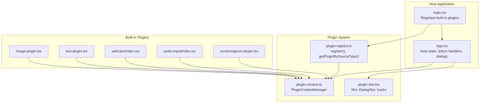
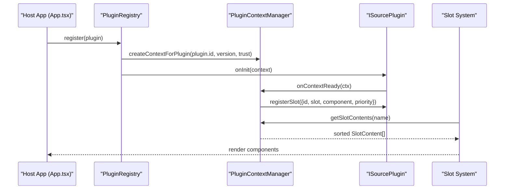
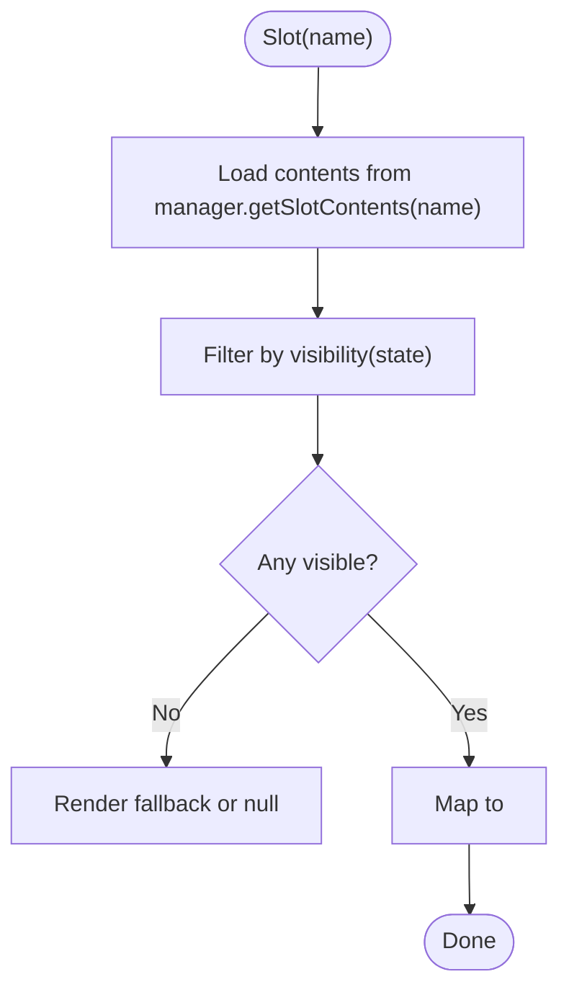
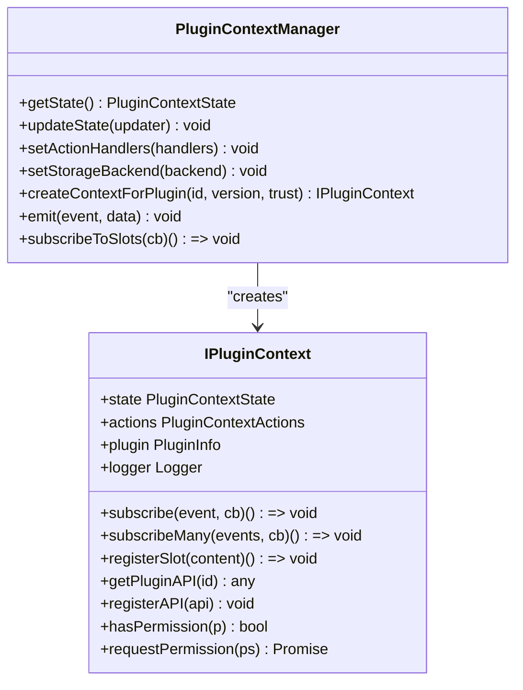
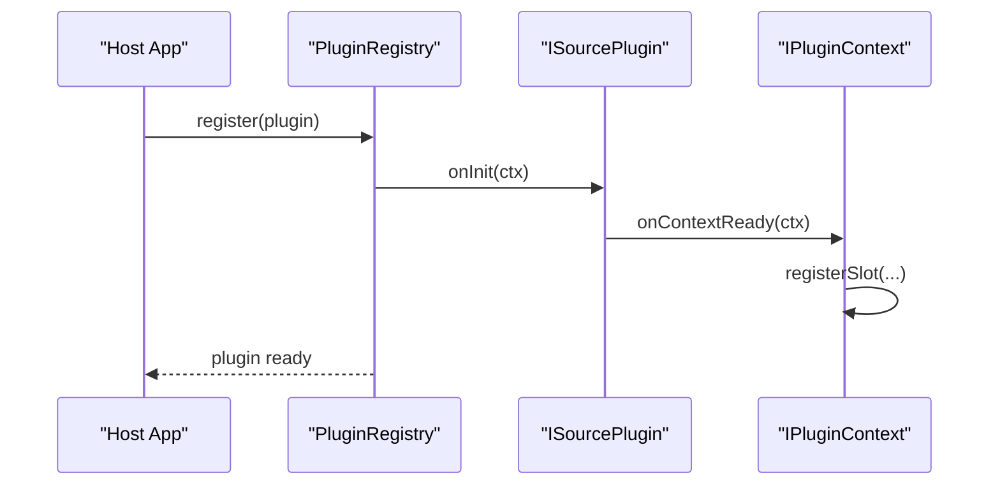
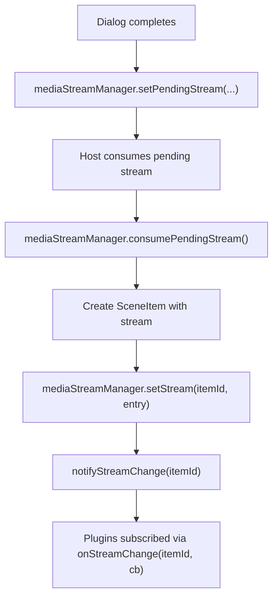
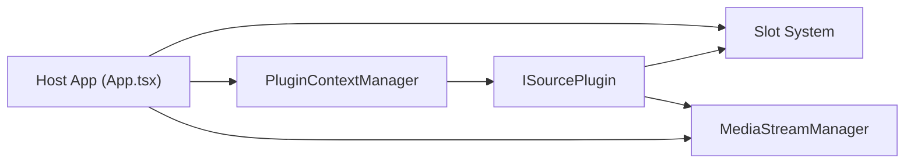

# Extension and Extension Points

<cite>
**Referenced Files in This Document**
- [plugin-slot.tsx](file://src/components/plugin-slot.tsx)
- [plugin-context.ts](file://src/services/plugin-context.ts)
- [plugin-registry.ts](file://src/services/plugin-registry.ts)
- [plugin.ts](file://src/types/plugin.ts)
- [plugin-context.ts](file://src/types/plugin-context.ts)
- [extensions.ts](file://src/types/extensions.ts)
- [main.tsx](file://src/main.tsx)
- [App.tsx](file://src/App.tsx)
- [audio-input/index.tsx](file://src/plugins/builtin/audio-input/index.tsx)
- [webcam/index.tsx](file://src/plugins/builtin/webcam/index.tsx)
- [image-plugin.tsx](file://src/plugins/builtin/image-plugin.tsx)
- [text-plugin.tsx](file://src/plugins/builtin/text-plugin.tsx)
- [screencapture-plugin.tsx](file://src/plugins/builtin/screencapture-plugin.tsx)
- [media-stream-manager.ts](file://src/services/media-stream-manager.ts)
- [example-third-party-plugin.tsx](file://docs/plugin/example-third-party-plugin.tsx)
</cite>

## Table of Contents
1. [Introduction](#introduction)
2. [Project Structure](#project-structure)
3. [Core Components](#core-components)
4. [Architecture Overview](#architecture-overview)
5. [Detailed Component Analysis](#detailed-component-analysis)
6. [Dependency Analysis](#dependency-analysis)
7. [Performance Considerations](#performance-considerations)
8. [Troubleshooting Guide](#troubleshooting-guide)
9. [Conclusion](#conclusion)
10. [Appendices](#appendices)

## Introduction
This document explains the extension and extensibility interfaces in LiveMixer Web, focusing on:
- The plugin slot system for UI integration, including slot registration, component mounting, and layout management
- Extension point patterns for customizing UI components, adding new source types, and integrating third-party functionality
- The event system enabling plugin communication, state synchronization, and cross-component messaging
- The permission system, trust levels, and security model for plugin execution
- Practical examples for creating custom slots, implementing extension points, and developing compatible extensions

## Project Structure
LiveMixer Web organizes extension capabilities around three pillars:
- Plugin Registry: Registers plugins, wires internationalization, and initializes plugin contexts
- Plugin Context Manager: Provides a secure, read-only state, actions, and event subscriptions to plugins
- Slot System: Enables UI composition by registering and rendering components into predefined or custom slots

**Diagram sources**
- [main.tsx:14-20](file://src/main.tsx#L14-L20)
- [plugin-registry.ts:78-118](file://src/services/plugin-registry.ts#L78-L118)
- [plugin-context.ts:82-141](file://src/services/plugin-context.ts#L82-L141)
- [plugin-slot.tsx:192-264](file://src/components/plugin-slot.tsx#L192-L264)
- [image-plugin.tsx:7-105](file://src/plugins/builtin/image-plugin.tsx#L7-L105)
- [text-plugin.tsx:4-110](file://src/plugins/builtin/text-plugin.tsx#L4-L110)
- [webcam/index.tsx:110-478](file://src/plugins/builtin/webcam/index.tsx#L110-L478)
- [audio-input/index.tsx:105-555](file://src/plugins/builtin/audio-input/index.tsx#L105-L555)
- [screencapture-plugin.tsx:55-464](file://src/plugins/builtin/screencapture-plugin.tsx#L55-L464)

**Section sources**
- [main.tsx:14-20](file://src/main.tsx#L14-L20)
- [plugin-registry.ts:78-118](file://src/services/plugin-registry.ts#L78-L118)
- [plugin-context.ts:82-141](file://src/services/plugin-context.ts#L82-L141)
- [plugin-slot.tsx:192-264](file://src/components/plugin-slot.tsx#L192-L264)

## Core Components
- Plugin Registry: Centralizes plugin registration, i18n resource registration, and context initialization
- Plugin Context Manager: Manages read-only state, action handlers, event subscriptions, slot registration, and permissions
- Slot System: Renders registered components into named slots with priority and visibility controls
- Built-in Plugins: Demonstrate UI registration, media stream handling, and property schemas

Key responsibilities:
- Host-to-plugin communication: Host sets action handlers and state; plugins receive read-only state and can request controlled actions
- UI extensibility: Plugins register UI components into predefined or custom slots
- Security: Plugins operate under strict permission boundaries enforced by trust levels

**Section sources**
- [plugin-registry.ts:78-118](file://src/services/plugin-registry.ts#L78-L118)
- [plugin-context.ts:333-456](file://src/services/plugin-context.ts#L333-L456)
- [plugin-slot.tsx:192-264](file://src/components/plugin-slot.tsx#L192-L264)
- [plugin-slot.tsx:320-363](file://src/components/plugin-slot.tsx#L320-L363)

## Architecture Overview
The extension architecture separates concerns between host and plugins:
- Host maintains state and action handlers, exposes them to plugins via context
- Plugins declare capabilities (source types, UI, permissions) and register UI into slots
- Slot system composes UI from multiple plugins with deterministic ordering and visibility

**Diagram sources**
- [plugin-registry.ts:78-118](file://src/services/plugin-registry.ts#L78-L118)
- [plugin-context.ts:333-456](file://src/services/plugin-context.ts#L333-L456)
- [plugin-slot.tsx:192-264](file://src/components/plugin-slot.tsx#L192-L264)

## Detailed Component Analysis

### Plugin Slot System
The slot system enables UI composition:
- Slot component renders all registered content for a given slot, ordered by priority
- Visibility conditions evaluate against current read-only state
- DialogSlot renders active dialogs by combining “dialogs” and “add-source-dialog” contents
- SlotContentWrapper isolates plugin rendering errors to prevent UI breakage

**Diagram sources**
- [plugin-slot.tsx:192-264](file://src/components/plugin-slot.tsx#L192-L264)
- [plugin-slot.tsx:269-302](file://src/components/plugin-slot.tsx#L269-L302)
- [plugin-slot.tsx:320-363](file://src/components/plugin-slot.tsx#L320-L363)

**Section sources**
- [plugin-slot.tsx:192-264](file://src/components/plugin-slot.tsx#L192-L264)
- [plugin-slot.tsx:320-363](file://src/components/plugin-slot.tsx#L320-L363)

### Plugin Context and Permissions
The PluginContextManager creates a secure, scoped environment:
- Read-only state proxy prevents direct mutations
- Action handlers enforce permission gates per capability
- Slot registration requires explicit UI permissions
- Trust levels define default permission sets
- Plugin lifecycle: onInit, onContextReady, and onDispose

**Diagram sources**
- [plugin-context.ts:82-141](file://src/services/plugin-context.ts#L82-L141)
- [plugin-context.ts:333-456](file://src/services/plugin-context.ts#L333-L456)

**Section sources**
- [plugin-context.ts:333-456](file://src/services/plugin-context.ts#L333-L456)
- [plugin-context.ts:42-76](file://src/services/plugin-context.ts#L42-L76)

### Plugin Registry and Built-in Plugins
The registry:
- Registers plugins and i18n resources
- Initializes plugin contexts and invokes onInit/onContextReady
- Exposes discovery helpers (getSourcePlugins, getPluginBySourceType)

Built-in plugins demonstrate:
- Source type mapping for add-source-dialog
- Immediate dialogs for device selection
- Stream initialization and caching
- Property schemas and i18n resources
- Canvas rendering and audio mixer integration

**Diagram sources**
- [plugin-registry.ts:78-118](file://src/services/plugin-registry.ts#L78-L118)
- [webcam/index.tsx:217-227](file://src/plugins/builtin/webcam/index.tsx#L217-L227)
- [audio-input/index.tsx:242-248](file://src/plugins/builtin/audio-input/index.tsx#L242-L248)

**Section sources**
- [plugin-registry.ts:78-118](file://src/services/plugin-registry.ts#L78-L118)
- [webcam/index.tsx:110-478](file://src/plugins/builtin/webcam/index.tsx#L110-L478)
- [audio-input/index.tsx:105-555](file://src/plugins/builtin/audio-input/index.tsx#L105-L555)
- [screencapture-plugin.tsx:55-464](file://src/plugins/builtin/screencapture-plugin.tsx#L55-L464)
- [image-plugin.tsx:7-105](file://src/plugins/builtin/image-plugin.tsx#L7-L105)
- [text-plugin.tsx:4-110](file://src/plugins/builtin/text-plugin.tsx#L4-L110)

### Media Stream Management
MediaStreamManager centralizes stream lifecycle and device enumeration:
- Unified storage for streams and optional video elements
- Change notifications for plugin rendering
- Device enumeration with permission handling
- Pending stream handoff between dialogs and host

**Diagram sources**
- [media-stream-manager.ts:282-294](file://src/services/media-stream-manager.ts#L282-L294)
- [App.tsx:345-362](file://src/App.tsx#L345-L362)
- [media-stream-manager.ts:116-141](file://src/services/media-stream-manager.ts#L116-L141)

**Section sources**
- [media-stream-manager.ts:282-294](file://src/services/media-stream-manager.ts#L282-L294)
- [App.tsx:345-362](file://src/App.tsx#L345-L362)
- [media-stream-manager.ts:116-141](file://src/services/media-stream-manager.ts#L116-L141)

### Extension Point Patterns
Patterns demonstrated by built-in plugins:
- Source type registration: expose to add-source-dialog with icons and labels
- Immediate dialogs: request browser permissions before item creation
- Stream initialization: attach streams to items and notify plugins
- Property panels: define propsSchema and i18n resources
- Canvas rendering: return Konva nodes for scene composition
- Audio mixer integration: expose volume/muted keys for mixer panels

Examples:
- Webcam/Audio plugins register add dialogs and render video/audio previews
- Screen capture plugin requests screen permission and renders captured content
- Image/Text plugins define property schemas and render on canvas

**Section sources**
- [webcam/index.tsx:110-478](file://src/plugins/builtin/webcam/index.tsx#L110-L478)
- [audio-input/index.tsx:105-555](file://src/plugins/builtin/audio-input/index.tsx#L105-L555)
- [screencapture-plugin.tsx:55-464](file://src/plugins/builtin/screencapture-plugin.tsx#L55-L464)
- [image-plugin.tsx:7-105](file://src/plugins/builtin/image-plugin.tsx#L7-L105)
- [text-plugin.tsx:4-110](file://src/plugins/builtin/text-plugin.tsx#L4-L110)

### Creating Custom Slots and Implementing Extension Points
Steps to extend the UI:
1. Define a slot name (predefined or custom: custom:your-name)
2. Register a component via ctx.registerSlot({ id, slot, component, priority, visible })
3. Optionally wrap your dialog component to accept props.open, props.onClose, props.onConfirm
4. Use Slot or DialogSlot to render registered content in your layout

Practical example references:
- Webcam plugin registers a dialog slot with priority and visibility
- Audio plugin registers a dialog slot for device selection

**Section sources**
- [plugin-context.ts:284-305](file://src/services/plugin-context.ts#L284-L305)
- [plugin-slot.tsx:192-264](file://src/components/plugin-slot.tsx#L192-L264)
- [webcam/index.tsx:220-227](file://src/plugins/builtin/webcam/index.tsx#L220-L227)
- [audio-input/index.tsx:242-248](file://src/plugins/builtin/audio-input/index.tsx#L242-L248)

### Developing Compatible Extensions
Guidelines for third-party plugins:
- Implement ISourcePlugin with id, version, category, engines, propsSchema, i18n
- Provide sourceType mapping for add-source-dialog
- Use onContextReady to register slots and subscribe to events
- Respect permissions: request additional permissions via ctx.requestPermission
- Keep render functions pure and avoid direct DOM manipulation outside Konva

Reference example:
- Third-party plugin example demonstrates a minimal widget with propsSchema, i18n, and render

**Section sources**
- [plugin.ts:164-262](file://src/types/plugin.ts#L164-L262)
- [plugin-context.ts:42-76](file://src/services/plugin-context.ts#L42-L76)
- [example-third-party-plugin.tsx:15-173](file://docs/plugin/example-third-party-plugin.tsx#L15-L173)

## Dependency Analysis
The extension system exhibits low coupling and high cohesion:
- Host depends on PluginContextManager for state and actions
- Plugins depend on IPluginContext for read-only state and controlled actions
- Slot system decouples UI composition from plugin internals
- MediaStreamManager decouples stream lifecycle from UI components

**Diagram sources**
- [App.tsx:167-187](file://src/App.tsx#L167-L187)
- [plugin-context.ts:333-456](file://src/services/plugin-context.ts#L333-L456)
- [plugin-slot.tsx:192-264](file://src/components/plugin-slot.tsx#L192-L264)
- [media-stream-manager.ts:39-323](file://src/services/media-stream-manager.ts#L39-L323)

**Section sources**
- [App.tsx:167-187](file://src/App.tsx#L167-L187)
- [plugin-context.ts:333-456](file://src/services/plugin-context.ts#L333-L456)
- [plugin-slot.tsx:192-264](file://src/components/plugin-slot.tsx#L192-L264)
- [media-stream-manager.ts:39-323](file://src/services/media-stream-manager.ts#L39-L323)

## Performance Considerations
- Slot rendering: Prefer lightweight components; avoid heavy computations in render
- State updates: Batch updates via pluginContextManager.updateState to minimize re-renders
- Media streams: Stop tracks and remove video elements on unmount to free resources
- Event subscriptions: Always return unsubscribe functions from plugin subscriptions
- Dialog rendering: Limit active dialogs to reduce DOM overhead

## Troubleshooting Guide
Common issues and resolutions:
- Plugin cannot register UI: Verify ui:slot permission and call registerSlot during onContextReady
- Dialog does not appear: Ensure dialogId matches the slot name and plugin is registered
- Streams not updating: Confirm notifyStreamChange(itemId) is called after setStream
- Permission denied: Use ctx.requestPermission to prompt user for additional permissions
- Slot not rendering: Check visibility predicate and ensure slot name matches predefined/custom

**Section sources**
- [plugin-context.ts:412-421](file://src/services/plugin-context.ts#L412-L421)
- [media-stream-manager.ts:130-141](file://src/services/media-stream-manager.ts#L130-L141)
- [plugin-context.ts:433-449](file://src/services/plugin-context.ts#L433-L449)

## Conclusion
LiveMixer Web’s extension system provides a robust, secure, and extensible framework:
- Plugins integrate seamlessly via the registry and context manager
- UI composition is declarative through the slot system
- Security is enforced by trust levels and permission gates
- Built-in patterns enable consistent development of custom source types and dialogs

## Appendices

### A. Predefined Slots
Predefined slot names include:
- Toolbar areas: toolbar-left, toolbar-center, toolbar-right
- Sidebar areas: sidebar-top, sidebar-bottom
- Property panel areas: property-panel-top, property-panel-bottom
- Status bar areas: status-bar-left, status-bar-center, status-bar-right
- Overlay: canvas-overlay
- Context menu: context-menu
- Dialogs: dialogs, add-source-dialog

**Section sources**
- [plugin-context.ts:271-286](file://src/types/plugin-context.ts#L271-L286)

### B. Permission Reference
Available permissions:
- scene:read, scene:write
- playback:read, playback:control
- devices:read, devices:access
- storage:read, storage:write
- ui:dialog, ui:toast, ui:slot
- plugin:communicate

Trust levels and defaults:
- builtin: broad permissions including device access and UI slots
- verified: moderate permissions excluding device access
- community: read-only scene and storage write/read, toast
- untrusted: minimal read-only permissions

**Section sources**
- [plugin-context.ts:17-85](file://src/types/plugin-context.ts#L17-L85)
- [plugin-context.ts:42-76](file://src/services/plugin-context.ts#L42-L76)

### C. Example: Third-Party Plugin
See the example plugin for a minimal implementation pattern:
- Implements ISourcePlugin with propsSchema, i18n, and render
- Uses onContextReady to register UI elements
- Demonstrates trust level and lifecycle hooks

**Section sources**
- [example-third-party-plugin.tsx:15-173](file://docs/plugin/example-third-party-plugin.tsx#L15-L173)