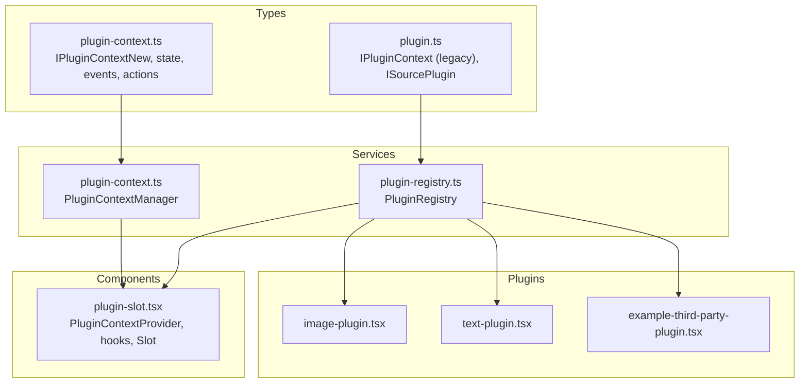
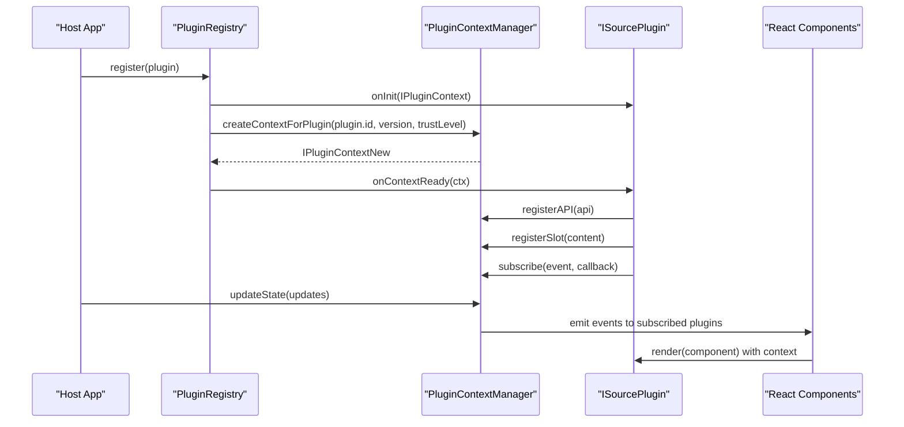
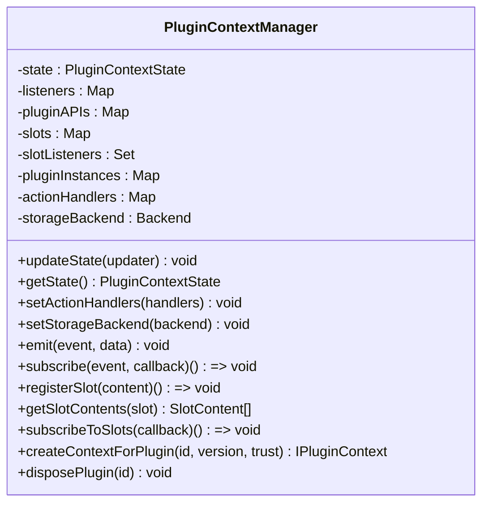
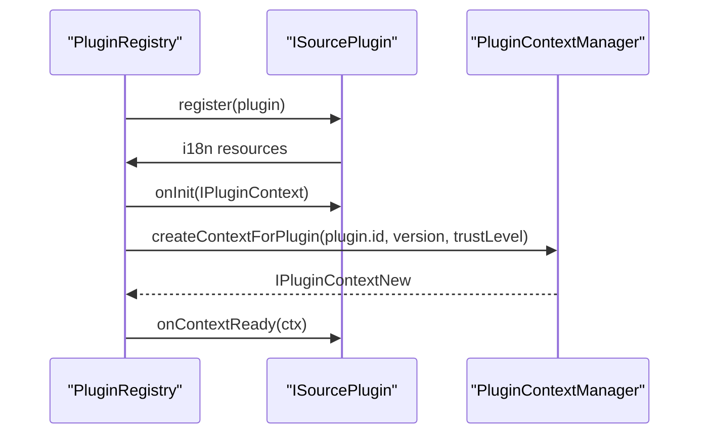
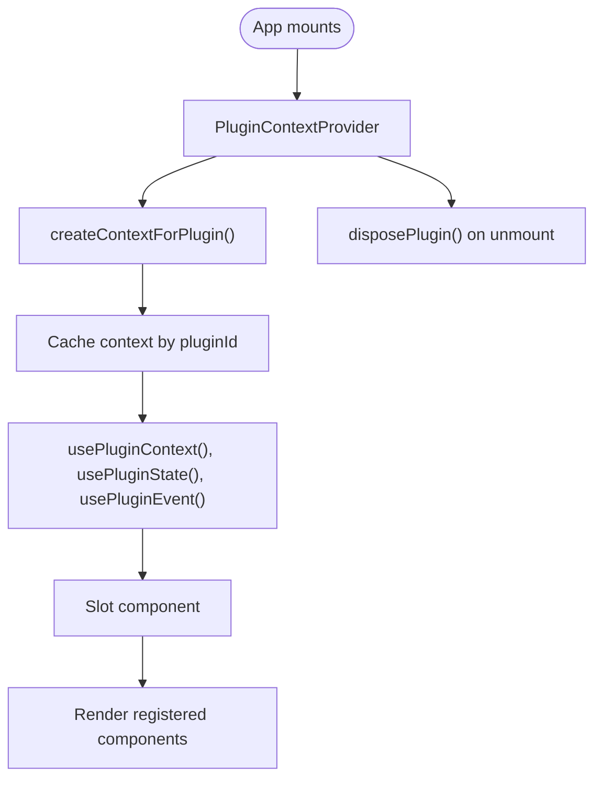
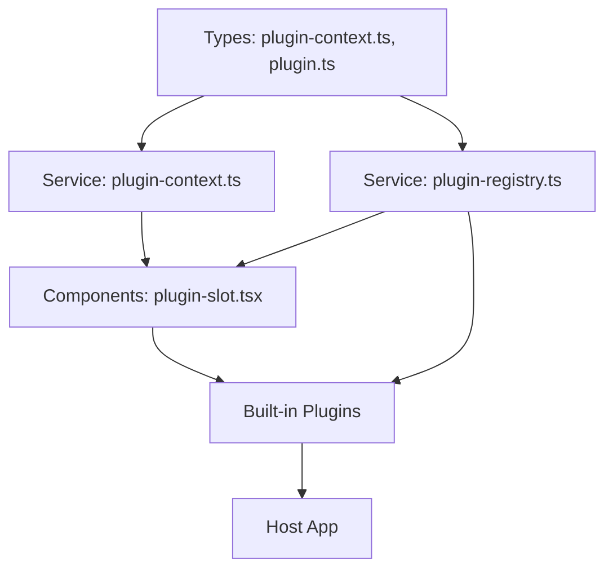

# Plugin Context API

<cite>
**Referenced Files in This Document**
- [plugin-context.ts](file://src/types/plugin-context.ts)
- [plugin-context.ts](file://src/services/plugin-context.ts)
- [plugin.ts](file://src/types/plugin.ts)
- [plugin-registry.ts](file://src/services/plugin-registry.ts)
- [plugin-slot.tsx](file://src/components/plugin-slot.tsx)
- [image-plugin.tsx](file://src/plugins/builtin/image-plugin.tsx)
- [text-plugin.tsx](file://src/plugins/builtin/text-plugin.tsx)
- [example-third-party-plugin.tsx](file://docs/plugin/example-third-party-plugin.tsx)
- [main.tsx](file://src/main.tsx)
- [App.tsx](file://src/App.tsx)
</cite>

## Table of Contents
1. [Introduction](#introduction)
2. [Project Structure](#project-structure)
3. [Core Components](#core-components)
4. [Architecture Overview](#architecture-overview)
5. [Detailed Component Analysis](#detailed-component-analysis)
6. [Dependency Analysis](#dependency-analysis)
7. [Performance Considerations](#performance-considerations)
8. [Troubleshooting Guide](#troubleshooting-guide)
9. [Conclusion](#conclusion)

## Introduction
This document provides comprehensive API documentation for the Plugin Context system, covering both the legacy IPluginContext interface and the modern IPluginContextNew interface. It explains how plugins interact with the host application through a secure, permission-controlled context that exposes application state, actions, events, and UI slot registration capabilities. The documentation covers the PluginContextManager service responsible for context creation and lifecycle management, plugin-to-plugin communication patterns, and state sharing between host and plugins.

## Project Structure
The Plugin Context system spans several modules:
- Type definitions for the context API and state structures
- A service that creates and manages plugin contexts
- A registry that integrates plugins with the context system
- React components and hooks for integrating the context into the UI
- Built-in plugins demonstrating context usage
- Example third-party plugin showcasing extensibility



**Diagram sources**
- [plugin-context.ts:321-403](file://src/types/plugin-context.ts#L321-L403)
- [plugin-context.ts:82-701](file://src/services/plugin-context.ts#L82-L701)
- [plugin.ts:39-262](file://src/types/plugin.ts#L39-L262)
- [plugin-registry.ts:5-167](file://src/services/plugin-registry.ts#L5-L167)
- [plugin-slot.tsx:1-410](file://src/components/plugin-slot.tsx#L1-L410)
- [image-plugin.tsx:1-105](file://src/plugins/builtin/image-plugin.tsx#L1-L105)
- [text-plugin.tsx:1-110](file://src/plugins/builtin/text-plugin.tsx#L1-L110)
- [example-third-party-plugin.tsx:1-173](file://docs/plugin/example-third-party-plugin.tsx#L1-L173)

**Section sources**
- [plugin-context.ts:1-438](file://src/types/plugin-context.ts#L1-L438)
- [plugin-context.ts:1-708](file://src/services/plugin-context.ts#L1-L708)
- [plugin.ts:1-267](file://src/types/plugin.ts#L1-L267)
- [plugin-registry.ts:1-168](file://src/services/plugin-registry.ts#L1-L168)
- [plugin-slot.tsx:1-410](file://src/components/plugin-slot.tsx#L1-L410)

## Core Components
This section documents the primary interfaces and services that form the Plugin Context API.

### IPluginContextNew (Modern Context)
The modern context interface provides:
- Readonly application state
- Event subscription and multi-event subscription
- Action dispatchers for scene, playback, UI, and storage
- Plugin communication via getPluginAPI/registerAPI
- UI slot registration
- Permission checking and request
- Scoped logging

Key members:
- state: Readonly application state snapshot
- subscribe(event, callback): Subscribe to a single event
- subscribeMany(events, callback): Subscribe to multiple events
- actions: SceneActions, PlaybackActions, UIActions, StorageActions
- getPluginAPI(pluginId): Retrieve another plugin's public API
- registerAPI(api): Expose this plugin's public API
- registerSlot(content): Register UI content into predefined or custom slots
- plugin: { id, version, permissions }
- hasPermission(permission): Check granted permissions
- requestPermission(permissions): Request additional permissions
- logger: { debug, info, warn, error }

Permission system:
- PluginPermission: scene:read, scene:write, playback:read, playback:control, devices:read, devices:access, storage:read, storage:write, ui:dialog, ui:toast, ui:slot, plugin:communicate
- PluginTrustLevel: builtin, verified, community, untrusted
- DEFAULT_PERMISSIONS: trust-level-based permission sets

State model:
- SceneState: currentId, items, selectedItemId, selectedItem
- PlaybackState: isPlaying, isRecording, isPreviewing
- OutputState: width, height, fps
- UIState: theme, language, sidebarVisible, propertyPanelVisible
- DevicesState: videoInputs, audioInputs, audioOutputs
- UserState: id, name, role
- PluginContextState: aggregates all above

Events and callbacks:
- PluginContextEvent: scene:* (change, item:add, item:remove, item:update, item:select, item:reorder), playback:* (start, stop, pause), devices:* (change, videoInput:change, audioInput:change), ui:* (theme:change, language:change), plugin:ready, plugin:dispose
- EventDataMap: typed payload for each event

Actions:
- SceneActions: addItem, removeItem, updateItem, selectItem, reorderItems, duplicateItem
- PlaybackActions: play, pause, stop, toggle
- UIActions: showDialog, closeDialog, showToast, setTheme, setLanguage
- StorageActions: get, set, remove, clear

Slot system:
- PredefinedSlot: toolbar-left, toolbar-center, toolbar-right, sidebar-top, sidebar-bottom, property-panel-top, property-panel-bottom, canvas-overlay, status-bar-left, status-bar-center, status-bar-right, dialogs, context-menu, add-source-dialog
- SlotContent: id, pluginId, slot, component, props, priority, visible

**Section sources**
- [plugin-context.ts:17-85](file://src/types/plugin-context.ts#L17-L85)
- [plugin-context.ts:91-143](file://src/types/plugin-context.ts#L91-L143)
- [plugin-context.ts:149-196](file://src/types/plugin-context.ts#L149-L196)
- [plugin-context.ts:202-265](file://src/types/plugin-context.ts#L202-L265)
- [plugin-context.ts:271-315](file://src/types/plugin-context.ts#L271-L315)
- [plugin-context.ts:321-403](file://src/types/plugin-context.ts#L321-L403)

### PluginContextManager (Context Service)
Responsibilities:
- Manage application state and update it
- Create secure, permissioned contexts for plugins
- Handle event emission and subscriptions
- Manage UI slots and notify subscribers
- Store plugin APIs for inter-plugin communication
- Track plugin instances and clean up on dispose

Key methods:
- updateState(updater): Merge partial state updates
- getState(): Return current state snapshot
- setActionHandlers(handlers): Inject host action handlers
- setStorageBackend(backend): Inject storage backend
- emit(event, data): Dispatch event to listeners
- subscribe(event, callback): Internal subscription
- registerSlot(content): Register UI content into slots
- getSlotContents(slot): Retrieve slot contents
- subscribeToSlots(callback): Subscribe to slot changes
- createContextForPlugin(pluginId, pluginVersion, trustLevel): Create a scoped context
- disposePlugin(pluginId): Unsubscribe, remove API, unregister slots, emit dispose

Security and permissions:
- Permission checks in actions
- Scoped logger with plugin prefix
- Permission-based slot registration

**Section sources**
- [plugin-context.ts:82-701](file://src/services/plugin-context.ts#L82-L701)

### Legacy IPluginContext (Deprecated)
The legacy context interface includes:
- canvasWidth, canvasHeight
- logger with info and error
- assetLoader with loadTexture(url)

This interface is maintained for backward compatibility and is used by older plugins.

**Section sources**
- [plugin.ts:39-49](file://src/types/plugin.ts#L39-L49)

### ISourcePlugin (Plugin Definition)
Defines plugin metadata, lifecycle, and integration points:
- id, version, name, icon, category
- engines: host and api compatibility
- propsSchema: property definitions
- i18n: internationalization resources
- Trust level and permissions for modern context
- ui: PluginUIConfig for dialogs, panels, slots
- onContextReady(ctx): Modern context hook
- api: Public API for other plugins
- sourceType, audioMixer, canvasRender, propertyPanel, addDialog, defaultLayout, streamInit
- onInit(ctx): Legacy context hook
- onUpdate(newProps), render(commonProps), onDispose()

**Section sources**
- [plugin.ts:164-262](file://src/types/plugin.ts#L164-L262)

## Architecture Overview
The Plugin Context system follows a layered architecture:
- Host application maintains state and action handlers
- PluginContextManager creates isolated contexts per plugin with permission enforcement
- Plugins receive either legacy IPluginContext or modern IPluginContextNew depending on implementation
- React components integrate contexts into the UI via Provider and hooks
- PluginRegistry manages plugin lifecycle and i18n resources



**Diagram sources**
- [plugin-registry.ts:78-118](file://src/services/plugin-registry.ts#L78-L118)
- [plugin-context.ts:333-456](file://src/services/plugin-context.ts#L333-L456)
- [plugin-slot.tsx:86-100](file://src/components/plugin-slot.tsx#L86-L100)

## Detailed Component Analysis

### IPluginContextNew Interface
The modern context interface encapsulates all interactions between plugins and the host application. It ensures security through:
- Readonly state proxies
- Permission-checked actions
- Scoped logging
- Controlled UI slot registration

```mermaid
classDiagram
class IPluginContext {
+state : PluginContextState
+subscribe(event, callback) () => void
+subscribeMany(events, callback) () => void
+actions : PluginContextActions
+getPluginAPI(pluginId) T | null
+registerAPI(api) void
+registerSlot(content) () => void
+plugin : { id, version, permissions }
+hasPermission(permission) boolean
+requestPermission(permissions) Promise<boolean>
+logger : { debug, info, warn, error }
}
class PluginContextState {
+scene : SceneState
+playback : PlaybackState
+output : OutputState
+ui : UIState
+devices : DevicesState
+user : UserState
}
class PluginContextActions {
+scene : SceneActions
+playback : PlaybackActions
+ui : UIActions
+storage : StorageActions
}
IPluginContext --> PluginContextState : "exposes"
IPluginContext --> PluginContextActions : "provides"
```

**Diagram sources**
- [plugin-context.ts:321-403](file://src/types/plugin-context.ts#L321-L403)
- [plugin-context.ts:135-143](file://src/types/plugin-context.ts#L135-L143)
- [plugin-context.ts:259-265](file://src/types/plugin-context.ts#L259-L265)

**Section sources**
- [plugin-context.ts:321-403](file://src/types/plugin-context.ts#L321-L403)

### PluginContextManager Service
The service orchestrates context creation, state management, and lifecycle:
- Creates readonly state proxies to prevent direct mutations
- Enforces permissions for all actions
- Provides scoped logging with plugin prefixes
- Manages plugin instances and cleanup
- Supports inter-plugin communication via API registry



**Diagram sources**
- [plugin-context.ts:82-701](file://src/services/plugin-context.ts#L82-L701)

**Section sources**
- [plugin-context.ts:82-701](file://src/services/plugin-context.ts#L82-L701)

### Plugin Registry Integration
The registry integrates plugins with the context system:
- Registers i18n resources for plugins
- Initializes legacy IPluginContext for older plugins
- Creates modern IPluginContextNew and invokes onContextReady
- Supports plugin discovery by source type



**Diagram sources**
- [plugin-registry.ts:78-118](file://src/services/plugin-registry.ts#L78-L118)

**Section sources**
- [plugin-registry.ts:78-118](file://src/services/plugin-registry.ts#L78-L118)

### React Integration (Provider and Hooks)
React components provide seamless integration:
- PluginContextProvider creates and caches contexts
- usePluginContextSystem gives access to manager and state
- usePluginContext retrieves a specific plugin's context
- usePluginState subscribes to state slices
- usePluginEvent subscribes to plugin events
- Slot renders registered UI content into predefined slots
- DialogSlot renders plugin dialogs



**Diagram sources**
- [plugin-slot.tsx:56-116](file://src/components/plugin-slot.tsx#L56-L116)
- [plugin-slot.tsx:138-168](file://src/components/plugin-slot.tsx#L138-L168)
- [plugin-slot.tsx:192-264](file://src/components/plugin-slot.tsx#L192-L264)

**Section sources**
- [plugin-slot.tsx:1-410](file://src/components/plugin-slot.tsx#L1-L410)

### Practical Usage Examples

#### Using Modern Context in a Plugin
- Initialize with onContextReady and log messages via ctx.logger
- Subscribe to scene and playback events
- Register UI slots for toolbar or property panel
- Expose public API for other plugins via ctx.registerAPI
- Request additional permissions when needed

References:
- [image-plugin.tsx:72-74](file://src/plugins/builtin/image-plugin.tsx#L72-L74)
- [text-plugin.tsx:77-79](file://src/plugins/builtin/text-plugin.tsx#L77-L79)

#### Creating a Third-Party Plugin
- Define plugin metadata, propsSchema, i18n resources
- Implement render function using commonProps
- Optionally define sourceType, addDialog, defaultLayout
- Register plugin via pluginRegistry.register

References:
- [example-third-party-plugin.tsx:15-173](file://docs/plugin/example-third-party-plugin.tsx#L15-L173)

#### Host Integration
- Configure action handlers for scene and UI actions
- Update state to reflect active scene and selected items
- Register built-in plugins during application startup

References:
- [App.tsx:167-187](file://src/App.tsx#L167-L187)
- [App.tsx:194-203](file://src/App.tsx#L194-L203)
- [main.tsx:14-20](file://src/main.tsx#L14-L20)

## Dependency Analysis
The Plugin Context system exhibits clear separation of concerns:
- Types define the contract between host and plugins
- Services implement the runtime behavior
- Components bridge the context to React UI
- Plugins depend on the context for state and actions



**Diagram sources**
- [plugin-context.ts:1-438](file://src/types/plugin-context.ts#L1-L438)
- [plugin-context.ts:1-708](file://src/services/plugin-context.ts#L1-L708)
- [plugin.ts:1-267](file://src/types/plugin.ts#L1-L267)
- [plugin-registry.ts:1-168](file://src/services/plugin-registry.ts#L1-L168)
- [plugin-slot.tsx:1-410](file://src/components/plugin-slot.tsx#L1-L410)

**Section sources**
- [plugin-context.ts:1-438](file://src/types/plugin-context.ts#L1-L438)
- [plugin-context.ts:1-708](file://src/services/plugin-context.ts#L1-L708)
- [plugin.ts:1-267](file://src/types/plugin.ts#L1-L267)
- [plugin-registry.ts:1-168](file://src/services/plugin-registry.ts#L1-L168)
- [plugin-slot.tsx:1-410](file://src/components/plugin-slot.tsx#L1-L410)

## Performance Considerations
- State updates: Use updateState with partial updates to minimize re-renders
- Event subscriptions: Unsubscribe in onDispose to prevent memory leaks
- Slot rendering: Prefer visible conditions to reduce unnecessary renders
- Storage: Use storage actions for persistence to avoid direct DOM manipulation
- Logging: Scoped logger helps isolate plugin logs without impacting performance

## Troubleshooting Guide
Common issues and resolutions:
- Permission errors: Verify plugin trust level and requested permissions; use hasPermission and requestPermission appropriately
- Action handler not configured: Ensure setActionHandlers is called with required handlers
- Storage backend missing: Implement and set a storage backend via setStorageBackend
- Slot content not rendering: Check slot name, priority, and visibility conditions
- Context not available: Ensure PluginContextProvider wraps the application and plugin is registered

**Section sources**
- [plugin-context.ts:532-700](file://src/services/plugin-context.ts#L532-L700)
- [plugin-slot.tsx:216-230](file://src/components/plugin-slot.tsx#L216-L230)

## Conclusion
The Plugin Context API provides a robust, secure, and extensible foundation for building plugins that integrate seamlessly with the host application. By leveraging permission systems, event-driven architecture, and UI slot registration, plugins can enhance functionality while maintaining isolation and safety. The modern IPluginContextNew interface offers comprehensive capabilities for state access, action dispatch, and inter-plugin communication, while the PluginContextManager service ensures consistent lifecycle management and security enforcement.