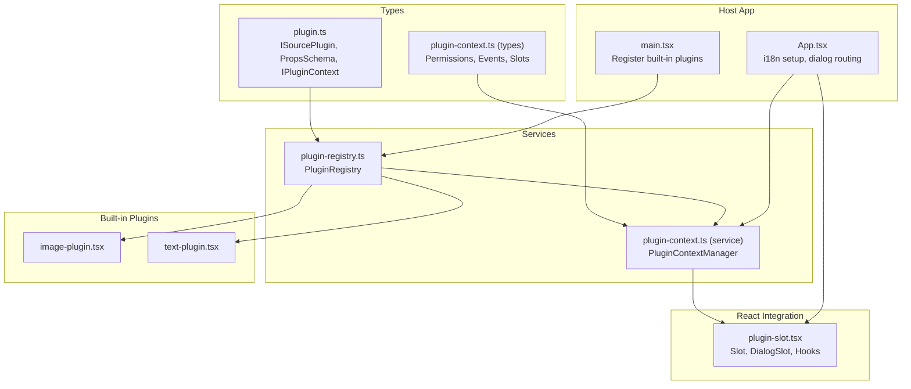
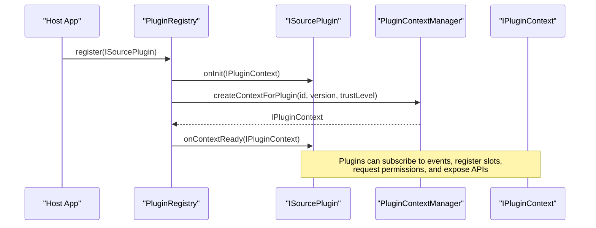
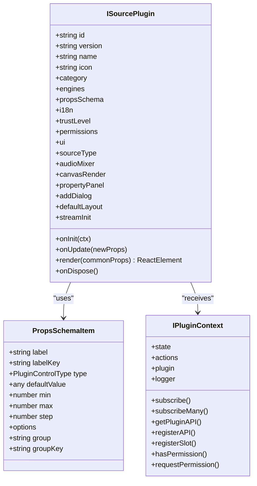
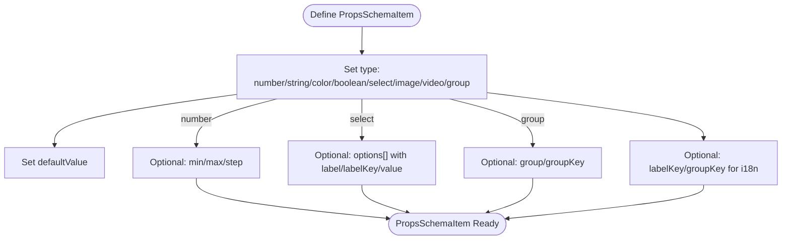
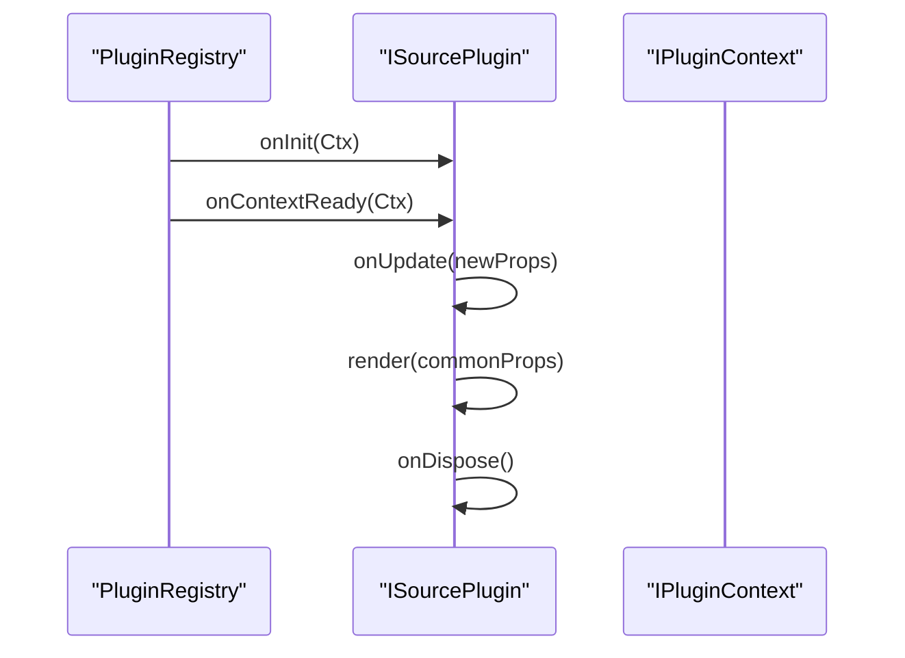
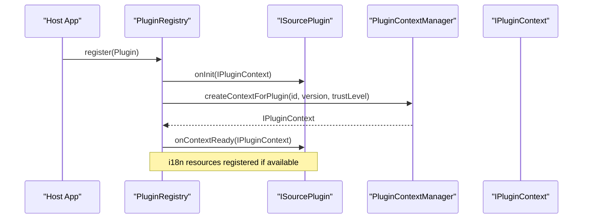
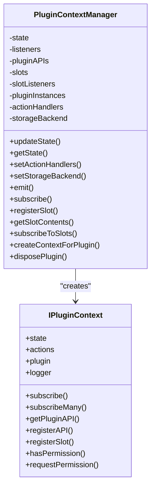
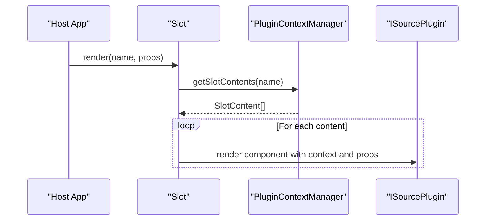
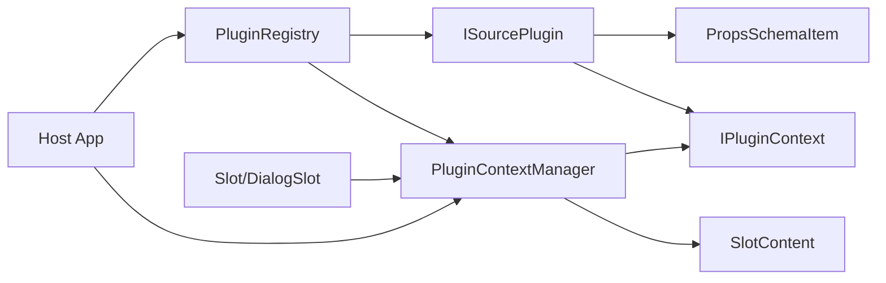

# Plugin Interface

<cite>
**Referenced Files in This Document**
- [plugin.ts](file://src/types/plugin.ts)
- [plugin-registry.ts](file://src/services/plugin-registry.ts)
- [plugin-context.ts](file://src/services/plugin-context.ts)
- [plugin-slot.tsx](file://src/components/plugin-slot.tsx)
- [plugin-context.ts (types)](file://src/types/plugin-context.ts)
- [image-plugin.tsx](file://src/plugins/builtin/image-plugin.tsx)
- [text-plugin.tsx](file://src/plugins/builtin/text-plugin.tsx)
- [example-third-party-plugin.tsx](file://docs/plugin/example-third-party-plugin.tsx)
- [main.tsx](file://src/main.tsx)
- [App.tsx](file://src/App.tsx)
</cite>

## Table of Contents
1. [Introduction](#introduction)
2. [Project Structure](#project-structure)
3. [Core Components](#core-components)
4. [Architecture Overview](#architecture-overview)
5. [Detailed Component Analysis](#detailed-component-analysis)
6. [Dependency Analysis](#dependency-analysis)
7. [Performance Considerations](#performance-considerations)
8. [Troubleshooting Guide](#troubleshooting-guide)
9. [Conclusion](#conclusion)

## Introduction
This document describes the Plugin Interface system used by the application to enable extensible, modular functionality. It covers the ISourcePlugin interface, property schema definitions, plugin lifecycle, registration through the PluginRegistry service, and integration patterns with the host application. It also documents the plugin context system that provides secure access to application state and capabilities.

## Project Structure
The plugin system spans several areas:
- Type definitions for plugin interfaces and context
- Registry service for plugin discovery and initialization
- Built-in plugin implementations
- React integration for plugin UI slots and dialogs
- Host application integration and registration

**Diagram sources**
- [plugin.ts:164-262](file://src/types/plugin.ts#L164-L262)
- [plugin-registry.ts:5-167](file://src/services/plugin-registry.ts#L5-L167)
- [plugin-context.ts:82-707](file://src/services/plugin-context.ts#L82-L707)
- [plugin-slot.tsx:1-410](file://src/components/plugin-slot.tsx#L1-L410)
- [image-plugin.tsx:1-105](file://src/plugins/builtin/image-plugin.tsx#L1-L105)
- [text-plugin.tsx:1-110](file://src/plugins/builtin/text-plugin.tsx#L1-L110)
- [main.tsx:1-29](file://src/main.tsx#L1-L29)
- [App.tsx:1-126](file://src/App.tsx#L1-L126)

**Section sources**
- [plugin.ts:1-267](file://src/types/plugin.ts#L1-L267)
- [plugin-registry.ts:1-168](file://src/services/plugin-registry.ts#L1-L168)
- [plugin-context.ts:1-708](file://src/services/plugin-context.ts#L1-L708)
- [plugin-slot.tsx:1-410](file://src/components/plugin-slot.tsx#L1-L410)
- [image-plugin.tsx:1-105](file://src/plugins/builtin/image-plugin.tsx#L1-L105)
- [text-plugin.tsx:1-110](file://src/plugins/builtin/text-plugin.tsx#L1-L110)
- [main.tsx:1-29](file://src/main.tsx#L1-L29)
- [App.tsx:1-126](file://src/App.tsx#L1-L126)

## Core Components
- ISourcePlugin: Defines the contract for source-type plugins, including metadata, compatibility, property schema, internationalization, UI integration, and lifecycle methods.
- PropsSchemaItem: Describes a single property control with type, validation constraints, and translation support.
- PluginRegistry: Manages plugin registration, i18n resource registration, and initial plugin context creation.
- PluginContextManager: Provides a secure, permission-controlled context to plugins, including state access, actions, event subscription, slot registration, and inter-plugin communication.
- React Slot System: Renders plugin UI components into predefined slots and handles dialog routing.

**Section sources**
- [plugin.ts:164-262](file://src/types/plugin.ts#L164-L262)
- [plugin.ts:20-37](file://src/types/plugin.ts#L20-L37)
- [plugin-registry.ts:78-118](file://src/services/plugin-registry.ts#L78-L118)
- [plugin-context.ts:82-707](file://src/services/plugin-context.ts#L82-L707)
- [plugin-slot.tsx:192-363](file://src/components/plugin-slot.tsx#L192-L363)

## Architecture Overview
The plugin system is composed of:
- Plugin definitions that implement ISourcePlugin
- A registry that loads plugins and initializes their contexts
- A context manager that exposes a controlled API surface to plugins
- A React layer that renders plugin UI into slots and dialogs

**Diagram sources**
- [plugin-registry.ts:78-118](file://src/services/plugin-registry.ts#L78-L118)
- [plugin-context.ts:333-456](file://src/services/plugin-context.ts#L333-L456)
- [plugin.ts:195-205](file://src/types/plugin.ts#L195-L205)

## Detailed Component Analysis

### ISourcePlugin Interface
ISourcePlugin defines the plugin contract:
- Metadata: id, version, name, icon, category
- Compatibility: engines.host and engines.api
- Properties: propsSchema as a map of PropsSchemaItem
- Internationalization: i18n with resources and supported languages
- Plugin Context Integration: trustLevel, permissions, ui configuration, onContextReady, api
- Source/UI Integration: sourceType, audioMixer, canvasRender, propertyPanel, addDialog, defaultLayout, streamInit
- Lifecycle: onInit (deprecated), onUpdate, render, onDispose

**Diagram sources**
- [plugin.ts:164-262](file://src/types/plugin.ts#L164-L262)
- [plugin.ts:20-37](file://src/types/plugin.ts#L20-L37)
- [plugin-context.ts:322-403](file://src/types/plugin-context.ts#L322-L403)

**Section sources**
- [plugin.ts:164-262](file://src/types/plugin.ts#L164-L262)
- [plugin.ts:20-37](file://src/types/plugin.ts#L20-L37)
- [plugin-context.ts:322-403](file://src/types/plugin-context.ts#L322-L403)

### PropsSchemaItem and Control Types
PropsSchemaItem supports the following control types:
- number, string, color, boolean, select, image, video, group
Validation constraints:
- min, max, step for numeric controls
Translation support:
- label and group labels can be localized via labelKey and groupKey

**Diagram sources**
- [plugin.ts:20-37](file://src/types/plugin.ts#L20-L37)

**Section sources**
- [plugin.ts:10-18](file://src/types/plugin.ts#L10-L18)
- [plugin.ts:20-37](file://src/types/plugin.ts#L20-L37)

### Plugin Lifecycle Methods
- onInit(ctx): Deprecated; use onContextReady instead. Receives a basic IPluginContext with logger and asset loader.
- onContextReady(ctx): New; receives a full IPluginContext with state, actions, permissions, and slot registration.
- onUpdate(newProps): Called when plugin properties change.
- render(commonProps): Must return a React element for canvas rendering.
- onDispose(): Called when the plugin is being cleaned up.

**Diagram sources**
- [plugin-registry.ts:105-117](file://src/services/plugin-registry.ts#L105-L117)
- [plugin.ts:251-261](file://src/types/plugin.ts#L251-L261)

**Section sources**
- [plugin-registry.ts:105-117](file://src/services/plugin-registry.ts#L105-L117)
- [plugin.ts:251-261](file://src/types/plugin.ts#L251-L261)

### Plugin Registration Process
Registration involves:
- Creating a plugin object implementing ISourcePlugin
- Calling pluginRegistry.register(plugin)
- The registry initializes the plugin with a basic IPluginContext and then creates a full context via PluginContextManager
- i18n resources are registered with the global engine if present

**Diagram sources**
- [plugin-registry.ts:78-118](file://src/services/plugin-registry.ts#L78-L118)
- [plugin-context.ts:333-456](file://src/services/plugin-context.ts#L333-L456)

**Section sources**
- [plugin-registry.ts:78-118](file://src/services/plugin-registry.ts#L78-L118)
- [main.tsx:14-20](file://src/main.tsx#L14-L20)

### Plugin Context System
The PluginContextManager provides:
- Readonly application state proxy
- Event subscription and emission
- Action handlers for scene, playback, UI, and storage
- Slot registration and discovery
- Inter-plugin API exposure and retrieval
- Permission enforcement and request flow
- Scoped logging

**Diagram sources**
- [plugin-context.ts:82-707](file://src/services/plugin-context.ts#L82-L707)
- [plugin-context.ts:322-403](file://src/types/plugin-context.ts#L322-L403)

**Section sources**
- [plugin-context.ts:82-707](file://src/services/plugin-context.ts#L82-L707)
- [plugin-context.ts:322-403](file://src/types/plugin-context.ts#L322-L403)

### React Slot System
The React integration provides:
- Slot component to render plugin UI into predefined slots
- DialogSlot to render plugin dialogs
- Hooks for subscribing to plugin events and state
- SlotContent wrapper with error boundaries

**Diagram sources**
- [plugin-slot.tsx:192-264](file://src/components/plugin-slot.tsx#L192-L264)
- [plugin-context.ts:314-324](file://src/services/plugin-context.ts#L314-L324)

**Section sources**
- [plugin-slot.tsx:192-363](file://src/components/plugin-slot.tsx#L192-L363)
- [plugin-context.ts:314-324](file://src/services/plugin-context.ts#L314-L324)

### Built-in Plugin Examples
Two built-in plugins demonstrate typical implementations:
- ImagePlugin: sourceType mapping, addDialog immediate=false, defaultLayout, propsSchema with image and number controls, i18n resources, render using react-konva Image
- TextPlugin: similar structure with string, number, and color controls

These examples illustrate:
- Defining propsSchema with localized labels
- Using sourceType to integrate with the add-source dialog
- Implementing render to produce canvas elements

**Section sources**
- [image-plugin.tsx:7-105](file://src/plugins/builtin/image-plugin.tsx#L7-L105)
- [text-plugin.tsx:4-110](file://src/plugins/builtin/text-plugin.tsx#L4-L110)

### Third-Party Plugin Example
The example-third-party-plugin demonstrates:
- How to implement ISourcePlugin without modifying core files
- Registration via pluginRegistry.register(ExampleThirdPartyPlugin)
- PropsSchema with validation constraints and translation support
- Trust level configuration and lifecycle methods

**Section sources**
- [example-third-party-plugin.tsx:15-173](file://docs/plugin/example-third-party-plugin.tsx#L15-L173)

## Dependency Analysis
Key dependencies and relationships:
- ISourcePlugin depends on PropsSchemaItem and IPluginContext
- PluginRegistry depends on PluginContextManager and I18nEngine
- PluginContextManager depends on PluginContextState, PluginContextActions, and SlotContent
- React Slot system depends on PluginContextManager and IPluginContext
- Host application integrates registry and context manager, wires i18n, and routes dialogs

**Diagram sources**
- [plugin.ts:164-262](file://src/types/plugin.ts#L164-L262)
- [plugin-registry.ts:5-167](file://src/services/plugin-registry.ts#L5-L167)
- [plugin-context.ts:82-707](file://src/services/plugin-context.ts#L82-L707)
- [plugin-slot.tsx:1-410](file://src/components/plugin-slot.tsx#L1-L410)
- [App.tsx:168-187](file://src/App.tsx#L168-L187)

**Section sources**
- [plugin.ts:164-262](file://src/types/plugin.ts#L164-L262)
- [plugin-registry.ts:5-167](file://src/services/plugin-registry.ts#L5-L167)
- [plugin-context.ts:82-707](file://src/services/plugin-context.ts#L82-L707)
- [plugin-slot.tsx:1-410](file://src/components/plugin-slot.tsx#L1-L410)
- [App.tsx:168-187](file://src/App.tsx#L168-L187)

## Performance Considerations
- Prefer minimal re-renders in plugin render functions by using memoization and stable references.
- Use numeric validation (min/max/step) to reduce invalid state transitions.
- Avoid heavy synchronous operations in onUpdate; defer expensive work to background threads or requestAnimationFrame.
- Leverage the slot system to modularize UI rendering and minimize cross-plugin coupling.
- Use the context manager’s event subscription judiciously; unsubscribe in onDispose to prevent memory leaks.

## Troubleshooting Guide
Common issues and resolutions:
- Plugin not appearing in add-source dialog: Ensure sourceType is defined and matches the plugin’s typeId.
- Missing translations: Verify i18n resources are registered with the global engine and use labelKey/groupKey appropriately.
- Permission errors: Check trustLevel and permissions; use requestPermission to prompt user approval for required actions.
- Slot rendering failures: Wrap plugin components in error boundaries; inspect console logs for slot content errors.
- Lifecycle hooks not firing: Confirm plugin is registered via pluginRegistry.register and that onContextReady is implemented for modern context access.

**Section sources**
- [plugin-registry.ts:144-157](file://src/services/plugin-registry.ts#L144-L157)
- [plugin-context.ts:433-449](file://src/services/plugin-context.ts#L433-L449)
- [plugin-slot.tsx:274-302](file://src/components/plugin-slot.tsx#L274-L302)

## Conclusion
The Plugin Interface system provides a robust, extensible framework for building modular applications. By adhering to the ISourcePlugin contract, leveraging the PluginRegistry and PluginContextManager, and integrating with the React slot system, developers can create powerful, maintainable plugins that interact safely with the host application. The built-in examples and third-party template serve as practical references for implementing new plugins.