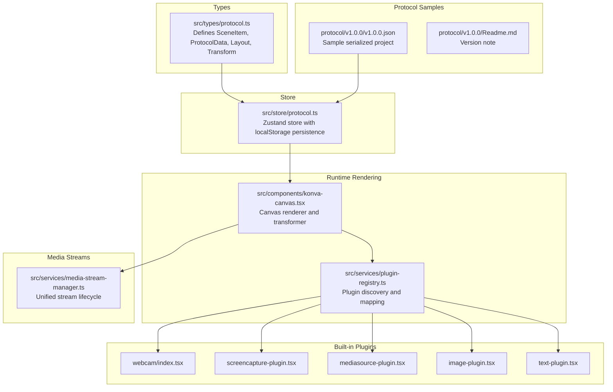
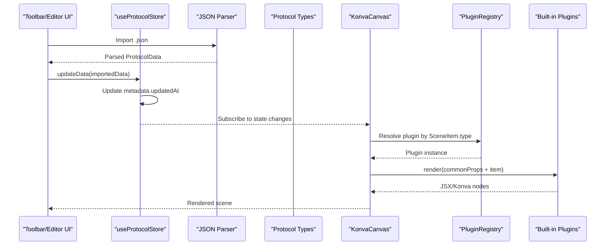
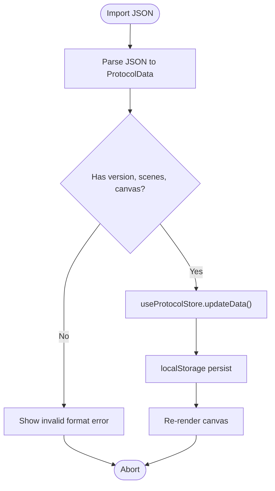
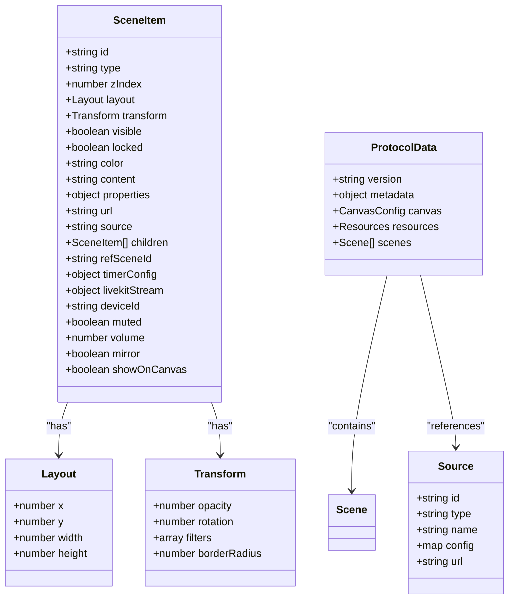
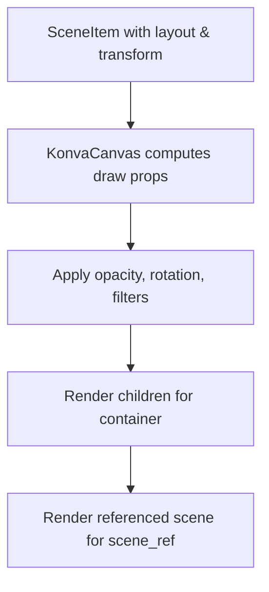
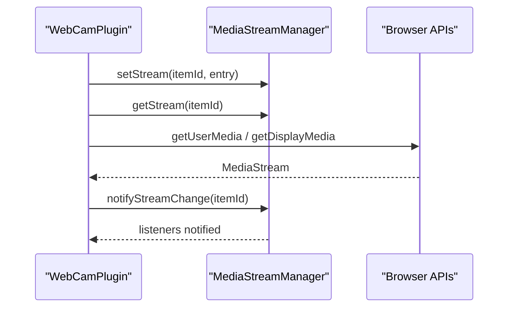
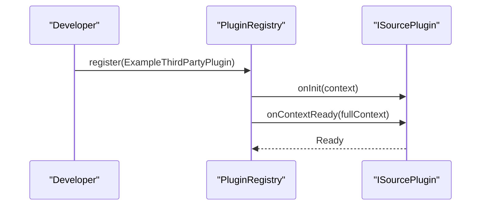
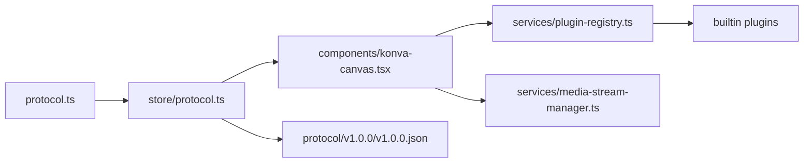

# Protocol Data Models

<cite>
**Referenced Files in This Document**
- [protocol.ts](file://src/types/protocol.ts)
- [protocol.ts](file://src/store/protocol.ts)
- [v1.0.0.json](file://protocol/v1.0.0/v1.0.0.json)
- [Readme.md](file://protocol/v1.0.0/Readme.md)
- [konva-canvas.tsx](file://src/components/konva-canvas.tsx)
- [plugin-registry.ts](file://src/services/plugin-registry.ts)
- [media-stream-manager.ts](file://src/services/media-stream-manager.ts)
- [webcam/index.tsx](file://src/plugins/builtin/webcam/index.tsx)
- [screencapture-plugin.tsx](file://src/plugins/builtin/screencapture-plugin.tsx)
- [image-plugin.tsx](file://src/plugins/builtin/image-plugin.tsx)
- [mediasource-plugin.tsx](file://src/plugins/builtin/mediasource-plugin.tsx)
- [text-plugin.tsx](file://src/plugins/builtin/text-plugin.tsx)
- [toolbar.tsx](file://src/components/toolbar.tsx)
- [example-third-party-plugin.tsx](file://docs/plugin/example-third-party-plugin.tsx)
</cite>

## Table of Contents
1. [Introduction](#introduction)
2. [Project Structure](#project-structure)
3. [Core Components](#core-components)
4. [Architecture Overview](#architecture-overview)
5. [Detailed Component Analysis](#detailed-component-analysis)
6. [Dependency Analysis](#dependency-analysis)
7. [Performance Considerations](#performance-considerations)
8. [Troubleshooting Guide](#troubleshooting-guide)
9. [Conclusion](#conclusion)
10. [Appendices](#appendices)

## Introduction
This document describes the protocol data structures and models used by LiveMixer Web for scene composition, source configuration, and runtime state management. It focuses on:
- The SceneItem interface and its transformation system
- The ProtocolData structure for project serialization and persistence
- SceneItem types for built-in source plugins (webcam, screen capture, media, text, image, audio)
- Transformation semantics (positioning, scaling, rotation, filters, borders)
- Validation rules, serialization formats, and versioning strategies
- Practical usage patterns for plugin developers and state synchronization

## Project Structure
LiveMixer Web organizes protocol definitions under shared types and stores the active project state in a Zustand store persisted to localStorage. Protocol samples are provided under a versioned directory.

**Diagram sources**
- [protocol.ts:1-114](file://src/types/protocol.ts#L1-L114)
- [protocol.ts:1-68](file://src/store/protocol.ts#L1-L68)
- [v1.0.0.json:1-244](file://protocol/v1.0.0/v1.0.0.json#L1-L244)
- [Readme.md:1-4](file://protocol/v1.0.0/Readme.md#L1-L4)
- [konva-canvas.tsx:1-200](file://src/components/konva-canvas.tsx#L1-L200)
- [plugin-registry.ts:1-168](file://src/services/plugin-registry.ts#L1-L168)
- [media-stream-manager.ts:1-323](file://src/services/media-stream-manager.ts#L1-L323)
- [webcam/index.tsx:1-478](file://src/plugins/builtin/webcam/index.tsx#L1-L478)
- [screencapture-plugin.tsx:1-464](file://src/plugins/builtin/screencapture-plugin.tsx#L1-L464)
- [mediasource-plugin.tsx:1-307](file://src/plugins/builtin/mediasource-plugin.tsx#L1-L307)
- [image-plugin.tsx:1-105](file://src/plugins/builtin/image-plugin.tsx#L1-L105)
- [text-plugin.tsx:1-110](file://src/plugins/builtin/text-plugin.tsx#L1-L110)

**Section sources**
- [protocol.ts:1-114](file://src/types/protocol.ts#L1-L114)
- [protocol.ts:1-68](file://src/store/protocol.ts#L1-L68)
- [v1.0.0.json:1-244](file://protocol/v1.0.0/v1.0.0.json#L1-L244)
- [Readme.md:1-4](file://protocol/v1.0.0/Readme.md#L1-L4)

## Core Components
This section documents the primary protocol data structures and their roles.

- ProtocolData
  - Purpose: Root project container for serialization and persistence
  - Fields:
    - version: Semantic version string
    - metadata: name, createdAt, updatedAt
    - canvas: width, height
    - resources: optional collection of sources
    - scenes: array of scenes
  - Persistence: Created by default store factory and updated with timestamps on edits

- Scene and SceneItem
  - Scene: id, name, active flag, items[]
  - SceneItem: identity, type, z-index, layout, transform, visibility/locking flags, and type-specific properties

- Layout and Transform
  - Layout: x, y, width, height
  - Transform: opacity, rotation, filters, borderRadius

- Source and Resources
  - Source: id, type, name, optional config map and url
  - Resources: sources[] for reusable source definitions

**Section sources**
- [protocol.ts:1-114](file://src/types/protocol.ts#L1-L114)
- [protocol.ts:5-28](file://src/store/protocol.ts#L5-L28)

## Architecture Overview
The protocol architecture connects data definitions, state management, rendering, and plugin systems.

**Diagram sources**
- [toolbar.tsx:14-48](file://src/components/toolbar.tsx#L14-L48)
- [protocol.ts:44-54](file://src/store/protocol.ts#L44-L54)
- [protocol.ts:103-114](file://src/types/protocol.ts#L103-L114)
- [konva-canvas.tsx:1-200](file://src/components/konva-canvas.tsx#L1-L200)
- [plugin-registry.ts:144-157](file://src/services/plugin-registry.ts#L144-L157)

## Detailed Component Analysis

### SceneItem Interface and Transformation System
SceneItem encapsulates all visual and behavioral properties for a compositional element. It includes:
- Positioning and sizing via Layout (x, y, width, height)
- Transformations via Transform (opacity, rotation, filters, borderRadius)
- Visibility and locking flags
- Type-specific properties:
  - color, content, properties (fontSize, color) for text
  - url for image/media
  - source for video/screen/window
  - children for containers
  - refSceneId for scene references
  - timerConfig for timers/clocks
  - livekitStream for LiveKit streams
  - deviceId, muted, volume, mirror for webcam
  - showOnCanvas for audio input

Transformation semantics:
- Positioning: x, y define top-left placement; width, height define bounds
- Rotation: degrees applied around the center of the item
- Opacity: normalized 0..1
- Filters: array of { name, value } where name identifies filter type and value is numeric
- BorderRadius: pixels applied to corners

Validation rules observed in code:
- Layout requires finite numbers for x, y, width, height
- Transform fields are optional; defaults apply in rendering
- SceneItem.type accepts a union of known types plus arbitrary strings for extensibility
- Container items may nest children; scene_ref references another scene by id
- Timer/clock modes constrained to predefined values
- LiveKit stream source constrained to camera or screen_share

Serialization format:
- JSON representation matches ProtocolData and SceneItem shapes
- Version field present at root
- Optional resources block for reusable sources
- Scenes include items with type-specific payloads

Migration strategies:
- Version field enables targeted parsing and transformation
- Unknown SceneItem.type values are tolerated via string union fallback
- Backward compatibility can be achieved by mapping legacy types to current ones during import

**Section sources**
- [protocol.ts:20-82](file://src/types/protocol.ts#L20-L82)
- [v1.0.0.json:38-244](file://protocol/v1.0.0/v1.0.0.json#L38-L244)

### ProtocolData and State Management
ProtocolData is the root model for projects. The Zustand store:
- Provides a default factory with initial canvas size and empty scenes/resources
- Updates metadata.updatedAt on every write
- Persists to localStorage keyed by a stable name

Usage patterns:
- Import/export via file dialogs
- Reset to default project template
- Merge imported data while preserving metadata timestamps

**Diagram sources**
- [toolbar.tsx:14-48](file://src/components/toolbar.tsx#L14-L48)
- [protocol.ts:44-67](file://src/store/protocol.ts#L44-L67)

**Section sources**
- [protocol.ts:5-28](file://src/store/protocol.ts#L5-L28)
- [toolbar.tsx:14-48](file://src/components/toolbar.tsx#L14-L48)

### SceneItem Types and Built-in Plugins
The following SceneItem types are supported by built-in plugins:

- color: Solid color background
- image: Static image asset
- media: Video/audio file playback
- text: On-canvas text with font and color
- screen: Screen/window capture
- window: Window capture (type present in schema)
- video_input: Webcam source
- audio_input: Audio-only input
- audio_output: Audio output (type present in schema)
- container: Grouping items with children
- scene_ref: Reference to another scene
- timer: Countdown/countup timer
- clock: Real-time clock
- livekit_stream: LiveKit participant stream

Plugin behaviors:
- Webcam plugin manages device selection, mirroring, opacity, and audio muting
- Screen capture plugin handles browser permission prompts and re-selection
- Media source plugin supports video frames or audio-only mode with looping and volume
- Image plugin renders static images with optional border radius
- Text plugin renders styled text with configurable font size and color

**Diagram sources**
- [protocol.ts:1-114](file://src/types/protocol.ts#L1-L114)

**Section sources**
- [protocol.ts:20-82](file://src/types/protocol.ts#L20-L82)
- [webcam/index.tsx:110-478](file://src/plugins/builtin/webcam/index.tsx#L110-L478)
- [screencapture-plugin.tsx:55-464](file://src/plugins/builtin/screencapture-plugin.tsx#L55-L464)
- [mediasource-plugin.tsx:13-307](file://src/plugins/builtin/mediasource-plugin.tsx#L13-L307)
- [image-plugin.tsx:7-105](file://src/plugins/builtin/image-plugin.tsx#L7-L105)
- [text-plugin.tsx:4-110](file://src/plugins/builtin/text-plugin.tsx#L4-L110)

### Transformation System Details
Transform properties are consumed by rendering layers:
- Positioning: x, y, width, height define bounding box
- Rotation: applied in degrees
- Opacity: alpha blending
- Filters: named filter/value pairs (e.g., brightness)
- Border radius: corner rounding

Rendering examples:
- KonvaCanvas reads transform fields to apply opacity, rotation, and corner radius
- Plugins read item-level properties and transform overrides for consistent rendering

**Diagram sources**
- [konva-canvas.tsx:548-581](file://src/components/konva-canvas.tsx#L548-L581)
- [protocol.ts:13-18](file://src/types/protocol.ts#L13-L18)

**Section sources**
- [protocol.ts:13-18](file://src/types/protocol.ts#L13-L18)
- [konva-canvas.tsx:548-581](file://src/components/konva-canvas.tsx#L548-L581)

### Media Streams and Source Configuration
MediaStreamManager centralizes stream lifecycle:
- Register/update/remove streams per item
- Notify listeners of changes
- Enumerate devices with permission handling
- Support pending stream handoff between dialogs and app

Webcam and screen capture plugins integrate with MediaStreamManager to:
- Cache streams and associated video elements
- Respect muted/volume settings
- Reflect device labels and titles
- Handle stream end events

**Diagram sources**
- [media-stream-manager.ts:56-91](file://src/services/media-stream-manager.ts#L56-L91)
- [webcam/index.tsx:310-335](file://src/plugins/builtin/webcam/index.tsx#L310-L335)
- [screencapture-plugin.tsx:219-258](file://src/plugins/builtin/screencapture-plugin.tsx#L219-L258)

**Section sources**
- [media-stream-manager.ts:18-323](file://src/services/media-stream-manager.ts#L18-L323)
- [webcam/index.tsx:28-108](file://src/plugins/builtin/webcam/index.tsx#L28-L108)
- [screencapture-plugin.tsx:12-53](file://src/plugins/builtin/screencapture-plugin.tsx#L12-L53)

### Plugin Development Examples
Third-party plugin registration and rendering:
- Define plugin id, version, category, engines, sourceType mapping, propsSchema, i18n, and render function
- Register via pluginRegistry.register()

**Diagram sources**
- [example-third-party-plugin.tsx:15-173](file://docs/plugin/example-third-party-plugin.tsx#L15-L173)
- [plugin-registry.ts:78-118](file://src/services/plugin-registry.ts#L78-L118)

**Section sources**
- [example-third-party-plugin.tsx:15-173](file://docs/plugin/example-third-party-plugin.tsx#L15-L173)
- [plugin-registry.ts:78-118](file://src/services/plugin-registry.ts#L78-L118)

## Dependency Analysis
The protocol system exhibits clear separation of concerns:
- Types define the canonical schema
- Store persists and updates the active project
- Renderer resolves plugins and renders items
- Plugins depend on shared props and transforms
- MediaStreamManager decouples stream lifecycle from UI

**Diagram sources**
- [protocol.ts:1-114](file://src/types/protocol.ts#L1-L114)
- [protocol.ts:1-68](file://src/store/protocol.ts#L1-L68)
- [konva-canvas.tsx:1-200](file://src/components/konva-canvas.tsx#L1-L200)
- [plugin-registry.ts:1-168](file://src/services/plugin-registry.ts#L1-L168)
- [media-stream-manager.ts:1-323](file://src/services/media-stream-manager.ts#L1-L323)
- [v1.0.0.json:1-244](file://protocol/v1.0.0/v1.0.0.json#L1-L244)

**Section sources**
- [protocol.ts:1-114](file://src/types/protocol.ts#L1-L114)
- [protocol.ts:1-68](file://src/store/protocol.ts#L1-L68)
- [konva-canvas.tsx:1-200](file://src/components/konva-canvas.tsx#L1-L200)
- [plugin-registry.ts:1-168](file://src/services/plugin-registry.ts#L1-L168)
- [media-stream-manager.ts:1-323](file://src/services/media-stream-manager.ts#L1-L323)
- [v1.0.0.json:1-244](file://protocol/v1.0.0/v1.0.0.json#L1-L244)

## Performance Considerations
- Prefer batch drawing and continuous rendering loops only when necessary (e.g., captureStream scenarios)
- Minimize unnecessary re-renders by leveraging memoization in plugin renderers
- Cache media elements and streams to avoid repeated getUserMedia/getDisplayMedia calls
- Use transform properties (opacity, rotation, filters) judiciously; complex filters can impact performance
- Keep scenes reasonably sized; large canvases and deep hierarchies increase draw cost

## Troubleshooting Guide
Common issues and resolutions:
- Import errors: Ensure the imported file is valid JSON and contains version, scenes, and canvas fields
- Stream failures: Verify browser permissions and device availability; handle ended tracks gracefully
- Rendering anomalies: Confirm transform values are within expected ranges and filters are supported
- Plugin not appearing: Check plugin sourceType mapping and registration via pluginRegistry

**Section sources**
- [toolbar.tsx:24-44](file://src/components/toolbar.tsx#L24-L44)
- [media-stream-manager.ts:150-257](file://src/services/media-stream-manager.ts#L150-L257)

## Conclusion
LiveMixer Web’s protocol model provides a robust, extensible foundation for scene composition and plugin-driven media sources. The SceneItem interface, combined with Layout and Transform, offers precise control over positioning, appearance, and behavior. The ProtocolData structure and Zustand store enable reliable serialization and persistence. Built-in plugins demonstrate practical usage patterns for webcam, screen capture, media playback, images, and text. By adhering to the schema and leveraging the plugin registry and media stream manager, developers can build powerful extensions that integrate seamlessly with the platform.

## Appendices

### Appendix A: Protocol Versioning Notes
- The protocol v1.0.0 sample demonstrates a complete project structure with scenes, transitions, and source states
- Version field allows for future migrations and schema evolution

**Section sources**
- [v1.0.0.json:1-244](file://protocol/v1.0.0/v1.0.0.json#L1-L244)
- [Readme.md:1-4](file://protocol/v1.0.0/Readme.md#L1-L4)