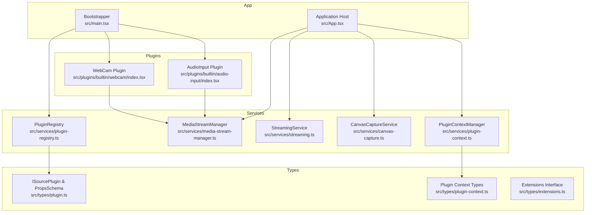
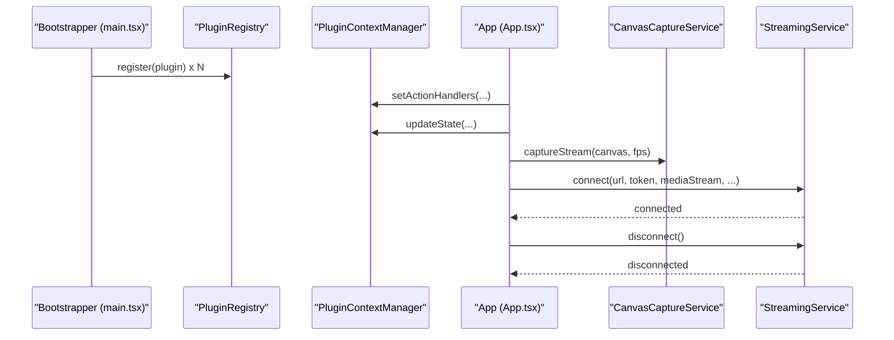
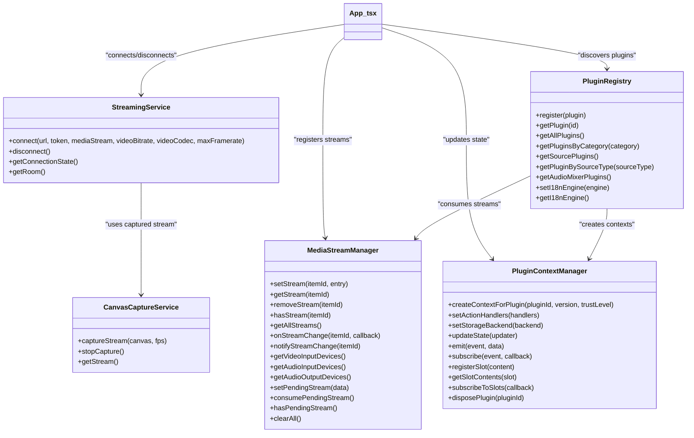

# Service Interfaces

<cite>
**Referenced Files in This Document**
- [media-stream-manager.ts](file://src/services/media-stream-manager.ts)
- [plugin-registry.ts](file://src/services/plugin-registry.ts)
- [plugin-context.ts](file://src/services/plugin-context.ts)
- [streaming.ts](file://src/services/streaming.ts)
- [canvas-capture.ts](file://src/services/canvas-capture.ts)
- [plugin.ts](file://src/types/plugin.ts)
- [plugin-context.ts](file://src/types/plugin-context.ts)
- [extensions.ts](file://src/types/extensions.ts)
- [main.tsx](file://src/main.tsx)
- [App.tsx](file://src/App.tsx)
- [webcam/index.tsx](file://src/plugins/builtin/webcam/index.tsx)
- [audio-input/index.tsx](file://src/plugins/builtin/audio-input/index.tsx)
</cite>

## Table of Contents
1. [Introduction](#introduction)
2. [Project Structure](#project-structure)
3. [Core Components](#core-components)
4. [Architecture Overview](#architecture-overview)
5. [Detailed Component Analysis](#detailed-component-analysis)
6. [Dependency Analysis](#dependency-analysis)
7. [Performance Considerations](#performance-considerations)
8. [Troubleshooting Guide](#troubleshooting-guide)
9. [Conclusion](#conclusion)

## Introduction
This document provides comprehensive API documentation for the core service interfaces that power the LiveMixer web application. It focuses on three primary service domains:

- MediaStream management for unified stream registration, device enumeration, permission handling, and event subscription patterns
- Plugin lifecycle management, discovery, and communication coordination via the Plugin Registry and Plugin Context Manager
- LiveKit streaming integration for room connections, track publishing, and connection management

The documentation covers method contracts, error handling strategies, initialization patterns, dependency injection, inter-service communication, and practical extension guidelines for building or replacing service implementations.

## Project Structure
The services are organized under the `src/services` directory and integrate with plugin definitions and type definitions under `src/types`. The main application bootstraps plugins and wires services together.

**Diagram sources**
- [media-stream-manager.ts:1-323](file://src/services/media-stream-manager.ts#L1-L323)
- [plugin-registry.ts:1-168](file://src/services/plugin-registry.ts#L1-L168)
- [plugin-context.ts:1-708](file://src/services/plugin-context.ts#L1-L708)
- [streaming.ts:1-177](file://src/services/streaming.ts#L1-L177)
- [canvas-capture.ts:1-48](file://src/services/canvas-capture.ts#L1-L48)
- [plugin.ts:164-262](file://src/types/plugin.ts#L164-L262)
- [plugin-context.ts:321-403](file://src/types/plugin-context.ts#L321-L403)
- [extensions.ts:26-124](file://src/types/extensions.ts#L26-L124)
- [main.tsx:1-29](file://src/main.tsx#L1-L29)
- [App.tsx:1-1026](file://src/App.tsx#L1-L1026)
- [webcam/index.tsx:110-478](file://src/plugins/builtin/webcam/index.tsx#L110-L478)
- [audio-input/index.tsx:105-555](file://src/plugins/builtin/audio-input/index.tsx#L105-L555)

**Section sources**
- [main.tsx:14-20](file://src/main.tsx#L14-L20)
- [App.tsx:24-30](file://src/App.tsx#L24-L30)

## Core Components

### MediaStreamManager
A centralized service for managing MediaStream lifecycles, device enumeration, and event-driven updates. It provides:
- Stream registration, retrieval, removal, and existence checks
- Event subscription for per-item stream changes
- Device enumeration with permission-aware flows for video, audio input, and audio output
- Pending stream handling for dialog-to-app communication

Key capabilities:
- Unified stream storage keyed by item identifiers
- Change notification mechanism with safe callback execution
- Permission handling for device enumeration and getUserMedia flows
- Pending stream buffer for cross-component coordination

**Section sources**
- [media-stream-manager.ts:39-323](file://src/services/media-stream-manager.ts#L39-L323)

### PluginRegistry
Manages plugin lifecycle, discovery, and internationalization registration. Responsibilities include:
- Plugin registration and metadata management
- i18n resource registration with layered override support
- Discovery by source type and category
- Audio mixer plugin filtering
- Context creation for plugins via PluginContextManager

**Section sources**
- [plugin-registry.ts:5-168](file://src/services/plugin-registry.ts#L5-L168)

### PluginContextManager
Provides a secure, permission-controlled context for plugins, enabling:
- Readonly application state exposure
- Event subscription and emission
- Action dispatch with permission checks
- Slot registration for UI composition
- Plugin API registry for inter-plugin communication
- Storage backend integration

**Section sources**
- [plugin-context.ts:82-708](file://src/services/plugin-context.ts#L82-L708)

### StreamingService
Handles LiveKit integration for publishing canvas-rendered streams:
- Room connection with event handling
- Track publishing with configurable encoding parameters
- Audio track publishing when present
- Disconnection and cleanup routines
- Connection state tracking

**Section sources**
- [streaming.ts:6-177](file://src/services/streaming.ts#L6-L177)

### CanvasCaptureService
Creates MediaStreams from HTMLCanvasElement for streaming:
- Canvas capture with configurable FPS
- Stream lifecycle management
- Safe stop and retrieval utilities

**Section sources**
- [canvas-capture.ts:5-48](file://src/services/canvas-capture.ts#L5-L48)

## Architecture Overview
The application initializes built-in plugins and wires services together. The App component orchestrates:
- Plugin registry population
- i18n engine setup and override application
- Plugin context action handlers and state synchronization
- Canvas capture for streaming
- LiveKit push/pull operations

**Diagram sources**
- [main.tsx:14-20](file://src/main.tsx#L14-L20)
- [App.tsx:167-187](file://src/App.tsx#L167-L187)
- [App.tsx:725-788](file://src/App.tsx#L725-L788)
- [canvas-capture.ts:14-24](file://src/services/canvas-capture.ts#L14-L24)
- [streaming.ts:20-124](file://src/services/streaming.ts#L20-L124)

## Detailed Component Analysis

### MediaStreamManager API
Methods and contracts:
- setStream(itemId, entry): Registers or updates a stream entry; notifies listeners
- getStream(itemId): Retrieves a stream entry or null
- removeStream(itemId): Stops tracks, detaches video element, deletes entry, notifies listeners
- hasStream(itemId): Checks if an active stream exists for the item
- getAllStreams(): Returns a copy of all active streams
- onStreamChange(itemId, callback): Subscribes to per-item stream change events; returns unsubscribe function
- notifyStreamChange(itemId): Triggers callbacks safely
- getVideoInputDevices(): Enumerates video input devices with permission handling
- getAudioInputDevices(): Enumerates audio input devices with permission handling
- getAudioOutputDevices(): Enumerates audio output devices
- setPendingStream(data): Stores pending stream data for dialog-to-app handoff
- consumePendingStream(): Retrieves and clears pending stream data
- hasPendingStream(): Checks for pending stream presence
- clearAll(): Stops and removes all streams and clears pending data

Error handling:
- Device enumeration catches and logs errors, returning empty arrays
- Stream change callbacks are executed within try/catch blocks
- Permission flows handle getUserMedia failures gracefully

Integration patterns:
- Plugins use mediaStreamManager for stream caching and change notifications
- App consumes pending streams from dialogs to create scene items

**Section sources**
- [media-stream-manager.ts:53-301](file://src/services/media-stream-manager.ts#L53-L301)

### PluginRegistry API
Methods and contracts:
- setI18nEngine(engine): Sets i18n engine and registers plugin resources
- getI18nEngine(): Returns current i18n engine
- register(plugin): Registers plugin, registers i18n resources, creates plugin context, invokes onInit/onContextReady
- getPlugin(id): Retrieves plugin by ID
- getAllPlugins(): Returns all registered plugins
- getPluginsByCategory(category): Filters plugins by category
- getSourcePlugins(): Returns plugins with source type mapping
- getPluginBySourceType(sourceType): Resolves plugin by direct ID or sourceType.typeId
- getAudioMixerPlugins(): Returns plugins supporting audio mixing

Plugin integration:
- Uses pluginContextManager to create plugin contexts with scoped permissions and actions
- Supports legacy IPluginContext and modern IPluginContextNew APIs

**Section sources**
- [plugin-registry.ts:78-165](file://src/services/plugin-registry.ts#L78-L165)

### PluginContextManager API
Core responsibilities:
- State management: createInitialState(), updateState(), getState()
- Action handlers: setActionHandlers(), setStorageBackend()
- Event system: emit(), subscribe(), subscribeMany()
- Slot system: registerSlot(), getSlotContents(), subscribeToSlots()
- Context creation: createContextForPlugin() with permission enforcement
- Plugin lifecycle: disposePlugin()

Permission model:
- Default permissions by trust level (builtin, verified, community, untrusted)
- Permission checking and request flow
- Scoped logging and action validation

Inter-plugin communication:
- getPluginAPI() and registerAPI() guarded by plugin:communicate permission

**Section sources**
- [plugin-context.ts:138-708](file://src/services/plugin-context.ts#L138-L708)

### StreamingService API
Connection and publishing:
- connect(url, token, mediaStream, videoBitrate?, videoCodec?, maxFramerate?): Establishes LiveKit room connection, applies video track constraints, publishes video track with encoding parameters, conditionally publishes audio track
- disconnect(): Unpublishes tracks, stops video track, disconnects room, cleans up state
- getConnectionState(): Returns connection state flag
- getRoom(): Returns room instance

Error handling:
- Throws descriptive errors for missing URL/token, no video track, and connection failures
- Cleans up on errors and resets state

**Section sources**
- [streaming.ts:20-173](file://src/services/streaming.ts#L20-L173)

### CanvasCaptureService API
- captureStream(canvas, fps): Creates MediaStream from canvas; throws on failure
- stopCapture(): Stops all tracks and clears stream
- getStream(): Returns current stream or null

**Section sources**
- [canvas-capture.ts:14-43](file://src/services/canvas-capture.ts#L14-L43)

### Plugin Types and Contracts
ISourcePlugin contract:
- Metadata: id, version, name, icon, category
- Engine compatibility: engines.host, engines.api
- Properties: propsSchema
- Internationalization: i18n
- Context integration: trustLevel, permissions, ui, onContextReady, api
- Source type mapping: sourceType
- Audio mixer: audioMixer
- Canvas render: canvasRender
- Property panel: propertyPanel
- Add dialog: addDialog
- Default layout: defaultLayout
- Stream initialization: streamInit
- Lifecycle: onInit, onUpdate, render, onDispose

PluginContext types:
- Permission system: PluginPermission, PluginTrustLevel, PluginPermissionConfig, DEFAULT_PERMISSIONS
- State: PluginContextState (scene, playback, output, ui, devices, user)
- Events: PluginContextEvent, EventDataMap
- Actions: SceneActions, PlaybackActions, UIActions, StorageActions
- Slots: SlotName, SlotContent
- Main context: IPluginContext with state, subscribe, subscribeMany, actions, getPluginAPI, registerAPI, registerSlot, plugin info, permission helpers, logger

**Section sources**
- [plugin.ts:164-262](file://src/types/plugin.ts#L164-L262)
- [plugin-context.ts:17-85](file://src/types/plugin-context.ts#L17-L85)
- [plugin-context.ts:136-143](file://src/types/plugin-context.ts#L136-L143)
- [plugin-context.ts:149-191](file://src/types/plugin-context.ts#L149-L191)
- [plugin-context.ts:202-265](file://src/types/plugin-context.ts#L202-L265)
- [plugin-context.ts:271-315](file://src/types/plugin-context.ts#L271-L315)
- [plugin-context.ts:321-403](file://src/types/plugin-context.ts#L321-L403)

### Extension Points and Initialization Patterns
- Plugin bootstrap: Built-in plugins registered in main.tsx
- i18n integration: Extensions interface supports custom i18n engine and overrides
- Plugin context wiring: App sets action handlers and updates state for plugin context
- Streaming orchestration: App captures canvas stream and connects to LiveKit via StreamingService

**Section sources**
- [main.tsx:14-20](file://src/main.tsx#L14-L20)
- [extensions.ts:106-124](file://src/types/extensions.ts#L106-L124)
- [App.tsx:167-187](file://src/App.tsx#L167-L187)
- [App.tsx:725-788](file://src/App.tsx#L725-L788)

### Inter-Service Communication Patterns
- App to MediaStreamManager: Stream registration, change notifications, pending stream consumption
- App to StreamingService: Canvas capture, room connection, disconnection
- PluginRegistry to PluginContextManager: Context creation and lifecycle
- Plugins to MediaStreamManager: Stream caching and device enumeration

**Section sources**
- [App.tsx:344-362](file://src/App.tsx#L344-L362)
- [webcam/index.tsx:260-337](file://src/plugins/builtin/webcam/index.tsx#L260-L337)
- [audio-input/index.tsx:308-376](file://src/plugins/builtin/audio-input/index.tsx#L308-L376)

## Dependency Analysis

**Diagram sources**
- [media-stream-manager.ts:39-323](file://src/services/media-stream-manager.ts#L39-L323)
- [plugin-registry.ts:5-168](file://src/services/plugin-registry.ts#L5-L168)
- [plugin-context.ts:82-708](file://src/services/plugin-context.ts#L82-L708)
- [streaming.ts:6-177](file://src/services/streaming.ts#L6-L177)
- [canvas-capture.ts:5-48](file://src/services/canvas-capture.ts#L5-L48)
- [App.tsx:24-30](file://src/App.tsx#L24-L30)

**Section sources**
- [plugin-registry.ts:78-118](file://src/services/plugin-registry.ts#L78-L118)
- [plugin-context.ts:333-456](file://src/services/plugin-context.ts#L333-L456)
- [streaming.ts:20-124](file://src/services/streaming.ts#L20-L124)
- [canvas-capture.ts:14-43](file://src/services/canvas-capture.ts#L14-L43)

## Performance Considerations
- Stream lifecycle: Always stop tracks and detach video elements when removing streams to prevent memory leaks
- Permission flows: Minimize getUserMedia calls; cache streams when device IDs match
- Encoding parameters: Tune videoBitrate, videoCodec, and maxFramerate to balance quality and bandwidth
- Event callbacks: Ensure callbacks are lightweight; heavy operations should be deferred
- Canvas capture: Stop continuous rendering when not streaming to reduce CPU usage

## Troubleshooting Guide
Common issues and resolutions:
- Device enumeration returns empty lists: Verify browser permissions and try requesting getUserMedia before enumerating
- Stream change callbacks failing: Callbacks are wrapped in try/catch; inspect console for errors
- LiveKit connection errors: Ensure URL and token are provided; check network connectivity and server availability
- Audio/video publishing failures: Confirm presence of tracks; audio-only streams are supported
- Plugin context permission denials: Review trust level and requested permissions; builtin plugins auto-approve where applicable

**Section sources**
- [media-stream-manager.ts:150-273](file://src/services/media-stream-manager.ts#L150-L273)
- [streaming.ts:119-124](file://src/services/streaming.ts#L119-L124)
- [plugin-context.ts:433-449](file://src/services/plugin-context.ts#L433-L449)

## Conclusion
The service interfaces provide a robust foundation for media stream management, plugin lifecycle orchestration, and LiveKit streaming integration. By adhering to the documented contracts, error handling strategies, and initialization patterns, developers can extend or replace implementations while maintaining compatibility and reliability. The modular design enables clear separation of concerns, secure plugin contexts, and efficient inter-service communication.