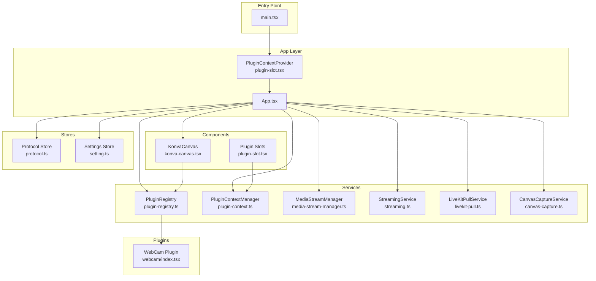
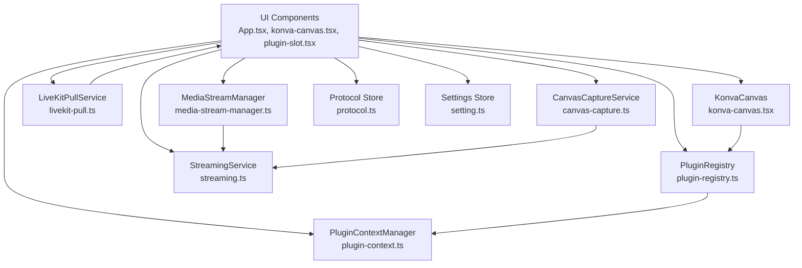
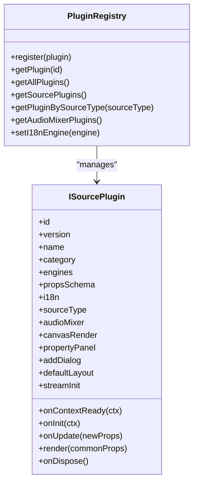
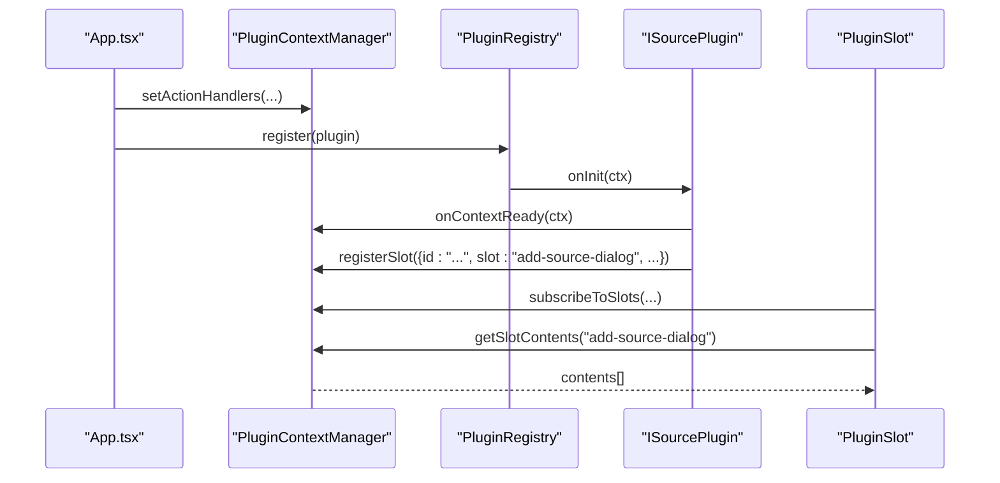
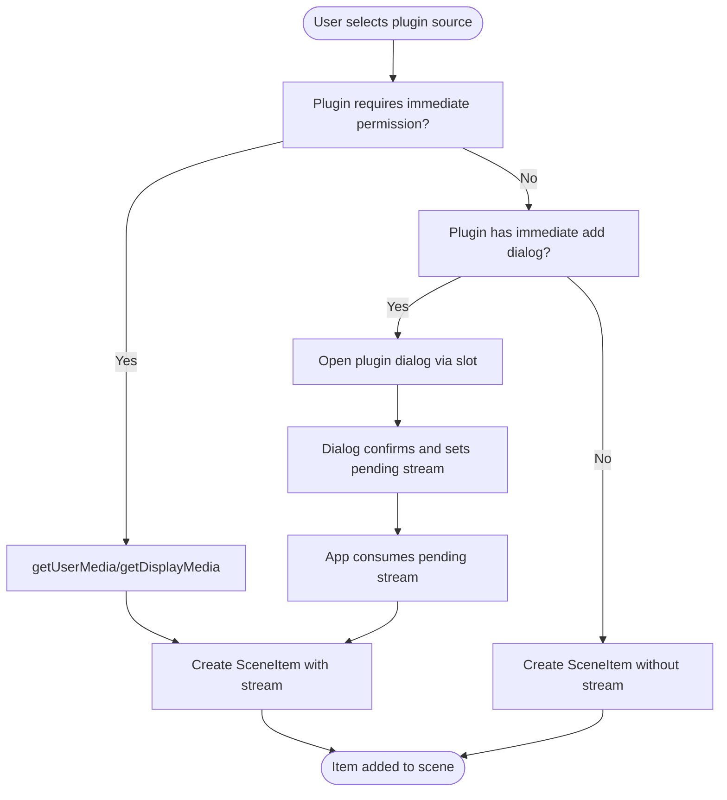
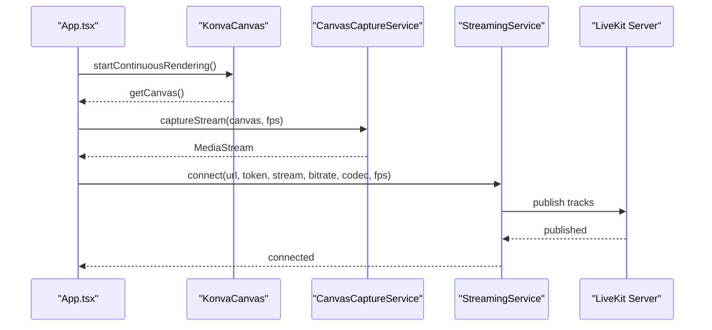
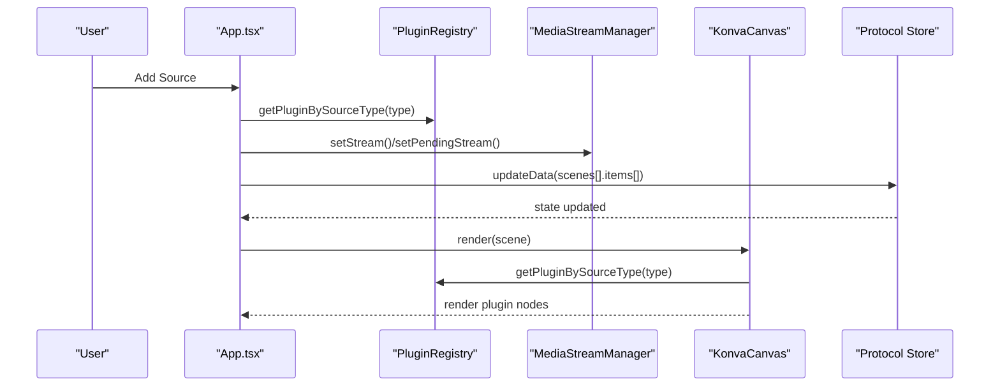
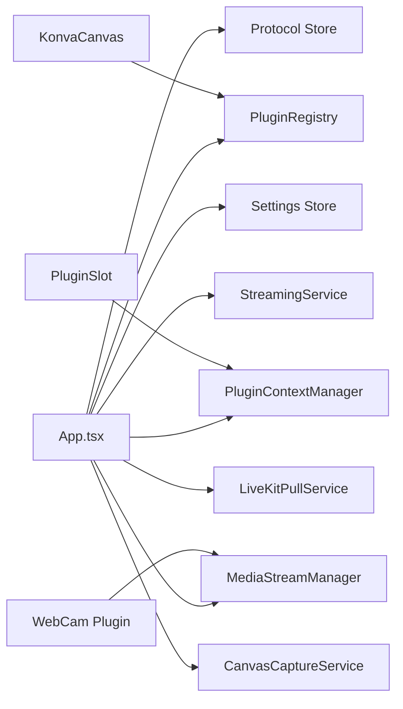
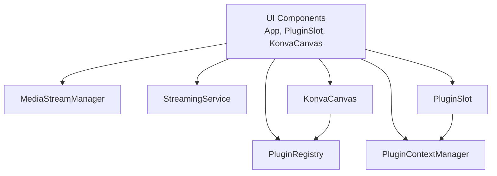

# Architecture Overview

<cite>
**Referenced Files in This Document**
- [App.tsx](file://src/App.tsx)
- [main.tsx](file://src/main.tsx)
- [plugin-registry.ts](file://src/services/plugin-registry.ts)
- [plugin-context.ts](file://src/services/plugin-context.ts)
- [media-stream-manager.ts](file://src/services/media-stream-manager.ts)
- [streaming.ts](file://src/services/streaming.ts)
- [livekit-pull.ts](file://src/services/livekit-pull.ts)
- [canvas-capture.ts](file://src/services/canvas-capture.ts)
- [plugin-slot.tsx](file://src/components/plugin-slot.tsx)
- [konva-canvas.tsx](file://src/components/konva-canvas.tsx)
- [protocol.ts](file://src/store/protocol.ts)
- [setting.ts](file://src/store/setting.ts)
- [plugin.ts](file://src/types/plugin.ts)
- [protocol.ts](file://src/types/protocol.ts)
- [webcam/index.tsx](file://src/plugins/builtin/webcam/index.tsx)
</cite>

## Table of Contents
1. [Introduction](#introduction)
2. [Project Structure](#project-structure)
3. [Core Components](#core-components)
4. [Architecture Overview](#architecture-overview)
5. [Detailed Component Analysis](#detailed-component-analysis)
6. [Dependency Analysis](#dependency-analysis)
7. [Performance Considerations](#performance-considerations)
8. [Troubleshooting Guide](#troubleshooting-guide)
9. [Conclusion](#conclusion)
10. [Appendices](#appendices)

## Introduction
This document describes the LiveMixer Web system design with a focus on the plugin-based architecture, service-oriented patterns, and React component structure. It explains how user interactions propagate through state management to canvas rendering, how plugins integrate via a unified context and registry, and how the system integrates with LiveKit for real-time streaming. Cross-cutting concerns such as state persistence, internationalization, and real-time streaming are addressed alongside system boundaries and integration patterns.

## Project Structure
LiveMixer Web follows a layered, service-oriented architecture:
- Entry point initializes plugin registry, registers built-in plugins, and mounts the App under a PluginContextProvider.
- App orchestrates UI state, protocol store, settings store, and service integrations.
- Services encapsulate domain logic (streaming, media capture, plugin context, device enumeration).
- Components render UI and delegate plugin rendering to the plugin registry.
- Plugins define source types, UI dialogs, rendering logic, and optional stream initialization.

**Diagram sources**
- [main.tsx:14-28](file://src/main.tsx#L14-L28)
- [plugin-slot.tsx:56-116](file://src/components/plugin-slot.tsx#L56-L116)
- [App.tsx:38-126](file://src/App.tsx#L38-L126)
- [plugin-registry.ts:78-118](file://src/services/plugin-registry.ts#L78-L118)
- [plugin-context.ts:333-456](file://src/services/plugin-context.ts#L333-L456)
- [media-stream-manager.ts:39-323](file://src/services/media-stream-manager.ts#L39-L323)
- [streaming.ts:6-177](file://src/services/streaming.ts#L6-L177)
- [livekit-pull.ts:49-352](file://src/services/livekit-pull.ts#L49-L352)
- [canvas-capture.ts:5-48](file://src/services/canvas-capture.ts#L5-L48)
- [konva-canvas.tsx:113-744](file://src/components/konva-canvas.tsx#L113-L744)
- [protocol.ts:38-68](file://src/store/protocol.ts#L38-L68)
- [setting.ts:92-139](file://src/store/setting.ts#L92-L139)
- [webcam/index.tsx:110-478](file://src/plugins/builtin/webcam/index.tsx#L110-L478)

**Section sources**
- [main.tsx:14-28](file://src/main.tsx#L14-L28)
- [plugin-slot.tsx:56-116](file://src/components/plugin-slot.tsx#L56-L116)
- [App.tsx:38-126](file://src/App.tsx#L38-L126)

## Core Components
- App orchestrator: Initializes i18n, sets up plugin context action handlers, manages protocol and settings stores, and coordinates streaming/pulling.
- Plugin Registry: Registers plugins, exposes discovery by source type, and integrates i18n resources.
- Plugin Context Manager: Provides a secure, permissioned context to plugins, manages state, events, slots, and actions.
- Media Stream Manager: Centralized stream lifecycle management for plugins and dialogs.
- Streaming Service: LiveKit publishing client with configurable encoding and bitrate.
- LiveKit Pull Service: Subscribes to remote participants’ tracks and exposes participant info.
- Canvas Capture Service: Converts a Canvas element into a MediaStream for publishing.
- Konva Canvas: Renders SceneItems, delegates plugin rendering, and manages selection/transforms.
- Stores: Protocol store persists scene configuration; Settings store persists non-sensitive settings.

**Section sources**
- [App.tsx:128-808](file://src/App.tsx#L128-L808)
- [plugin-registry.ts:5-168](file://src/services/plugin-registry.ts#L5-L168)
- [plugin-context.ts:82-708](file://src/services/plugin-context.ts#L82-L708)
- [media-stream-manager.ts:39-323](file://src/services/media-stream-manager.ts#L39-L323)
- [streaming.ts:6-177](file://src/services/streaming.ts#L6-L177)
- [livekit-pull.ts:49-352](file://src/services/livekit-pull.ts#L49-L352)
- [canvas-capture.ts:5-48](file://src/services/canvas-capture.ts#L5-L48)
- [konva-canvas.tsx:113-744](file://src/components/konva-canvas.tsx#L113-L744)
- [protocol.ts:38-68](file://src/store/protocol.ts#L38-L68)
- [setting.ts:92-139](file://src/store/setting.ts#L92-L139)

## Architecture Overview
The system is structured around a plugin-first rendering pipeline with a service layer for real-time streaming and media capture. The App composes UI components, state stores, and services. Plugins register UI dialogs and rendering logic via the PluginContextProvider and PluginRegistry. The KonvaCanvas renders items, delegating to plugins when available. Streaming and pulling integrate with LiveKit through dedicated services.

**Diagram sources**
- [App.tsx:38-126](file://src/App.tsx#L38-L126)
- [plugin-registry.ts:78-118](file://src/services/plugin-registry.ts#L78-L118)
- [plugin-context.ts:333-456](file://src/services/plugin-context.ts#L333-L456)
- [media-stream-manager.ts:39-323](file://src/services/media-stream-manager.ts#L39-L323)
- [streaming.ts:6-177](file://src/services/streaming.ts#L6-L177)
- [livekit-pull.ts:49-352](file://src/services/livekit-pull.ts#L49-L352)
- [canvas-capture.ts:5-48](file://src/services/canvas-capture.ts#L5-L48)
- [konva-canvas.tsx:113-744](file://src/components/konva-canvas.tsx#L113-L744)
- [protocol.ts:38-68](file://src/store/protocol.ts#L38-L68)
- [setting.ts:92-139](file://src/store/setting.ts#L92-L139)

## Detailed Component Analysis

### Plugin System and Registry
- Registration: Built-in plugins are registered at startup. Each plugin contributes metadata, UI configuration, source type mapping, and rendering logic.
- Discovery: Items are rendered by resolving a plugin via source type. Plugins can define default layouts, property schemas, and stream initialization.
- i18n Integration: The registry registers plugin-specific i18n resources into the shared engine.

**Diagram sources**
- [plugin-registry.ts:5-168](file://src/services/plugin-registry.ts#L5-L168)
- [plugin.ts:164-262](file://src/types/plugin.ts#L164-L262)

**Section sources**
- [main.tsx:14-20](file://src/main.tsx#L14-L20)
- [plugin-registry.ts:78-118](file://src/services/plugin-registry.ts#L78-L118)
- [plugin.ts:164-262](file://src/types/plugin.ts#L164-L262)

### Plugin Context and Slots
- Context creation: The PluginContextManager creates a scoped, permissioned context per plugin with read-only state, event subscription, actions, and slot registration.
- Slots: Plugins register UI components into named slots (e.g., dialogs, add-source-dialog). The DialogSlot renders active dialogs; Slot renders arbitrary slot contents.
- Events and state: The manager maintains a consolidated state and emits events plugins can subscribe to.

**Diagram sources**
- [plugin-context.ts:232-234](file://src/services/plugin-context.ts#L232-L234)
- [plugin-registry.ts:78-118](file://src/services/plugin-registry.ts#L78-L118)
- [plugin-context.ts:333-456](file://src/services/plugin-context.ts#L333-L456)
- [plugin-slot.tsx:320-363](file://src/components/plugin-slot.tsx#L320-L363)

**Section sources**
- [plugin-context.ts:82-708](file://src/services/plugin-context.ts#L82-L708)
- [plugin-slot.tsx:174-264](file://src/components/plugin-slot.tsx#L174-L264)
- [plugin-slot.tsx:308-363](file://src/components/plugin-slot.tsx#L308-L363)

### Media Stream Management
- Centralized lifecycle: Streams are created, cached, and cleaned up uniformly. Listeners receive notifications when streams change.
- Pending streams: Dialogs can pass a pending stream to the App, which consumes it to create a SceneItem.
- Device enumeration: Unified methods request permissions and enumerate devices safely.

**Diagram sources**
- [App.tsx:279-362](file://src/App.tsx#L279-L362)
- [media-stream-manager.ts:282-294](file://src/services/media-stream-manager.ts#L282-L294)

**Section sources**
- [media-stream-manager.ts:39-323](file://src/services/media-stream-manager.ts#L39-L323)
- [App.tsx:279-362](file://src/App.tsx#L279-L362)

### Real-Time Streaming Integration (LiveKit)
- Push streaming: App captures a Canvas stream, configures encoding/bitrate/fps, connects to LiveKit, and publishes tracks.
- Pull streaming: App subscribes to remote participants’ tracks and surfaces participant info.

**Diagram sources**
- [konva-canvas.tsx:154-176](file://src/components/konva-canvas.tsx#L154-L176)
- [canvas-capture.ts:14-24](file://src/services/canvas-capture.ts#L14-L24)
- [streaming.ts:20-124](file://src/services/streaming.ts#L20-L124)
- [App.tsx:725-788](file://src/App.tsx#L725-L788)

**Section sources**
- [streaming.ts:6-177](file://src/services/streaming.ts#L6-L177)
- [livekit-pull.ts:49-352](file://src/services/livekit-pull.ts#L49-L352)
- [App.tsx:725-788](file://src/App.tsx#L725-L788)

### Data Flow: From User Interaction to Canvas Rendering
- User adds a source: App resolves plugin, optionally requests permission/device, and creates a SceneItem. For stream-based plugins, MediaStreamManager caches the stream and notifies listeners.
- Canvas rendering: KonvaCanvas sorts items by z-index, filters items via plugin-provided canvasRender.shouldFilter, and delegates rendering to plugins when available. Legacy types render directly.
- Selection and transforms: Selected items are highlighted and transformed; updates write back to the protocol store.

**Diagram sources**
- [App.tsx:371-574](file://src/App.tsx#L371-L574)
- [plugin-registry.ts:144-157](file://src/services/plugin-registry.ts#L144-L157)
- [media-stream-manager.ts:56-64](file://src/services/media-stream-manager.ts#L56-L64)
- [konva-canvas.tsx:411-601](file://src/components/konva-canvas.tsx#L411-L601)
- [protocol.ts:38-68](file://src/store/protocol.ts#L38-L68)

**Section sources**
- [App.tsx:371-574](file://src/App.tsx#L371-L574)
- [konva-canvas.tsx:411-601](file://src/components/konva-canvas.tsx#L411-L601)
- [protocol.ts:38-68](file://src/store/protocol.ts#L38-L68)

### Conceptual Overview
- Plugin-driven rendering: Plugins define how items render and behave on canvas, including selection and filtering.
- Service decoupling: Streaming, device enumeration, and capture are encapsulated in services to minimize coupling.
- Slot-based UI: Dialogs and UI fragments are registered into named slots for dynamic composition.

[No sources needed since this section doesn't analyze specific files]

## Dependency Analysis
- Coupling: App depends on stores, services, and registry; components depend on registry and stores; services are singletons injected via imports.
- Cohesion: Services encapsulate domain logic; plugins encapsulate rendering and UI; stores encapsulate persistence.
- External dependencies: LiveKit SDK, Konva/Konva React, Zustand, and browser MediaDevices APIs.

**Diagram sources**
- [App.tsx:38-126](file://src/App.tsx#L38-L126)
- [plugin-registry.ts:78-118](file://src/services/plugin-registry.ts#L78-L118)
- [plugin-context.ts:333-456](file://src/services/plugin-context.ts#L333-L456)
- [media-stream-manager.ts:39-323](file://src/services/media-stream-manager.ts#L39-L323)
- [streaming.ts:6-177](file://src/services/streaming.ts#L6-L177)
- [livekit-pull.ts:49-352](file://src/services/livekit-pull.ts#L49-L352)
- [canvas-capture.ts:5-48](file://src/services/canvas-capture.ts#L5-L48)
- [konva-canvas.tsx:113-744](file://src/components/konva-canvas.tsx#L113-L744)
- [plugin-slot.tsx:174-264](file://src/components/plugin-slot.tsx#L174-L264)
- [webcam/index.tsx:110-478](file://src/plugins/builtin/webcam/index.tsx#L110-L478)

**Section sources**
- [plugin-registry.ts:78-118](file://src/services/plugin-registry.ts#L78-L118)
- [plugin-context.ts:333-456](file://src/services/plugin-context.ts#L333-L456)
- [media-stream-manager.ts:39-323](file://src/services/media-stream-manager.ts#L39-L323)
- [streaming.ts:6-177](file://src/services/streaming.ts#L6-L177)
- [livekit-pull.ts:49-352](file://src/services/livekit-pull.ts#L49-L352)
- [canvas-capture.ts:5-48](file://src/services/canvas-capture.ts#L5-L48)
- [konva-canvas.tsx:113-744](file://src/components/konva-canvas.tsx#L113-L744)
- [plugin-slot.tsx:174-264](file://src/components/plugin-slot.tsx#L174-L264)
- [webcam/index.tsx:110-478](file://src/plugins/builtin/webcam/index.tsx#L110-L478)

## Performance Considerations
- Continuous rendering: Canvas rendering loop keeps captureStream active during push streaming to avoid stream stalling.
- Efficient rendering: Sorting by z-index and filtering via plugin-provided shouldFilter reduces draw overhead.
- Device enumeration: Permission gating avoids unnecessary getUserMedia calls and improves UX.
- Encoding parameters: Configurable bitrate, codec, and fps balance quality and bandwidth.

[No sources needed since this section provides general guidance]

## Troubleshooting Guide
- Push streaming fails: Verify LiveKit URL/token, ensure Canvas is available, and confirm continuous rendering is active.
- Pull streaming issues: Check participant connections and track subscription callbacks.
- Plugin dialogs not appearing: Ensure the plugin registers its dialog into the correct slot and the DialogSlot is active.
- Stream not rendering: Confirm MediaStreamManager has a valid stream entry and notifyStreamChange was invoked.

**Section sources**
- [streaming.ts:119-124](file://src/services/streaming.ts#L119-L124)
- [livekit-pull.ts:174-178](file://src/services/livekit-pull.ts#L174-L178)
- [plugin-slot.tsx:320-363](file://src/components/plugin-slot.tsx#L320-L363)
- [media-stream-manager.ts:130-141](file://src/services/media-stream-manager.ts#L130-L141)

## Conclusion
LiveMixer Web employs a robust plugin-first architecture with a service layer for real-time streaming and media capture. The App orchestrates state, UI, and services, while the PluginRegistry and PluginContextManager enable secure, extensible plugin integration. The KonvaCanvas renders items efficiently, delegating to plugins where applicable. Cross-cutting concerns like persistence and i18n are integrated early, and LiveKit integration is cleanly separated into push and pull services.

## Appendices

### System Context Diagrams
- MediaStreamManager, PluginRegistry, StreamingService, and UI components relationship.

**Diagram sources**
- [App.tsx:38-126](file://src/App.tsx#L38-L126)
- [plugin-registry.ts:78-118](file://src/services/plugin-registry.ts#L78-L118)
- [plugin-context.ts:333-456](file://src/services/plugin-context.ts#L333-L456)
- [media-stream-manager.ts:39-323](file://src/services/media-stream-manager.ts#L39-L323)
- [streaming.ts:6-177](file://src/services/streaming.ts#L6-L177)
- [konva-canvas.tsx:113-744](file://src/components/konva-canvas.tsx#L113-L744)
- [plugin-slot.tsx:174-264](file://src/components/plugin-slot.tsx#L174-L264)

### Cross-Cutting Concerns
- State Persistence: Protocol store persists scenes; Settings store persists non-sensitive settings to localStorage.
- Internationalization: App initializes i18n engine, applies host/user overrides, and registers plugin i18n resources.

**Section sources**
- [protocol.ts:38-68](file://src/store/protocol.ts#L38-L68)
- [setting.ts:92-139](file://src/store/setting.ts#L92-L139)
- [App.tsx:44-107](file://src/App.tsx#L44-L107)
- [plugin-registry.ts:13-56](file://src/services/plugin-registry.ts#L13-L56)