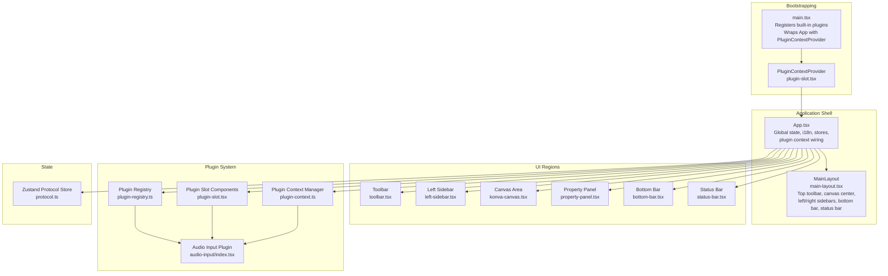
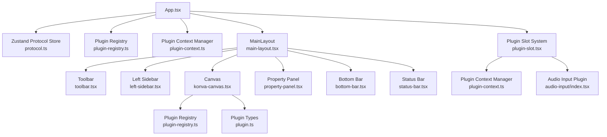
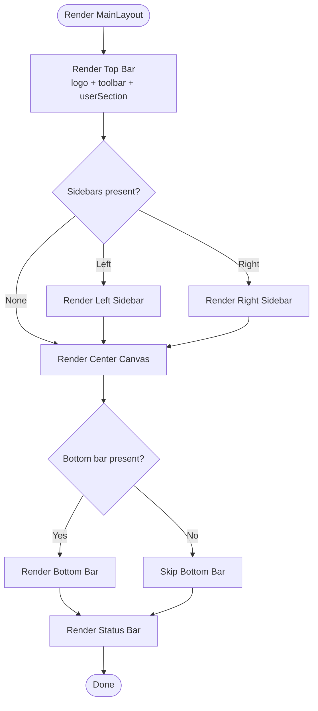
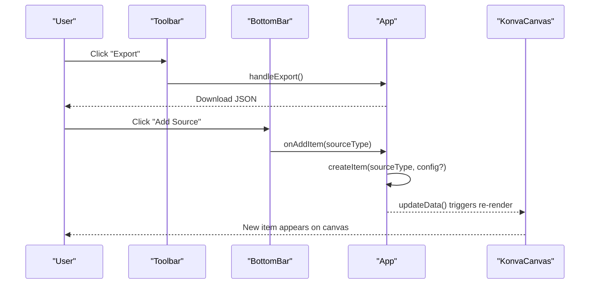
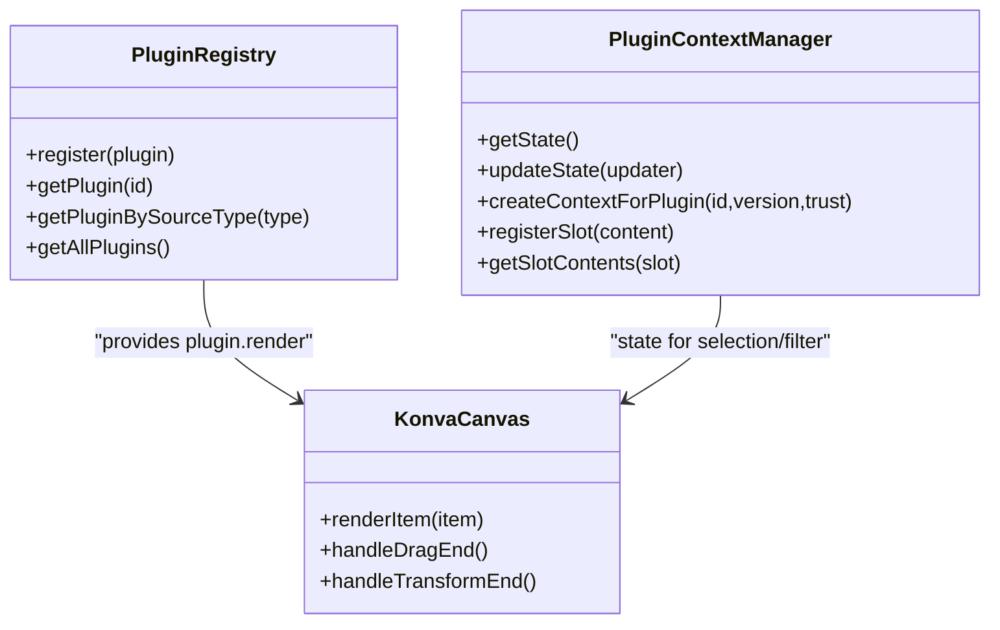
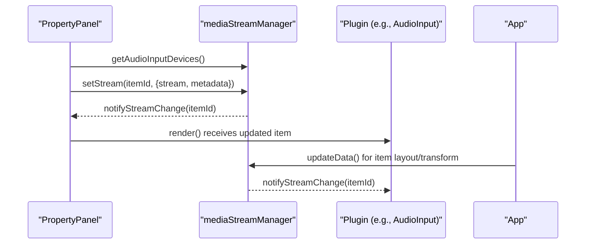
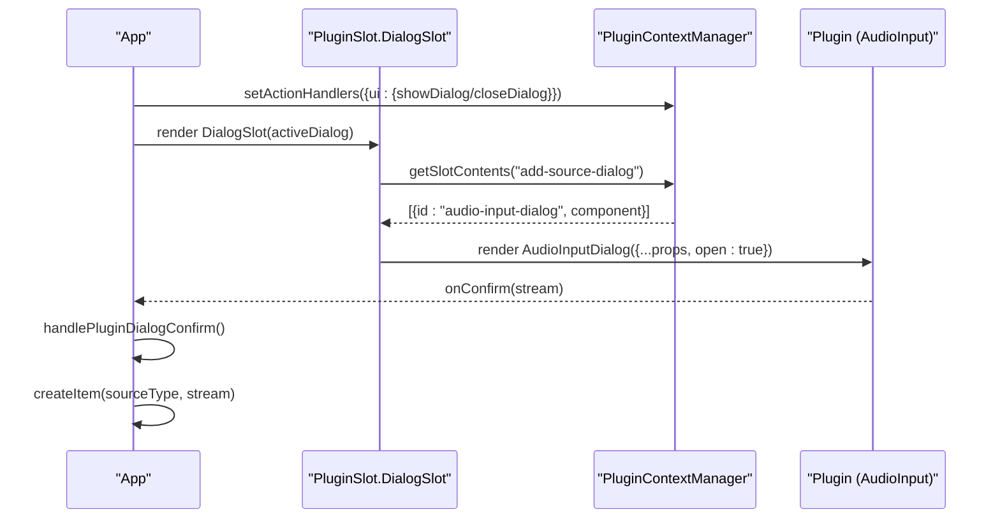
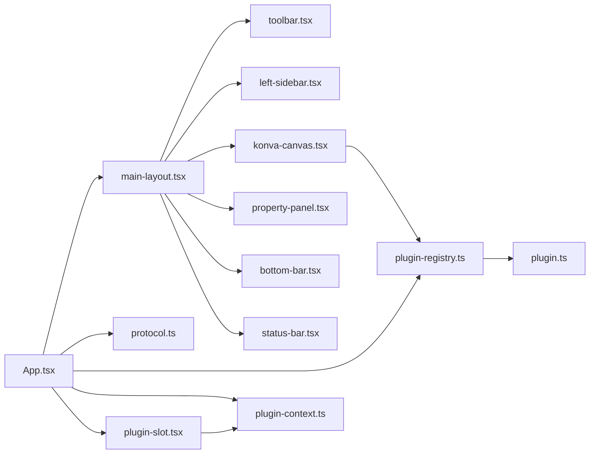

# Component Hierarchy

<cite>
**Referenced Files in This Document**
- [main-layout.tsx](file://src/components/main-layout.tsx)
- [App.tsx](file://src/App.tsx)
- [main.tsx](file://src/main.tsx)
- [plugin-slot.tsx](file://src/components/plugin-slot.tsx)
- [toolbar.tsx](file://src/components/toolbar.tsx)
- [left-sidebar.tsx](file://src/components/left-sidebar.tsx)
- [property-panel.tsx](file://src/components/property-panel.tsx)
- [konva-canvas.tsx](file://src/components/konva-canvas.tsx)
- [bottom-bar.tsx](file://src/components/bottom-bar.tsx)
- [status-bar.tsx](file://src/components/status-bar.tsx)
- [plugin-registry.ts](file://src/services/plugin-registry.ts)
- [plugin-context.ts](file://src/services/plugin-context.ts)
- [protocol.ts](file://src/store/protocol.ts)
- [plugin.ts](file://src/types/plugin.ts)
- [audio-input/index.tsx](file://src/plugins/builtin/audio-input/index.tsx)
</cite>

## Table of Contents
1. [Introduction](#introduction)
2. [Project Structure](#project-structure)
3. [Core Components](#core-components)
4. [Architecture Overview](#architecture-overview)
5. [Detailed Component Analysis](#detailed-component-analysis)
6. [Dependency Analysis](#dependency-analysis)
7. [Performance Considerations](#performance-considerations)
8. [Troubleshooting Guide](#troubleshooting-guide)
9. [Conclusion](#conclusion)

## Introduction
This document explains the React component hierarchy of LiveMixer Web, focusing on how the main layout composes toolbar, sidebar panels, property panel, and canvas areas. It details how UI components communicate through shared state, event handlers, and the plugin context system. It also covers the plugin slot system for dynamic UI integration, component lifecycle management, and patterns for separating presentation from business logic.

## Project Structure
LiveMixer Web organizes its UI around a flexible main layout that accepts optional regions for toolbar, canvas, sidebars, bottom bar, and status bar. The application bootstraps plugin registries and providers, wires global stores, and orchestrates plugin-driven UI through a slot system.

**Diagram sources**
- [main.tsx:14-28](file://src/main.tsx#L14-L28)
- [plugin-slot.tsx:49-116](file://src/components/plugin-slot.tsx#L49-L116)
- [App.tsx:128-203](file://src/App.tsx#L128-L203)
- [main-layout.tsx:14-76](file://src/components/main-layout.tsx#L14-L76)
- [toolbar.tsx:11-165](file://src/components/toolbar.tsx#L11-L165)
- [left-sidebar.tsx:1-8](file://src/components/left-sidebar.tsx#L1-L8)
- [konva-canvas.tsx:113-744](file://src/components/konva-canvas.tsx#L113-L744)
- [property-panel.tsx:643-800](file://src/components/property-panel.tsx#L643-L800)
- [bottom-bar.tsx:59-526](file://src/components/bottom-bar.tsx#L59-L526)
- [status-bar.tsx:12-66](file://src/components/status-bar.tsx#L12-L66)
- [plugin-registry.ts:78-167](file://src/services/plugin-registry.ts#L78-L167)
- [plugin-context.ts:82-708](file://src/services/plugin-context.ts#L82-L708)
- [protocol.ts:38-68](file://src/store/protocol.ts#L38-L68)
- [audio-input/index.tsx:105-255](file://src/plugins/builtin/audio-input/index.tsx#L105-L255)

**Section sources**
- [main.tsx:14-28](file://src/main.tsx#L14-L28)
- [plugin-slot.tsx:49-116](file://src/components/plugin-slot.tsx#L49-L116)
- [App.tsx:128-203](file://src/App.tsx#L128-L203)
- [main-layout.tsx:14-76](file://src/components/main-layout.tsx#L14-L76)

## Core Components
- MainLayout: A flexible container that composes top toolbar, left/right sidebars, central canvas, bottom bar, and status bar. It accepts optional children for each region and renders them with consistent spacing and styling.
- App: Orchestrates global state (i18n, protocol store, settings store), plugin context synchronization, and action handlers. It wires plugin dialogs and manages item creation flows.
- Plugin Slot System: Provides React hooks and components to register, discover, and render plugin-provided UI into named slots, with visibility filtering and error boundaries.
- Plugin Registry: Registers plugins, exposes discovery by source type, and initializes plugin contexts and i18n resources.
- Plugin Context Manager: Manages application state, permissions, events, and actions available to plugins, and creates scoped contexts per plugin.

**Section sources**
- [main-layout.tsx:14-76](file://src/components/main-layout.tsx#L14-L76)
- [App.tsx:128-203](file://src/App.tsx#L128-L203)
- [plugin-slot.tsx:49-116](file://src/components/plugin-slot.tsx#L49-L116)
- [plugin-registry.ts:78-167](file://src/services/plugin-registry.ts#L78-L167)
- [plugin-context.ts:82-708](file://src/services/plugin-context.ts#L82-L708)

## Architecture Overview
The system follows a layered architecture:
- Presentation layer: UI components (MainLayout, Toolbar, Canvas, Panels, Bars).
- Business logic layer: App orchestrates state, stores, and plugin interactions.
- Plugin system: Registry and Context Manager enable dynamic UI and actions via slots and permissions.
- Data layer: Zustand store persists and updates protocol data.

**Diagram sources**
- [App.tsx:128-203](file://src/App.tsx#L128-L203)
- [protocol.ts:38-68](file://src/store/protocol.ts#L38-L68)
- [plugin-registry.ts:78-167](file://src/services/plugin-registry.ts#L78-L167)
- [plugin-context.ts:82-708](file://src/services/plugin-context.ts#L82-L708)
- [main-layout.tsx:14-76](file://src/components/main-layout.tsx#L14-L76)
- [toolbar.tsx:11-165](file://src/components/toolbar.tsx#L11-L165)
- [left-sidebar.tsx:1-8](file://src/components/left-sidebar.tsx#L1-L8)
- [konva-canvas.tsx:113-744](file://src/components/konva-canvas.tsx#L113-L744)
- [property-panel.tsx:643-800](file://src/components/property-panel.tsx#L643-L800)
- [bottom-bar.tsx:59-526](file://src/components/bottom-bar.tsx#L59-L526)
- [status-bar.tsx:12-66](file://src/components/status-bar.tsx#L12-L66)
- [plugin-slot.tsx:49-116](file://src/components/plugin-slot.tsx#L49-L116)
- [plugin.ts:164-267](file://src/types/plugin.ts#L164-L267)
- [audio-input/index.tsx:105-255](file://src/plugins/builtin/audio-input/index.tsx#L105-L255)

## Detailed Component Analysis

### MainLayout Composition
MainLayout is a container that:
- Renders a top bar with logo, toolbar, and user section.
- Provides left sidebar, central canvas area, and right sidebar regions.
- Renders a bottom bar and status bar when provided.

**Diagram sources**
- [main-layout.tsx:14-76](file://src/components/main-layout.tsx#L14-L76)

**Section sources**
- [main-layout.tsx:14-76](file://src/components/main-layout.tsx#L14-L76)

### Toolbar and Bottom Bar Interaction
- Toolbar provides menu actions for editing, viewing, configuration, tools, and help.
- Bottom Bar manages scenes, items, and streaming controls, delegating actions to App via props.

**Diagram sources**
- [toolbar.tsx:50-65](file://src/components/toolbar.tsx#L50-L65)
- [bottom-bar.tsx:518-523](file://src/components/bottom-bar.tsx#L518-L523)
- [App.tsx:372-574](file://src/App.tsx#L372-L574)
- [konva-canvas.tsx:612-621](file://src/components/konva-canvas.tsx#L612-L621)

**Section sources**
- [toolbar.tsx:11-165](file://src/components/toolbar.tsx#L11-L165)
- [bottom-bar.tsx:59-526](file://src/components/bottom-bar.tsx#L59-L526)
- [App.tsx:372-574](file://src/App.tsx#L372-L574)
- [konva-canvas.tsx:612-621](file://src/components/konva-canvas.tsx#L612-L621)

### Canvas Rendering and Plugin Integration
- KonvaCanvas renders items sorted by z-index, filters items via plugin canvasRender.shouldFilter, and delegates rendering to plugin.render when available.
- It supports drag, drop, transform, and selection with a transformer, and integrates HTML overlays for specific item types.

**Diagram sources**
- [plugin-registry.ts:78-167](file://src/services/plugin-registry.ts#L78-L167)
- [plugin-context.ts:82-708](file://src/services/plugin-context.ts#L82-L708)
- [konva-canvas.tsx:459-601](file://src/components/konva-canvas.tsx#L459-L601)

**Section sources**
- [konva-canvas.tsx:459-601](file://src/components/konva-canvas.tsx#L459-L601)
- [plugin-registry.ts:144-157](file://src/services/plugin-registry.ts#L144-L157)
- [plugin-context.ts:333-456](file://src/services/plugin-context.ts#L333-L456)

### Property Panel and Media Streams
- PropertyPanel updates item properties and coordinates with mediaStreamManager for device selection and stream lifecycle.
- It handles device enumeration, stream switching, and notifying plugins of changes.

**Diagram sources**
- [property-panel.tsx:81-145](file://src/components/property-panel.tsx#L81-L145)
- [property-panel.tsx:165-228](file://src/components/property-panel.tsx#L165-L228)
- [audio-input/index.tsx:255-555](file://src/plugins/builtin/audio-input/index.tsx#L255-L555)
- [App.tsx:696-723](file://src/App.tsx#L696-L723)

**Section sources**
- [property-panel.tsx:81-145](file://src/components/property-panel.tsx#L81-L145)
- [property-panel.tsx:165-228](file://src/components/property-panel.tsx#L165-L228)
- [audio-input/index.tsx:255-555](file://src/plugins/builtin/audio-input/index.tsx#L255-L555)
- [App.tsx:696-723](file://src/App.tsx#L696-L723)

### Plugin Slot System and Dynamic UI
- PluginSlot provides Slot and DialogSlot components to render plugin-registered UI into named slots.
- Plugins register dialogs and UI via onContextReady and ctx.registerSlot.
- App wires plugin dialogs to state and routes confirmations to item creation.

**Diagram sources**
- [plugin-slot.tsx:320-363](file://src/components/plugin-slot.tsx#L320-L363)
- [plugin-context.ts:232-234](file://src/services/plugin-context.ts#L232-L234)
- [plugin-context.ts:314-324](file://src/services/plugin-context.ts#L314-L324)
- [audio-input/index.tsx:242-248](file://src/plugins/builtin/audio-input/index.tsx#L242-L248)
- [App.tsx:345-362](file://src/App.tsx#L345-L362)

**Section sources**
- [plugin-slot.tsx:320-363](file://src/components/plugin-slot.tsx#L320-L363)
- [plugin-context.ts:232-234](file://src/services/plugin-context.ts#L232-L234)
- [plugin-context.ts:314-324](file://src/services/plugin-context.ts#L314-L324)
- [audio-input/index.tsx:242-248](file://src/plugins/builtin/audio-input/index.tsx#L242-L248)
- [App.tsx:345-362](file://src/App.tsx#L345-L362)

### Component Composition Patterns
- Shared state: App maintains active scene, selected item, streaming/pulling state, and settings. It passes down handlers and state to child components.
- Event handlers: BottomBar and Toolbar receive callbacks to mutate protocol data, manage items, and control streaming.
- Plugin-driven UI: Plugins register dialogs and UI into slots; App manages active dialog state and confirms flows.

**Section sources**
- [App.tsx:128-203](file://src/App.tsx#L128-L203)
- [bottom-bar.tsx:59-526](file://src/components/bottom-bar.tsx#L59-L526)
- [toolbar.tsx:11-165](file://src/components/toolbar.tsx#L11-L165)
- [plugin-slot.tsx:320-363](file://src/components/plugin-slot.tsx#L320-L363)

### Component Lifecycle Management
- App initializes i18n, sets up plugin context action handlers, and synchronizes state to plugin context.
- KonvaCanvas starts/stops continuous rendering for captureStream and manages transformer selection.
- PropertyPanel manages device enumeration and stream lifecycles with cleanup on unmount.

**Section sources**
- [App.tsx:44-107](file://src/App.tsx#L44-L107)
- [App.tsx:168-187](file://src/App.tsx#L168-L187)
- [App.tsx:194-203](file://src/App.tsx#L194-L203)
- [konva-canvas.tsx:155-176](file://src/components/konva-canvas.tsx#L155-L176)
- [property-panel.tsx:424-440](file://src/components/property-panel.tsx#L424-L440)

### Prop Drilling and Context Usage
- Props: MainLayout props carry optional regions; App passes handlers and state to children.
- Context: PluginContextProvider supplies plugin context system to components; usePluginContext and usePluginState hooks expose state and manager to plugin UI.
- Stores: Zustand protocol store persists and updates scene data; App updates it to reflect UI changes.

**Section sources**
- [main-layout.tsx:3-12](file://src/components/main-layout.tsx#L3-L12)
- [plugin-slot.tsx:125-152](file://src/components/plugin-slot.tsx#L125-L152)
- [protocol.ts:38-68](file://src/store/protocol.ts#L38-L68)

### Slot System for Plugin Integration
- Plugins define UI via ui or addDialog configurations and register slots in onContextReady.
- Host renders Slot components for specific slot names and applies visibility checks and error boundaries.

**Section sources**
- [plugin.ts:192-237](file://src/types/plugin.ts#L192-L237)
- [plugin-context.ts:284-324](file://src/services/plugin-context.ts#L284-L324)
- [plugin-slot.tsx:192-264](file://src/components/plugin-slot.tsx#L192-L264)

### Component Reusability and Separation of Concerns
- Presentation vs. business logic: MainLayout, Toolbar, BottomBar, PropertyPanel encapsulate UI concerns; App and services handle orchestration and persistence.
- Plugin abstraction: Plugins implement render and optional dialogs; the host renders them via slots and plugin registry.
- Shared utilities: mediaStreamManager and plugin-registry provide reusable cross-cutting capabilities.

**Section sources**
- [plugin-registry.ts:78-167](file://src/services/plugin-registry.ts#L78-L167)
- [plugin.ts:250-262](file://src/types/plugin.ts#L250-L262)
- [property-panel.tsx:81-145](file://src/components/property-panel.tsx#L81-L145)

## Dependency Analysis
The following diagram highlights key dependencies among major components and services.

**Diagram sources**
- [App.tsx:128-203](file://src/App.tsx#L128-L203)
- [main-layout.tsx:14-76](file://src/components/main-layout.tsx#L14-L76)
- [toolbar.tsx:11-165](file://src/components/toolbar.tsx#L11-L165)
- [left-sidebar.tsx:1-8](file://src/components/left-sidebar.tsx#L1-L8)
- [konva-canvas.tsx:113-744](file://src/components/konva-canvas.tsx#L113-L744)
- [property-panel.tsx:643-800](file://src/components/property-panel.tsx#L643-L800)
- [bottom-bar.tsx:59-526](file://src/components/bottom-bar.tsx#L59-L526)
- [status-bar.tsx:12-66](file://src/components/status-bar.tsx#L12-L66)
- [plugin-registry.ts:78-167](file://src/services/plugin-registry.ts#L78-L167)
- [plugin-context.ts:82-708](file://src/services/plugin-context.ts#L82-L708)
- [plugin-slot.tsx:49-116](file://src/components/plugin-slot.tsx#L49-L116)
- [protocol.ts:38-68](file://src/store/protocol.ts#L38-L68)
- [plugin.ts:164-267](file://src/types/plugin.ts#L164-L267)

**Section sources**
- [App.tsx:128-203](file://src/App.tsx#L128-L203)
- [main-layout.tsx:14-76](file://src/components/main-layout.tsx#L14-L76)
- [plugin-registry.ts:78-167](file://src/services/plugin-registry.ts#L78-L167)
- [plugin-context.ts:82-708](file://src/services/plugin-context.ts#L82-L708)
- [plugin-slot.tsx:49-116](file://src/components/plugin-slot.tsx#L49-L116)
- [protocol.ts:38-68](file://src/store/protocol.ts#L38-L68)
- [plugin.ts:164-267](file://src/types/plugin.ts#L164-L267)

## Performance Considerations
- Canvas rendering: KonvaCanvas uses batchDraw and a continuous render loop to keep captureStream alive during streaming; ensure to stop loops when not needed.
- State updates: App updates protocol data via Zustand; minimize unnecessary re-renders by updating only changed fields.
- Plugin rendering: PluginRenderer uses memoization to avoid unnecessary re-renders; ensure plugin render functions are pure and stable.
- Device enumeration: PropertyPanel debounces device queries and uses caching to reduce repeated getUserMedia calls.

[No sources needed since this section provides general guidance]

## Troubleshooting Guide
- Streaming fails: Verify LiveKit URL/token and ensure continuous rendering is started before captureStream.
- Plugin dialog does not appear: Confirm plugin registers slot via onContextReady and that activeDialog matches registered dialogId.
- Property panel device selection not working: Check mediaStreamManager state and ensure notifyStreamChange is called after stream updates.
- Canvas items not selectable: Ensure plugin canvasRender.isSelectable allows selection for the item type.

**Section sources**
- [App.tsx:726-788](file://src/App.tsx#L726-L788)
- [plugin-context.ts:314-324](file://src/services/plugin-context.ts#L314-L324)
- [property-panel.tsx:218-220](file://src/components/property-panel.tsx#L218-L220)
- [konva-canvas.tsx:190-202](file://src/components/konva-canvas.tsx#L190-L202)

## Conclusion
LiveMixer Web’s component hierarchy centers on MainLayout as a flexible container, with App orchestrating state, plugin integration, and UI flows. The plugin slot system enables dynamic UI extension, while the plugin context manager provides secure, permissioned access to host capabilities. Shared state via stores and explicit event handlers ensures predictable data flow, and memoized rendering optimizes performance. This architecture cleanly separates presentation from business logic, enabling extensibility and maintainability.