# Data Flow Architecture

<cite>
**Referenced Files in This Document**
- [protocol.ts](file://src/store/protocol.ts)
- [setting.ts](file://src/store/setting.ts)
- [media-stream-manager.ts](file://src/services/media-stream-manager.ts)
- [plugin-context.ts](file://src/services/plugin-context.ts)
- [plugin-registry.ts](file://src/services/plugin-registry.ts)
- [App.tsx](file://src/App.tsx)
- [konva-canvas.tsx](file://src/components/konva-canvas.tsx)
- [protocol.ts (types)](file://src/types/protocol.ts)
- [plugin-context.ts (types)](file://src/types/plugin-context.ts)
- [plugin.ts (types)](file://src/types/plugin.ts)
- [streaming.ts](file://src/services/streaming.ts)
- [webcam/index.tsx](file://src/plugins/builtin/webcam/index.tsx)
- [audio-input/index.tsx](file://src/plugins/builtin/audio-input/index.tsx)
- [livekit-pull.ts](file://src/services/livekit-pull.ts)
- [property-panel.tsx](file://src/components/property-panel.tsx)
</cite>

## Table of Contents
1. [Introduction](#introduction)
2. [Project Structure](#project-structure)
3. [Core Components](#core-components)
4. [Architecture Overview](#architecture-overview)
5. [Detailed Component Analysis](#detailed-component-analysis)
6. [Dependency Analysis](#dependency-analysis)
7. [Performance Considerations](#performance-considerations)
8. [Troubleshooting Guide](#troubleshooting-guide)
9. [Conclusion](#conclusion)

## Introduction
This document explains the data flow architecture of LiveMixer Web, focusing on state management and data propagation across the application. It traces how user interactions lead to state updates, how the protocol store maintains project state, how the setting store manages configuration, and how media stream changes propagate through the system. It also documents the event-driven architecture where MediaStreamManager emits changes that update plugin contexts and UI components, and how scene items, transform operations, and plugin state synchronize across the application. Finally, it covers state persistence mechanisms and data synchronization patterns between local state and external services.

## Project Structure
LiveMixer Web is organized around a clear separation of concerns:
- Stores: Protocol store for project state and Setting store for configuration
- Services: MediaStreamManager for unified media stream lifecycle, PluginContextManager for plugin orchestration, PluginRegistry for plugin lifecycle, StreamingService/LiveKit pull service for external streaming
- UI: App orchestrator, KonvaCanvas for rendering, PropertyPanel for editing, and plugin-rendered components
- Types: Strongly typed protocol definitions and plugin context contracts

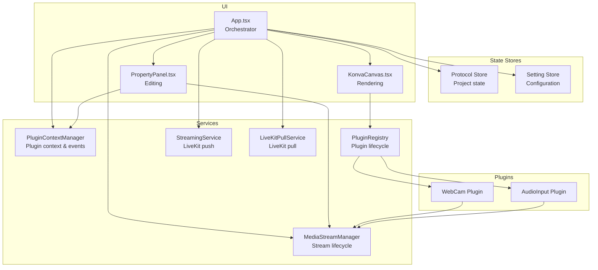

**Diagram sources**
- [App.tsx:128-800](file://src/App.tsx#L128-L800)
- [protocol.ts:38-68](file://src/store/protocol.ts#L38-L68)
- [setting.ts:92-139](file://src/store/setting.ts#L92-L139)
- [media-stream-manager.ts:39-323](file://src/services/media-stream-manager.ts#L39-L323)
- [plugin-context.ts:82-708](file://src/services/plugin-context.ts#L82-L708)
- [plugin-registry.ts:5-168](file://src/services/plugin-registry.ts#L5-L168)
- [streaming.ts:6-177](file://src/services/streaming.ts#L6-L177)
- [livekit-pull.ts:49-352](file://src/services/livekit-pull.ts#L49-L352)
- [konva-canvas.tsx:113-744](file://src/components/konva-canvas.tsx#L113-L744)
- [property-panel.tsx:643-800](file://src/components/property-panel.tsx#L643-L800)
- [webcam/index.tsx:110-478](file://src/plugins/builtin/webcam/index.tsx#L110-L478)
- [audio-input/index.tsx:105-555](file://src/plugins/builtin/audio-input/index.tsx#L105-L555)

**Section sources**
- [protocol.ts:38-68](file://src/store/protocol.ts#L38-L68)
- [setting.ts:92-139](file://src/store/setting.ts#L92-L139)
- [media-stream-manager.ts:39-323](file://src/services/media-stream-manager.ts#L39-L323)
- [plugin-context.ts:82-708](file://src/services/plugin-context.ts#L82-L708)
- [plugin-registry.ts:5-168](file://src/services/plugin-registry.ts#L5-L168)
- [streaming.ts:6-177](file://src/services/streaming.ts#L6-L177)
- [livekit-pull.ts:49-352](file://src/services/livekit-pull.ts#L49-L352)
- [konva-canvas.tsx:113-744](file://src/components/konva-canvas.tsx#L113-L744)
- [property-panel.tsx:643-800](file://src/components/property-panel.tsx#L643-L800)
- [webcam/index.tsx:110-478](file://src/plugins/builtin/webcam/index.tsx#L110-L478)
- [audio-input/index.tsx:105-555](file://src/plugins/builtin/audio-input/index.tsx#L105-L555)

## Core Components
- Protocol Store: Centralized project state (scenes, items, canvas config) persisted to localStorage. It updates timestamps on changes and exposes update/reset operations.
- Setting Store: Non-sensitive configuration persisted to localStorage; sensitive tokens kept in memory only. Supports partial persistence to exclude secrets.
- MediaStreamManager: Centralized media stream lifecycle with change notifications, device enumeration, and pending stream handoff between dialogs and app.
- PluginContextManager: Secure plugin context provider with readonly state proxy, event emission, action handlers, and storage backend abstraction.
- PluginRegistry: Registers plugins, wires i18n, and initializes plugin contexts with trust levels and permissions.
- App Orchestrator: Coordinates stores, plugin context, streaming/pulling services, and UI components; translates user actions into state updates and stream operations.
- Rendering Engine: KonvaCanvas renders scene items, applies transforms, and overlays HTML elements for LiveKit streams.
- Property Panel: Edits item properties and manages media device selection and stream lifecycle for media plugins.

**Section sources**
- [protocol.ts:38-68](file://src/store/protocol.ts#L38-L68)
- [setting.ts:92-139](file://src/store/setting.ts#L92-L139)
- [media-stream-manager.ts:39-323](file://src/services/media-stream-manager.ts#L39-L323)
- [plugin-context.ts:82-708](file://src/services/plugin-context.ts#L82-L708)
- [plugin-registry.ts:5-168](file://src/services/plugin-registry.ts#L5-L168)
- [App.tsx:128-800](file://src/App.tsx#L128-L800)
- [konva-canvas.tsx:113-744](file://src/components/konva-canvas.tsx#L113-L744)
- [property-panel.tsx:643-800](file://src/components/property-panel.tsx#L643-L800)

## Architecture Overview
LiveMixer Web follows an event-driven, plugin-centric architecture:
- User interactions trigger state updates in the protocol store and setting store.
- Media actions are routed through MediaStreamManager, which notifies listeners and updates plugin contexts.
- Plugins render UI and manage media streams independently, communicating via the plugin context and registry.
- External services (LiveKit) integrate via dedicated services for pushing/pulling streams.

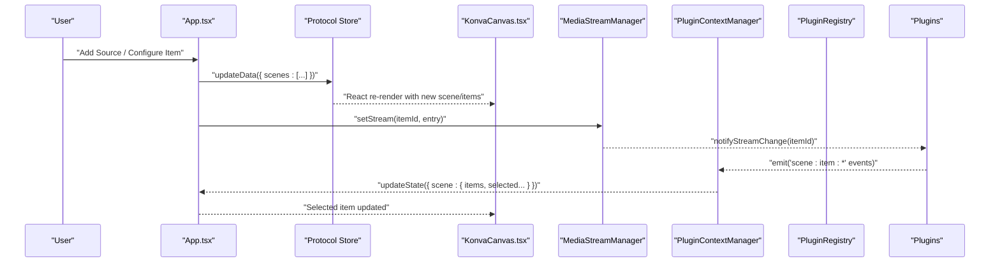

**Diagram sources**
- [App.tsx:128-800](file://src/App.tsx#L128-L800)
- [protocol.ts:38-68](file://src/store/protocol.ts#L38-L68)
- [konva-canvas.tsx:113-744](file://src/components/konva-canvas.tsx#L113-L744)
- [media-stream-manager.ts:39-323](file://src/services/media-stream-manager.ts#L39-L323)
- [plugin-context.ts:82-708](file://src/services/plugin-context.ts#L82-L708)
- [plugin-registry.ts:5-168](file://src/services/plugin-registry.ts#L5-L168)
- [webcam/index.tsx:110-478](file://src/plugins/builtin/webcam/index.tsx#L110-L478)
- [audio-input/index.tsx:105-555](file://src/plugins/builtin/audio-input/index.tsx#L105-L555)

## Detailed Component Analysis

### Protocol Store: Project State Persistence
- Purpose: Maintain the complete project state (version, metadata, canvas, resources, scenes, items).
- Persistence: Uses zustand with persist middleware storing to localStorage under a dedicated key.
- Operations: updateData mutates metadata updatedAt and merges incoming data; resetData creates a default scene graph.
- Data model: Strongly typed via protocol definitions for scenes, items, layouts, transforms, and timers.

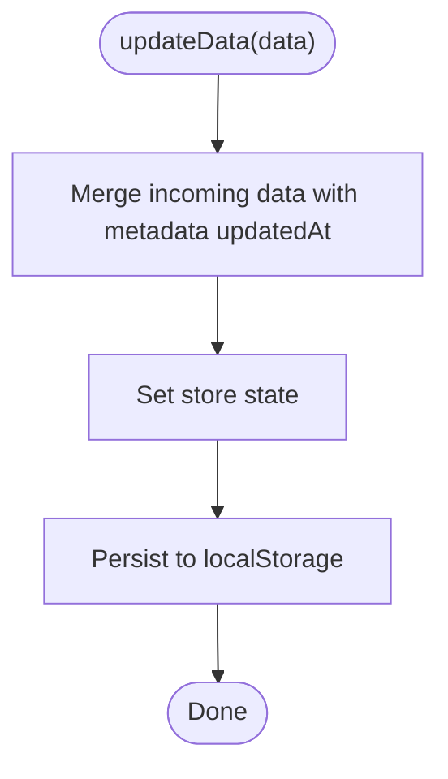

**Diagram sources**
- [protocol.ts:38-68](file://src/store/protocol.ts#L38-L68)
- [protocol.ts (types):103-114](file://src/types/protocol.ts#L103-L114)

**Section sources**
- [protocol.ts:38-68](file://src/store/protocol.ts#L38-L68)
- [protocol.ts (types):103-114](file://src/types/protocol.ts#L103-L114)

### Setting Store: Configuration and Persistence
- Purpose: Manage non-sensitive configuration (language, theme, streaming/pull URLs, encoder/bitrate, device settings) persisted to localStorage.
- Security: Sensitive tokens (LiveKit) stored in-memory only via a partializer that excludes them from persistence.
- Operations: updatePersistentSettings, updateSensitiveSettings, resetSettings; partialize ensures only safe keys are persisted.

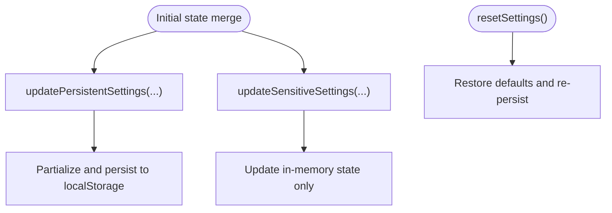

**Diagram sources**
- [setting.ts:92-139](file://src/store/setting.ts#L92-L139)

**Section sources**
- [setting.ts:92-139](file://src/store/setting.ts#L92-L139)

### MediaStreamManager: Unified Stream Lifecycle
- Responsibilities:
  - Store per-item MediaStream entries with optional video element and metadata.
  - Notify listeners on stream changes via itemId-based subscriptions.
  - Enumerate devices with permission-aware strategies.
  - Handle pending stream handoff between dialogs and app.
  - Stop and remove streams cleanly, including DOM cleanup.
- Event Model: onStreamChange(itemId, callback) returns an unsubscribe function; notifyStreamChange(itemId) invokes all callbacks safely.

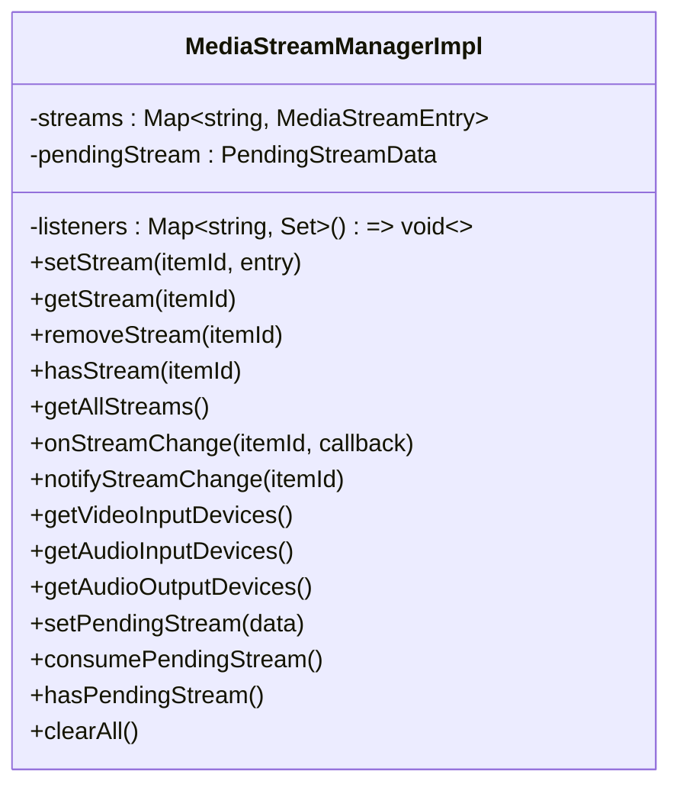

**Diagram sources**
- [media-stream-manager.ts:39-323](file://src/services/media-stream-manager.ts#L39-L323)

**Section sources**
- [media-stream-manager.ts:39-323](file://src/services/media-stream-manager.ts#L39-L323)

### PluginContextManager: Plugin Orchestration and Events
- Responsibilities:
  - Maintain readonly application state proxy for plugins.
  - Provide action handlers for scene, playback, UI, and storage operations.
  - Emit and subscribe to domain events (scene, playback, devices, UI).
  - Manage plugin slots and API registration.
  - Enforce permissions per trust level and expose requestPermission.
- Integration: App sets action handlers; pluginContextManager.updateState mirrors UI state to plugin context.

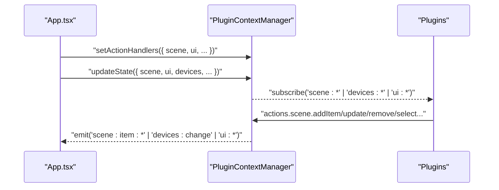

**Diagram sources**
- [plugin-context.ts:82-708](file://src/services/plugin-context.ts#L82-L708)
- [plugin-context.ts (types):146-191](file://src/types/plugin-context.ts#L146-L191)
- [App.tsx:167-187](file://src/App.tsx#L167-L187)

**Section sources**
- [plugin-context.ts:82-708](file://src/services/plugin-context.ts#L82-L708)
- [plugin-context.ts (types):146-191](file://src/types/plugin-context.ts#L146-L191)
- [App.tsx:167-187](file://src/App.tsx#L167-L187)

### PluginRegistry: Plugin Lifecycle and i18n
- Responsibilities:
  - Register plugins and wire i18n resources.
  - Initialize plugin contexts with trust levels and permissions.
  - Resolve plugins by source type and category.
- Integration: Plugins call onContextReady to register slots and subscribe to events.

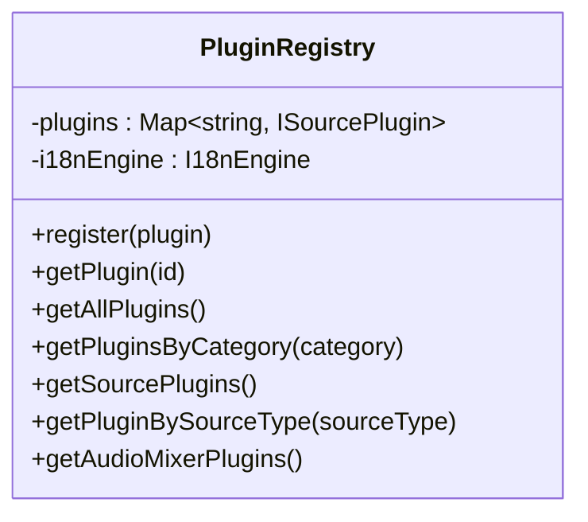

**Diagram sources**
- [plugin-registry.ts:5-168](file://src/services/plugin-registry.ts#L5-L168)

**Section sources**
- [plugin-registry.ts:5-168](file://src/services/plugin-registry.ts#L5-L168)

### App Orchestrator: User Interactions to State Updates
- Responsibilities:
  - Initialize i18n engine and apply overrides.
  - Manage active scene, selected item, streaming/pulling toggles.
  - Translate UI actions into protocol store updates and media operations.
  - Wire plugin context action handlers and sync UI state to plugin context.
  - Coordinate canvas capture for streaming and LiveKit pull service.
- Data Path: User clicks -> App handlers -> Protocol store update -> UI re-render -> MediaStreamManager notify -> Plugins react -> PluginContextManager emit events.

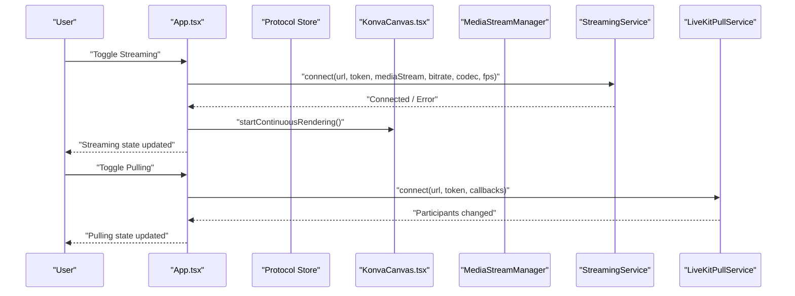

**Diagram sources**
- [App.tsx:128-800](file://src/App.tsx#L128-L800)
- [streaming.ts:6-177](file://src/services/streaming.ts#L6-L177)
- [livekit-pull.ts:49-352](file://src/services/livekit-pull.ts#L49-L352)
- [konva-canvas.tsx:113-744](file://src/components/konva-canvas.tsx#L113-L744)

**Section sources**
- [App.tsx:128-800](file://src/App.tsx#L128-L800)
- [streaming.ts:6-177](file://src/services/streaming.ts#L6-L177)
- [livekit-pull.ts:49-352](file://src/services/livekit-pull.ts#L49-L352)
- [konva-canvas.tsx:113-744](file://src/components/konva-canvas.tsx#L113-L744)

### Rendering Pipeline: Scene Items to Canvas
- Responsibilities:
  - Render scene items via plugin-rendered components or built-in shapes.
  - Apply layout and transform properties (position, size, rotation, opacity).
  - Overlay HTML elements for LiveKit streams.
  - Support drag-and-transform interactions and selection feedback.
- Data Flow: Protocol store scenes/items -> KonvaCanvas props -> PluginRenderer or built-in renderers -> DOM/Konva nodes.

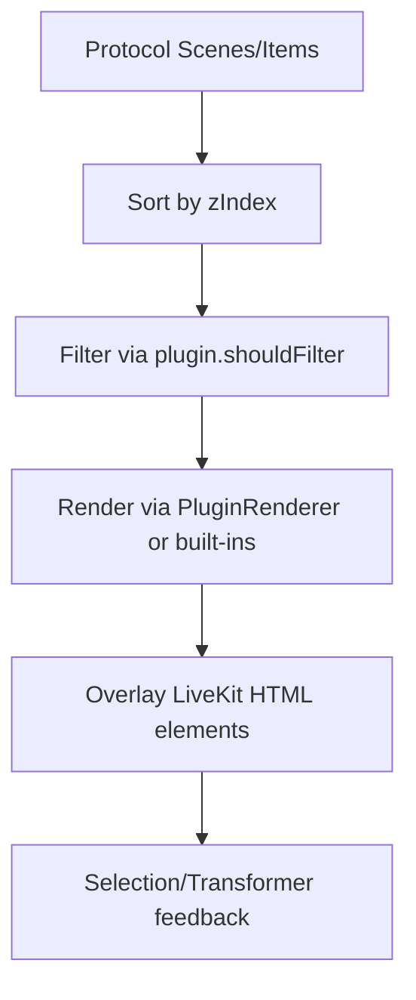

**Diagram sources**
- [konva-canvas.tsx:113-744](file://src/components/konva-canvas.tsx#L113-L744)
- [protocol.ts (types):20-82](file://src/types/protocol.ts#L20-L82)

**Section sources**
- [konva-canvas.tsx:113-744](file://src/components/konva-canvas.tsx#L113-L744)
- [protocol.ts (types):20-82](file://src/types/protocol.ts#L20-L82)

### Media Stream Propagation: From Dialogs to Plugins
- Workflow:
  - Dialog captures MediaStream (getUserMedia/getDisplayMedia).
  - Dialog sets pending stream in MediaStreamManager.
  - App consumes pending stream and creates scene item with stream metadata.
  - Plugin subscribes to onStreamChange(itemId) and renders media.
  - PropertyPanel manages device selection and stream lifecycle for media items.
- Event Model: App -> MediaStreamManager.setStream(itemId, entry) -> notifyStreamChange(itemId) -> PluginRenderer reacts -> PluginContextManager emits scene/item events.

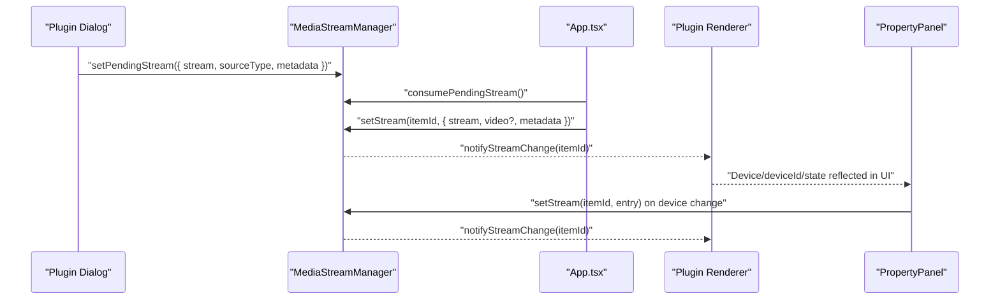

**Diagram sources**
- [media-stream-manager.ts:39-323](file://src/services/media-stream-manager.ts#L39-L323)
- [App.tsx:344-362](file://src/App.tsx#L344-L362)
- [webcam/index.tsx:110-478](file://src/plugins/builtin/webcam/index.tsx#L110-L478)
- [audio-input/index.tsx:105-555](file://src/plugins/builtin/audio-input/index.tsx#L105-L555)
- [property-panel.tsx:643-800](file://src/components/property-panel.tsx#L643-L800)

**Section sources**
- [media-stream-manager.ts:39-323](file://src/services/media-stream-manager.ts#L39-L323)
- [App.tsx:344-362](file://src/App.tsx#L344-L362)
- [webcam/index.tsx:110-478](file://src/plugins/builtin/webcam/index.tsx#L110-L478)
- [audio-input/index.tsx:105-555](file://src/plugins/builtin/audio-input/index.tsx#L105-L555)
- [property-panel.tsx:643-800](file://src/components/property-panel.tsx#L643-L800)

### Transform Operations and Plugin State Synchronization
- Transform updates:
  - Drag-and-transform in KonvaCanvas compute new layout and transform values.
  - onUpdateItem triggers protocol store updates with deep merges for layout/transform.
  - Plugins receive notifyStreamChange and can adjust rendering based on new properties.
- Plugin state:
  - Plugins maintain internal state (e.g., audio level meters) and reflect changes via notifyStreamChange.
  - PluginContextManager.updateState keeps plugin-visible state aligned with UI selections.

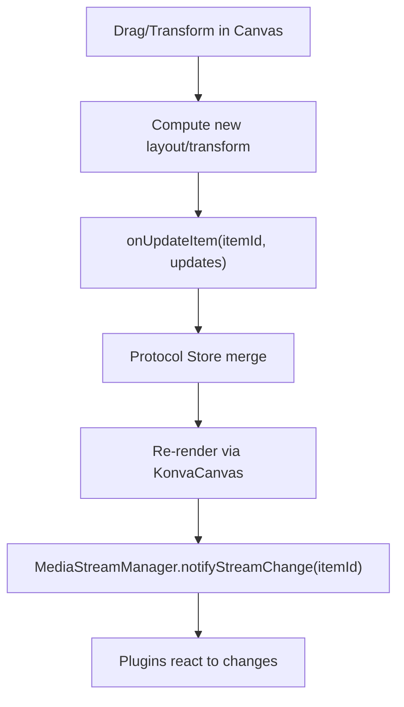

**Diagram sources**
- [konva-canvas.tsx:113-744](file://src/components/konva-canvas.tsx#L113-L744)
- [App.tsx:696-723](file://src/App.tsx#L696-L723)
- [media-stream-manager.ts:39-323](file://src/services/media-stream-manager.ts#L39-L323)
- [plugin-context.ts:82-708](file://src/services/plugin-context.ts#L82-L708)

**Section sources**
- [konva-canvas.tsx:113-744](file://src/components/konva-canvas.tsx#L113-L744)
- [App.tsx:696-723](file://src/App.tsx#L696-L723)
- [media-stream-manager.ts:39-323](file://src/services/media-stream-manager.ts#L39-L323)
- [plugin-context.ts:82-708](file://src/services/plugin-context.ts#L82-L708)

## Dependency Analysis
- App depends on:
  - Protocol store for scenes/items
  - Setting store for configuration
  - MediaStreamManager for stream lifecycle
  - PluginContextManager for plugin orchestration
  - StreamingService/LiveKitPullService for external streaming
  - PluginRegistry for plugin discovery and initialization
- UI components depend on:
  - Protocol store for rendering
  - MediaStreamManager for device/device change
  - PluginRegistry for plugin-rendered components
- Plugins depend on:
  - MediaStreamManager for stream access
  - PluginContextManager for state and actions
  - PluginRegistry for registration and slot system

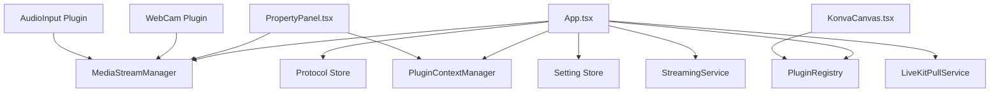

**Diagram sources**
- [App.tsx:128-800](file://src/App.tsx#L128-L800)
- [plugin-registry.ts:5-168](file://src/services/plugin-registry.ts#L5-L168)
- [media-stream-manager.ts:39-323](file://src/services/media-stream-manager.ts#L39-L323)
- [plugin-context.ts:82-708](file://src/services/plugin-context.ts#L82-L708)
- [streaming.ts:6-177](file://src/services/streaming.ts#L6-L177)
- [livekit-pull.ts:49-352](file://src/services/livekit-pull.ts#L49-L352)
- [konva-canvas.tsx:113-744](file://src/components/konva-canvas.tsx#L113-L744)
- [property-panel.tsx:643-800](file://src/components/property-panel.tsx#L643-L800)
- [webcam/index.tsx:110-478](file://src/plugins/builtin/webcam/index.tsx#L110-L478)
- [audio-input/index.tsx:105-555](file://src/plugins/builtin/audio-input/index.tsx#L105-L555)

**Section sources**
- [App.tsx:128-800](file://src/App.tsx#L128-L800)
- [plugin-registry.ts:5-168](file://src/services/plugin-registry.ts#L5-L168)
- [media-stream-manager.ts:39-323](file://src/services/media-stream-manager.ts#L39-L323)
- [plugin-context.ts:82-708](file://src/services/plugin-context.ts#L82-L708)
- [streaming.ts:6-177](file://src/services/streaming.ts#L6-L177)
- [livekit-pull.ts:49-352](file://src/services/livekit-pull.ts#L49-L352)
- [konva-canvas.tsx:113-744](file://src/components/konva-canvas.tsx#L113-L744)
- [property-panel.tsx:643-800](file://src/components/property-panel.tsx#L643-L800)
- [webcam/index.tsx:110-478](file://src/plugins/builtin/webcam/index.tsx#L110-L478)
- [audio-input/index.tsx:105-555](file://src/plugins/builtin/audio-input/index.tsx#L105-L555)

## Performance Considerations
- Continuous rendering for canvas capture: KonvaCanvas exposes start/stopContinuousRendering to keep captureStream alive during streaming; ensure to stop after streaming to reduce CPU/GPU usage.
- Stream lifecycle: Always stop tracks and remove DOM elements when removing streams to prevent leaks.
- Device enumeration: MediaStreamManager defers getUserMedia until necessary and caches device lists; avoid excessive polling.
- Plugin rendering: Use memoization and shallow comparisons to minimize re-renders; filter items via shouldFilter to reduce canvas workload.
- Event callbacks: Wrap notifyStreamChange callbacks in try/catch to prevent plugin errors from breaking the stream pipeline.

[No sources needed since this section provides general guidance]

## Troubleshooting Guide
- Streams not updating in plugins:
  - Verify notifyStreamChange(itemId) is called after setStream.
  - Ensure plugin subscribes to onStreamChange(itemId) and handles stream end events.
- Device permissions:
  - MediaStreamManager enumerates devices with permission-aware strategies; if no devices appear, request getUserMedia and re-enumerate.
- Property panel device switching:
  - PropertyPanel stops existing streams, requests new streams, and updates metadata; ensure deviceId changes trigger setStream and notifyStreamChange.
- Plugin context events not firing:
  - Confirm App sets action handlers and PluginContextManager.updateState is invoked with scene/ui/devices updates.
- Streaming/pulling failures:
  - Check StreamingService/LiveKitPullService error logs and connection state; ensure tokens and URLs are configured in Setting Store.

**Section sources**
- [media-stream-manager.ts:39-323](file://src/services/media-stream-manager.ts#L39-L323)
- [property-panel.tsx:643-800](file://src/components/property-panel.tsx#L643-L800)
- [plugin-context.ts:82-708](file://src/services/plugin-context.ts#L82-L708)
- [streaming.ts:6-177](file://src/services/streaming.ts#L6-L177)
- [livekit-pull.ts:49-352](file://src/services/livekit-pull.ts#L49-L352)

## Conclusion
LiveMixer Web’s data flow is centered on a robust event-driven architecture:
- Protocol Store and Setting Store provide durable, typed state with clear persistence boundaries.
- MediaStreamManager decouples media concerns from UI, enabling plugins to manage streams independently while keeping the system synchronized.
- PluginContextManager and PluginRegistry enforce security and permissions, while enabling rich plugin ecosystems.
- App orchestrates user interactions, state updates, and external services, ensuring seamless synchronization between local state and LiveKit streaming.

[No sources needed since this section summarizes without analyzing specific files]