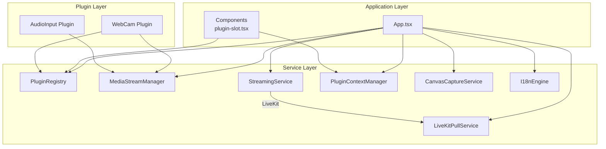
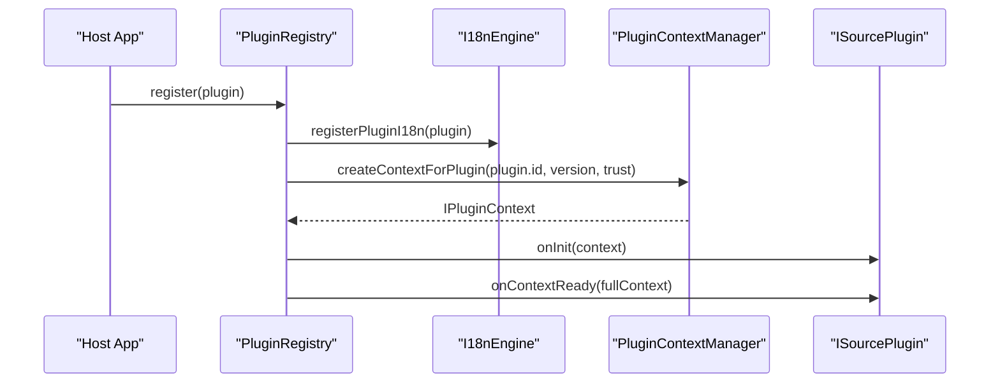
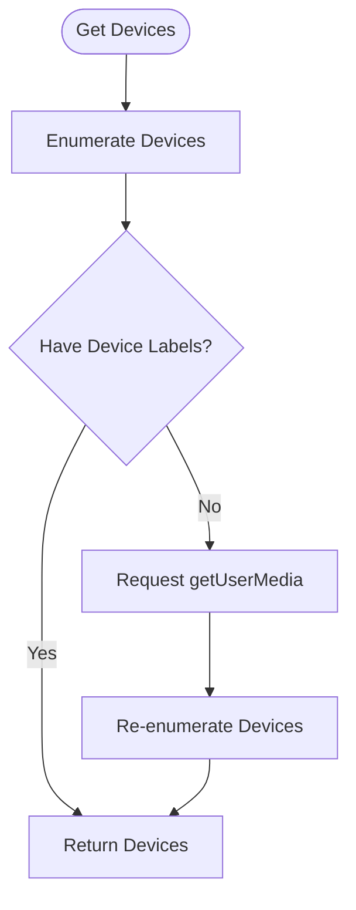
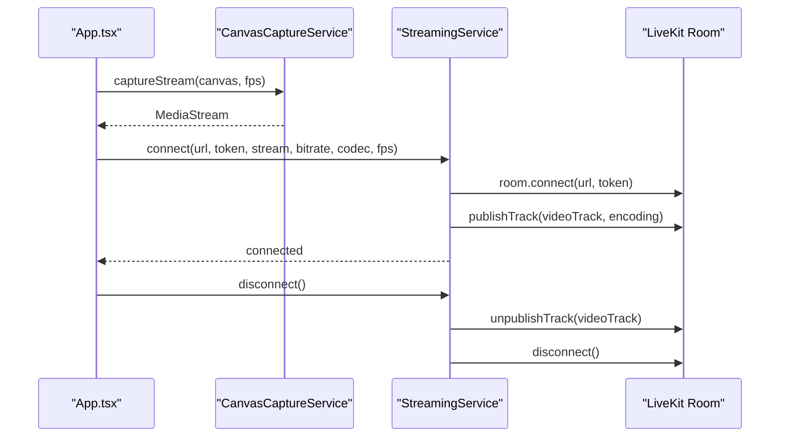
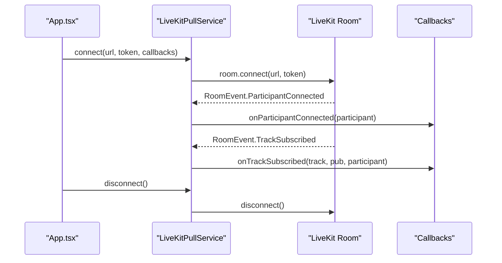
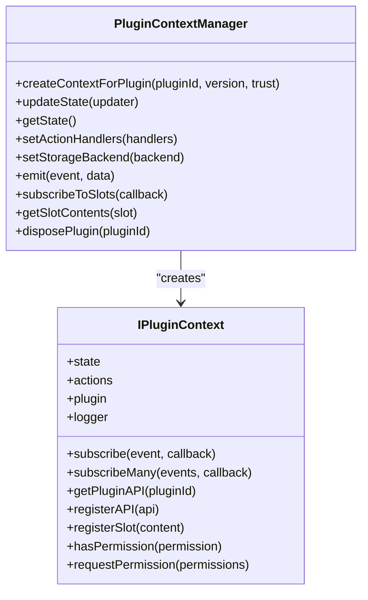
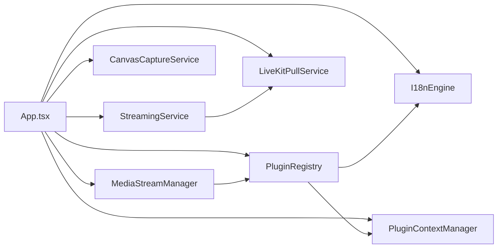

# Service Layer Architecture

<cite>
**Referenced Files in This Document**
- [plugin-registry.ts](file://src/services/plugin-registry.ts)
- [media-stream-manager.ts](file://src/services/media-stream-manager.ts)
- [streaming.ts](file://src/services/streaming.ts)
- [livekit-pull.ts](file://src/services/livekit-pull.ts)
- [plugin-context.ts](file://src/services/plugin-context.ts)
- [canvas-capture.ts](file://src/services/canvas-capture.ts)
- [i18n-engine.ts](file://src/services/i18n-engine.ts)
- [plugin.ts](file://src/types/plugin.ts)
- [plugin-context.ts](file://src/types/plugin-context.ts)
- [i18n-engine.ts](file://src/types/i18n-engine.ts)
- [App.tsx](file://src/App.tsx)
- [plugin-slot.tsx](file://src/components/plugin-slot.tsx)
- [webcam/index.tsx](file://src/plugins/builtin/webcam/index.tsx)
- [audio-input/index.tsx](file://src/plugins/builtin/audio-input/index.tsx)
- [package.json](file://package.json)
</cite>

## Table of Contents
1. [Introduction](#introduction)
2. [Project Structure](#project-structure)
3. [Core Components](#core-components)
4. [Architecture Overview](#architecture-overview)
5. [Detailed Component Analysis](#detailed-component-analysis)
6. [Dependency Analysis](#dependency-analysis)
7. [Performance Considerations](#performance-considerations)
8. [Troubleshooting Guide](#troubleshooting-guide)
9. [Conclusion](#conclusion)

## Introduction
This document describes the service layer architecture of LiveMixer Web, focusing on how business logic is organized around four core services: PluginRegistry, MediaStreamManager, StreamingService, and LiveKitPullService. It explains separation of concerns, service lifecycle, dependency injection patterns, event-driven communication, contracts and interfaces, error handling strategies, external integrations with LiveKit, asynchronous operations, and testing patterns with mocks.

## Project Structure
The service layer is implemented under the `src/services` directory and integrates with UI components and plugins under `src/components` and `src/plugins`. The main application orchestrates services and delegates UI responsibilities to components and plugins.



**Diagram sources**
- [App.tsx:1-120](file://src/App.tsx#L1-L120)
- [plugin-registry.ts:1-168](file://src/services/plugin-registry.ts#L1-L168)
- [media-stream-manager.ts:1-323](file://src/services/media-stream-manager.ts#L1-L323)
- [streaming.ts:1-177](file://src/services/streaming.ts#L1-L177)
- [livekit-pull.ts:1-352](file://src/services/livekit-pull.ts#L1-L352)
- [plugin-context.ts:1-708](file://src/services/plugin-context.ts#L1-L708)
- [canvas-capture.ts:1-48](file://src/services/canvas-capture.ts#L1-L48)
- [i18n-engine.ts:1-241](file://src/services/i18n-engine.ts#L1-L241)
- [plugin-slot.tsx:1-410](file://src/components/plugin-slot.tsx#L1-L410)
- [webcam/index.tsx:1-478](file://src/plugins/builtin/webcam/index.tsx#L1-L478)
- [audio-input/index.tsx:1-555](file://src/plugins/builtin/audio-input/index.tsx#L1-L555)

**Section sources**
- [package.json:50-77](file://package.json#L50-L77)

## Core Components
This section outlines the four primary services and their responsibilities:

- PluginRegistry: Manages plugin lifecycle, i18n registration, and context creation for plugins.
- MediaStreamManager: Centralizes media stream management, device enumeration, and event notifications.
- StreamingService: Handles LiveKit publishing of canvas streams with configurable encoding.
- LiveKitPullService: Manages LiveKit room connections for subscribing to remote participant streams.
- PluginContextManager: Provides a secure, permissioned context for plugins to access application state and actions.
- CanvasCaptureService: Captures MediaStream from a Canvas element for streaming.
- I18nEngine: Internationalization engine supporting layered resources.

**Section sources**
- [plugin-registry.ts:5-168](file://src/services/plugin-registry.ts#L5-L168)
- [media-stream-manager.ts:39-323](file://src/services/media-stream-manager.ts#L39-L323)
- [streaming.ts:6-177](file://src/services/streaming.ts#L6-L177)
- [livekit-pull.ts:49-352](file://src/services/livekit-pull.ts#L49-L352)
- [plugin-context.ts:82-708](file://src/services/plugin-context.ts#L82-L708)
- [canvas-capture.ts:5-48](file://src/services/canvas-capture.ts#L5-L48)
- [i18n-engine.ts:42-241](file://src/services/i18n-engine.ts#L42-L241)

## Architecture Overview
The service layer follows a service-oriented pattern with explicit contracts and interfaces. Services are singletons exported from their modules and consumed by the application and plugins. The PluginContextManager mediates plugin capabilities and permissions, while PluginRegistry coordinates plugin registration and i18n resources. MediaStreamManager decouples UI and plugin code from direct media device handling. StreamingService and LiveKitPullService encapsulate LiveKit integration for publishing and subscribing.

```mermaid
classDiagram
class PluginRegistry {
+register(plugin)
+getPlugin(id)
+getAllPlugins()
+getSourcePlugins()
+getPluginBySourceType(type)
+getAudioMixerPlugins()
+setI18nEngine(engine)
+getI18nEngine()
}
class MediaStreamManagerImpl {
+setStream(itemId, entry)
+getStream(itemId)
+removeStream(itemId)
+hasStream(itemId)
+getAllStreams()
+onStreamChange(itemId, callback)
+getVideoInputDevices()
+getAudioInputDevices()
+getAudioOutputDevices()
+setPendingStream(data)
+consumePendingStream()
+hasPendingStream()
+clearAll()
}
class StreamingService {
+connect(url, token, mediaStream, bitrate, codec, fps)
+disconnect()
+getConnectionState()
+getRoom()
}
class LiveKitPullService {
+connect(url, token, callbacks)
+disconnect()
+getParticipants()
+getParticipantInfo(participant)
+getParticipantVideoTrack(identity, source)
+getParticipantAudioTrack(identity)
+getConnectionState()
+getRoom()
}
class PluginContextManager {
+createContextForPlugin(pluginId, version, trust)
+updateState(updater)
+getState()
+setActionHandlers(handlers)
+setStorageBackend(backend)
+emit(event, data)
+subscribeToSlots(callback)
+getSlotContents(slot)
+disposePlugin(pluginId)
}
class CanvasCaptureService {
+captureStream(canvas, fps)
+stopCapture()
+getStream()
}
class I18nEngineImpl {
+init()
+getCurrentLanguage()
+getSupportedLanguages()
+t(key, options)
+exists(key)
+changeLanguage(lang)
+onLanguageChange(callback)
+addResource(lang, namespace, resource, options)
+addResources(lang, resources, options)
}
PluginRegistry --> I18nEngineImpl : "uses"
PluginRegistry --> PluginContextManager : "creates context"
MediaStreamManagerImpl --> PluginRegistry : "queries plugins"
StreamingService --> LiveKitPullService : "coordinates"
App["App.tsx"] --> PluginRegistry
App --> MediaStreamManagerImpl
App --> StreamingService
App --> LiveKitPullService
App --> PluginContextManager
App --> CanvasCaptureService
App --> I18nEngineImpl
```

**Diagram sources**
- [plugin-registry.ts:5-168](file://src/services/plugin-registry.ts#L5-L168)
- [media-stream-manager.ts:39-323](file://src/services/media-stream-manager.ts#L39-L323)
- [streaming.ts:6-177](file://src/services/streaming.ts#L6-L177)
- [livekit-pull.ts:49-352](file://src/services/livekit-pull.ts#L49-L352)
- [plugin-context.ts:82-708](file://src/services/plugin-context.ts#L82-L708)
- [canvas-capture.ts:5-48](file://src/services/canvas-capture.ts#L5-L48)
- [i18n-engine.ts:42-241](file://src/services/i18n-engine.ts#L42-L241)
- [App.tsx:24-30](file://src/App.tsx#L24-L30)

## Detailed Component Analysis

### PluginRegistry
Responsibilities:
- Registers plugins and initializes their contexts.
- Integrates plugin i18n resources into the global i18n engine.
- Exposes plugin discovery APIs by category, source type, and audio mixer support.

Key behaviors:
- On registration, constructs a scoped logger, asset loader, and invokes plugin lifecycle hooks.
- Supports i18n resource expansion and layered registration.
- Provides getters for plugin collections and filters for UI integration.



**Diagram sources**
- [plugin-registry.ts:78-118](file://src/services/plugin-registry.ts#L78-L118)
- [plugin-context.ts:333-456](file://src/services/plugin-context.ts#L333-L456)

**Section sources**
- [plugin-registry.ts:5-168](file://src/services/plugin-registry.ts#L5-L168)
- [plugin.ts:164-262](file://src/types/plugin.ts#L164-L262)

### MediaStreamManager
Responsibilities:
- Centralizes MediaStream lifecycle per scene item.
- Provides unified APIs for stream registration, removal, and change notifications.
- Handles device enumeration with permission-aware flows for cameras, microphones, and speakers.

Asynchronous operations:
- Uses getUserMedia with fallbacks and permission prompts.
- Manages pending stream data for dialog-to-app communication.



**Diagram sources**
- [media-stream-manager.ts:150-273](file://src/services/media-stream-manager.ts#L150-L273)

**Section sources**
- [media-stream-manager.ts:39-323](file://src/services/media-stream-manager.ts#L39-L323)

### StreamingService
Responsibilities:
- Publishes a MediaStream (typically from Canvas) to a LiveKit room.
- Configures encoding parameters (codec, bitrate, framerate) and track constraints.
- Manages connection state and cleanup.

Integration with Canvas:
- Uses CanvasCaptureService to obtain a stream from the canvas.
- Starts continuous rendering during streaming to keep frames fresh.



**Diagram sources**
- [App.tsx:725-788](file://src/App.tsx#L725-L788)
- [canvas-capture.ts:14-24](file://src/services/canvas-capture.ts#L14-L24)
- [streaming.ts:20-124](file://src/services/streaming.ts#L20-L124)

**Section sources**
- [streaming.ts:6-177](file://src/services/streaming.ts#L6-L177)
- [canvas-capture.ts:5-48](file://src/services/canvas-capture.ts#L5-L48)
- [App.tsx:725-788](file://src/App.tsx#L725-L788)

### LiveKitPullService
Responsibilities:
- Connects to a LiveKit room to subscribe to remote participant audio/video.
- Exposes participant and track information retrieval.
- Emits participant change events to subscribers.



**Diagram sources**
- [livekit-pull.ts:60-179](file://src/services/livekit-pull.ts#L60-L179)
- [App.tsx:790-824](file://src/App.tsx#L790-L824)

**Section sources**
- [livekit-pull.ts:49-352](file://src/services/livekit-pull.ts#L49-L352)
- [App.tsx:790-824](file://src/App.tsx#L790-L824)

### PluginContextManager
Responsibilities:
- Creates secure, permissioned plugin contexts with readonly state proxies.
- Provides action handlers for scene, playback, UI, and storage operations.
- Manages plugin slots, events, and API communication between plugins.

Security model:
- Enforces permission checks for all actions.
- Disposes plugin contexts and cleans up subscriptions and slots.



**Diagram sources**
- [plugin-context.ts:82-708](file://src/services/plugin-context.ts#L82-L708)
- [plugin-context.ts:322-403](file://src/types/plugin-context.ts#L322-L403)

**Section sources**
- [plugin-context.ts:82-708](file://src/services/plugin-context.ts#L82-L708)
- [plugin-context.ts:17-85](file://src/types/plugin-context.ts#L17-L85)

### CanvasCaptureService
Responsibilities:
- Captures a MediaStream from a Canvas element at a given FPS.
- Stops capture and exposes the current stream.

**Section sources**
- [canvas-capture.ts:5-48](file://src/services/canvas-capture.ts#L5-L48)

### I18nEngine
Responsibilities:
- Implements layered internationalization with priority: core < plugin < host < user.
- Initializes i18next with language detection and persistence.
- Provides resource addition and language change notifications.

**Section sources**
- [i18n-engine.ts:42-241](file://src/services/i18n-engine.ts#L42-L241)
- [i18n-engine.ts:12-65](file://src/types/i18n-engine.ts#L12-L65)

## Dependency Analysis
Service dependencies and coupling:
- App.tsx depends on all core services for orchestration.
- Plugins depend on PluginRegistry and MediaStreamManager for stream handling.
- StreamingService and LiveKitPullService both depend on LiveKit client library.
- PluginContextManager depends on Plugin types for contracts and permissions.
- I18nEngine is injected into PluginRegistry for plugin localization.



**Diagram sources**
- [App.tsx:24-30](file://src/App.tsx#L24-L30)
- [plugin-registry.ts:1-3](file://src/services/plugin-registry.ts#L1-L3)
- [media-stream-manager.ts:1-12](file://src/services/media-stream-manager.ts#L1-L12)
- [streaming.ts](file://src/services/streaming.ts#L1)
- [livekit-pull.ts:1-9](file://src/services/livekit-pull.ts#L1-L9)
- [plugin-context.ts:11-22](file://src/services/plugin-context.ts#L11-L22)
- [i18n-engine.ts:1-9](file://src/services/i18n-engine.ts#L1-L9)

**Section sources**
- [package.json:68-76](file://package.json#L68-L76)

## Performance Considerations
- MediaStream lifecycle: Always stop tracks and remove DOM elements when streams are removed to prevent memory leaks.
- Encoding parameters: Choose appropriate codecs and bitrates for network conditions; StreamingService applies constraints to optimize quality.
- Device enumeration: Minimize getUserMedia calls and cache device lists when possible.
- Event callbacks: Wrap callback invocations in try/catch to avoid breaking the event loop.
- Canvas capture: Keep continuous rendering only during streaming to reduce CPU usage.

## Troubleshooting Guide
Common issues and strategies:
- Permission errors for camera/microphone: Use MediaStreamManager’s device enumeration methods which handle permission prompts and fallbacks.
- Stream not publishing: Verify MediaStream has video tracks and constraints are applied; check connection state via StreamingService.
- Pull service not receiving tracks: Confirm participant identities and track publications; use participant info getters to verify states.
- Plugin context errors: Ensure PluginContextManager has action handlers configured; verify permissions for plugin actions.
- i18n resource conflicts: Use layered resource addition with distinct namespaces to avoid collisions.

**Section sources**
- [media-stream-manager.ts:150-273](file://src/services/media-stream-manager.ts#L150-L273)
- [streaming.ts:119-124](file://src/services/streaming.ts#L119-L124)
- [livekit-pull.ts:174-179](file://src/services/livekit-pull.ts#L174-L179)
- [plugin-context.ts:532-700](file://src/services/plugin-context.ts#L532-L700)
- [i18n-engine.ts:188-221](file://src/services/i18n-engine.ts#L188-L221)

## Conclusion
LiveMixer Web’s service layer cleanly separates concerns among plugin management, media stream handling, LiveKit integration, and plugin context provisioning. Contracts and interfaces define clear boundaries, while dependency injection and event-driven communication enable loose coupling. The architecture supports extensibility through plugins, robustness through error handling, and maintainability through centralized services.