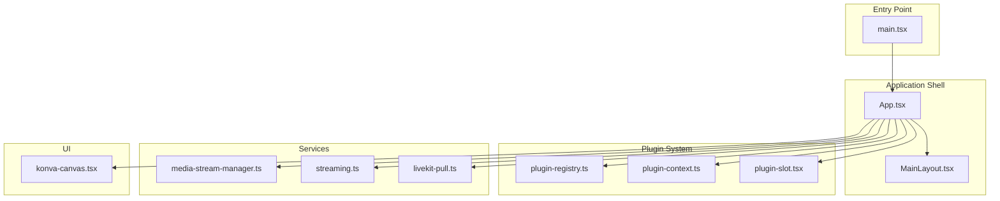
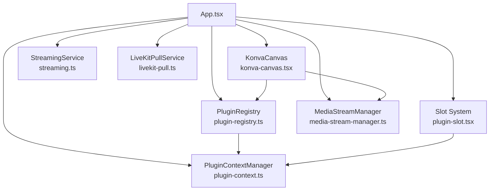
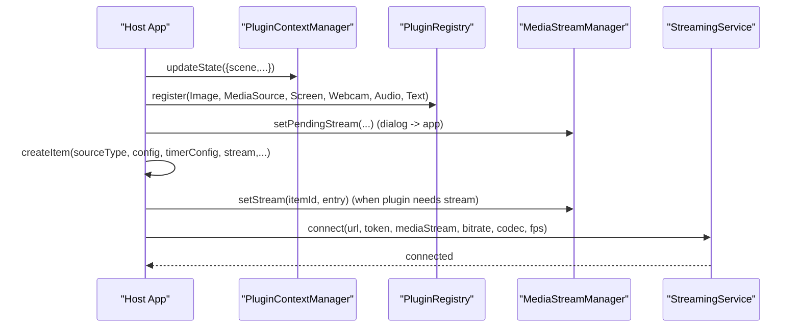
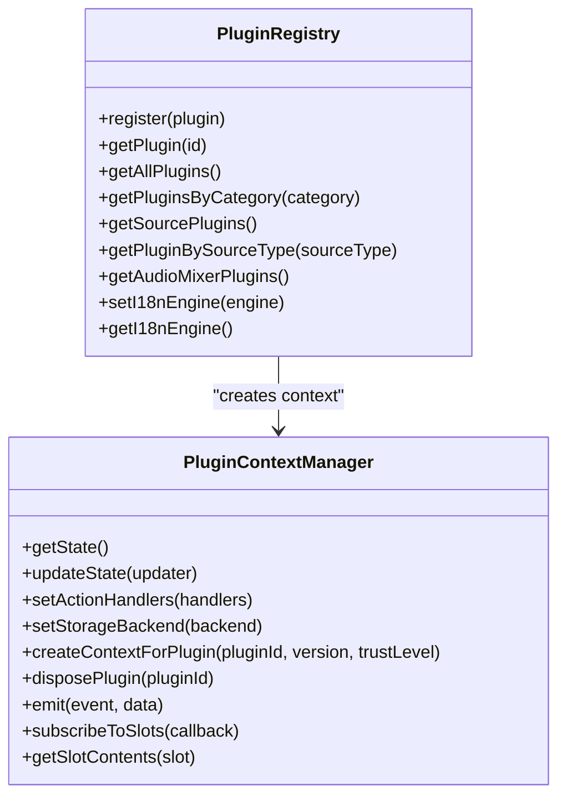
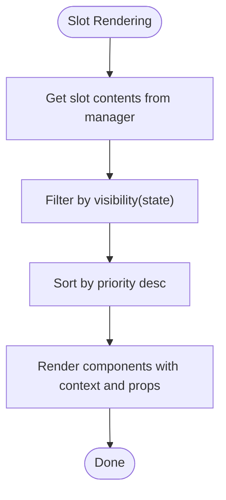
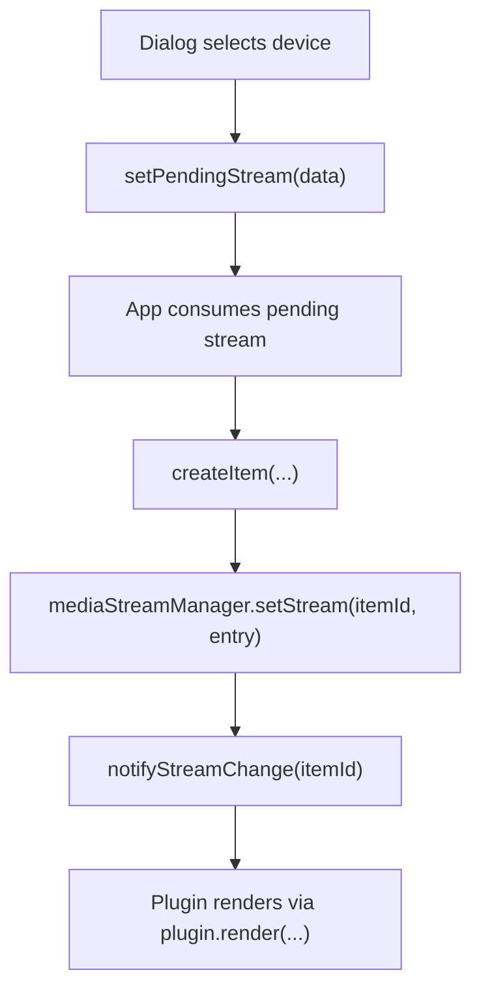
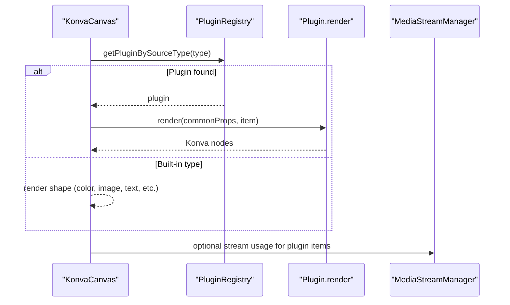
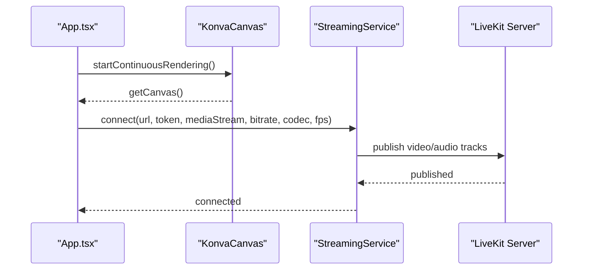
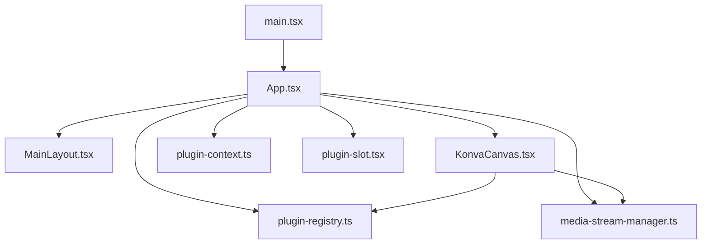
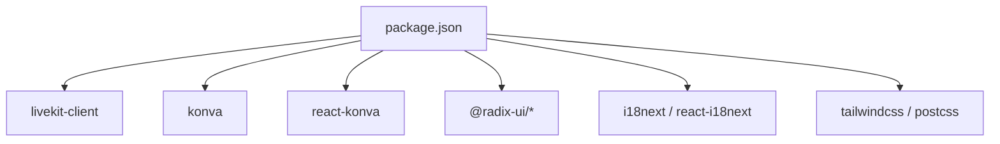

# System Design

<cite>
**Referenced Files in This Document**
- [App.tsx](file://src/App.tsx)
- [main.tsx](file://src/main.tsx)
- [plugin-registry.ts](file://src/services/plugin-registry.ts)
- [plugin-context.ts](file://src/services/plugin-context.ts)
- [plugin-slot.tsx](file://src/components/plugin-slot.tsx)
- [media-stream-manager.ts](file://src/services/media-stream-manager.ts)
- [plugin.ts](file://src/types/plugin.ts)
- [plugin-context.ts (types)](file://src/types/plugin-context.ts)
- [konva-canvas.tsx](file://src/components/konva-canvas.tsx)
- [livekit-pull.ts](file://src/services/livekit-pull.ts)
- [streaming.ts](file://src/services/streaming.ts)
- [main-layout.tsx](file://src/components/main-layout.tsx)
- [package.json](file://package.json)
</cite>

## Table of Contents
1. [Introduction](#introduction)
2. [Project Structure](#project-structure)
3. [Core Components](#core-components)
4. [Architecture Overview](#architecture-overview)
5. [Detailed Component Analysis](#detailed-component-analysis)
6. [Dependency Analysis](#dependency-analysis)
7. [Performance Considerations](#performance-considerations)
8. [Troubleshooting Guide](#troubleshooting-guide)
9. [Conclusion](#conclusion)
10. [Appendices](#appendices)

## Introduction
This document describes the system design of LiveMixer Web, an interactive live video mixer and streaming application. It focuses on the overall architecture, the plugin registry and plugin context systems, the service layer, and the component hierarchy from the main application entry point down to individual services. It also documents system boundaries, external dependencies (LiveKit, Konva, Radix UI), and integration points. Design patterns covered include service-oriented architecture, plugin pattern, and component-based design.

## Project Structure
LiveMixer Web follows a layered, component-based structure:
- Entry point: main.tsx registers built-in plugins and mounts the App inside a PluginContextProvider.
- Application shell: App.tsx orchestrates UI state, i18n initialization, plugin context synchronization, and service interactions.
- Services: Plugin registry, plugin context manager, media stream manager, streaming, and pull services encapsulate cross-cutting concerns.
- UI components: React components organized by feature (layout, panels, dialogs, canvas) with a plugin-driven rendering pipeline.
- Types: Strongly typed plugin contracts, context interfaces, and protocol definitions.

**Diagram sources**
- [main.tsx:14-28](file://src/main.tsx#L14-L28)
- [App.tsx:38-126](file://src/App.tsx#L38-L126)
- [plugin-registry.ts:5-168](file://src/services/plugin-registry.ts#L5-L168)
- [plugin-context.ts:82-708](file://src/services/plugin-context.ts#L82-L708)
- [plugin-slot.tsx:49-116](file://src/components/plugin-slot.tsx#L49-L116)
- [media-stream-manager.ts:39-323](file://src/services/media-stream-manager.ts#L39-L323)
- [streaming.ts:6-177](file://src/services/streaming.ts#L6-L177)
- [livekit-pull.ts:49-352](file://src/services/livekit-pull.ts#L49-L352)
- [konva-canvas.tsx:113-744](file://src/components/konva-canvas.tsx#L113-L744)
- [main-layout.tsx:14-77](file://src/components/main-layout.tsx#L14-L77)

**Section sources**
- [main.tsx:14-28](file://src/main.tsx#L14-L28)
- [App.tsx:38-126](file://src/App.tsx#L38-L126)

## Core Components
- Application entry and bootstrapping:
  - main.tsx registers built-in plugins and wraps App with PluginContextProvider.
- Application orchestration:
  - App.tsx initializes i18n, synchronizes plugin context state, coordinates plugin dialogs, and manages push/pull streaming.
- Plugin registry:
  - plugin-registry.ts maintains plugin metadata, i18n registration, and plugin lifecycle hooks.
- Plugin context manager:
  - plugin-context.ts provides a secure, permissioned API surface for plugins, including state proxies, event subscriptions, actions, and slot registration.
- Plugin slot system:
  - plugin-slot.tsx exposes React hooks and components to render plugin UI into predefined slots and dialogs.
- Media stream management:
  - media-stream-manager.ts centralizes stream creation, caching, change notifications, and device enumeration.
- Canvas rendering:
  - konva-canvas.tsx renders SceneItems via plugin-defined renderers or built-in shapes, integrates with LiveKit overlays, and supports selection/transform.
- Streaming services:
  - streaming.ts publishes canvas output to LiveKit.
  - livekit-pull.ts subscribes to remote participants’ tracks.

**Section sources**
- [main.tsx:14-28](file://src/main.tsx#L14-L28)
- [App.tsx:128-808](file://src/App.tsx#L128-L808)
- [plugin-registry.ts:5-168](file://src/services/plugin-registry.ts#L5-L168)
- [plugin-context.ts:82-708](file://src/services/plugin-context.ts#L82-L708)
- [plugin-slot.tsx:49-410](file://src/components/plugin-slot.tsx#L49-L410)
- [media-stream-manager.ts:39-323](file://src/services/media-stream-manager.ts#L39-L323)
- [konva-canvas.tsx:113-744](file://src/components/konva-canvas.tsx#L113-L744)
- [streaming.ts:6-177](file://src/services/streaming.ts#L6-L177)
- [livekit-pull.ts:49-352](file://src/services/livekit-pull.ts#L49-L352)

## Architecture Overview
LiveMixer Web adopts a service-oriented architecture with a plugin-driven UI:
- The host application (App.tsx) owns the global state and orchestrates services.
- Plugins register via plugin-registry.ts and receive a scoped, permissioned context from plugin-context.ts.
- The slot system (plugin-slot.tsx) enables plugins to inject UI into predefined locations.
- Media streams are managed centrally by media-stream-manager.ts to decouple UI from plugin internals.
- Canvas rendering delegates to plugins for specialized rendering while maintaining a unified selection/transform UX.
- Streaming services integrate with LiveKit for publishing and subscribing to real-time media.

**Diagram sources**
- [App.tsx:38-126](file://src/App.tsx#L38-L126)
- [plugin-registry.ts:5-168](file://src/services/plugin-registry.ts#L5-L168)
- [plugin-context.ts:82-708](file://src/services/plugin-context.ts#L82-L708)
- [plugin-slot.tsx:49-410](file://src/components/plugin-slot.tsx#L49-L410)
- [media-stream-manager.ts:39-323](file://src/services/media-stream-manager.ts#L39-L323)
- [konva-canvas.tsx:113-744](file://src/components/konva-canvas.tsx#L113-L744)
- [streaming.ts:6-177](file://src/services/streaming.ts#L6-L177)
- [livekit-pull.ts:49-352](file://src/services/livekit-pull.ts#L49-L352)

## Detailed Component Analysis

### Application Orchestration (App.tsx)
- Initializes i18n engine and applies host-provided overrides.
- Synchronizes plugin context state and action handlers.
- Manages add-source dialogs, plugin dialog flows, and item creation with plugin-aware defaults and stream initialization.
- Coordinates push streaming to LiveKit and pull streaming from LiveKit.

**Diagram sources**
- [App.tsx:128-574](file://src/App.tsx#L128-L574)
- [plugin-context.ts:187-223](file://src/services/plugin-context.ts#L187-L223)
- [plugin-registry.ts:78-118](file://src/services/plugin-registry.ts#L78-L118)
- [media-stream-manager.ts:56-64](file://src/services/media-stream-manager.ts#L56-L64)
- [streaming.ts:20-124](file://src/services/streaming.ts#L20-L124)

**Section sources**
- [App.tsx:128-574](file://src/App.tsx#L128-L574)

### Plugin Registry and Context (plugin-registry.ts, plugin-context.ts)
- PluginRegistry:
  - Registers plugins, sets i18n resources, creates plugin context, and exposes lookup by source type.
- PluginContextManager:
  - Provides a readonly state proxy, event subscription, scoped actions, plugin API registry, and slot registration with permission checks.

**Diagram sources**
- [plugin-registry.ts:5-168](file://src/services/plugin-registry.ts#L5-L168)
- [plugin-context.ts:82-708](file://src/services/plugin-context.ts#L82-L708)

**Section sources**
- [plugin-registry.ts:5-168](file://src/services/plugin-registry.ts#L5-L168)
- [plugin-context.ts:82-708](file://src/services/plugin-context.ts#L82-L708)

### Plugin Slot System (plugin-slot.tsx)
- Provides PluginContextProvider, hooks for context/state/event/slots, and Slot/DialogSlot components.
- Renders plugin-registered UI into predefined slots with priority ordering and visibility conditions.

**Diagram sources**
- [plugin-slot.tsx:192-264](file://src/components/plugin-slot.tsx#L192-L264)
- [plugin-slot.tsx:320-363](file://src/components/plugin-slot.tsx#L320-L363)

**Section sources**
- [plugin-slot.tsx:49-410](file://src/components/plugin-slot.tsx#L49-L410)

### Media Stream Management (media-stream-manager.ts)
- Centralizes stream registration, change notifications, device enumeration, and pending stream handoff between dialogs and the app.

**Diagram sources**
- [media-stream-manager.ts:282-294](file://src/services/media-stream-manager.ts#L282-L294)
- [App.tsx:372-574](file://src/App.tsx#L372-L574)

**Section sources**
- [media-stream-manager.ts:39-323](file://src/services/media-stream-manager.ts#L39-L323)

### Canvas Rendering Pipeline (konva-canvas.tsx)
- Renders SceneItems either via plugin.render or built-in shapes.
- Integrates LiveKit overlays for livekit_stream items.
- Supports selection, transform, drag/drop, and plugin-controlled filtering/selectability.

**Diagram sources**
- [konva-canvas.tsx:459-601](file://src/components/konva-canvas.tsx#L459-L601)
- [plugin-registry.ts:144-157](file://src/services/plugin-registry.ts#L144-L157)
- [media-stream-manager.ts:56-64](file://src/services/media-stream-manager.ts#L56-L64)

**Section sources**
- [konva-canvas.tsx:113-744](file://src/components/konva-canvas.tsx#L113-L744)

### Streaming Services (streaming.ts, livekit-pull.ts)
- StreamingService publishes a MediaStream (typically canvas output) to LiveKit with configurable codec, bitrate, and framerate.
- LiveKitPullService connects to a room and notifies about participant and track events.

**Diagram sources**
- [App.tsx:726-788](file://src/App.tsx#L726-L788)
- [konva-canvas.tsx:145-176](file://src/components/konva-canvas.tsx#L145-L176)
- [streaming.ts:20-124](file://src/services/streaming.ts#L20-L124)

**Section sources**
- [streaming.ts:6-177](file://src/services/streaming.ts#L6-L177)
- [livekit-pull.ts:49-352](file://src/services/livekit-pull.ts#L49-L352)

### Component Hierarchy Down to Individual Services
- Entry point: main.tsx registers plugins and mounts App under PluginContextProvider.
- App.tsx orchestrates i18n, plugin context, dialogs, and services.
- UI layout: MainLayout.tsx composes toolbar, sidebars, canvas, bottom bar, and status bar.
- Canvas: KonvaCanvas renders items and integrates overlays.
- Plugin system: PluginRegistry and PluginContextManager coordinate plugin lifecycle and permissions.
- Slots: plugin-slot.tsx renders plugin UI into slots and dialogs.
- Streams: media-stream-manager.ts mediates stream creation and change notifications.

**Diagram sources**
- [main.tsx:14-28](file://src/main.tsx#L14-L28)
- [App.tsx:38-126](file://src/App.tsx#L38-L126)
- [main-layout.tsx:14-77](file://src/components/main-layout.tsx#L14-L77)
- [konva-canvas.tsx:113-744](file://src/components/konva-canvas.tsx#L113-L744)
- [plugin-registry.ts:5-168](file://src/services/plugin-registry.ts#L5-L168)
- [plugin-context.ts:82-708](file://src/services/plugin-context.ts#L82-L708)
- [plugin-slot.tsx:49-410](file://src/components/plugin-slot.tsx#L49-L410)
- [media-stream-manager.ts:39-323](file://src/services/media-stream-manager.ts#L39-L323)

**Section sources**
- [main.tsx:14-28](file://src/main.tsx#L14-L28)
- [App.tsx:38-126](file://src/App.tsx#L38-L126)
- [main-layout.tsx:14-77](file://src/components/main-layout.tsx#L14-L77)
- [konva-canvas.tsx:113-744](file://src/components/konva-canvas.tsx#L113-L744)

## Dependency Analysis
External dependencies include:
- LiveKit client for real-time streaming.
- Konva and react-konva for canvas rendering.
- Radix UI primitives for accessible UI components.
- i18n libraries for internationalization.
- Tailwind and related tooling for styling.

**Diagram sources**
- [package.json:50-77](file://package.json#L50-L77)

**Section sources**
- [package.json:50-77](file://package.json#L50-L77)

## Performance Considerations
- Continuous rendering: KonvaCanvas starts a render loop to keep captureStream alive during push streaming.
- Efficient stream updates: MediaStreamManager batches change notifications and cleans up tracks on removal.
- Canvas scaling and HiDPI: KonvaCanvas computes pixel ratio and scales stage to maintain crisp visuals.
- Plugin rendering: PluginRenderer uses memoization to avoid unnecessary re-renders.
- LiveKit encoding: StreamingService applies constraints and encodings to balance quality and bandwidth.

[No sources needed since this section provides general guidance]

## Troubleshooting Guide
- Push streaming fails:
  - Verify LiveKit URL and token are configured.
  - Ensure canvas output has a video track and continuous rendering is active.
- Pull streaming issues:
  - Confirm room connectivity and participant presence.
  - Check track subscription callbacks and participant state changes.
- Plugin dialogs not appearing:
  - Ensure plugin registers its dialog via ctx.registerSlot and the dialog slot is active.
- Stream not updating:
  - Confirm mediaStreamManager.notifyStreamChange is invoked after stream updates.
- Canvas selection/transform not working:
  - Check plugin canvasRender.isSelectable configuration and item lock state.

**Section sources**
- [App.tsx:726-788](file://src/App.tsx#L726-L788)
- [livekit-pull.ts:60-179](file://src/services/livekit-pull.ts#L60-L179)
- [plugin-slot.tsx:320-363](file://src/components/plugin-slot.tsx#L320-L363)
- [media-stream-manager.ts:130-141](file://src/services/media-stream-manager.ts#L130-L141)
- [konva-canvas.tsx:187-202](file://src/components/konva-canvas.tsx#L187-L202)

## Conclusion
LiveMixer Web’s architecture cleanly separates UI concerns from business logic through a service-oriented design. The plugin registry and context system enforce security and modularity, while the slot system enables flexible UI composition. The media stream manager and canvas rendering pipeline provide a robust foundation for plugin-driven rendering and real-time streaming integrations with LiveKit. This design supports extensibility, maintainability, and a consistent developer experience for third-party plugin authors.

## Appendices
- Plugin contract and permissions:
  - ISourcePlugin defines plugin capabilities, UI integration, and lifecycle hooks.
  - IPluginContext specifies the permissioned API surface for plugins.

**Section sources**
- [plugin.ts:164-262](file://src/types/plugin.ts#L164-L262)
- [plugin-context.ts (types):322-403](file://src/types/plugin-context.ts#L322-L403)