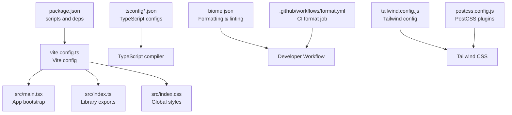
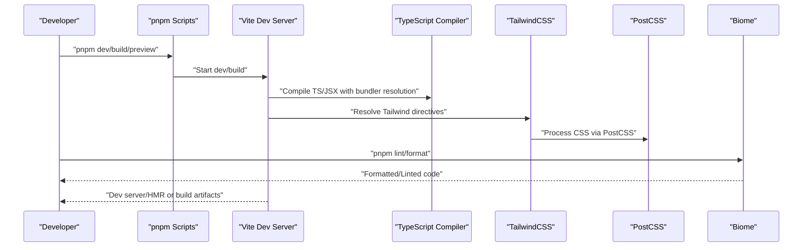
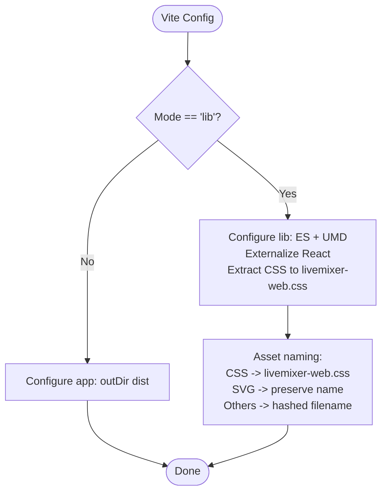
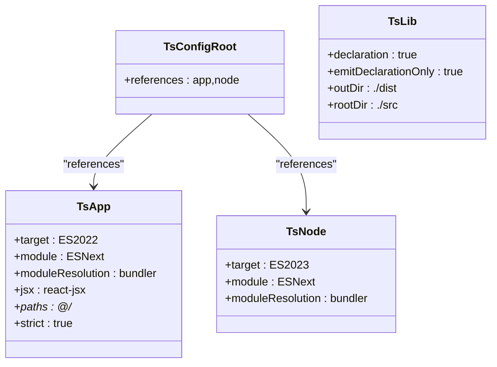
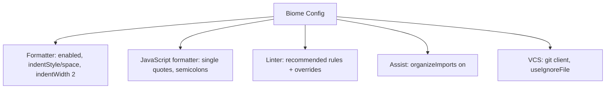
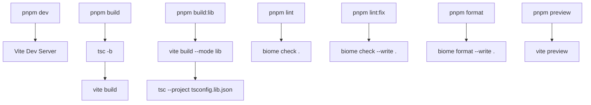
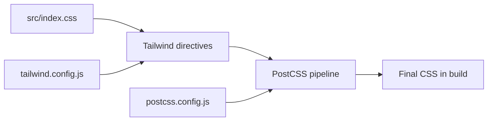
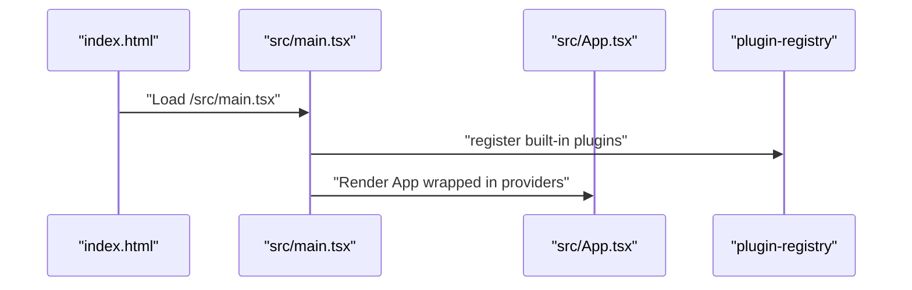
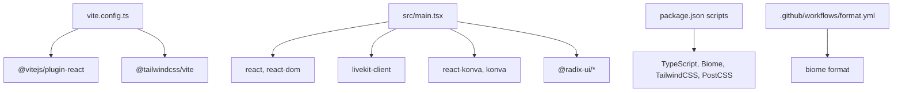

# Build and Development

<cite>
**Referenced Files in This Document**
- [package.json](file://package.json)
- [vite.config.ts](file://vite.config.ts)
- [tsconfig.json](file://tsconfig.json)
- [tsconfig.app.json](file://tsconfig.app.json)
- [tsconfig.lib.json](file://tsconfig.lib.json)
- [tsconfig.node.json](file://tsconfig.node.json)
- [biome.json](file://biome.json)
- [postcss.config.js](file://postcss.config.js)
- [tailwind.config.js](file://tailwind.config.js)
- [components.json](file://components.json)
- [index.html](file://index.html)
- [src/main.tsx](file://src/main.tsx)
- [src/index.ts](file://src/index.ts)
- [src/index.css](file://src/index.css)
- [.github/workflows/format.yml](file://.github/workflows/format.yml)
</cite>

## Table of Contents
1. [Introduction](#introduction)
2. [Project Structure](#project-structure)
3. [Core Components](#core-components)
4. [Architecture Overview](#architecture-overview)
5. [Detailed Component Analysis](#detailed-component-analysis)
6. [Dependency Analysis](#dependency-analysis)
7. [Performance Considerations](#performance-considerations)
8. [Troubleshooting Guide](#troubleshooting-guide)
9. [Conclusion](#conclusion)
10. [Appendices](#appendices)

## Introduction
This document explains how to build and develop LiveMixer Web using Vite, TypeScript, Biome, and TailwindCSS. It covers development server configuration, build modes (application and library), asset handling, TypeScript compilation targets and module resolution, Biome formatting and linting rules, package scripts, and styling pipeline via PostCSS and TailwindCSS. It also provides practical guidance for development workflow, debugging, performance optimization, and production build considerations.

## Project Structure
LiveMixer Web follows a modern frontend stack:
- Application entry points render a React app and register built-in plugins.
- Vite orchestrates development and build processes with React and Tailwind plugins.
- TypeScript compiles source code with separate configurations for app, library, and node environments.
- Biome enforces formatting and linting rules across the codebase.
- TailwindCSS provides utility-first styling with PostCSS integration.

**Diagram sources**
- [package.json:41-49](file://package.json#L41-L49)
- [vite.config.ts:7-61](file://vite.config.ts#L7-L61)
- [src/main.tsx:1-29](file://src/main.tsx#L1-L29)
- [src/index.ts:1-30](file://src/index.ts#L1-L30)
- [src/index.css:1-121](file://src/index.css#L1-L121)
- [tsconfig.json:1-8](file://tsconfig.json#L1-L8)
- [tsconfig.app.json:1-34](file://tsconfig.app.json#L1-L34)
- [tsconfig.lib.json:1-38](file://tsconfig.lib.json#L1-L38)
- [tsconfig.node.json:1-27](file://tsconfig.node.json#L1-L27)
- [biome.json:1-58](file://biome.json#L1-L58)
- [tailwind.config.js:1-7](file://tailwind.config.js#L1-L7)
- [postcss.config.js:1-7](file://postcss.config.js#L1-L7)
- [.github/workflows/format.yml:1-43](file://.github/workflows/format.yml#L1-L43)

**Section sources**
- [package.json:1-94](file://package.json#L1-L94)
- [vite.config.ts:1-61](file://vite.config.ts#L1-L61)
- [tsconfig.json:1-8](file://tsconfig.json#L1-L8)
- [tsconfig.app.json:1-34](file://tsconfig.app.json#L1-L34)
- [tsconfig.lib.json:1-38](file://tsconfig.lib.json#L1-L38)
- [tsconfig.node.json:1-27](file://tsconfig.node.json#L1-L27)
- [biome.json:1-58](file://biome.json#L1-L58)
- [tailwind.config.js:1-7](file://tailwind.config.js#L1-L7)
- [postcss.config.js:1-7](file://postcss.config.js#L1-L7)
- [components.json:1-21](file://components.json#L1-L21)
- [index.html:1-16](file://index.html#L1-L16)
- [src/main.tsx:1-29](file://src/main.tsx#L1-L29)
- [src/index.ts:1-30](file://src/index.ts#L1-L30)
- [src/index.css:1-121](file://src/index.css#L1-L121)
- [.github/workflows/format.yml:1-43](file://.github/workflows/format.yml#L1-L43)

## Core Components
- Vite configuration defines plugins, path aliases, and build modes. Library mode produces ES and UMD bundles with externalized React dependencies and extracted CSS.
- TypeScript configurations split concerns across app, library, and node environments, enabling strict type checking and bundler-compatible module resolution.
- Biome enforces formatting and linting with recommended rules and selective overrides.
- TailwindCSS and PostCSS handle utility-first styling and CSS processing.
- Package scripts automate development, building, library packaging, linting, formatting, and previewing.

**Section sources**
- [vite.config.ts:7-61](file://vite.config.ts#L7-L61)
- [tsconfig.app.json:1-34](file://tsconfig.app.json#L1-L34)
- [tsconfig.lib.json:1-38](file://tsconfig.lib.json#L1-L38)
- [tsconfig.node.json:1-27](file://tsconfig.node.json#L1-L27)
- [biome.json:1-58](file://biome.json#L1-L58)
- [tailwind.config.js:1-7](file://tailwind.config.js#L1-L7)
- [postcss.config.js:1-7](file://postcss.config.js#L1-L7)
- [package.json:41-49](file://package.json#L41-L49)

## Architecture Overview
The build and development pipeline integrates Vite, TypeScript, Biome, and TailwindCSS:

**Diagram sources**
- [package.json:41-49](file://package.json#L41-L49)
- [vite.config.ts:7-61](file://vite.config.ts#L7-L61)
- [tsconfig.app.json:1-34](file://tsconfig.app.json#L1-L34)
- [tailwind.config.js:1-7](file://tailwind.config.js#L1-L7)
- [postcss.config.js:1-7](file://postcss.config.js#L1-L7)
- [biome.json:1-58](file://biome.json#L1-L58)

## Detailed Component Analysis

### Vite Configuration
- Plugins: React Fast Refresh and TailwindCSS integration are enabled.
- Aliasing: '@' resolves to the src directory for clean imports.
- Modes:
  - Application mode: sets output directory for distribution builds.
  - Library mode: builds an ES module and UMD bundle, externalizes React, and extracts CSS into a single file while preserving asset names for SVGs and hashing others.

**Diagram sources**
- [vite.config.ts:7-61](file://vite.config.ts#L7-L61)

**Section sources**
- [vite.config.ts:7-61](file://vite.config.ts#L7-L61)

### TypeScript Configuration
- Root tsconfig references app and node configs.
- App config:
  - Targets ES2022, uses bundler module resolution, JSX with react-jsx, path aliases, and strict type checking.
  - Includes src, protocol, and example plugin docs.
- Library config:
  - Emits declarations and declaration maps, outputs to dist, excludes test files and main entry.
- Node config:
  - Targets ES2023, includes Vite config for build-time type checks.

**Diagram sources**
- [tsconfig.json:1-8](file://tsconfig.json#L1-L8)
- [tsconfig.app.json:1-34](file://tsconfig.app.json#L1-L34)
- [tsconfig.lib.json:1-38](file://tsconfig.lib.json#L1-L38)
- [tsconfig.node.json:1-27](file://tsconfig.node.json#L1-L27)

**Section sources**
- [tsconfig.json:1-8](file://tsconfig.json#L1-L8)
- [tsconfig.app.json:1-34](file://tsconfig.app.json#L1-L34)
- [tsconfig.lib.json:1-38](file://tsconfig.lib.json#L1-L38)
- [tsconfig.node.json:1-27](file://tsconfig.node.json#L1-L27)

### Biome Code Quality Tools
- Formatting: Enabled with space indentation and width 2; JavaScript single quotes and semicolons enforced.
- Linting: Recommended rules enabled with targeted overrides (e.g., disabling certain suspicious and correctness rules).
- Assist: Organize imports automatically.
- VCS: Git integration with ignore file support.

**Diagram sources**
- [biome.json:1-58](file://biome.json#L1-L58)

**Section sources**
- [biome.json:1-58](file://biome.json#L1-L58)

### Package Scripts
- Development: Starts Vite dev server.
- Build: Runs TypeScript project build then Vite build.
- Library build: Builds library bundle with Vite lib mode and generates type declarations.
- Linting and formatting: Runs Biome checks and write operations.
- Preview: Serves the production build locally.

**Diagram sources**
- [package.json:41-49](file://package.json#L41-L49)
- [vite.config.ts:7-61](file://vite.config.ts#L7-L61)
- [tsconfig.lib.json:1-38](file://tsconfig.lib.json#L1-L38)

**Section sources**
- [package.json:41-49](file://package.json#L41-L49)

### Styling Pipeline (PostCSS and TailwindCSS)
- TailwindCSS:
  - Content globs include HTML and TS/JSX sources.
  - Theme and plugins are extended as needed.
- PostCSS:
  - Configuration is present but currently commented; Tailwind is integrated via the Vite plugin.
- Global CSS:
  - Imports Tailwind directives and applies global resets and utilities.

**Diagram sources**
- [src/index.css:1-121](file://src/index.css#L1-L121)
- [tailwind.config.js:1-7](file://tailwind.config.js#L1-L7)
- [postcss.config.js:1-7](file://postcss.config.js#L1-L7)

**Section sources**
- [tailwind.config.js:1-7](file://tailwind.config.js#L1-L7)
- [postcss.config.js:1-7](file://postcss.config.js#L1-L7)
- [src/index.css:1-121](file://src/index.css#L1-L121)

### Application Entry Points
- index.html mounts the React root and loads the main entry script.
- src/main.tsx initializes the plugin registry and renders the root App inside a provider.
- src/index.ts re-exports public APIs for consumers.

**Diagram sources**
- [index.html:1-16](file://index.html#L1-L16)
- [src/main.tsx:1-29](file://src/main.tsx#L1-L29)
- [src/index.ts:1-30](file://src/index.ts#L1-L30)

**Section sources**
- [index.html:1-16](file://index.html#L1-L16)
- [src/main.tsx:1-29](file://src/main.tsx#L1-L29)
- [src/index.ts:1-30](file://src/index.ts#L1-L30)

## Dependency Analysis
- Vite depends on React plugin and TailwindCSS plugin.
- Application code relies on React, LiveKit client, Konva, Radix UI primitives, and state management.
- Development toolchain includes TypeScript, Biome, TailwindCSS, PostCSS, and Vite itself.
- CI integrates Biome formatting checks via a GitHub Actions workflow.

**Diagram sources**
- [vite.config.ts:1-61](file://vite.config.ts#L1-L61)
- [src/main.tsx:1-29](file://src/main.tsx#L1-L29)
- [package.json:50-92](file://package.json#L50-L92)
- [.github/workflows/format.yml:1-43](file://.github/workflows/format.yml#L1-L43)

**Section sources**
- [vite.config.ts:1-61](file://vite.config.ts#L1-L61)
- [src/main.tsx:1-29](file://src/main.tsx#L1-L29)
- [package.json:50-92](file://package.json#L50-L92)
- [.github/workflows/format.yml:1-43](file://.github/workflows/format.yml#L1-L43)

## Performance Considerations
- Prefer library mode for distributing reusable UI packages to avoid bundling React and related libraries.
- Keep externalized dependencies minimal and aligned with peer dependencies to reduce bundle size.
- Use Tailwind’s purge/content configuration to remove unused CSS in production builds.
- Enable minification and chunk splitting via Vite defaults for production builds.
- Leverage TypeScript strictness to catch potential runtime issues early.

[No sources needed since this section provides general guidance]

## Troubleshooting Guide
- Vite dev server not starting:
  - Verify scripts and plugin installation.
  - Check path aliases and module resolution.
- Build fails with missing React:
  - Confirm React is externalized in library mode and properly declared as a peer dependency.
- Tailwind utilities not applied:
  - Ensure content globs include all template and component files.
  - Confirm Tailwind plugin is loaded by Vite.
- Biome formatting errors:
  - Run the format script to auto-fix issues.
  - Review linter overrides if certain rules conflict with project style.
- CI formatting failures:
  - Ensure the workflow installs dependencies and runs the format script.

**Section sources**
- [vite.config.ts:7-61](file://vite.config.ts#L7-L61)
- [tailwind.config.js:1-7](file://tailwind.config.js#L1-L7)
- [biome.json:1-58](file://biome.json#L1-L58)
- [.github/workflows/format.yml:1-43](file://.github/workflows/format.yml#L1-L43)

## Conclusion
LiveMixer Web’s build and development setup combines Vite, TypeScript, Biome, and TailwindCSS to deliver a fast, reliable, and maintainable frontend workflow. By leveraging library mode for distribution, strict TypeScript configurations, and automated formatting and linting, teams can iterate quickly while maintaining code quality and consistent styling.

[No sources needed since this section summarizes without analyzing specific files]

## Appendices

### Development Workflow
- Start the dev server using the development script.
- Use the library build script to produce distributable bundles when developing reusable components.
- Run formatting and linting before committing to keep code consistent.

**Section sources**
- [package.json:41-49](file://package.json#L41-L49)

### Production Build Considerations
- Use the build script to compile TypeScript and produce optimized assets.
- Validate that CSS is extracted and assets are named appropriately.
- Confirm content configuration for Tailwind matches all pages and components.

**Section sources**
- [vite.config.ts:17-58](file://vite.config.ts#L17-L58)
- [tailwind.config.js:1-7](file://tailwind.config.js#L1-L7)