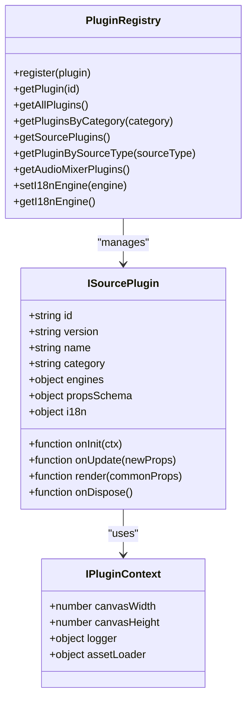
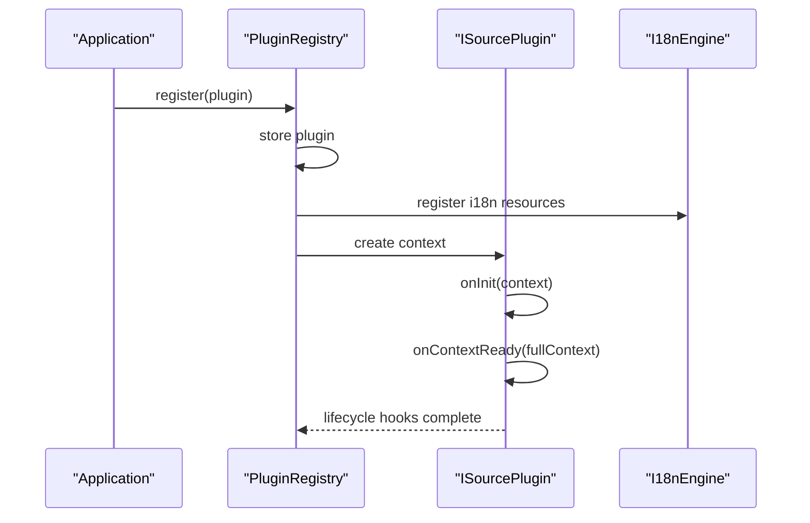
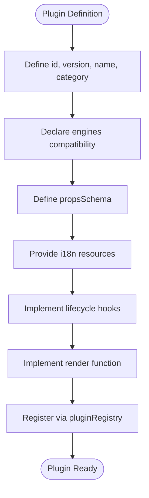

# Contributing Guidelines

<cite>
**Referenced Files in This Document**
- [Readme.md](file://Readme.md)
- [package.json](file://package.json)
- [.github/workflows/format.yml](file://.github/workflows/format.yml)
- [biome.json](file://biome.json)
- [vite.config.ts](file://vite.config.ts)
- [src/main.tsx](file://src/main.tsx)
- [src/services/plugin-registry.ts](file://src/services/plugin-registry.ts)
- [src/types/plugin.ts](file://src/types/plugin.ts)
- [docs/plugin/example-third-party-plugin.tsx](file://docs/plugin/example-third-party-plugin.tsx)
</cite>

## Table of Contents
1. [Introduction](#introduction)
2. [Development Workflow](#development-workflow)
3. [Code Standards and Formatting](#code-stanards-and-formatting)
4. [Testing and Quality Assurance](#testing-and-quality-assurance)
5. [Plugin Submission and Review Process](#plugin-submission-and-review-process)
6. [Documentation Contributions](#documentation-contributions)
7. [Issue Reporting Guidelines](#issue-reporting-guidelines)
8. [Community Standards and Communication](#community-standards-and-communication)
9. [Maintainer Responsibilities](#maintainer-responsibilities)
10. [Examples and Common Pitfalls](#examples-and-common-pitfalls)
11. [Appendices](#appendices)

## Introduction
Thank you for your interest in contributing to LiveMixer Web. This guide explains how to set up a development environment, follow code standards, submit plugins, contribute documentation, and engage with the community. LiveMixer Web is an open-source live video mixer and streaming application built with React, TypeScript, and LiveKit.

## Development Workflow
Follow this standard workflow for proposing changes:

- Fork the repository on GitHub.
- Create a feature branch from the default branch (typically main or master).
- Commit work in logical, focused commits with clear messages.
- Push your branch and open a Pull Request against the default branch.
- Ensure CI checks pass, including formatting and linting.

Local development commands are available via npm scripts:
- Install dependencies: see [Readme.md:7-9](file://Readme.md#L7-L9)
- Start development server: see [Readme.md:13-15](file://Readme.md#L13-L15)
- Build the project: see [package.json:43-44](file://package.json#L43-L44)

Branch naming convention:
- Use descriptive names like feature/add-plugin-system, fix/bug-description, or docs/update-guidelines.

Commit message style:
- Use imperative mood and concise summaries.
- Reference related issues when applicable.

Pull Request checklist:
- Describe the change, its motivation, and impact.
- Link related issues.
- Ensure all CI checks pass locally before opening the PR.

**Section sources**
- [Readme.md:7-15](file://Readme.md#L7-L15)
- [package.json:41-48](file://package.json#L41-L48)

## Code Standards and Formatting
LiveMixer Web enforces consistent formatting and linting with Biome. The configuration is centralized in the Biome configuration file.

Formatting rules enforced:
- Indentation: spaces, width 2.
- Single quotes for strings.
- Semicolons required.
- File-level formatting is enabled.

Linting rules enforced:
- Linter enabled with recommended rules.
- Specific rule adjustments:
  - Non-null assertions disabled.
  - Unknown at-rules disabled.
  - Explicit any disabled.
  - Array index keys disabled.
  - Iterable callback return disabled.
  - Use exhaustive dependencies warning.
  - Unused variables warning.
  - Use key with click events disabled.
  - Static element interactions disabled.
  - Useless fragments warning.
  - Useless ternary warning.

Organizing imports:
- Automatic import organization is enabled.

Running formatting and linting locally:
- Format all files: see [package.json](file://package.json#L47)
- Check formatting: see [package.json](file://package.json#L46)
- Lint and fix: see [package.json](file://package.json#L45)

CI enforcement:
- A GitHub Actions workflow runs formatting checks on pull requests targeting main/master for TypeScript/JavaScript/JSON/CSS/SCSS/Less files: see [.github/workflows/format.yml:1-43](file://.github/workflows/format.yml#L1-L43)

**Section sources**
- [biome.json:11-56](file://biome.json#L11-L56)
- [package.json:45-47](file://package.json#L45-L47)
- [.github/workflows/format.yml:18-43](file://.github/workflows/format.yml#L18-L43)

## Testing and Quality Assurance
Quality gates:
- Formatting and linting must pass locally before submitting a PR.
- CI will enforce formatting checks for TypeScript/JS/JSON/CSS/SCSS/Less files on pull requests.

Testing strategy:
- Unit tests: none observed in the repository. Prefer adding unit tests alongside new features or bug fixes.
- Integration tests: none observed in the repository. Consider adding tests for critical flows (e.g., plugin registration, rendering).
- Manual verification: test plugin behavior, UI responsiveness, and accessibility.

Accessibility:
- Follow ARIA guidelines and ensure keyboard navigation support in UI components.

Security:
- Avoid exposing secrets in client-side code.
- Validate and sanitize user-provided inputs.

**Section sources**
- [.github/workflows/format.yml:18-43](file://.github/workflows/format.yml#L18-L43)

## Plugin Submission and Review Process
Overview:
- Plugins extend LiveMixer Web’s capabilities without modifying core files.
- Registration is performed via the plugin registry.

How plugins are registered:
- Built-in plugins are registered during app startup: see [src/main.tsx:14-20](file://src/main.tsx#L14-L20)
- The registry stores plugins and initializes them with a context: see [src/services/plugin-registry.ts:78-118](file://src/services/plugin-registry.ts#L78-L118)

Plugin metadata and lifecycle:
- Plugins declare metadata (id, version, name, category), compatibility (engines), and properties (propsSchema).
- Lifecycle hooks include initialization, updates, rendering, and disposal.
- Optional UI integrations include add dialogs, property panels, audio mixer support, and canvas render configuration: see [src/types/plugin.ts:164-262](file://src/types/plugin.ts#L164-L262)

Internationalization:
- Plugins can provide i18n resources and register them through the registry: see [src/services/plugin-registry.ts:32-56](file://src/services/plugin-registry.ts#L32-L56)

Example third-party plugin:
- See the example plugin demonstrating registration and configuration: [docs/plugin/example-third-party-plugin.tsx:1-173](file://docs/plugin/example-third-party-plugin.tsx#L1-L173)

Submission checklist:
- Provide a clear plugin id and version.
- Define propsSchema with appropriate types and defaults.
- Include i18n resources if supporting multiple languages.
- Test rendering and behavior across different canvas sizes.
- Verify add dialog and property panel flows.
- Confirm accessibility and responsive behavior.
- Keep trustLevel and permissions aligned with plugin capabilities.

Review criteria:
- Correctness: does the plugin behave as documented?
- Performance: minimal overhead, efficient rendering.
- Security: no unsafe operations or privileged access misuse.
- Compatibility: adheres to declared engines and schema.
- Documentation: clear README and examples.

**Section sources**
- [src/main.tsx:14-20](file://src/main.tsx#L14-L20)
- [src/services/plugin-registry.ts:78-118](file://src/services/plugin-registry.ts#L78-L118)
- [src/types/plugin.ts:164-262](file://src/types/plugin.ts#L164-L262)
- [docs/plugin/example-third-party-plugin.tsx:1-173](file://docs/plugin/example-third-party-plugin.tsx#L1-L173)

## Documentation Contributions
Guidelines:
- Keep documentation clear, concise, and actionable.
- Reference relevant source files using the section sources format.
- Include diagrams where helpful to explain architecture or workflows.
- Update installation, setup, and usage instructions when code changes affect them.

Review process:
- Submit documentation changes as part of a pull request.
- Ensure links and references remain accurate after code changes.

**Section sources**
- [Readme.md:1-26](file://Readme.md#L1-L26)

## Issue Reporting Guidelines
Before filing:
- Search existing issues to avoid duplicates.
- Provide a clear title and description.
- Include reproduction steps, expected vs. actual behavior, and environment details.

Bug reports:
- Attach screenshots or screen recordings when relevant.
- Include browser/device information and LiveMixer Web version.

Feature requests:
- Explain the problem you face and the desired solution.
- Provide use cases and acceptance criteria.

**Section sources**
- [Readme.md:23-26](file://Readme.md#L23-L26)

## Community Standards and Communication
Community guidelines:
- Be respectful, inclusive, and constructive.
- Follow the project’s license terms.
- Avoid disruptive behavior in discussions and PR reviews.

Communication channels:
- Use GitHub Issues for bugs and feature requests.
- Use GitHub Discussions for questions and proposals (if enabled by maintainers).

**Section sources**
- [Readme.md:23-26](file://Readme.md#L23-L26)

## Maintainer Responsibilities
Responsibilities:
- Review pull requests promptly and provide actionable feedback.
- Ensure code quality and adherence to standards.
- Maintain CI checks and update workflows as needed.
- Curate plugin submissions and ensure compatibility.
- Respond to issues and discussions in a timely manner.

Decision-making:
- Major changes should be discussed and approved by maintainers.
- Breaking changes require careful consideration and migration guidance.

**Section sources**
- [.github/workflows/format.yml:1-43](file://.github/workflows/format.yml#L1-L43)

## Examples and Common Pitfalls
Good contribution examples:
- Adding a new built-in plugin with proper metadata, propsSchema, and i18n resources: see [src/main.tsx:14-20](file://src/main.tsx#L14-L20) and [docs/plugin/example-third-party-plugin.tsx:1-173](file://docs/plugin/example-third-party-plugin.tsx#L1-L173)
- Extending UI components with accessible patterns and consistent styling: see [src/components/ui](file://src/components/ui)

Common pitfalls to avoid:
- Skipping formatting/linting before committing: run the Biome commands from [package.json:45-47](file://package.json#L45-L47)
- Omitting plugin metadata or propsSchema: ensure completeness per [src/types/plugin.ts:164-262](file://src/types/plugin.ts#L164-L262)
- Forgetting to register plugins: see [src/main.tsx:14-20](file://src/main.tsx#L14-L20)
- Ignoring CI failures: address formatting/linting issues flagged by [.github/workflows/format.yml:18-43](file://.github/workflows/format.yml#L18-L43)

**Section sources**
- [package.json:45-47](file://package.json#L45-L47)
- [src/types/plugin.ts:164-262](file://src/types/plugin.ts#L164-L262)
- [src/main.tsx:14-20](file://src/main.tsx#L14-L20)
- [.github/workflows/format.yml:18-43](file://.github/workflows/format.yml#L18-L43)

## Appendices

### Appendix A: Local Development Quick Start
- Install dependencies: see [Readme.md:7-9](file://Readme.md#L7-L9)
- Start dev server: see [Readme.md:13-15](file://Readme.md#L13-L15)
- Build project: see [package.json:43-44](file://package.json#L43-L44)

**Section sources**
- [Readme.md:7-15](file://Readme.md#L7-L15)
- [package.json:43-44](file://package.json#L43-L44)

### Appendix B: Formatting and Linting Commands
- Format all files: see [package.json](file://package.json#L47)
- Check formatting: see [package.json](file://package.json#L46)
- Lint and fix: see [package.json](file://package.json#L45)

**Section sources**
- [package.json:45-47](file://package.json#L45-L47)

### Appendix C: Plugin Architecture Overview
The plugin system centers around a registry that manages plugin lifecycle and integrates with the UI and rendering pipeline.

**Diagram sources**
- [src/services/plugin-registry.ts:5-168](file://src/services/plugin-registry.ts#L5-L168)
- [src/types/plugin.ts:164-262](file://src/types/plugin.ts#L164-L262)

### Appendix D: Plugin Registration Flow

**Diagram sources**
- [src/main.tsx:14-20](file://src/main.tsx#L14-L20)
- [src/services/plugin-registry.ts:78-118](file://src/services/plugin-registry.ts#L78-L118)
- [src/types/plugin.ts:199-205](file://src/types/plugin.ts#L199-L205)

### Appendix E: Example Plugin Structure
The example plugin demonstrates metadata, propsSchema, i18n, and rendering logic.

**Diagram sources**
- [docs/plugin/example-third-party-plugin.tsx:1-173](file://docs/plugin/example-third-party-plugin.tsx#L1-L173)