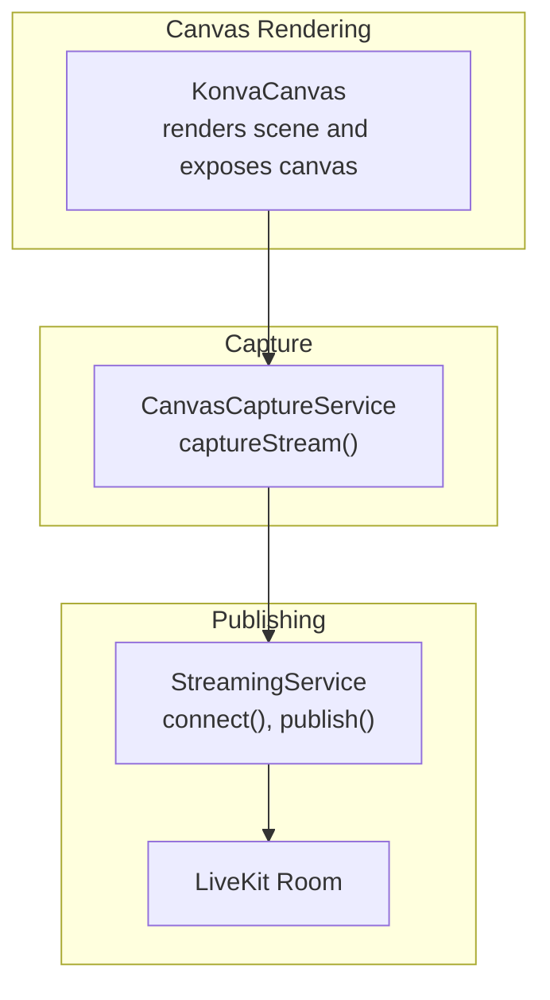
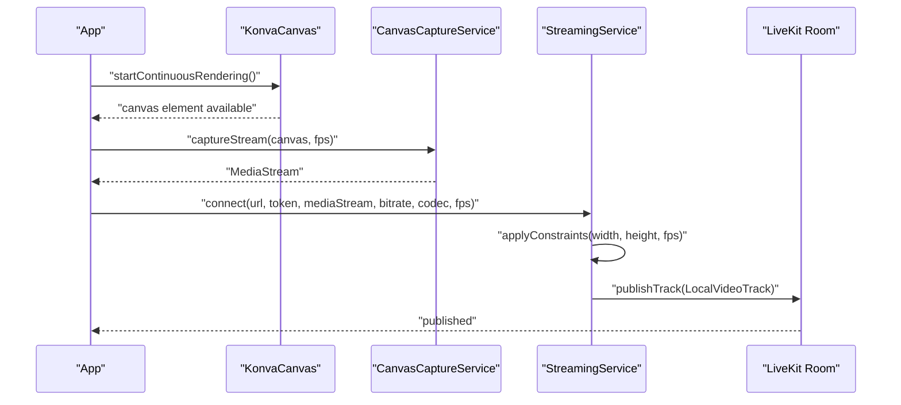
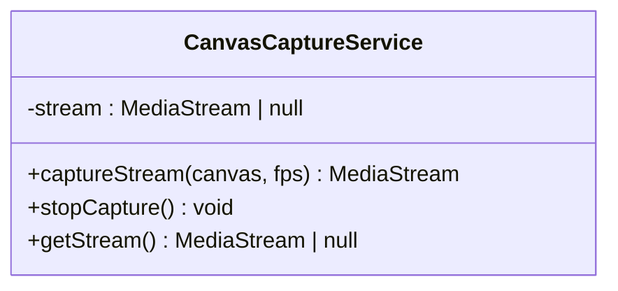
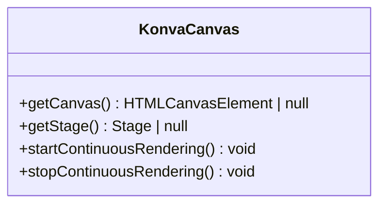
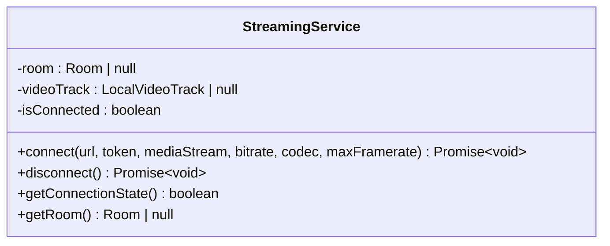
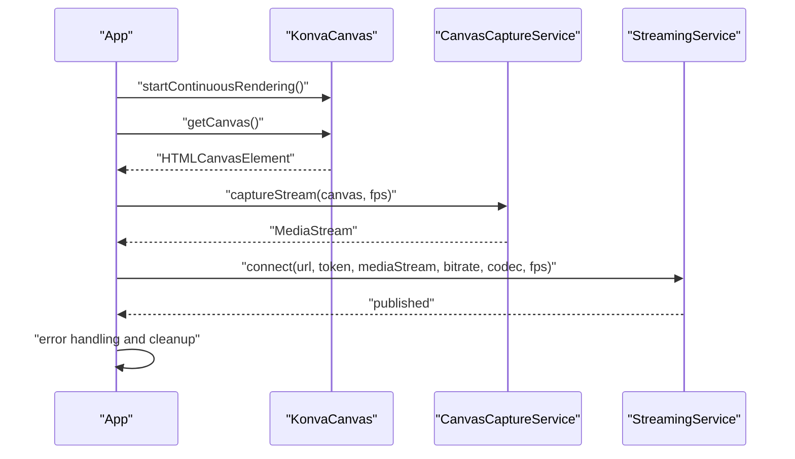
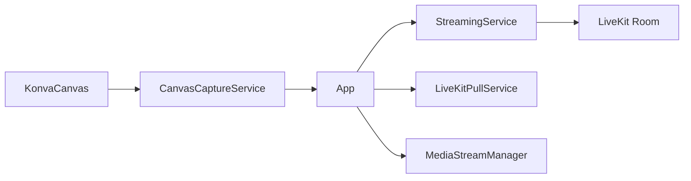

# CanvasCaptureService

<cite>
**Referenced Files in This Document**
- [canvas-capture.ts](file://src/services/canvas-capture.ts)
- [konva-canvas.tsx](file://src/components/konva-canvas.tsx)
- [streaming.ts](file://src/services/streaming.ts)
- [App.tsx](file://src/App.tsx)
- [livekit-stream-item.tsx](file://src/components/livekit-stream-item.tsx)
- [livekit-pull.ts](file://src/services/livekit-pull.ts)
- [media-stream-manager.ts](file://src/services/media-stream-manager.ts)
</cite>

## Table of Contents
1. [Introduction](#introduction)
2. [Project Structure](#project-structure)
3. [Core Components](#core-components)
4. [Architecture Overview](#architecture-overview)
5. [Detailed Component Analysis](#detailed-component-analysis)
6. [Dependency Analysis](#dependency-analysis)
7. [Performance Considerations](#performance-considerations)
8. [Troubleshooting Guide](#troubleshooting-guide)
9. [Conclusion](#conclusion)

## Introduction
This document provides comprehensive documentation for the CanvasCaptureService that converts canvas content to video streams for LiveKit publishing. It explains the canvas-to-stream conversion process, including frame capture timing and quality settings, and details the integration with the Konva canvas for real-time video composition rendering. It covers stream encoding configuration, frame rate control, and resolution management, along with performance optimization techniques for smooth canvas capture and minimal latency. Error handling for canvas rendering issues, stream creation failures, and encoding problems is documented, and practical examples are included for setup, performance tuning, and troubleshooting.

## Project Structure
The CanvasCaptureService is part of a broader streaming pipeline that includes:
- Canvas capture service: wraps the browser Canvas capture API to produce a MediaStream
- Konva canvas component: renders the scene composition and exposes the underlying canvas element
- Streaming service: publishes the captured MediaStream to LiveKit with configurable encoding
- Application orchestration: coordinates capture, publishing, and cleanup
- LiveKit pull service: demonstrates consuming remote streams (complementary to publishing)
- Media stream manager: provides unified stream lifecycle management

**Diagram sources**
- [konva-canvas.tsx:113-176](file://src/components/konva-canvas.tsx#L113-L176)
- [canvas-capture.ts:5-47](file://src/services/canvas-capture.ts#L5-L47)
- [streaming.ts:6-177](file://src/services/streaming.ts#L6-L177)

**Section sources**
- [canvas-capture.ts:1-48](file://src/services/canvas-capture.ts#L1-L48)
- [konva-canvas.tsx:113-176](file://src/components/konva-canvas.tsx#L113-L176)
- [streaming.ts:6-177](file://src/services/streaming.ts#L6-L177)

## Core Components
- CanvasCaptureService: encapsulates canvas capture and stream lifecycle
- KonvaCanvas: renders the scene composition and provides the HTMLCanvasElement
- StreamingService: connects to LiveKit and publishes the captured stream with encoding parameters
- App orchestration: wires capture and publishing together and handles errors
- LiveKitPullService: demonstrates consuming remote streams (complementary)
- MediaStreamManager: provides unified stream management across plugins

**Section sources**
- [canvas-capture.ts:5-47](file://src/services/canvas-capture.ts#L5-L47)
- [konva-canvas.tsx:106-176](file://src/components/konva-canvas.tsx#L106-L176)
- [streaming.ts:6-177](file://src/services/streaming.ts#L6-L177)
- [App.tsx:726-788](file://src/App.tsx#L726-L788)
- [livekit-pull.ts:49-352](file://src/services/livekit-pull.ts#L49-L352)
- [media-stream-manager.ts:39-323](file://src/services/media-stream-manager.ts#L39-L323)

## Architecture Overview
The end-to-end flow for canvas capture and LiveKit publishing:
1. KonvaCanvas renders the scene and exposes the underlying canvas element
2. CanvasCaptureService captures a MediaStream from the canvas at a specified frame rate
3. App orchestrates capture and publishes the stream to LiveKit via StreamingService
4. StreamingService applies constraints and publishes with configured encoding parameters
5. LiveKit receives the stream and distributes it to subscribers

**Diagram sources**
- [App.tsx:726-788](file://src/App.tsx#L726-L788)
- [konva-canvas.tsx:154-176](file://src/components/konva-canvas.tsx#L154-L176)
- [canvas-capture.ts:14-24](file://src/services/canvas-capture.ts#L14-L24)
- [streaming.ts:20-101](file://src/services/streaming.ts#L20-L101)

## Detailed Component Analysis

### CanvasCaptureService
Responsibilities:
- Capture a MediaStream from an HTMLCanvasElement at a given frame rate
- Manage the lifetime of the captured stream (stop tracks and reset state)
- Provide access to the current stream

Key behaviors:
- Uses the browser Canvas capture API to create a stream with a specified FPS
- Throws an error if capture fails
- Stops all tracks when stopping capture to free resources

**Diagram sources**
- [canvas-capture.ts:5-47](file://src/services/canvas-capture.ts#L5-L47)

**Section sources**
- [canvas-capture.ts:5-47](file://src/services/canvas-capture.ts#L5-L47)

### KonvaCanvas Integration
Responsibilities:
- Render the scene composition using react-konva
- Expose the underlying HTMLCanvasElement via imperative handle
- Maintain a continuous render loop to keep captureStream producing frames

Key behaviors:
- Provides getCanvas() to retrieve the Stage’s canvas element
- startContinuousRendering() runs a requestAnimationFrame loop to batchDraw the layer continuously
- stopContinuousRendering() cancels the animation frame loop

**Diagram sources**
- [konva-canvas.tsx:106-176](file://src/components/konva-canvas.tsx#L106-L176)

**Section sources**
- [konva-canvas.tsx:106-176](file://src/components/konva-canvas.tsx#L106-L176)

### StreamingService (LiveKit Publishing)
Responsibilities:
- Connect to a LiveKit room and publish the captured MediaStream
- Configure encoding parameters (codec, bitrate, max framerate)
- Apply constraints to the video track to match desired resolution and frame rate

Key behaviors:
- Creates a Room with adaptive streaming and dynacast enabled
- Extracts the first video track from the MediaStream and applies constraints
- Publishes the track as a LocalVideoTrack with encoding and codec settings
- Supports optional audio track publishing

**Diagram sources**
- [streaming.ts:6-177](file://src/services/streaming.ts#L6-L177)

**Section sources**
- [streaming.ts:6-177](file://src/services/streaming.ts#L6-L177)

### App Orchestration
Responsibilities:
- Coordinate capture and publishing lifecycle
- Start continuous rendering before capturing
- Handle errors during capture/publishing and clean up resources

Key behaviors:
- Retrieves the canvas from KonvaCanvas and starts continuous rendering
- Captures the stream at the configured FPS
- Calls StreamingService.connect with bitrate, codec, and FPS
- On error, stops continuous rendering and capture stream

**Diagram sources**
- [App.tsx:726-788](file://src/App.tsx#L726-L788)
- [konva-canvas.tsx:154-176](file://src/components/konva-canvas.tsx#L154-L176)
- [canvas-capture.ts:14-24](file://src/services/canvas-capture.ts#L14-L24)
- [streaming.ts:20-101](file://src/services/streaming.ts#L20-L101)

**Section sources**
- [App.tsx:726-788](file://src/App.tsx#L726-L788)

### LiveKit Pull Service (Complementary)
Responsibilities:
- Connect to a LiveKit room and subscribe to remote participants’ audio/video tracks
- Provide participant and track information for consumption

Key behaviors:
- Manages room lifecycle and event callbacks
- Retrieves participant info and tracks by identity and source

**Section sources**
- [livekit-pull.ts:49-352](file://src/services/livekit-pull.ts#L49-L352)

### Media Stream Manager
Responsibilities:
- Provide a centralized API for managing MediaStreams across plugins
- Handle stream registration, updates, removal, and listener notifications
- Offer device enumeration helpers with permission handling

Key behaviors:
- Stores streams by item ID and notifies listeners of changes
- Stops tracks and removes DOM video elements when streams are removed
- Provides unified device enumeration for video/audio input/output

**Section sources**
- [media-stream-manager.ts:39-323](file://src/services/media-stream-manager.ts#L39-L323)

## Dependency Analysis
The CanvasCaptureService integrates with the following components:
- KonvaCanvas: provides the HTMLCanvasElement used for capture
- App: orchestrates capture and publishing, manages lifecycle
- StreamingService: consumes the captured stream and publishes to LiveKit
- LiveKitPullService: complementary consumer of streams (not used for capture)
- MediaStreamManager: optional unified stream management for plugins

**Diagram sources**
- [konva-canvas.tsx:113-176](file://src/components/konva-canvas.tsx#L113-L176)
- [canvas-capture.ts:5-47](file://src/services/canvas-capture.ts#L5-L47)
- [App.tsx:726-788](file://src/App.tsx#L726-L788)
- [streaming.ts:6-177](file://src/services/streaming.ts#L6-L177)
- [livekit-pull.ts:49-352](file://src/services/livekit-pull.ts#L49-L352)
- [media-stream-manager.ts:39-323](file://src/services/media-stream-manager.ts#L39-L323)

**Section sources**
- [App.tsx:726-788](file://src/App.tsx#L726-L788)
- [streaming.ts:20-101](file://src/services/streaming.ts#L20-L101)

## Performance Considerations
- Continuous rendering: KonvaCanvas maintains a continuous render loop to ensure captureStream keeps producing frames. This prevents gaps in the video stream.
- Frame rate control: The capture frame rate is passed to captureStream and also applied to the video track constraints. Ensure the chosen FPS matches the intended broadcast quality.
- Resolution management: The StreamingService applies constraints to match the desired resolution and frame rate. Align canvas dimensions with the intended output resolution to minimize scaling overhead.
- Codec selection: Choose a codec suitable for your target environment. The StreamingService supports multiple codecs and applies the selected one during publishing.
- Bitrate tuning: Adjust the video bitrate to balance quality and bandwidth. Higher bitrates improve quality but increase bandwidth usage.
- Simulcast: The StreamingService disables simulcast for higher quality. If adaptive streaming is required, consider enabling simulcast and adjusting parameters accordingly.
- HiDPI support: KonvaCanvas accounts for device pixel ratio to render crisp visuals on high-resolution displays, which can impact performance.

Practical tips:
- Start with a moderate FPS (e.g., 30) and adjust based on performance.
- Match canvas dimensions to the target resolution to avoid scaling.
- Monitor CPU/GPU usage and reduce FPS or resolution if necessary.
- Use efficient codecs and appropriate bitrate for the target network conditions.

[No sources needed since this section provides general guidance]

## Troubleshooting Guide
Common issues and resolutions:
- Canvas capture failure: If captureStream returns null or throws, verify that the canvas element is valid and that continuous rendering is active. Ensure the canvas is visible and has non-zero dimensions.
- No video track found: The StreamingService requires at least one video track in the MediaStream. Confirm that the canvas is rendering and that captureStream succeeded.
- LiveKit connection errors: Verify server URL and token. Check network connectivity and firewall settings. Review error logs for specific failure reasons.
- Encoding problems: If the stream fails to publish or quality is poor, adjust codec, bitrate, and frame rate. Ensure the selected codec is supported by the client and server.
- Stream not updating: Ensure continuous rendering is running. Without it, captureStream may not produce new frames.
- Resource cleanup: Always stop capture and continuous rendering when switching scenes or stopping publishing to prevent resource leaks.

**Section sources**
- [canvas-capture.ts:18-20](file://src/services/canvas-capture.ts#L18-L20)
- [streaming.ts:75-77](file://src/services/streaming.ts#L75-L77)
- [App.tsx:767-775](file://src/App.tsx#L767-L775)

## Conclusion
The CanvasCaptureService provides a streamlined mechanism to convert canvas content into a LiveKit-compatible video stream. By integrating with KonvaCanvas for real-time composition rendering and StreamingService for publishing with configurable encoding, it enables high-quality, low-latency streaming. Proper configuration of frame rate, resolution, and codec, combined with continuous rendering and robust error handling, ensures reliable operation across diverse environments.

[No sources needed since this section summarizes without analyzing specific files]