# Core Services

<cite>
**Referenced Files in This Document**
- [media-stream-manager.ts](file://src/services/media-stream-manager.ts)
- [plugin-registry.ts](file://src/services/plugin-registry.ts)
- [streaming.ts](file://src/services/streaming.ts)
- [livekit-pull.ts](file://src/services/livekit-pull.ts)
- [canvas-capture.ts](file://src/services/canvas-capture.ts)
- [i18n-engine.ts](file://src/services/i18n-engine.ts)
- [plugin-context.ts](file://src/services/plugin-context.ts)
- [plugin.ts](file://src/types/plugin.ts)
- [i18n-engine.ts](file://src/types/i18n-engine.ts)
- [plugin-context.ts](file://src/types/plugin-context.ts)
- [webcam/index.tsx](file://src/plugins/builtin/webcam/index.tsx)
- [audio-input/index.tsx](file://src/plugins/builtin/audio-input/index.tsx)
- [screencapture-plugin.tsx](file://src/plugins/builtin/screencapture-plugin.tsx)
- [main.tsx](file://src/main.tsx)
- [App.tsx](file://src/App.tsx)
</cite>

## Table of Contents
1. [Introduction](#introduction)
2. [Project Structure](#project-structure)
3. [Core Components](#core-components)
4. [Architecture Overview](#architecture-overview)
5. [Detailed Component Analysis](#detailed-component-analysis)
6. [Dependency Analysis](#dependency-analysis)
7. [Performance Considerations](#performance-considerations)
8. [Troubleshooting Guide](#troubleshooting-guide)
9. [Conclusion](#conclusion)

## Introduction
This document describes the core service layer of LiveMixer Web, focusing on the unified media stream management, plugin lifecycle and context integration, LiveKit streaming and pulling, canvas-to-stream conversion, and internationalization support. It explains how services coordinate, how plugins integrate, and how to configure and troubleshoot common scenarios.

## Project Structure
The core services are organized under src/services and are consumed by the main application and plugins:
- Media stream management: centralized registry and lifecycle for all streams
- Plugin registry: plugin lifecycle, i18n resource registration, and context creation
- LiveKit streaming/pulling: push and pull integrations with configurable encoding
- Canvas capture: converts a Canvas element into a MediaStream
- i18n engine: layered internationalization supporting core/host/plugin/user layers
- Plugin context manager: secure, permissioned access to host state and actions

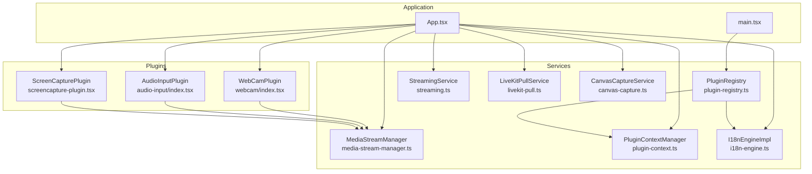

**Diagram sources**
- [main.tsx:14-20](file://src/main.tsx#L14-L20)
- [App.tsx:24-30](file://src/App.tsx#L24-L30)
- [media-stream-manager.ts:39-322](file://src/services/media-stream-manager.ts#L39-L322)
- [plugin-registry.ts:5-167](file://src/services/plugin-registry.ts#L5-L167)
- [plugin-context.ts:82-707](file://src/services/plugin-context.ts#L82-L707)
- [streaming.ts:6-176](file://src/services/streaming.ts#L6-L176)
- [livekit-pull.ts:49-351](file://src/services/livekit-pull.ts#L49-L351)
- [canvas-capture.ts:5-47](file://src/services/canvas-capture.ts#L5-L47)
- [i18n-engine.ts:42-240](file://src/services/i18n-engine.ts#L42-L240)
- [webcam/index.tsx:110-477](file://src/plugins/builtin/webcam/index.tsx#L110-L477)
- [audio-input/index.tsx:105-554](file://src/plugins/builtin/audio-input/index.tsx#L105-L554)
- [screencapture-plugin.tsx:55-463](file://src/plugins/builtin/screencapture-plugin.tsx#L55-L463)

**Section sources**
- [main.tsx:14-20](file://src/main.tsx#L14-L20)
- [App.tsx:24-30](file://src/App.tsx#L24-L30)

## Core Components
- MediaStreamManager: central registry for all MediaStreams used by plugins; provides device enumeration, stream lifecycle, and pending stream handoff between dialogs and the app
- PluginRegistry: registers plugins, wires i18n resources, and creates plugin contexts with scoped permissions and capabilities
- PluginContextManager: hosts application state, exposes actions, and provides a secure, permissioned API surface to plugins
- StreamingService: connects to LiveKit, publishes a MediaStream with configurable encoding, and manages lifecycle
- LiveKitPullService: connects to LiveKit as a subscriber, tracks participant and track state, and exposes callbacks
- CanvasCaptureService: captures a Canvas element as a MediaStream and stops it cleanly
- I18nEngineImpl: layered i18n with core/host/plugin/user layers, dynamic resource merging, and language change notifications

**Section sources**
- [media-stream-manager.ts:39-322](file://src/services/media-stream-manager.ts#L39-L322)
- [plugin-registry.ts:5-167](file://src/services/plugin-registry.ts#L5-L167)
- [plugin-context.ts:82-707](file://src/services/plugin-context.ts#L82-L707)
- [streaming.ts:6-176](file://src/services/streaming.ts#L6-L176)
- [livekit-pull.ts:49-351](file://src/services/livekit-pull.ts#L49-L351)
- [canvas-capture.ts:5-47](file://src/services/canvas-capture.ts#L5-L47)
- [i18n-engine.ts:42-240](file://src/services/i18n-engine.ts#L42-L240)

## Architecture Overview
The services collaborate around three pillars:
- Unified stream lifecycle: MediaStreamManager decouples plugins from direct device access and stream management
- Secure plugin context: PluginRegistry and PluginContextManager provide permissioned access to host state and actions
- LiveKit integration: StreamingService pushes the canvas stream; LiveKitPullService pulls others’ streams

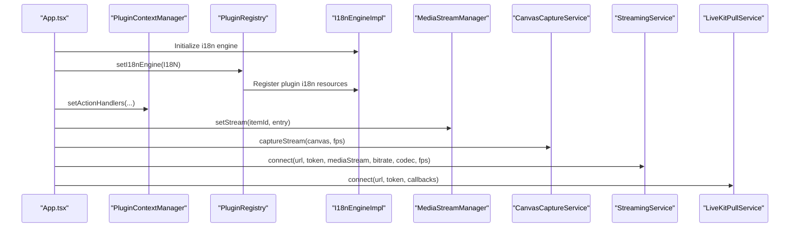

**Diagram sources**
- [App.tsx:44-107](file://src/App.tsx#L44-L107)
- [plugin-registry.ts:13-27](file://src/services/plugin-registry.ts#L13-L27)
- [plugin-context.ts:232-241](file://src/services/plugin-context.ts#L232-L241)
- [media-stream-manager.ts:56-65](file://src/services/media-stream-manager.ts#L56-L65)
- [canvas-capture.ts:14-24](file://src/services/canvas-capture.ts#L14-L24)
- [streaming.ts:20-124](file://src/services/streaming.ts#L20-L124)
- [livekit-pull.ts:60-179](file://src/services/livekit-pull.ts#L60-L179)

## Detailed Component Analysis

### MediaStreamManager
Responsibilities:
- Central registry for MediaStreams used by plugins
- Device enumeration for cameras, microphones, and audio outputs with permission handling
- Stream lifecycle: set, get, remove, clear, and change notifications
- Pending stream handoff between dialogs and the app

Key behaviors:
- Stream change listeners receive callbacks safely with error logging
- Device enumeration requests permissions only when necessary and falls back when needed
- Pending stream data is cleared after consumption

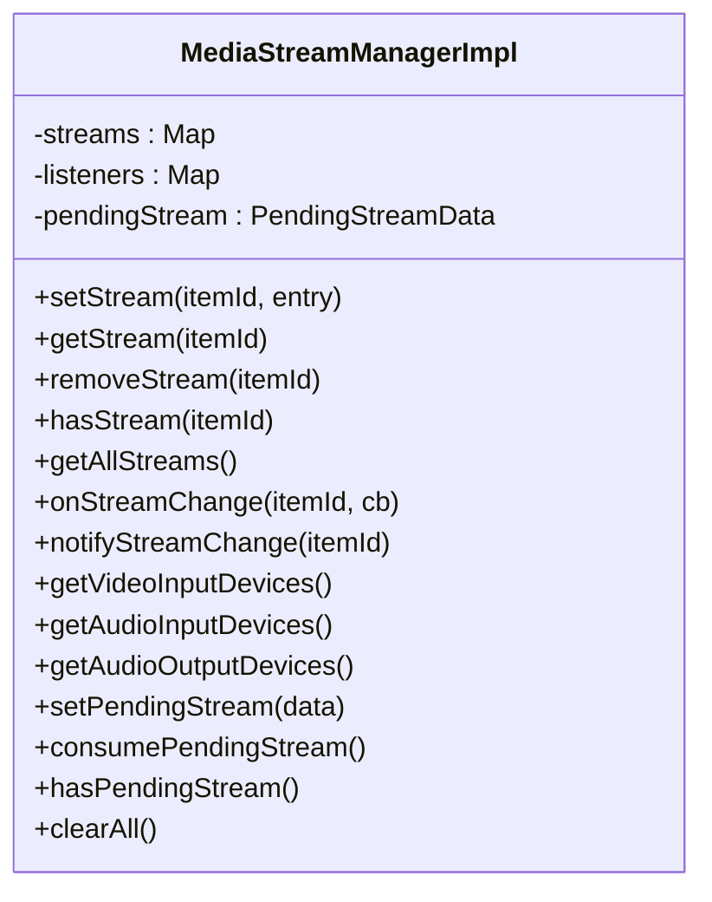

**Diagram sources**
- [media-stream-manager.ts:39-322](file://src/services/media-stream-manager.ts#L39-L322)

**Section sources**
- [media-stream-manager.ts:56-99](file://src/services/media-stream-manager.ts#L56-L99)
- [media-stream-manager.ts:147-273](file://src/services/media-stream-manager.ts#L147-L273)
- [media-stream-manager.ts:282-301](file://src/services/media-stream-manager.ts#L282-L301)
- [media-stream-manager.ts:310-315](file://src/services/media-stream-manager.ts#L310-L315)

### PluginRegistry
Responsibilities:
- Registers plugins and wires their i18n resources into the global engine
- Creates plugin contexts with scoped permissions and capabilities
- Exposes plugin discovery by source type and categories

Key behaviors:
- Expands plugin i18n namespaces into nested resource objects
- Initializes plugin context with canvas size defaults, logger, and asset loader
- Calls onContextReady with a full context created by PluginContextManager

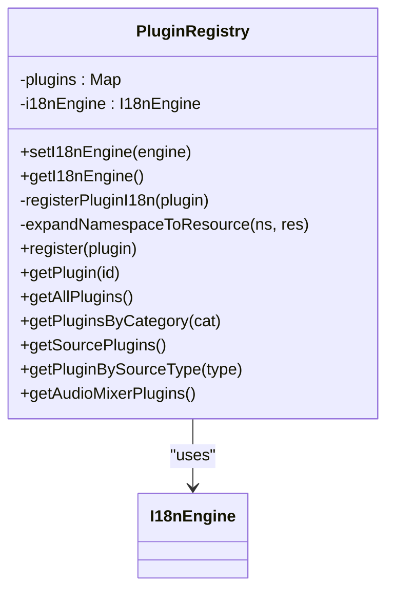

**Diagram sources**
- [plugin-registry.ts:5-167](file://src/services/plugin-registry.ts#L5-L167)

**Section sources**
- [plugin-registry.ts:13-27](file://src/services/plugin-registry.ts#L13-L27)
- [plugin-registry.ts:32-56](file://src/services/plugin-registry.ts#L32-L56)
- [plugin-registry.ts:78-118](file://src/services/plugin-registry.ts#L78-L118)
- [plugin-registry.ts:144-157](file://src/services/plugin-registry.ts#L144-L157)

### PluginContextManager
Responsibilities:
- Manages application state and exposes read-only proxies to plugins
- Provides permissioned actions (scene, playback, ui, storage)
- Emits events and maintains slot registrations
- Disposes plugin contexts and cleans up resources

Key behaviors:
- Creates readonly state proxies to prevent direct mutation
- Enforces permissions for each action and logs denials
- Tracks plugin instances and unsubscribes on dispose
- Merges layered i18n resources and notifies language changes

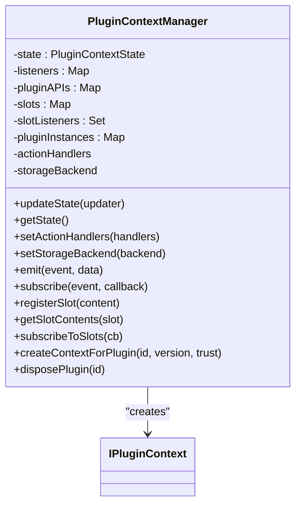

**Diagram sources**
- [plugin-context.ts:82-707](file://src/services/plugin-context.ts#L82-L707)

**Section sources**
- [plugin-context.ts:187-216](file://src/services/plugin-context.ts#L187-L216)
- [plugin-context.ts:232-241](file://src/services/plugin-context.ts#L232-L241)
- [plugin-context.ts:333-456](file://src/services/plugin-context.ts#L333-L456)
- [plugin-context.ts:532-700](file://src/services/plugin-context.ts#L532-L700)

### StreamingService (LiveKit Push)
Responsibilities:
- Connects to a LiveKit room and publishes a MediaStream
- Applies encoding constraints and publishes audio/video tracks
- Manages connection lifecycle and cleanup

Key behaviors:
- Validates inputs and throws descriptive errors
- Applies video constraints and disables simulcast for higher quality
- Publishes audio track if present and logs encoding parameters

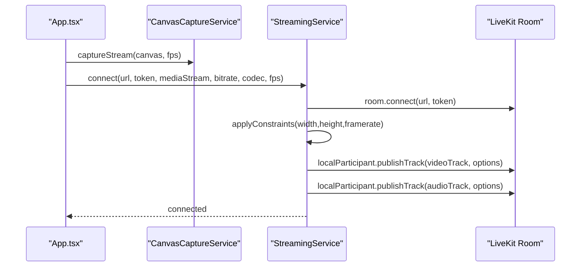

**Diagram sources**
- [App.tsx:726-788](file://src/App.tsx#L726-L788)
- [canvas-capture.ts:14-24](file://src/services/canvas-capture.ts#L14-L24)
- [streaming.ts:20-124](file://src/services/streaming.ts#L20-L124)

**Section sources**
- [streaming.ts:20-124](file://src/services/streaming.ts#L20-L124)
- [streaming.ts:129-158](file://src/services/streaming.ts#L129-L158)

### LiveKitPullService (LiveKit Pull)
Responsibilities:
- Connects to a LiveKit room as a subscriber
- Tracks participant and track state, exposes callbacks for UI updates
- Retrieves participant tracks by identity and source

Key behaviors:
- Listens to participant join/leave and track subscribed/unsubscribed events
- Builds participant info with camera/microphone/screen share states
- Notifies participants changed via callbacks

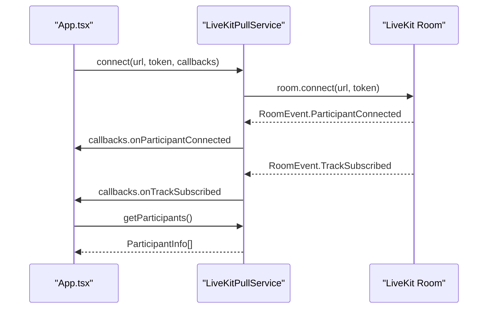

**Diagram sources**
- [App.tsx:790-809](file://src/App.tsx#L790-L809)
- [livekit-pull.ts:60-179](file://src/services/livekit-pull.ts#L60-L179)
- [livekit-pull.ts:201-265](file://src/services/livekit-pull.ts#L201-L265)

**Section sources**
- [livekit-pull.ts:60-179](file://src/services/livekit-pull.ts#L60-L179)
- [livekit-pull.ts:201-321](file://src/services/livekit-pull.ts#L201-L321)

### CanvasCaptureService
Responsibilities:
- Converts a Canvas element into a MediaStream
- Stops capture and cleans up tracks
- Exposes current stream reference

Key behaviors:
- Uses Canvas captureStream with configurable FPS
- Throws on failure to capture stream

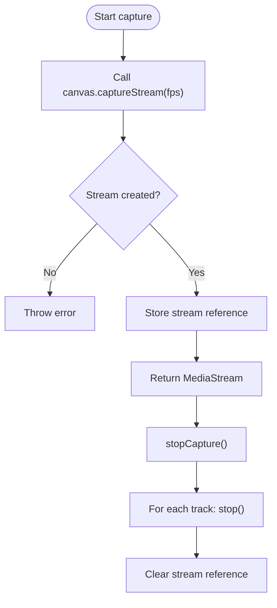

**Diagram sources**
- [canvas-capture.ts:14-43](file://src/services/canvas-capture.ts#L14-L43)

**Section sources**
- [canvas-capture.ts:14-43](file://src/services/canvas-capture.ts#L14-L43)

### i18n-engine
Responsibilities:
- Layered i18n with core, plugin, host, and user layers
- Adds and merges resources dynamically
- Detects and persists language preferences
- Notifies language change subscribers

Key behaviors:
- Deep merges resources per layer with priority core < plugin < host < user
- Adds resources with optional layer specification
- Updates i18next resources and triggers re-render on language change

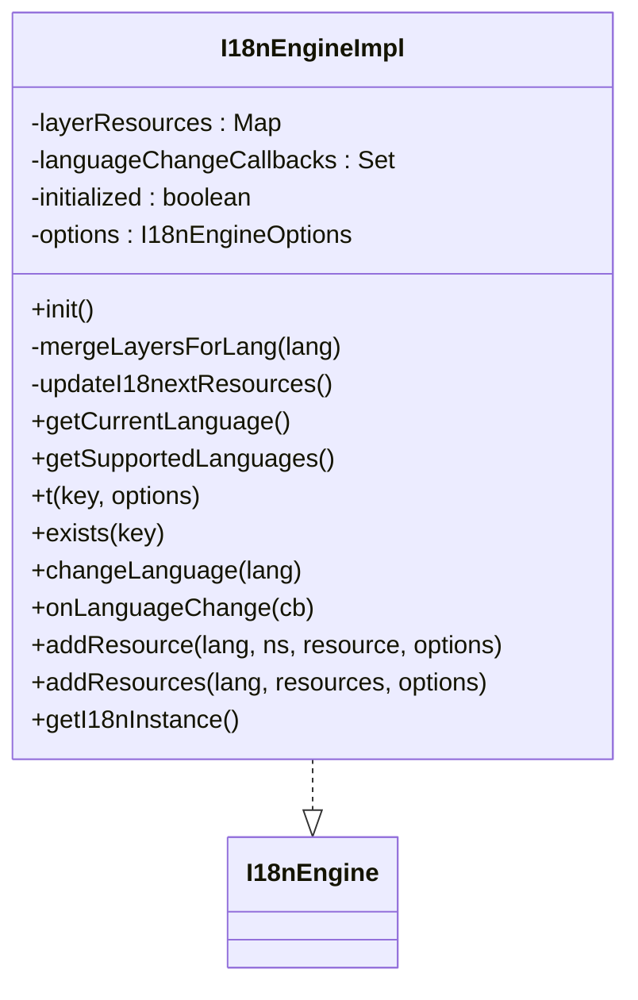

**Diagram sources**
- [i18n-engine.ts:42-240](file://src/services/i18n-engine.ts#L42-L240)

**Section sources**
- [i18n-engine.ts:64-119](file://src/services/i18n-engine.ts#L64-L119)
- [i18n-engine.ts:125-159](file://src/services/i18n-engine.ts#L125-L159)
- [i18n-engine.ts:188-221](file://src/services/i18n-engine.ts#L188-L221)

### Plugin Integration Examples
- Webcam plugin: demonstrates device enumeration, stream caching, and dialog-based device selection
- Audio input plugin: shows audio level monitoring and permission handling
- Screen capture plugin: illustrates screen capture with getDisplayMedia and stream caching

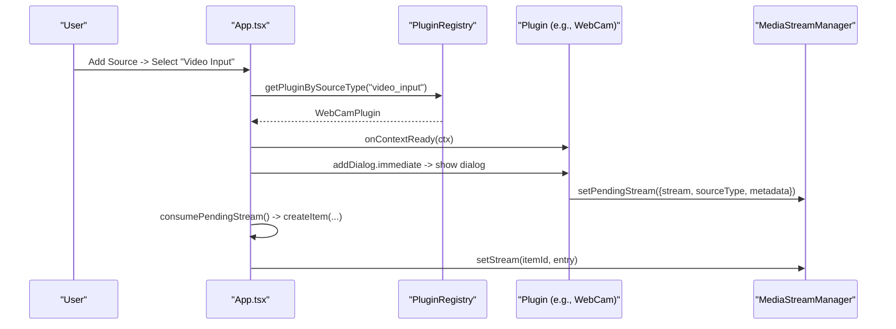

**Diagram sources**
- [App.tsx:280-362](file://src/App.tsx#L280-L362)
- [plugin-registry.ts:144-157](file://src/services/plugin-registry.ts#L144-L157)
- [webcam/index.tsx:217-227](file://src/plugins/builtin/webcam/index.tsx#L217-L227)
- [media-stream-manager.ts:282-294](file://src/services/media-stream-manager.ts#L282-L294)

**Section sources**
- [webcam/index.tsx:106-109](file://src/plugins/builtin/webcam/index.tsx#L106-L109)
- [audio-input/index.tsx:97-99](file://src/plugins/builtin/audio-input/index.tsx#L97-L99)
- [screencapture-plugin.tsx:191-258](file://src/plugins/builtin/screencapture-plugin.tsx#L191-L258)

## Dependency Analysis
High-level dependencies among core services and types:

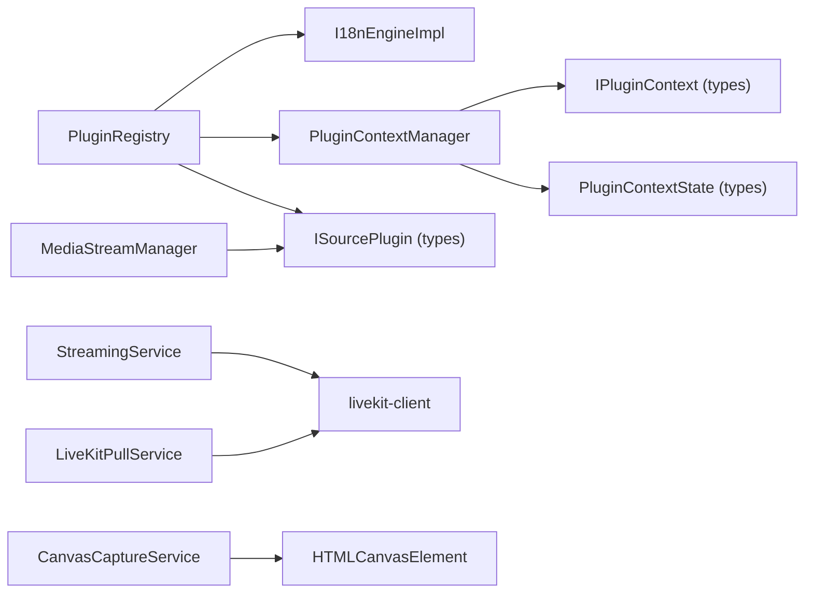

**Diagram sources**
- [plugin-registry.ts:1-3](file://src/services/plugin-registry.ts#L1-L3)
- [plugin-context.ts:11-23](file://src/services/plugin-context.ts#L11-L23)
- [media-stream-manager.ts:18-27](file://src/services/media-stream-manager.ts#L18-L27)
- [streaming.ts:1](file://src/services/streaming.ts#L1)
- [livekit-pull.ts:1-9](file://src/services/livekit-pull.ts#L1-L9)
- [canvas-capture.ts:5](file://src/services/canvas-capture.ts#L5)

**Section sources**
- [plugin.ts:164-262](file://src/types/plugin.ts#L164-L262)
- [plugin-context.ts:136-143](file://src/types/plugin-context.ts#L136-L143)

## Performance Considerations
- Adaptive streaming and dynacast are enabled in LiveKit services to optimize bandwidth under varying network conditions
- Video encoding parameters (codec, bitrate, framerate) are applied at publish time to balance quality and bandwidth
- Simulcast is disabled for higher-quality single-layer publishing; consider enabling for diverse client capabilities
- Canvas capture should run continuous rendering only during streaming to avoid unnecessary CPU/GPU usage
- Device enumeration requests permissions only when necessary and falls back to track info when enumerating devices fails

[No sources needed since this section provides general guidance]

## Troubleshooting Guide
Common issues and strategies:
- Permission errors when accessing camera/microphone:
  - Device enumeration requests permissions only when needed; ensure user grants permission
  - Plugins may show dialogs to select devices; verify dialog flows complete successfully
- Stream not starting or ending unexpectedly:
  - Verify MediaStream is active and tracks are not ended; check onended handlers and cleanup
  - For screen capture, ensure user initiated the selection via getDisplayMedia
- LiveKit connection failures:
  - Validate URL and token; ensure server is reachable and credentials are correct
  - Check connection state and reconnection events; ensure cleanup on disconnect
- i18n resource conflicts:
  - Confirm layer priorities (core < plugin < host < user); verify resource namespaces and nesting
  - Use addResource with explicit layer to override defaults when necessary

**Section sources**
- [media-stream-manager.ts:147-273](file://src/services/media-stream-manager.ts#L147-L273)
- [webcam/index.tsx:328-335](file://src/plugins/builtin/webcam/index.tsx#L328-L335)
- [screencapture-plugin.tsx:251-258](file://src/plugins/builtin/screencapture-plugin.tsx#L251-L258)
- [streaming.ts:119-124](file://src/services/streaming.ts#L119-L124)
- [livekit-pull.ts:174-179](file://src/services/livekit-pull.ts#L174-L179)
- [i18n-engine.ts:188-221](file://src/services/i18n-engine.ts#L188-L221)

## Conclusion
The core service layer provides a robust foundation for media stream management, plugin lifecycle and context integration, and LiveKit streaming/pulling. By centralizing stream lifecycle, enforcing secure plugin contexts, and offering layered internationalization, the system enables extensible, maintainable, and user-friendly plugin-driven streaming experiences.