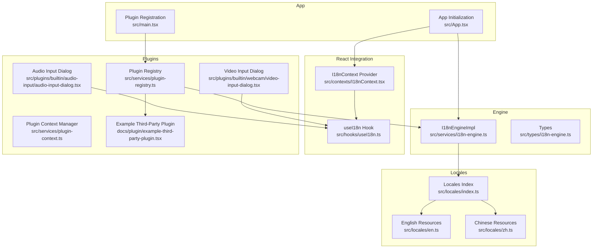
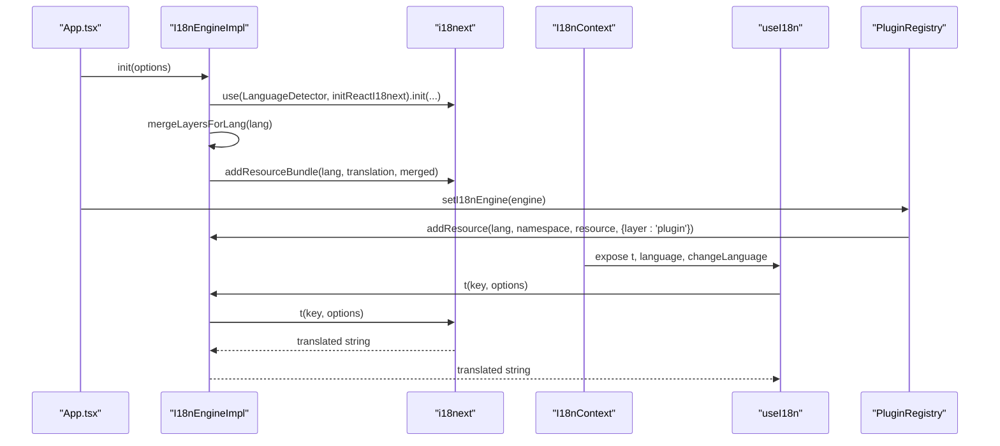
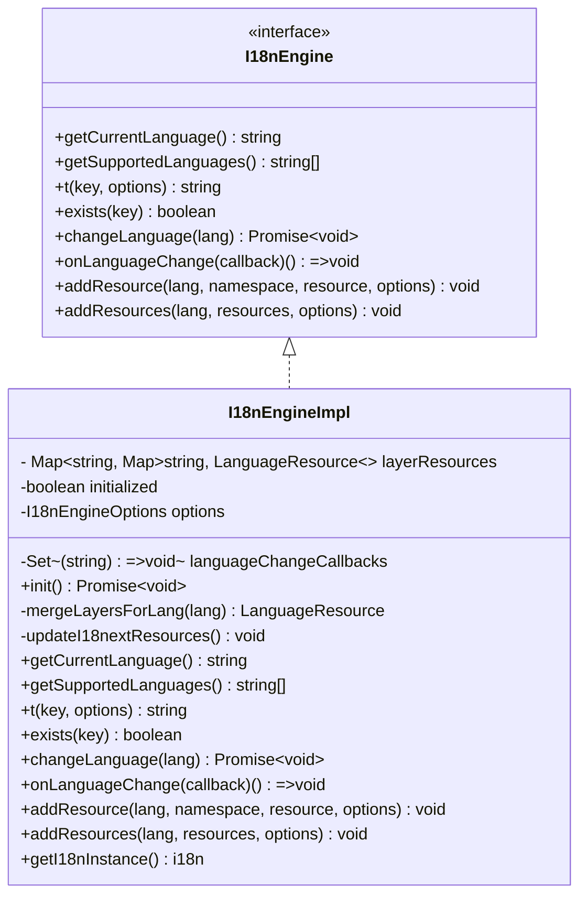
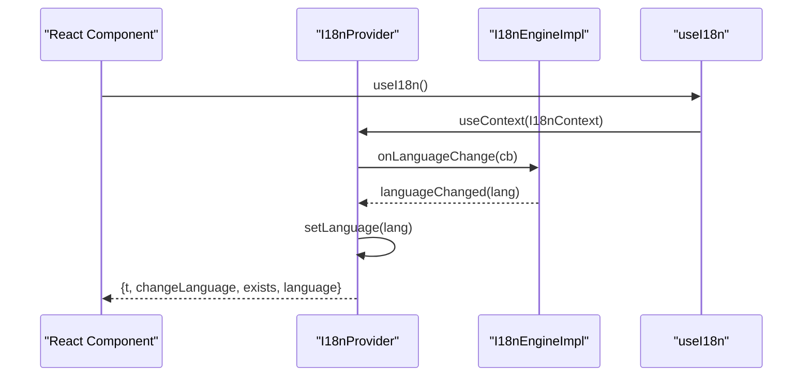
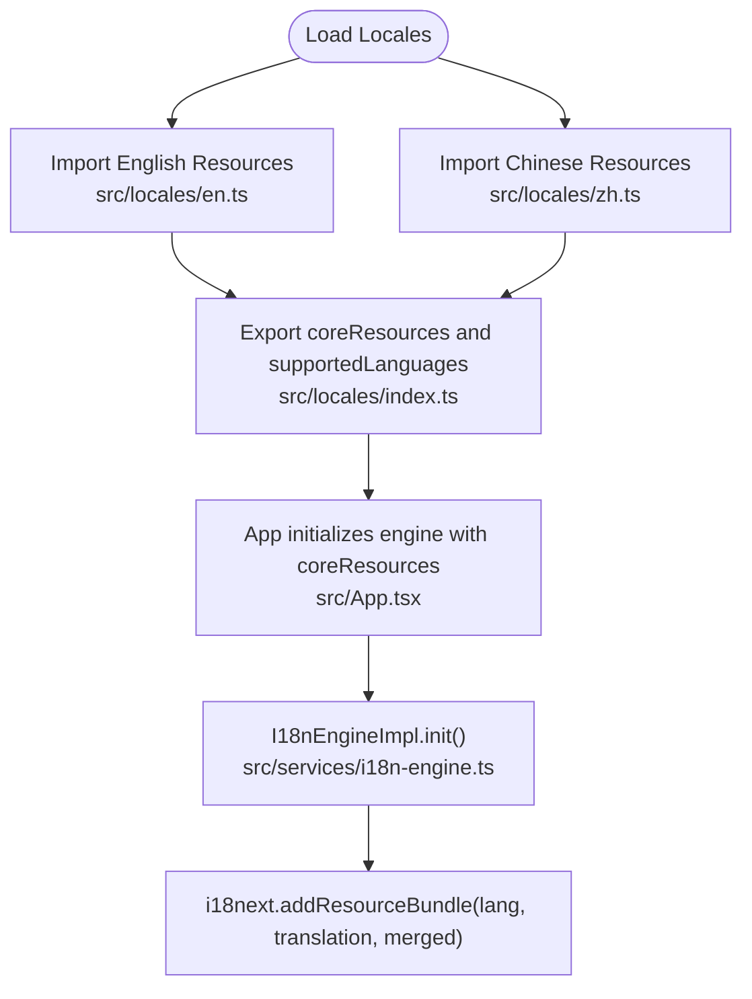
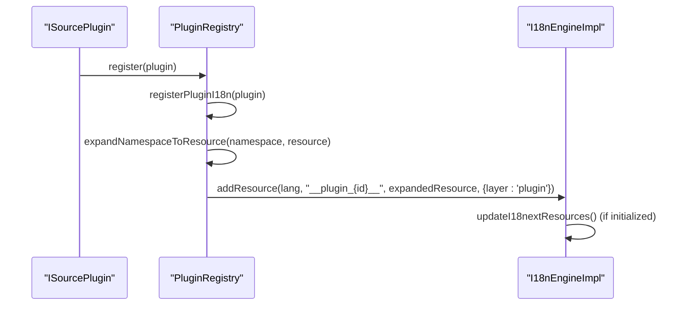
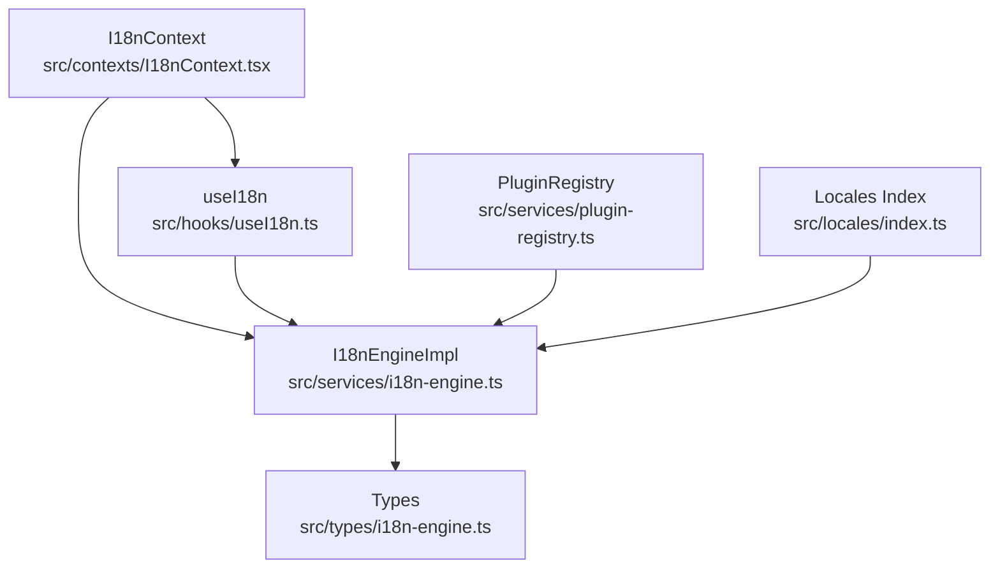

# Internationalization Engine Service

<cite>
**Referenced Files in This Document**
- [i18n-engine.ts](file://src/services/i18n-engine.ts)
- [I18nContext.tsx](file://src/contexts/I18nContext.tsx)
- [useI18n.ts](file://src/hooks/useI18n.ts)
- [index.ts](file://src/locales/index.ts)
- [en.ts](file://src/locales/en.ts)
- [zh.ts](file://src/locales/zh.ts)
- [i18n-engine.ts](file://src/types/i18n-engine.ts)
- [plugin-registry.ts](file://src/services/plugin-registry.ts)
- [plugin-context.ts](file://src/services/plugin-context.ts)
- [audio-input-dialog.tsx](file://src/plugins/builtin/audio-input/audio-input-dialog.tsx)
- [video-input-dialog.tsx](file://src/plugins/builtin/webcam/video-input-dialog.tsx)
- [App.tsx](file://src/App.tsx)
- [main.tsx](file://src/main.tsx)
- [example-third-party-plugin.tsx](file://docs/plugin/example-third-party-plugin.tsx)
</cite>

## Table of Contents
1. [Introduction](#introduction)
2. [Project Structure](#project-structure)
3. [Core Components](#core-components)
4. [Architecture Overview](#architecture-overview)
5. [Detailed Component Analysis](#detailed-component-analysis)
6. [Dependency Analysis](#dependency-analysis)
7. [Performance Considerations](#performance-considerations)
8. [Troubleshooting Guide](#troubleshooting-guide)
9. [Conclusion](#conclusion)
10. [Appendices](#appendices)

## Introduction
This document describes the i18n-engine service that powers internationalization across the application. It covers the engine architecture, resource loading, language switching, and plugin localization integration. It explains the I18nContext provider and useI18n hook for React components, details language resource management for English and Chinese, and documents the plugin internationalization system. It also addresses locale detection, fallback mechanisms, dynamic language switching, and practical examples for implementing multilingual support, adding new languages, and integrating plugin translations. Finally, it provides performance considerations and memory optimization strategies for large translation datasets.

## Project Structure
The i18n system is organized around three primary areas:
- Engine and types: centralized i18n engine implementation and type definitions
- React integration: provider and hook for consuming translations in components
- Locales and plugins: language resources and plugin-specific translations

**Diagram sources**
- [i18n-engine.ts:42-241](file://src/services/i18n-engine.ts#L42-L241)
- [i18n-engine.ts:12-117](file://src/types/i18n-engine.ts#L12-L117)
- [I18nContext.tsx:37-82](file://src/contexts/I18nContext.tsx#L37-L82)
- [useI18n.ts:8-17](file://src/hooks/useI18n.ts#L8-L17)
- [index.ts:5-15](file://src/locales/index.ts#L5-L15)
- [en.ts:3-346](file://src/locales/en.ts#L3-L346)
- [zh.ts:3-345](file://src/locales/zh.ts#L3-L345)
- [plugin-registry.ts:5-168](file://src/services/plugin-registry.ts#L5-L168)
- [plugin-context.ts:82-708](file://src/services/plugin-context.ts#L82-L708)
- [audio-input-dialog.tsx:127-402](file://src/plugins/builtin/audio-input/audio-input-dialog.tsx#L127-L402)
- [video-input-dialog.tsx:37-332](file://src/plugins/builtin/webcam/video-input-dialog.tsx#L37-L332)
- [App.tsx:38-126](file://src/App.tsx#L38-L126)
- [main.tsx:14-28](file://src/main.tsx#L14-L28)
- [example-third-party-plugin.tsx:15-173](file://docs/plugin/example-third-party-plugin.tsx#L15-L173)

**Section sources**
- [i18n-engine.ts:42-241](file://src/services/i18n-engine.ts#L42-L241)
- [i18n-engine.ts:12-117](file://src/types/i18n-engine.ts#L12-L117)
- [I18nContext.tsx:37-82](file://src/contexts/I18nContext.tsx#L37-L82)
- [useI18n.ts:8-17](file://src/hooks/useI18n.ts#L8-L17)
- [index.ts:5-15](file://src/locales/index.ts#L5-L15)
- [en.ts:3-346](file://src/locales/en.ts#L3-L346)
- [zh.ts:3-345](file://src/locales/zh.ts#L3-L345)
- [plugin-registry.ts:5-168](file://src/services/plugin-registry.ts#L5-L168)
- [plugin-context.ts:82-708](file://src/services/plugin-context.ts#L82-L708)
- [audio-input-dialog.tsx:127-402](file://src/plugins/builtin/audio-input/audio-input-dialog.tsx#L127-L402)
- [video-input-dialog.tsx:37-332](file://src/plugins/builtin/webcam/video-input-dialog.tsx#L37-L332)
- [App.tsx:38-126](file://src/App.tsx#L38-L126)
- [main.tsx:14-28](file://src/main.tsx#L14-L28)
- [example-third-party-plugin.tsx:15-173](file://docs/plugin/example-third-party-plugin.tsx#L15-L173)

## Core Components
- I18nEngineImpl: Implements layered resource management (core, plugin, host, user), deep merging, locale detection, and dynamic updates.
- I18nContext Provider: Exposes engine, translate function, language, and changeLanguage to React components.
- useI18n Hook: Provides convenient access to the i18n context.
- Locale Resources: English and Chinese resources loaded from dedicated files and indexed for supported languages.
- Plugin Registry: Integrates plugin i18n resources into the engine with automatic expansion of dot-notation namespaces.
- App Initialization: Creates and configures the engine, applies overrides, and wires it into the React tree.

**Section sources**
- [i18n-engine.ts:42-241](file://src/services/i18n-engine.ts#L42-L241)
- [I18nContext.tsx:37-82](file://src/contexts/I18nContext.tsx#L37-L82)
- [useI18n.ts:8-17](file://src/hooks/useI18n.ts#L8-L17)
- [index.ts:5-15](file://src/locales/index.ts#L5-L15)
- [en.ts:3-346](file://src/locales/en.ts#L3-L346)
- [zh.ts:3-345](file://src/locales/zh.ts#L3-L345)
- [plugin-registry.ts:32-56](file://src/services/plugin-registry.ts#L32-L56)
- [App.tsx:44-107](file://src/App.tsx#L44-L107)

## Architecture Overview
The i18n architecture centers on a layered resource model and seamless React integration:
- Layered Resources: core < plugin < host < user, with deep merges per language.
- Locale Detection: Uses localStorage and navigator with normalization to supported languages.
- Dynamic Updates: Adding resources triggers i18next bundle updates and language change notifications.
- Plugin Integration: Plugins declare i18n resources; registry expands namespaces and registers them under a unique plugin layer.

**Diagram sources**
- [App.tsx:44-107](file://src/App.tsx#L44-L107)
- [i18n-engine.ts:64-119](file://src/services/i18n-engine.ts#L64-L119)
- [i18n-engine.ts:125-159](file://src/services/i18n-engine.ts#L125-L159)
- [plugin-registry.ts:13-20](file://src/services/plugin-registry.ts#L13-L20)
- [plugin-registry.ts:32-56](file://src/services/plugin-registry.ts#L32-L56)
- [I18nContext.tsx:37-82](file://src/contexts/I18nContext.tsx#L37-L82)
- [useI18n.ts:8-17](file://src/hooks/useI18n.ts#L8-L17)

## Detailed Component Analysis

### I18nEngineImpl
- Responsibilities:
  - Initialize i18next with detection, fallback, and supported languages.
  - Manage layered resources (core, plugin, host, user) with deep merge semantics.
  - Provide translation, key existence checks, language change, and resource addition.
  - Update i18next bundles dynamically when resources change.
- Key behaviors:
  - Deep merge ensures nested objects are merged recursively without losing data.
  - Layer priority: core < plugin < host < user.
  - Language change subscribers receive notifications to trigger re-renders.
  - Locale detection converts variants (e.g., zh-CN) to base codes (e.g., zh).

**Diagram sources**
- [i18n-engine.ts:42-241](file://src/services/i18n-engine.ts#L42-L241)
- [i18n-engine.ts:12-65](file://src/types/i18n-engine.ts#L12-L65)

**Section sources**
- [i18n-engine.ts:42-241](file://src/services/i18n-engine.ts#L42-L241)
- [i18n-engine.ts:6-11](file://src/types/i18n-engine.ts#L6-L11)

### I18nContext Provider and useI18n Hook
- I18nContext Provider:
  - Subscribes to engine language changes and keeps local language state synchronized.
  - Exposes t, changeLanguage, exists, and engine to descendants.
- useI18n Hook:
  - Returns the current context value or throws if used outside I18nProvider.

**Diagram sources**
- [I18nContext.tsx:37-82](file://src/contexts/I18nContext.tsx#L37-L82)
- [useI18n.ts:8-17](file://src/hooks/useI18n.ts#L8-L17)
- [i18n-engine.ts:181-186](file://src/services/i18n-engine.ts#L181-L186)

**Section sources**
- [I18nContext.tsx:37-82](file://src/contexts/I18nContext.tsx#L37-L82)
- [useI18n.ts:8-17](file://src/hooks/useI18n.ts#L8-L17)

### Locale Resource Management (English and Chinese)
- Resources are defined per language and exported via a central index.
- Supported languages are declared and typed for compile-time safety.
- The engine initializes with core resources and merges them per language.

**Diagram sources**
- [index.ts:5-15](file://src/locales/index.ts#L5-L15)
- [en.ts:3-346](file://src/locales/en.ts#L3-L346)
- [zh.ts:3-345](file://src/locales/zh.ts#L3-L345)
- [App.tsx:66-71](file://src/App.tsx#L66-L71)
- [i18n-engine.ts:84-94](file://src/services/i18n-engine.ts#L84-L94)

**Section sources**
- [index.ts:5-15](file://src/locales/index.ts#L5-L15)
- [en.ts:3-346](file://src/locales/en.ts#L3-L346)
- [zh.ts:3-345](file://src/locales/zh.ts#L3-L345)
- [App.tsx:66-71](file://src/App.tsx#L66-L71)
- [i18n-engine.ts:84-94](file://src/services/i18n-engine.ts#L84-L94)

### Plugin Internationalization Integration
- Plugins define i18n metadata with default language, supported languages, and resources keyed by language and namespace.
- The registry expands dot-notation namespaces into nested objects and registers them under a unique plugin layer.
- Plugin dialogs and components consume translations via useI18n.

**Diagram sources**
- [plugin-registry.ts:78-118](file://src/services/plugin-registry.ts#L78-L118)
- [plugin-registry.ts:32-56](file://src/services/plugin-registry.ts#L32-L56)
- [plugin-registry.ts:63-76](file://src/services/plugin-registry.ts#L63-L76)
- [i18n-engine.ts:188-221](file://src/services/i18n-engine.ts#L188-L221)

**Section sources**
- [plugin-registry.ts:32-56](file://src/services/plugin-registry.ts#L32-L56)
- [plugin-registry.ts:63-76](file://src/services/plugin-registry.ts#L63-L76)
- [audio-input-dialog.tsx:127-402](file://src/plugins/builtin/audio-input/audio-input-dialog.tsx#L127-L402)
- [video-input-dialog.tsx:37-332](file://src/plugins/builtin/webcam/video-input-dialog.tsx#L37-L332)
- [example-third-party-plugin.tsx:77-115](file://docs/plugin/example-third-party-plugin.tsx#L77-L115)

### Implementation Examples

#### Implementing Multilingual Support in Components
- Use the useI18n hook to access t, language, and changeLanguage.
- Example usages in built-in dialogs demonstrate translating titles, labels, and messages.

**Section sources**
- [audio-input-dialog.tsx:127-402](file://src/plugins/builtin/audio-input/audio-input-dialog.tsx#L127-L402)
- [video-input-dialog.tsx:37-332](file://src/plugins/builtin/webcam/video-input-dialog.tsx#L37-L332)

#### Adding a New Language
- Extend the locales with a new language file and add it to the index.
- Update supportedLanguages and coreResources accordingly during engine initialization.

**Section sources**
- [index.ts:5-15](file://src/locales/index.ts#L5-L15)
- [App.tsx:66-71](file://src/App.tsx#L66-L71)

#### Integrating Plugin Translations
- Define i18n.resources in the plugin with language-to-namespace-to-resource mapping.
- The registry automatically expands namespaces and registers them under the plugin layer.

**Section sources**
- [plugin-registry.ts:32-56](file://src/services/plugin-registry.ts#L32-L56)
- [example-third-party-plugin.tsx:77-115](file://docs/plugin/example-third-party-plugin.tsx#L77-L115)

## Dependency Analysis
The i18n system exhibits low coupling and high cohesion:
- Engine depends on i18next and the internal types.
- React provider and hook depend on the engine interface.
- Locales are decoupled from engine initialization via coreResources.
- Plugin registry depends on engine to register plugin i18n resources.

**Diagram sources**
- [i18n-engine.ts:42-241](file://src/services/i18n-engine.ts#L42-L241)
- [i18n-engine.ts:12-117](file://src/types/i18n-engine.ts#L12-L117)
- [I18nContext.tsx:37-82](file://src/contexts/I18nContext.tsx#L37-L82)
- [useI18n.ts:8-17](file://src/hooks/useI18n.ts#L8-L17)
- [index.ts:5-15](file://src/locales/index.ts#L5-L15)
- [plugin-registry.ts:5-168](file://src/services/plugin-registry.ts#L5-L168)

**Section sources**
- [i18n-engine.ts:42-241](file://src/services/i18n-engine.ts#L42-L241)
- [i18n-engine.ts:12-117](file://src/types/i18n-engine.ts#L12-L117)
- [I18nContext.tsx:37-82](file://src/contexts/I18nContext.tsx#L37-L82)
- [useI18n.ts:8-17](file://src/hooks/useI18n.ts#L8-L17)
- [index.ts:5-15](file://src/locales/index.ts#L5-L15)
- [plugin-registry.ts:5-168](file://src/services/plugin-registry.ts#L5-L168)

## Performance Considerations
- Large translation datasets:
  - Prefer lazy-loading plugin resources to avoid initializing unused namespaces.
  - Use targeted addResource calls for incremental updates rather than rebuilding all bundles.
- Memory optimization:
  - Avoid duplicating identical resources; rely on deep merge to combine shared subtrees.
  - Keep namespace names concise and hierarchical to minimize nesting overhead.
- Rendering:
  - The provider memoizes values to prevent unnecessary re-renders.
  - Use the engine’s onLanguageChange callback to batch UI updates when language changes frequently.

[No sources needed since this section provides general guidance]

## Troubleshooting Guide
- Language not changing:
  - Ensure changeLanguage is awaited and that the engine is initialized.
  - Verify onLanguageChange subscribers are registered and not being unsubscribed prematurely.
- Missing translations:
  - Confirm the key exists in the current language using exists.
  - Check that plugin resources are registered after the engine is set in the registry.
- Locale detection issues:
  - Validate supportedLanguages and conversion logic for variant codes.
  - Confirm localStorage caching key matches the engine configuration.

**Section sources**
- [i18n-engine.ts:177-186](file://src/services/i18n-engine.ts#L177-L186)
- [i18n-engine.ts:169-175](file://src/services/i18n-engine.ts#L169-L175)
- [plugin-registry.ts:13-20](file://src/services/plugin-registry.ts#L13-L20)

## Conclusion
The i18n-engine service provides a robust, layered, and extensible internationalization solution. It integrates seamlessly with React via a provider and hook, supports dynamic resource updates, and enables plugins to contribute localized content. With careful resource management and performance-conscious updates, the system scales effectively for applications with extensive translation needs.

[No sources needed since this section summarizes without analyzing specific files]

## Appendices

### API Reference: I18nEngine
- getCurrentLanguage(): returns the current language code.
- getSupportedLanguages(): returns the list of supported languages.
- t(key, options?): returns the translated string for the given key.
- exists(key): checks if a translation key exists.
- changeLanguage(lang): switches the current language asynchronously.
- onLanguageChange(callback): subscribes to language change events.
- addResource(lang, namespace, resource, options?): adds or merges resources for a language and namespace.
- addResources(lang, resources, options?): adds multiple namespaces at once.
- getI18nInstance(): returns the underlying i18next instance.

**Section sources**
- [i18n-engine.ts:12-65](file://src/types/i18n-engine.ts#L12-L65)

### Example: Built-in Plugin Dialogs Using Translations
- AudioInputDialog and VideoInputDialog demonstrate:
  - Using useI18n to translate dialog titles, descriptions, labels, and buttons.
  - Handling loading and error states with localized messages.

**Section sources**
- [audio-input-dialog.tsx:127-402](file://src/plugins/builtin/audio-input/audio-input-dialog.tsx#L127-L402)
- [video-input-dialog.tsx:37-332](file://src/plugins/builtin/webcam/video-input-dialog.tsx#L37-L332)