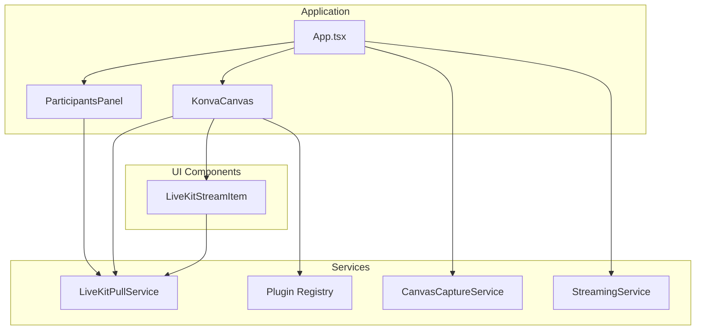
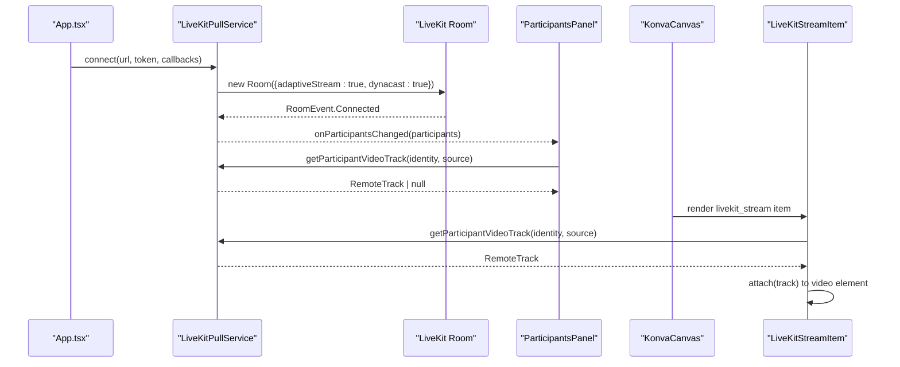
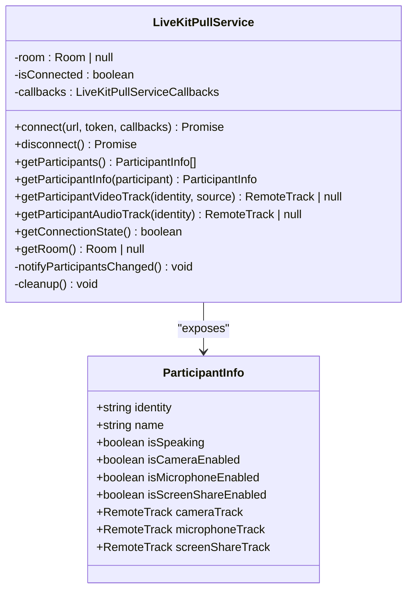
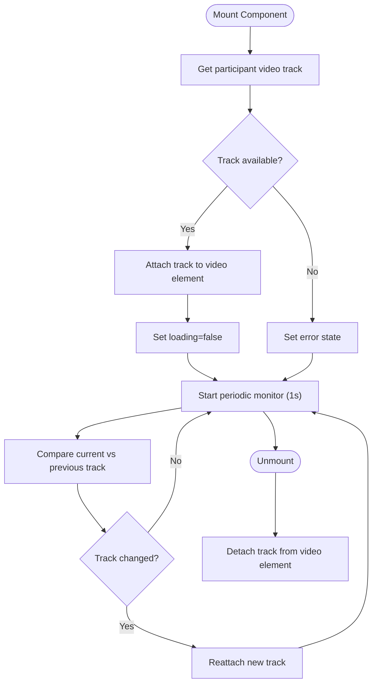
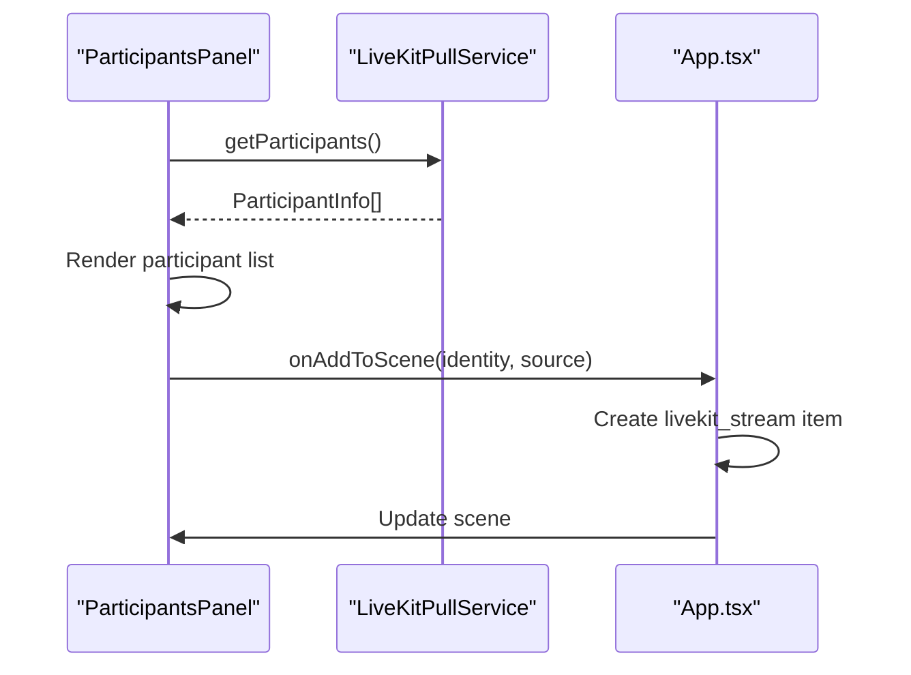
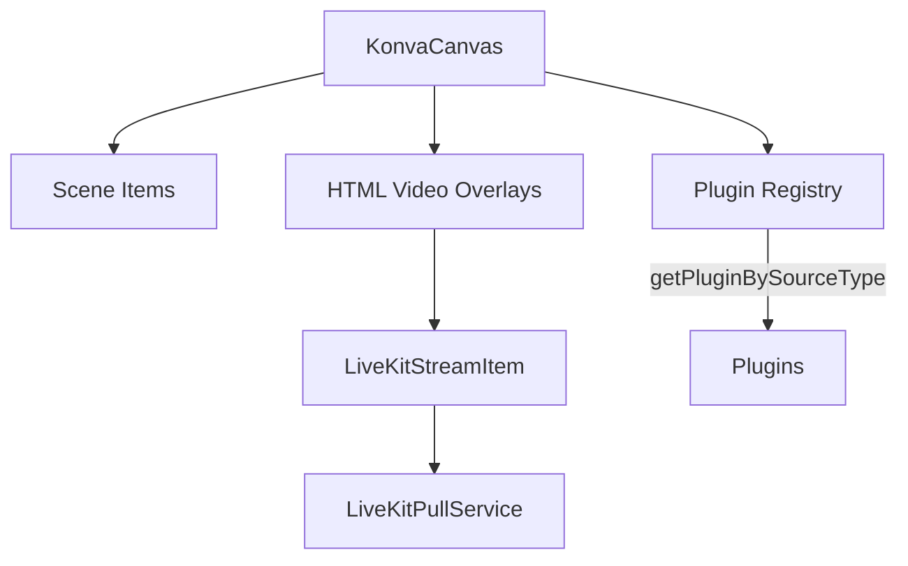
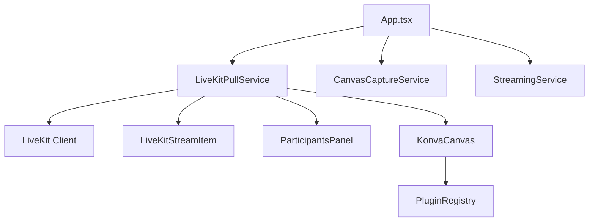

# LiveKitPullService

<cite>
**Referenced Files in This Document**
- [livekit-pull.ts](file://src/services/livekit-pull.ts)
- [livekit-stream-item.tsx](file://src/components/livekit-stream-item.tsx)
- [participants-panel.tsx](file://src/components/participants-panel.tsx)
- [konva-canvas.tsx](file://src/components/konva-canvas.tsx)
- [App.tsx](file://src/App.tsx)
- [canvas-capture.ts](file://src/services/canvas-capture.ts)
- [streaming.ts](file://src/services/streaming.ts)
- [plugin-registry.ts](file://src/services/plugin-registry.ts)
</cite>

## Table of Contents
1. [Introduction](#introduction)
2. [Project Structure](#project-structure)
3. [Core Components](#core-components)
4. [Architecture Overview](#architecture-overview)
5. [Detailed Component Analysis](#detailed-component-analysis)
6. [Dependency Analysis](#dependency-analysis)
7. [Performance Considerations](#performance-considerations)
8. [Troubleshooting Guide](#troubleshooting-guide)
9. [Conclusion](#conclusion)

## Introduction
This document provides comprehensive technical documentation for the LiveKitPullService, which manages LiveKit participant streams for video mixing. It covers participant stream subscription and unsubscription mechanisms, stream rendering and display management within the video mixing canvas, participant state tracking, presence detection, stream quality monitoring, integration with the video mixing engine, and error handling strategies.

## Project Structure
The LiveKitPullService integrates with several key components:
- Service layer: LiveKitPullService manages connections, participant discovery, and track access
- UI layer: ParticipantsPanel displays participant states and enables adding streams to the scene
- Rendering layer: LiveKitStreamItem handles video attachment/detachment and error states
- Canvas integration: KonvaCanvas renders scene items and overlays HTML video elements for LiveKit streams
- Application orchestration: App.tsx coordinates pulling, scene composition, and stream lifecycle

**Diagram sources**
- [App.tsx:800-999](file://src/App.tsx#L800-L999)
- [livekit-pull.ts:49-351](file://src/services/livekit-pull.ts#L49-L351)
- [livekit-stream-item.tsx:16-174](file://src/components/livekit-stream-item.tsx#L16-L174)
- [participants-panel.tsx:128-196](file://src/components/participants-panel.tsx#L128-L196)
- [konva-canvas.tsx:113-744](file://src/components/konva-canvas.tsx#L113-L744)
- [plugin-registry.ts:144-167](file://src/services/plugin-registry.ts#L144-L167)
- [canvas-capture.ts:5-48](file://src/services/canvas-capture.ts#L5-L48)
- [streaming.ts:6-177](file://src/services/streaming.ts#L6-L177)

**Section sources**
- [livekit-pull.ts:1-352](file://src/services/livekit-pull.ts#L1-L352)
- [livekit-stream-item.tsx:1-174](file://src/components/livekit-stream-item.tsx#L1-L174)
- [participants-panel.tsx:1-196](file://src/components/participants-panel.tsx#L1-L196)
- [konva-canvas.tsx:1-744](file://src/components/konva-canvas.tsx#L1-L744)
- [App.tsx:800-999](file://src/App.tsx#L800-L999)

## Core Components
- LiveKitPullService: Central service for connecting to LiveKit rooms, tracking participants, and exposing participant/video/audio tracks
- LiveKitStreamItem: React component that attaches/removes LiveKit video tracks to/from HTML video elements
- ParticipantsPanel: Displays participant states and allows adding camera/screen-share streams to the scene
- KonvaCanvas: Renders scene items and overlays HTML video elements for LiveKit streams
- Plugin Registry: Maps scene item types to plugins for rendering and canvas integration

**Section sources**
- [livekit-pull.ts:49-351](file://src/services/livekit-pull.ts#L49-L351)
- [livekit-stream-item.tsx:16-174](file://src/components/livekit-stream-item.tsx#L16-L174)
- [participants-panel.tsx:128-196](file://src/components/participants-panel.tsx#L128-L196)
- [konva-canvas.tsx:113-744](file://src/components/konva-canvas.tsx#L113-L744)
- [plugin-registry.ts:144-167](file://src/services/plugin-registry.ts#L144-L167)

## Architecture Overview
The LiveKitPullService operates as a bridge between LiveKit and the video mixing engine:
- Connection management: Establishes room connections with adaptive streaming and dynacast enabled
- Participant tracking: Monitors participant joins/leaves and track subscription/unsubscription events
- State exposure: Provides participant info with speaking, camera, microphone, and screen-share states
- Track access: Retrieves participant video/audio tracks by identity and source type
- Integration: Enables ParticipantsPanel and KonvaCanvas to consume participant streams

**Diagram sources**
- [livekit-pull.ts:60-179](file://src/services/livekit-pull.ts#L60-L179)
- [participants-panel.tsx:142-149](file://src/components/participants-panel.tsx#L142-L149)
- [konva-canvas.tsx:723-731](file://src/components/konva-canvas.tsx#L723-L731)
- [livekit-stream-item.tsx:39-54](file://src/components/livekit-stream-item.tsx#L39-L54)

## Detailed Component Analysis

### LiveKitPullService
The LiveKitPullService encapsulates all LiveKit-related operations:
- Connection lifecycle: Validates inputs, creates Room with adaptive streaming and dynacast, handles connection/disconnection/reconnection events
- Event-driven state: Listens to participant join/leave and track subscribe/unsubscribe events, notifying subscribers
- Participant state: Aggregates participant info including speaking state and track publication states
- Track retrieval: Provides methods to fetch participant video/audio tracks by identity and source

**Diagram sources**
- [livekit-pull.ts:49-351](file://src/services/livekit-pull.ts#L49-L351)

**Section sources**
- [livekit-pull.ts:60-179](file://src/services/livekit-pull.ts#L60-L179)
- [livekit-pull.ts:201-265](file://src/services/livekit-pull.ts#L201-L265)
- [livekit-pull.ts:270-314](file://src/services/livekit-pull.ts#L270-L314)

### LiveKitStreamItem
LiveKitStreamItem manages the lifecycle of a single participant's video stream:
- Initial attachment: Retrieves the RemoteTrack and attaches it to an HTML video element
- State monitoring: Periodically checks for track changes and reattaches if necessary
- Error handling: Displays loading states and error messages when tracks are unavailable
- Cleanup: Detaches tracks on component unmount

**Diagram sources**
- [livekit-stream-item.tsx:26-108](file://src/components/livekit-stream-item.tsx#L26-L108)

**Section sources**
- [livekit-stream-item.tsx:26-108](file://src/components/livekit-stream-item.tsx#L26-L108)

### ParticipantsPanel
ParticipantsPanel provides a real-time view of participants and their capabilities:
- Real-time updates: Polls participant list every second when connected
- Presence detection: Shows participant names and speaking indicators
- Capability indicators: Displays camera/microphone/screen-share availability
- Action integration: Enables adding camera or screen-share streams to the scene

**Diagram sources**
- [participants-panel.tsx:142-149](file://src/components/participants-panel.tsx#L142-L149)
- [App.tsx:827-897](file://src/App.tsx#L827-L897)

**Section sources**
- [participants-panel.tsx:128-196](file://src/components/participants-panel.tsx#L128-L196)
- [App.tsx:827-897](file://src/App.tsx#L827-L897)

### KonvaCanvas Integration
KonvaCanvas renders scene items and overlays HTML video elements for LiveKit streams:
- Scene rendering: Draws scene items in z-order with proper transforms
- LiveKit overlay: Places HTML div overlays for livekit_stream items with video elements
- Interaction: Maintains selection and transformation while allowing video clicks when not selected
- Plugin mapping: Uses plugin registry to map scene item types to rendering logic

**Diagram sources**
- [konva-canvas.tsx:696-733](file://src/components/konva-canvas.tsx#L696-L733)
- [konva-canvas.tsx:583-596](file://src/components/konva-canvas.tsx#L583-L596)
- [plugin-registry.ts:144-167](file://src/services/plugin-registry.ts#L144-L167)

**Section sources**
- [konva-canvas.tsx:696-733](file://src/components/konva-canvas.tsx#L696-L733)
- [konva-canvas.tsx:583-596](file://src/components/konva-canvas.tsx#L583-L596)

### Application Orchestration
App.tsx coordinates the pulling process and scene composition:
- Connection control: Toggles pulling on/off and manages connection lifecycle
- Scene creation: Adds livekit_stream items to the active scene with computed sizes and positions
- Integration: Bridges ParticipantsPanel actions to scene updates

**Section sources**
- [App.tsx:800-824](file://src/App.tsx#L800-L824)
- [App.tsx:827-897](file://src/App.tsx#L827-L897)

## Dependency Analysis
The LiveKitPullService interacts with multiple subsystems:
- LiveKit client: Room, RemoteParticipant, RemoteTrack, Track, RoomEvent
- React components: LiveKitStreamItem, ParticipantsPanel, KonvaCanvas
- Application services: CanvasCaptureService, StreamingService
- Plugin system: PluginRegistry for type mapping

**Diagram sources**
- [livekit-pull.ts:1-9](file://src/services/livekit-pull.ts#L1-L9)
- [livekit-stream-item.tsx:3](file://src/components/livekit-stream-item.tsx#L3)
- [participants-panel.tsx:13-15](file://src/components/participants-panel.tsx#L13-L15)
- [konva-canvas.tsx:22](file://src/components/konva-canvas.tsx#L22)
- [plugin-registry.ts:144-167](file://src/services/plugin-registry.ts#L144-L167)
- [App.tsx:800-824](file://src/App.tsx#L800-L824)
- [canvas-capture.ts:5-48](file://src/services/canvas-capture.ts#L5-L48)
- [streaming.ts:6-177](file://src/services/streaming.ts#L6-L177)

**Section sources**
- [livekit-pull.ts:1-9](file://src/services/livekit-pull.ts#L1-L9)
- [livekit-stream-item.tsx:3](file://src/components/livekit-stream-item.tsx#L3)
- [participants-panel.tsx:13-15](file://src/components/participants-panel.tsx#L13-L15)
- [konva-canvas.tsx:22](file://src/components/konva-canvas.tsx#L22)
- [plugin-registry.ts:144-167](file://src/services/plugin-registry.ts#L144-L167)
- [App.tsx:800-824](file://src/App.tsx#L800-L824)
- [canvas-capture.ts:5-48](file://src/services/canvas-capture.ts#L5-L48)
- [streaming.ts:6-177](file://src/services/streaming.ts#L6-L177)

## Performance Considerations
- Adaptive streaming and dynacast: Enabled in Room constructor to optimize bandwidth and CPU usage
- Track polling: LiveKitStreamItem monitors track changes every second to handle dynamic track updates
- Continuous rendering: KonvaCanvas maintains a render loop to keep capture streams alive during streaming
- Efficient state updates: ParticipantsPanel polls participant changes at a fixed interval to balance responsiveness and performance
- Stream sizing: App calculates optimal LiveKit stream sizes based on canvas dimensions to minimize scaling overhead

## Troubleshooting Guide
Common issues and resolutions:
- Connection failures: Verify URL and token validity; check network connectivity; review error logs from connect/disconnect operations
- Stream interruptions: LiveKitStreamItem automatically reattaches when tracks change; monitor periodic check intervals
- Participant state inconsistencies: ParticipantsPanel polling ensures eventual consistency; check callback notifications
- Rendering artifacts: Confirm HTML overlay positioning and z-index; verify video element detachment on unmount
- Quality degradation: Adjust adaptive streaming settings; monitor track publication states; consider codec and bitrate configurations

**Section sources**
- [livekit-pull.ts:174-178](file://src/services/livekit-pull.ts#L174-L178)
- [livekit-stream-item.tsx:64-70](file://src/components/livekit-stream-item.tsx#L64-L70)
- [livekit-stream-item.tsx:98-107](file://src/components/livekit-stream-item.tsx#L98-L107)
- [participants-panel.tsx:146-149](file://src/components/participants-panel.tsx#L146-L149)

## Conclusion
The LiveKitPullService provides a robust foundation for integrating external participant streams into the video mixing engine. Its event-driven architecture, efficient track management, and seamless UI integration enable real-time participant stream consumption with reliable error handling and performance characteristics suitable for production environments.