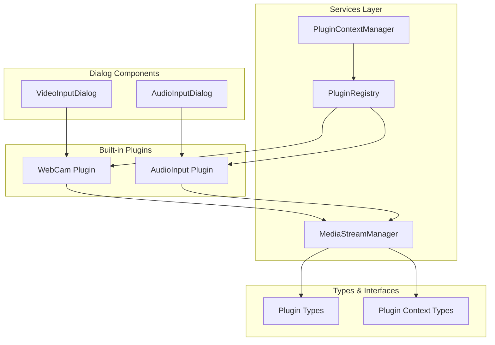
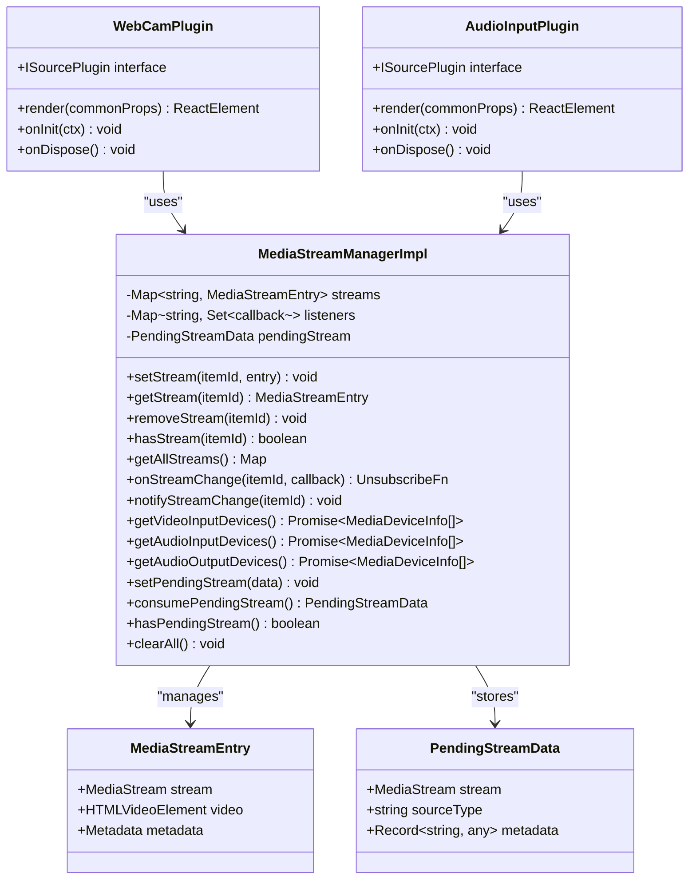
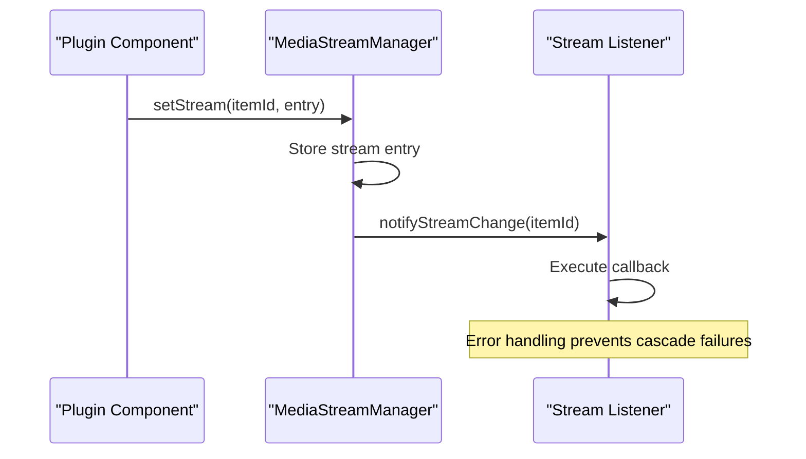
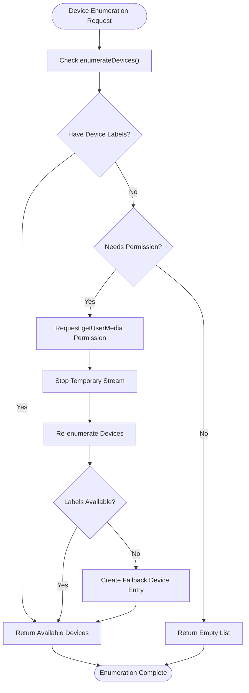
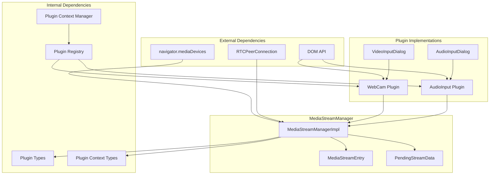

# MediaStreamManager Service

<cite>
**Referenced Files in This Document**
- [media-stream-manager.ts](file://src/services/media-stream-manager.ts)
- [webcam/index.tsx](file://src/plugins/builtin/webcam/index.tsx)
- [webcam/video-input-dialog.tsx](file://src/plugins/builtin/webcam/video-input-dialog.tsx)
- [audio-input/index.tsx](file://src/plugins/builtin/audio-input/index.tsx)
- [audio-input-dialog.tsx](file://src/plugins/builtin/audio-input/audio-input-dialog.tsx)
- [plugin-registry.ts](file://src/services/plugin-registry.ts)
- [plugin-context.ts](file://src/services/plugin-context.ts)
- [plugin.ts](file://src/types/plugin.ts)
- [plugin-context.ts](file://src/types/plugin-context.ts)
</cite>

## Table of Contents
1. [Introduction](#introduction)
2. [Project Structure](#project-structure)
3. [Core Components](#core-components)
4. [Architecture Overview](#architecture-overview)
5. [Detailed Component Analysis](#detailed-component-analysis)
6. [Dependency Analysis](#dependency-analysis)
7. [Performance Considerations](#performance-considerations)
8. [Troubleshooting Guide](#troubleshooting-guide)
9. [Conclusion](#conclusion)

## Introduction
The MediaStreamManager service is the central media stream management component in the LiveMixer application. It provides a unified API for plugins to register, manage, and share MediaStream instances while handling automatic cleanup, device enumeration, and event notifications. The service decouples plugin implementations from the application layer, enabling third-party plugins to integrate seamlessly with the media pipeline.

## Project Structure
The MediaStreamManager service is organized within the services directory alongside other core application services. It interfaces with built-in plugins for webcam and audio input, which serve as primary consumers of the stream management capabilities.

**Diagram sources**
- [media-stream-manager.ts:1-323](file://src/services/media-stream-manager.ts#L1-L323)
- [webcam/index.tsx:1-478](file://src/plugins/builtin/webcam/index.tsx#L1-L478)
- [audio-input/index.tsx:1-555](file://src/plugins/builtin/audio-input/index.tsx#L1-L555)

**Section sources**
- [media-stream-manager.ts:1-323](file://src/services/media-stream-manager.ts#L1-L323)
- [plugin-registry.ts:1-168](file://src/services/plugin-registry.ts#L1-L168)

## Core Components

### MediaStreamEntry Interface
The MediaStreamEntry interface defines the standardized structure for storing media stream information within the manager. It encapsulates the MediaStream object along with optional video element references and metadata about the stream source.

Key characteristics:
- **stream**: Core MediaStream object containing audio/video tracks
- **video**: Optional HTMLVideoElement for preview/playback
- **metadata**: Source identification and plugin association data

Metadata fields include device identifiers, human-readable labels, source type categorization, and plugin ownership information.

**Section sources**
- [media-stream-manager.ts:18-27](file://src/services/media-stream-manager.ts#L18-L27)

### PendingStreamData Structure
PendingStreamData serves as a temporary container for stream data exchanged between dialog components and the application during the add-source workflow. This mechanism enables seamless communication between UI dialogs and plugin initialization processes.

Structure components:
- **stream**: MediaStream instance captured during dialog interaction
- **sourceType**: Identifier indicating the type of media source
- **metadata**: Additional contextual information (device IDs, labels)

**Section sources**
- [media-stream-manager.ts:29-33](file://src/services/media-stream-manager.ts#L29-L33)

### Stream Management Operations
The MediaStreamManager provides comprehensive stream lifecycle management through several core operations:

**Registration and Updates**: The setStream method registers new streams or updates existing ones, automatically notifying subscribed listeners of changes.

**Retrieval**: The getStream method provides access to stored stream entries with null safety.

**Removal**: The removeStream method handles complete cleanup including track termination and DOM element removal.

**Status Checking**: hasStream verifies stream activity status for efficient resource management.

**Bulk Operations**: getAllStreams and clearAll enable comprehensive stream inventory and cleanup scenarios.

**Section sources**
- [media-stream-manager.ts:53-106](file://src/services/media-stream-manager.ts#L53-L106)
- [media-stream-manager.ts:307-315](file://src/services/media-stream-manager.ts#L307-L315)

## Architecture Overview

**Diagram sources**
- [media-stream-manager.ts:39-322](file://src/services/media-stream-manager.ts#L39-L322)
- [webcam/index.tsx:110-478](file://src/plugins/builtin/webcam/index.tsx#L110-L478)
- [audio-input/index.tsx:105-555](file://src/plugins/builtin/audio-input/index.tsx#L105-L555)

## Detailed Component Analysis

### Stream Management Implementation

The MediaStreamManagerImpl class implements a robust stream management system with the following key features:

**Memory Management**: Streams are stored in a Map structure keyed by item IDs, enabling efficient lookup and management. Automatic cleanup ensures proper resource deallocation when streams are removed.

**Event System**: The listener-based notification system enables reactive updates across the application. Subscriptions are managed per item, allowing targeted notifications for specific stream changes.

**Thread Safety**: The implementation handles concurrent access patterns safely, with proper error handling in callback execution.

**Diagram sources**
- [media-stream-manager.ts:56-65](file://src/services/media-stream-manager.ts#L56-L65)
- [media-stream-manager.ts:130-141](file://src/services/media-stream-manager.ts#L130-L141)

**Section sources**
- [media-stream-manager.ts:39-322](file://src/services/media-stream-manager.ts#L39-L322)

### Device Enumeration System

The device enumeration functionality provides unified access to media devices with sophisticated permission handling strategies:

**Video Input Devices**: The getVideoInputDevices method implements a two-phase approach - first attempting enumeration without permission, then requesting getUserMedia permission when labels are unavailable.

**Audio Input Devices**: The getAudioInputDevices method includes intelligent permission detection, requesting access only when necessary based on device availability and labeling status.

**Audio Output Devices**: The getAudioOutputDevices method provides straightforward enumeration for output device discovery.

**Permission Strategies**: The implementation includes fallback mechanisms and error handling to gracefully handle permission denials and device enumeration failures.

**Diagram sources**
- [media-stream-manager.ts:150-187](file://src/services/media-stream-manager.ts#L150-L187)
- [media-stream-manager.ts:193-257](file://src/services/media-stream-manager.ts#L193-L257)

**Section sources**
- [media-stream-manager.ts:147-273](file://src/services/media-stream-manager.ts#L147-L273)

### Pending Stream Mechanism

The pending stream mechanism facilitates dialog-to-application communication during the add-source workflow:

**Dialog Capture**: Dialog components capture MediaStream instances during user interaction, storing them temporarily in the pending stream holder.

**Application Consumption**: The application consumes pending stream data when creating new scene items, transferring stream ownership from dialog to plugin.

**Cleanup Strategy**: Pending streams are cleared after consumption, preventing memory leaks and ensuring proper resource management.

**Section sources**
- [media-stream-manager.ts:279-301](file://src/services/media-stream-manager.ts#L279-L301)
- [webcam/video-input-dialog.tsx:188-210](file://src/plugins/builtin/webcam/video-input-dialog.tsx#L188-L210)
- [audio-input-dialog.tsx:260-280](file://src/plugins/builtin/audio-input/audio-input-dialog.tsx#L260-L280)

### Plugin Integration Patterns

Built-in plugins demonstrate comprehensive integration with the MediaStreamManager:

**WebCam Plugin**: Implements video capture with preview functionality, device selection, and real-time stream management. Uses both legacy and modern APIs for backward compatibility.

**AudioInput Plugin**: Provides microphone capture with audio level monitoring, device selection, and visual feedback. Includes sophisticated audio analysis capabilities.

**Dialog Components**: Both plugins utilize specialized dialog components for device selection, implementing the pending stream pattern for seamless integration.

**Section sources**
- [webcam/index.tsx:28-108](file://src/plugins/builtin/webcam/index.tsx#L28-L108)
- [audio-input/index.tsx:29-99](file://src/plugins/builtin/audio-input/index.tsx#L29-L99)

## Dependency Analysis

**Diagram sources**
- [media-stream-manager.ts:1-323](file://src/services/media-stream-manager.ts#L1-L323)
- [webcam/index.tsx:1-478](file://src/plugins/builtin/webcam/index.tsx#L1-L478)
- [audio-input/index.tsx:1-555](file://src/plugins/builtin/audio-input/index.tsx#L1-L555)

The MediaStreamManager maintains loose coupling with external browser APIs while providing strong typing through TypeScript interfaces. Internal dependencies are minimized through the use of well-defined interfaces and abstractions.

**Section sources**
- [plugin-registry.ts:78-118](file://src/services/plugin-registry.ts#L78-L118)
- [plugin-context.ts:333-456](file://src/services/plugin-context.ts#L333-L456)

## Performance Considerations

### Memory Management Best Practices
- **Automatic Cleanup**: The removeStream method ensures complete resource deallocation by stopping all tracks and removing DOM elements
- **Reference Tracking**: Proper cleanup prevents memory leaks in long-running applications
- **Stream Recycling**: The hasStream method enables efficient reuse patterns without redundant allocations

### Event System Optimization
- **Selective Notifications**: Listeners are maintained per item, minimizing unnecessary notifications
- **Error Isolation**: Callback execution errors are caught and logged without affecting other listeners
- **Subscription Management**: Unsubscribe functions prevent memory leaks from orphaned subscriptions

### Device Enumeration Efficiency
- **Permission Minimization**: The system requests permissions only when necessary, reducing user friction
- **Fallback Strategies**: Intelligent fallback mechanisms ensure functionality even when device enumeration fails
- **Caching**: Device lists can be cached and refreshed as needed to minimize repeated enumeration calls

### Plugin Integration Patterns
- **Lazy Loading**: Plugins can defer stream initialization until device selection occurs
- **Resource Pooling**: Multiple plugins can share streams when appropriate, reducing resource usage
- **Graceful Degradation**: The system continues functioning even when individual plugin operations fail

## Troubleshooting Guide

### Common Issues and Solutions

**Stream Not Receiving Updates**
- Verify that onStreamChange subscriptions are properly established
- Check that notifyStreamChange is called after stream modifications
- Ensure callbacks are not throwing exceptions that could interrupt the notification chain

**Device Enumeration Failures**
- Confirm that HTTPS is being used (required for media device access)
- Verify browser permissions are granted for camera/microphone access
- Check network connectivity and firewall settings that might block device access

**Memory Leaks in Long-Running Applications**
- Ensure proper cleanup of video elements and DOM nodes
- Verify that stream tracks are stopped when no longer needed
- Monitor for orphaned subscriptions that prevent garbage collection

**Dialog-to-App Communication Issues**
- Confirm that pending streams are consumed promptly after dialog completion
- Verify that stream ownership transfers correctly between dialog and plugin
- Check for proper cleanup of temporary streams after consumption

**Section sources**
- [media-stream-manager.ts:130-141](file://src/services/media-stream-manager.ts#L130-L141)
- [media-stream-manager.ts:77-91](file://src/services/media-stream-manager.ts#L77-L91)

## Conclusion

The MediaStreamManager service provides a comprehensive solution for media stream management in the LiveMixer application. Its design emphasizes decoupling, extensibility, and robustness while maintaining performance and reliability. The service successfully abstracts complex browser media APIs into a unified interface that enables seamless integration between plugins, dialogs, and the application core.

Key strengths include sophisticated device enumeration with intelligent permission handling, comprehensive stream lifecycle management with automatic cleanup, and flexible event notification systems. The pending stream mechanism enables smooth dialog-to-application communication patterns essential for modern media applications.

The implementation demonstrates best practices in TypeScript development, including strong typing, proper error handling, and clean separation of concerns. Built-in plugins showcase practical integration patterns that third-party developers can follow when extending the system with custom media sources.

Future enhancements could include advanced stream pooling, improved caching strategies, and expanded device capability detection to further optimize performance and user experience.