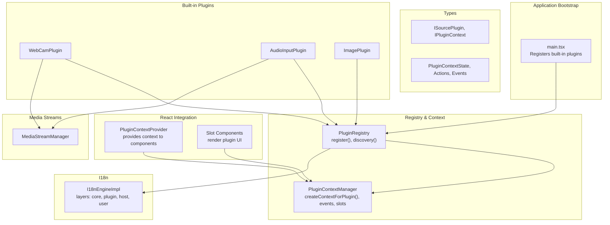
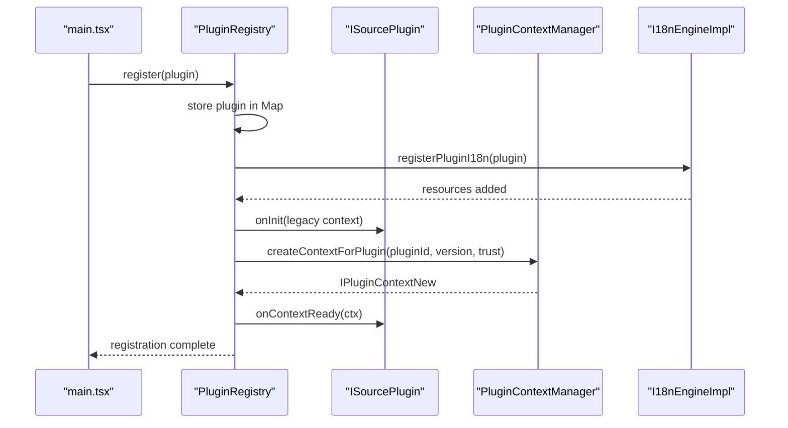
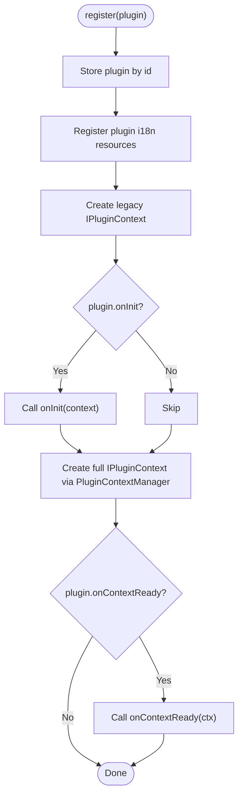
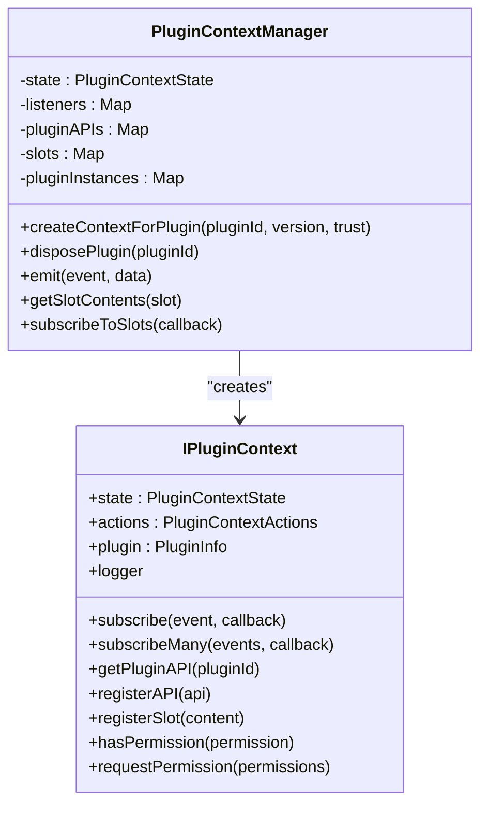
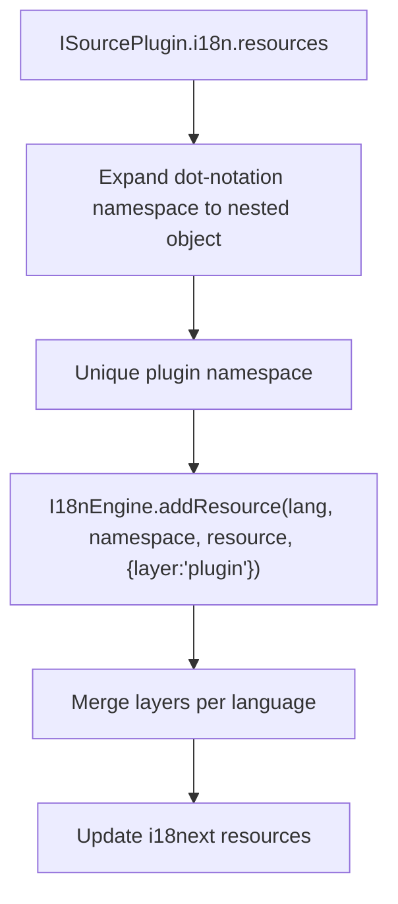
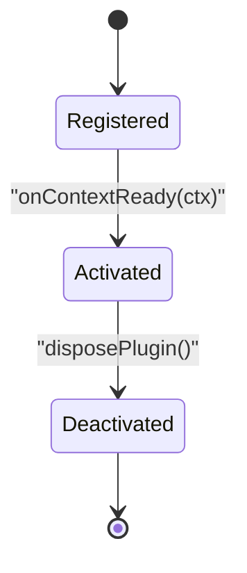
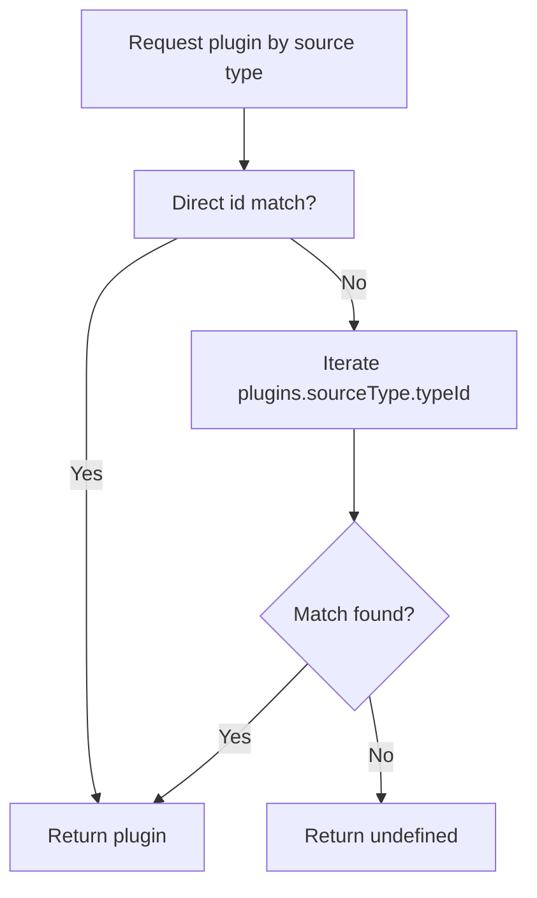
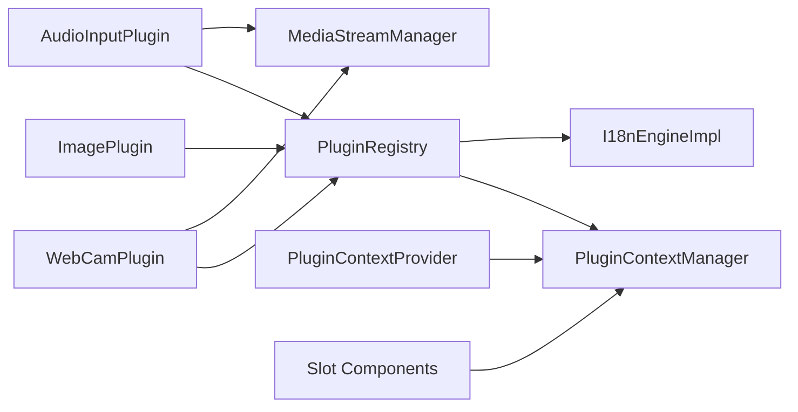

# PluginRegistry Service

<cite>
**Referenced Files in This Document**
- [plugin-registry.ts](file://src/services/plugin-registry.ts)
- [plugin-context.ts](file://src/services/plugin-context.ts)
- [plugin.ts](file://src/types/plugin.ts)
- [plugin-context.ts](file://src/types/plugin-context.ts)
- [i18n-engine.ts](file://src/services/i18n-engine.ts)
- [i18n-engine.ts](file://src/types/i18n-engine.ts)
- [plugin-slot.tsx](file://src/components/plugin-slot.tsx)
- [index.tsx](file://src/plugins/builtin/webcam/index.tsx)
- [index.tsx](file://src/plugins/builtin/audio-input/index.tsx)
- [image-plugin.tsx](file://src/plugins/builtin/image-plugin.tsx)
- [main.tsx](file://src/main.tsx)
- [media-stream-manager.ts](file://src/services/media-stream-manager.ts)
- [extensions.ts](file://src/types/extensions.ts)
</cite>

## Table of Contents
1. [Introduction](#introduction)
2. [Project Structure](#project-structure)
3. [Core Components](#core-components)
4. [Architecture Overview](#architecture-overview)
5. [Detailed Component Analysis](#detailed-component-analysis)
6. [Dependency Analysis](#dependency-analysis)
7. [Performance Considerations](#performance-considerations)
8. [Troubleshooting Guide](#troubleshooting-guide)
9. [Conclusion](#conclusion)

## Introduction
This document describes the PluginRegistry service and the broader plugin lifecycle management system in the LiveMixer Web Studio. It explains how plugins are discovered, registered, initialized, and integrated with the application context. It covers the plugin context creation and management system, including inter-plugin communication channels, internationalization resource management, and plugin localization support. It also documents lifecycle events, discovery mechanisms, dependency resolution patterns, error handling strategies, isolation and security considerations, and performance optimization techniques.

## Project Structure
The plugin system spans several core areas:
- Registry and lifecycle management: PluginRegistry and PluginContextManager
- Type definitions: Plugin interfaces and context contracts
- Internationalization: I18nEngine and plugin i18n integration
- React integration: PluginContextProvider and Slot system
- Built-in plugins: Webcam, AudioInput, Image, and others
- Media stream management: Centralized service for media devices and streams

**Diagram sources**
- [main.tsx:14-20](file://src/main.tsx#L14-L20)
- [plugin-registry.ts:78-118](file://src/services/plugin-registry.ts#L78-L118)
- [plugin-context.ts:333-456](file://src/services/plugin-context.ts#L333-L456)
- [i18n-engine.ts:42-58](file://src/services/i18n-engine.ts#L42-L58)
- [plugin-slot.tsx:56-116](file://src/components/plugin-slot.tsx#L56-L116)
- [index.tsx:110-130](file://src/plugins/builtin/webcam/index.tsx#L110-L130)
- [index.tsx:105-126](file://src/plugins/builtin/audio-input/index.tsx#L105-L126)
- [image-plugin.tsx:7-26](file://src/plugins/builtin/image-plugin.tsx#L7-L26)
- [media-stream-manager.ts:39-65](file://src/services/media-stream-manager.ts#L39-L65)

**Section sources**
- [main.tsx:14-20](file://src/main.tsx#L14-L20)
- [plugin-registry.ts:5-27](file://src/services/plugin-registry.ts#L5-L27)
- [plugin-context.ts:82-141](file://src/services/plugin-context.ts#L82-L141)
- [i18n-engine.ts:42-58](file://src/services/i18n-engine.ts#L42-L58)
- [plugin-slot.tsx:56-116](file://src/components/plugin-slot.tsx#L56-L116)

## Core Components
- PluginRegistry: Central registry for plugins, i18n integration, and legacy context initialization. It registers plugins, loads their i18n resources, creates minimal legacy context, and invokes onInit and onContextReady.
- PluginContextManager: Manages application state, events, slots, plugin APIs, storage, and permission-checked actions. It creates isolated, scoped plugin contexts with readonly state proxies, permission gates, and lifecycle cleanup.
- I18nEngineImpl: Multi-layered i18n engine supporting core, plugin, host, and user layers. It merges resources and updates i18next dynamically.
- PluginContextProvider and Slot system: React integration that exposes plugin contexts and renders plugin-provided UI into predefined slots.
- Built-in plugins: Examples demonstrating registration, i18n, dialog integration, and media stream usage.

**Section sources**
- [plugin-registry.ts:5-168](file://src/services/plugin-registry.ts#L5-L168)
- [plugin-context.ts:82-708](file://src/services/plugin-context.ts#L82-L708)
- [i18n-engine.ts:42-241](file://src/services/i18n-engine.ts#L42-L241)
- [plugin-slot.tsx:56-410](file://src/components/plugin-slot.tsx#L56-L410)
- [index.tsx:110-227](file://src/plugins/builtin/webcam/index.tsx#L110-L227)
- [index.tsx:105-248](file://src/plugins/builtin/audio-input/index.tsx#L105-L248)
- [image-plugin.tsx:7-105](file://src/plugins/builtin/image-plugin.tsx#L7-L105)

## Architecture Overview
The PluginRegistry coordinates plugin lifecycle and integrates with the PluginContextManager for runtime capabilities. Internationalization is handled by the I18nEngine, which merges plugin resources into the global translation layer. The React integration layer provides a provider and slot system for rendering plugin UI and exposing plugin contexts.

**Diagram sources**
- [main.tsx:14-20](file://src/main.tsx#L14-L20)
- [plugin-registry.ts:78-118](file://src/services/plugin-registry.ts#L78-L118)
- [plugin-context.ts:333-456](file://src/services/plugin-context.ts#L333-L456)
- [i18n-engine.ts:188-221](file://src/services/i18n-engine.ts#L188-L221)

## Detailed Component Analysis

### PluginRegistry: Registration, Discovery, Initialization
- Registration: Stores plugins in a Map keyed by id and registers their i18n resources. It logs registration and ensures i18n resources are added under a unique plugin namespace.
- Discovery: Provides getters for all plugins, by category, by source type, and for audio mixing. It resolves source types either by direct id match or by matching sourceType.typeId.
- Initialization: Creates a minimal legacy context with canvas dimensions, logger, and asset loader, then calls onInit. If onContextReady exists, it creates a full context via PluginContextManager and passes it to the plugin.

**Diagram sources**
- [plugin-registry.ts:78-118](file://src/services/plugin-registry.ts#L78-L118)
- [plugin-context.ts:333-456](file://src/services/plugin-context.ts#L333-L456)

**Section sources**
- [plugin-registry.ts:78-165](file://src/services/plugin-registry.ts#L78-L165)
- [plugin.ts:164-262](file://src/types/plugin.ts#L164-L262)

### Plugin Context Creation and Management
- Context creation: For each plugin, PluginContextManager builds a readonly state proxy, scoped logger, permission-configured actions, and plugin API registry. It tracks subscriptions and provides automatic cleanup on dispose.
- State management: Deep-readonly proxy prevents direct mutations; updates occur via actions with permission checks.
- Events and slots: Plugins can subscribe to system events and register UI components into predefined slots with priority and visibility conditions.
- Inter-plugin communication: Plugins can expose APIs via registerAPI and retrieve others’ APIs via getPluginAPI, gated by permissions.
- Disposal: Automatic cleanup removes subscriptions, plugin APIs, and slot registrations, emitting a plugin:dispose event.

**Diagram sources**
- [plugin-context.ts:82-708](file://src/services/plugin-context.ts#L82-L708)
- [plugin-context.ts:322-403](file://src/types/plugin-context.ts#L322-L403)

**Section sources**
- [plugin-context.ts:333-483](file://src/services/plugin-context.ts#L333-L483)
- [plugin-context.ts:322-403](file://src/types/plugin-context.ts#L322-L403)

### Internationalization Resource Management and Localization Support
- Layered resources: I18nEngineImpl supports four layers—core, plugin, host, user—merged deterministically to produce final resources.
- Plugin i18n registration: PluginRegistry expands plugin-provided dot-notation namespaces into nested objects and stores them under a unique plugin namespace. It leverages the engine’s addResource method with layer hints.
- Language switching: Engine listens to language changes and updates resources accordingly, triggering re-rendering.

**Diagram sources**
- [plugin-registry.ts:32-56](file://src/services/plugin-registry.ts#L32-L56)
- [plugin-registry.ts:63-76](file://src/services/plugin-registry.ts#L63-L76)
- [i18n-engine.ts:188-221](file://src/services/i18n-engine.ts#L188-L221)
- [i18n-engine.ts:125-143](file://src/services/i18n-engine.ts#L125-L143)

**Section sources**
- [plugin-registry.ts:32-76](file://src/services/plugin-registry.ts#L32-L76)
- [i18n-engine.ts:42-241](file://src/services/i18n-engine.ts#L42-L241)
- [i18n-engine.ts:12-65](file://src/types/i18n-engine.ts#L12-L65)

### Plugin Lifecycle Events: Activation, Deactivation, and Cleanup
- Activation: Occurs during registration when onContextReady is invoked with a full plugin context. Plugins can subscribe to events, register slots, and expose APIs.
- Deactivation: Managed by PluginContextManager.disposePlugin, which unsubscribes all listeners, removes plugin APIs, clears slot registrations, and emits plugin:dispose.
- Cleanup: Automatic cleanup includes stopping media tracks and removing DOM elements when plugins manage media streams (e.g., built-in webcam/audio plugins).

**Diagram sources**
- [plugin-registry.ts:105-117](file://src/services/plugin-registry.ts#L105-L117)
- [plugin-context.ts:461-483](file://src/services/plugin-context.ts#L461-L483)

**Section sources**
- [plugin-registry.ts:105-117](file://src/services/plugin-registry.ts#L105-L117)
- [plugin-context.ts:461-483](file://src/services/plugin-context.ts#L461-L483)
- [index.tsx:384-440](file://src/plugins/builtin/webcam/index.tsx#L384-L440)
- [index.tsx:424-440](file://src/plugins/builtin/audio-input/index.tsx#L424-L440)

### Plugin Discovery Mechanism and Dependency Resolution
- Discovery: PluginRegistry exposes methods to discover plugins by category, source type, and audio mixer support. It resolves source types by id or typeId.
- Dependency resolution: Plugins declare trust levels and permissions. PluginContextManager grants default permissions based on trust level and enforces permission checks on actions and APIs.

**Diagram sources**
- [plugin-registry.ts:144-157](file://src/services/plugin-registry.ts#L144-L157)
- [plugin-context.ts:42-76](file://src/services/plugin-context.ts#L42-L76)

**Section sources**
- [plugin-registry.ts:128-164](file://src/services/plugin-registry.ts#L128-L164)
- [plugin-context.ts:42-76](file://src/services/plugin-context.ts#L42-L76)

### Examples of Plugin Registration Workflows, Context Sharing Patterns, and Error Handling Strategies
- Registration workflow: Built-in plugins are registered in main.tsx. Each plugin defines metadata, i18n, UI configuration, and lifecycle hooks. The registry handles i18n registration and context creation.
- Context sharing patterns: Plugins can share data via shared services (e.g., MediaStreamManager) and inter-plugin APIs via registerAPI/getPluginAPI. Slots enable UI composition and cross-plugin collaboration.
- Error handling strategies: PluginContextManager wraps event callbacks and stream change listeners with try/catch blocks and logs errors. Slot components wrap content with an error boundary to prevent UI breakage.

**Section sources**
- [main.tsx:14-20](file://src/main.tsx#L14-L20)
- [plugin-slot.tsx:274-302](file://src/components/plugin-slot.tsx#L274-L302)
- [media-stream-manager.ts:130-141](file://src/services/media-stream-manager.ts#L130-L141)

### Security Considerations and Plugin Isolation
- Permission model: Plugins declare trust levels and permissions. Actions enforce permission checks before execution. Plugins can request additional permissions, with builtin plugins auto-approved in development.
- State isolation: Readonly state proxy prevents direct mutations; all state changes must go through actions.
- API isolation: Inter-plugin communication requires explicit registration and permission checks.
- Cleanup: Automatic disposal removes subscriptions, APIs, and slot registrations to prevent leaks.

**Section sources**
- [plugin-context.ts:532-700](file://src/services/plugin-context.ts#L532-L700)
- [plugin-context.ts:333-456](file://src/services/plugin-context.ts#L333-L456)

### Performance Optimization Techniques
- Lazy context creation: Plugin contexts are created on demand and cached per plugin id.
- Efficient state updates: Deep merge of state updates avoids unnecessary re-renders; polling is used in the React provider for simplicity.
- Slot rendering: Slots sort content by priority and filter by visibility, minimizing render overhead.
- Media stream reuse: MediaStreamManager caches streams and stops tracks on disposal to conserve resources.

**Section sources**
- [plugin-slot.tsx:86-100](file://src/components/plugin-slot.tsx#L86-L100)
- [plugin-slot.tsx:204-230](file://src/components/plugin-slot.tsx#L204-L230)
- [media-stream-manager.ts:56-65](file://src/services/media-stream-manager.ts#L56-L65)

## Dependency Analysis
The PluginRegistry depends on PluginContextManager for full plugin contexts and on I18nEngine for localization. Built-in plugins depend on the registry and may use MediaStreamManager for media operations. The React integration layer depends on PluginContextManager for state and slot rendering.

**Diagram sources**
- [plugin-registry.ts:1-3](file://src/services/plugin-registry.ts#L1-L3)
- [plugin-context.ts:138-141](file://src/services/plugin-context.ts#L138-L141)
- [i18n-engine.ts:42-58](file://src/services/i18n-engine.ts#L42-L58)
- [index.tsx:1-10](file://src/plugins/builtin/webcam/index.tsx#L1-L10)
- [index.tsx:1-10](file://src/plugins/builtin/audio-input/index.tsx#L1-L10)
- [image-plugin.tsx:1-5](file://src/plugins/builtin/image-plugin.tsx#L1-L5)
- [media-stream-manager.ts:39-65](file://src/services/media-stream-manager.ts#L39-L65)
- [plugin-slot.tsx:20-28](file://src/components/plugin-slot.tsx#L20-L28)

**Section sources**
- [plugin-registry.ts:1-3](file://src/services/plugin-registry.ts#L1-L3)
- [plugin-context.ts:138-141](file://src/services/plugin-context.ts#L138-L141)
- [i18n-engine.ts:42-58](file://src/services/i18n-engine.ts#L42-L58)
- [plugin-slot.tsx:20-28](file://src/components/plugin-slot.tsx#L20-L28)

## Performance Considerations
- Prefer lazy initialization: Create plugin contexts only when needed and cache them.
- Minimize event listener churn: Use subscribeMany and batch subscriptions where appropriate.
- Optimize slot rendering: Keep slot content counts low and visibility checks efficient.
- Manage media resources: Reuse streams, stop tracks on disposal, and avoid memory leaks.

## Troubleshooting Guide
- Plugin does not appear in add-source dialog: Verify sourceType mapping and ensure sourceType is defined on the plugin.
- i18n keys not resolving: Confirm plugin i18n resources are registered and namespaces are correctly expanded.
- Permission errors on actions: Check plugin trust level and permissions; ensure actions are invoked with proper permissions.
- UI slot not rendering: Ensure registerSlot is called with correct slot name and priority; verify visibility conditions.
- Media stream errors: Check device permissions and ensure streams are stopped on disposal.

**Section sources**
- [plugin-registry.ts:144-157](file://src/services/plugin-registry.ts#L144-L157)
- [plugin-registry.ts:32-56](file://src/services/plugin-registry.ts#L32-L56)
- [plugin-context.ts:532-700](file://src/services/plugin-context.ts#L532-L700)
- [plugin-slot.tsx:204-230](file://src/components/plugin-slot.tsx#L204-L230)
- [media-stream-manager.ts:310-315](file://src/services/media-stream-manager.ts#L310-L315)

## Conclusion
The PluginRegistry and PluginContextManager form a robust foundation for plugin lifecycle management, context isolation, and secure inter-plugin communication. The layered i18n engine enables flexible localization, while the React integration and slot system provide extensible UI composition. Built-in plugins demonstrate best practices for registration, context usage, and media stream management. By following the outlined patterns and considerations, developers can implement reliable, secure, and performant plugins.