# StreamingService Integration

<cite>
**Referenced Files in This Document**
- [streaming.ts](file://src/services/streaming.ts)
- [livekit-pull.ts](file://src/services/livekit-pull.ts)
- [livekit-stream-item.tsx](file://src/components/livekit-stream-item.tsx)
- [canvas-capture.ts](file://src/services/canvas-capture.ts)
- [App.tsx](file://src/App.tsx)
- [setting.ts](file://src/store/setting.ts)
- [media-stream-manager.ts](file://src/services/media-stream-manager.ts)
- [webcam/index.tsx](file://src/plugins/builtin/webcam/index.tsx)
- [audio-input/index.tsx](file://src/plugins/builtin/audio-input/index.tsx)
- [package.json](file://package.json)
</cite>

## Table of Contents
1. [Introduction](#introduction)
2. [Project Structure](#project-structure)
3. [Core Components](#core-components)
4. [Architecture Overview](#architecture-overview)
5. [Detailed Component Analysis](#detailed-component-analysis)
6. [Dependency Analysis](#dependency-analysis)
7. [Performance Considerations](#performance-considerations)
8. [Troubleshooting Guide](#troubleshooting-guide)
9. [Conclusion](#conclusion)

## Introduction
This document provides comprehensive documentation for the StreamingService that integrates LiveKit for publishing video streams in the LiveMixer application. The StreamingService manages room connections, handles authentication, establishes connections, publishes video and audio tracks with configurable encoding options, and manages disconnections. It also covers room connection management, video track publishing with H.264, H.265, VP8, VP9, and AV1 codecs, bitrate control, frame rate settings, audio track publishing, stream quality adaptation, bandwidth management, network optimization strategies, error handling, reconnection logic, and stream interruption recovery.

## Project Structure
The LiveMixer application is organized around a modular architecture with distinct services for streaming, media management, and plugin-based source capture. The streaming functionality is primarily implemented in the `StreamingService` class, which integrates with LiveKit's client library to publish media streams.

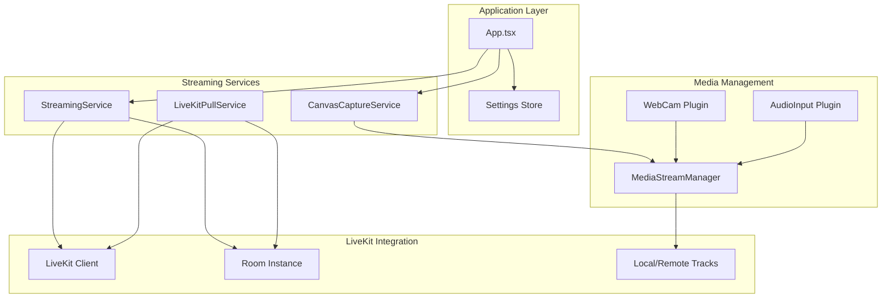

**Diagram sources**
- [streaming.ts:1-177](file://src/services/streaming.ts#L1-L177)
- [livekit-pull.ts:1-352](file://src/services/livekit-pull.ts#L1-L352)
- [canvas-capture.ts:1-48](file://src/services/canvas-capture.ts#L1-L48)
- [App.tsx:700-899](file://src/App.tsx#L700-L899)

**Section sources**
- [streaming.ts:1-177](file://src/services/streaming.ts#L1-L177)
- [livekit-pull.ts:1-352](file://src/services/livekit-pull.ts#L1-L352)
- [canvas-capture.ts:1-48](file://src/services/canvas-capture.ts#L1-L48)
- [App.tsx:700-899](file://src/App.tsx#L700-L899)

## Core Components
The StreamingService is the primary component responsible for managing LiveKit room connections and publishing media streams. It provides methods for connecting to rooms with authentication tokens, publishing video and audio tracks with configurable encoding parameters, and handling disconnections gracefully.

Key responsibilities include:
- Room connection management with authentication
- Video track publishing with configurable codecs and quality settings
- Audio track publishing and configuration
- Connection state monitoring and cleanup
- Integration with the Canvas capture service for screen sharing

**Section sources**
- [streaming.ts:6-177](file://src/services/streaming.ts#L6-L177)

## Architecture Overview
The streaming architecture follows a layered approach with clear separation of concerns between media capture, stream management, and LiveKit integration.

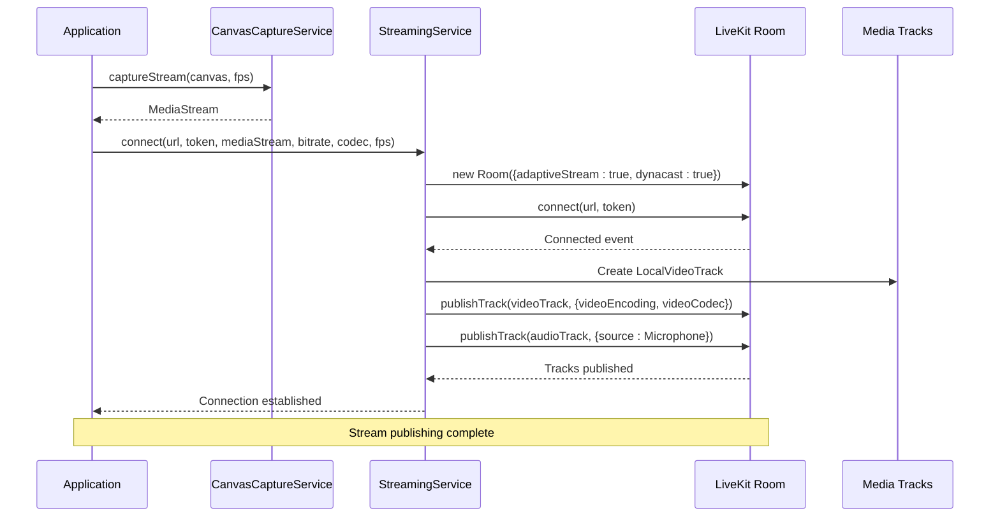

**Diagram sources**
- [streaming.ts:20-124](file://src/services/streaming.ts#L20-L124)
- [canvas-capture.ts:14-24](file://src/services/canvas-capture.ts#L14-L24)
- [App.tsx:726-788](file://src/App.tsx#L726-L788)

## Detailed Component Analysis

### StreamingService Implementation
The StreamingService provides a comprehensive interface for LiveKit integration with robust error handling and resource management.

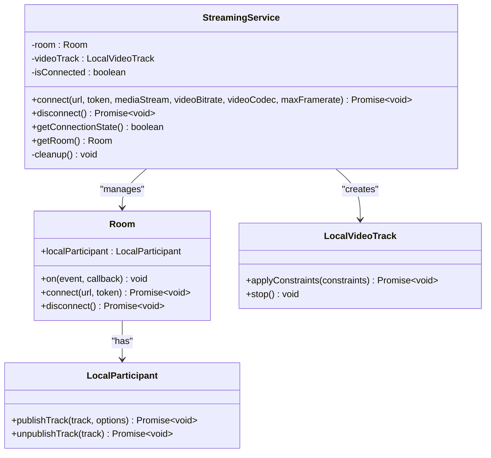

**Diagram sources**
- [streaming.ts:6-177](file://src/services/streaming.ts#L6-L177)

#### Connection Management
The service implements comprehensive room connection management with proper authentication and state handling:

- **Authentication**: Requires both server URL and access token for room connection
- **Connection Establishment**: Uses LiveKit's Room constructor with adaptive streaming enabled
- **State Monitoring**: Listens to Room events (Connected, Disconnected, Reconnecting, Reconnected)
- **Cleanup**: Properly cleans up resources on disconnection or errors

#### Video Track Publishing
Video publishing supports extensive configuration options:

- **Codecs**: H.264, H.265, VP8, VP9, AV1 with automatic codec selection
- **Bitrate Control**: Configurable maximum bitrate in kbps (default 5000)
- **Frame Rate**: Adjustable maximum frame rate (default 30 FPS)
- **Resolution**: Default 1920x1080 with configurable frame rates
- **Simulcast**: Disabled for higher quality streaming
- **Track Constraints**: Applies optimal constraints to improve encoding quality

#### Audio Track Publishing
Audio publishing includes automatic detection and publishing of audio tracks:

- **Automatic Detection**: Scans MediaStream for audio tracks
- **Source Configuration**: Sets track source to Microphone
- **Conditional Publishing**: Only publishes audio tracks when present

**Section sources**
- [streaming.ts:20-124](file://src/services/streaming.ts#L20-L124)

### LiveKitPullService Integration
The LiveKitPullService complements the StreamingService by providing subscription capabilities for receiving media streams from other participants.

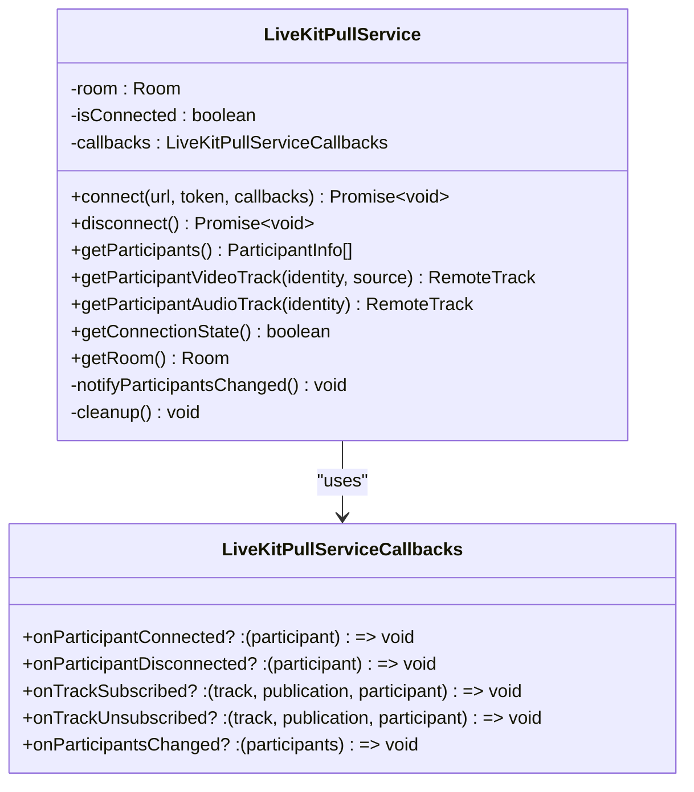

**Diagram sources**
- [livekit-pull.ts:49-352](file://src/services/livekit-pull.ts#L49-L352)

**Section sources**
- [livekit-pull.ts:49-352](file://src/services/livekit-pull.ts#L49-L352)

### Canvas Capture Integration
The CanvasCaptureService provides the foundation for screen sharing by capturing the canvas element as a MediaStream.

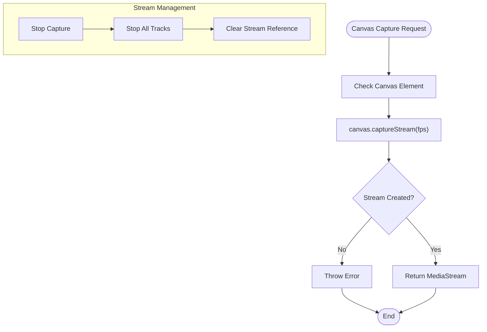

**Diagram sources**
- [canvas-capture.ts:14-44](file://src/services/canvas-capture.ts#L14-L44)

**Section sources**
- [canvas-capture.ts:5-48](file://src/services/canvas-capture.ts#L5-L48)

### Media Stream Management
The MediaStreamManager provides centralized management for all media streams used by plugins, ensuring proper resource handling and device enumeration.

**Section sources**
- [media-stream-manager.ts:39-323](file://src/services/media-stream-manager.ts#L39-L323)

## Architecture Overview

### Application Integration
The StreamingService integrates seamlessly with the main application through the App component, which orchestrates the entire streaming workflow.

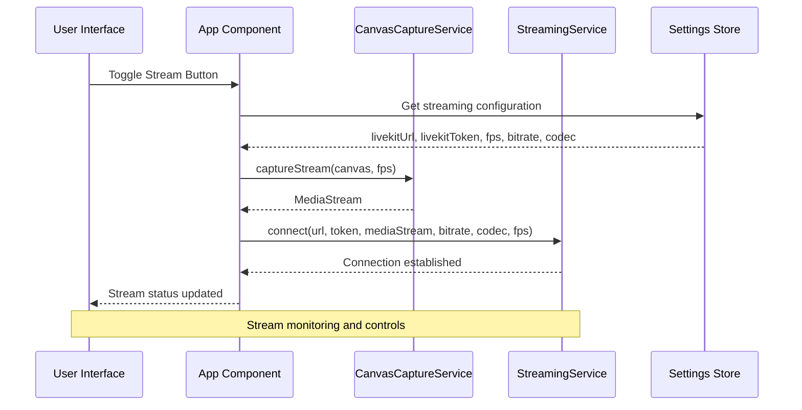

**Diagram sources**
- [App.tsx:726-788](file://src/App.tsx#L726-L788)
- [setting.ts:55-84](file://src/store/setting.ts#L55-L84)

### Stream Quality Adaptation
The StreamingService implements several mechanisms for quality adaptation and bandwidth management:

- **Adaptive Streaming**: Enabled through Room constructor configuration
- **Dynacast**: Automatic quality adaptation based on network conditions
- **Bitrate Control**: Configurable maximum bitrate for video streams
- **Frame Rate Limiting**: Maximum frame rate control for smooth streaming
- **Codec Selection**: Flexible codec choice for optimal compression

**Section sources**
- [streaming.ts:38-49](file://src/services/streaming.ts#L38-L49)
- [streaming.ts:92-101](file://src/services/streaming.ts#L92-L101)

## Detailed Component Analysis

### Room Connection Management
The StreamingService implements robust room connection management with comprehensive error handling and state monitoring.

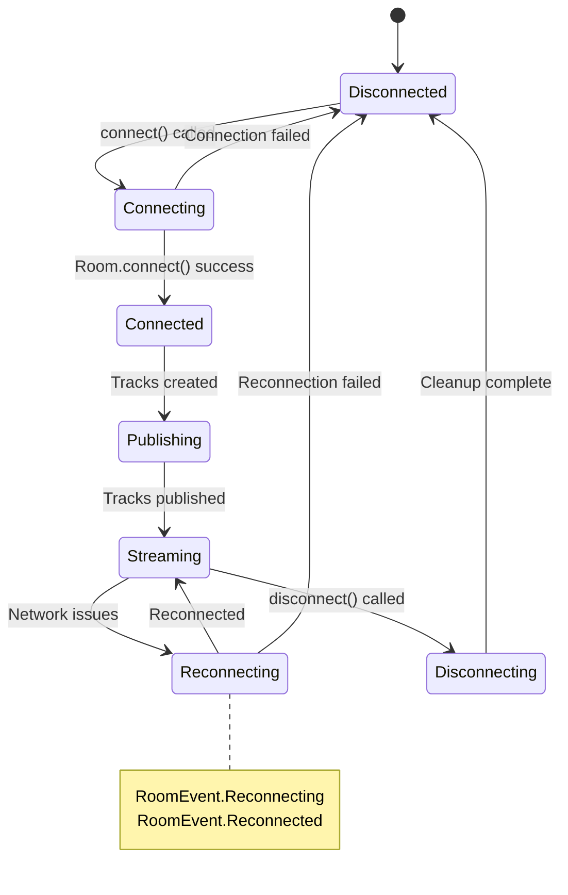

**Diagram sources**
- [streaming.ts:51-68](file://src/services/streaming.ts#L51-L68)

#### Authentication Flow
The service requires explicit authentication through URL and token parameters:

- **URL Validation**: Ensures LiveKit server URL is provided
- **Token Validation**: Requires valid access token for room access
- **Error Handling**: Throws descriptive errors for missing credentials

#### Connection State Management
The service maintains precise connection state tracking:

- **Connection Events**: Monitors Connected, Disconnected, Reconnecting, Reconnected events
- **State Flags**: Uses isConnected flag for external state queries
- **Room Instance**: Provides access to Room instance for advanced operations

**Section sources**
- [streaming.ts:28-68](file://src/services/streaming.ts#L28-L68)

### Video Track Publishing Configuration
Video publishing supports extensive configuration options for optimal streaming quality.

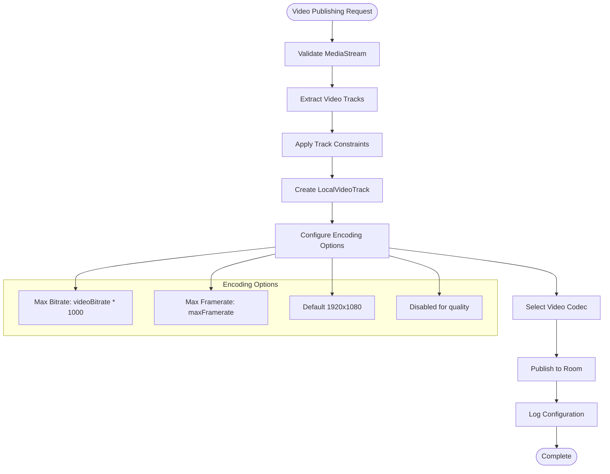

**Diagram sources**
- [streaming.ts:73-101](file://src/services/streaming.ts#L73-L101)

#### Codec Support Matrix
The service supports multiple video codecs with specific characteristics:

- **VP8**: Default codec, good balance of quality and compatibility
- **H.264**: Wide compatibility, efficient compression
- **H.265**: Advanced compression, lower bandwidth usage
- **VP9**: High quality, suitable for high-resolution content
- **AV1**: Latest codec, excellent compression efficiency

#### Quality Optimization Features
- **Simulcast Disabled**: Prioritizes quality over multiple resolution variants
- **Track Constraints**: Applies optimal resolution and frame rate constraints
- **Dynamic Adaptation**: Leverages LiveKit's adaptive streaming capabilities

**Section sources**
- [streaming.ts:82-101](file://src/services/streaming.ts#L82-L101)

### Audio Track Publishing
Audio publishing is handled automatically when audio tracks are present in the MediaStream.

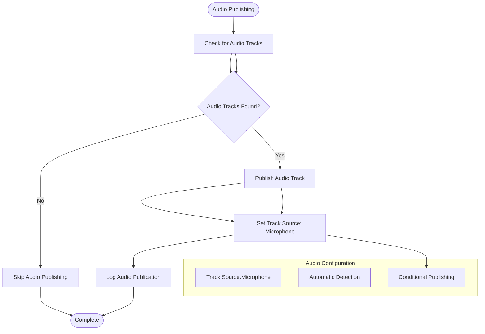

**Diagram sources**
- [streaming.ts:111-118](file://src/services/streaming.ts#L111-L118)

**Section sources**
- [streaming.ts:111-118](file://src/services/streaming.ts#L111-L118)

### Stream Quality Monitoring
The LiveKitStreamItem component provides real-time monitoring and display of participant streams.

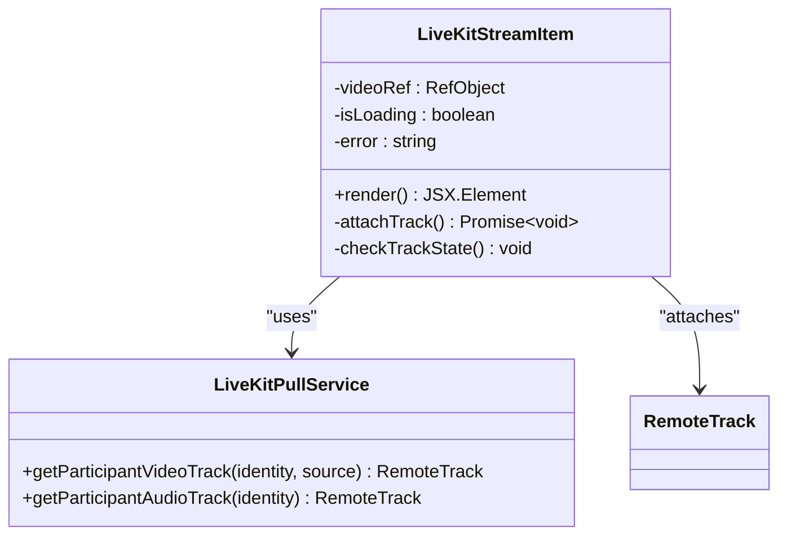

**Diagram sources**
- [livekit-stream-item.tsx:16-174](file://src/components/livekit-stream-item.tsx#L16-L174)

**Section sources**
- [livekit-stream-item.tsx:16-174](file://src/components/livekit-stream-item.tsx#L16-L174)

## Dependency Analysis

### External Dependencies
The project relies on several key external dependencies for LiveKit integration and media processing.

```mermaid
graph TB
subgraph "LiveKit Integration"
LiveKitClient[livekit-client@2.16.1]
StreamingService[StreamingService]
PullService[LiveKitPullService]
end
subgraph "Media Processing"
CanvasCapture[Canvas Capture]
MediaStreamManager[MediaStreamManager]
Plugins[Plugin System]
end
subgraph "UI Framework"
React[React 19.2.0]
Konva[Konva 10.0.12]
TailwindCSS[TailwindCSS 4.1.17]
end
LiveKitClient --> StreamingService
LiveKitClient --> PullService
CanvasCapture --> MediaStreamManager
Plugins --> MediaStreamManager
React --> StreamingService
React --> PullService
```

**Diagram sources**
- [package.json:50-77](file://package.json#L50-L77)

### Internal Dependencies
The StreamingService has clear internal dependencies and minimal coupling with other components.

**Section sources**
- [package.json:50-77](file://package.json#L50-L77)

## Performance Considerations

### Bandwidth Optimization
The StreamingService implements several strategies for bandwidth optimization:

- **Adaptive Streaming**: Automatically adjusts quality based on network conditions
- **Dynacast**: Enables dynamic quality adaptation for individual participants
- **Bitrate Control**: Configurable maximum bitrate prevents excessive bandwidth usage
- **Frame Rate Limiting**: Controls maximum frame rate to reduce bandwidth requirements
- **Codec Selection**: Chooses appropriate codecs for optimal compression

### Resource Management
Proper resource management ensures optimal performance and prevents memory leaks:

- **Track Cleanup**: Properly stops video tracks during disconnection
- **Stream Cleanup**: Stops all stream tracks when capturing ends
- **Event Cleanup**: Removes event listeners and intervals on component unmount
- **Memory Management**: Clears references to prevent memory leaks

### Network Optimization Strategies
The service incorporates several network optimization techniques:

- **Connection State Monitoring**: Tracks connection quality and adapts accordingly
- **Reconnection Logic**: Handles network interruptions gracefully
- **Quality Adaptation**: Automatically adjusts quality based on network conditions
- **Bandwidth Management**: Prevents network congestion through controlled publishing

## Troubleshooting Guide

### Common Connection Issues
Several common issues can occur during LiveKit streaming:

#### Authentication Failures
- **Missing Credentials**: Ensure both URL and token are provided
- **Invalid Token**: Verify token validity and expiration
- **Network Connectivity**: Check server accessibility and firewall settings

#### Stream Publishing Problems
- **No Video Track**: Verify MediaStream contains video tracks
- **Codec Compatibility**: Ensure selected codec is supported by clients
- **Bitrate Configuration**: Check bitrate values are within acceptable ranges

#### Connection State Issues
- **Reconnection Loops**: Monitor Room events for reconnection patterns
- **State Synchronization**: Use getConnectionState() for accurate status checks
- **Resource Cleanup**: Ensure proper cleanup on connection failures

### Error Handling Patterns
The StreamingService implements comprehensive error handling:

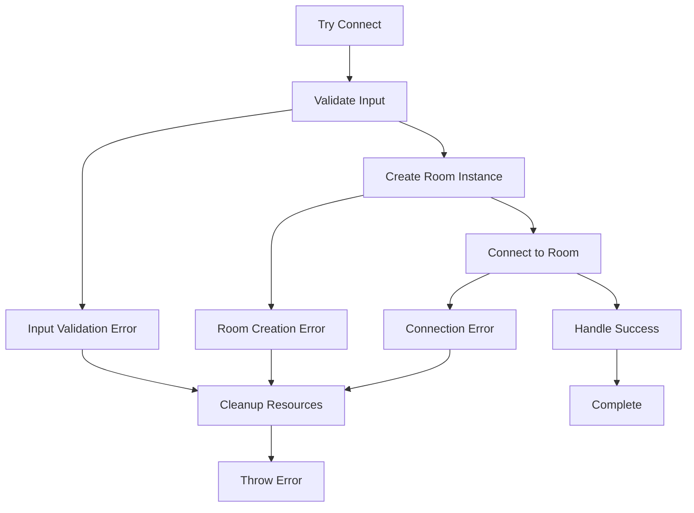

**Diagram sources**
- [streaming.ts:119-123](file://src/services/streaming.ts#L119-L123)

### Recovery Strategies
The service provides multiple recovery mechanisms:

- **Automatic Reconnection**: Leverages LiveKit's built-in reconnection
- **Resource Cleanup**: Ensures proper cleanup on failure
- **State Reset**: Resets connection state on errors
- **Graceful Degradation**: Continues operation with reduced functionality

**Section sources**
- [streaming.ts:119-123](file://src/services/streaming.ts#L119-L123)

## Conclusion
The StreamingService provides a robust and comprehensive solution for LiveKit integration in the LiveMixer application. It offers extensive configuration options for video and audio streaming, implements proper error handling and recovery mechanisms, and integrates seamlessly with the broader application architecture. The service's support for multiple codecs, configurable quality settings, and adaptive streaming capabilities makes it suitable for various streaming scenarios and network conditions.

Key strengths of the implementation include:
- Comprehensive codec support with flexible configuration
- Robust error handling and recovery mechanisms
- Integration with the MediaStreamManager for unified stream management
- Support for both publishing and subscribing to LiveKit streams
- Proper resource management and cleanup procedures

The architecture enables easy extension and customization while maintaining reliability and performance across different deployment scenarios.