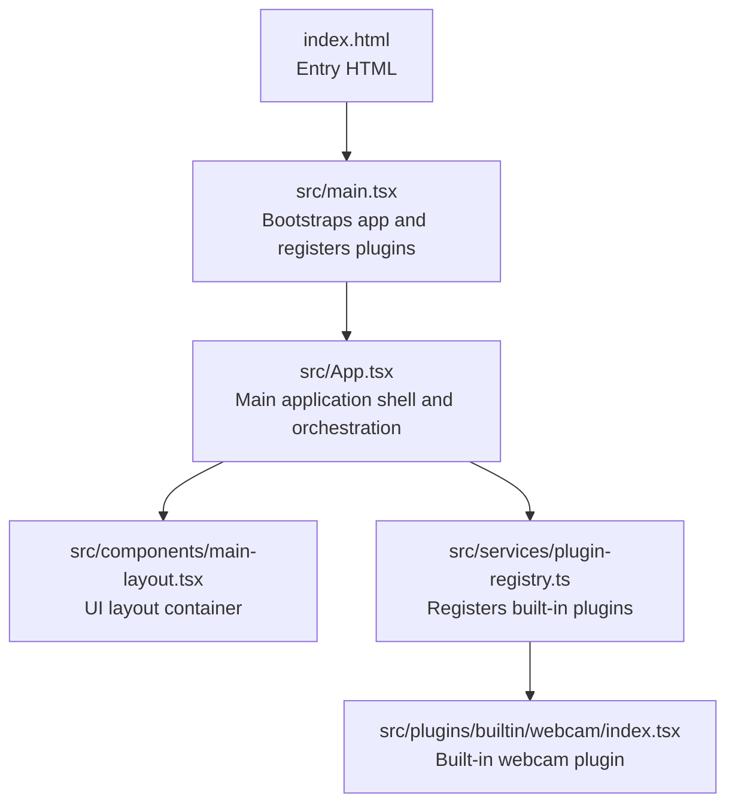
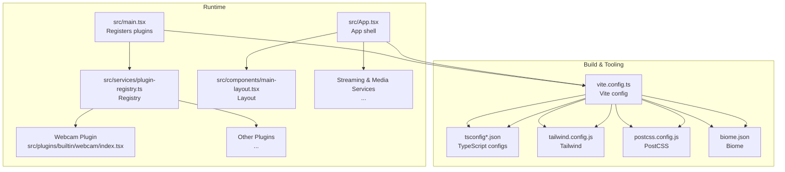
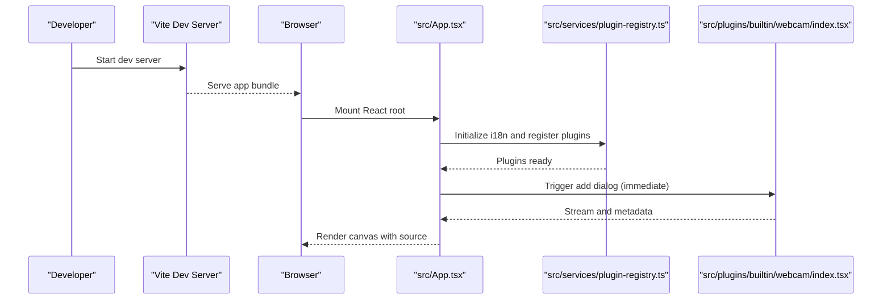
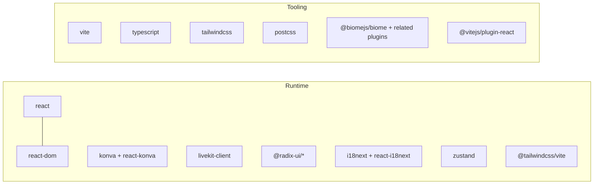

# Getting Started

<cite>
**Referenced Files in This Document**
- [package.json](file://package.json)
- [Readme.md](file://Readme.md)
- [vite.config.ts](file://vite.config.ts)
- [tsconfig.json](file://tsconfig.json)
- [tsconfig.app.json](file://tsconfig.app.json)
- [tsconfig.node.json](file://tsconfig.node.json)
- [index.html](file://index.html)
- [tailwind.config.js](file://tailwind.config.js)
- [postcss.config.js](file://postcss.config.js)
- [biome.json](file://biome.json)
- [src/main.tsx](file://src/main.tsx)
- [src/App.tsx](file://src/App.tsx)
- [src/components/main-layout.tsx](file://src/components/main-layout.tsx)
- [src/services/plugin-registry.ts](file://src/services/plugin-registry.ts)
- [src/plugins/builtin/webcam/index.tsx](file://src/plugins/builtin/webcam/index.tsx)
</cite>

## Table of Contents
1. [Introduction](#introduction)
2. [Project Structure](#project-structure)
3. [Core Components](#core-components)
4. [Architecture Overview](#architecture-overview)
5. [Detailed Component Analysis](#detailed-component-analysis)
6. [Dependency Analysis](#dependency-analysis)
7. [Performance Considerations](#performance-considerations)
8. [Troubleshooting Guide](#troubleshooting-guide)
9. [Conclusion](#conclusion)
10. [Appendices](#appendices)

## Introduction
This guide helps you set up and run LiveMixer Web locally for the first time. You will install prerequisites, prepare the development environment, run the project, and verify that everything works. The application is a React-based live video mixer and streaming studio powered by LiveKit and Konva, with a plugin architecture for media sources.

## Project Structure
LiveMixer Web is organized around a modern frontend stack:
- React 19 with TypeScript
- Vite for fast development and builds
- Tailwind CSS for styling
- Konva for 2D canvas rendering
- Biome for linting and formatting
- Built-in plugin system for media sources

**Diagram sources**
- [index.html:1-16](file://index.html#L1-L16)
- [src/main.tsx:1-29](file://src/main.tsx#L1-L29)
- [src/App.tsx:1-120](file://src/App.tsx#L1-L120)
- [src/components/main-layout.tsx:1-77](file://src/components/main-layout.tsx#L1-L77)
- [src/services/plugin-registry.ts:1-168](file://src/services/plugin-registry.ts#L1-L168)
- [src/plugins/builtin/webcam/index.tsx:1-120](file://src/plugins/builtin/webcam/index.tsx#L1-L120)

**Section sources**
- [index.html:1-16](file://index.html#L1-L16)
- [src/main.tsx:1-29](file://src/main.tsx#L1-L29)
- [src/App.tsx:1-120](file://src/App.tsx#L1-L120)
- [src/components/main-layout.tsx:1-77](file://src/components/main-layout.tsx#L1-L77)
- [src/services/plugin-registry.ts:1-168](file://src/services/plugin-registry.ts#L1-L168)
- [src/plugins/builtin/webcam/index.tsx:1-120](file://src/plugins/builtin/webcam/index.tsx#L1-L120)

## Core Components
- Application entry and plugin bootstrap:
  - The HTML entry loads the module script pointing to the React root.
  - The React root mounts the application and registers built-in plugins.
- Main application shell:
  - Initializes internationalization, manages scenes/items, and wires UI controls.
- Layout system:
  - Provides a responsive layout with toolbar, canvas, sidebars, and status areas.
- Plugin registry:
  - Central place for registering plugins and managing their lifecycle and i18n resources.
- Built-in webcam plugin:
  - Demonstrates a typical plugin with dialog integration, stream caching, and rendering.

**Section sources**
- [index.html:11-14](file://index.html#L11-L14)
- [src/main.tsx:14-28](file://src/main.tsx#L14-L28)
- [src/App.tsx:38-126](file://src/App.tsx#L38-L126)
- [src/components/main-layout.tsx:14-75](file://src/components/main-layout.tsx#L14-L75)
- [src/services/plugin-registry.ts:78-118](file://src/services/plugin-registry.ts#L78-L118)
- [src/plugins/builtin/webcam/index.tsx:110-234](file://src/plugins/builtin/webcam/index.tsx#L110-L234)

## Architecture Overview
The runtime architecture ties together the UI, plugin system, media services, and LiveKit streaming.

**Diagram sources**
- [src/main.tsx:14-28](file://src/main.tsx#L14-L28)
- [src/services/plugin-registry.ts:78-118](file://src/services/plugin-registry.ts#L78-L118)
- [src/plugins/builtin/webcam/index.tsx:110-234](file://src/plugins/builtin/webcam/index.tsx#L110-L234)
- [src/App.tsx:128-203](file://src/App.tsx#L128-L203)
- [src/components/main-layout.tsx:14-75](file://src/components/main-layout.tsx#L14-L75)
- [vite.config.ts:1-61](file://vite.config.ts#L1-L61)
- [tsconfig.json:1-8](file://tsconfig.json#L1-L8)
- [tsconfig.app.json:1-34](file://tsconfig.app.json#L1-L34)
- [tsconfig.node.json:1-27](file://tsconfig.node.json#L1-L27)
- [tailwind.config.js:1-7](file://tailwind.config.js#L1-L7)
- [postcss.config.js:1-7](file://postcss.config.js#L1-L7)
- [biome.json:1-58](file://biome.json#L1-L58)

## Detailed Component Analysis

### Prerequisites
- Node.js: Required to run the development server and build scripts. Use the latest LTS version recommended by the Node.js website.
- pnpm: Package manager used by the project. Install it globally if you haven't already.
- Browser: Modern browser with support for ES2022, WebRTC getUserMedia, and Canvas capture APIs. HTTPS or localhost is required for media device access.

Verification steps:
- Confirm Node.js and pnpm versions by running:
  - node --version
  - pnpm --version

**Section sources**
- [package.json:41-48](file://package.json#L41-L48)

### Installation
1. Clone the repository and navigate into the project directory.
2. Install dependencies using pnpm:
   - Command: pnpm install

What this does:
- Reads dependencies and devDependencies from package.json.
- Installs all required packages for development and production.

**Section sources**
- [Readme.md:5-9](file://Readme.md#L5-L9)
- [package.json:50-92](file://package.json#L50-L92)

### Development Environment Setup
- Start the Vite dev server:
  - Command: pnpm run dev
  - Opens http://localhost:5173 by default.
- TypeScript configuration:
  - Uses separate tsconfig.app.json and tsconfig.node.json for app and tooling.
  - Path aliases configured to @/* for clean imports.
- Tailwind CSS:
  - Tailwind is integrated via @tailwindcss/vite plugin.
  - Content scanning includes index.html and src/**/*.{js,ts,jsx,tsx}.
- PostCSS:
  - PostCSS is present; Tailwind is configured via Vite plugin.
- Biome:
  - Formatting and linting rules are defined in biome.json.

**Section sources**
- [Readme.md:11-15](file://Readme.md#L11-L15)
- [vite.config.ts:1-61](file://vite.config.ts#L1-L61)
- [tsconfig.json:1-8](file://tsconfig.json#L1-L8)
- [tsconfig.app.json:18-22](file://tsconfig.app.json#L18-L22)
- [tailwind.config.js:1-7](file://tailwind.config.js#L1-L7)
- [postcss.config.js:1-7](file://postcss.config.js#L1-L7)
- [biome.json:1-58](file://biome.json#L1-L58)

### First Run and Initial Configuration
1. Launch the dev server:
   - pnpm run dev
2. Open the application in your browser (http://localhost:5173).
3. The app initializes internationalization and renders the main layout with toolbar, canvas, and side panels.
4. To add a webcam source:
   - Use the toolbar or source panels to add a media source.
   - The webcam plugin registers an immediate add dialog and handles device selection and stream caching.
5. Basic usage examples:
   - Add a webcam source and adjust properties (volume, opacity, mirror).
   - Add text, images, or screen/window capture sources.
   - Configure scenes and reorder items.

**Diagram sources**
- [src/main.tsx:14-28](file://src/main.tsx#L14-L28)
- [src/services/plugin-registry.ts:78-118](file://src/services/plugin-registry.ts#L78-L118)
- [src/plugins/builtin/webcam/index.tsx:110-234](file://src/plugins/builtin/webcam/index.tsx#L110-L234)
- [src/App.tsx:279-335](file://src/App.tsx#L279-L335)

**Section sources**
- [src/main.tsx:14-28](file://src/main.tsx#L14-L28)
- [src/services/plugin-registry.ts:78-118](file://src/services/plugin-registry.ts#L78-L118)
- [src/plugins/builtin/webcam/index.tsx:110-234](file://src/plugins/builtin/webcam/index.tsx#L110-L234)
- [src/App.tsx:279-335](file://src/App.tsx#L279-L335)

### Building and Preview
- Build the application:
  - Command: pnpm run build
  - Compiles TypeScript and bundles with Vite.
- Preview the production build:
  - Command: pnpm run preview
  - Starts a local static server to serve the dist folder.

**Section sources**
- [package.json:42-48](file://package.json#L42-L48)
- [vite.config.ts:55-58](file://vite.config.ts#L55-L58)

## Dependency Analysis
The project’s runtime and build-time dependencies are declared in package.json. Key categories:
- Runtime dependencies: React, React DOM, Konva, LiveKit client, Radix UI primitives, i18n libraries, Zustand for state, and Tailwind integration.
- Build and tooling dependencies: Vite, TypeScript, Tailwind CSS, PostCSS, Biome, and React plugin for Vite.

**Diagram sources**
- [package.json:50-92](file://package.json#L50-L92)

**Section sources**
- [package.json:50-92](file://package.json#L50-L92)

## Performance Considerations
- Keep the development server running with hot module replacement for rapid iteration.
- Prefer lightweight plugin configurations during development to reduce canvas rendering overhead.
- Use the preview command to test production-like performance characteristics before deployment.
- Tailwind CSS is configured for Vite; avoid excessive utility usage that bloats CSS.

[No sources needed since this section provides general guidance]

## Troubleshooting Guide
Common setup and runtime issues:

- pnpm install fails
  - Ensure Node.js version meets project requirements.
  - Clear node_modules and reinstall if lockfile conflicts occur.
  - Verify network connectivity and registry access.

- Vite dev server does not start
  - Check port availability (default 5173).
  - Review terminal output for missing dependencies or configuration errors.

- Blank page or React root not found
  - Confirm index.html loads the module script pointing to src/main.tsx.
  - Ensure Vite config resolves @ alias to ./src.

- Cannot access camera/microphone
  - Use HTTPS or localhost for media device access.
  - Allow browser permissions when prompted.
  - Verify device selection in the webcam plugin dialog.

- Internationalization not applied
  - Ensure i18n engine initialization completes before rendering UI.
  - Check supported languages and resource registration in the plugin registry.

- Build errors
  - Run TypeScript checks and fix type errors.
  - Rebuild after resolving lint/formatting issues.

Verification steps:
- After running pnpm install, confirm dev server starts and the app renders the main layout.
- Add a webcam source and verify the video appears with correct properties.
- Toggle visibility and reordering of items to confirm interactivity.

**Section sources**
- [index.html:11-14](file://index.html#L11-L14)
- [vite.config.ts:10-16](file://vite.config.ts#L10-L16)
- [src/App.tsx:44-107](file://src/App.tsx#L44-L107)
- [src/services/plugin-registry.ts:13-27](file://src/services/plugin-registry.ts#L13-L27)
- [src/plugins/builtin/webcam/index.tsx:261-337](file://src/plugins/builtin/webcam/index.tsx#L261-L337)

## Conclusion
You now have the essentials to install, run, and verify LiveMixer Web locally. Explore the plugin architecture, add various media sources, and connect to LiveKit for streaming. Use the troubleshooting tips to resolve common issues quickly.

[No sources needed since this section summarizes without analyzing specific files]

## Appendices

### Appendix A: Quick Commands Reference
- Install dependencies: pnpm install
- Start dev server: pnpm run dev
- Build app: pnpm run build
- Preview build: pnpm run preview
- Lint and format: pnpm run lint and pnpm run format

**Section sources**
- [Readme.md:5-15](file://Readme.md#L5-L15)
- [package.json:41-48](file://package.json#L41-L48)