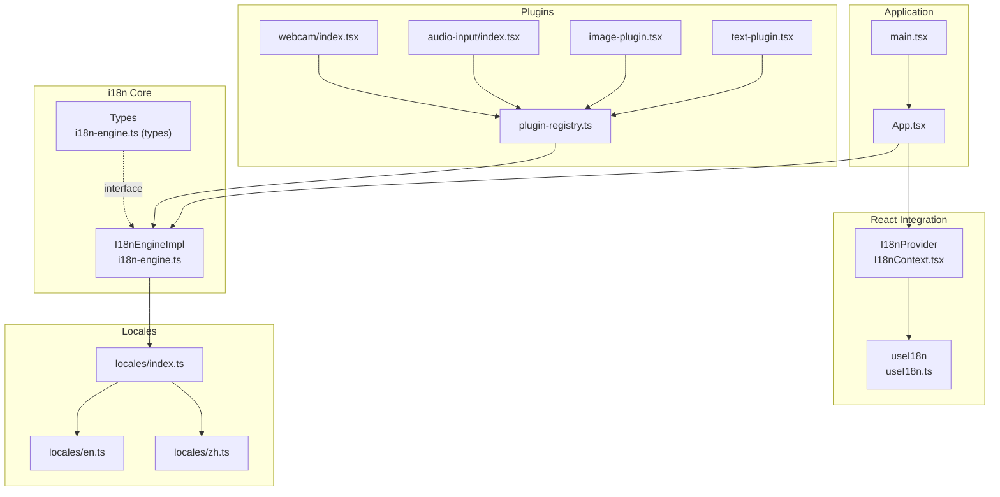
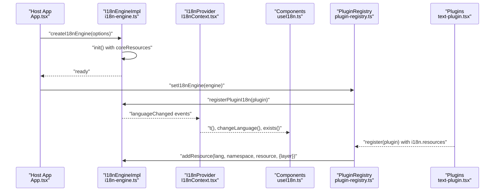
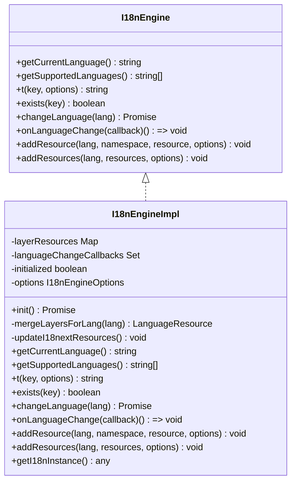
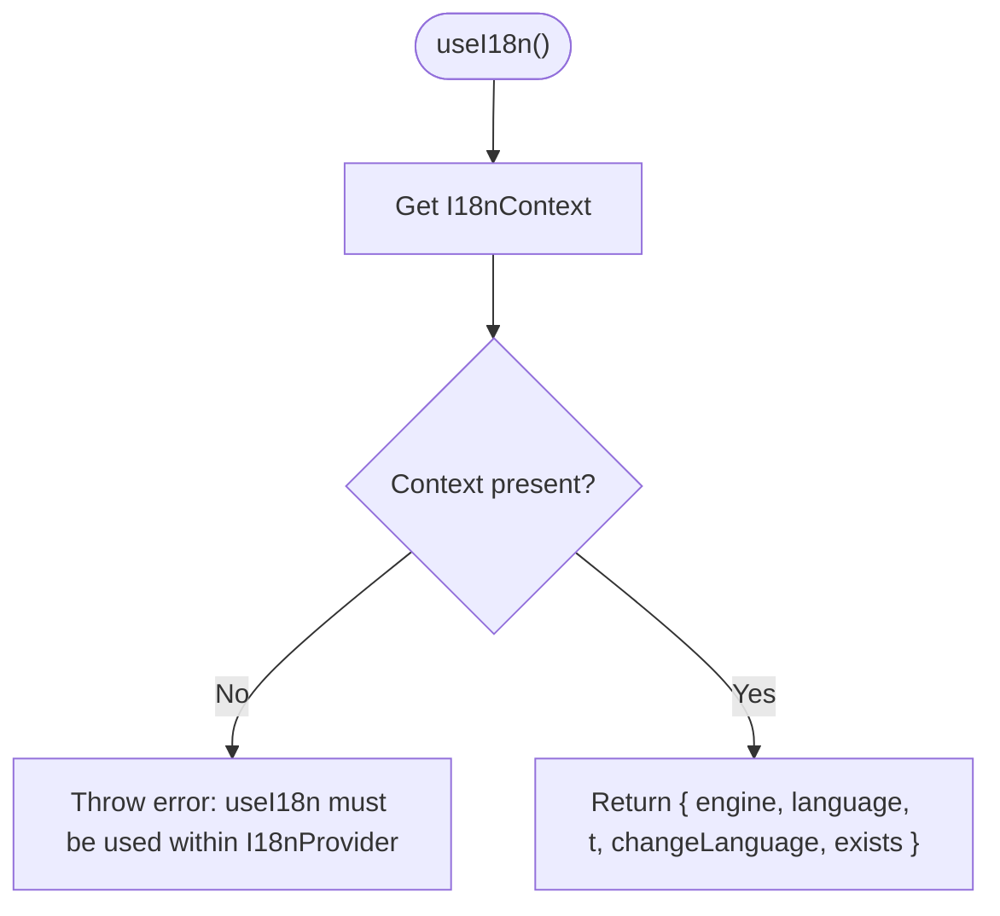
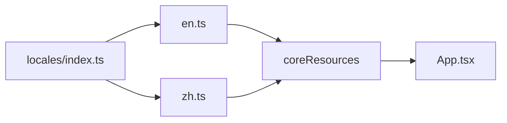
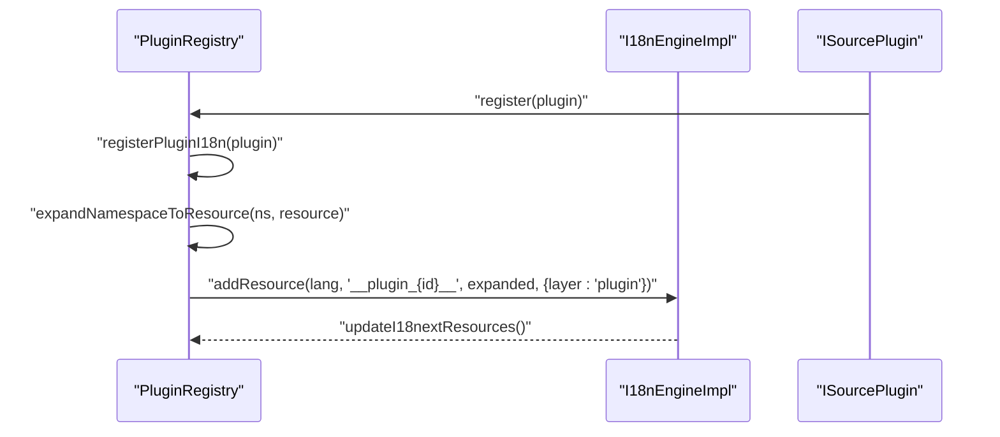
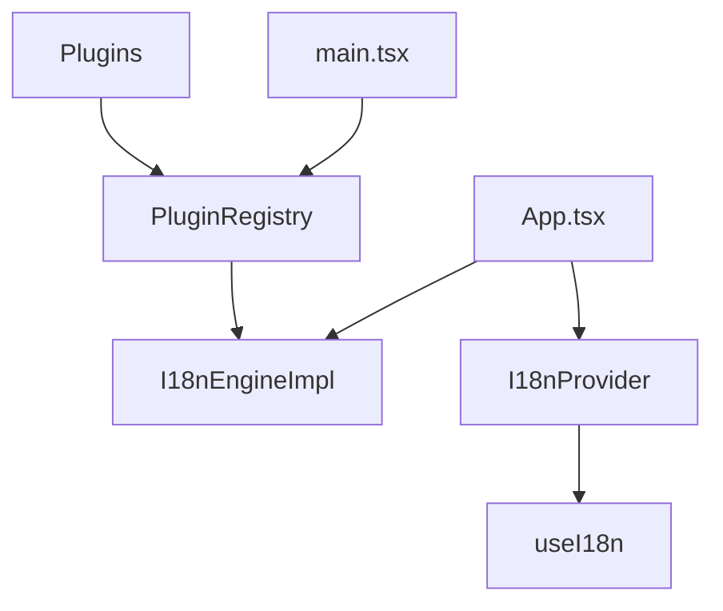

# Internationalization

<cite>
**Referenced Files in This Document**
- [i18n-engine.ts](file://src/services/i18n-engine.ts)
- [I18nContext.tsx](file://src/contexts/I18nContext.tsx)
- [useI18n.ts](file://src/hooks/useI18n.ts)
- [index.ts](file://src/locales/index.ts)
- [en.ts](file://src/locales/en.ts)
- [zh.ts](file://src/locales/zh.ts)
- [i18n-engine.ts (types)](file://src/types/i18n-engine.ts)
- [text-plugin.tsx](file://src/plugins/builtin/text-plugin.tsx)
- [image-plugin.tsx](file://src/plugins/builtin/image-plugin.tsx)
- [audio-input/index.tsx](file://src/plugins/builtin/audio-input/index.tsx)
- [webcam/index.tsx](file://src/plugins/builtin/webcam/index.tsx)
- [plugin-registry.ts](file://src/services/plugin-registry.ts)
- [plugin-context.ts](file://src/services/plugin-context.ts)
- [App.tsx](file://src/App.tsx)
- [main.tsx](file://src/main.tsx)
</cite>

## Table of Contents
1. [Introduction](#introduction)
2. [Project Structure](#project-structure)
3. [Core Components](#core-components)
4. [Architecture Overview](#architecture-overview)
5. [Detailed Component Analysis](#detailed-component-analysis)
6. [Dependency Analysis](#dependency-analysis)
7. [Performance Considerations](#performance-considerations)
8. [Troubleshooting Guide](#troubleshooting-guide)
9. [Conclusion](#conclusion)
10. [Appendices](#appendices)

## Introduction
This document explains LiveMixer Web’s internationalization (i18n) system. It covers the i18n-engine service, language resource loading, layered resource management, plugin localization support, and React integration. It also provides practical guidance for adding new languages, organizing translation resources, and handling dynamic content localization, along with cultural considerations.

## Project Structure
The i18n system is organized around:
- A core i18n engine built on top of i18next
- A React provider and hook for consuming translations
- Locale bundles for English and Chinese
- A plugin registry that registers plugin-specific i18n resources
- Plugin definitions that embed their own localized labels and dialogs

**Diagram sources**
- [App.tsx:38-126](file://src/App.tsx#L38-L126)
- [main.tsx:1-29](file://src/main.tsx#L1-L29)
- [i18n-engine.ts:42-241](file://src/services/i18n-engine.ts#L42-L241)
- [I18nContext.tsx:37-81](file://src/contexts/I18nContext.tsx#L37-L81)
- [useI18n.ts:8-16](file://src/hooks/useI18n.ts#L8-L16)
- [index.ts:1-15](file://src/locales/index.ts#L1-L15)
- [en.ts:1-346](file://src/locales/en.ts#L1-L346)
- [zh.ts:1-345](file://src/locales/zh.ts#L1-L345)
- [plugin-registry.ts:5-168](file://src/services/plugin-registry.ts#L5-L168)
- [text-plugin.tsx:53-76](file://src/plugins/builtin/text-plugin.tsx#L53-L76)
- [image-plugin.tsx:50-71](file://src/plugins/builtin/image-plugin.tsx#L50-L71)
- [audio-input/index.tsx:180-230](file://src/plugins/builtin/audio-input/index.tsx#L180-L230)
- [webcam/index.tsx:182-209](file://src/plugins/builtin/webcam/index.tsx#L182-L209)

**Section sources**
- [App.tsx:38-126](file://src/App.tsx#L38-L126)
- [main.tsx:1-29](file://src/main.tsx#L1-L29)
- [i18n-engine.ts:42-241](file://src/services/i18n-engine.ts#L42-L241)
- [I18nContext.tsx:37-81](file://src/contexts/I18nContext.tsx#L37-L81)
- [useI18n.ts:8-16](file://src/hooks/useI18n.ts#L8-L16)
- [index.ts:1-15](file://src/locales/index.ts#L1-L15)
- [en.ts:1-346](file://src/locales/en.ts#L1-L346)
- [zh.ts:1-345](file://src/locales/zh.ts#L1-L345)
- [plugin-registry.ts:5-168](file://src/services/plugin-registry.ts#L5-L168)
- [text-plugin.tsx:53-76](file://src/plugins/builtin/text-plugin.tsx#L53-L76)
- [image-plugin.tsx:50-71](file://src/plugins/builtin/image-plugin.tsx#L50-L71)
- [audio-input/index.tsx:180-230](file://src/plugins/builtin/audio-input/index.tsx#L180-L230)
- [webcam/index.tsx:182-209](file://src/plugins/builtin/webcam/index.tsx#L182-L209)

## Core Components
- I18nEngineImpl: Implements layered resource merging (core < plugin < host < user), exposes translate, change language, and resource registration APIs.
- I18nProvider: React provider that subscribes to engine language changes and exposes t, changeLanguage, and exists.
- useI18n: Hook to access the i18n context.
- Locales: English and Chinese language resources exported as coreResources and supportedLanguages.
- Plugin Registry: Registers plugin i18n resources under a unique namespace derived from plugin id.
- Plugins: Define i18n metadata with defaultLanguage, supportedLanguages, and resources keyed by language and namespace.

**Section sources**
- [i18n-engine.ts:42-241](file://src/services/i18n-engine.ts#L42-L241)
- [I18nContext.tsx:37-81](file://src/contexts/I18nContext.tsx#L37-L81)
- [useI18n.ts:8-16](file://src/hooks/useI18n.ts#L8-L16)
- [index.ts:1-15](file://src/locales/index.ts#L1-L15)
- [en.ts:1-346](file://src/locales/en.ts#L1-L346)
- [zh.ts:1-345](file://src/locales/zh.ts#L1-L345)
- [plugin-registry.ts:32-56](file://src/services/plugin-registry.ts#L32-L56)
- [text-plugin.tsx:53-76](file://src/plugins/builtin/text-plugin.tsx#L53-L76)

## Architecture Overview
The i18n pipeline initializes the engine with core resources, merges layered resources, and propagates language changes to React components via the provider. Plugins register their i18n resources lazily upon registration, ensuring dynamic content localization.

**Diagram sources**
- [App.tsx:44-107](file://src/App.tsx#L44-L107)
- [i18n-engine.ts:64-119](file://src/services/i18n-engine.ts#L64-L119)
- [I18nContext.tsx:40-60](file://src/contexts/I18nContext.tsx#L40-L60)
- [plugin-registry.ts:13-56](file://src/services/plugin-registry.ts#L13-L56)
- [text-plugin.tsx:53-76](file://src/plugins/builtin/text-plugin.tsx#L53-L76)

## Detailed Component Analysis

### I18nEngineImpl
- Purpose: Centralized i18n engine managing layered resources and exposing translation APIs.
- Layers: core < plugin < host < user, merged deterministically.
- Initialization: Accepts defaultLanguage, supportedLanguages, and coreResources; sets up i18next with language detection and persistence.
- Resource Management: addResource/addResources merge into layer storage; updateI18nextResources refreshes bundles and triggers re-render.
- Language Control: getCurrentLanguage, getSupportedLanguages, changeLanguage, onLanguageChange.

**Diagram sources**
- [i18n-engine.ts:12-241](file://src/services/i18n-engine.ts#L12-L241)
- [i18n-engine.ts (types):12-65](file://src/types/i18n-engine.ts#L12-L65)

**Section sources**
- [i18n-engine.ts:42-241](file://src/services/i18n-engine.ts#L42-L241)
- [i18n-engine.ts (types):6-65](file://src/types/i18n-engine.ts#L6-L65)

### I18nProvider and useI18n
- I18nProvider: Subscribes to engine language changes, exposes t, changeLanguage, exists, and current language.
- useI18n: Hook that throws if used outside provider, otherwise returns the context.

**Diagram sources**
- [useI18n.ts:8-16](file://src/hooks/useI18n.ts#L8-L16)
- [I18nContext.tsx:37-81](file://src/contexts/I18nContext.tsx#L37-L81)

**Section sources**
- [I18nContext.tsx:37-81](file://src/contexts/I18nContext.tsx#L37-L81)
- [useI18n.ts:8-16](file://src/hooks/useI18n.ts#L8-L16)

### Locale Structure (English and Chinese)
- Core resources are loaded from src/locales with English and Chinese bundles.
- Supported languages are exported as a tuple type and array for type-safe usage.
- Keys are hierarchical (e.g., toolbar.addScene) and support interpolation placeholders.

**Diagram sources**
- [index.ts:1-15](file://src/locales/index.ts#L1-L15)
- [en.ts:1-346](file://src/locales/en.ts#L1-L346)
- [zh.ts:1-345](file://src/locales/zh.ts#L1-L345)
- [App.tsx:66-70](file://src/App.tsx#L66-L70)

**Section sources**
- [index.ts:1-15](file://src/locales/index.ts#L1-L15)
- [en.ts:1-346](file://src/locales/en.ts#L1-L346)
- [zh.ts:1-345](file://src/locales/zh.ts#L1-L345)

### Plugin Localization Support
- Plugins define i18n metadata with defaultLanguage, supportedLanguages, and resources keyed by language and namespace.
- The registry expands dot-notation namespaces into nested objects and registers them under a unique plugin namespace.
- Plugins can localize labels, dialogs, and other UI strings using translation keys.

**Diagram sources**
- [plugin-registry.ts:32-76](file://src/services/plugin-registry.ts#L32-L76)
- [i18n-engine.ts:188-221](file://src/services/i18n-engine.ts#L188-L221)
- [text-plugin.tsx:53-76](file://src/plugins/builtin/text-plugin.tsx#L53-L76)
- [image-plugin.tsx:50-71](file://src/plugins/builtin/image-plugin.tsx#L50-L71)
- [audio-input/index.tsx:180-230](file://src/plugins/builtin/audio-input/index.tsx#L180-L230)
- [webcam/index.tsx:182-209](file://src/plugins/builtin/webcam/index.tsx#L182-L209)

**Section sources**
- [plugin-registry.ts:32-76](file://src/services/plugin-registry.ts#L32-L76)
- [text-plugin.tsx:53-76](file://src/plugins/builtin/text-plugin.tsx#L53-L76)
- [image-plugin.tsx:50-71](file://src/plugins/builtin/image-plugin.tsx#L50-L71)
- [audio-input/index.tsx:180-230](file://src/plugins/builtin/audio-input/index.tsx#L180-L230)
- [webcam/index.tsx:182-209](file://src/plugins/builtin/webcam/index.tsx#L182-L209)

### Using I18n in Components and Plugins
- Components import useI18n and call t with keys and optional interpolation values.
- Plugins reference translation keys for labels and dialogs, enabling localized UI per plugin.

Examples of usage locations:
- Scene creation and messages use localized strings for names and warnings.
- Property panel defaults and plugin-specific labels leverage t.

**Section sources**
- [App.tsx:212-229](file://src/App.tsx#L212-L229)
- [App.tsx:422-422](file://src/App.tsx#L422-L422)
- [text-plugin.tsx:34-52](file://src/plugins/builtin/text-plugin.tsx#L34-L52)
- [image-plugin.tsx:37-49](file://src/plugins/builtin/image-plugin.tsx#L37-L49)
- [audio-input/index.tsx:154-179](file://src/plugins/builtin/audio-input/index.tsx#L154-L179)
- [webcam/index.tsx:147-181](file://src/plugins/builtin/webcam/index.tsx#L147-L181)

## Dependency Analysis
- App.tsx initializes the engine, applies host and user overrides, and wires the provider.
- main.tsx registers built-in plugins before mounting the app.
- plugin-registry.ts depends on i18n-engine for resource registration.
- Plugins depend on the registry and rely on namespaces to avoid collisions.

**Diagram sources**
- [App.tsx:44-107](file://src/App.tsx#L44-L107)
- [main.tsx:14-20](file://src/main.tsx#L14-L20)
- [plugin-registry.ts:13-20](file://src/services/plugin-registry.ts#L13-L20)
- [i18n-engine.ts:42-58](file://src/services/i18n-engine.ts#L42-L58)

**Section sources**
- [App.tsx:44-107](file://src/App.tsx#L44-L107)
- [main.tsx:14-20](file://src/main.tsx#L14-L20)
- [plugin-registry.ts:13-20](file://src/services/plugin-registry.ts#L13-L20)

## Performance Considerations
- Layered merging occurs on-demand when resources change; keep plugin namespaces concise to minimize merge overhead.
- Interpolation is handled by i18next; avoid excessive nested interpolations in hot paths.
- Persisted language preferences reduce repeated detection work.

## Troubleshooting Guide
- useI18n used outside provider: Ensure components are wrapped in I18nProvider.
- Missing translation keys: Use engine.exists to guard keys; fall back to a default key or value.
- Language not changing: Verify engine.changeLanguage resolves and that provider subscribes to languageChanged.
- Plugin keys not found: Confirm plugin i18n.resources are registered under the correct language and namespace.

**Section sources**
- [useI18n.ts:11-13](file://src/hooks/useI18n.ts#L11-L13)
- [i18n-engine.ts:173-179](file://src/services/i18n-engine.ts#L173-L179)
- [I18nContext.tsx:40-60](file://src/contexts/I18nContext.tsx#L40-L60)
- [plugin-registry.ts:32-56](file://src/services/plugin-registry.ts#L32-L56)

## Conclusion
LiveMixer Web’s i18n system combines a robust layered engine with React integration and plugin-aware resource registration. English and Chinese are supported out of the box, with straightforward extension points for additional languages and dynamic content localization.

## Appendices

### Adding a New Language
- Create a new locale file similar to en.ts or zh.ts.
- Export it from locales/index.ts and include it in supportedLanguages.
- Initialize the engine with the new language as default or supported.

**Section sources**
- [index.ts:1-15](file://src/locales/index.ts#L1-L15)
- [en.ts:1-346](file://src/locales/en.ts#L1-L346)
- [zh.ts:1-345](file://src/locales/zh.ts#L1-L345)
- [App.tsx:66-70](file://src/App.tsx#L66-L70)

### Organizing Translation Resources
- Keep keys hierarchical and descriptive (e.g., toolbar.addSource).
- Use interpolation placeholders consistently for dynamic values.
- Prefer namespaces for plugins to avoid collisions.

**Section sources**
- [i18n-engine.ts (types):89-93](file://src/types/i18n-engine.ts#L89-L93)
- [plugin-registry.ts:40-51](file://src/services/plugin-registry.ts#L40-L51)

### Dynamic Content Localization
- Use t with interpolation for runtime values.
- For plugin dialogs, define localized strings in plugin i18n.resources and reference them via labelKey and dialog keys.

**Section sources**
- [App.tsx:212-229](file://src/App.tsx#L212-L229)
- [text-plugin.tsx:34-52](file://src/plugins/builtin/text-plugin.tsx#L34-L52)
- [audio-input/index.tsx:192-204](file://src/plugins/builtin/audio-input/index.tsx#L192-L204)

### Pluralization, Date/Time, and Cultural Considerations
- The current implementation relies on i18next interpolation for placeholders. For pluralization, consider i18next plurals features and configure pluralRules accordingly.
- For date/time formatting, use i18next with ICU or a dedicated library; ensure locales are configured for proper formatting and number separators.

[No sources needed since this section provides general guidance]