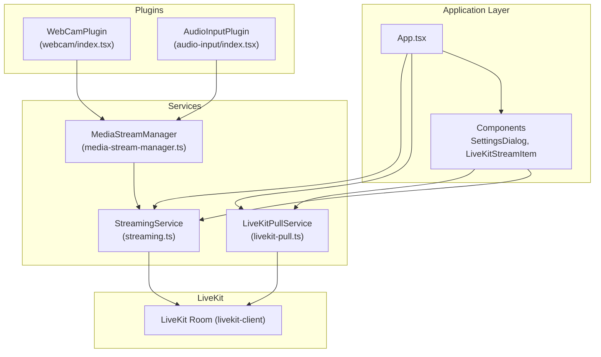
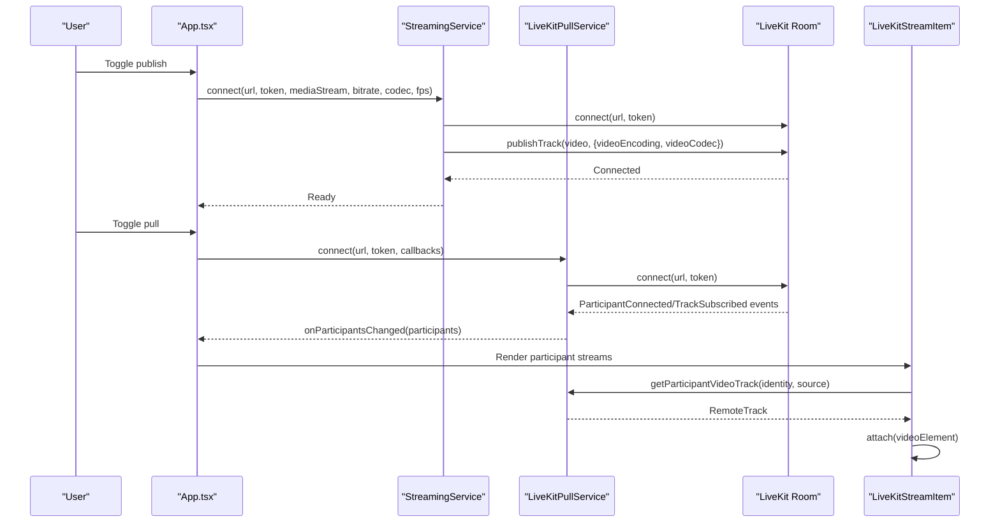
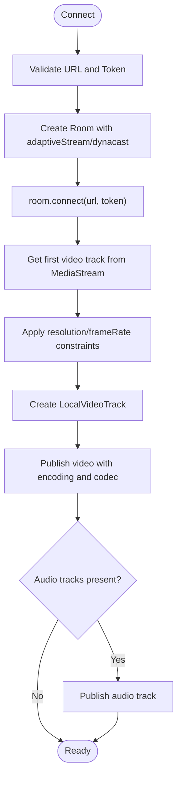
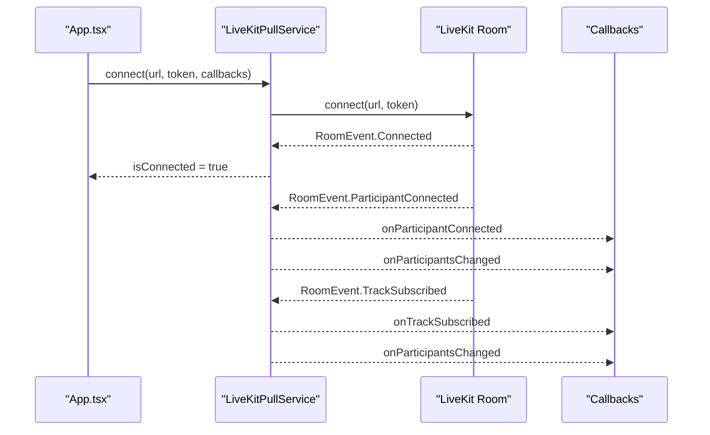
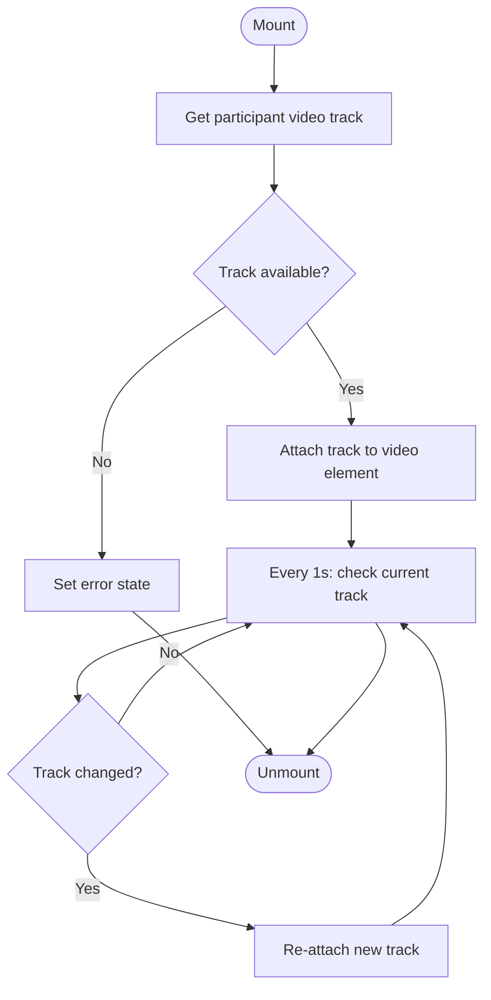
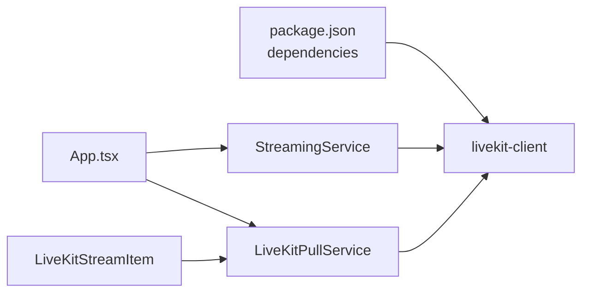

# Live Streaming Integration

<cite>
**Referenced Files in This Document**
- [livekit-pull.ts](file://src/services/livekit-pull.ts)
- [streaming.ts](file://src/services/streaming.ts)
- [livekit-stream-item.tsx](file://src/components/livekit-stream-item.tsx)
- [media-stream-manager.ts](file://src/services/media-stream-manager.ts)
- [webcam/index.tsx](file://src/plugins/builtin/webcam/index.tsx)
- [audio-input/index.tsx](file://src/plugins/builtin/audio-input/index.tsx)
- [settings-dialog.tsx](file://src/components/settings-dialog.tsx)
- [setting.ts](file://src/store/setting.ts)
- [App.tsx](file://src/App.tsx)
- [package.json](file://package.json)
</cite>

## Table of Contents
1. [Introduction](#introduction)
2. [Project Structure](#project-structure)
3. [Core Components](#core-components)
4. [Architecture Overview](#architecture-overview)
5. [Detailed Component Analysis](#detailed-component-analysis)
6. [Dependency Analysis](#dependency-analysis)
7. [Performance Considerations](#performance-considerations)
8. [Troubleshooting Guide](#troubleshooting-guide)
9. [Security Considerations](#security-considerations)
10. [Best Practices for Production](#best-practices-for-production)
11. [Conclusion](#conclusion)

## Introduction
This document explains LiveMixer Web's LiveKit streaming integration. It covers room setup, authentication, publishing and pulling workflows, participant consumption, connection management, error handling, reconnection logic, and production best practices. The integration leverages two primary services: a publishing service for pushing local canvas streams to LiveKit and a pulling service for subscribing to and displaying remote participant streams.

## Project Structure
LiveMixer Web organizes LiveKit-related functionality across services, components, and settings:

- Services
  - Publishing: [streaming.ts](file://src/services/streaming.ts)
  - Pulling: [livekit-pull.ts](file://src/services/livekit-pull.ts)
  - Media stream management: [media-stream-manager.ts](file://src/services/media-stream-manager.ts)
- UI Components
  - LiveKit stream display: [livekit-stream-item.tsx](file://src/components/livekit-stream-item.tsx)
  - Settings dialog: [settings-dialog.tsx](file://src/components/settings-dialog.tsx)
- Plugins
  - Webcam input: [webcam/index.tsx](file://src/plugins/builtin/webcam/index.tsx)
  - Audio input: [audio-input/index.tsx](file://src/plugins/builtin/audio-input/index.tsx)
- Application orchestration
  - App integration and controls: [App.tsx](file://src/App.tsx)
  - Settings store: [setting.ts](file://src/store/setting.ts)
- Dependencies
  - LiveKit client library: [package.json](file://package.json)

**Diagram sources**
- [App.tsx:725-824](file://src/App.tsx#L725-L824)
- [streaming.ts:6-177](file://src/services/streaming.ts#L6-L177)
- [livekit-pull.ts:49-352](file://src/services/livekit-pull.ts#L49-L352)
- [media-stream-manager.ts:39-323](file://src/services/media-stream-manager.ts#L39-L323)
- [livekit-stream-item.tsx:1-174](file://src/components/livekit-stream-item.tsx#L1-L174)
- [webcam/index.tsx:110-478](file://src/plugins/builtin/webcam/index.tsx#L110-L478)
- [audio-input/index.tsx:105-555](file://src/plugins/builtin/audio-input/index.tsx#L105-L555)

**Section sources**
- [App.tsx:725-824](file://src/App.tsx#L725-L824)
- [streaming.ts:6-177](file://src/services/streaming.ts#L6-L177)
- [livekit-pull.ts:49-352](file://src/services/livekit-pull.ts#L49-L352)
- [media-stream-manager.ts:39-323](file://src/services/media-stream-manager.ts#L39-L323)
- [livekit-stream-item.tsx:1-174](file://src/components/livekit-stream-item.tsx#L1-L174)
- [webcam/index.tsx:110-478](file://src/plugins/builtin/webcam/index.tsx#L110-L478)
- [audio-input/index.tsx:105-555](file://src/plugins/builtin/audio-input/index.tsx#L105-L555)
- [settings-dialog.tsx:217-320](file://src/components/settings-dialog.tsx#L217-L320)
- [setting.ts:1-139](file://src/store/setting.ts#L1-L139)
- [package.json:50-76](file://package.json#L50-L76)

## Core Components
- StreamingService (publishing)
  - Manages connection to a LiveKit room and publishes a MediaStream as a video track with configurable encoding, bitrate, and framerate.
  - Supports optional audio track publishing.
- LiveKitPullService (pulling)
  - Manages connection to a LiveKit room and subscribes to remote participant tracks (camera/screen share).
  - Provides participant state and track retrieval APIs.
- LiveKitStreamItem (UI)
  - Renders a participant's camera or screen share track in a video element with loading/error states and periodic re-attachment logic.
- MediaStreamManager (utility)
  - Centralized stream management for plugins and the app, including device enumeration and stream lifecycle.
- Settings and Store
  - Persistent and sensitive settings for LiveKit URLs/tokens and output encoding/bitrate/fps.
- Plugins
  - Webcam and Audio input plugins provide device selection and stream caching for publishing.

**Section sources**
- [streaming.ts:6-177](file://src/services/streaming.ts#L6-L177)
- [livekit-pull.ts:49-352](file://src/services/livekit-pull.ts#L49-L352)
- [livekit-stream-item.tsx:1-174](file://src/components/livekit-stream-item.tsx#L1-L174)
- [media-stream-manager.ts:39-323](file://src/services/media-stream-manager.ts#L39-L323)
- [settings-dialog.tsx:217-320](file://src/components/settings-dialog.tsx#L217-L320)
- [setting.ts:1-139](file://src/store/setting.ts#L1-L139)
- [webcam/index.tsx:110-478](file://src/plugins/builtin/webcam/index.tsx#L110-L478)
- [audio-input/index.tsx:105-555](file://src/plugins/builtin/audio-input/index.tsx#L105-L555)

## Architecture Overview
The LiveKit integration follows a clear separation of concerns:
- App orchestrates publishing/pulling based on user actions and settings.
- Services encapsulate LiveKit room connections and track lifecycle.
- Components consume service APIs to render participant streams.
- Plugins provide input streams and device management.

**Diagram sources**
- [App.tsx:725-824](file://src/App.tsx#L725-L824)
- [streaming.ts:20-124](file://src/services/streaming.ts#L20-L124)
- [livekit-pull.ts:60-179](file://src/services/livekit-pull.ts#L60-L179)
- [livekit-stream-item.tsx:26-108](file://src/components/livekit-stream-item.tsx#L26-L108)

## Detailed Component Analysis

### Publishing Workflow (StreamingService)
- Room configuration
  - Enables adaptive streaming and dynacast for bandwidth-efficient distribution.
  - Sets default video capture resolution and framerate.
- Track publishing
  - Extracts the first video track from the provided MediaStream.
  - Applies constraints to match configured resolution/framerate.
  - Creates a LocalVideoTrack and publishes with configurable video encoding and codec.
  - Optionally publishes an audio track if present.
- Connection lifecycle
  - Emits connection state events and toggles internal state.
  - On errors, cleans up and rethrows to allow UI handling.

**Diagram sources**
- [streaming.ts:20-124](file://src/services/streaming.ts#L20-L124)

**Section sources**
- [streaming.ts:20-124](file://src/services/streaming.ts#L20-L124)

### Pulling Workflow (LiveKitPullService)
- Room configuration
  - Enables adaptive streaming and dynacast for efficient consumption.
- Event handling
  - Listens for participant join/leave, track subscribed/unsubscribed, and mute/unmute events.
  - Updates participant state and notifies subscribers.
- Participant and track access
  - Provides participant lists and getters for camera/screen share and microphone tracks by identity.
- Connection lifecycle
  - Emits reconnecting/reconnected events and manages internal state.

**Diagram sources**
- [livekit-pull.ts:60-179](file://src/services/livekit-pull.ts#L60-L179)

**Section sources**
- [livekit-pull.ts:60-179](file://src/services/livekit-pull.ts#L60-L179)

### Consuming Participant Streams (LiveKitStreamItem)
- Retrieves a participant's camera or screen share track by identity.
- Attaches the track to a video element and handles loading/error states.
- Periodically checks for track changes and re-attaches if necessary.
- Detaches on unmount to prevent leaks.

**Diagram sources**
- [livekit-stream-item.tsx:26-108](file://src/components/livekit-stream-item.tsx#L26-L108)

**Section sources**
- [livekit-stream-item.tsx:26-108](file://src/components/livekit-stream-item.tsx#L26-L108)

### Media Stream Management (MediaStreamManager)
- Centralizes stream registration, updates, and removal.
- Provides event listeners for stream changes.
- Enumerates and requests device permissions when needed.
- Supports pending stream exchange between dialogs and the app.

**Section sources**
- [media-stream-manager.ts:39-323](file://src/services/media-stream-manager.ts#L39-L323)

### Settings and Configuration
- Settings dialog exposes:
  - LiveKit server URL and token for publishing and pulling.
  - Output bitrate, encoder (H.264/H.265/VP8/VP9/AV1), and FPS.
- Store persists non-sensitive settings and keeps tokens in memory.

**Section sources**
- [settings-dialog.tsx:217-320](file://src/components/settings-dialog.tsx#L217-L320)
- [setting.ts:1-139](file://src/store/setting.ts#L1-L139)

### Plugins for Input Streams
- Webcam plugin
  - Device selection and stream caching.
  - Mirrors, opacity, and volume controls.
- Audio input plugin
  - Microphone device selection with audio level monitoring.
  - Mute/volume controls and stream caching.

**Section sources**
- [webcam/index.tsx:110-478](file://src/plugins/builtin/webcam/index.tsx#L110-L478)
- [audio-input/index.tsx:105-555](file://src/plugins/builtin/audio-input/index.tsx#L105-L555)

## Dependency Analysis
LiveMixer Web depends on the LiveKit client library for all RTC operations. The application integrates services and components around this dependency.

**Diagram sources**
- [package.json:50-76](file://package.json#L50-L76)
- [streaming.ts](file://src/services/streaming.ts#L1)
- [livekit-pull.ts](file://src/services/livekit-pull.ts#L1)

**Section sources**
- [package.json:50-76](file://package.json#L50-L76)
- [streaming.ts](file://src/services/streaming.ts#L1)
- [livekit-pull.ts](file://src/services/livekit-pull.ts#L1)

## Performance Considerations
- Adaptive streaming and dynacast
  - Both services enable adaptiveStream and dynacast to optimize bandwidth and CPU usage.
- Encoding and bitrate control
  - Use the settings dialog to choose appropriate codecs and bitrates for your network conditions.
  - Lower bitrate and frame rate reduce CPU load and improve stability on constrained devices.
- Simulcast
  - Publishing disables simulcast for higher-quality single-layer streams; consider enabling it for diverse viewer networks.
- Frame rate and resolution
  - Match FPS/resolution to the LiveKit room’s defaults and downstream capabilities.
- Track constraints
  - Applying constraints ensures the encoder targets desired resolution and frame rate.

[No sources needed since this section provides general guidance]

## Troubleshooting Guide
Common issues and resolutions:

- Cannot connect to LiveKit
  - Verify server URL and token in settings.
  - Check network connectivity and CORS/firewall rules.
  - Review console logs for connection/reconnection events.
- No video/audio published
  - Ensure the MediaStream has at least one video track.
  - Confirm the canvas is continuously rendering during capture.
- Stream not appearing in pull view
  - Confirm the pull service is connected and receiving TrackSubscribed events.
  - Verify participant identity and source selection (camera vs screen share).
- Frequent reconnections
  - Monitor reconnection events and stabilize network conditions.
  - Reduce bitrate/FPS to minimize bandwidth pressure.
- Audio/video desync or stutter
  - Lower FPS or bitrate.
  - Use appropriate codec (VP8/VP9/AV1) depending on device support.
- Device permissions blocked
  - Re-grant permissions for camera/microphone.
  - Use the MediaStreamManager device enumeration helpers to diagnose.

**Section sources**
- [streaming.ts:119-123](file://src/services/streaming.ts#L119-L123)
- [livekit-pull.ts:174-178](file://src/services/livekit-pull.ts#L174-L178)
- [livekit-stream-item.tsx:64-70](file://src/components/livekit-stream-item.tsx#L64-L70)
- [media-stream-manager.ts:147-257](file://src/services/media-stream-manager.ts#L147-L257)

## Security Considerations
- Token handling
  - Tokens are stored in memory and not persisted; avoid exposing them in logs or URLs.
- Transport security
  - Use secure WebSocket endpoints (wss://) for LiveKit servers.
- Least privilege
  - Generate tokens with minimal required permissions and short lifetimes.
- Input sources
  - Validate and sanitize device selections; avoid hardcoding device IDs in production builds.
- Cross-origin
  - Ensure the web app is served over HTTPS and LiveKit server allows your origin.

[No sources needed since this section provides general guidance]

## Best Practices for Production
- Network resilience
  - Enable adaptive streaming and dynacast; monitor reconnection events and adjust bitrate dynamically.
- Codec selection
  - Prefer VP8 for broad compatibility; use VP9/AV1 for higher quality on capable clients.
- Bitrate and FPS tuning
  - Start conservative (e.g., 30 FPS, 5000 kbps) and increase gradually based on network tests.
- Resource management
  - Always detach video elements and unpublish tracks on unmount or disconnect.
- Monitoring
  - Log connection states, track events, and errors for diagnostics.
- UI feedback
  - Provide clear loading/error states for stream attachment and participant availability.

[No sources needed since this section provides general guidance]

## Conclusion
LiveMixer Web’s LiveKit integration provides a robust foundation for publishing and consuming real-time streams. By leveraging dedicated services, a centralized stream manager, and configurable settings, applications can achieve reliable, high-quality streaming with strong error handling and performance controls. For production deployments, prioritize secure transport, minimal token exposure, adaptive encoding, and continuous monitoring.