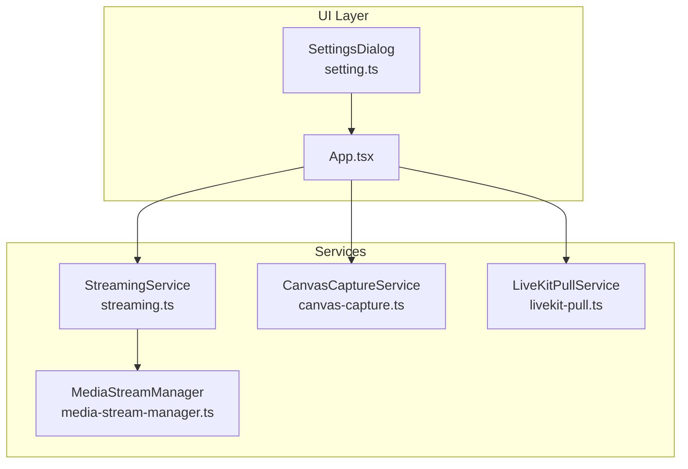
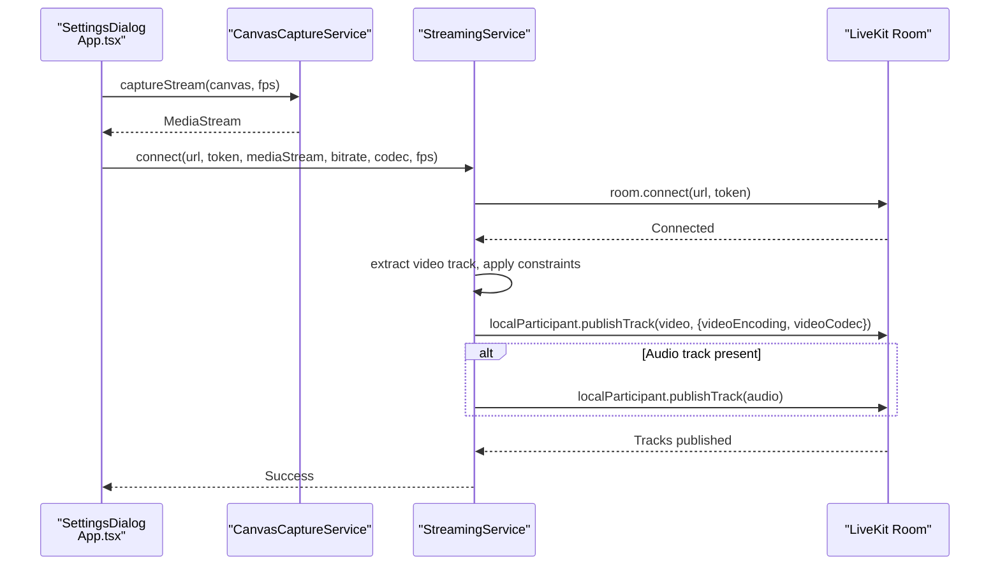
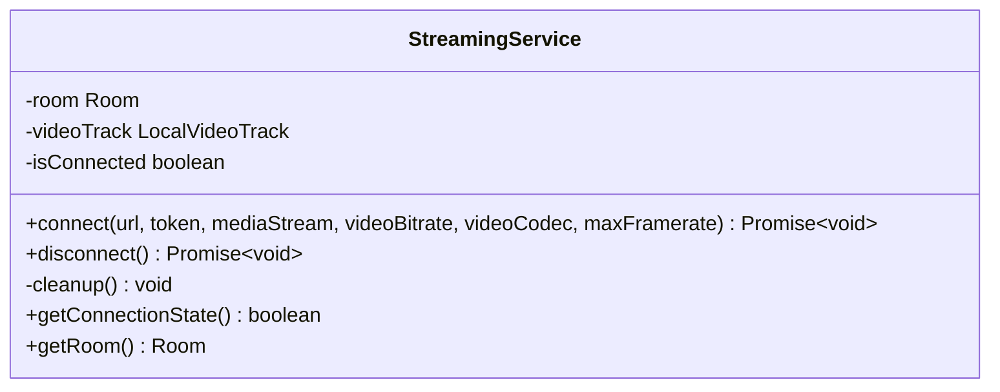
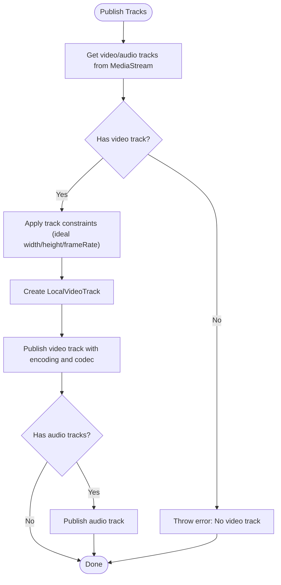
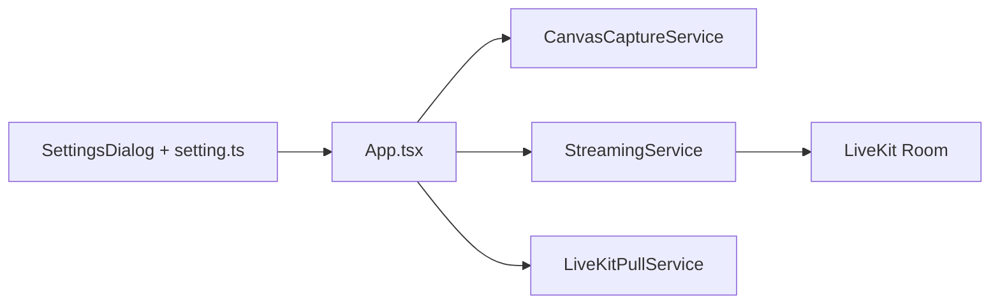

# LiveKit Publishing

<cite>
**Referenced Files in This Document**
- [streaming.ts](file://src/services/streaming.ts)
- [livekit-pull.ts](file://src/services/livekit-pull.ts)
- [canvas-capture.ts](file://src/services/canvas-capture.ts)
- [media-stream-manager.ts](file://src/services/media-stream-manager.ts)
- [App.tsx](file://src/App.tsx)
- [settings-dialog.tsx](file://src/components/settings-dialog.tsx)
- [livekit-stream-item.tsx](file://src/components/livekit-stream-item.tsx)
- [setting.ts](file://src/store/setting.ts)
</cite>

## Table of Contents
1. [Introduction](#introduction)
2. [Project Structure](#project-structure)
3. [Core Components](#core-components)
4. [Architecture Overview](#architecture-overview)
5. [Detailed Component Analysis](#detailed-component-analysis)
6. [Dependency Analysis](#dependency-analysis)
7. [Performance Considerations](#performance-considerations)
8. [Troubleshooting Guide](#troubleshooting-guide)
9. [Conclusion](#conclusion)

## Introduction
This document explains LiveMixer Web’s LiveKit publishing functionality. It focuses on the StreamingService class, covering room connection setup, authentication with access tokens, and media stream publishing. It also documents video encoding configuration (codec selection, bitrate control, and frame rate settings), the track publishing process, practical usage examples, error handling, connection cleanup, and troubleshooting.

## Project Structure
LiveMixer Web integrates LiveKit publishing through a dedicated service layer and UI controls:
- StreamingService manages LiveKit room connections, track publishing, and cleanup.
- CanvasCaptureService generates a MediaStream from a Canvas element for publishing.
- MediaStreamManager provides unified stream lifecycle management for plugins.
- App.tsx orchestrates the publishing flow, wiring settings to the service.
- SettingsDialog and setting.ts define user-configurable streaming parameters.
- LiveKitPullService demonstrates complementary LiveKit subscription behavior.

**Diagram sources**
- [App.tsx:725-788](file://src/App.tsx#L725-L788)
- [streaming.ts:6-177](file://src/services/streaming.ts#L6-L177)
- [canvas-capture.ts:5-47](file://src/services/canvas-capture.ts#L5-L47)
- [livekit-pull.ts:49-352](file://src/services/livekit-pull.ts#L49-L352)
- [media-stream-manager.ts:39-323](file://src/services/media-stream-manager.ts#L39-L323)

**Section sources**
- [App.tsx:725-788](file://src/App.tsx#L725-L788)
- [streaming.ts:6-177](file://src/services/streaming.ts#L6-L177)
- [canvas-capture.ts:5-47](file://src/services/canvas-capture.ts#L5-L47)
- [livekit-pull.ts:49-352](file://src/services/livekit-pull.ts#L49-L352)
- [media-stream-manager.ts:39-323](file://src/services/media-stream-manager.ts#L39-L323)

## Core Components
- StreamingService: Encapsulates LiveKit room connection, authentication, video/audio track publishing, and cleanup.
- CanvasCaptureService: Captures a MediaStream from a Canvas element at a given FPS.
- App.tsx: Orchestrates the publishing lifecycle, reads settings, and invokes StreamingService.
- SettingsDialog + setting.ts: Provide UI and defaults for LiveKit server URL/token and encoding parameters.
- LiveKitPullService: Demonstrates LiveKit subscription behavior for comparison.

Key responsibilities:
- Room connection: Establishes a LiveKit room session using URL and token.
- Authentication: Uses access tokens passed to the room connect call.
- Track publishing: Extracts video/audio tracks from a MediaStream and publishes them with encoding parameters.
- Cleanup: Unpublishes tracks, stops video tracks, and disconnects from the room.

**Section sources**
- [streaming.ts:6-177](file://src/services/streaming.ts#L6-L177)
- [canvas-capture.ts:5-47](file://src/services/canvas-capture.ts#L5-L47)
- [App.tsx:725-788](file://src/App.tsx#L725-L788)
- [settings-dialog.tsx:243-394](file://src/components/settings-dialog.tsx#L243-L394)
- [setting.ts:55-84](file://src/store/setting.ts#L55-L84)

## Architecture Overview
The publishing pipeline connects UI settings to LiveKit via StreamingService. The App component captures a Canvas stream, applies settings, and starts publishing.

**Diagram sources**
- [App.tsx:725-788](file://src/App.tsx#L725-L788)
- [streaming.ts:20-124](file://src/services/streaming.ts#L20-L124)
- [canvas-capture.ts:14-24](file://src/services/canvas-capture.ts#L14-L24)

## Detailed Component Analysis

### StreamingService
StreamingService encapsulates LiveKit publishing:
- Room setup: Creates a Room with adaptive streaming and dynacast enabled, sets default video capture resolution and frame rate.
- Connection: Listens to connection events and throws errors if URL or token are missing.
- Track extraction: Validates presence of a video track and applies constraints to optimize encoding quality.
- Publishing: Publishes the video track with configurable video encoding (max bitrate, max framerate) and codec. Optionally publishes an audio track if present.
- Cleanup: Unpublishes video track, stops it, and disconnects from the room.

**Diagram sources**
- [streaming.ts:6-177](file://src/services/streaming.ts#L6-L177)

**Section sources**
- [streaming.ts:20-124](file://src/services/streaming.ts#L20-L124)
- [streaming.ts:129-158](file://src/services/streaming.ts#L129-L158)

### Video Encoding Configuration
- Codec selection: Supports H.264, H.265, VP8, VP9, AV1. Defaults to VP8.
- Bitrate control: Default 5000 kbps; internally converted to bps for LiveKit.
- Frame rate: Default 30 fps; applied to video capture defaults and track constraints.

These values are configurable via settings and passed to StreamingService.connect.

**Section sources**
- [streaming.ts:24-26](file://src/services/streaming.ts#L24-L26)
- [streaming.ts:96-101](file://src/services/streaming.ts#L96-L101)
- [settings-dialog.tsx:374-394](file://src/components/settings-dialog.tsx#L374-L394)
- [setting.ts:68-84](file://src/store/setting.ts#L68-L84)

### Track Publishing Process
- Video track extraction: From the provided MediaStream, validates at least one video track exists.
- Track constraints: Applies ideal width/height and frame rate constraints to the video track.
- LocalVideoTrack creation: Wraps the video track for publishing.
- Video publishing: Publishes with videoEncoding (max bitrate and max framerate) and selected codec.
- Audio publishing: If audio tracks exist, publishes them with microphone source.

**Diagram sources**
- [streaming.ts:73-118](file://src/services/streaming.ts#L73-L118)

**Section sources**
- [streaming.ts:73-118](file://src/services/streaming.ts#L73-L118)

### Practical Usage Examples
- Connecting to LiveKit servers:
  - Retrieve server URL and token from settings.
  - Capture a Canvas stream at the desired FPS.
  - Call StreamingService.connect with URL, token, MediaStream, bitrate, codec, and FPS.
- Configuring encoding parameters:
  - Adjust video encoder and FPS in SettingsDialog.
  - Bitrate defaults to 5000 kbps; adjust as needed.
- Handling connection states:
  - Use getConnectionState to reflect UI state.
  - Listen to Room events for Connected/Disconnected/Reconnecting/Reconnected.

**Section sources**
- [App.tsx:725-788](file://src/App.tsx#L725-L788)
- [settings-dialog.tsx:243-394](file://src/components/settings-dialog.tsx#L243-L394)
- [setting.ts:55-84](file://src/store/setting.ts#L55-L84)
- [streaming.ts:51-68](file://src/services/streaming.ts#L51-L68)

### Error Handling Strategies
- Validation: Throws errors if already streaming or if URL/token are missing.
- Track validation: Ensures at least one video track exists before publishing.
- Exception safety: On error, sets isConnected to false, cleans up resources, and rethrows.
- Disconnection cleanup: Stops video tracks and unpublishes before disconnecting.

**Section sources**
- [streaming.ts:28-34](file://src/services/streaming.ts#L28-L34)
- [streaming.ts:75-77](file://src/services/streaming.ts#L75-L77)
- [streaming.ts:119-123](file://src/services/streaming.ts#L119-L123)
- [streaming.ts:134-148](file://src/services/streaming.ts#L134-L148)

### Connection Cleanup
- Unpublish video track and stop it.
- Disconnect from the room.
- Reset internal state (room, videoTrack, isConnected).

**Section sources**
- [streaming.ts:129-158](file://src/services/streaming.ts#L129-L158)

## Dependency Analysis
- App.tsx depends on:
  - CanvasCaptureService to generate the MediaStream.
  - StreamingService to publish to LiveKit.
  - SettingsDialog and setting.ts for configuration.
- StreamingService depends on:
  - LiveKit client types for Room, Track, and RoomEvent.
  - MediaStreamManager indirectly via the MediaStream it receives.
- LiveKitPullService complements StreamingService by demonstrating subscription behavior.

**Diagram sources**
- [App.tsx:725-788](file://src/App.tsx#L725-L788)
- [streaming.ts:6-177](file://src/services/streaming.ts#L6-L177)
- [livekit-pull.ts:49-352](file://src/services/livekit-pull.ts#L49-L352)

**Section sources**
- [App.tsx:725-788](file://src/App.tsx#L725-L788)
- [streaming.ts:6-177](file://src/services/streaming.ts#L6-L177)
- [livekit-pull.ts:49-352](file://src/services/livekit-pull.ts#L49-L352)

## Performance Considerations
- Adaptive streaming and dynacast are enabled by default, which helps optimize bandwidth and CPU usage.
- Simulcast is disabled to favor higher-quality single-layer publishing.
- Frame rate and bitrate defaults balance quality and bandwidth; adjust according to network conditions.
- Continuous rendering of the Canvas ensures consistent capture for the MediaStream.

[No sources needed since this section provides general guidance]

## Troubleshooting Guide
Common issues and resolutions:
- No video track found:
  - Ensure the MediaStream contains at least one video track before calling connect.
- Missing URL or token:
  - Verify settings are configured in SettingsDialog and persisted in localStorage.
- Publishing fails:
  - Confirm the room is reachable and the token is valid.
  - Check browser permissions for camera/screen capture.
- Stuck in reconnecting:
  - Inspect network connectivity and LiveKit server health.
- Audio not publishing:
  - Ensure the MediaStream includes audio tracks; otherwise, audio publishing is skipped.

**Section sources**
- [streaming.ts:32-34](file://src/services/streaming.ts#L32-L34)
- [streaming.ts:75-77](file://src/services/streaming.ts#L75-L77)
- [App.tsx:725-788](file://src/App.tsx#L725-L788)

## Conclusion
LiveMixer Web’s LiveKit publishing is implemented via a focused service layer that manages room connections, authentication, and track publishing with configurable encoding parameters. The App component orchestrates the flow by capturing a Canvas stream and invoking the service with user-defined settings. Robust error handling and cleanup ensure reliable operation, while the UI provides straightforward controls for server configuration and encoding preferences.