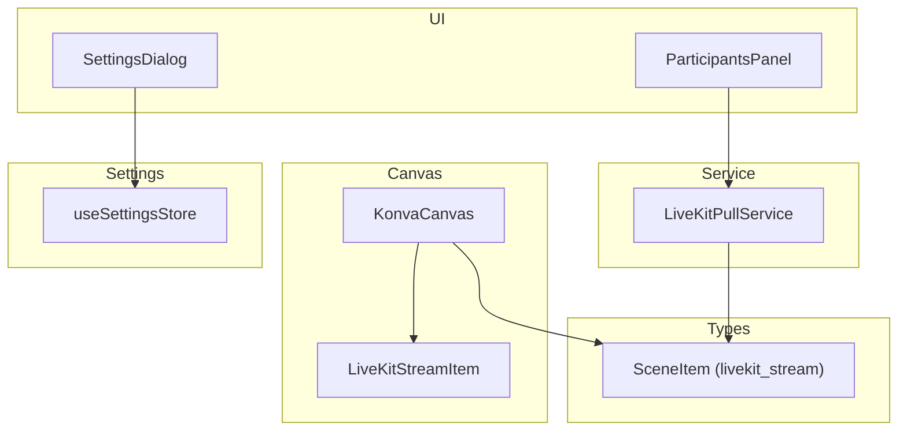
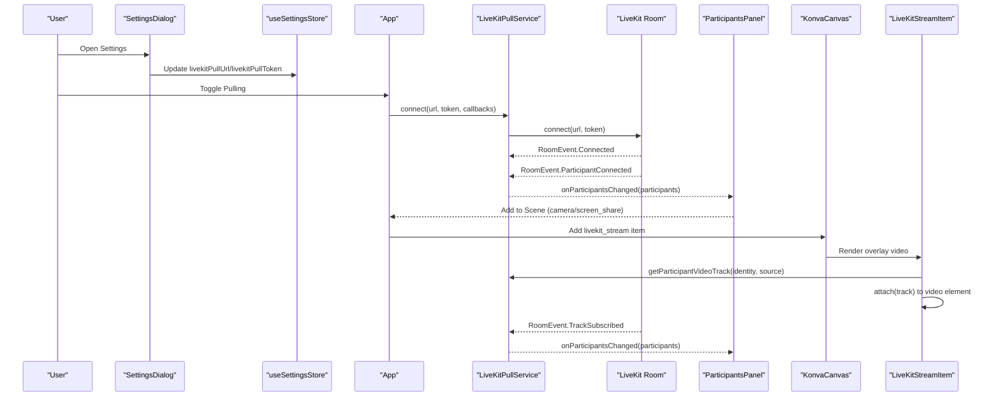
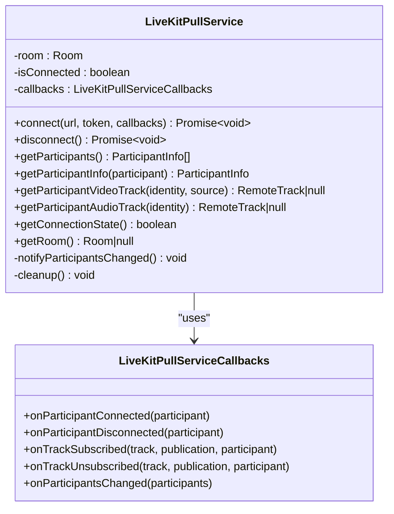
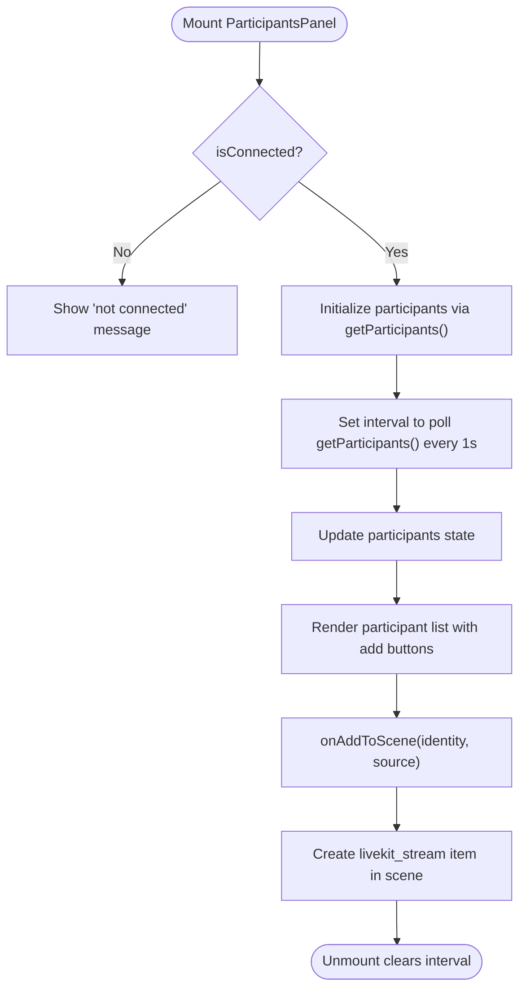
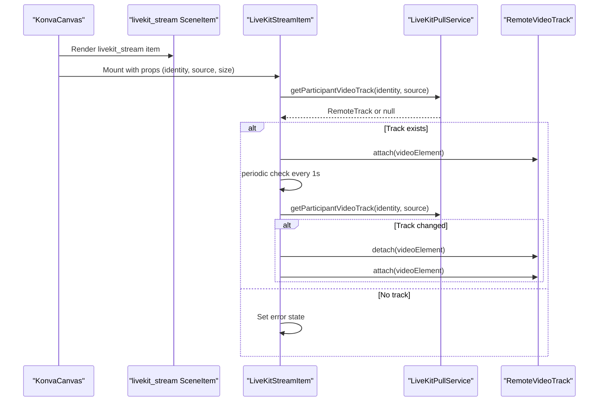
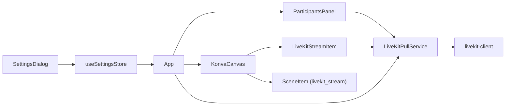

# LiveKit Pulling/Consuming

<cite>
**Referenced Files in This Document**
- [livekit-pull.ts](file://src/services/livekit-pull.ts)
- [livekit-stream-item.tsx](file://src/components/livekit-stream-item.tsx)
- [participants-panel.tsx](file://src/components/participants-panel.tsx)
- [konva-canvas.tsx](file://src/components/konva-canvas.tsx)
- [App.tsx](file://src/App.tsx)
- [protocol.ts](file://src/types/protocol.ts)
- [setting.ts](file://src/store/setting.ts)
- [settings-dialog.tsx](file://src/components/settings-dialog.tsx)
</cite>

## Table of Contents
1. [Introduction](#introduction)
2. [Project Structure](#project-structure)
3. [Core Components](#core-components)
4. [Architecture Overview](#architecture-overview)
5. [Detailed Component Analysis](#detailed-component-analysis)
6. [Dependency Analysis](#dependency-analysis)
7. [Performance Considerations](#performance-considerations)
8. [Troubleshooting Guide](#troubleshooting-guide)
9. [Conclusion](#conclusion)

## Introduction
This document explains the LiveKit pulling/consuming functionality in LiveMixer Web. It focuses on the LiveKitPullService, room connection, participant management, and incoming track handling. It also covers how pulled participant streams are integrated into the video mixing canvas as scene items, including automatic detection of new participants, subscription management, dynamic participant removal, and practical examples for setting up consumer connections, managing participant lists, and integrating pulled streams as scene items.

## Project Structure
The LiveKit pulling feature spans several modules:
- Service layer: LiveKitPullService manages room connections and participant/track events.
- UI layer: ParticipantsPanel displays participant lists and allows adding streams to the scene.
- Canvas layer: KonvaCanvas renders scene items and overlays LiveKit video streams via HTML divs.
- Types: SceneItem definition includes a dedicated livekit_stream type.
- Settings: Stores server URLs and tokens for pull connections.

**Diagram sources**
- [livekit-pull.ts:49-351](file://src/services/livekit-pull.ts#L49-L351)
- [participants-panel.tsx:128-195](file://src/components/participants-panel.tsx#L128-L195)
- [konva-canvas.tsx:583-733](file://src/components/konva-canvas.tsx#L583-L733)
- [protocol.ts:70-74](file://src/types/protocol.ts#L70-L74)
- [setting.ts:14-15](file://src/store/setting.ts#L14-L15)
- [settings-dialog.tsx:276-320](file://src/components/settings-dialog.tsx#L276-L320)

**Section sources**
- [livekit-pull.ts:49-351](file://src/services/livekit-pull.ts#L49-L351)
- [participants-panel.tsx:128-195](file://src/components/participants-panel.tsx#L128-L195)
- [konva-canvas.tsx:583-733](file://src/components/konva-canvas.tsx#L583-L733)
- [protocol.ts:70-74](file://src/types/protocol.ts#L70-L74)
- [setting.ts:14-15](file://src/store/setting.ts#L14-L15)
- [settings-dialog.tsx:276-320](file://src/components/settings-dialog.tsx#L276-L320)

## Core Components
- LiveKitPullService: Manages room connection, participant lifecycle, and track subscription events. Provides participant info and track accessors.
- ParticipantsPanel: Displays participant list and enables adding camera or screen-share streams to the scene.
- KonvaCanvas: Renders scene items and overlays LiveKit video streams via HTML divs positioned over the canvas.
- LiveKitStreamItem: React component that attaches a LiveKit remote video track to a video element and handles re-attachment when tracks change.
- SceneItem livekit_stream: A scene item type representing a pulled participant stream with participant identity and source selection.
- Settings and SettingsDialog: Store and UI for pull server URL and token.

**Section sources**
- [livekit-pull.ts:49-351](file://src/services/livekit-pull.ts#L49-L351)
- [participants-panel.tsx:128-195](file://src/components/participants-panel.tsx#L128-L195)
- [konva-canvas.tsx:583-733](file://src/components/konva-canvas.tsx#L583-L733)
- [livekit-stream-item.tsx:16-173](file://src/components/livekit-stream-item.tsx#L16-L173)
- [protocol.ts:70-74](file://src/types/protocol.ts#L70-L74)
- [setting.ts:14-15](file://src/store/setting.ts#L14-L15)
- [settings-dialog.tsx:276-320](file://src/components/settings-dialog.tsx#L276-L320)

## Architecture Overview
The pulling architecture consists of:
- Consumer connection: LiveKitPullService connects to a LiveKit room using URL and token from settings.
- Event-driven participant management: Room events trigger callbacks for participant join/leave and track subscribe/unsubscribe.
- UI integration: ParticipantsPanel polls participant info and allows adding selected streams to the scene.
- Canvas integration: KonvaCanvas renders scene items and overlays LiveKit video streams via HTML divs. LiveKitStreamItem attaches tracks to video elements.

**Diagram sources**
- [settings-dialog.tsx:276-320](file://src/components/settings-dialog.tsx#L276-L320)
- [setting.ts:14-15](file://src/store/setting.ts#L14-L15)
- [App.tsx:790-824](file://src/App.tsx#L790-L824)
- [livekit-pull.ts:60-179](file://src/services/livekit-pull.ts#L60-L179)
- [participants-panel.tsx:135-154](file://src/components/participants-panel.tsx#L135-L154)
- [konva-canvas.tsx:697-733](file://src/components/konva-canvas.tsx#L697-L733)
- [livekit-stream-item.tsx:26-108](file://src/components/livekit-stream-item.tsx#L26-L108)

## Detailed Component Analysis

### LiveKitPullService
- Responsibilities:
  - Connect/disconnect to a LiveKit room with adaptive streaming and dynacast enabled.
  - Subscribe to room events: participant join/leave, track subscribe/unsubscribe, mute/unmute.
  - Provide participant info and track accessors for camera, microphone, and screen share.
  - Notify participants changed via callbacks.
- Key behaviors:
  - Throws errors if already connected or missing URL/token.
  - Maintains connection state and cleans up on disconnect.
  - Uses RoomEvent callbacks to keep participant list updated.

**Diagram sources**
- [livekit-pull.ts:49-351](file://src/services/livekit-pull.ts#L49-L351)

**Section sources**
- [livekit-pull.ts:60-179](file://src/services/livekit-pull.ts#L60-L179)
- [livekit-pull.ts:184-196](file://src/services/livekit-pull.ts#L184-L196)
- [livekit-pull.ts:201-265](file://src/services/livekit-pull.ts#L201-L265)
- [livekit-pull.ts:270-314](file://src/services/livekit-pull.ts#L270-L314)
- [livekit-pull.ts:319-328](file://src/services/livekit-pull.ts#L319-L328)
- [livekit-pull.ts:333-338](file://src/services/livekit-pull.ts#L333-L338)
- [livekit-pull.ts:343-347](file://src/services/livekit-pull.ts#L343-L347)

### ParticipantsPanel
- Responsibilities:
  - Displays participant list when pulling is active.
  - Polls participant info every second and updates state.
  - Enables adding camera or screen-share streams to the scene via onAddToScene callback.
- Integration:
  - Uses LiveKitPullService.getParticipants() to populate the list.
  - Calls handleAddParticipantToScene to create livekit_stream items.

**Diagram sources**
- [participants-panel.tsx:135-154](file://src/components/participants-panel.tsx#L135-L154)
- [participants-panel.tsx:184-190](file://src/components/participants-panel.tsx#L184-L190)

**Section sources**
- [participants-panel.tsx:128-195](file://src/components/participants-panel.tsx#L128-L195)

### KonvaCanvas and LiveKitStreamItem
- KonvaCanvas:
  - Renders scene items and overlays LiveKit video streams using HTML divs positioned according to scene item layout.
  - For livekit_stream items, it creates an absolutely positioned overlay div and mounts LiveKitStreamItem inside.
- LiveKitStreamItem:
  - Retrieves the current RemoteTrack for a given participant and source.
  - Attaches the track to a video element and periodically checks for track changes to re-attach if needed.
  - Handles loading and error states.

**Diagram sources**
- [konva-canvas.tsx:697-733](file://src/components/konva-canvas.tsx#L697-L733)
- [livekit-stream-item.tsx:26-108](file://src/components/livekit-stream-item.tsx#L26-L108)
- [livekit-pull.ts:270-291](file://src/services/livekit-pull.ts#L270-L291)

**Section sources**
- [konva-canvas.tsx:583-596](file://src/components/konva-canvas.tsx#L583-L596)
- [konva-canvas.tsx:697-733](file://src/components/konva-canvas.tsx#L697-L733)
- [livekit-stream-item.tsx:16-173](file://src/components/livekit-stream-item.tsx#L16-L173)

### SceneItem livekit_stream
- Definition:
  - livekitStream field holds participantIdentity and streamSource ('camera' | 'screen_share').
- Integration:
  - Created by ParticipantsPanel when adding a participant stream to the scene.
  - Used by KonvaCanvas to overlay a LiveKit video stream.

**Section sources**
- [protocol.ts:70-74](file://src/types/protocol.ts#L70-L74)
- [App.tsx:827-897](file://src/App.tsx#L827-L897)

### Settings and Connection Management
- Settings:
  - livekitPullUrl and livekitPullToken are stored in useSettingsStore and editable via SettingsDialog.
- Connection:
  - App toggles pulling by calling liveKitPullService.connect with URL and token from settings.
  - On disconnect, App calls liveKitPullService.disconnect.

**Section sources**
- [setting.ts:14-15](file://src/store/setting.ts#L14-L15)
- [settings-dialog.tsx:276-320](file://src/components/settings-dialog.tsx#L276-L320)
- [App.tsx:790-824](file://src/App.tsx#L790-L824)

## Dependency Analysis
- LiveKitPullService depends on livekit-client Room and event types.
- ParticipantsPanel depends on LiveKitPullService for participant info and on App for adding items to the scene.
- KonvaCanvas depends on SceneItem definitions and LiveKitPullService for track access.
- LiveKitStreamItem depends on LiveKitPullService and React lifecycle hooks.
- App orchestrates settings, connection, and scene item creation.

**Diagram sources**
- [livekit-pull.ts:1-9](file://src/services/livekit-pull.ts#L1-L9)
- [participants-panel.tsx:12-15](file://src/components/participants-panel.tsx#L12-L15)
- [konva-canvas.tsx:21-22](file://src/components/konva-canvas.tsx#L21-L22)
- [livekit-stream-item.tsx:1-3](file://src/components/livekit-stream-item.tsx#L1-L3)
- [protocol.ts:70-74](file://src/types/protocol.ts#L70-L74)
- [App.tsx:26-32](file://src/App.tsx#L26-L32)
- [settings-dialog.tsx:20-51](file://src/components/settings-dialog.tsx#L20-L51)
- [setting.ts:92-138](file://src/store/setting.ts#L92-L138)

**Section sources**
- [livekit-pull.ts:1-9](file://src/services/livekit-pull.ts#L1-L9)
- [participants-panel.tsx:12-15](file://src/components/participants-panel.tsx#L12-L15)
- [konva-canvas.tsx:21-22](file://src/components/konva-canvas.tsx#L21-L22)
- [livekit-stream-item.tsx:1-3](file://src/components/livekit-stream-item.tsx#L1-L3)
- [protocol.ts:70-74](file://src/types/protocol.ts#L70-L74)
- [App.tsx:26-32](file://src/App.tsx#L26-L32)
- [settings-dialog.tsx:20-51](file://src/components/settings-dialog.tsx#L20-L51)
- [setting.ts:92-138](file://src/store/setting.ts#L92-L138)

## Performance Considerations
- Adaptive streaming and dynacast are enabled in the room configuration to optimize bandwidth and CPU usage under varying network conditions.
- LiveKitStreamItem performs periodic checks (every second) to detect track changes and re-attach videos. This balances reliability with minimal overhead.
- ParticipantsPanel polls participant info every second. Consider adjusting polling intervals or using event-driven updates if needed.
- Canvas overlays for LiveKit streams use HTML video elements positioned absolutely over the canvas. Keep the number of concurrent streams reasonable to avoid excessive GPU/CPU load.

[No sources needed since this section provides general guidance]

## Troubleshooting Guide
- Connection errors:
  - Ensure livekitPullUrl and livekitPullToken are configured in Settings.
  - Verify the server URL and token are valid and not expired.
- Stream not appearing:
  - Confirm the participant has camera or screen-share enabled.
  - Check that the participant is still connected and the track is subscribed.
  - Verify the scene item was created with the correct participant identity and source.
- Track changes:
  - LiveKitStreamItem automatically re-attaches when the track changes. If it fails, inspect the component’s error state and logs.
- Disconnection:
  - Use App’s toggle to disconnect and reconnect. LiveKitPullService cleanup ensures resources are released.

**Section sources**
- [settings-dialog.tsx:276-320](file://src/components/settings-dialog.tsx#L276-L320)
- [livekit-stream-item.tsx:64-70](file://src/components/livekit-stream-item.tsx#L64-L70)
- [livekit-pull.ts:174-178](file://src/services/livekit-pull.ts#L174-L178)

## Conclusion
LiveMixer Web’s LiveKit pulling/consuming functionality integrates seamlessly with the video mixing canvas. LiveKitPullService provides robust room connection and participant/track event handling, ParticipantsPanel offers an intuitive way to manage participants and add streams, and KonvaCanvas overlays LiveKit video streams via HTML divs. The system supports automatic participant detection, dynamic subscription management, and efficient resource usage through adaptive streaming and periodic checks.