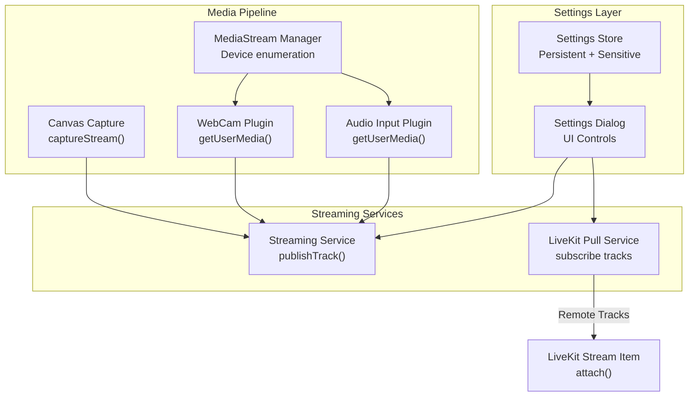
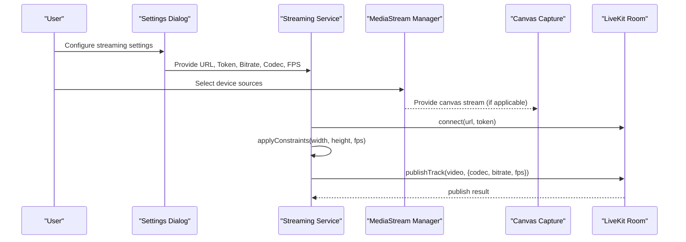
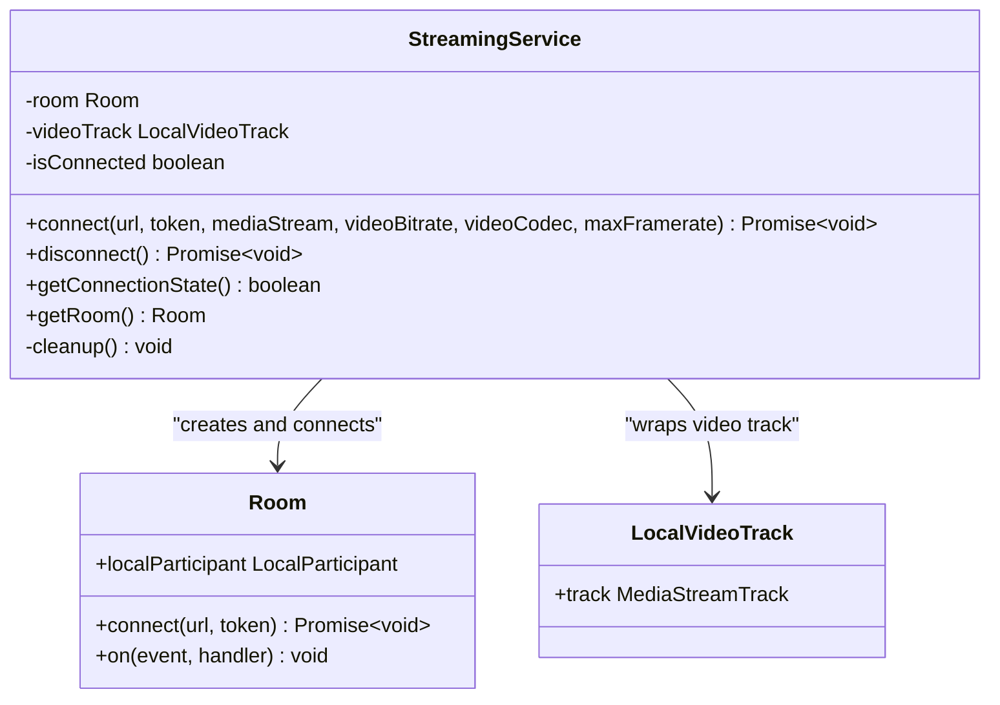
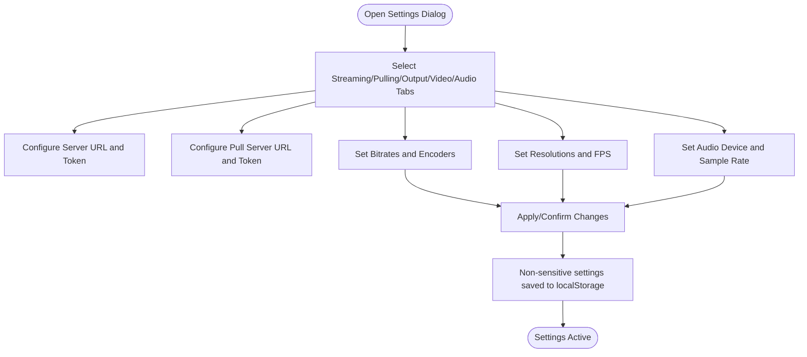
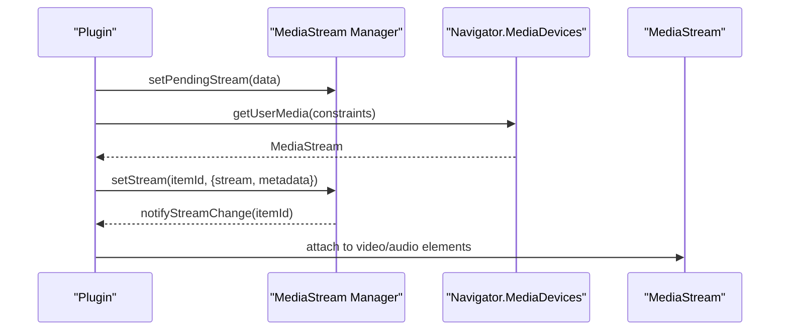
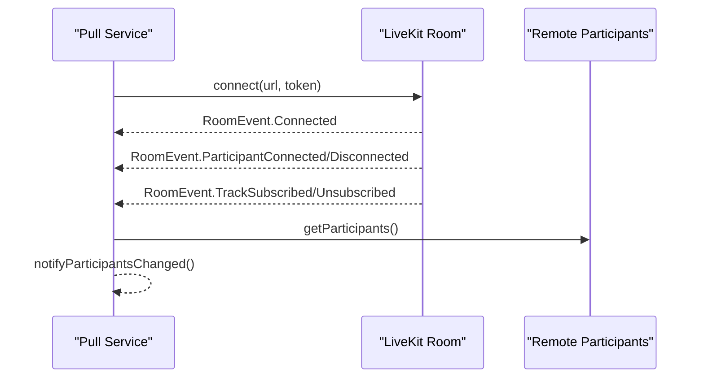
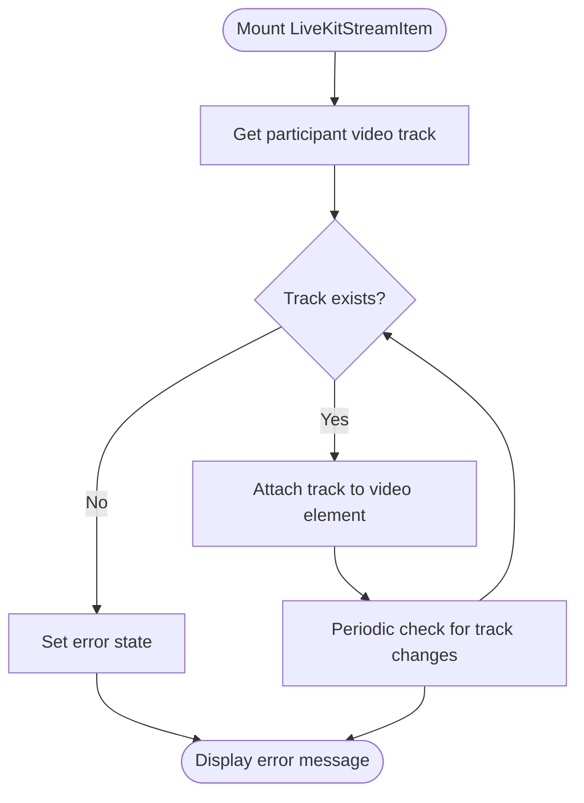
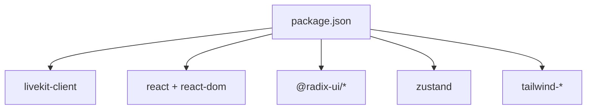
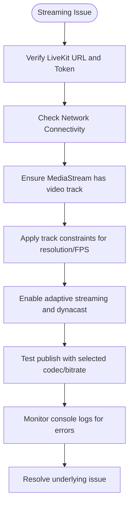

# Streaming Configuration

<cite>
**Referenced Files in This Document**
- [streaming.ts](file://src/services/streaming.ts)
- [livekit-pull.ts](file://src/services/livekit-pull.ts)
- [setting.ts](file://src/store/setting.ts)
- [settings-dialog.tsx](file://src/components/settings-dialog.tsx)
- [livekit-stream-item.tsx](file://src/components/livekit-stream-item.tsx)
- [canvas-capture.ts](file://src/services/canvas-capture.ts)
- [media-stream-manager.ts](file://src/services/media-stream-manager.ts)
- [index.tsx](file://src/plugins/builtin/webcam/index.tsx)
- [index.tsx](file://src/plugins/builtin/audio-input/index.tsx)
- [package.json](file://package.json)
</cite>

## Table of Contents
1. [Introduction](#introduction)
2. [Project Structure](#project-structure)
3. [Core Components](#core-components)
4. [Architecture Overview](#architecture-overview)
5. [Detailed Component Analysis](#detailed-component-analysis)
6. [Dependency Analysis](#dependency-analysis)
7. [Performance Considerations](#performance-considerations)
8. [Security Considerations](#security-considerations)
9. [Troubleshooting Guide](#troubleshooting-guide)
10. [Conclusion](#conclusion)

## Introduction
This document provides comprehensive guidance for configuring LiveMixer Web's streaming settings. It covers LiveKit server URL setup, authentication token management, codec selection, bitrate optimization, frame rate configuration, adaptive streaming, bandwidth management, security considerations, and troubleshooting strategies. The goal is to help users achieve reliable and efficient streaming across diverse network conditions and target audiences.

## Project Structure
The streaming configuration system spans several key areas:
- Settings persistence and UI: Stores non-sensitive configuration and exposes a settings dialog for user input.
- Streaming services: Handles publishing to LiveKit and pulling remote streams.
- Media pipeline: Manages MediaStream creation from canvas and device sources.
- Plugins: Provide webcam and audio input sources for composition and streaming.

**Diagram sources**
- [setting.ts:1-139](file://src/store/setting.ts#L1-L139)
- [settings-dialog.tsx:1-647](file://src/components/settings-dialog.tsx#L1-L647)
- [canvas-capture.ts:1-48](file://src/services/canvas-capture.ts#L1-L48)
- [media-stream-manager.ts:1-323](file://src/services/media-stream-manager.ts#L1-L323)
- [index.tsx:1-478](file://src/plugins/builtin/webcam/index.tsx#L1-L478)
- [index.tsx:1-555](file://src/plugins/builtin/audio-input/index.tsx#L1-L555)
- [streaming.ts:1-177](file://src/services/streaming.ts#L1-L177)
- [livekit-pull.ts:1-352](file://src/services/livekit-pull.ts#L1-L352)
- [livekit-stream-item.tsx:1-174](file://src/components/livekit-stream-item.tsx#L1-L174)

**Section sources**
- [setting.ts:1-139](file://src/store/setting.ts#L1-L139)
- [settings-dialog.tsx:1-647](file://src/components/settings-dialog.tsx#L1-L647)
- [streaming.ts:1-177](file://src/services/streaming.ts#L1-L177)
- [livekit-pull.ts:1-352](file://src/services/livekit-pull.ts#L1-L352)
- [canvas-capture.ts:1-48](file://src/services/canvas-capture.ts#L1-L48)
- [media-stream-manager.ts:1-323](file://src/services/media-stream-manager.ts#L1-L323)
- [index.tsx:1-478](file://src/plugins/builtin/webcam/index.tsx#L1-L478)
- [index.tsx:1-555](file://src/plugins/builtin/audio-input/index.tsx#L1-L555)

## Core Components
- Settings Store: Persists non-sensitive configuration (e.g., server URLs, encoders, bitrates, resolutions) and manages sensitive tokens in memory only.
- Settings Dialog: Provides tabbed UI for general, streaming, pulling, output, audio, and video settings.
- Streaming Service: Publishes a MediaStream video track to LiveKit with configurable codec, bitrate, and framerate; enables adaptive streaming and dynacast.
- LiveKit Pull Service: Connects to a room and retrieves remote participant tracks for display.
- Media Pipeline: Creates MediaStreams from canvas capture and device sources, and manages device enumeration and permissions.
- Plugins: Webcam and audio input plugins provide device capture and monitoring capabilities.

**Section sources**
- [setting.ts:1-139](file://src/store/setting.ts#L1-L139)
- [settings-dialog.tsx:1-647](file://src/components/settings-dialog.tsx#L1-L647)
- [streaming.ts:1-177](file://src/services/streaming.ts#L1-L177)
- [livekit-pull.ts:1-352](file://src/services/livekit-pull.ts#L1-L352)
- [canvas-capture.ts:1-48](file://src/services/canvas-capture.ts#L1-L48)
- [media-stream-manager.ts:1-323](file://src/services/media-stream-manager.ts#L1-L323)
- [index.tsx:1-478](file://src/plugins/builtin/webcam/index.tsx#L1-L478)
- [index.tsx:1-555](file://src/plugins/builtin/audio-input/index.tsx#L1-L555)

## Architecture Overview
The streaming configuration architecture integrates user-configured settings with the media pipeline and LiveKit services. The flow begins with the settings dialog, which updates the store. The streaming service reads these settings to configure LiveKit publishing parameters. Media sources (canvas or devices) feed into the streaming service, while the pull service handles incoming remote tracks.

**Diagram sources**
- [settings-dialog.tsx:217-274](file://src/components/settings-dialog.tsx#L217-L274)
- [streaming.ts:20-124](file://src/services/streaming.ts#L20-L124)
- [canvas-capture.ts:14-24](file://src/services/canvas-capture.ts#L14-L24)
- [media-stream-manager.ts:56-91](file://src/services/media-stream-manager.ts#L56-L91)

## Detailed Component Analysis

### Streaming Service Configuration
The streaming service encapsulates LiveKit publishing with configurable parameters:
- Connection parameters: URL and token are validated and used to establish a room connection.
- Adaptive streaming: Enabled via room options to automatically adjust quality based on network conditions.
- Dynacast: Enabled to reduce bandwidth by disabling faraway participants' feeds.
- Video capture defaults: Resolution and frame rate defaults are applied during room creation.
- Track constraints: Applied to the source video track to match configured resolution and frame rate.
- Publishing parameters: Video encoding includes max bitrate (converted from kbps to bps) and max frame rate; codec selection is configurable.

**Diagram sources**
- [streaming.ts:6-177](file://src/services/streaming.ts#L6-L177)

**Section sources**
- [streaming.ts:20-124](file://src/services/streaming.ts#L20-L124)

### Settings Store and UI
The settings store defines non-sensitive and sensitive configuration categories:
- Non-sensitive settings persisted to localStorage: language, theme, streaming/pulling server URLs, encoders, bitrates, audio/video settings, resolutions, and FPS.
- Sensitive settings kept in memory only: streaming and pulling tokens.
- The settings dialog exposes controls for:
  - Streaming: service type, server URL, token.
  - Pulling: server URL, token.
  - Output: video bitrate, audio bitrate, video encoder (H.264/5, VP8/9, AV1), audio encoder (AAC, Opus, MP3).
  - Video: base/output resolution, FPS, scaling filter.
  - Audio: device, sample rate, channels.

**Diagram sources**
- [setting.ts:4-139](file://src/store/setting.ts#L4-L139)
- [settings-dialog.tsx:217-615](file://src/components/settings-dialog.tsx#L217-L615)

**Section sources**
- [setting.ts:44-139](file://src/store/setting.ts#L44-L139)
- [settings-dialog.tsx:217-615](file://src/components/settings-dialog.tsx#L217-L615)

### Media Pipeline and Source Plugins
Media sources are managed through plugins and the media stream manager:
- Canvas capture: Converts a canvas element into a MediaStream at a specified frame rate.
- Device enumeration: Unified API to discover and request permissions for video and audio devices.
- Webcam plugin: Uses getUserMedia with device constraints and mirrors device state.
- Audio input plugin: Uses getUserMedia for microphone capture and provides audio level visualization.

**Diagram sources**
- [canvas-capture.ts:14-24](file://src/services/canvas-capture.ts#L14-L24)
- [media-stream-manager.ts:56-91](file://src/services/media-stream-manager.ts#L56-L91)
- [index.tsx:286-337](file://src/plugins/builtin/webcam/index.tsx#L286-L337)
- [index.tsx:333-376](file://src/plugins/builtin/audio-input/index.tsx#L333-L376)

**Section sources**
- [canvas-capture.ts:1-48](file://src/services/canvas-capture.ts#L1-L48)
- [media-stream-manager.ts:147-273](file://src/services/media-stream-manager.ts#L147-L273)
- [index.tsx:286-337](file://src/plugins/builtin/webcam/index.tsx#L286-L337)
- [index.tsx:333-376](file://src/plugins/builtin/audio-input/index.tsx#L333-L376)

### Pull Service for Remote Streams
The pull service connects to a LiveKit room and retrieves remote participant tracks:
- Enables adaptive streaming and dynacast.
- Emits events for participant and track lifecycle changes.
- Provides methods to fetch participant info and specific tracks by identity and source.

**Diagram sources**
- [livekit-pull.ts:60-179](file://src/services/livekit-pull.ts#L60-L179)

**Section sources**
- [livekit-pull.ts:49-179](file://src/services/livekit-pull.ts#L49-L179)

### LiveKit Stream Item Rendering
The LiveKit stream item component attaches remote tracks to a video element:
- Retrieves a specific participant's camera or screen-share track.
- Handles track availability and re-attaches when the track changes.
- Displays loading and error states.

**Diagram sources**
- [livekit-stream-item.tsx:33-108](file://src/components/livekit-stream-item.tsx#L33-L108)

**Section sources**
- [livekit-stream-item.tsx:16-108](file://src/components/livekit-stream-item.tsx#L16-L108)

## Dependency Analysis
The streaming configuration relies on the following dependencies:
- LiveKit client: Provides Room, Track, and event handling for publishing and subscribing.
- React and UI primitives: Radix UI components for dialogs, inputs, sliders, and tooltips.
- Zustand: State management for settings with persistence.
- Tailwind CSS: Styling framework for UI components.

**Diagram sources**
- [package.json:50-77](file://package.json#L50-L77)

**Section sources**
- [package.json:50-77](file://package.json#L50-L77)

## Performance Considerations
- Adaptive streaming and dynacast: Both services enable adaptiveStream and dynacast, allowing automatic quality adjustments and reduced bandwidth for distant participants.
- Bitrate and frame rate: Configure video bitrate (kbps) and max frame rate to balance quality and bandwidth. Lower FPS reduces CPU/GPU load and bandwidth.
- Codec selection: Choose codecs based on browser support and efficiency targets. H.264 offers broad compatibility; VP8/VP9 provide good modern browser support; AV1 offers high efficiency at the cost of computational complexity.
- Resolution scaling: Match output resolution to audience expectations and device capabilities. Use appropriate scaling filters for quality.
- Simulcast: The streaming service disables simulcast for higher quality; keep this disabled unless you need scalability across varying network conditions.
- Device constraints: Apply constraints to align capture resolution and frame rate with configured settings.

**Section sources**
- [streaming.ts:38-49](file://src/services/streaming.ts#L38-L49)
- [streaming.ts:82-86](file://src/services/streaming.ts#L82-L86)
- [streaming.ts:92-101](file://src/services/streaming.ts#L92-L101)
- [settings-dialog.tsx:322-417](file://src/components/settings-dialog.tsx#L322-L417)

## Security Considerations
- Token management: Tokens are stored in memory only via the settings store to minimize exposure. Avoid persisting tokens to localStorage.
- Server configuration: Ensure LiveKit servers are configured with secure transport (TLS) and appropriate authentication policies.
- Connection encryption: LiveKit connections leverage encrypted WebSocket/WebRTC transport when served over HTTPS/TLS.
- Token generation: Generate short-lived tokens with minimal permissions and expiration times. Restrict room access and participant roles as needed.

**Section sources**
- [setting.ts:37-41](file://src/store/setting.ts#L37-L41)
- [settings-dialog.tsx:258-271](file://src/components/settings-dialog.tsx#L258-L271)

## Troubleshooting Guide
Common configuration issues and remedies:
- No video track found: Verify the MediaStream contains at least one video track before publishing.
- Connection errors: Confirm server URL and token validity; check network connectivity and TLS configuration.
- Audio publishing: Ensure audio tracks are present; the service publishes audio tracks when available.
- Track attachment failures: The pull service component logs attachment failures and sets error states; verify track availability and re-attach logic.
- Device permissions: Device enumeration requires user permission; handle cases where labels are unavailable until permission is granted.
- Frame rate and resolution mismatch: Apply track constraints to align capture settings with configured resolution and frame rate.

**Diagram sources**
- [streaming.ts:32-34](file://src/services/streaming.ts#L32-L34)
- [streaming.ts:74-77](file://src/services/streaming.ts#L74-L77)
- [streaming.ts:82-86](file://src/services/streaming.ts#L82-L86)
- [livekit-stream-item.tsx:64-70](file://src/components/livekit-stream-item.tsx#L64-L70)

**Section sources**
- [streaming.ts:32-34](file://src/services/streaming.ts#L32-L34)
- [streaming.ts:74-77](file://src/services/streaming.ts#L74-L77)
- [streaming.ts:82-86](file://src/services/streaming.ts#L82-L86)
- [livekit-stream-item.tsx:64-70](file://src/components/livekit-stream-item.tsx#L64-L70)

## Conclusion
LiveMixer Web's streaming configuration centers on flexible settings, robust media pipeline management, and LiveKit integration. By carefully selecting codecs, optimizing bitrate and frame rate, enabling adaptive streaming, and managing tokens securely, users can achieve reliable and efficient streaming tailored to their network conditions and audience needs. The provided components and services offer a solid foundation for building scalable streaming workflows.