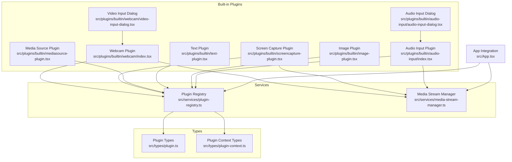
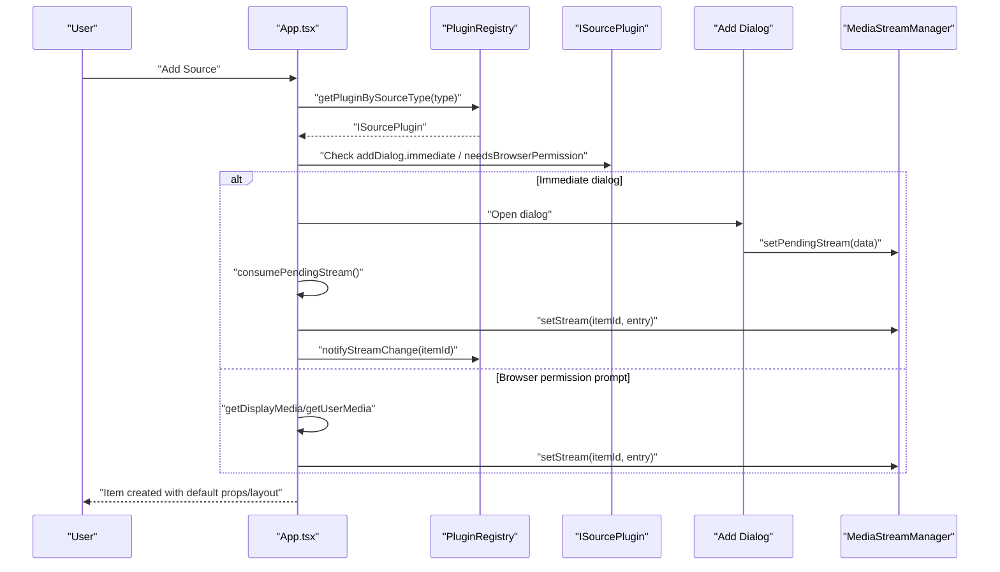
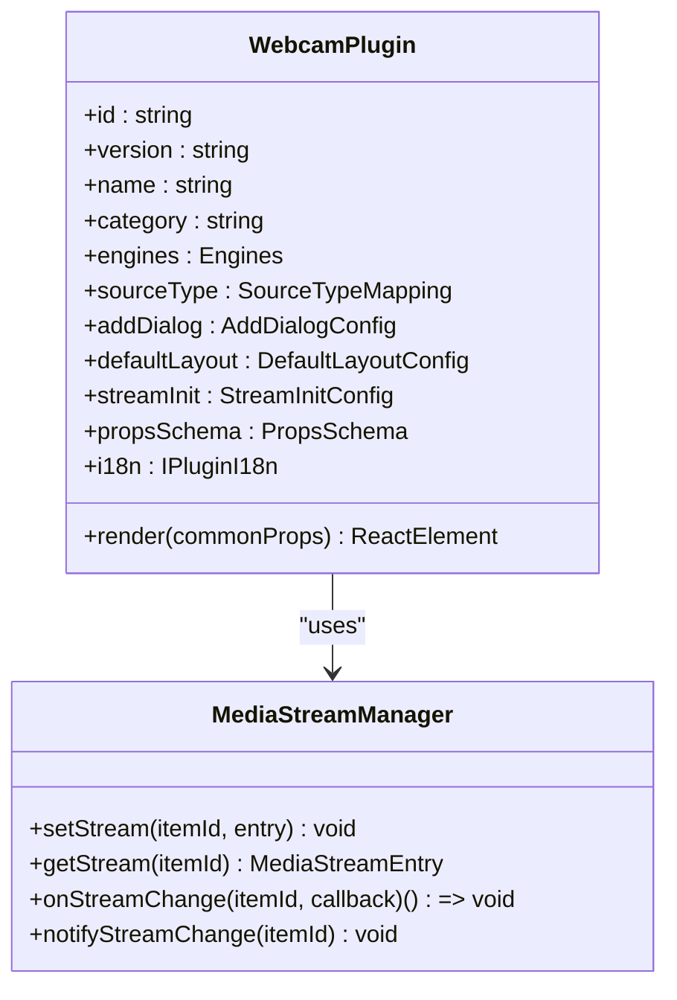
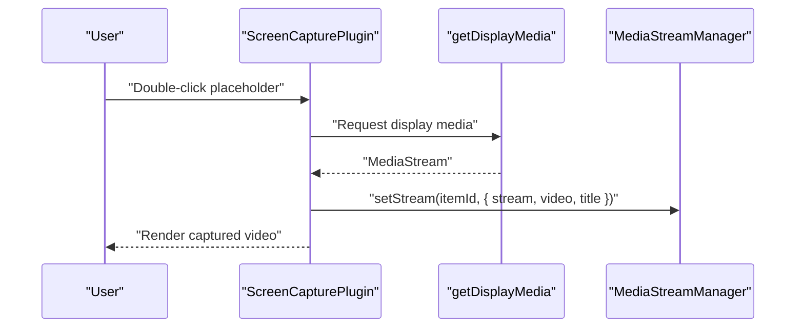
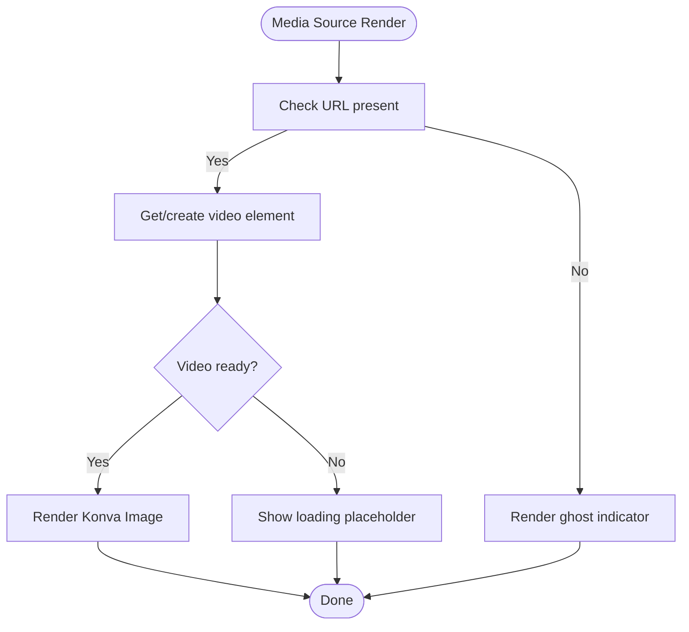
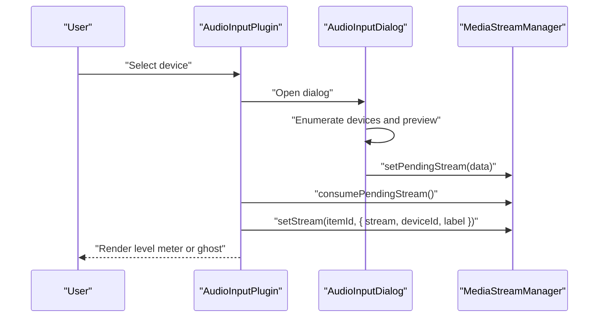
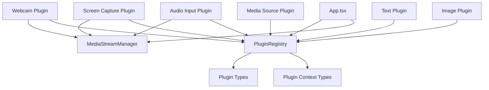

# Built-in Plugins

<cite>
**Referenced Files in This Document**
- [webcam/index.tsx](file://src/plugins/builtin/webcam/index.tsx)
- [webcam/video-input-dialog.tsx](file://src/plugins/builtin/webcam/video-input-dialog.tsx)
- [screencapture-plugin.tsx](file://src/plugins/builtin/screencapture-plugin.tsx)
- [mediasource-plugin.tsx](file://src/plugins/builtin/mediasource-plugin.tsx)
- [text-plugin.tsx](file://src/plugins/builtin/text-plugin.tsx)
- [image-plugin.tsx](file://src/plugins/builtin/image-plugin.tsx)
- [audio-input/index.tsx](file://src/plugins/builtin/audio-input/index.tsx)
- [audio-input/audio-input-dialog.tsx](file://src/plugins/builtin/audio-input/audio-input-dialog.tsx)
- [plugin-registry.ts](file://src/services/plugin-registry.ts)
- [media-stream-manager.ts](file://src/services/media-stream-manager.ts)
- [plugin.ts](file://src/types/plugin.ts)
- [plugin-context.ts](file://src/types/plugin-context.ts)
- [App.tsx](file://src/App.tsx)
</cite>

## Table of Contents
1. [Introduction](#introduction)
2. [Project Structure](#project-structure)
3. [Core Components](#core-components)
4. [Architecture Overview](#architecture-overview)
5. [Detailed Component Analysis](#detailed-component-analysis)
6. [Dependency Analysis](#dependency-analysis)
7. [Performance Considerations](#performance-considerations)
8. [Troubleshooting Guide](#troubleshooting-guide)
9. [Conclusion](#conclusion)

## Introduction
This document provides comprehensive documentation for all built-in plugins in LiveMixer Web. It covers functionality, configuration options, usage patterns, implementation details, prop interfaces, event handling, and integration with the plugin registry. Practical examples and common use cases are included to help developers and users effectively utilize each plugin.

## Project Structure
LiveMixer Web organizes built-in plugins under a dedicated directory with each plugin encapsulating its rendering logic, dialogs, and legacy compatibility shims. The plugin ecosystem integrates with a central registry and a media stream manager for unified device and stream handling.

**Diagram sources**
- [webcam/index.tsx:110-478](file://src/plugins/builtin/webcam/index.tsx#L110-L478)
- [webcam/video-input-dialog.tsx:37-332](file://src/plugins/builtin/webcam/video-input-dialog.tsx#L37-L332)
- [screencapture-plugin.tsx:55-464](file://src/plugins/builtin/screencapture-plugin.tsx#L55-L464)
- [mediasource-plugin.tsx:13-307](file://src/plugins/builtin/mediasource-plugin.tsx#L13-L307)
- [text-plugin.tsx:4-110](file://src/plugins/builtin/text-plugin.tsx#L4-L110)
- [image-plugin.tsx:7-105](file://src/plugins/builtin/image-plugin.tsx#L7-L105)
- [audio-input/index.tsx:105-555](file://src/plugins/builtin/audio-input/index.tsx#L105-L555)
- [audio-input/audio-input-dialog.tsx:127-402](file://src/plugins/builtin/audio-input/audio-input-dialog.tsx#L127-L402)
- [plugin-registry.ts:5-168](file://src/services/plugin-registry.ts#L5-L168)
- [media-stream-manager.ts:39-323](file://src/services/media-stream-manager.ts#L39-L323)
- [plugin.ts:164-267](file://src/types/plugin.ts#L164-L267)
- [plugin-context.ts:320-403](file://src/types/plugin-context.ts#L320-L403)
- [App.tsx:280-362](file://src/App.tsx#L280-L362)

**Section sources**
- [plugin-registry.ts:78-118](file://src/services/plugin-registry.ts#L78-L118)
- [media-stream-manager.ts:39-106](file://src/services/media-stream-manager.ts#L39-L106)
- [plugin.ts:164-267](file://src/types/plugin.ts#L164-L267)
- [plugin-context.ts:320-403](file://src/types/plugin-context.ts#L320-L403)
- [App.tsx:280-362](file://src/App.tsx#L280-L362)

## Core Components
- Plugin Registry: Centralized registration and lifecycle management for plugins, including i18n resource registration and context creation.
- Media Stream Manager: Unified service for managing MediaStream instances, device enumeration, and stream change notifications.
- Plugin Types: Strongly typed interfaces defining plugin contracts, props schemas, and UI configurations.
- Plugin Context Types: Secure context APIs enabling plugins to interact with the application state and UI safely.

Key responsibilities:
- Plugin Registry: Registers plugins, initializes contexts, exposes helper queries (by category, audio mixer support), and maps source types to plugins.
- Media Stream Manager: Stores stream entries, notifies listeners on changes, enumerates devices with permission handling, and coordinates dialog-to-app stream handoff.
- Plugin Types: Define propsSchema, addDialog, audioMixer, canvasRender, and other plugin capabilities.
- Plugin Context Types: Provide permission system, state access, actions, slot registration, and event subscription.

**Section sources**
- [plugin-registry.ts:78-165](file://src/services/plugin-registry.ts#L78-L165)
- [media-stream-manager.ts:53-141](file://src/services/media-stream-manager.ts#L53-L141)
- [plugin.ts:164-267](file://src/types/plugin.ts#L164-L267)
- [plugin-context.ts:320-403](file://src/types/plugin-context.ts#L320-L403)

## Architecture Overview
The built-in plugins integrate with the application through a structured pipeline:
- Add Source Flow: The application resolves the plugin by source type, handles immediate dialogs or permission prompts, and creates items with default properties and layouts.
- Rendering: Plugins render their content using Konva nodes and manage media streams via the Media Stream Manager.
- Dialogs: Dedicated dialogs handle device selection and preview for webcam, screen capture, and audio input plugins.
- Integration: Plugins register UI slots and dialogs, and leverage the plugin context for advanced capabilities.

**Diagram sources**
- [App.tsx:280-362](file://src/App.tsx#L280-L362)
- [plugin-registry.ts:144-157](file://src/services/plugin-registry.ts#L144-L157)
- [media-stream-manager.ts:56-64](file://src/services/media-stream-manager.ts#L56-L64)
- [plugin.ts:119-142](file://src/types/plugin.ts#L119-L142)

## Detailed Component Analysis

### Webcam Plugin
The webcam plugin captures video from a selected device and renders it on the canvas. It supports mirroring, opacity, and device selection via a dialog.

Key features:
- Device selection dialog with preview and permission handling.
- Stream caching and change notifications via Media Stream Manager.
- Mirroring and opacity controls in the render phase.
- Legacy compatibility proxies for older APIs.

Props schema highlights:
- deviceId: string (device identifier)
- muted: boolean (audio muted)
- volume: number (0–1)
- opacity: number (0–1)
- mirror: boolean (horizontal flip)

Rendering behavior:
- Renders a Konva Image node using the cached video element.
- Displays device label and status placeholders when not connected.
- Updates audio settings dynamically.

Dialog behavior:
- Enumerates devices, requests permission, and previews selected device.
- Passes stream to the app via pending stream mechanism.

**Diagram sources**
- [webcam/index.tsx:110-478](file://src/plugins/builtin/webcam/index.tsx#L110-L478)
- [media-stream-manager.ts:56-141](file://src/services/media-stream-manager.ts#L56-L141)

**Section sources**
- [webcam/index.tsx:110-478](file://src/plugins/builtin/webcam/index.tsx#L110-L478)
- [webcam/video-input-dialog.tsx:37-332](file://src/plugins/builtin/webcam/video-input-dialog.tsx#L37-L332)
- [media-stream-manager.ts:56-141](file://src/services/media-stream-manager.ts#L56-L141)

Practical configuration examples:
- Device selection: Open the video input dialog, choose a device, and confirm to add a webcam item.
- Playback controls: Adjust muted and volume properties in the property panel; opacity affects the rendered image.
- Mirroring: Enable mirror to flip the video horizontally for self-view.

Common use cases:
- Live self-view during streaming.
- Overlaying webcam on top of other sources with adjustable opacity.

### Screen Capture Plugin
The screen capture plugin allows capturing the entire screen or a specific window. It supports optional audio capture and provides a re-selection mechanism.

Key features:
- Double-click to start capturing; shows a placeholder when disconnected.
- Optional audio capture via browser’s getDisplayMedia constraints.
- Re-select button overlay to restart capture without removing the item.
- Title display from video track label.

Props schema highlights:
- captureAudio: boolean (include system audio)
- muted: boolean
- volume: number (0–1)
- opacity: number (0–1)
- showVideo: boolean (toggle video rendering)

Rendering behavior:
- Renders a Konva Image node when showVideo is true.
- Displays a transparent placeholder with dashed border when showVideo is false.

**Diagram sources**
- [screencapture-plugin.tsx:191-258](file://src/plugins/builtin/screencapture-plugin.tsx#L191-L258)
- [media-stream-manager.ts:56-64](file://src/services/media-stream-manager.ts#L56-L64)

**Section sources**
- [screencapture-plugin.tsx:55-464](file://src/plugins/builtin/screencapture-plugin.tsx#L55-L464)
- [media-stream-manager.ts:56-141](file://src/services/media-stream-manager.ts#L56-L141)

Practical configuration examples:
- Capture screen with audio: enable captureAudio and adjust volume/muted.
- Hide video rendering: set showVideo to false to keep audio-only in the scene.

Common use cases:
- Presenting slides or demos with system audio.
- Creating overlays that only process audio without rendering.

### Media Source Plugin
The media source plugin handles video and audio files. It can render frames on the canvas or operate in audio-only mode.

Key features:
- URL-based media loading with automatic caching.
- Loop, muted, volume, and opacity controls.
- Audio-only mode with a ghost indicator for selection and positioning.

Props schema highlights:
- url: video (media URL)
- showVideo: boolean (render frames)
- loop: boolean
- muted: boolean
- volume: number (0–1)
- opacity: number (0–1)

Rendering behavior:
- Uses a cached HTMLVideoElement to render frames via Konva Image.
- Shows loading placeholders and error states when URL is missing or invalid.

**Diagram sources**
- [mediasource-plugin.tsx:117-301](file://src/plugins/builtin/mediasource-plugin.tsx#L117-L301)

**Section sources**
- [mediasource-plugin.tsx:13-307](file://src/plugins/builtin/mediasource-plugin.tsx#L13-L307)

Practical configuration examples:
- Add a looping video: set loop to true and provide a valid URL.
- Use audio-only: set showVideo to false to keep audio without rendering.

Common use cases:
- Background music or ambient sounds.
- Video assets as scene backgrounds.

### Text Plugin
The text plugin renders customizable text on the canvas with font size and color controls.

Props schema highlights:
- content: string (text to render)
- fontSize: number (8–200)
- color: color (hex value)

Rendering behavior:
- Renders a Konva Text node with alignment and vertical alignment.

**Section sources**
- [text-plugin.tsx:4-110](file://src/plugins/builtin/text-plugin.tsx#L4-L110)

Practical configuration examples:
- Set content and adjust font size for readability.
- Choose color matching your theme.

Common use cases:
- On-screen graphics, captions, or branding text.

### Image Plugin
The image plugin loads and renders images from URLs with border radius support.

Props schema highlights:
- url: image (image URL)
- borderRadius: number (0–100)

Rendering behavior:
- Uses a lazy image loader to fetch and render images via Konva Image.

**Section sources**
- [image-plugin.tsx:7-105](file://src/plugins/builtin/image-plugin.tsx#L7-L105)

Practical configuration examples:
- Load an image URL and adjust border radius for rounded corners.

Common use cases:
- Logos, overlays, or decorative assets.

### Audio Input Plugin
The audio input plugin captures microphone audio and optionally renders a visual level meter. It supports audio mixing and can be hidden on the canvas while remaining functional.

Key features:
- Device selection dialog with real-time audio level visualization.
- Audio level meter using Web Audio API analyser.
- Canvas render filtering when showOnCanvas is false.
- Muted and volume controls.

Props schema highlights:
- deviceId: string
- muted: boolean
- volume: number (0–1)
- showOnCanvas: boolean (hide from canvas while keeping audio)

Rendering behavior:
- When showOnCanvas is false: renders an invisible placeholder.
- When true: displays a status bar with audio level visualization.

**Diagram sources**
- [audio-input/index.tsx:310-376](file://src/plugins/builtin/audio-input/index.tsx#L310-L376)
- [audio-input/audio-input-dialog.tsx:127-280](file://src/plugins/builtin/audio-input/audio-input-dialog.tsx#L127-L280)
- [media-stream-manager.ts:282-294](file://src/services/media-stream-manager.ts#L282-L294)

**Section sources**
- [audio-input/index.tsx:105-555](file://src/plugins/builtin/audio-input/index.tsx#L105-L555)
- [audio-input/audio-input-dialog.tsx:127-402](file://src/plugins/builtin/audio-input/audio-input-dialog.tsx#L127-L402)
- [media-stream-manager.ts:282-294](file://src/services/media-stream-manager.ts#L282-L294)

Practical configuration examples:
- Select a microphone device and confirm to add an audio input item.
- Toggle showOnCanvas to hide visuals while keeping audio in the scene.

Common use cases:
- Microphone feeds for interviews or podcasts.
- Audio-only tracks for synchronization.

## Dependency Analysis
The built-in plugins depend on shared services and types for consistent behavior and device management.

**Diagram sources**
- [plugin-registry.ts:78-165](file://src/services/plugin-registry.ts#L78-L165)
- [plugin.ts:164-267](file://src/types/plugin.ts#L164-L267)
- [plugin-context.ts:320-403](file://src/types/plugin-context.ts#L320-L403)
- [App.tsx:280-362](file://src/App.tsx#L280-L362)

**Section sources**
- [plugin-registry.ts:78-165](file://src/services/plugin-registry.ts#L78-L165)
- [plugin.ts:164-267](file://src/types/plugin.ts#L164-L267)
- [plugin-context.ts:320-403](file://src/types/plugin-context.ts#L320-L403)
- [App.tsx:280-362](file://src/App.tsx#L280-L362)

## Performance Considerations
- Stream lifecycle: Ensure streams are stopped and removed when items are deleted to prevent memory leaks.
- Rendering: Prefer audio-only mode for audio input items when visuals are unnecessary to reduce GPU/CPU overhead.
- Caching: Media Source plugin caches video elements; avoid excessive URL churn to minimize repeated loads.
- Dialog previews: Stop preview streams promptly when dialogs close to conserve device resources.

## Troubleshooting Guide
Common issues and resolutions:
- Camera/Microphone permission denied:
  - Verify browser permissions and device availability.
  - Use the plugin dialogs to re-request permissions.
- Streams not rendering:
  - Confirm the item has an active stream and the plugin’s cache reflects the stream.
  - Check for errors in the plugin logs and ensure the stream is not ended prematurely.
- Screen capture not starting:
  - Ensure the user initiated the action (double-click or dialog confirmation).
  - Verify browser support for getDisplayMedia and that the correct constraints are applied.
- Audio level meter not updating:
  - Confirm the stream is active and the analyser is created successfully.
  - Check for AudioContext suspension and resume if needed.

**Section sources**
- [webcam/index.tsx:328-335](file://src/plugins/builtin/webcam/index.tsx#L328-L335)
- [screencapture-plugin.tsx:251-258](file://src/plugins/builtin/screencapture-plugin.tsx#L251-L258)
- [audio-input/index.tsx:367-376](file://src/plugins/builtin/audio-input/index.tsx#L367-L376)
- [audio-input/audio-input-dialog.tsx:52-91](file://src/plugins/builtin/audio-input/audio-input-dialog.tsx#L52-L91)

## Conclusion
LiveMixer Web’s built-in plugins provide a robust, extensible foundation for media sources, text, images, and audio capture. Through the plugin registry and media stream manager, plugins maintain consistent behavior, device handling, and rendering. By leveraging the provided props schemas, dialogs, and integration points, developers can confidently build and customize experiences tailored to streaming and live production workflows.