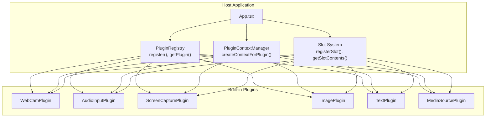
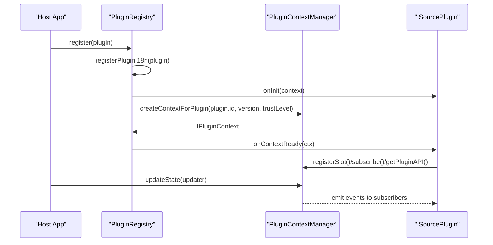
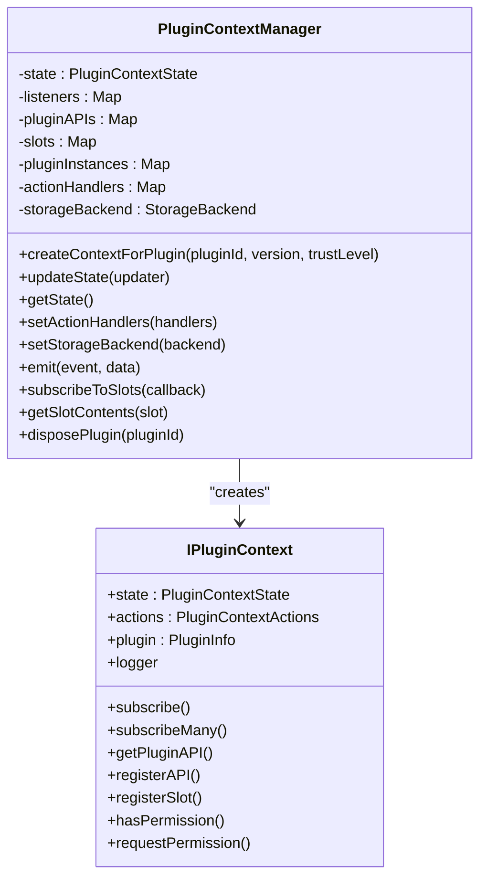
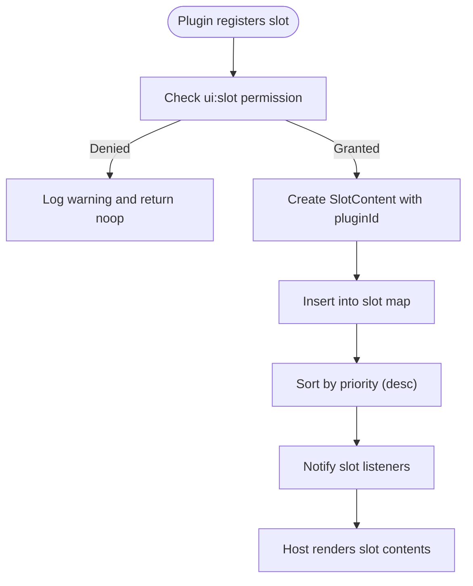
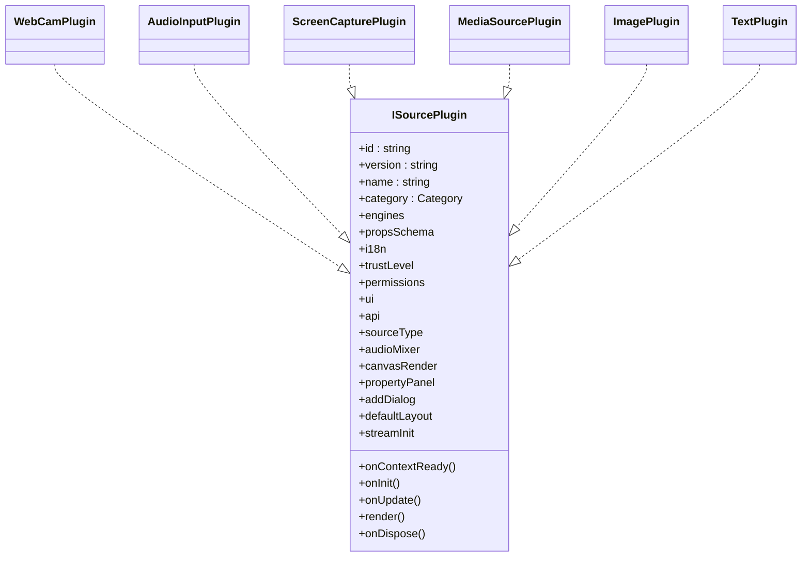
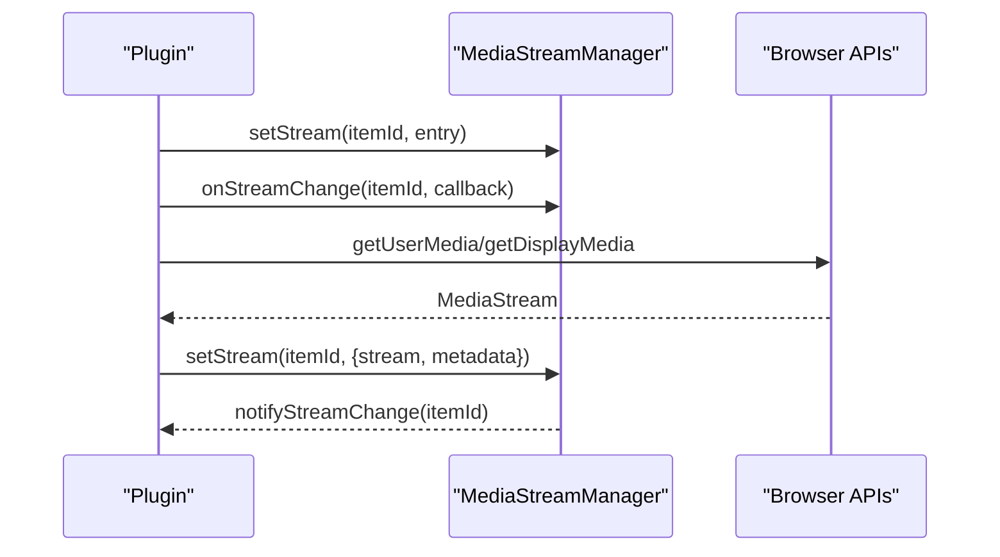
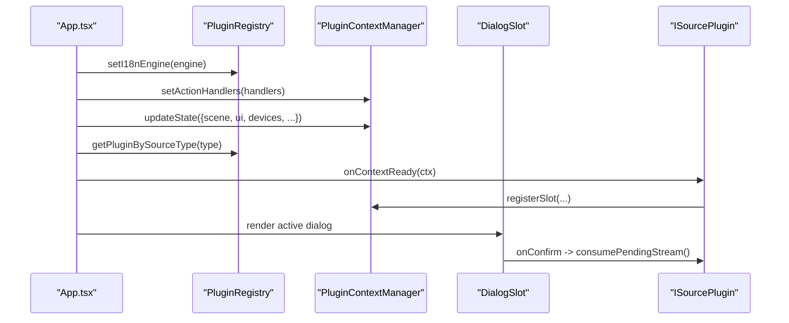
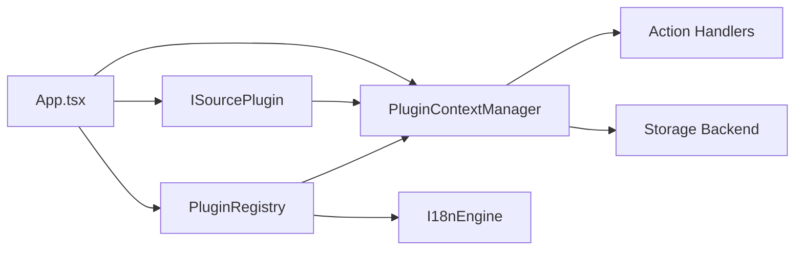

# Plugin Architecture Overview

<cite>
**Referenced Files in This Document**
- [plugin-registry.ts](file://src/services/plugin-registry.ts)
- [plugin-context.ts](file://src/services/plugin-context.ts)
- [plugin-slot.tsx](file://src/components/plugin-slot.tsx)
- [plugin.ts](file://src/types/plugin.ts)
- [plugin-context.ts](file://src/types/plugin-context.ts)
- [index.tsx](file://src/plugins/builtin/webcam/index.tsx)
- [index.tsx](file://src/plugins/builtin/audio-input/index.tsx)
- [screencapture-plugin.tsx](file://src/plugins/builtin/screencapture-plugin.tsx)
- [mediasource-plugin.tsx](file://src/plugins/builtin/mediasource-plugin.tsx)
- [image-plugin.tsx](file://src/plugins/builtin/image-plugin.tsx)
- [text-plugin.tsx](file://src/plugins/builtin/text-plugin.tsx)
- [media-stream-manager.ts](file://src/services/media-stream-manager.ts)
- [App.tsx](file://src/App.tsx)
</cite>

## Table of Contents
1. [Introduction](#introduction)
2. [Project Structure](#project-structure)
3. [Core Components](#core-components)
4. [Architecture Overview](#architecture-overview)
5. [Detailed Component Analysis](#detailed-component-analysis)
6. [Dependency Analysis](#dependency-analysis)
7. [Performance Considerations](#performance-considerations)
8. [Troubleshooting Guide](#troubleshooting-guide)
9. [Conclusion](#conclusion)

## Introduction
This document explains the LiveMixer Web plugin architecture, focusing on the PluginRegistry service, plugin lifecycle management, and context creation mechanisms. It documents plugin interface contracts, registration and discovery processes, and communication patterns between plugins and the host application. It also covers plugin categories, trust levels, and capability flags, and provides architectural diagrams showing plugin interactions, state management, and data flow. The document emphasizes separation of concerns among plugin registration, context management, and runtime execution, along with security and resource management considerations.

## Project Structure
The plugin system is organized around three primary layers:
- Registry and Discovery: Centralized registration and lookup of plugins
- Context Management: Secure, permissioned access to application state and actions
- Runtime Execution: Plugin rendering, UI integration, and media stream coordination

**Diagram sources**
- [App.tsx:27-29](file://src/App.tsx#L27-L29)
- [plugin-registry.ts:78-118](file://src/services/plugin-registry.ts#L78-L118)
- [plugin-context.ts:333-456](file://src/services/plugin-context.ts#L333-L456)
- [plugin-slot.tsx:192-264](file://src/components/plugin-slot.tsx#L192-L264)

**Section sources**
- [App.tsx:27-29](file://src/App.tsx#L27-L29)
- [plugin-registry.ts:78-118](file://src/services/plugin-registry.ts#L78-L118)
- [plugin-context.ts:333-456](file://src/services/plugin-context.ts#L333-L456)
- [plugin-slot.tsx:192-264](file://src/components/plugin-slot.tsx#L192-L264)

## Core Components
- PluginRegistry: Manages plugin registration, i18n resource registration, and initial context creation. It exposes discovery methods (by category, source type, audio mixer support) and triggers plugin initialization hooks.
- PluginContextManager: Provides secure, permissioned access to application state, actions, and events. It creates isolated contexts per plugin with scoped permissions and logging.
- Slot System: Enables plugins to register UI components into predefined or custom slots, with priority ordering and visibility conditions.
- Built-in Plugins: Implement the ISourcePlugin contract, define source type mappings, UI dialogs, and rendering logic.

Key responsibilities:
- Separation of concerns: Registry handles registration and discovery; Context Manager handles permissions and state; Plugins handle rendering and UI.
- Security: Permission gates on actions and UI capabilities; read-only state proxies; scoped logging.
- Resource management: MediaStreamManager centralizes media stream lifecycle; cleanup on plugin dispose.

**Section sources**
- [plugin-registry.ts:78-167](file://src/services/plugin-registry.ts#L78-L167)
- [plugin-context.ts:82-701](file://src/services/plugin-context.ts#L82-L701)
- [plugin-slot.tsx:192-264](file://src/components/plugin-slot.tsx#L192-L264)
- [media-stream-manager.ts:39-323](file://src/services/media-stream-manager.ts#L39-L323)

## Architecture Overview
The plugin architecture follows a host-managed, permissioned model:
- Host initializes i18n, sets action handlers, and updates application state
- Plugins register via PluginRegistry; onContextReady is invoked with a scoped context
- Plugins can subscribe to events, register UI slots, and request permissions
- Host maintains read-only state; plugins request changes via actions with permission checks

**Diagram sources**
- [plugin-registry.ts:78-118](file://src/services/plugin-registry.ts#L78-L118)
- [plugin-context.ts:333-456](file://src/services/plugin-context.ts#L333-L456)
- [plugin.ts:164-262](file://src/types/plugin.ts#L164-L262)

**Section sources**
- [plugin-registry.ts:78-118](file://src/services/plugin-registry.ts#L78-L118)
- [plugin-context.ts:333-456](file://src/services/plugin-context.ts#L333-L456)
- [plugin.ts:164-262](file://src/types/plugin.ts#L164-L262)

## Detailed Component Analysis

### PluginRegistry Service
Responsibilities:
- Registers plugins and synchronizes i18n resources
- Initializes plugin contexts with default capabilities and logs
- Exposes discovery APIs: getPlugin, getAllPlugins, getPluginsByCategory, getSourcePlugins, getPluginBySourceType, getAudioMixerPlugins
- Triggers onInit and onContextReady during registration

Design highlights:
- I18n resource expansion to nested namespace structure
- Default context includes logger and asset loader
- Delegation to PluginContextManager for full context creation

Security and isolation:
- Does not directly grant permissions; defers to PluginContextManager trust levels

**Section sources**
- [plugin-registry.ts:13-167](file://src/services/plugin-registry.ts#L13-L167)

### PluginContextManager
Core features:
- State management: Immutable, deep-merged updates; read-only proxies prevent direct mutation
- Action handlers: Strict permission checks before executing scene/ui/storage actions
- Event system: Publish-subscribe with error boundaries for listeners
- Slot system: Priority-based ordering and visibility filtering
- Plugin communication: API registration and retrieval with permission gating
- Disposal: Automatic cleanup of subscriptions, slots, and APIs

Permission system:
- Trust levels: builtin, verified, community, untrusted
- Default permissions mapped per trust level
- Permission requests and enforcement for sensitive operations

**Diagram sources**
- [plugin-context.ts:82-701](file://src/services/plugin-context.ts#L82-L701)
- [plugin-context.ts:322-403](file://src/types/plugin-context.ts#L322-L403)

**Section sources**
- [plugin-context.ts:82-701](file://src/services/plugin-context.ts#L82-L701)
- [plugin-context.ts:17-85](file://src/types/plugin-context.ts#L17-L85)

### Slot System Integration
The slot system enables UI composition:
- Plugins register components into named slots with priority and visibility conditions
- Host renders slots with filtered, sorted content
- Dialog slots combine multiple dialog sources

**Diagram sources**
- [plugin-context.ts:284-324](file://src/services/plugin-context.ts#L284-L324)
- [plugin-slot.tsx:192-264](file://src/components/plugin-slot.tsx#L192-L264)

**Section sources**
- [plugin-context.ts:284-324](file://src/services/plugin-context.ts#L284-L324)
- [plugin-slot.tsx:192-264](file://src/components/plugin-slot.tsx#L192-L264)

### Built-in Plugins and Rendering
Built-in plugins demonstrate the ISourcePlugin contract:
- WebCamPlugin: Device enumeration, stream management, mirroring, opacity, and rendering
- AudioInputPlugin: Microphone capture, volume/mute controls, and audio level visualization
- ScreenCapturePlugin: Browser display media capture with optional audio
- MediaSourcePlugin: Video/audio playback with caching and ghost indicators
- ImagePlugin: URL-based image rendering
- TextPlugin: Dynamic text rendering with font and color controls

**Diagram sources**
- [plugin.ts:164-262](file://src/types/plugin.ts#L164-L262)
- [index.tsx:110-478](file://src/plugins/builtin/webcam/index.tsx#L110-L478)
- [index.tsx:105-555](file://src/plugins/builtin/audio-input/index.tsx#L105-L555)
- [screencapture-plugin.tsx:55-464](file://src/plugins/builtin/screencapture-plugin.tsx#L55-L464)
- [mediasource-plugin.tsx:13-307](file://src/plugins/builtin/mediasource-plugin.tsx#L13-L307)
- [image-plugin.tsx:7-105](file://src/plugins/builtin/image-plugin.tsx#L7-L105)
- [text-plugin.tsx:4-110](file://src/plugins/builtin/text-plugin.tsx#L4-L110)

**Section sources**
- [plugin.ts:164-262](file://src/types/plugin.ts#L164-L262)
- [index.tsx:110-478](file://src/plugins/builtin/webcam/index.tsx#L110-L478)
- [index.tsx:105-555](file://src/plugins/builtin/audio-input/index.tsx#L105-L555)
- [screencapture-plugin.tsx:55-464](file://src/plugins/builtin/screencapture-plugin.tsx#L55-L464)
- [mediasource-plugin.tsx:13-307](file://src/plugins/builtin/mediasource-plugin.tsx#L13-L307)
- [image-plugin.tsx:7-105](file://src/plugins/builtin/image-plugin.tsx#L7-L105)
- [text-plugin.tsx:4-110](file://src/plugins/builtin/text-plugin.tsx#L4-L110)

### Media Stream Management
MediaStreamManager centralizes media lifecycle:
- Unified storage and change notifications
- Device enumeration with permission handling
- Pending stream handoff between dialogs and App
- Cleanup and disposal

**Diagram sources**
- [media-stream-manager.ts:39-323](file://src/services/media-stream-manager.ts#L39-L323)
- [index.tsx:261-337](file://src/plugins/builtin/webcam/index.tsx#L261-L337)
- [index.tsx:309-376](file://src/plugins/builtin/audio-input/index.tsx#L309-L376)
- [screencapture-plugin.tsx:191-258](file://src/plugins/builtin/screencapture-plugin.tsx#L191-L258)

**Section sources**
- [media-stream-manager.ts:39-323](file://src/services/media-stream-manager.ts#L39-L323)
- [index.tsx:261-337](file://src/plugins/builtin/webcam/index.tsx#L261-L337)
- [index.tsx:309-376](file://src/plugins/builtin/audio-input/index.tsx#L309-L376)
- [screencapture-plugin.tsx:191-258](file://src/plugins/builtin/screencapture-plugin.tsx#L191-L258)

### Host Integration and Runtime Execution
The host integrates plugins through:
- i18n engine initialization and registration
- Action handler configuration for context actions
- State synchronization to the context manager
- Slot-based dialog orchestration
- Plugin-driven item creation with stream initialization

**Diagram sources**
- [App.tsx:44-107](file://src/App.tsx#L44-L107)
- [App.tsx:167-187](file://src/App.tsx#L167-L187)
- [App.tsx:194-203](file://src/App.tsx#L194-L203)
- [App.tsx:280-362](file://src/App.tsx#L280-L362)
- [plugin-slot.tsx:320-363](file://src/components/plugin-slot.tsx#L320-L363)

**Section sources**
- [App.tsx:44-107](file://src/App.tsx#L44-L107)
- [App.tsx:167-187](file://src/App.tsx#L167-L187)
- [App.tsx:194-203](file://src/App.tsx#L194-L203)
- [App.tsx:280-362](file://src/App.tsx#L280-L362)
- [plugin-slot.tsx:320-363](file://src/components/plugin-slot.tsx#L320-L363)

## Dependency Analysis
The plugin system exhibits clear separation of concerns:
- Registry depends on PluginContextManager for context creation and on I18nEngine for localization
- Context Manager depends on action handlers and storage backend provided by the host
- Plugins depend on the context for state, actions, and UI integration
- Host orchestrates registration, context creation, and state synchronization

**Diagram sources**
- [plugin-registry.ts:1-8](file://src/services/plugin-registry.ts#L1-L8)
- [plugin-context.ts:99-137](file://src/services/plugin-context.ts#L99-L137)
- [App.tsx:27-29](file://src/App.tsx#L27-L29)

**Section sources**
- [plugin-registry.ts:1-8](file://src/services/plugin-registry.ts#L1-L8)
- [plugin-context.ts:99-137](file://src/services/plugin-context.ts#L99-L137)
- [App.tsx:27-29](file://src/App.tsx#L27-L29)

## Performance Considerations
- State updates: Deep merges minimize unnecessary re-renders; consider selective updates for large scenes
- Event listeners: Prefer subscribeMany for batching related subscriptions; ensure proper cleanup on dispose
- Media streams: Stop tracks and remove DOM elements on disposal; avoid memory leaks
- Rendering: Use lazy initialization for heavy resources (e.g., video elements); leverage visibility conditions in slots
- Slot sorting: Keep priority lists small and update only on changes

## Troubleshooting Guide
Common issues and resolutions:
- Permission denials: Verify plugin trust level and requested permissions; use requestPermission for non-builtin plugins
- UI slot not appearing: Confirm ui:slot permission and visibility conditions; ensure slot name matches predefined or custom slot
- Media stream errors: Check device permissions and labels; handle getUserMedia errors gracefully; validate stream end events
- Context disposal: Ensure all subscriptions and slots are cleaned up; verify plugin API removal
- i18n resource conflicts: Namespace collisions can be resolved by unique plugin identifiers; verify resource expansion logic

**Section sources**
- [plugin-context.ts:532-700](file://src/services/plugin-context.ts#L532-L700)
- [plugin-context.ts:461-483](file://src/services/plugin-context.ts#L461-L483)
- [media-stream-manager.ts:147-257](file://src/services/media-stream-manager.ts#L147-L257)
- [plugin-registry.ts:32-56](file://src/services/plugin-registry.ts#L32-L56)

## Conclusion
LiveMixer Web’s plugin architecture balances flexibility and safety through a centralized registry, a secure context manager, and a slot-based UI system. Plugins integrate seamlessly via standardized contracts, while the host maintains strict control over permissions, state, and actions. The design supports extensibility, clear separation of concerns, and robust resource management, enabling third-party plugins to extend functionality safely and efficiently.