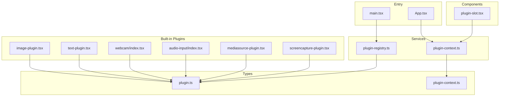
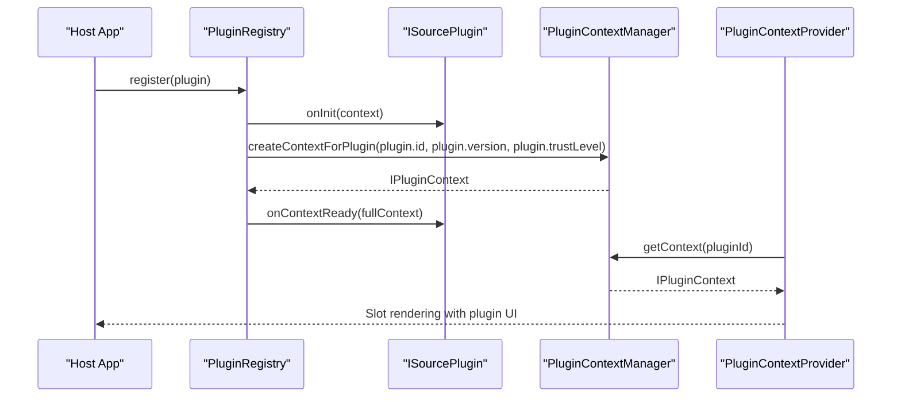
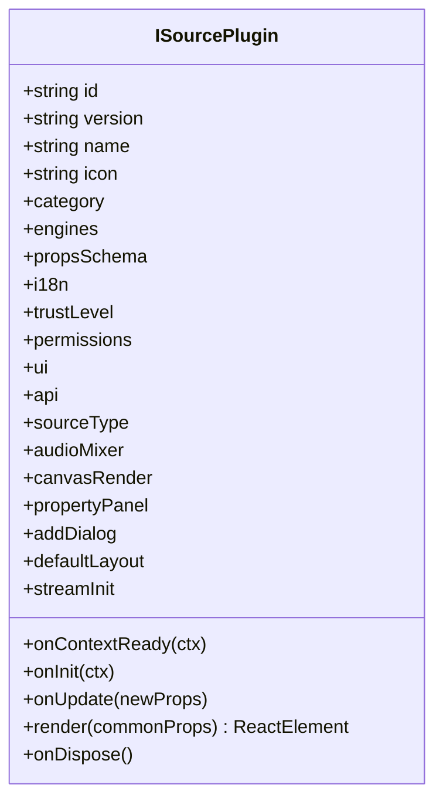
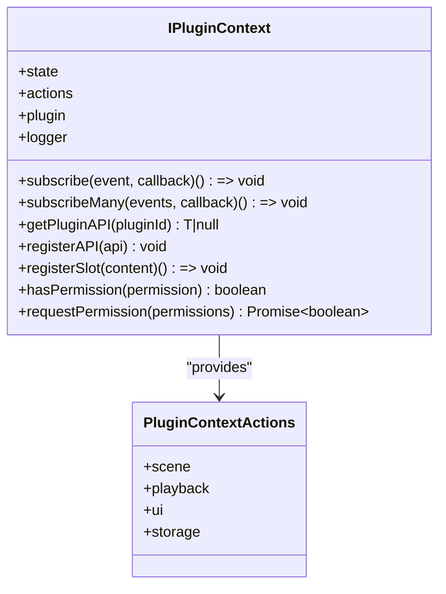
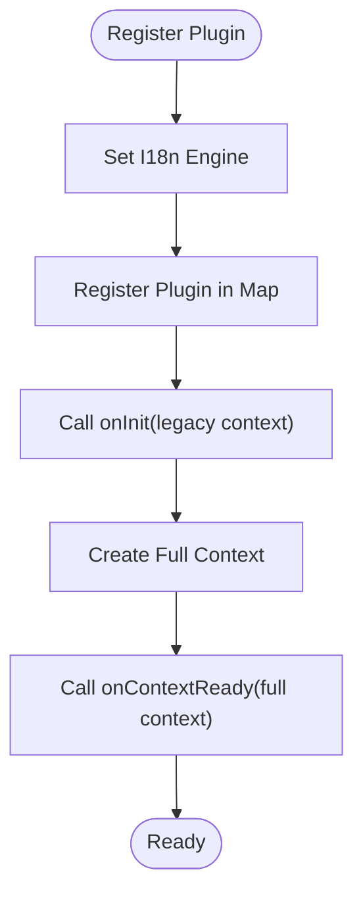
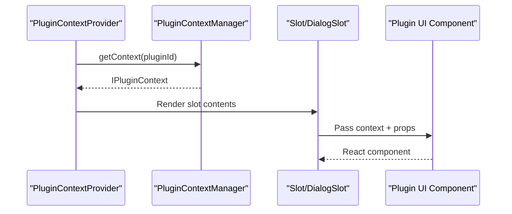
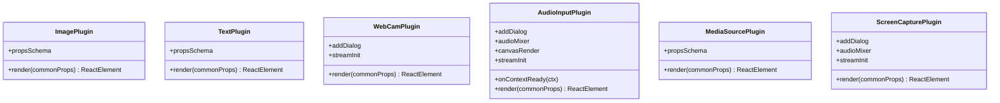
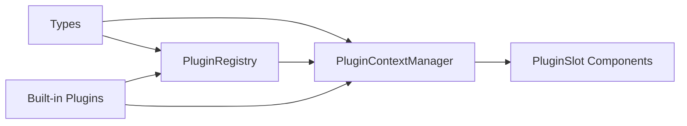

# Plugin Development Guide

<cite>
**Referenced Files in This Document**
- [plugin.ts](file://src/types/plugin.ts)
- [plugin-context.ts](file://src/types/plugin-context.ts)
- [plugin-context.ts](file://src/services/plugin-context.ts)
- [plugin-registry.ts](file://src/services/plugin-registry.ts)
- [plugin-slot.tsx](file://src/components/plugin-slot.tsx)
- [example-third-party-plugin.tsx](file://docs/plugin/example-third-party-plugin.tsx)
- [image-plugin.tsx](file://src/plugins/builtin/image-plugin.tsx)
- [text-plugin.tsx](file://src/plugins/builtin/text-plugin.tsx)
- [audio-input/index.tsx](file://src/plugins/builtin/audio-input/index.tsx)
- [webcam/index.tsx](file://src/plugins/builtin/webcam/index.tsx)
- [mediasource-plugin.tsx](file://src/plugins/builtin/mediasource-plugin.tsx)
- [screencapture-plugin.tsx](file://src/plugins/builtin/screencapture-plugin.tsx)
- [main.tsx](file://src/main.tsx)
- [App.tsx](file://src/App.tsx)
</cite>

## Table of Contents
1. [Introduction](#introduction)
2. [Project Structure](#project-structure)
3. [Core Components](#core-components)
4. [Architecture Overview](#architecture-overview)
5. [Detailed Component Analysis](#detailed-component-analysis)
6. [Dependency Analysis](#dependency-analysis)
7. [Performance Considerations](#performance-considerations)
8. [Troubleshooting Guide](#troubleshooting-guide)
9. [Conclusion](#conclusion)
10. [Appendices](#appendices)

## Introduction
This guide explains how to build custom plugins for LiveMixer Web. It covers the plugin interface, context usage, lifecycle methods, UI integration, and best practices for performance, memory management, and user experience. You will learn how to define plugin metadata, declare properties, render visuals, integrate with the plugin context, and register UI components into the host application.

## Project Structure
LiveMixer Web organizes plugin-related code across types, services, components, and built-in plugins:

- Types define the plugin contract, context API, permissions, and UI configuration.
- Services manage the plugin context, registry, and runtime integration.
- Components provide React hooks and slot rendering for UI integration.
- Built-in plugins demonstrate real-world implementations for images, text, webcam, audio input, media sources, and screen capture.

**Diagram sources**
- [main.tsx:14-20](file://src/main.tsx#L14-L20)
- [plugin-registry.ts:78-118](file://src/services/plugin-registry.ts#L78-L118)
- [plugin-context.ts:82-456](file://src/services/plugin-context.ts#L82-L456)
- [plugin-slot.tsx:49-116](file://src/components/plugin-slot.tsx#L49-L116)
- [image-plugin.tsx:7-105](file://src/plugins/builtin/image-plugin.tsx#L7-L105)
- [text-plugin.tsx:4-110](file://src/plugins/builtin/text-plugin.tsx#L4-L110)
- [webcam/index.tsx:110-478](file://src/plugins/builtin/webcam/index.tsx#L110-L478)
- [audio-input/index.tsx:105-555](file://src/plugins/builtin/audio-input/index.tsx#L105-L555)
- [mediasource-plugin.tsx:13-307](file://src/plugins/builtin/mediasource-plugin.tsx#L13-L307)
- [screencapture-plugin.tsx:55-464](file://src/plugins/builtin/screencapture-plugin.tsx#L55-L464)

**Section sources**
- [main.tsx:14-20](file://src/main.tsx#L14-L20)
- [plugin-registry.ts:78-118](file://src/services/plugin-registry.ts#L78-L118)
- [plugin-context.ts:82-456](file://src/services/plugin-context.ts#L82-L456)
- [plugin-slot.tsx:49-116](file://src/components/plugin-slot.tsx#L49-L116)

## Core Components
This section outlines the essential building blocks for plugin development.

- Plugin interface and lifecycle:
  - Required fields: id, version, name, category, engines, propsSchema.
  - Optional fields: i18n, sourceType, audioMixer, canvasRender, propertyPanel, addDialog, defaultLayout, streamInit.
  - Lifecycle methods: onInit, onUpdate, render, onDispose.
  - New extended context: onContextReady receives a full plugin context with permissions, actions, and UI registration.

- Plugin context API:
  - State: readonly application state snapshot.
  - Events: subscribe, subscribeMany for host/application events.
  - Actions: scene, playback, ui, storage operations with permission checks.
  - Communication: registerAPI, getPluginAPI for inter-plugin messaging.
  - Slots: registerSlot to inject UI into predefined locations.
  - Permissions: hasPermission, requestPermission, trust levels.
  - Logging: scoped logger with debug/info/warn/error.

- Registry and provider:
  - PluginRegistry registers plugins, sets i18n, and invokes onInit/onContextReady.
  - PluginContextProvider exposes context to React components and manages slot rendering.

**Section sources**
- [plugin.ts:164-262](file://src/types/plugin.ts#L164-L262)
- [plugin-context.ts:322-403](file://src/types/plugin-context.ts#L322-L403)
- [plugin-context.ts:42-76](file://src/services/plugin-context.ts#L42-L76)
- [plugin-registry.ts:78-118](file://src/services/plugin-registry.ts#L78-L118)
- [plugin-slot.tsx:49-116](file://src/components/plugin-slot.tsx#L49-L116)

## Architecture Overview
The plugin system separates concerns between plugin definition, runtime context, and UI integration:

- Plugin definition lives in plugin objects implementing ISourcePlugin.
- PluginRegistry loads plugins and calls onInit with a legacy context, then onContextReady with a full context.
- PluginContextManager creates isolated, permission-scoped contexts per plugin and manages state, events, slots, and inter-plugin communication.
- PluginSlot renders registered UI components into predefined slots and dialogs.

**Diagram sources**
- [plugin-registry.ts:78-118](file://src/services/plugin-registry.ts#L78-L118)
- [plugin-context.ts:333-456](file://src/services/plugin-context.ts#L333-L456)
- [plugin-slot.tsx:86-100](file://src/components/plugin-slot.tsx#L86-L100)

## Detailed Component Analysis

### Plugin Interface and Lifecycle
- Required fields:
  - id, version, name, category, engines, propsSchema.
- Optional UI and behavior:
  - sourceType, audioMixer, canvasRender, propertyPanel, addDialog, defaultLayout, streamInit.
- Lifecycle:
  - onInit: legacy initialization with basic context.
  - onContextReady: modern initialization with full context and permissions.
  - onUpdate: called when plugin properties change.
  - render: returns a React/Konva element for canvas rendering.
  - onDispose: cleanup hook.

**Diagram sources**
- [plugin.ts:164-262](file://src/types/plugin.ts#L164-L262)

**Section sources**
- [plugin.ts:164-262](file://src/types/plugin.ts#L164-L262)

### Plugin Context API
The context provides a secure, permissioned surface for plugins:

- State: readonly snapshot of application state.
- Events: subscribe to scene, playback, device, and UI changes.
- Actions: scene CRUD, playback control, UI dialogs and toasts, storage operations.
- Communication: registerAPI/getPluginAPI for inter-plugin messaging.
- Slots: registerSlot to place UI components in predefined areas.
- Permissions: trust levels and permission checks.
- Logging: scoped logger with plugin ID prefix.

**Diagram sources**
- [plugin-context.ts:322-403](file://src/types/plugin-context.ts#L322-L403)
- [plugin-context.ts:260-265](file://src/types/plugin-context.ts#L260-L265)

**Section sources**
- [plugin-context.ts:322-403](file://src/types/plugin-context.ts#L322-L403)
- [plugin-context.ts:260-265](file://src/types/plugin-context.ts#L260-L265)

### Plugin Registry and Initialization
The registry manages plugin registration, i18n, and lifecycle:

- Registers plugins and i18n resources.
- Invokes onInit with a legacy context.
- Creates and passes a full context to onContextReady.
- Exposes helpers to discover plugins by category, source type, and audio mixer support.

**Diagram sources**
- [plugin-registry.ts:78-118](file://src/services/plugin-registry.ts#L78-L118)

**Section sources**
- [plugin-registry.ts:78-118](file://src/services/plugin-registry.ts#L78-L118)

### React Integration and Slot System
The slot system enables UI integration:

- PluginContextProvider supplies contexts and state to the app.
- Slot renders registered components for specific slots (e.g., toolbar, sidebar, dialogs).
- DialogSlot renders active dialogs from registered slots.
- Error boundaries wrap slot content to prevent UI crashes.

**Diagram sources**
- [plugin-slot.tsx:49-116](file://src/components/plugin-slot.tsx#L49-L116)
- [plugin-slot.tsx:192-264](file://src/components/plugin-slot.tsx#L192-L264)
- [plugin-slot.tsx:320-363](file://src/components/plugin-slot.tsx#L320-L363)

**Section sources**
- [plugin-slot.tsx:49-116](file://src/components/plugin-slot.tsx#L49-L116)
- [plugin-slot.tsx:192-264](file://src/components/plugin-slot.tsx#L192-L264)
- [plugin-slot.tsx:320-363](file://src/components/plugin-slot.tsx#L320-L363)

### Built-in Plugin Patterns
Study these examples to understand common patterns:

- Image plugin: uses propsSchema for URL and styling, renders a Konva image, and integrates with i18n.
- Text plugin: renders text with configurable font size and color.
- Webcam plugin: requests camera permission, manages MediaStream, and renders video frames.
- Audio input plugin: registers dialogs via slots, manages streams, and integrates with audio mixer.
- Media source plugin: handles video/audio playback with caching and ghost mode.
- Screen capture plugin: requests screen permission, manages display media streams, and supports audio capture.

**Diagram sources**
- [image-plugin.tsx:7-105](file://src/plugins/builtin/image-plugin.tsx#L7-L105)
- [text-plugin.tsx:4-110](file://src/plugins/builtin/text-plugin.tsx#L4-L110)
- [webcam/index.tsx:110-478](file://src/plugins/builtin/webcam/index.tsx#L110-L478)
- [audio-input/index.tsx:105-555](file://src/plugins/builtin/audio-input/index.tsx#L105-L555)
- [mediasource-plugin.tsx:13-307](file://src/plugins/builtin/mediasource-plugin.tsx#L13-L307)
- [screencapture-plugin.tsx:55-464](file://src/plugins/builtin/screencapture-plugin.tsx#L55-L464)

**Section sources**
- [image-plugin.tsx:7-105](file://src/plugins/builtin/image-plugin.tsx#L7-L105)
- [text-plugin.tsx:4-110](file://src/plugins/builtin/text-plugin.tsx#L4-L110)
- [webcam/index.tsx:110-478](file://src/plugins/builtin/webcam/index.tsx#L110-L478)
- [audio-input/index.tsx:105-555](file://src/plugins/builtin/audio-input/index.tsx#L105-L555)
- [mediasource-plugin.tsx:13-307](file://src/plugins/builtin/mediasource-plugin.tsx#L13-L307)
- [screencapture-plugin.tsx:55-464](file://src/plugins/builtin/screencapture-plugin.tsx#L55-L464)

### Step-by-Step Plugin Development Guide
Follow these steps to create a custom plugin:

1. Define plugin metadata and schema
   - Choose id, version, name, category, and engines.
   - Define propsSchema with labels, types, defaults, and optional constraints (min/max/step/options).
   - Optionally add i18n resources and translation keys.

2. Implement lifecycle methods
   - onInit: initialize logging and basic setup.
   - onContextReady: request permissions, register slots, subscribe to events, and expose APIs.
   - onUpdate: handle property changes.
   - render: return a React/Konva element representing the plugin’s visual output.
   - onDispose: clean up timers, streams, and event listeners.

3. Integrate UI components
   - Use registerSlot to add toolbar buttons, property panel entries, or overlays.
   - For dialogs, register components into the dialogs or add-source-dialog slots.
   - Use actions to show dialogs and toasts.

4. Manage state and permissions
   - Use context.actions for scene, playback, UI, and storage operations.
   - Check permissions with hasPermission and requestPermission when needed.
   - Respect trust levels to limit capabilities.

5. Handle media and streams (optional)
   - For webcam/screen/audio, use streamInit and manage MediaStreams.
   - Cache streams and handle device changes.

6. Test and debug
   - Use context.logger for structured logs.
   - Wrap UI in error boundaries to avoid breaking the host.
   - Validate property updates and canvas rendering.

7. Register the plugin
   - Import your plugin and call pluginRegistry.register(yourPlugin) during app startup.

**Section sources**
- [plugin.ts:164-262](file://src/types/plugin.ts#L164-L262)
- [plugin-context.ts:322-403](file://src/types/plugin-context.ts#L322-L403)
- [plugin-registry.ts:78-118](file://src/services/plugin-registry.ts#L78-L118)
- [plugin-slot.tsx:192-264](file://src/components/plugin-slot.tsx#L192-L264)
- [example-third-party-plugin.tsx:15-173](file://docs/plugin/example-third-party-plugin.tsx#L15-L173)

### Plugin Context API Reference
- State: readonly snapshot of scene, playback, output, UI, devices, and user.
- Events: scene/item changes, playback controls, device changes, UI theme/language, plugin lifecycle.
- Actions:
  - scene: addItem, removeItem, updateItem, selectItem, reorderItems, duplicateItem.
  - playback: play, pause, stop, toggle.
  - ui: showDialog, closeDialog, showToast, setTheme, setLanguage.
  - storage: get, set, remove, clear.
- Communication: registerAPI, getPluginAPI.
- Slots: registerSlot with id, slot, component, props, priority, visibility.
- Permissions: scene, playback, devices, storage, ui, plugin:communicate.
- Logging: debug, info, warn, error.

**Section sources**
- [plugin-context.ts:150-191](file://src/types/plugin-context.ts#L150-L191)
- [plugin-context.ts:202-265](file://src/types/plugin-context.ts#L202-L265)
- [plugin-context.ts:271-315](file://src/types/plugin-context.ts#L271-L315)
- [plugin-context.ts:322-403](file://src/types/plugin-context.ts#L322-L403)

### Example Plugin Structure
See a complete example of a third-party plugin with props, i18n, add dialog, and render logic.

**Section sources**
- [example-third-party-plugin.tsx:15-173](file://docs/plugin/example-third-party-plugin.tsx#L15-L173)

## Dependency Analysis
The plugin system exhibits clear separation of concerns:

- Types define contracts for plugins and contexts.
- Services encapsulate context creation, permission enforcement, and slot management.
- Components provide React integration and UI rendering.
- Built-in plugins demonstrate best practices and serve as reference implementations.

**Diagram sources**
- [plugin.ts:164-262](file://src/types/plugin.ts#L164-L262)
- [plugin-context.ts:322-403](file://src/types/plugin-context.ts#L322-L403)
- [plugin-registry.ts:78-118](file://src/services/plugin-registry.ts#L78-L118)
- [plugin-context.ts:82-456](file://src/services/plugin-context.ts#L82-L456)
- [plugin-slot.tsx:49-116](file://src/components/plugin-slot.tsx#L49-L116)

**Section sources**
- [plugin.ts:164-262](file://src/types/plugin.ts#L164-L262)
- [plugin-context.ts:322-403](file://src/types/plugin-context.ts#L322-L403)
- [plugin-registry.ts:78-118](file://src/services/plugin-registry.ts#L78-L118)
- [plugin-context.ts:82-456](file://src/services/plugin-context.ts#L82-L456)
- [plugin-slot.tsx:49-116](file://src/components/plugin-slot.tsx#L49-L116)

## Performance Considerations
- Minimize DOM and canvas updates:
  - Use memoization and stable references for props.
  - Avoid unnecessary re-renders by deriving state locally.
- Efficient media handling:
  - Cache video elements and streams; reuse rather than recreate.
  - Stop tracks and remove elements in onDispose.
- Event subscriptions:
  - Unsubscribe from context events and stream changes in onDispose.
- Rendering:
  - Keep render functions pure and fast.
  - Defer heavy computations off the main thread when possible.
- Memory management:
  - Clear caches and cancel animations in cleanup.
  - Avoid retaining references to removed DOM nodes.

[No sources needed since this section provides general guidance]

## Troubleshooting Guide
Common issues and resolutions:

- Permission errors:
  - Use hasPermission to check capabilities before invoking actions.
  - Call requestPermission for additional permissions when needed.

- UI not appearing:
  - Verify registerSlot is called in onContextReady with correct slot name and priority.
  - Ensure the plugin’s trust level grants ui:slot permission.

- Streams not connecting:
  - Confirm addDialog.immediate or needsBrowserPermission is configured correctly.
  - Check device availability and user consent prompts.

- Property updates not applied:
  - Ensure propsSchema matches item properties and defaults are set.
  - Implement onUpdate to react to changes.

- Crashes in plugin UI:
  - Wrap plugin components in error boundaries (SlotContentWrapper pattern).
  - Log errors via context.logger and degrade gracefully.

**Section sources**
- [plugin-context.ts:322-403](file://src/types/plugin-context.ts#L322-L403)
- [plugin-slot.tsx:274-302](file://src/components/plugin-slot.tsx#L274-L302)
- [audio-input/index.tsx:238-248](file://src/plugins/builtin/audio-input/index.tsx#L238-L248)
- [webcam/index.tsx:217-227](file://src/plugins/builtin/webcam/index.tsx#L217-L227)
- [mediasource-plugin.tsx:117-198](file://src/plugins/builtin/mediasource-plugin.tsx#L117-L198)

## Conclusion
LiveMixer Web’s plugin system offers a robust, permissioned, and extensible framework. By adhering to the plugin interface, leveraging the context API, and following the built-in plugin patterns, you can develop high-performance, user-friendly plugins that integrate seamlessly with the host application.

[No sources needed since this section summarizes without analyzing specific files]

## Appendices

### Best Practices Checklist
- Define clear propsSchema with sensible defaults.
- Implement onContextReady for UI registration and event subscriptions.
- Use actions exclusively for state changes.
- Request only necessary permissions.
- Provide graceful fallbacks and error handling.
- Cache media resources and clean up in onDispose.
- Keep render logic efficient and declarative.

[No sources needed since this section provides general guidance]