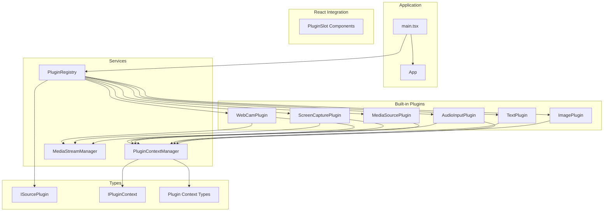
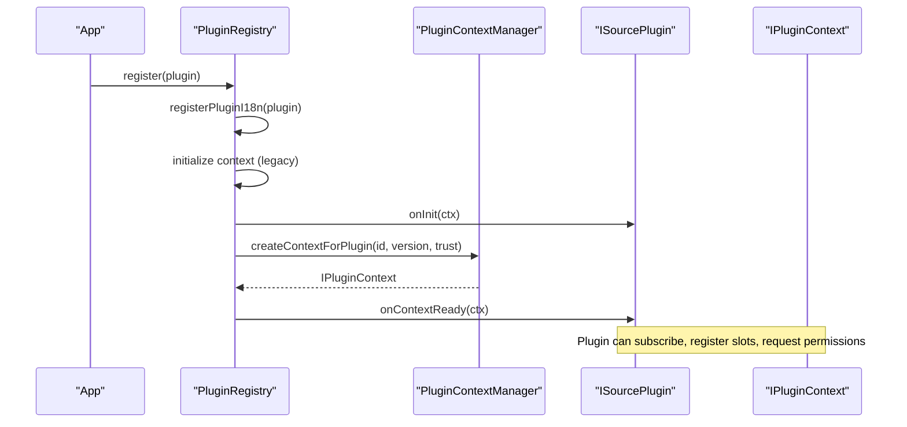
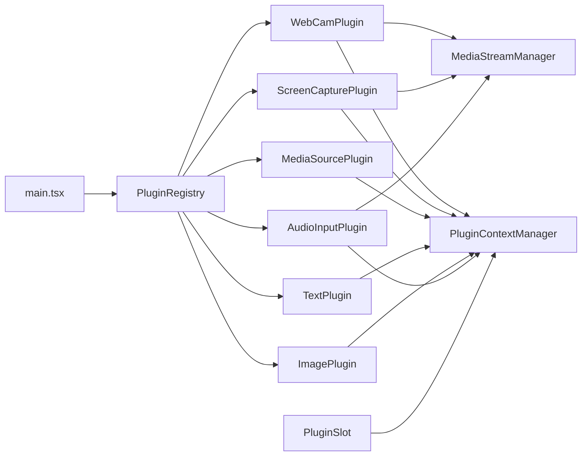
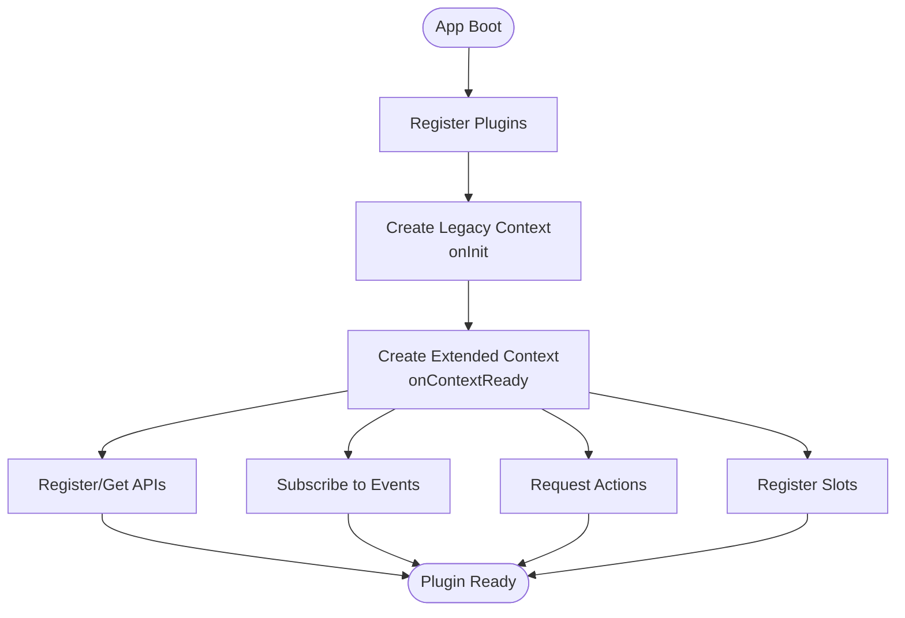

# Plugin System

<cite>
**Referenced Files in This Document**
- [plugin-registry.ts](file://src/services/plugin-registry.ts)
- [plugin-context.ts](file://src/services/plugin-context.ts)
- [plugin-context.ts](file://src/types/plugin-context.ts)
- [plugin.ts](file://src/types/plugin.ts)
- [webcam/index.tsx](file://src/plugins/builtin/webcam/index.tsx)
- [audio-input/index.tsx](file://src/plugins/builtin/audio-input/index.tsx)
- [image-plugin.tsx](file://src/plugins/builtin/image-plugin.tsx)
- [text-plugin.tsx](file://src/plugins/builtin/text-plugin.tsx)
- [screencapture-plugin.tsx](file://src/plugins/builtin/screencapture-plugin.tsx)
- [mediasource-plugin.tsx](file://src/plugins/builtin/mediasource-plugin.tsx)
- [plugin-slot.tsx](file://src/components/plugin-slot.tsx)
- [media-stream-manager.ts](file://src/services/media-stream-manager.ts)
- [main.tsx](file://src/main.tsx)
- [example-third-party-plugin.tsx](file://docs/plugin/example-third-party-plugin.tsx)
</cite>

## Table of Contents
1. [Introduction](#introduction)
2. [Project Structure](#project-structure)
3. [Core Components](#core-components)
4. [Architecture Overview](#architecture-overview)
5. [Detailed Component Analysis](#detailed-component-analysis)
6. [Dependency Analysis](#dependency-analysis)
7. [Performance Considerations](#performance-considerations)
8. [Troubleshooting Guide](#troubleshooting-guide)
9. [Conclusion](#conclusion)
10. [Appendices](#appendices)

## Introduction
This document explains the plugin system architecture for LiveMixer Web. It covers plugin registration, lifecycle management, context creation, and coordination via the PluginRegistry service. It documents built-in plugins (webcam, screen capture, media source, text, image, audio input), the plugin development process, communication mechanisms, state management, and internationalization support. Practical examples demonstrate how to create and integrate plugins, including third-party integration patterns.

## Project Structure
LiveMixer Web organizes plugin-related code under:
- Services: PluginRegistry, PluginContextManager, MediaStreamManager
- Types: Plugin interfaces and context contracts
- Built-in Plugins: Webcam, Screen Capture, Media Source, Text, Image, Audio Input
- React Integration: PluginSlot and dialog rendering
- Application Bootstrap: main.tsx registers built-in plugins

**Diagram sources**
- [main.tsx:14-20](file://src/main.tsx#L14-L20)
- [plugin-registry.ts:78-118](file://src/services/plugin-registry.ts#L78-L118)
- [plugin-context.ts:82-456](file://src/services/plugin-context.ts#L82-L456)
- [media-stream-manager.ts:39-323](file://src/services/media-stream-manager.ts#L39-L323)
- [plugin-slot.tsx:192-264](file://src/components/plugin-slot.tsx#L192-L264)

**Section sources**
- [main.tsx:14-20](file://src/main.tsx#L14-L20)

## Core Components
- PluginRegistry: Central coordinator for plugin registration, i18n resource registration, and initial context creation. It exposes discovery methods (by category, source type, audio mixer support).
- PluginContextManager: Manages application state, event subscriptions, slot system, plugin APIs, and creates secure plugin contexts with permission enforcement.
- MediaStreamManager: Unified service for managing media streams across plugins, including device enumeration and dialog-to-app stream handoff.
- PluginSlot: React integration layer exposing Slot and DialogSlot components for rendering plugin UI registered via the slot system.

Key responsibilities:
- Registration: Plugins are registered once during app bootstrap.
- Lifecycle: Plugins receive onInit legacy context and onContextReady extended context with full capabilities.
- Context: Each plugin receives a scoped, permissioned context with readonly state, actions, event subscriptions, slot registration, and logging.
- Communication: Plugins can register/get APIs for inter-plugin communication.
- UI: Plugins can register UI components into predefined or custom slots.

**Section sources**
- [plugin-registry.ts:78-167](file://src/services/plugin-registry.ts#L78-L167)
- [plugin-context.ts:82-708](file://src/services/plugin-context.ts#L82-L708)
- [plugin-slot.tsx:192-363](file://src/components/plugin-slot.tsx#L192-L363)
- [media-stream-manager.ts:39-323](file://src/services/media-stream-manager.ts#L39-L323)

## Architecture Overview
The plugin system is event-driven and permission-controlled:
- App bootstraps built-in plugins via PluginRegistry.
- PluginRegistry initializes each plugin with a legacy context and then calls onContextReady with a full, permissioned context from PluginContextManager.
- Plugins can subscribe to events, request actions, register slots, and communicate with other plugins.
- MediaStreamManager coordinates media device access and stream lifecycles for media plugins.

**Diagram sources**
- [plugin-registry.ts:78-118](file://src/services/plugin-registry.ts#L78-L118)
- [plugin-context.ts:333-456](file://src/services/plugin-context.ts#L333-L456)

## Detailed Component Analysis

### PluginRegistry
Responsibilities:
- Registers plugins and registers their i18n resources into the global I18nEngine.
- Expands dot-notation namespaces into nested resource objects.
- Creates legacy IPluginContext for onInit and extended IPluginContext via PluginContextManager for onContextReady.
- Provides discovery APIs: getPlugin, getAllPlugins, getPluginsByCategory, getSourcePlugins, getPluginBySourceType, getAudioMixerPlugins.

Key behaviors:
- On registration, logs plugin id/version and initializes context.
- Calls onInit with legacy context and onContextReady with extended context.
- Exposes helper to expand namespaces for i18n resource registration.

**Section sources**
- [plugin-registry.ts:13-56](file://src/services/plugin-registry.ts#L13-L56)
- [plugin-registry.ts:78-118](file://src/services/plugin-registry.ts#L78-L118)
- [plugin-registry.ts:120-164](file://src/services/plugin-registry.ts#L120-L164)

### PluginContextManager
Responsibilities:
- Maintains application state (scene, playback, output, ui, devices, user).
- Emits typed events plugins can subscribe to.
- Provides actions (scene, playback, ui, storage) with permission checks.
- Manages slot system: register, sort by priority, visibility conditions, and change notifications.
- Creates scoped plugin contexts with readonly state proxies, permission enforcement, and scoped logging.
- Supports inter-plugin communication via registerAPI/getPluginAPI.
- Disposes plugin contexts and cleans up subscriptions, slots, and APIs.

Security and permissions:
- Default permissions vary by trust level (builtin, verified, community, untrusted).
- Permission checks enforced in actions and slot registration.
- requestPermission currently auto-grants for builtin plugins.

State management:
- Deep readonly proxy prevents direct mutations; updates must go through actions.
- updateState merges partial updates safely.

**Section sources**
- [plugin-context.ts:42-76](file://src/services/plugin-context.ts#L42-L76)
- [plugin-context.ts:138-216](file://src/services/plugin-context.ts#L138-L216)
- [plugin-context.ts:247-264](file://src/services/plugin-context.ts#L247-L264)
- [plugin-context.ts:284-324](file://src/services/plugin-context.ts#L284-L324)
- [plugin-context.ts:333-456](file://src/services/plugin-context.ts#L333-L456)
- [plugin-context.ts:461-483](file://src/services/plugin-context.ts#L461-L483)

### MediaStreamManager
Responsibilities:
- Centralized management of MediaStreamEntry keyed by item id.
- Stream lifecycle: set, get, remove, has, getAll.
- Event system: onStreamChange with listener management.
- Device enumeration: unified methods for video/audio input/output with permission handling.
- Pending stream handoff: setPendingStream/consumePendingStream for dialog-to-app communication.

Integration with built-in plugins:
- Webcam, Screen Capture, and Audio Input plugins rely on MediaStreamManager for stream caching, device access, and dialog-to-app stream passing.

**Section sources**
- [media-stream-manager.ts:39-323](file://src/services/media-stream-manager.ts#L39-L323)

### PluginSlot (React Integration)
Responsibilities:
- PluginContextProvider initializes and exposes plugin context system to React.
- Slot component renders registered slot contents ordered by priority and filtered by visibility.
- DialogSlot renders active dialogs from both 'dialogs' and 'add-source-dialog' slots.
- Utility hooks: usePluginContext, usePluginState, usePluginEvent, useSlotHasContent, useSlotContentCount.

**Section sources**
- [plugin-slot.tsx:56-116](file://src/components/plugin-slot.tsx#L56-L116)
- [plugin-slot.tsx:192-264](file://src/components/plugin-slot.tsx#L192-L264)
- [plugin-slot.tsx:320-363](file://src/components/plugin-slot.tsx#L320-L363)

### Built-in Plugins

#### Webcam Plugin
Capabilities:
- Source type mapping for video_input.
- Immediate add dialog for device selection.
- Stream initialization with needsStream and streamType.
- Properties: deviceId, muted, volume, opacity, mirror.
- i18n resources for English and Chinese.
- Legacy webcamStreamCache and pending stream helpers for backward compatibility.

Rendering:
- Uses Konva nodes to render video frames.
- Manages video element lifecycle and stream cleanup.
- Mirrors video when enabled.

**Section sources**
- [webcam/index.tsx:110-478](file://src/plugins/builtin/webcam/index.tsx#L110-L478)

#### Screen Capture Plugin
Capabilities:
- Source type mapping for screen_capture.
- Immediate browser permission request for screen capture.
- Audio mixer support with volume/muted controls.
- Stream initialization with needsStream and streamType.
- Properties: captureAudio, muted, volume, opacity, showVideo.
- i18n resources for English and Chinese.

Rendering:
- Double-click to start/restart capture.
- Shows re-select button overlay.
- Displays source title below the canvas.

**Section sources**
- [screencapture-plugin.tsx:55-464](file://src/plugins/builtin/screencapture-plugin.tsx#L55-L464)

#### Media Source Plugin
Capabilities:
- Source type mapping for media.
- No immediate dialog; configure in property panel.
- Properties: url, showVideo, loop, muted, volume, opacity.
- i18n resources for English and Chinese.

Rendering:
- Video mode: renders video frames with opacity and border radius.
- Ghost indicator mode: transparent placeholder for audio-only items.

**Section sources**
- [mediasource-plugin.tsx:13-307](file://src/plugins/builtin/mediasource-plugin.tsx#L13-L307)

#### Text Plugin
Capabilities:
- Source type mapping for text.
- No immediate dialog; configure in property panel.
- Properties: content, fontSize, color.
- i18n resources for English and Chinese.

Rendering:
- Renders Konva text with alignment and color.

**Section sources**
- [text-plugin.tsx:4-110](file://src/plugins/builtin/text-plugin.tsx#L4-L110)

#### Image Plugin
Capabilities:
- Source type mapping for image.
- No immediate dialog; configure in property panel.
- Properties: url, borderRadius.
- i18n resources for English and Chinese.

Rendering:
- Loads images via useImage hook and renders with Konva Image.

**Section sources**
- [image-plugin.tsx:7-105](file://src/plugins/builtin/image-plugin.tsx#L7-L105)

#### Audio Input Plugin
Capabilities:
- Source type mapping for audio_input.
- Immediate add dialog for device selection.
- Audio mixer support with volume/muted controls and showOnCanvas filtering.
- Stream initialization with needsStream and streamType.
- Properties: deviceId, muted, volume, showOnCanvas.
- i18n resources for English and Chinese.

Rendering:
- Invisible placeholder when showOnCanvas is false.
- Visual audio level meter when capturing.

**Section sources**
- [audio-input/index.tsx:105-555](file://src/plugins/builtin/audio-input/index.tsx#L105-L555)

### Plugin Development Process
Requirements:
- Implement ISourcePlugin with metadata (id, version, name, category, engines), propsSchema, and lifecycle hooks (onInit, onUpdate, render, onDispose).
- Optionally define sourceType, audioMixer, canvasRender, propertyPanel, addDialog, defaultLayout, streamInit, i18n, ui, api, trustLevel, permissions.
- Use onContextReady to register slots, subscribe to events, and request permissions.

Context usage:
- Legacy context (IPluginContext) provides canvasWidth, canvasHeight, logger, and assetLoader.
- Extended context (IPluginContextNew) provides readonly state, subscribe/subscribeMany, actions, getPluginAPI/registerAPI, registerSlot, plugin info, hasPermission/requestPermission, and scoped logger.

Integration patterns:
- Register UI via ctx.registerSlot into predefined or custom slots.
- Request actions via ctx.actions (scene, playback, ui, storage) with automatic permission checks.
- Inter-plugin communication via ctx.registerAPI and ctx.getPluginAPI.
- Internationalization via plugin.i18n with dot-notation namespaces expanded into nested resources.

**Section sources**
- [plugin.ts:164-262](file://src/types/plugin.ts#L164-L262)
- [plugin-context.ts:322-403](file://src/types/plugin-context.ts#L322-L403)
- [plugin-context.ts:333-456](file://src/services/plugin-context.ts#L333-L456)

### Third-Party Plugin Integration
Pattern:
- Define a plugin implementing ISourcePlugin.
- Import the plugin in main.tsx and call pluginRegistry.register(plugin).
- Use plugin.i18n to register localized strings.
- Use ctx.registerSlot to expose UI into the app.

Example:
- See example-third-party-plugin.tsx for a minimal widget plugin with props, i18n, and render logic.

Best practices:
- Keep UI registration in onContextReady.
- Use actions for state changes instead of mutating state directly.
- Request only necessary permissions via requestPermission.
- Provide clear addDialog configurations for media plugins.

**Section sources**
- [example-third-party-plugin.tsx:15-173](file://docs/plugin/example-third-party-plugin.tsx#L15-L173)
- [main.tsx:14-20](file://src/main.tsx#L14-L20)

### Plugin Communication Mechanisms
- Inter-plugin API: ctx.registerAPI(api) and ctx.getPluginAPI(pluginId) with 'plugin:communicate' permission.
- Event system: ctx.subscribe/ctx.subscribeMany to listen to typed events (scene, playback, devices, ui).
- Slot system: ctx.registerSlot to publish UI components into shared slots.

**Section sources**
- [plugin-context.ts:395-403](file://src/services/plugin-context.ts#L395-L403)
- [plugin-context.ts:333-347](file://src/services/plugin-context.ts#L333-L347)
- [plugin-context.ts:372-373](file://src/services/plugin-context.ts#L372-L373)

### State Management
- Readonly state proxy ensures immutability; updates must use actions.
- Deep merge updates in updateState preserve nested structures.
- Events emitted for state changes enable reactive UI.

**Section sources**
- [plugin-context.ts:187-216](file://src/services/plugin-context.ts#L187-L216)
- [plugin-context.ts:489-516](file://src/services/plugin-context.ts#L489-L516)

### Internationalization Support
- PluginRegistry expands dot-notation namespaces into nested i18n resources.
- Resources are registered under a unique namespace identifier prefixed with '__plugin_'.
- Plugins declare i18n.defaultLanguage, supportedLanguages, and resources with nested objects.

**Section sources**
- [plugin-registry.ts:32-56](file://src/services/plugin-registry.ts#L32-L56)
- [plugin-registry.ts:63-76](file://src/services/plugin-registry.ts#L63-L76)

## Dependency Analysis
High-level dependencies:
- main.tsx depends on PluginRegistry and built-in plugins.
- Built-in plugins depend on PluginContextManager and MediaStreamManager.
- PluginSlot depends on PluginContextManager and React context.

**Diagram sources**
- [main.tsx:14-20](file://src/main.tsx#L14-L20)
- [plugin-registry.ts:78-118](file://src/services/plugin-registry.ts#L78-L118)
- [plugin-slot.tsx:192-264](file://src/components/plugin-slot.tsx#L192-L264)

**Section sources**
- [main.tsx:14-20](file://src/main.tsx#L14-L20)
- [plugin-registry.ts:78-118](file://src/services/plugin-registry.ts#L78-L118)
- [plugin-slot.tsx:192-264](file://src/components/plugin-slot.tsx#L192-L264)

## Performance Considerations
- Stream caching: MediaStreamManager caches streams to avoid redundant getUserMedia calls and to reduce device churn.
- Lazy initialization: Plugins initialize streams only when device ids change or when needed (e.g., double-click to start screen capture).
- Event polling: PluginSlot provider uses a polling interval to detect state changes; in production, consider a more efficient subscription mechanism.
- Rendering: Built-in plugins minimize re-renders by updating only necessary properties (e.g., muted/volume without reloading video).

[No sources needed since this section provides general guidance]

## Troubleshooting Guide
Common issues and resolutions:
- Plugin not appearing in add-source-dialog: Ensure sourceType is defined and sourceType.typeId matches SceneItem.type.
- Permission errors for media devices: Verify browser permissions and device enumeration fallbacks in MediaStreamManager.
- Streams not updating: Confirm onStreamChange listeners are subscribed and notifyStreamChange is invoked after stream updates.
- UI not rendering in slots: Check slot registration priorities and visibility conditions; ensure pluginId is correctly set.
- i18n not loading: Verify plugin.i18n.resources and that PluginRegistry.registerPluginI18n is called after I18nEngine is set.

**Section sources**
- [media-stream-manager.ts:147-257](file://src/services/media-stream-manager.ts#L147-L257)
- [plugin-registry.ts:32-56](file://src/services/plugin-registry.ts#L32-L56)
- [plugin-slot.tsx:204-230](file://src/components/plugin-slot.tsx#L204-L230)

## Conclusion
LiveMixer Web’s plugin system provides a robust, permissioned, and extensible framework for building interactive media sources and widgets. The PluginRegistry and PluginContextManager coordinate registration, context creation, and stateful interactions. Built-in plugins demonstrate best practices for media device access, stream management, UI registration, and internationalization. Third-party plugins can integrate seamlessly by adhering to the ISourcePlugin contract and leveraging the slot and event systems.

[No sources needed since this section summarizes without analyzing specific files]

## Appendices

### Plugin Lifecycle Flow

**Diagram sources**
- [plugin-registry.ts:78-118](file://src/services/plugin-registry.ts#L78-L118)
- [plugin-context.ts:333-456](file://src/services/plugin-context.ts#L333-L456)