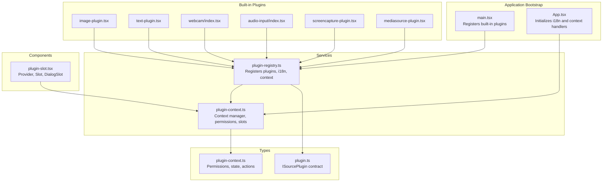
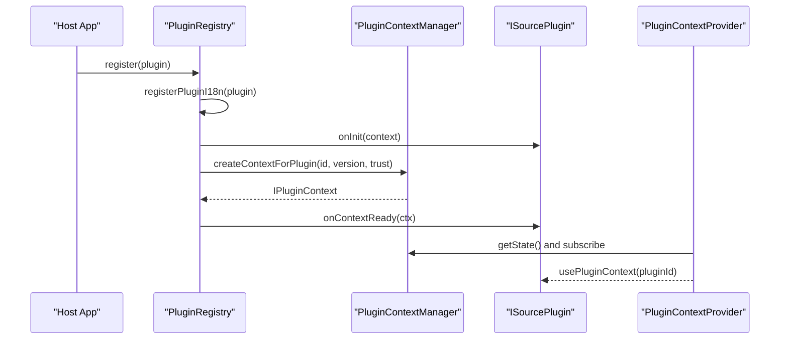
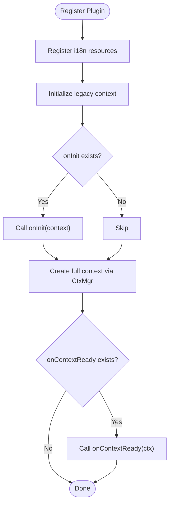
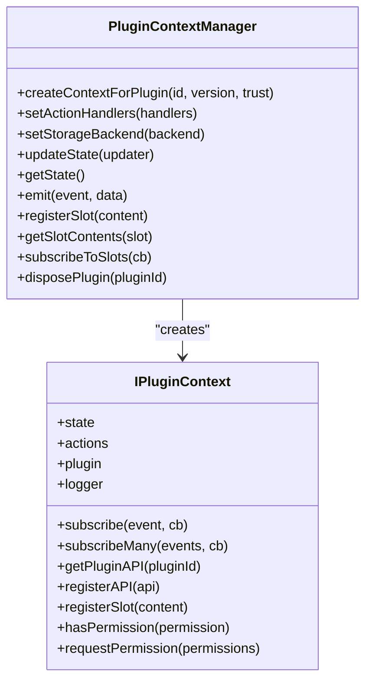
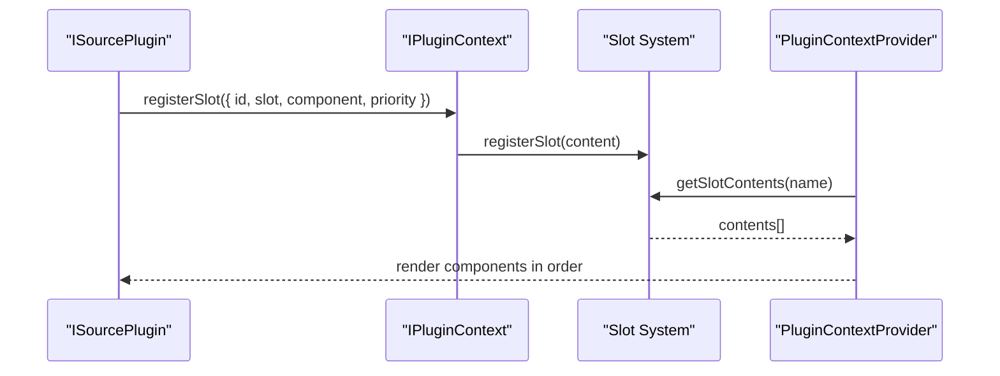
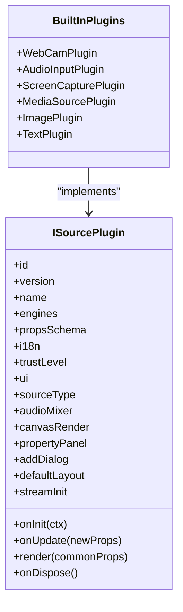
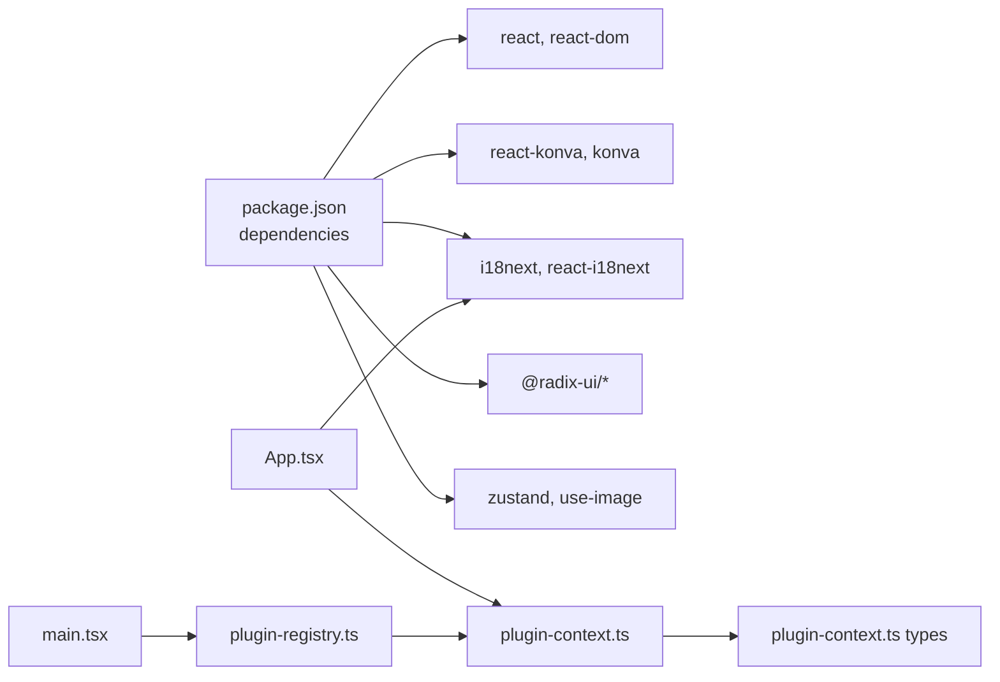

# Third-party Plugin Integration

<cite>
**Referenced Files in This Document**
- [plugin-registry.ts](file://src/services/plugin-registry.ts)
- [plugin-context.ts](file://src/services/plugin-context.ts)
- [plugin-slot.tsx](file://src/components/plugin-slot.tsx)
- [plugin.ts](file://src/types/plugin.ts)
- [plugin-context.ts](file://src/types/plugin-context.ts)
- [main.tsx](file://src/main.tsx)
- [App.tsx](file://src/App.tsx)
- [example-third-party-plugin.tsx](file://docs/plugin/example-third-party-plugin.tsx)
- [image-plugin.tsx](file://src/plugins/builtin/image-plugin.tsx)
- [text-plugin.tsx](file://src/plugins/builtin/text-plugin.tsx)
- [webcam/index.tsx](file://src/plugins/builtin/webcam/index.tsx)
- [audio-input/index.tsx](file://src/plugins/builtin/audio-input/index.tsx)
- [screencapture-plugin.tsx](file://src/plugins/builtin/screencapture-plugin.tsx)
- [mediasource-plugin.tsx](file://src/plugins/builtin/mediasource-plugin.tsx)
- [package.json](file://package.json)
</cite>

## Table of Contents
1. [Introduction](#introduction)
2. [Project Structure](#project-structure)
3. [Core Components](#core-components)
4. [Architecture Overview](#architecture-overview)
5. [Detailed Component Analysis](#detailed-component-analysis)
6. [Dependency Analysis](#dependency-analysis)
7. [Performance Considerations](#performance-considerations)
8. [Troubleshooting Guide](#troubleshooting-guide)
9. [Conclusion](#conclusion)
10. [Appendices](#appendices)

## Introduction
This document explains how to integrate third-party plugins into LiveMixer Web. It covers the plugin registration process, dependency management, version compatibility, loading mechanisms, security and trust levels, integration patterns for external packages, distribution and installation approaches, update strategies, troubleshooting, and marketplace considerations.

LiveMixer Web provides a robust plugin framework that enables developers to extend functionality safely and efficiently. Plugins are registered through a central registry, receive a scoped, permission-controlled context, and can render UI components into predefined slots. Built-in plugins demonstrate patterns for media sources, widgets, and effects, serving as templates for third-party integrations.

## Project Structure
The plugin system spans several modules:
- Services: Registry and context managers orchestrate plugin lifecycle and permissions
- Types: Define plugin contracts, permissions, and UI integration points
- Components: React provider and slot system for UI integration
- Built-in Plugins: Examples of media, text, webcam, audio input, screen capture, and media source plugins
- Application Bootstrap: Registers built-in plugins and wires the plugin context provider

**Diagram sources**
- [main.tsx:14-20](file://src/main.tsx#L14-L20)
- [plugin-registry.ts:78-118](file://src/services/plugin-registry.ts#L78-L118)
- [plugin-context.ts:333-456](file://src/services/plugin-context.ts#L333-L456)
- [plugin-slot.tsx:56-116](file://src/components/plugin-slot.tsx#L56-L116)
- [plugin.ts:164-262](file://src/types/plugin.ts#L164-L262)
- [plugin-context.ts:322-403](file://src/types/plugin-context.ts#L322-L403)

**Section sources**
- [main.tsx:14-20](file://src/main.tsx#L14-L20)
- [plugin-registry.ts:78-118](file://src/services/plugin-registry.ts#L78-L118)
- [plugin-context.ts:333-456](file://src/services/plugin-context.ts#L333-L456)
- [plugin-slot.tsx:56-116](file://src/components/plugin-slot.tsx#L56-L116)

## Core Components
This section outlines the essential building blocks for third-party plugin integration.

- Plugin Registry
  - Registers plugins, sets up internationalization, and initializes plugin contexts
  - Invokes legacy onInit and modern onContextReady hooks
  - Exposes discovery methods by category, source type, and audio mixer support

- Plugin Context Manager
  - Creates permission-scoped contexts per plugin based on trust level
  - Manages application state proxies, event subscriptions, and slot registration
  - Provides actions (scene, playback, UI, storage) with permission checks

- Plugin Context Provider and Slots
  - React provider that exposes plugin contexts and state to components
  - Slot system for registering UI components into predefined areas
  - DialogSlot for plugin-driven dialogs

- Plugin Contracts and Types
  - ISourcePlugin defines metadata, compatibility, UI, lifecycle, and rendering
  - IPluginContext specifies readonly state, event subscriptions, actions, permissions, and logging
  - Permission system and trust levels govern capabilities

**Section sources**
- [plugin-registry.ts:78-167](file://src/services/plugin-registry.ts#L78-L167)
- [plugin-context.ts:333-456](file://src/services/plugin-context.ts#L333-L456)
- [plugin-slot.tsx:56-116](file://src/components/plugin-slot.tsx#L56-L116)
- [plugin.ts:164-262](file://src/types/plugin.ts#L164-L262)
- [plugin-context.ts:322-403](file://src/types/plugin-context.ts#L322-L403)

## Architecture Overview
The plugin architecture separates concerns between registration, context provisioning, UI integration, and runtime execution.

**Diagram sources**
- [plugin-registry.ts:78-118](file://src/services/plugin-registry.ts#L78-L118)
- [plugin-context.ts:333-456](file://src/services/plugin-context.ts#L333-L456)
- [plugin-slot.tsx:56-116](file://src/components/plugin-slot.tsx#L56-L116)

## Detailed Component Analysis

### Plugin Registration and Lifecycle
- Registration
  - Plugins are registered via the registry, which:
    - Registers i18n resources under a plugin-specific namespace
    - Initializes a minimal legacy context with canvas dimensions and asset loader
    - Calls onInit for backward compatibility
    - Creates a full context with permissions and invokes onContextReady for modern plugins
- Discovery
  - Lookup by plugin ID or source type ID
  - Category filtering and audio mixer support queries

**Diagram sources**
- [plugin-registry.ts:78-118](file://src/services/plugin-registry.ts#L78-L118)

**Section sources**
- [plugin-registry.ts:78-118](file://src/services/plugin-registry.ts#L78-L118)

### Plugin Context and Security Model
- Trust Levels and Permissions
  - Trust levels: builtin, verified, community, untrusted
  - Default permission sets vary by trust level
  - Plugins can request additional permissions at runtime
- State and Actions
  - Readonly state proxy prevents direct mutations
  - Actions enforce permission checks and delegate to host handlers
- Inter-plugin Communication
  - registerAPI/getPluginAPI enable controlled communication

**Diagram sources**
- [plugin-context.ts:333-456](file://src/services/plugin-context.ts#L333-L456)
- [plugin-context.ts:322-403](file://src/types/plugin-context.ts#L322-L403)

**Section sources**
- [plugin-context.ts:42-76](file://src/services/plugin-context.ts#L42-L76)
- [plugin-context.ts:333-456](file://src/services/plugin-context.ts#L333-L456)
- [plugin-context.ts:322-403](file://src/types/plugin-context.ts#L322-L403)

### UI Integration via Slots and Dialogs
- Slot System
  - Plugins register UI components into predefined slots (e.g., toolbar, sidebar, property panel)
  - Slot contents are sorted by priority and filtered by visibility conditions
- Dialog Integration
  - Plugins can register dialogs into the dialogs or add-source-dialog slots
  - DialogSlot renders active dialogs based on the current state

**Diagram sources**
- [plugin-context.ts:284-324](file://src/services/plugin-context.ts#L284-L324)
- [plugin-slot.tsx:192-264](file://src/components/plugin-slot.tsx#L192-L264)

**Section sources**
- [plugin-slot.tsx:192-264](file://src/components/plugin-slot.tsx#L192-L264)
- [plugin-slot.tsx:320-363](file://src/components/plugin-slot.tsx#L320-L363)

### Built-in Plugin Patterns for Third-party Developers
- Media Source Plugins
  - Demonstrate stream initialization, device selection, and rendering
  - Examples: webcam, audio input, screen capture, media source
- Widget Plugins
  - Showcase property schemas, i18n, and rendering logic
  - Example: image, text, and a custom widget template

**Diagram sources**
- [plugin.ts:164-262](file://src/types/plugin.ts#L164-L262)
- [webcam/index.tsx:110-478](file://src/plugins/builtin/webcam/index.tsx#L110-L478)
- [audio-input/index.tsx:105-555](file://src/plugins/builtin/audio-input/index.tsx#L105-L555)
- [screencapture-plugin.tsx:55-464](file://src/plugins/builtin/screencapture-plugin.tsx#L55-L464)
- [mediasource-plugin.tsx:13-307](file://src/plugins/builtin/mediasource-plugin.tsx#L13-L307)
- [image-plugin.tsx:7-105](file://src/plugins/builtin/image-plugin.tsx#L7-L105)
- [text-plugin.tsx:4-110](file://src/plugins/builtin/text-plugin.tsx#L4-L110)

**Section sources**
- [webcam/index.tsx:110-478](file://src/plugins/builtin/webcam/index.tsx#L110-L478)
- [audio-input/index.tsx:105-555](file://src/plugins/builtin/audio-input/index.tsx#L105-L555)
- [screencapture-plugin.tsx:55-464](file://src/plugins/builtin/screencapture-plugin.tsx#L55-L464)
- [mediasource-plugin.tsx:13-307](file://src/plugins/builtin/mediasource-plugin.tsx#L13-L307)
- [image-plugin.tsx:7-105](file://src/plugins/builtin/image-plugin.tsx#L7-L105)
- [text-plugin.tsx:4-110](file://src/plugins/builtin/text-plugin.tsx#L4-L110)

### Third-party Plugin Template
Use the example third-party plugin as a blueprint:
- Define id, version, name, category, and engines compatibility
- Implement sourceType mapping for add-source-dialog
- Provide propsSchema, i18n resources, and render function
- Set trustLevel and optional ui configuration
- Implement onInit/onContextReady lifecycle hooks

**Section sources**
- [example-third-party-plugin.tsx:15-173](file://docs/plugin/example-third-party-plugin.tsx#L15-L173)

## Dependency Analysis
The plugin system relies on a small set of core dependencies and integrates with the host application through explicit contracts.

**Diagram sources**
- [package.json:50-77](file://package.json#L50-L77)
- [App.tsx:25-35](file://src/App.tsx#L25-L35)
- [main.tsx:6-12](file://src/main.tsx#L6-L12)

**Section sources**
- [package.json:50-77](file://package.json#L50-L77)
- [App.tsx:25-35](file://src/App.tsx#L25-L35)
- [main.tsx:6-12](file://src/main.tsx#L6-L12)

## Performance Considerations
- Rendering Efficiency
  - Prefer lightweight placeholders for offscreen or hidden items (e.g., audio-only media)
  - Avoid unnecessary re-renders by using memoization and stable component references
- Media Streams
  - Cache streams and video elements to minimize device access overhead
  - Stop tracks and clean up resources on unmount or context disposal
- Slot Rendering
  - Use priority sorting and visibility checks to reduce DOM clutter
  - Debounce or throttle frequent updates to slot contents
- Asset Loading
  - Use the provided asset loader for textures and images
  - Respect CORS policies and preloading strategies

[No sources needed since this section provides general guidance]

## Troubleshooting Guide
Common integration issues and resolutions:

- Plugin not appearing in add-source-dialog
  - Ensure sourceType mapping is defined and matches SceneItem.type
  - Verify engines.host and engines.api compatibility declarations
- Permission Denied errors
  - Check trust level and default permission sets
  - Use requestPermission for additional capabilities
- UI not rendering in slots
  - Confirm registerSlot is called during onContextReady
  - Verify slot name and priority are correct
- Media device access failures
  - Handle getUserMedia/getDisplayMedia exceptions
  - Provide fallback UI and user guidance
- Internationalization not applied
  - Ensure i18n.resources are structured with plugin-specific namespaces
  - Confirm pluginRegistry.setI18nEngine is called before registration

**Section sources**
- [plugin-registry.ts:32-56](file://src/services/plugin-registry.ts#L32-L56)
- [plugin-context.ts:433-449](file://src/services/plugin-context.ts#L433-L449)
- [plugin-slot.tsx:216-230](file://src/components/plugin-slot.tsx#L216-L230)

## Conclusion
LiveMixer Web’s plugin system offers a secure, extensible foundation for third-party integrations. By adhering to the plugin contracts, leveraging the context manager’s permission model, and following the built-in plugin patterns, developers can deliver powerful features that integrate seamlessly with the host application. Proper registration, UI slot integration, and attention to performance and security will ensure reliable operation across diverse environments.

[No sources needed since this section summarizes without analyzing specific files]

## Appendices

### Integration Patterns and Distribution Methods
- Bundling Strategies
  - Ship plugins as separate packages with their own build artifacts
  - Provide UMD/ES modules compatible with the host’s bundler
- Dynamic Loading Approaches
  - Lazy-load plugin bundles on demand
  - Use import() to fetch plugin code and register dynamically
- Installation Procedures
  - npm/yarn/pnpm install plugin packages
  - Import plugin definitions and call pluginRegistry.register
- Update Mechanisms
  - Version compatibility declared via engines.api and engines.host
  - Graceful handling of breaking changes through semver and feature flags

**Section sources**
- [package.json:24-35](file://package.json#L24-L35)
- [example-third-party-plugin.tsx:20-23](file://docs/plugin/example-third-party-plugin.tsx#L20-L23)

### Security and Trust Level Evaluation
- Trust Levels
  - builtin: highest privileges, trusted by default
  - verified: moderate privileges, curated
  - community: limited privileges, user discretion
  - untrusted: minimal privileges, restricted
- Permission System
  - Explicit permission grants per capability
  - Runtime permission requests for additional access
- Best Practices
  - Keep trust level conservative; elevate only when necessary
  - Audit plugin usage of sensitive actions (devices, storage, UI)
  - Monitor plugin lifecycle events and cleanup on dispose

**Section sources**
- [plugin-context.ts:42-85](file://src/services/plugin-context.ts#L42-L85)
- [plugin-context.ts:433-449](file://src/services/plugin-context.ts#L433-L449)

### Marketplace and Community Guidelines
- Plugin Marketplace Considerations
  - Versioning and compatibility matrices
  - Documentation and examples
  - Licensing and attribution
- Community Plugin Ecosystem
  - Code review and testing standards
  - Performance benchmarks and resource usage
  - Support channels and issue reporting

[No sources needed since this section provides general guidance]