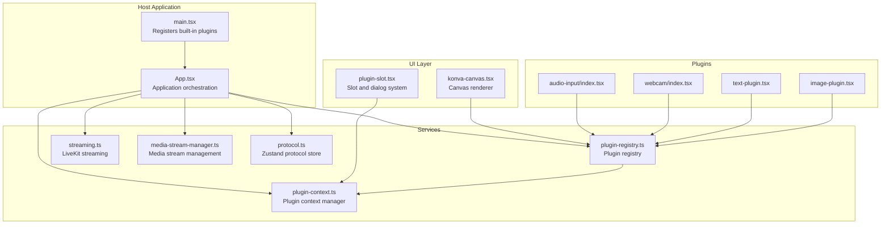
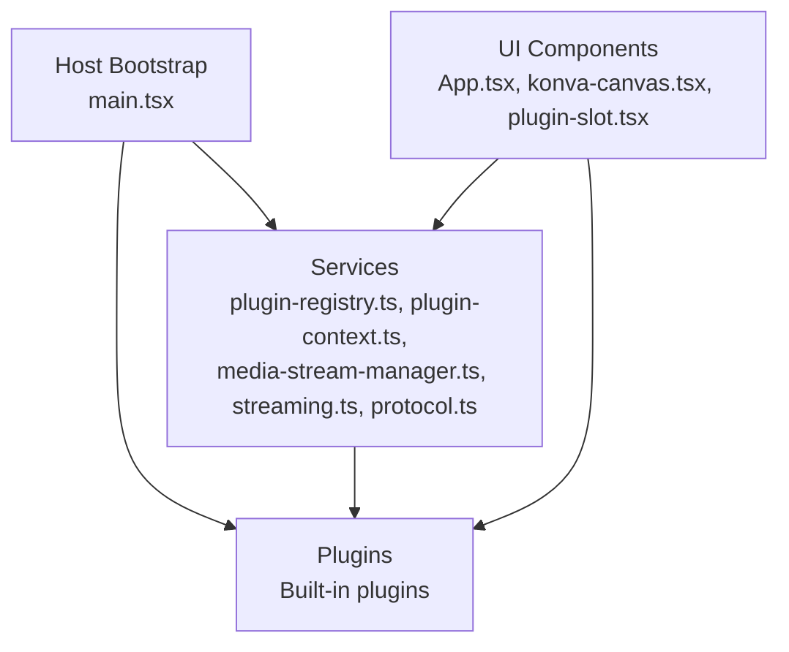
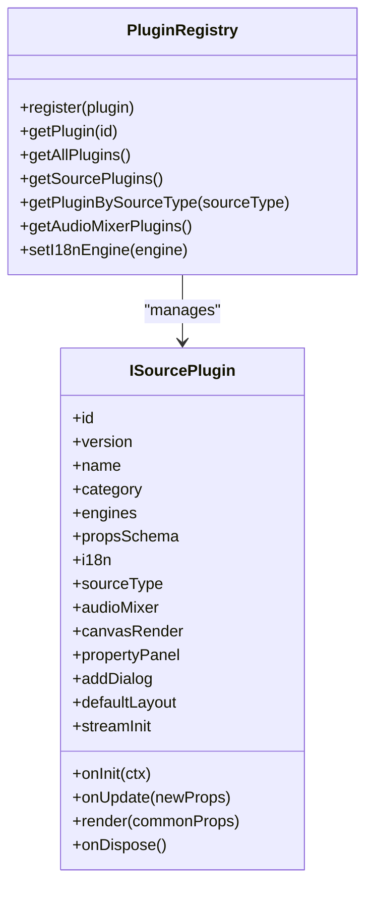
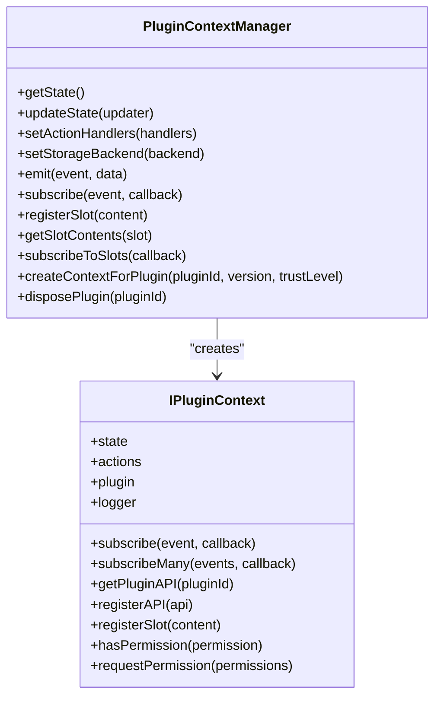
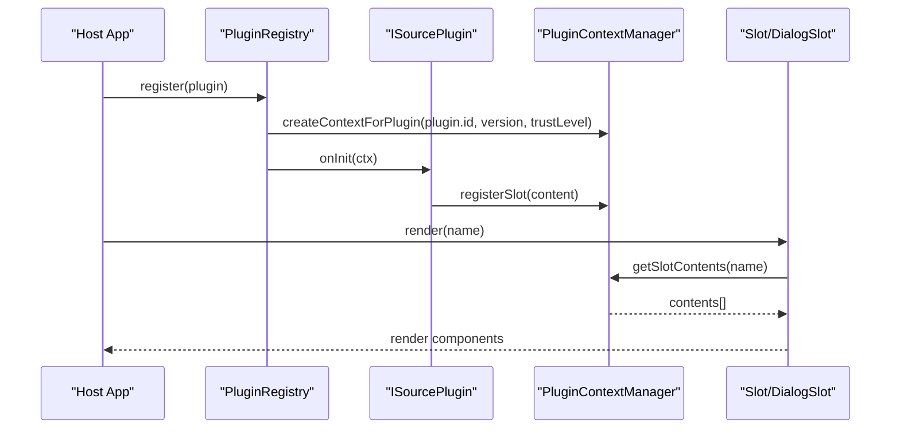
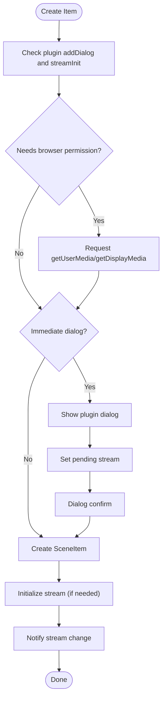
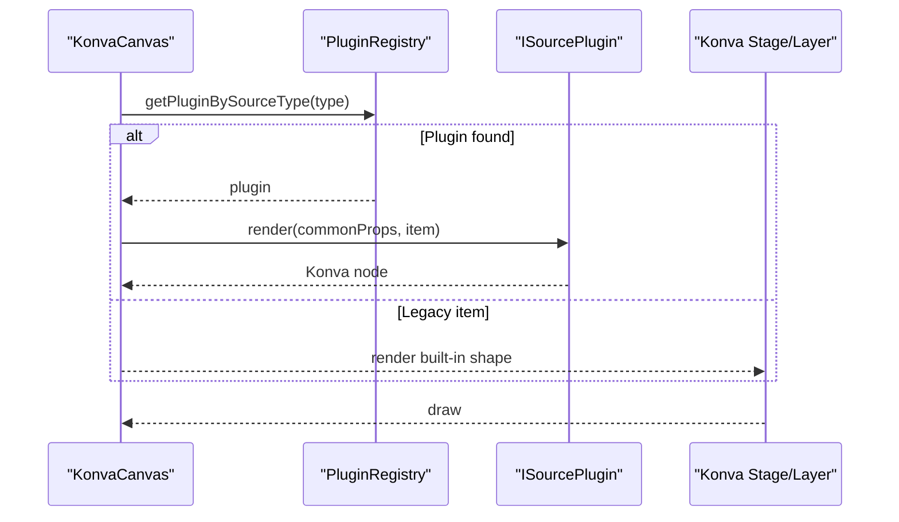
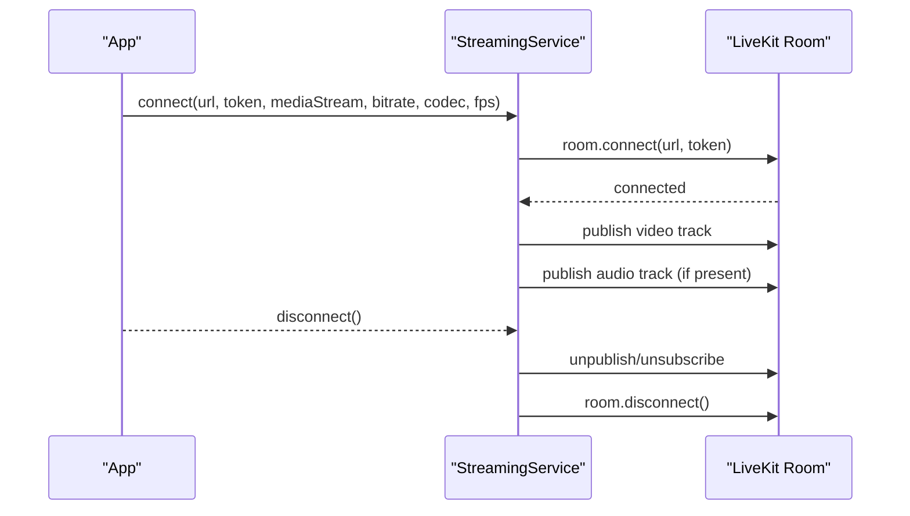
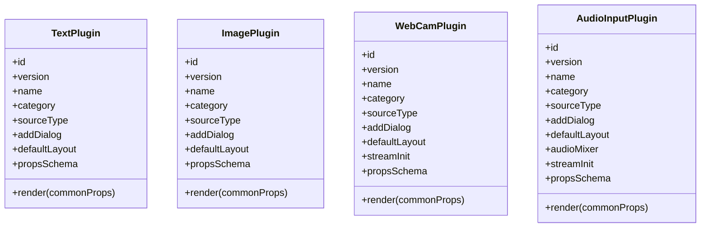
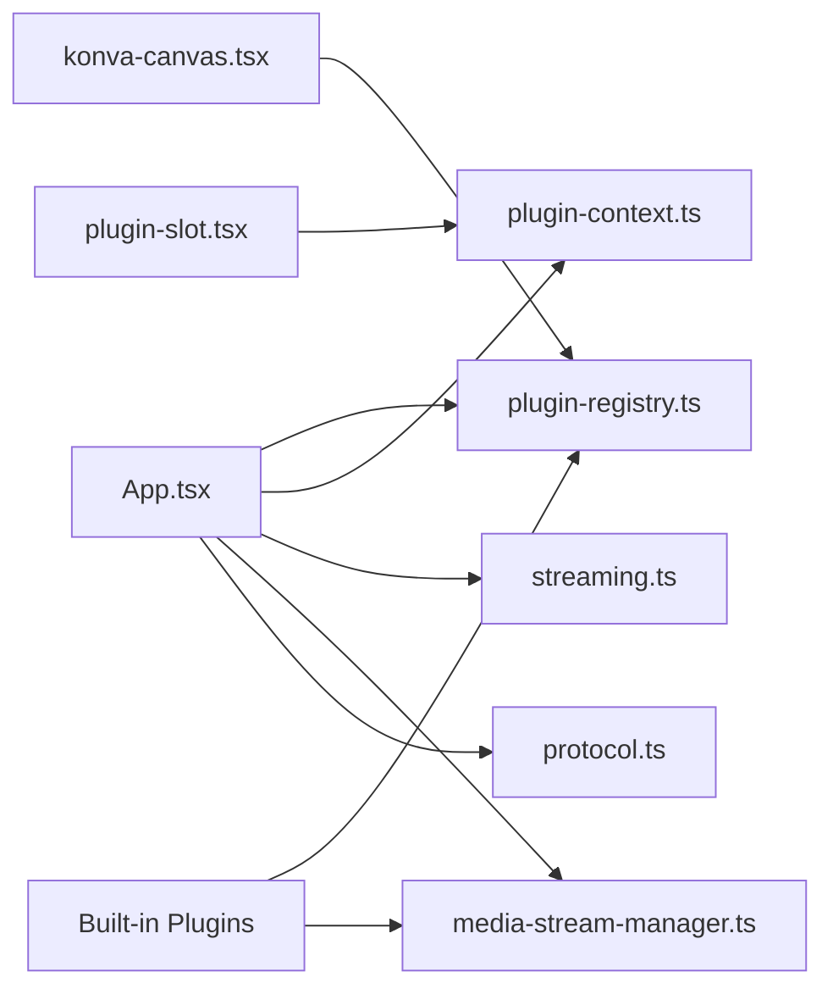

# Architecture Overview

<cite>
**Referenced Files in This Document**
- [App.tsx](file://src/App.tsx)
- [main.tsx](file://src/main.tsx)
- [plugin-registry.ts](file://src/services/plugin-registry.ts)
- [plugin-context.ts](file://src/services/plugin-context.ts)
- [plugin-slot.tsx](file://src/components/plugin-slot.tsx)
- [plugin.ts](file://src/types/plugin.ts)
- [plugin-context.ts](file://src/types/plugin-context.ts)
- [media-stream-manager.ts](file://src/services/media-stream-manager.ts)
- [protocol.ts](file://src/store/protocol.ts)
- [streaming.ts](file://src/services/streaming.ts)
- [konva-canvas.tsx](file://src/components/konva-canvas.tsx)
- [audio-input/index.tsx](file://src/plugins/builtin/audio-input/index.tsx)
- [webcam/index.tsx](file://src/plugins/builtin/webcam/index.tsx)
- [text-plugin.tsx](file://src/plugins/builtin/text-plugin.tsx)
- [image-plugin.tsx](file://src/plugins/builtin/image-plugin.tsx)
- [package.json](file://package.json)
- [Readme.md](file://Readme.md)
</cite>

## Table of Contents
1. [Introduction](#introduction)
2. [Project Structure](#project-structure)
3. [Core Components](#core-components)
4. [Architecture Overview](#architecture-overview)
5. [Detailed Component Analysis](#detailed-component-analysis)
6. [Dependency Analysis](#dependency-analysis)
7. [Performance Considerations](#performance-considerations)
8. [Troubleshooting Guide](#troubleshooting-guide)
9. [Conclusion](#conclusion)

## Introduction
This document presents the architecture of LiveMixer Web, a React-based live video mixer and streaming application. The system follows a plugin-based architecture with a service-oriented design and a clear separation of concerns across UI components, service layer, plugin system, and state management. It integrates tightly with LiveKit for streaming and uses Konva for canvas rendering. The host application coordinates plugin registration, context provisioning, and runtime orchestration, while plugins encapsulate rendering logic, media handling, and UI dialogs.

## Project Structure
LiveMixer Web is organized into distinct layers:
- Host application entry and orchestration
- UI components (React) with a canvas layer powered by Konva
- Service layer for streaming, media, internationalization, and plugin context
- Plugin system with built-in plugins and a registry
- State management using a protocol store persisted to local storage
- Type definitions for plugins and context

**Diagram sources**
- [main.tsx:14-28](file://src/main.tsx#L14-L28)
- [App.tsx:128-203](file://src/App.tsx#L128-L203)
- [plugin-registry.ts:78-118](file://src/services/plugin-registry.ts#L78-L118)
- [plugin-context.ts:82-141](file://src/services/plugin-context.ts#L82-L141)
- [streaming.ts:20-124](file://src/services/streaming.ts#L20-L124)
- [media-stream-manager.ts:56-91](file://src/services/media-stream-manager.ts#L56-L91)
- [protocol.ts:38-67](file://src/store/protocol.ts#L38-L67)
- [konva-canvas.tsx:459-470](file://src/components/konva-canvas.tsx#L459-L470)
- [plugin-slot.tsx:56-116](file://src/components/plugin-slot.tsx#L56-L116)

**Section sources**
- [main.tsx:14-28](file://src/main.tsx#L14-L28)
- [package.json:50-76](file://package.json#L50-L76)

## Core Components
- Host application bootstrap and plugin registration
  - Built-in plugins are registered during startup and made available to the plugin registry.
  - The application provider wraps the app with plugin context support.

- Plugin system
  - Plugins define metadata, source type mapping, UI dialogs, rendering logic, and optional audio mixer integration.
  - The registry manages plugin lifecycle, i18n registration, and context creation.

- Plugin context manager
  - Provides a secure, permissioned interface for plugins to read state, emit events, request actions, and communicate with other plugins.
  - Manages slots for UI composition and dialog rendering.

- Media and streaming services
  - Centralized media stream management decouples UI from plugin internals.
  - LiveKit streaming service handles connection, publishing, and cleanup.

- Canvas rendering
  - Konva-based canvas renders plugin-defined nodes and legacy item types, with selection, transformation, and timer/clock updates.

- State management
  - Protocol store persists scene configuration and metadata to local storage.

**Section sources**
- [main.tsx:14-28](file://src/main.tsx#L14-L28)
- [plugin-registry.ts:78-118](file://src/services/plugin-registry.ts#L78-L118)
- [plugin-context.ts:82-141](file://src/services/plugin-context.ts#L82-L141)
- [media-stream-manager.ts:56-91](file://src/services/media-stream-manager.ts#L56-L91)
- [streaming.ts:20-124](file://src/services/streaming.ts#L20-L124)
- [konva-canvas.tsx:459-470](file://src/components/konva-canvas.tsx#L459-L470)
- [protocol.ts:38-67](file://src/store/protocol.ts#L38-L67)

## Architecture Overview
LiveMixer Web employs a layered architecture:
- UI layer: React components and Konva canvas for interactive editing and preview.
- Service layer: Orchestration of streaming, media, and plugin context.
- Plugin system: Extensible rendering and behavior via plugins with strict context and permissions.
- State management: Persistent protocol store for scenes and items.

**Diagram sources**
- [App.tsx:128-203](file://src/App.tsx#L128-L203)
- [plugin-registry.ts:78-118](file://src/services/plugin-registry.ts#L78-L118)
- [plugin-context.ts:82-141](file://src/services/plugin-context.ts#L82-L141)
- [media-stream-manager.ts:56-91](file://src/services/media-stream-manager.ts#L56-L91)
- [streaming.ts:20-124](file://src/services/streaming.ts#L20-L124)
- [protocol.ts:38-67](file://src/store/protocol.ts#L38-L67)
- [main.tsx:14-28](file://src/main.tsx#L14-L28)

## Detailed Component Analysis

### Plugin System and Registry
The plugin system centers around a registry that:
- Registers plugins and their i18n resources
- Initializes plugin context with scoped logging, asset loading, and permission enforcement
- Resolves plugins by source type and exposes audio mixer and UI capabilities

**Diagram sources**
- [plugin-registry.ts:78-167](file://src/services/plugin-registry.ts#L78-L167)
- [plugin.ts:164-262](file://src/types/plugin.ts#L164-L262)

**Section sources**
- [plugin-registry.ts:78-118](file://src/services/plugin-registry.ts#L78-L118)
- [plugin-registry.ts:144-157](file://src/services/plugin-registry.ts#L144-L157)
- [plugin.ts:164-262](file://src/types/plugin.ts#L164-L262)

### Plugin Context Manager
The plugin context manager provides:
- A readonly state proxy to plugins
- Permissioned actions for scene, playback, UI, and storage
- Slot registration and discovery
- Event emission and subscription
- Plugin API registration and retrieval

**Diagram sources**
- [plugin-context.ts:82-701](file://src/services/plugin-context.ts#L82-L701)
- [plugin-context.ts:322-403](file://src/services/plugin-context.ts#L322-L403)

**Section sources**
- [plugin-context.ts:82-141](file://src/services/plugin-context.ts#L82-L141)
- [plugin-context.ts:333-456](file://src/services/plugin-context.ts#L333-L456)
- [plugin-context.ts:532-700](file://src/services/plugin-context.ts#L532-L700)

### Slot and Dialog System
The slot system enables dynamic UI composition:
- Slots are identified by names and can be registered with priority and visibility conditions
- DialogSlot composes plugin dialogs registered under specific slots
- React hooks expose slot contents and state subscriptions

**Diagram sources**
- [plugin-registry.ts:78-118](file://src/services/plugin-registry.ts#L78-L118)
- [plugin-context.ts:333-456](file://src/services/plugin-context.ts#L333-L456)
- [plugin-slot.tsx:192-264](file://src/components/plugin-slot.tsx#L192-L264)
- [plugin-slot.tsx:320-363](file://src/components/plugin-slot.tsx#L320-L363)

**Section sources**
- [plugin-slot.tsx:192-264](file://src/components/plugin-slot.tsx#L192-L264)
- [plugin-slot.tsx:320-363](file://src/components/plugin-slot.tsx#L320-L363)

### Media Stream Management
MediaStreamManager centralizes:
- Stream registration, updates, and removal
- Listener notifications for stream changes
- Device enumeration with permission handling
- Pending stream handling for dialog-to-app communication

**Diagram sources**
- [App.tsx:280-362](file://src/App.tsx#L280-L362)
- [media-stream-manager.ts:282-294](file://src/services/media-stream-manager.ts#L282-L294)

**Section sources**
- [media-stream-manager.ts:56-91](file://src/services/media-stream-manager.ts#L56-L91)
- [media-stream-manager.ts:147-273](file://src/services/media-stream-manager.ts#L147-L273)
- [App.tsx:280-362](file://src/App.tsx#L280-L362)

### Canvas Rendering and Plugin Rendering
KonvaCanvas renders items:
- Sorts by z-index and filters items marked for exclusion by plugins
- Renders plugin-defined nodes via PluginRenderer
- Supports selection, transformation, and timer/clock updates
- Integrates HTML overlays for LiveKit streams

**Diagram sources**
- [konva-canvas.tsx:459-470](file://src/components/konva-canvas.tsx#L459-L470)
- [plugin-registry.ts:144-157](file://src/services/plugin-registry.ts#L144-L157)

**Section sources**
- [konva-canvas.tsx:459-621](file://src/components/konva-canvas.tsx#L459-L621)

### Streaming Service
The streaming service:
- Establishes a LiveKit room connection
- Publishes video and audio tracks with configurable encoding
- Handles connection state and cleanup

**Diagram sources**
- [streaming.ts:20-124](file://src/services/streaming.ts#L20-L124)

**Section sources**
- [streaming.ts:20-124](file://src/services/streaming.ts#L20-L124)

### Built-in Plugins
- Text plugin: Adds text items with configurable content, font size, and color.
- Image plugin: Adds image items with URL and border radius controls.
- Webcam plugin: Adds video input items with device selection and mirroring.
- Audio input plugin: Adds audio input items with device selection and audio level monitoring.

**Diagram sources**
- [text-plugin.tsx:4-109](file://src/plugins/builtin/text-plugin.tsx#L4-L109)
- [image-plugin.tsx:7-104](file://src/plugins/builtin/image-plugin.tsx#L7-L104)
- [webcam/index.tsx:110-200](file://src/plugins/builtin/webcam/index.tsx#L110-L200)
- [audio-input/index.tsx:105-248](file://src/plugins/builtin/audio-input/index.tsx#L105-L248)

**Section sources**
- [text-plugin.tsx:4-109](file://src/plugins/builtin/text-plugin.tsx#L4-L109)
- [image-plugin.tsx:7-104](file://src/plugins/builtin/image-plugin.tsx#L7-L104)
- [webcam/index.tsx:110-200](file://src/plugins/builtin/webcam/index.tsx#L110-L200)
- [audio-input/index.tsx:105-248](file://src/plugins/builtin/audio-input/index.tsx#L105-L248)

## Dependency Analysis
The system exhibits low coupling and high cohesion:
- UI components depend on the plugin registry and context manager for plugin-driven rendering and dialogs.
- Services encapsulate external integrations (LiveKit, media devices) behind unified interfaces.
- Plugins depend on the registry and context manager for state, permissions, and UI composition.

**Diagram sources**
- [App.tsx:128-203](file://src/App.tsx#L128-L203)
- [plugin-registry.ts:78-118](file://src/services/plugin-registry.ts#L78-L118)
- [plugin-context.ts:82-141](file://src/services/plugin-context.ts#L82-L141)
- [streaming.ts:20-124](file://src/services/streaming.ts#L20-L124)
- [media-stream-manager.ts:56-91](file://src/services/media-stream-manager.ts#L56-L91)
- [protocol.ts:38-67](file://src/store/protocol.ts#L38-L67)
- [konva-canvas.tsx:459-470](file://src/components/konva-canvas.tsx#L459-L470)
- [plugin-slot.tsx:56-116](file://src/components/plugin-slot.tsx#L56-L116)

**Section sources**
- [package.json:50-76](file://package.json#L50-L76)

## Performance Considerations
- Canvas rendering
  - Continuous rendering loop keeps captureStream alive during streaming; ensure to stop the loop after streaming stops.
  - Minimize redraws by batching draws and using memoization for plugin renderers.

- Media streams
  - Stop tracks and remove video elements when streams are removed to free resources.
  - Defer device enumeration until permissions are granted to reduce overhead.

- Plugin context
  - Use readonly state proxies to prevent accidental mutations and enable efficient re-renders.
  - Limit event subscriptions and unregister listeners when plugins are disposed.

- Streaming
  - Configure appropriate bitrate and codec for the target LiveKit deployment.
  - Apply track constraints to balance quality and CPU usage.

[No sources needed since this section provides general guidance]

## Troubleshooting Guide
- Plugin registration issues
  - Verify plugin IDs and versions are unique and correctly exported.
  - Ensure i18n resources are registered after an i18n engine is set.

- Permission errors
  - Confirm browser permissions for camera, microphone, and screen capture are granted.
  - Use device enumeration helpers to detect permission states and prompt users accordingly.

- Streaming failures
  - Check LiveKit URL and token validity.
  - Validate that the MediaStream contains at least one video track before publishing.

- Dialog rendering problems
  - Ensure dialog slot IDs match between plugin registration and dialog invocation.
  - Wrap slot content with error boundaries to prevent UI crashes.

**Section sources**
- [plugin-registry.ts:13-20](file://src/services/plugin-registry.ts#L13-L20)
- [media-stream-manager.ts:147-273](file://src/services/media-stream-manager.ts#L147-L273)
- [streaming.ts:119-124](file://src/services/streaming.ts#L119-L124)
- [plugin-slot.tsx:274-302](file://src/components/plugin-slot.tsx#L274-L302)

## Conclusion
LiveMixer Web’s architecture balances extensibility and maintainability through a plugin-first design, a robust plugin context system, and a service-oriented layer. The React-based UI integrates seamlessly with the plugin ecosystem, enabling modular rendering and behavior while keeping the host application focused on orchestration. The use of a protocol store, centralized media management, and LiveKit streaming services ensures scalability and reliability for live streaming scenarios.