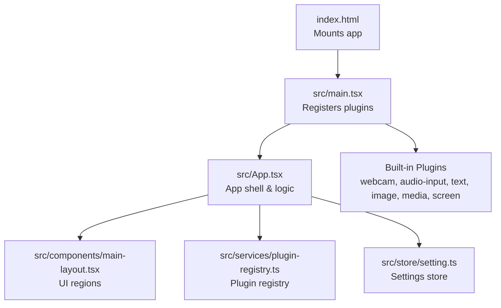
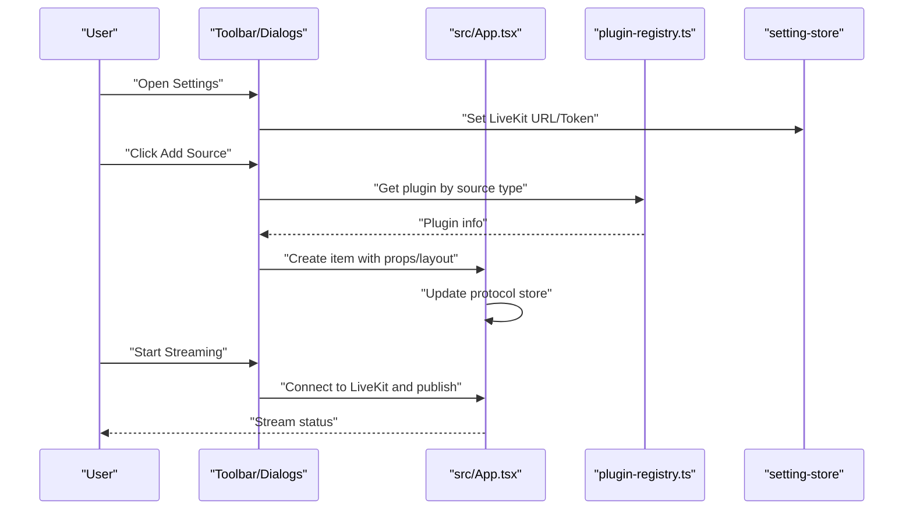
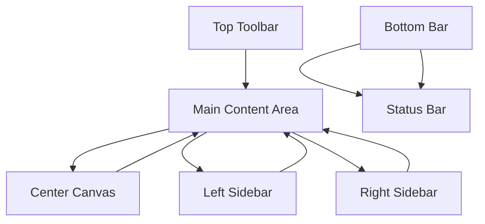
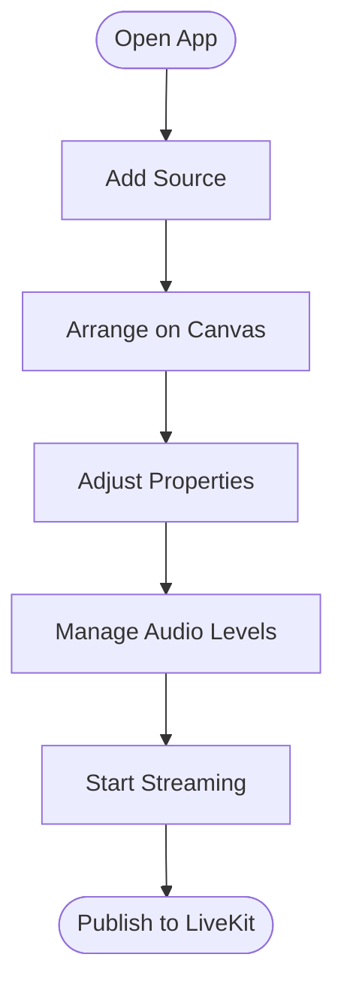

# Getting Started

<cite>
**Referenced Files in This Document**
- [package.json](file://package.json)
- [Readme.md](file://Readme.md)
- [vite.config.ts](file://vite.config.ts)
- [index.html](file://index.html)
- [src/main.tsx](file://src/main.tsx)
- [src/App.tsx](file://src/App.tsx)
- [src/services/plugin-registry.ts](file://src/services/plugin-registry.ts)
- [src/store/setting.ts](file://src/store/setting.ts)
- [src/components/main-layout.tsx](file://src/components/main-layout.tsx)
- [src/plugins/builtin/webcam/index.tsx](file://src/plugins/builtin/webcam/index.tsx)
- [src/plugins/builtin/audio-input/index.tsx](file://src/plugins/builtin/audio-input/index.tsx)
- [src/plugins/builtin/text-plugin.tsx](file://src/plugins/builtin/text-plugin.tsx)
- [tsconfig.json](file://tsconfig.json)
- [tailwind.config.js](file://tailwind.config.js)
- [biome.json](file://biome.json)
</cite>

## Table of Contents
1. [Introduction](#introduction)
2. [Prerequisites](#prerequisites)
3. [Installation](#installation)
4. [Development Environment Setup](#development-environment-setup)
5. [Initial Configuration](#initial-configuration)
6. [Run the Development Server](#run-the-development-server)
7. [Project Structure Overview](#project-structure-overview)
8. [First-Time User Workflow](#first-time-user-workflow)
9. [Interface Overview](#interface-overview)
10. [Basic Video Mixing Tasks](#basic-video-mixing-tasks)
11. [Troubleshooting Guide](#troubleshooting-guide)
12. [Additional Resources](#additional-resources)
13. [Conclusion](#conclusion)

## Introduction
Livemixer Web is an open-source live video mixer and streaming application built with React and LiveKit. It provides a plugin-based architecture for adding various media sources (camera, microphone, screenshare, images, text, etc.) onto a virtual canvas, and streams the mixed output to a LiveKit room. This guide helps you install, configure, and start mixing videos quickly.

## Prerequisites
- Node.js: Required to run the development server and build the project. Use the latest LTS version recommended by the Node.js website.
- pnpm: Package manager used by the project. Install it globally if you haven’t already.

These tools are essential for installing dependencies, running scripts, and building the application.

**Section sources**
- [package.json:41-48](file://package.json#L41-L48)
- [Readme.md:7-15](file://Readme.md#L7-L15)

## Installation
Follow these steps to install the project locally:

1. Clone the repository to your machine.
2. Open a terminal in the project root directory.
3. Install dependencies using pnpm:
   - Command: pnpm install

This installs all runtime and development dependencies defined in the project configuration.

**Section sources**
- [Readme.md:7-9](file://Readme.md#L7-L9)
- [package.json:78-92](file://package.json#L78-L92)

## Development Environment Setup
After installing dependencies, you can prepare your environment for development:

- Scripts:
  - Development server: pnpm run dev
  - Preview production build: pnpm run preview
  - Linting: pnpm run lint
  - Formatting: pnpm run format

- Tooling:
  - Vite is used for fast development builds and previews.
  - Tailwind CSS is configured for styling.
  - Biome is used for linting and formatting.

These tools streamline local development and code quality.

**Section sources**
- [package.json:41-48](file://package.json#L41-L48)
- [vite.config.ts:1-61](file://vite.config.ts#L1-L61)
- [tailwind.config.js:1-7](file://tailwind.config.js#L1-L7)
- [biome.json:1-58](file://biome.json#L1-L58)

## Initial Configuration
Before you can stream, configure the following settings in the application:

- LiveKit streaming server:
  - Server URL and Token are required to publish a stream.
- LiveKit pull server:
  - Separate URL and Token for subscribing to remote streams.
- Output settings:
  - Video encoder, bitrate, FPS, and resolution.
- Audio/video devices:
  - Select default audio/video devices for capture.

These settings are stored in the application’s persistent store and can be changed later from the Settings dialog.

**Section sources**
- [src/App.tsx:726-788](file://src/App.tsx#L726-L788)
- [src/store/setting.ts:1-139](file://src/store/setting.ts#L1-L139)

## Run the Development Server
Start the local development server:

- Command: pnpm run dev
- The server starts at http://localhost:5173 by default.

Open the URL in your browser to access the application.

**Section sources**
- [Readme.md:11-15](file://Readme.md#L11-L15)
- [vite.config.ts:7-11](file://vite.config.ts#L7-L11)

## Project Structure Overview
High-level structure of the frontend application:

- Root entry:
  - index.html defines the HTML shell and mounts the React app.
  - src/main.tsx initializes plugins and renders the root App.
- Application shell:
  - src/App.tsx orchestrates internationalization, plugin context, protocol store, and streaming/pulling logic.
  - src/components/main-layout.tsx defines the UI regions (toolbar, canvas, sidebars, bottom bar, status bar).
- Services and stores:
  - src/services/plugin-registry.ts manages plugin registration and context.
  - src/store/setting.ts persists non-sensitive settings to localStorage.
- Built-in plugins:
  - Webcam, audio input, text, image, media source, and screen capture plugins are registered by default.

**Diagram sources**
- [index.html:1-16](file://index.html#L1-L16)
- [src/main.tsx:1-29](file://src/main.tsx#L1-L29)
- [src/App.tsx:1-126](file://src/App.tsx#L1-L126)
- [src/components/main-layout.tsx:1-77](file://src/components/main-layout.tsx#L1-L77)
- [src/services/plugin-registry.ts:1-168](file://src/services/plugin-registry.ts#L1-L168)
- [src/store/setting.ts:1-139](file://src/store/setting.ts#L1-L139)

**Section sources**
- [index.html:1-16](file://index.html#L1-L16)
- [src/main.tsx:1-29](file://src/main.tsx#L1-L29)
- [src/App.tsx:1-126](file://src/App.tsx#L1-L126)
- [src/components/main-layout.tsx:1-77](file://src/components/main-layout.tsx#L1-L77)
- [src/services/plugin-registry.ts:1-168](file://src/services/plugin-registry.ts#L1-L168)
- [src/store/setting.ts:1-139](file://src/store/setting.ts#L1-L139)

## First-Time User Workflow
Complete these steps to create your first mix:

1. Open the application in your browser.
2. Configure streaming settings:
   - Open Settings and enter LiveKit streaming URL and Token.
3. Add a media source:
   - Click the toolbar’s “Add Source” button.
   - Choose a source type (e.g., Webcam, Microphone, Screen, Image, Text).
   - For device-based sources, approve browser permissions when prompted.
4. Adjust properties:
   - Use the Property Panel to change position, size, opacity, and other properties.
5. Toggle visibility and lock:
   - Use the context menu to hide/show or lock items.
6. Start streaming:
   - Press the Stream button to publish the mixed canvas to LiveKit.

**Diagram sources**
- [src/App.tsx:279-375](file://src/App.tsx#L279-L375)
- [src/services/plugin-registry.ts:144-157](file://src/services/plugin-registry.ts#L144-L157)
- [src/store/setting.ts:92-139](file://src/store/setting.ts#L92-L139)

**Section sources**
- [src/App.tsx:279-375](file://src/App.tsx#L279-L375)
- [src/services/plugin-registry.ts:144-157](file://src/services/plugin-registry.ts#L144-L157)
- [src/store/setting.ts:92-139](file://src/store/setting.ts#L92-L139)

## Interface Overview
The application uses a main layout with distinct areas:

- Top toolbar: Actions and menus.
- Left sidebar: Scene and source panels.
- Center canvas: Mixed video output preview.
- Right sidebar: Property panel and audio mixer.
- Bottom bar: Participants panel and additional controls.
- Status bar: Connection and system status.

**Diagram sources**
- [src/components/main-layout.tsx:14-77](file://src/components/main-layout.tsx#L14-L77)

**Section sources**
- [src/components/main-layout.tsx:14-77](file://src/components/main-layout.tsx#L14-L77)

## Basic Video Mixing Tasks
Perform these common tasks to build a mix:

- Add a source:
  - Use the Add Source dialog to choose a plugin (e.g., webcam, audio input, text).
- Arrange items:
  - Drag items on the canvas to reorder layers and position them.
- Modify properties:
  - Use the Property Panel to adjust size, rotation, opacity, and plugin-specific properties.
- Toggle visibility and lock:
  - Hide or lock items to prevent accidental edits.
- Manage audio:
  - Use the Audio Mixer panel to adjust levels and mute sources.
- Start/stop streaming:
  - Connect to LiveKit and publish the mixed canvas.

[No sources needed since this diagram shows conceptual workflow, not actual code structure]

**Section sources**
- [src/App.tsx:576-723](file://src/App.tsx#L576-L723)
- [src/plugins/builtin/webcam/index.tsx:110-478](file://src/plugins/builtin/webcam/index.tsx#L110-L478)
- [src/plugins/builtin/audio-input/index.tsx:105-555](file://src/plugins/builtin/audio-input/index.tsx#L105-L555)
- [src/plugins/builtin/text-plugin.tsx:4-110](file://src/plugins/builtin/text-plugin.tsx#L4-L110)

## Troubleshooting Guide
Common setup and runtime issues:

- Cannot start development server:
  - Ensure Node.js and pnpm are installed and up to date.
  - Reinstall dependencies if needed: pnpm install.
- Blank page or missing assets:
  - Verify the HTML shell mounts the correct module path.
  - Confirm Tailwind content paths match your project structure.
- Browser permission errors:
  - Device-based sources require explicit user permission. Approve prompts when requested.
- Cannot connect to LiveKit:
  - Check that the streaming URL and Token are set in Settings.
  - Verify network connectivity and credentials.
- Audio/video not appearing:
  - Confirm device selection in plugin properties.
  - Ensure the device is not in use by another application.

**Section sources**
- [Readme.md:7-15](file://Readme.md#L7-L15)
- [index.html:11-14](file://index.html#L11-L14)
- [tailwind.config.js:3](file://tailwind.config.js#L3)
- [src/App.tsx:726-788](file://src/App.tsx#L726-L788)
- [src/plugins/builtin/webcam/index.tsx:261-337](file://src/plugins/builtin/webcam/index.tsx#L261-L337)
- [src/plugins/builtin/audio-input/index.tsx:310-376](file://src/plugins/builtin/audio-input/index.tsx#L310-L376)

## Additional Resources
- LiveKit Meet: Explore the LiveKit ecosystem and related projects.
- License: Apache-2.0.

**Section sources**
- [Readme.md:19-21](file://Readme.md#L19-L21)
- [Readme.md:23-26](file://Readme.md#L23-L26)

## Conclusion
You are now ready to install, configure, and run Livemixer Web. Use the Settings dialog to connect to LiveKit, add sources via the Add Source dialog, and manage your mix using the Property Panel and Audio Mixer. Refer to the troubleshooting section if you encounter issues during setup or runtime.