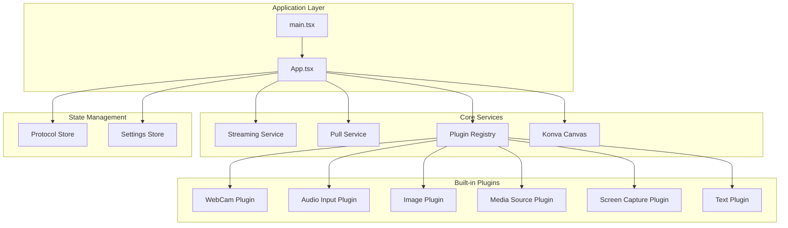
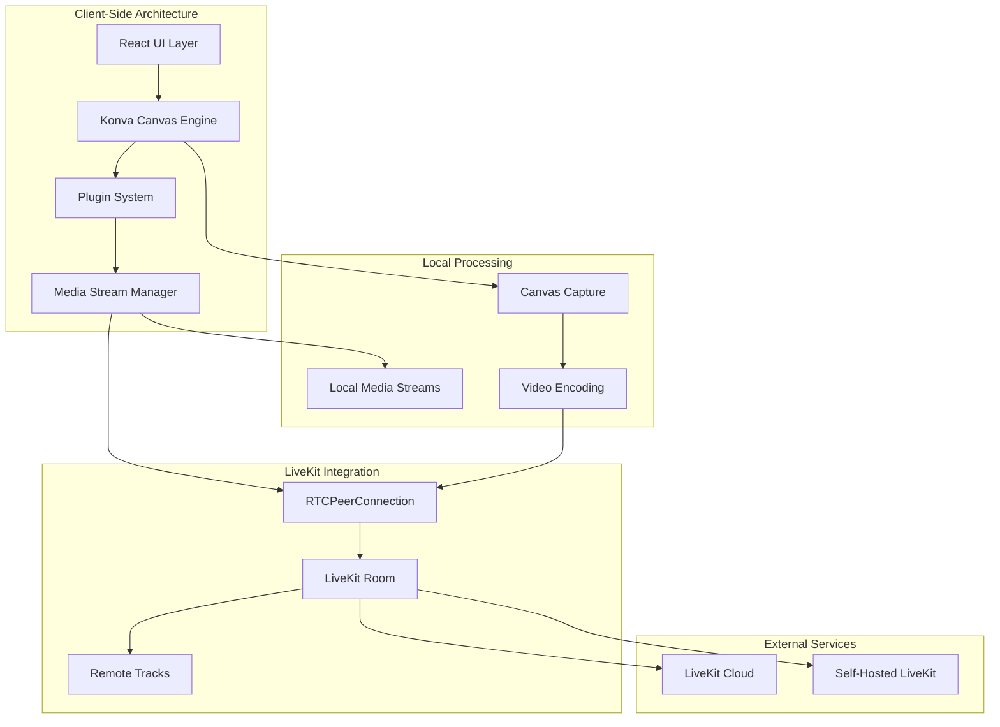
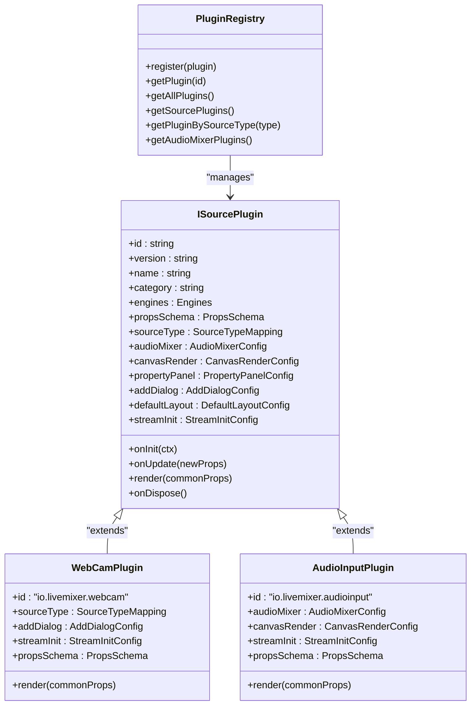
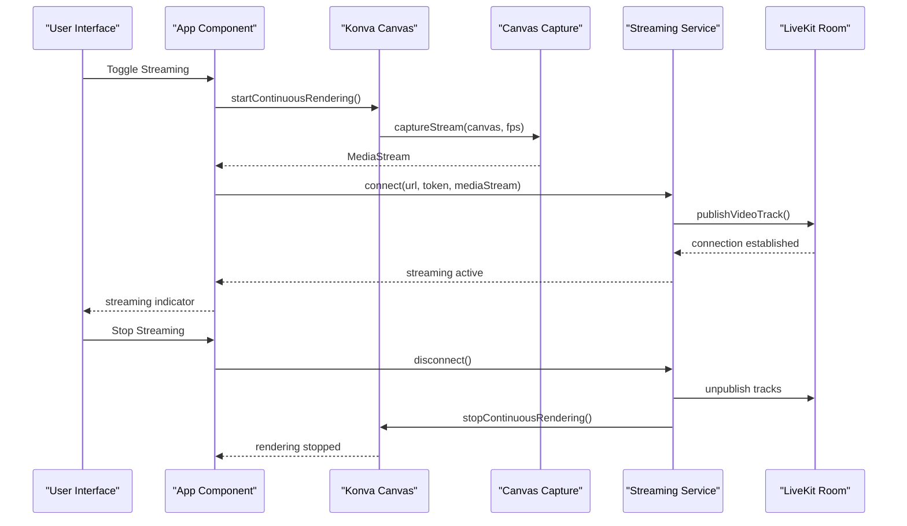
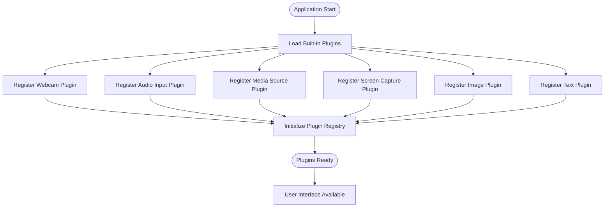
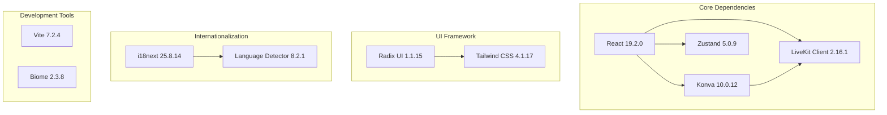

# Introduction

<cite>
**Referenced Files in This Document**
- [Readme.md](file://Readme.md)
- [package.json](file://package.json)
- [src/App.tsx](file://src/App.tsx)
- [src/main.tsx](file://src/main.tsx)
- [src/services/streaming.ts](file://src/services/streaming.ts)
- [src/services/livekit-pull.ts](file://src/services/livekit-pull.ts)
- [src/components/konva-canvas.tsx](file://src/components/konva-canvas.tsx)
- [src/plugins/builtin/webcam/index.tsx](file://src/plugins/builtin/webcam/index.tsx)
- [src/plugins/builtin/audio-input/index.tsx](file://src/plugins/builtin/audio-input/index.tsx)
- [src/services/plugin-registry.ts](file://src/services/plugin-registry.ts)
- [src/store/protocol.ts](file://src/store/protocol.ts)
</cite>

## Table of Contents
1. [Introduction](#introduction)
2. [Project Structure](#project-structure)
3. [Core Components](#core-components)
4. [Architecture Overview](#architecture-overview)
5. [Detailed Component Analysis](#detailed-component-analysis)
6. [Dependency Analysis](#dependency-analysis)
7. [Performance Considerations](#performance-considerations)
8. [Troubleshooting Guide](#troubleshooting-guide)
9. [Conclusion](#conclusion)

## Introduction

LiveMixer Web is an open-source live video mixer and streaming application designed as an alternative to traditional streaming software like OBS. Built on modern web technologies, it provides real-time video mixing capabilities through a browser-based interface powered by LiveKit RTC.

### Mission and Purpose

LiveMixer Web was created to democratize professional-grade video production by bringing it to the web. The project's mission centers on enabling content creators, streamers, and broadcasters to achieve broadcast-quality results without the complexity of desktop applications. By leveraging LiveKit's real-time communication infrastructure, it delivers a seamless streaming experience that works across platforms and devices.

### Target Audience

The application serves several key audiences:
- **Content creators** seeking professional video mixing capabilities
- **Streamers** requiring flexible, web-based streaming solutions
- **Broadcasters** needing scalable, cloud-native broadcasting infrastructure
- **Developers** wanting to integrate streaming capabilities into web applications

### LiveKit Ecosystem Integration

LiveMixer Web is deeply integrated into the LiveKit ecosystem, utilizing LiveKit Client for real-time communication, LiveKit Pull for participant management, and LiveKit Streams for video distribution. This integration ensures compatibility with LiveKit Cloud and self-hosted LiveKit servers, providing flexibility for different deployment scenarios.

### Key Features

- **Real-time video mixing**: Professional-grade video composition and effects
- **Web-based interface**: Runs directly in modern browsers without installation
- **LiveKit integration**: Leverages LiveKit's RTC infrastructure for streaming
- **Plugin architecture**: Extensible system supporting custom video sources and effects
- **Multi-platform support**: Works across desktop, mobile, and tablet devices
- **Open-source licensing**: Apache 2.0 license enabling commercial and personal use

**Section sources**
- [Readme.md:1-26](file://Readme.md#L1-L26)
- [package.json:6-20](file://package.json#L6-L20)

## Project Structure

The LiveMixer Web project follows a modular React architecture with clear separation of concerns:

**Diagram sources**
- [src/main.tsx:14-28](file://src/main.tsx#L14-L28)
- [src/App.tsx:38-126](file://src/App.tsx#L38-L126)
- [src/services/plugin-registry.ts:78-167](file://src/services/plugin-registry.ts#L78-L167)

### Component Organization

The project is organized into distinct layers:
- **Entry Point**: Application bootstrap and plugin registration
- **Core Services**: Streaming, pulling, and media management
- **Plugin System**: Extensible video source and effect plugins
- **UI Components**: React-based interface with Konva canvas
- **State Management**: Protocol-driven configuration and settings

**Section sources**
- [src/main.tsx:14-28](file://src/main.tsx#L14-L28)
- [src/App.tsx:38-126](file://src/App.tsx#L38-L126)

## Core Components

### Application Foundation

The application initializes through a structured bootstrapping process that establishes internationalization, plugin systems, and core services. The main entry point registers built-in plugins and provides the foundation for the entire application.

### Streaming Infrastructure

LiveMixer Web provides comprehensive streaming capabilities through its integration with LiveKit Client. The streaming service manages room connections, track publishing, and quality adaptation for optimal streaming performance.

### Plugin Architecture

The plugin system enables extensibility through a well-defined interface. Built-in plugins include webcam capture, audio input, screen sharing, image sources, media players, and text overlays. Each plugin adheres to a standardized API for consistent behavior and integration.

### Canvas Rendering System

Powered by Konva, the canvas system provides real-time video composition with drag-and-drop editing, transformation controls, and layer management. The system supports both traditional video sources and LiveKit streams.

**Section sources**
- [src/App.tsx:38-126](file://src/App.tsx#L38-L126)
- [src/services/streaming.ts:1-49](file://src/services/streaming.ts#L1-L49)
- [src/services/plugin-registry.ts:78-167](file://src/services/plugin-registry.ts#L78-L167)
- [src/components/konva-canvas.tsx:113-176](file://src/components/konva-canvas.tsx#L113-L176)

## Architecture Overview

LiveMixer Web implements a client-side architecture focused on real-time video processing and streaming:

**Diagram sources**
- [src/services/streaming.ts:20-49](file://src/services/streaming.ts#L20-L49)
- [src/services/livekit-pull.ts:60-179](file://src/services/livekit-pull.ts#L60-L179)
- [src/components/konva-canvas.tsx:145-176](file://src/components/konva-canvas.tsx#L145-L176)

### Data Flow Architecture

The application processes video through a pipeline that captures canvas frames, applies plugin transformations, and publishes streams to LiveKit rooms. This architecture ensures low-latency processing while maintaining high-quality output.

**Section sources**
- [src/services/streaming.ts:20-49](file://src/services/streaming.ts#L20-L49)
- [src/components/konva-canvas.tsx:145-176](file://src/components/konva-canvas.tsx#L145-L176)

## Detailed Component Analysis

### Plugin System Architecture

The plugin system provides a robust framework for extending LiveMixer Web's capabilities:

**Diagram sources**
- [src/services/plugin-registry.ts:78-167](file://src/services/plugin-registry.ts#L78-L167)
- [src/plugins/builtin/webcam/index.tsx:110-234](file://src/plugins/builtin/webcam/index.tsx#L110-L234)
- [src/plugins/builtin/audio-input/index.tsx:105-254](file://src/plugins/builtin/audio-input/index.tsx#L105-L254)

### Streaming Workflow

The streaming process involves multiple coordinated steps for capturing, encoding, and publishing video content:

**Diagram sources**
- [src/App.tsx:726-788](file://src/App.tsx#L726-L788)
- [src/components/konva-canvas.tsx:155-175](file://src/components/konva-canvas.tsx#L155-L175)
- [src/services/streaming.ts:20-49](file://src/services/streaming.ts#L20-L49)

### Plugin Registration Process

Built-in plugins are registered during application startup, establishing the foundation for video source creation:

**Diagram sources**
- [src/main.tsx:14-20](file://src/main.tsx#L14-L20)
- [src/services/plugin-registry.ts:78-118](file://src/services/plugin-registry.ts#L78-L118)

**Section sources**
- [src/main.tsx:14-20](file://src/main.tsx#L14-L20)
- [src/services/plugin-registry.ts:78-118](file://src/services/plugin-registry.ts#L78-L118)
- [src/App.tsx:726-788](file://src/App.tsx#L726-L788)

## Dependency Analysis

LiveMixer Web relies on a carefully selected set of dependencies that balance functionality with performance:

**Diagram sources**
- [package.json:50-76](file://package.json#L50-L76)

### External Integrations

The application integrates with external services through well-defined interfaces:
- **LiveKit Cloud**: Managed streaming infrastructure
- **Self-hosted LiveKit**: On-premises deployment option
- **Browser APIs**: MediaDevices, RTCPeerConnection, Canvas capture
- **Storage**: LocalStorage for configuration persistence

**Section sources**
- [package.json:50-76](file://package.json#L50-L76)

## Performance Considerations

LiveMixer Web is optimized for real-time video processing with several performance-focused design decisions:

- **Canvas-based rendering**: Uses Konva for efficient GPU-accelerated rendering
- **Adaptive streaming**: LiveKit's adaptive stream technology optimizes bandwidth usage
- **Efficient plugin architecture**: Modular design minimizes memory footprint
- **Lazy loading**: Plugins are loaded on-demand to reduce initial bundle size
- **State management**: Zustand provides lightweight state management without unnecessary overhead

## Troubleshooting Guide

Common issues and their solutions:

### Streaming Issues
- **Connection failures**: Verify LiveKit server URL and token configuration
- **Permission errors**: Ensure browser permissions are granted for camera/microphone/screen
- **Quality problems**: Adjust video bitrate and codec settings in streaming configuration

### Plugin Problems
- **Plugin not appearing**: Check plugin registration and source type mapping
- **Stream capture issues**: Verify device availability and permissions
- **Rendering problems**: Confirm plugin compatibility with current LiveMixer version

### Performance Issues
- **High CPU usage**: Reduce canvas resolution or disable unnecessary plugins
- **Memory leaks**: Monitor plugin lifecycle and cleanup procedures
- **Latency problems**: Optimize network connection and LiveKit server proximity

**Section sources**
- [src/services/streaming.ts:32-34](file://src/services/streaming.ts#L32-L34)
- [src/plugins/builtin/webcam/index.tsx:328-335](file://src/plugins/builtin/webcam/index.tsx#L328-L335)

## Conclusion

LiveMixer Web represents a significant advancement in web-based video production, offering professional-grade capabilities through an accessible, browser-native interface. Its integration with the LiveKit ecosystem provides scalability and reliability that traditional desktop applications cannot match.

The project's open-source nature, combined with its modular plugin architecture and real-time streaming capabilities, positions it as a powerful alternative to established streaming software. By focusing on web technologies and modern streaming protocols, LiveMixer Web enables content creators to achieve broadcast-quality results from any device with a modern browser.

The comprehensive plugin system ensures extensibility for specialized use cases, while the clean architecture supports ongoing development and community contributions. As web technologies continue to evolve, LiveMixer Web provides a foundation for innovative video production solutions that leverage the power of the browser platform.