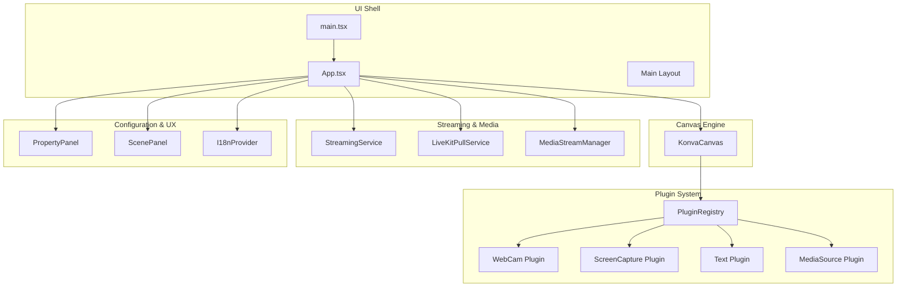
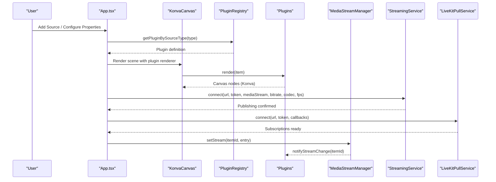
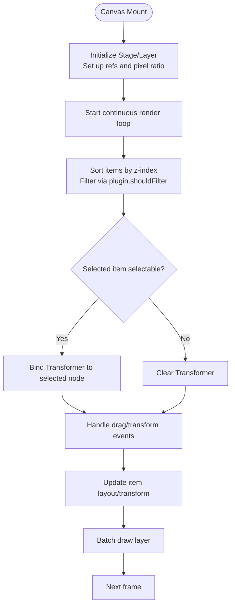
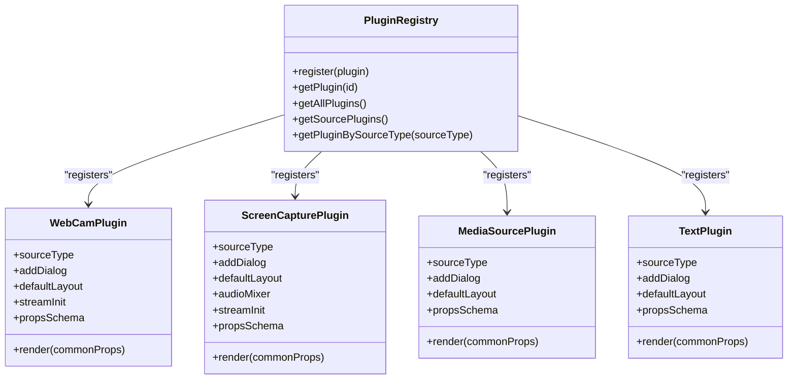
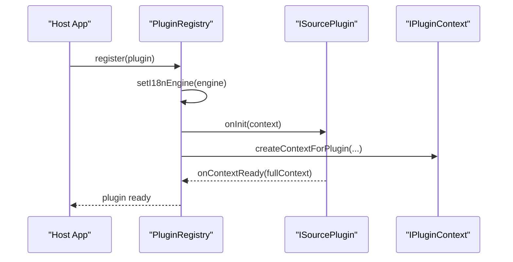
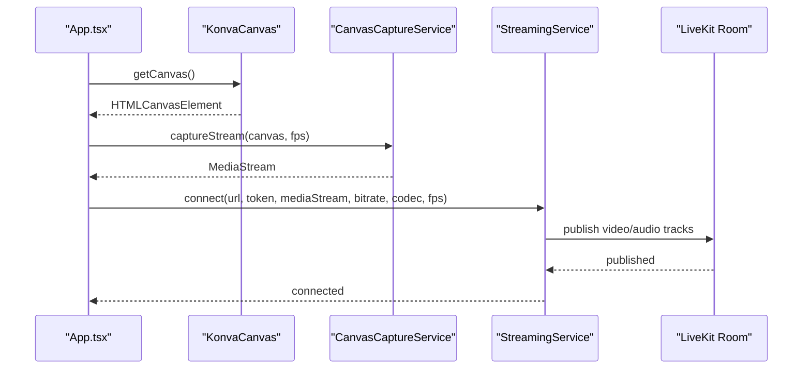
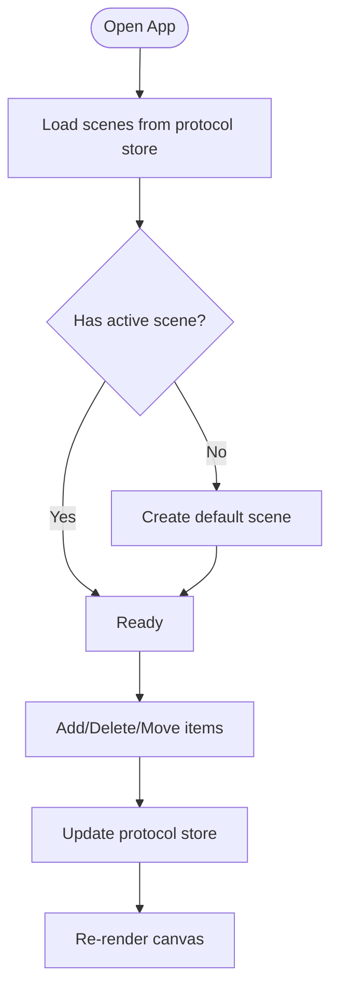
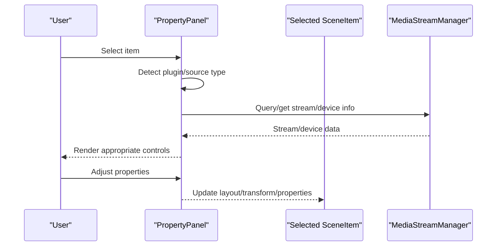
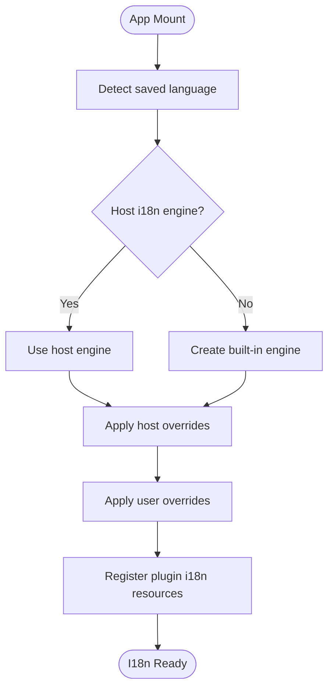
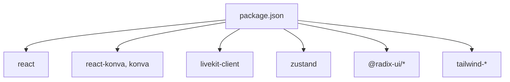

# Key Features

<cite>
**Referenced Files in This Document**
- [App.tsx](file://src/App.tsx)
- [main.tsx](file://src/main.tsx)
- [konva-canvas.tsx](file://src/components/konva-canvas.tsx)
- [plugin-registry.ts](file://src/services/plugin-registry.ts)
- [webcam/index.tsx](file://src/plugins/builtin/webcam/index.tsx)
- [screencapture-plugin.tsx](file://src/plugins/builtin/screencapture-plugin.tsx)
- [text-plugin.tsx](file://src/plugins/builtin/text-plugin.tsx)
- [mediasource-plugin.tsx](file://src/plugins/builtin/mediasource-plugin.tsx)
- [livekit-pull.ts](file://src/services/livekit-pull.ts)
- [streaming.ts](file://src/services/streaming.ts)
- [media-stream-manager.ts](file://src/services/media-stream-manager.ts)
- [property-panel.tsx](file://src/components/property-panel.tsx)
- [scene-panel.tsx](file://src/components/scene-panel.tsx)
- [I18nContext.tsx](file://src/contexts/I18nContext.tsx)
- [useI18n.ts](file://src/hooks/useI18n.ts)
- [en.ts](file://src/locales/en.ts)
- [zh.ts](file://src/locales/zh.ts)
- [index.ts](file://src/locales/index.ts)
- [package.json](file://package.json)
- [Readme.md](file://Readme.md)
</cite>

## Table of Contents
1. [Introduction](#introduction)
2. [Project Structure](#project-structure)
3. [Core Components](#core-components)
4. [Architecture Overview](#architecture-overview)
5. [Detailed Component Analysis](#detailed-component-analysis)
6. [Dependency Analysis](#dependency-analysis)
7. [Performance Considerations](#performance-considerations)
8. [Troubleshooting Guide](#troubleshooting-guide)
9. [Conclusion](#conclusion)

## Introduction
LiveMixer Web delivers a modern, extensible, and internationalized live video mixing platform built on web technologies. Its key strengths include:
- Real-time canvas-based composition with precise drag-and-resize controls
- Multi-source video inputs (webcam, screen capture, media files, text overlays)
- A robust plugin architecture enabling third-party extensibility
- LiveKit-powered live streaming and pull capabilities
- Scene management for layered compositions
- Property panel customization for per-source configuration
- Built-in internationalization with host override support

These features combine to provide a flexible, developer-friendly, and user-centric solution that differentiates LiveMixer Web from traditional streaming tools by emphasizing composability, real-time editing, and seamless integration with modern WebRTC infrastructure.

## Project Structure
LiveMixer Web organizes functionality around a React-based UI shell, a canvas rendering engine, a plugin registry, and services for streaming and media management. The structure supports clear separation of concerns and enables easy extension.

**Diagram sources**
- [main.tsx:14-28](file://src/main.tsx#L14-L28)
- [App.tsx:128-203](file://src/App.tsx#L128-L203)
- [konva-canvas.tsx:113-176](file://src/components/konva-canvas.tsx#L113-L176)
- [plugin-registry.ts:78-118](file://src/services/plugin-registry.ts#L78-L118)
- [webcam/index.tsx:110-234](file://src/plugins/builtin/webcam/index.tsx#L110-L234)
- [screencapture-plugin.tsx:55-164](file://src/plugins/builtin/screencapture-plugin.tsx#L55-L164)
- [text-plugin.tsx:4-105](file://src/plugins/builtin/text-plugin.tsx#L4-L105)
- [mediasource-plugin.tsx:13-302](file://src/plugins/builtin/mediasource-plugin.tsx#L13-L302)
- [streaming.ts:20-124](file://src/services/streaming.ts#L20-L124)
- [livekit-pull.ts:60-179](file://src/services/livekit-pull.ts#L60-L179)
- [media-stream-manager.ts:56-91](file://src/services/media-stream-manager.ts#L56-L91)
- [property-panel.tsx:643-751](file://src/components/property-panel.tsx#L643-L751)
- [scene-panel.tsx:16-74](file://src/components/scene-panel.tsx#L16-L74)
- [I18nContext.tsx](file://src/contexts/I18nContext.tsx)

**Section sources**
- [main.tsx:14-28](file://src/main.tsx#L14-L28)
- [package.json:50-76](file://package.json#L50-L76)

## Core Components
- Canvas-based composition with real-time drag, resize, rotate, and z-index ordering
- Multi-source input plugins for webcam, screen capture, media files, and text overlays
- Plugin registry and context enabling third-party extensibility
- LiveKit streaming and pull services for publishing and subscribing to streams
- Scene management for organizing multiple compositions
- Property panel for per-source configuration and device management
- Internationalization with host-provided overrides and layered resource loading

**Section sources**
- [konva-canvas.tsx:411-621](file://src/components/konva-canvas.tsx#L411-L621)
- [plugin-registry.ts:78-118](file://src/services/plugin-registry.ts#L78-L118)
- [streaming.ts:20-124](file://src/services/streaming.ts#L20-L124)
- [livekit-pull.ts:60-179](file://src/services/livekit-pull.ts#L60-L179)
- [scene-panel.tsx:16-74](file://src/components/scene-panel.tsx#L16-L74)
- [property-panel.tsx:643-751](file://src/components/property-panel.tsx#L643-L751)
- [I18nContext.tsx](file://src/contexts/I18nContext.tsx)

## Architecture Overview
LiveMixer Web’s architecture centers on a plugin-driven canvas renderer and a set of services for media and streaming. The App orchestrates state, plugin context, and UI panels, while the canvas renders plugin-defined components and LiveKit streams.

**Diagram sources**
- [App.tsx:280-375](file://src/App.tsx#L280-L375)
- [konva-canvas.tsx:459-470](file://src/components/konva-canvas.tsx#L459-L470)
- [plugin-registry.ts:144-157](file://src/services/plugin-registry.ts#L144-L157)
- [media-stream-manager.ts:56-65](file://src/services/media-stream-manager.ts#L56-L65)
- [streaming.ts:20-124](file://src/services/streaming.ts#L20-L124)
- [livekit-pull.ts:60-179](file://src/services/livekit-pull.ts#L60-L179)

## Detailed Component Analysis

### Real-time Canvas Composition
LiveMixer Web uses a canvas engine to render scene items with precise controls:
- Drag-and-drop positioning and transform anchors
- Rotation and constrained resizing with minimum-size enforcement
- Z-index ordering and selection highlighting
- Continuous rendering loop to keep captureStream alive during push
- Timer/clock rendering with high-precision frame loop

**Diagram sources**
- [konva-canvas.tsx:145-176](file://src/components/konva-canvas.tsx#L145-L176)
- [konva-canvas.tsx:179-202](file://src/components/konva-canvas.tsx#L179-L202)
- [konva-canvas.tsx:359-410](file://src/components/konva-canvas.tsx#L359-L410)
- [konva-canvas.tsx:603-621](file://src/components/konva-canvas.tsx#L603-L621)

**Section sources**
- [konva-canvas.tsx:113-176](file://src/components/konva-canvas.tsx#L113-L176)
- [konva-canvas.tsx:205-300](file://src/components/konva-canvas.tsx#L205-L300)
- [konva-canvas.tsx:411-621](file://src/components/konva-canvas.tsx#L411-L621)

### Multi-source Video Inputs
LiveMixer Web supports multiple input sources through plugins:
- Webcam: device selection, mirroring, opacity, and volume control
- Screen Capture: permission-based capture with audio toggle and re-selection
- Media Source: URL-based video with loop/mute/volume/opacity and optional audio-only mode
- Text Overlay: configurable content, font size, and color

**Diagram sources**
- [plugin-registry.ts:78-118](file://src/services/plugin-registry.ts#L78-L118)
- [webcam/index.tsx:110-234](file://src/plugins/builtin/webcam/index.tsx#L110-L234)
- [screencapture-plugin.tsx:55-164](file://src/plugins/builtin/screencapture-plugin.tsx#L55-L164)
- [mediasource-plugin.tsx:13-302](file://src/plugins/builtin/mediasource-plugin.tsx#L13-L302)
- [text-plugin.tsx:4-105](file://src/plugins/builtin/text-plugin.tsx#L4-L105)

**Section sources**
- [webcam/index.tsx:261-337](file://src/plugins/builtin/webcam/index.tsx#L261-L337)
- [screencapture-plugin.tsx:191-258](file://src/plugins/builtin/screencapture-plugin.tsx#L191-L258)
- [mediasource-plugin.tsx:137-225](file://src/plugins/builtin/mediasource-plugin.tsx#L137-L225)
- [text-plugin.tsx:83-105](file://src/plugins/builtin/text-plugin.tsx#L83-L105)

### Plugin Architecture
The plugin system provides a unified contract for adding new sources:
- Registration with metadata, source type mapping, and UI/dialog integration
- Property schema for dynamic configuration in the property panel
- Stream initialization hooks for device-based sources
- Internationalization resources registered under a plugin-specific namespace

**Diagram sources**
- [plugin-registry.ts:13-27](file://src/services/plugin-registry.ts#L13-L27)
- [plugin-registry.ts:78-118](file://src/services/plugin-registry.ts#L78-L118)
- [plugin-registry.ts:110-117](file://src/services/plugin-registry.ts#L110-L117)

**Section sources**
- [plugin-registry.ts:13-27](file://src/services/plugin-registry.ts#L13-L27)
- [plugin-registry.ts:78-118](file://src/services/plugin-registry.ts#L78-L118)
- [plugin-registry.ts:144-157](file://src/services/plugin-registry.ts#L144-L157)

### LiveKit Integration for Live Streaming
LiveMixer Web integrates with LiveKit for both pushing and pulling streams:
- Pushing: captures the canvas as a MediaStream, applies encoding parameters, and publishes to a room
- Pulling: connects to a room and subscribes to remote participants’ tracks

**Diagram sources**
- [App.tsx:726-788](file://src/App.tsx#L726-L788)
- [konva-canvas.tsx:146-152](file://src/components/konva-canvas.tsx#L146-L152)
- [streaming.ts:20-124](file://src/services/streaming.ts#L20-L124)

**Section sources**
- [streaming.ts:20-124](file://src/services/streaming.ts#L20-L124)
- [livekit-pull.ts:60-179](file://src/services/livekit-pull.ts#L60-L179)

### Scene Management
Scenes organize multiple compositions and items:
- Create, delete, reorder scenes
- Select active scene
- Per-scene item lists with visibility and locking controls

**Diagram sources**
- [App.tsx:159-165](file://src/App.tsx#L159-L165)
- [App.tsx:206-277](file://src/App.tsx#L206-L277)
- [scene-panel.tsx:16-74](file://src/components/scene-panel.tsx#L16-L74)

**Section sources**
- [App.tsx:159-165](file://src/App.tsx#L159-L165)
- [App.tsx:206-277](file://src/App.tsx#L206-L277)
- [scene-panel.tsx:16-74](file://src/components/scene-panel.tsx#L16-L74)

### Property Panel Customization
The property panel adapts to the selected item:
- Basic info (element ID, type, z-index)
- Position and size controls
- Source-specific panels (e.g., video input device selection, audio input device selection)
- Lock/visibility toggles and per-source properties

**Diagram sources**
- [property-panel.tsx:643-751](file://src/components/property-panel.tsx#L643-L751)
- [property-panel.tsx:28-66](file://src/components/property-panel.tsx#L28-L66)
- [property-panel.tsx:362-413](file://src/components/property-panel.tsx#L362-L413)
- [media-stream-manager.ts:56-91](file://src/services/media-stream-manager.ts#L56-L91)

**Section sources**
- [property-panel.tsx:643-751](file://src/components/property-panel.tsx#L643-L751)
- [property-panel.tsx:28-66](file://src/components/property-panel.tsx#L28-L66)
- [property-panel.tsx:362-413](file://src/components/property-panel.tsx#L362-L413)

### Internationalization Support
LiveMixer Web provides built-in i18n with host override capabilities:
- Host-provided i18n engine or built-in engine creation
- Layered resource loading (host, user, plugin)
- Locale detection and persistence

**Diagram sources**
- [App.tsx:44-107](file://src/App.tsx#L44-L107)
- [plugin-registry.ts:32-56](file://src/services/plugin-registry.ts#L32-L56)

**Section sources**
- [App.tsx:44-107](file://src/App.tsx#L44-L107)
- [plugin-registry.ts:32-56](file://src/services/plugin-registry.ts#L32-L56)

## Dependency Analysis
LiveMixer Web’s dependencies emphasize modularity and decoupling:
- React and Konva for UI and canvas rendering
- LiveKit client for streaming
- Zustand for state management
- Radix UI primitives for accessible components
- Tailwind for styling

**Diagram sources**
- [package.json:50-76](file://package.json#L50-L76)

**Section sources**
- [package.json:50-76](file://package.json#L50-L76)

## Performance Considerations
- Canvas rendering loop is kept minimal and batched to reduce redraw overhead
- Continuous rendering is started only during push to avoid unnecessary CPU usage
- Stream caching avoids repeated device enumeration and getUserMedia calls
- Adaptive streaming and dynacast are enabled in LiveKit services to optimize bandwidth
- High-precision timer/clock updates use requestAnimationFrame to balance accuracy and performance

[No sources needed since this section provides general guidance]

## Troubleshooting Guide
Common issues and resolutions:
- Push fails due to missing canvas or stream: ensure canvas is mounted and continuous rendering is started before capture
- Stream not publishing: verify LiveKit URL/token and that the MediaStream contains a video track
- Device permissions blocked: trigger device enumeration via property panel actions; ensure user gesture precedes getUserMedia
- Plugin not rendering: confirm plugin registration and that the source type matches the plugin’s sourceType mapping
- Internationalization not applied: verify i18n engine initialization and override layers

**Section sources**
- [App.tsx:726-788](file://src/App.tsx#L726-L788)
- [streaming.ts:74-87](file://src/services/streaming.ts#L74-L87)
- [media-stream-manager.ts:150-187](file://src/services/media-stream-manager.ts#L150-L187)
- [plugin-registry.ts:144-157](file://src/services/plugin-registry.ts#L144-L157)
- [App.tsx:44-107](file://src/App.tsx#L44-L107)

## Conclusion
LiveMixer Web combines a powerful canvas-based composition engine with a flexible plugin architecture, robust LiveKit integration, and comprehensive internationalization. Together, these features enable creators to build rich, real-time productions with ease, while developers can extend functionality through a clean, extensible plugin model. The result is a modern, efficient, and highly customizable streaming solution tailored for today’s web ecosystem.