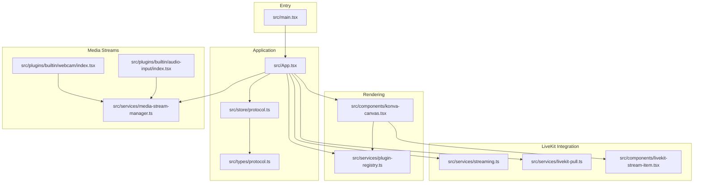
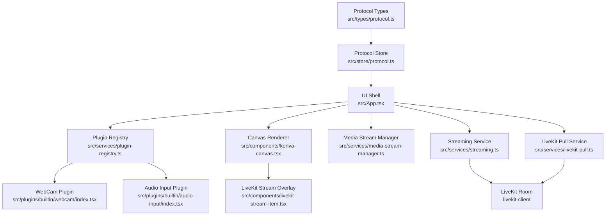
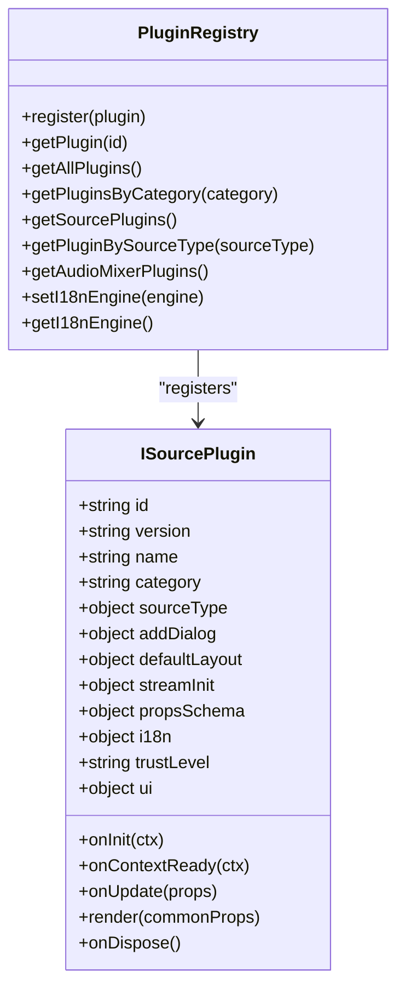
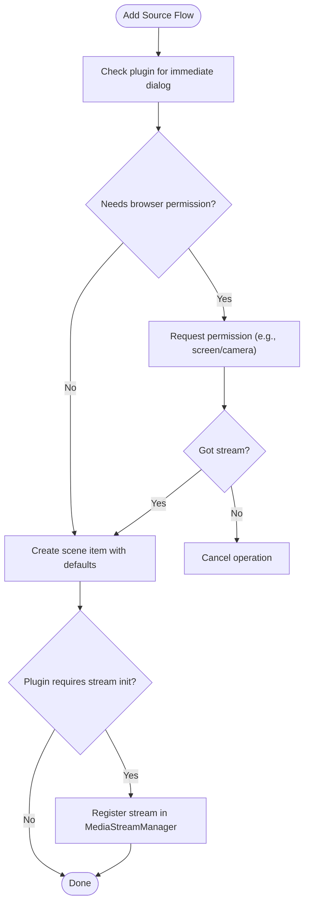
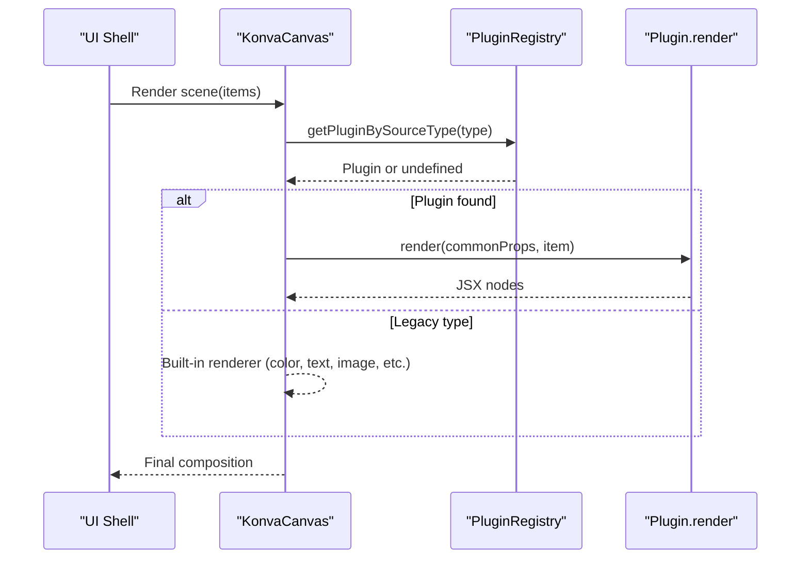
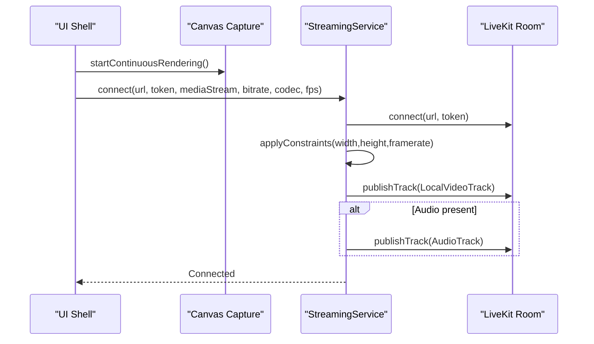
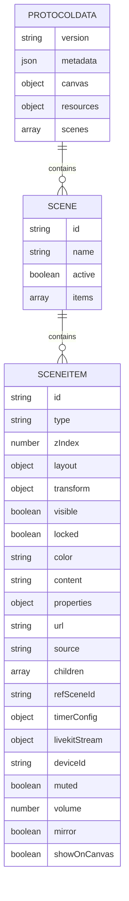
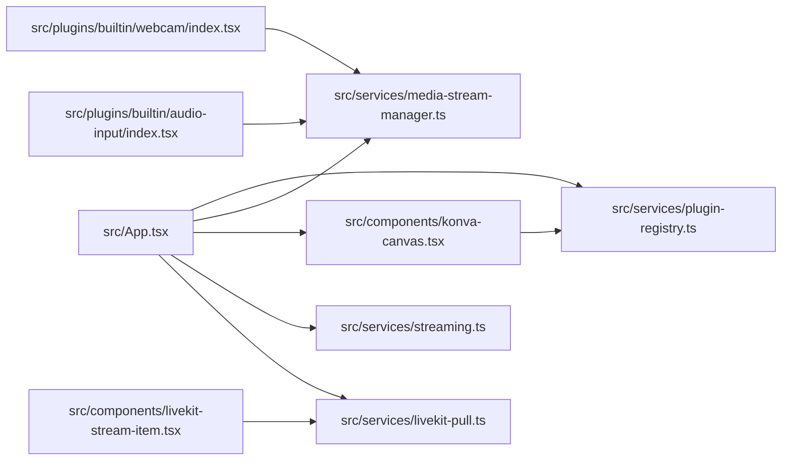

# Project Overview

<cite>
**Referenced Files in This Document**
- [Readme.md](file://Readme.md)
- [package.json](file://package.json)
- [src/main.tsx](file://src/main.tsx)
- [src/App.tsx](file://src/App.tsx)
- [src/services/plugin-registry.ts](file://src/services/plugin-registry.ts)
- [src/services/media-stream-manager.ts](file://src/services/media-stream-manager.ts)
- [src/components/konva-canvas.tsx](file://src/components/konva-canvas.tsx)
- [src/plugins/builtin/webcam/index.tsx](file://src/plugins/builtin/webcam/index.tsx)
- [src/plugins/builtin/audio-input/index.tsx](file://src/plugins/builtin/audio-input/index.tsx)
- [src/services/streaming.ts](file://src/services/streaming.ts)
- [src/services/livekit-pull.ts](file://src/services/livekit-pull.ts)
- [src/components/livekit-stream-item.tsx](file://src/components/livekit-stream-item.tsx)
- [src/store/protocol.ts](file://src/store/protocol.ts)
- [src/types/protocol.ts](file://src/types/protocol.ts)
- [protocol/v1.0.0/v1.0.0.json](file://protocol/v1.0.0/v1.0.0.json)
</cite>

## Table of Contents
1. [Introduction](#introduction)
2. [Project Structure](#project-structure)
3. [Core Components](#core-components)
4. [Architecture Overview](#architecture-overview)
5. [Detailed Component Analysis](#detailed-component-analysis)
6. [Dependency Analysis](#dependency-analysis)
7. [Performance Considerations](#performance-considerations)
8. [Troubleshooting Guide](#troubleshooting-guide)
9. [Conclusion](#conclusion)
10. [Appendices](#appendices)

## Introduction
Livemixer Web is an open-source live video mixer and streaming application designed as an alternative to traditional desktop streaming tools like OBS. Built on modern web technologies, it enables real-time composition of multiple media sources into a single, streamable canvas and integrates tightly with the LiveKit ecosystem for publishing and subscribing to real-time video streams. The project emphasizes a plugin-first architecture, a canvas-based composition model, and a flexible media stream lifecycle managed centrally through a media stream manager. It targets creators, educators, broadcasters, and developers who want a powerful, extensible, and browser-based solution for live production.

Key positioning:
- Purpose: Real-time video mixing and streaming with a browser-native client.
- Alternative to: Desktop streaming applications such as OBS.
- Ecosystem fit: Integrates with LiveKit for publishing and consuming real-time streams.
- Extensibility: Plugin architecture for adding new media sources and effects.
- Composition model: Canvas-based layout with scene items and layered rendering.

**Section sources**
- [Readme.md:1-26](file://Readme.md#L1-L26)
- [package.json:6-20](file://package.json#L6-L20)

## Project Structure
The project follows a React-based frontend architecture with a strong separation of concerns:
- Application bootstrap and plugin registration occur in the main entry.
- The application state is centralized around a protocol store that defines scenes, items, and canvas configuration.
- Rendering is powered by a canvas abstraction that delegates to plugins for specialized rendering.
- Services encapsulate LiveKit integration for publishing and subscribing to streams.
- A media stream manager provides a unified API for managing device streams across plugins.

**Diagram sources**
- [src/main.tsx:14-28](file://src/main.tsx#L14-L28)
- [src/App.tsx:128-203](file://src/App.tsx#L128-L203)
- [src/store/protocol.ts:38-67](file://src/store/protocol.ts#L38-L67)
- [src/components/konva-canvas.tsx:113-176](file://src/components/konva-canvas.tsx#L113-L176)
- [src/services/plugin-registry.ts:78-118](file://src/services/plugin-registry.ts#L78-L118)
- [src/services/media-stream-manager.ts:39-106](file://src/services/media-stream-manager.ts#L39-L106)
- [src/plugins/builtin/webcam/index.tsx:110-143](file://src/plugins/builtin/webcam/index.tsx#L110-L143)
- [src/plugins/builtin/audio-input/index.tsx:105-150](file://src/plugins/builtin/audio-input/index.tsx#L105-L150)
- [src/services/streaming.ts:20-124](file://src/services/streaming.ts#L20-L124)
- [src/services/livekit-pull.ts:60-179](file://src/services/livekit-pull.ts#L60-L179)
- [src/components/livekit-stream-item.tsx:16-21](file://src/components/livekit-stream-item.tsx#L16-L21)

**Section sources**
- [src/main.tsx:14-28](file://src/main.tsx#L14-L28)
- [src/App.tsx:128-203](file://src/App.tsx#L128-L203)
- [src/store/protocol.ts:38-67](file://src/store/protocol.ts#L38-L67)
- [src/components/konva-canvas.tsx:113-176](file://src/components/konva-canvas.tsx#L113-L176)
- [src/services/plugin-registry.ts:78-118](file://src/services/plugin-registry.ts#L78-L118)
- [src/services/media-stream-manager.ts:39-106](file://src/services/media-stream-manager.ts#L39-L106)
- [src/plugins/builtin/webcam/index.tsx:110-143](file://src/plugins/builtin/webcam/index.tsx#L110-L143)
- [src/plugins/builtin/audio-input/index.tsx:105-150](file://src/plugins/builtin/audio-input/index.tsx#L105-L150)
- [src/services/streaming.ts:20-124](file://src/services/streaming.ts#L20-L124)
- [src/services/livekit-pull.ts:60-179](file://src/services/livekit-pull.ts#L60-L179)
- [src/components/livekit-stream-item.tsx:16-21](file://src/components/livekit-stream-item.tsx#L16-L21)

## Core Components
- Application shell and initialization
  - Registers built-in plugins and bootstraps the plugin context provider.
  - Initializes internationalization and synchronizes UI state with the plugin context.
- Protocol store
  - Defines the global state schema for scenes, items, and canvas configuration.
  - Provides persistence and update mechanisms for the project data.
- Plugin registry
  - Central registry for source plugins, enabling dynamic discovery and lifecycle management.
  - Supports i18n resource registration and context initialization for plugins.
- Media stream manager
  - Unified API for registering, updating, and cleaning up media streams.
  - Handles device enumeration and dialog-to-app communication for pending streams.
- Canvas rendering
  - Renders scene items on a canvas abstraction, delegating to plugins for specialized rendering.
  - Manages selection, transforms, and timers/clocks with high-precision updates.
- LiveKit integration
  - Publishing service for streaming the canvas output to a LiveKit room.
  - Pull service for subscribing to remote participant streams and rendering overlays.

Practical examples:
- Adding a webcam source: The webcam plugin registers an add dialog, manages device permissions, and renders the video stream on the canvas.
- Streaming to LiveKit: The application captures the canvas continuously, publishes a video track with configurable codec and bitrate, and optionally publishes an audio track.
- Pulling remote streams: The pull service connects to a room, discovers participants, and attaches their camera or screen-share tracks to HTML video overlays positioned by scene items.

**Section sources**
- [src/main.tsx:14-28](file://src/main.tsx#L14-L28)
- [src/App.tsx:128-203](file://src/App.tsx#L128-L203)
- [src/store/protocol.ts:38-67](file://src/store/protocol.ts#L38-L67)
- [src/services/plugin-registry.ts:78-118](file://src/services/plugin-registry.ts#L78-L118)
- [src/services/media-stream-manager.ts:39-106](file://src/services/media-stream-manager.ts#L39-L106)
- [src/components/konva-canvas.tsx:113-176](file://src/components/konva-canvas.tsx#L113-L176)
- [src/services/streaming.ts:20-124](file://src/services/streaming.ts#L20-L124)
- [src/services/livekit-pull.ts:60-179](file://src/services/livekit-pull.ts#L60-L179)

## Architecture Overview
Livemixer Web’s architecture centers on a plugin-driven composition model with a canvas renderer and a media pipeline integrated with LiveKit.

**Diagram sources**
- [src/App.tsx:128-203](file://src/App.tsx#L128-L203)
- [src/services/plugin-registry.ts:78-118](file://src/services/plugin-registry.ts#L78-L118)
- [src/components/konva-canvas.tsx:113-176](file://src/components/konva-canvas.tsx#L113-L176)
- [src/services/media-stream-manager.ts:39-106](file://src/services/media-stream-manager.ts#L39-L106)
- [src/services/streaming.ts:20-124](file://src/services/streaming.ts#L20-L124)
- [src/services/livekit-pull.ts:60-179](file://src/services/livekit-pull.ts#L60-L179)
- [src/plugins/builtin/webcam/index.tsx:110-143](file://src/plugins/builtin/webcam/index.tsx#L110-L143)
- [src/plugins/builtin/audio-input/index.tsx:105-150](file://src/plugins/builtin/audio-input/index.tsx#L105-L150)
- [src/store/protocol.ts:38-67](file://src/store/protocol.ts#L38-L67)
- [src/types/protocol.ts:20-82](file://src/types/protocol.ts#L20-L82)

## Detailed Component Analysis

### Plugin Registry and Plugin Context
The plugin registry is responsible for:
- Registering plugins and initializing their i18n resources.
- Creating and exposing a plugin context to plugins upon readiness.
- Discovering plugins by source type for adding new scene items.

**Diagram sources**
- [src/services/plugin-registry.ts:5-167](file://src/services/plugin-registry.ts#L5-L167)
- [src/plugins/builtin/webcam/index.tsx:110-234](file://src/plugins/builtin/webcam/index.tsx#L110-L234)
- [src/plugins/builtin/audio-input/index.tsx:105-251](file://src/plugins/builtin/audio-input/index.tsx#L105-L251)

**Section sources**
- [src/services/plugin-registry.ts:78-118](file://src/services/plugin-registry.ts#L78-L118)
- [src/services/plugin-registry.ts:144-157](file://src/services/plugin-registry.ts#L144-L157)

### Media Stream Manager
The media stream manager provides a unified interface for:
- Registering and retrieving streams per scene item.
- Managing device enumeration with permission handling.
- Coordinating dialog-to-app communication for pending streams.

**Diagram sources**
- [src/App.tsx:279-362](file://src/App.tsx#L279-L362)
- [src/services/media-stream-manager.ts:56-106](file://src/services/media-stream-manager.ts#L56-L106)
- [src/plugins/builtin/webcam/index.tsx:261-337](file://src/plugins/builtin/webcam/index.tsx#L261-L337)
- [src/plugins/builtin/audio-input/index.tsx:310-376](file://src/plugins/builtin/audio-input/index.tsx#L310-L376)

**Section sources**
- [src/services/media-stream-manager.ts:39-106](file://src/services/media-stream-manager.ts#L39-L106)
- [src/App.tsx:279-362](file://src/App.tsx#L279-L362)

### Canvas Rendering and Scene Items
The canvas renderer:
- Sorts items by z-index and filters out items marked by plugins as shouldFilter.
- Delegates rendering to plugins when a matching source type is found.
- Manages selection, drag, and transform events, and updates item layouts accordingly.
- Renders timers/clocks with high-precision updates and supports HTML overlays for LiveKit streams.

**Diagram sources**
- [src/components/konva-canvas.tsx:459-470](file://src/components/konva-canvas.tsx#L459-L470)
- [src/services/plugin-registry.ts:144-157](file://src/services/plugin-registry.ts#L144-L157)
- [src/components/konva-canvas.tsx:473-601](file://src/components/konva-canvas.tsx#L473-L601)

**Section sources**
- [src/components/konva-canvas.tsx:113-176](file://src/components/konva-canvas.tsx#L113-L176)
- [src/components/konva-canvas.tsx:459-601](file://src/components/konva-canvas.tsx#L459-L601)

### LiveKit Streaming and Pull Services
- Streaming service
  - Connects to a LiveKit room and publishes a video track derived from the canvas capture stream.
  - Applies encoding parameters (codec, bitrate, framerate) and optionally publishes an audio track.
- Pull service
  - Connects to a LiveKit room and exposes participant and track information.
  - Enables attaching remote participant camera or screen-share tracks to HTML video overlays.

**Diagram sources**
- [src/App.tsx:726-788](file://src/App.tsx#L726-L788)
- [src/components/konva-canvas.tsx:154-176](file://src/components/konva-canvas.tsx#L154-L176)
- [src/services/streaming.ts:20-124](file://src/services/streaming.ts#L20-L124)

**Section sources**
- [src/services/streaming.ts:20-124](file://src/services/streaming.ts#L20-L124)
- [src/services/livekit-pull.ts:60-179](file://src/services/livekit-pull.ts#L60-L179)
- [src/components/livekit-stream-item.tsx:26-108](file://src/components/livekit-stream-item.tsx#L26-L108)

### Protocol Data Model and Scenes
The protocol defines:
- Canvas configuration (width, height).
- Scenes containing items with layout, transform, visibility, and type-specific properties.
- Scene items such as color, image, text, containers, scene references, timers/clocks, and LiveKit streams.

**Diagram sources**
- [src/types/protocol.ts:20-113](file://src/types/protocol.ts#L20-L113)
- [src/store/protocol.ts:6-28](file://src/store/protocol.ts#L6-L28)

**Section sources**
- [src/types/protocol.ts:20-113](file://src/types/protocol.ts#L20-L113)
- [src/store/protocol.ts:6-28](file://src/store/protocol.ts#L6-L28)

## Dependency Analysis
- Internal dependencies
  - App depends on the plugin registry, media stream manager, canvas component, and streaming/pull services.
  - Plugins depend on the media stream manager and the plugin registry for context and i18n.
  - Canvas renderer depends on the plugin registry for plugin-specific rendering.
- External dependencies
  - LiveKit client for real-time streaming and participant management.
  - Konva and react-konva for canvas rendering and interactivity.
  - Zustand for state management and persistence.

**Diagram sources**
- [src/App.tsx:128-203](file://src/App.tsx#L128-L203)
- [src/services/plugin-registry.ts:78-118](file://src/services/plugin-registry.ts#L78-L118)
- [src/services/media-stream-manager.ts:39-106](file://src/services/media-stream-manager.ts#L39-L106)
- [src/components/konva-canvas.tsx:113-176](file://src/components/konva-canvas.tsx#L113-L176)
- [src/services/streaming.ts:20-124](file://src/services/streaming.ts#L20-L124)
- [src/services/livekit-pull.ts:60-179](file://src/services/livekit-pull.ts#L60-L179)
- [src/plugins/builtin/webcam/index.tsx:110-143](file://src/plugins/builtin/webcam/index.tsx#L110-L143)
- [src/plugins/builtin/audio-input/index.tsx:105-150](file://src/plugins/builtin/audio-input/index.tsx#L105-L150)
- [src/components/livekit-stream-item.tsx:16-21](file://src/components/livekit-stream-item.tsx#L16-L21)

**Section sources**
- [src/App.tsx:128-203](file://src/App.tsx#L128-L203)
- [src/services/plugin-registry.ts:78-118](file://src/services/plugin-registry.ts#L78-L118)
- [src/services/media-stream-manager.ts:39-106](file://src/services/media-stream-manager.ts#L39-L106)
- [src/components/konva-canvas.tsx:113-176](file://src/components/konva-canvas.tsx#L113-L176)
- [src/services/streaming.ts:20-124](file://src/services/streaming.ts#L20-L124)
- [src/services/livekit-pull.ts:60-179](file://src/services/livekit-pull.ts#L60-L179)
- [src/plugins/builtin/webcam/index.tsx:110-143](file://src/plugins/builtin/webcam/index.tsx#L110-L143)
- [src/plugins/builtin/audio-input/index.tsx:105-150](file://src/plugins/builtin/audio-input/index.tsx#L105-L150)
- [src/components/livekit-stream-item.tsx:16-21](file://src/components/livekit-stream-item.tsx#L16-L21)

## Performance Considerations
- Canvas rendering
  - Continuous rendering is required while capturing the canvas to maintain a stable MediaStream for publishing. Use the provided methods to start and stop continuous rendering appropriately.
- Encoding and bitrate
  - Adjust video bitrate and codec according to network conditions and target quality. Higher bitrates increase CPU usage and bandwidth requirements.
- Device enumeration
  - Device enumeration requests permissions only when necessary to minimize user prompts and improve responsiveness.
- Stream lifecycle
  - Properly stop and remove streams when items are deleted or when switching devices to prevent resource leaks.

[No sources needed since this section provides general guidance]

## Troubleshooting Guide
Common issues and resolutions:
- Permissions denied
  - Webcam and microphone access require explicit user permission. The media stream manager handles permission checks and fallbacks; ensure the user grants permissions when prompted.
- No video track found during streaming
  - Verify that the captured canvas stream contains a video track before publishing. The streaming service validates the presence of a video track and throws an error otherwise.
- Stream not appearing in LiveKit
  - Confirm that the room URL and token are configured correctly and that the connection succeeds. Check for reconnection events and ensure the local participant is publishing tracks.
- Remote participant streams not rendering
  - Ensure the pull service is connected and that the participant identity and stream source are correct. The overlay component periodically reattaches tracks if they change.

**Section sources**
- [src/services/media-stream-manager.ts:150-257](file://src/services/media-stream-manager.ts#L150-L257)
- [src/services/streaming.ts:74-86](file://src/services/streaming.ts#L74-L86)
- [src/services/streaming.ts:119-123](file://src/services/streaming.ts#L119-L123)
- [src/services/livekit-pull.ts:165-167](file://src/services/livekit-pull.ts#L165-L167)
- [src/components/livekit-stream-item.tsx:33-71](file://src/components/livekit-stream-item.tsx#L33-L71)

## Conclusion
Livemixer Web delivers a modern, extensible, and browser-based solution for live video mixing and streaming. Its plugin-first architecture, canvas-based composition, and tight LiveKit integration enable creators to build sophisticated productions directly in the browser. The media stream manager and protocol store provide a robust foundation for managing complex scenes and stream lifecycles, while the streaming and pull services integrate seamlessly with LiveKit for publishing and consuming real-time media.

[No sources needed since this section summarizes without analyzing specific files]

## Appendices

### Practical Examples and Target Use Cases
- Educational livestreaming
  - Compose a main presentation with a picture-in-picture webcam feed and on-screen timers for session pacing.
- Interactive broadcasting
  - Mix multiple participant camera feeds with overlays and on-screen graphics, publishing to a LiveKit room for viewers.
- Developer demos
  - Use the plugin registry to add custom sources and leverage the media stream manager for device-based inputs.

**Section sources**
- [protocol/v1.0.0/v1.0.0.json:38-243](file://protocol/v1.0.0/v1.0.0.json#L38-L243)
- [src/plugins/builtin/webcam/index.tsx:110-234](file://src/plugins/builtin/webcam/index.tsx#L110-L234)
- [src/plugins/builtin/audio-input/index.tsx:105-251](file://src/plugins/builtin/audio-input/index.tsx#L105-L251)
- [src/services/streaming.ts:20-124](file://src/services/streaming.ts#L20-L124)
- [src/services/livekit-pull.ts:60-179](file://src/services/livekit-pull.ts#L60-L179)