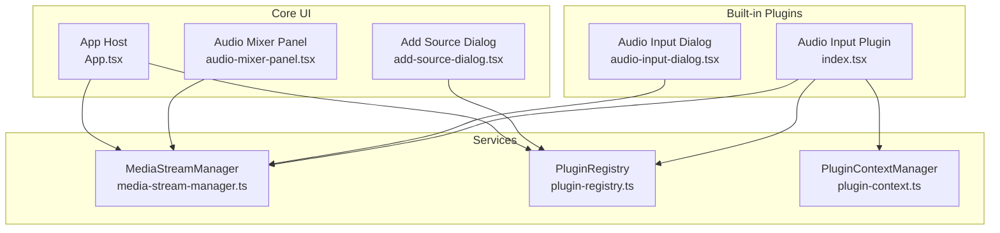
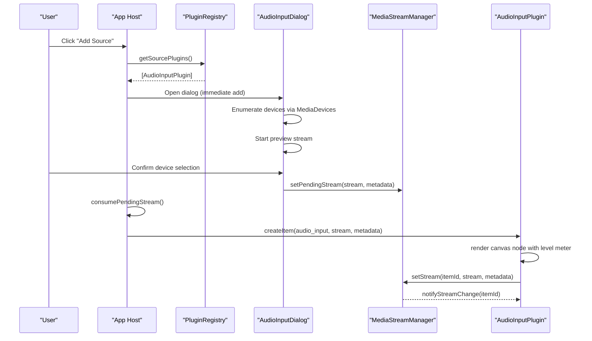
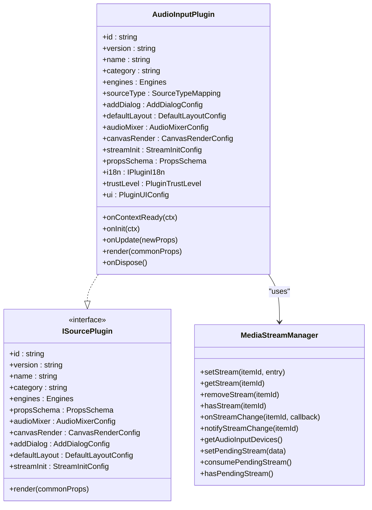
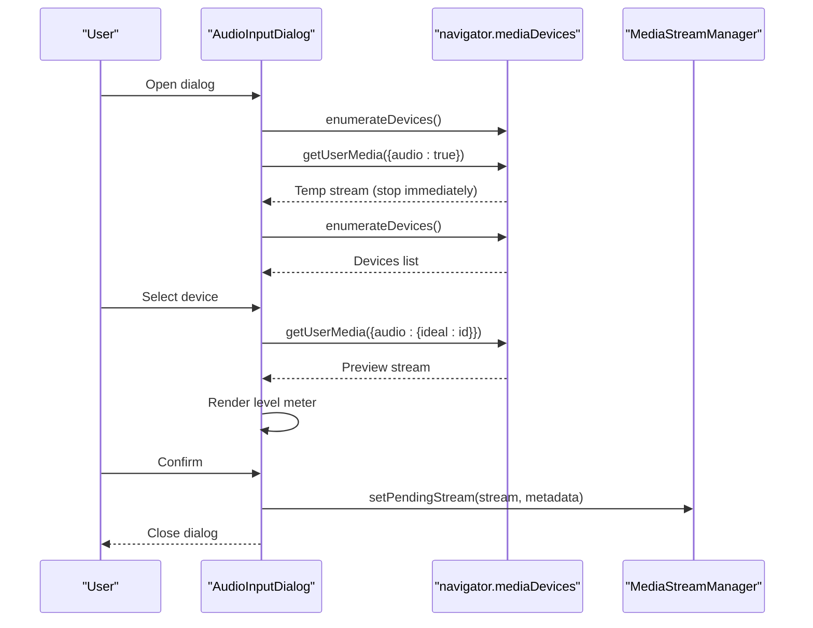
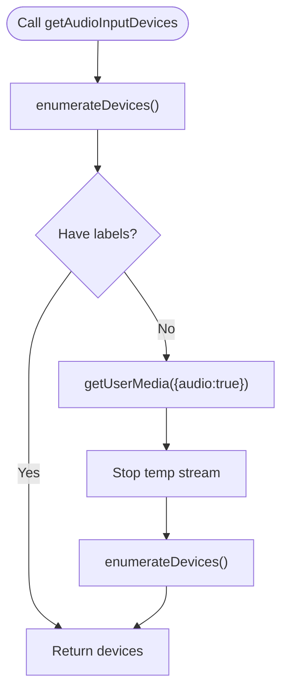
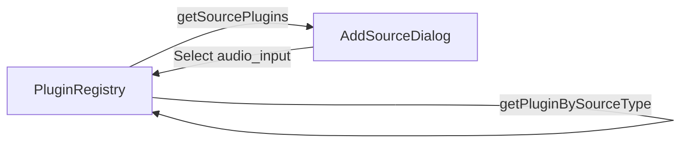
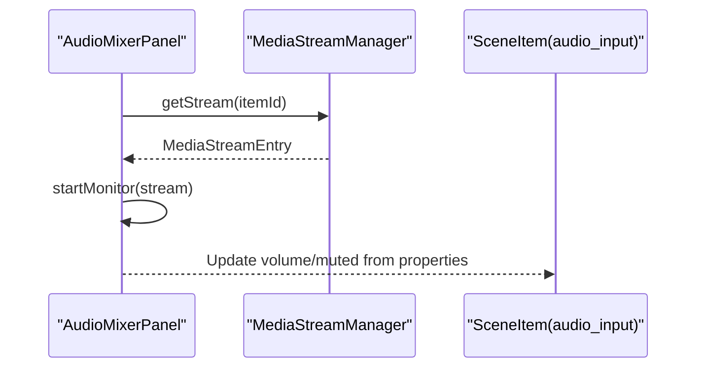
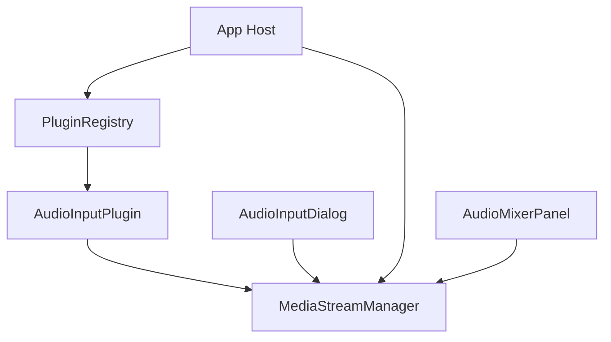

# Audio Input Plugin

<cite>
**Referenced Files in This Document**
- [index.tsx](file://src/plugins/builtin/audio-input/index.tsx)
- [audio-input-dialog.tsx](file://src/plugins/builtin/audio-input/audio-input-dialog.tsx)
- [media-stream-manager.ts](file://src/services/media-stream-manager.ts)
- [plugin-registry.ts](file://src/services/plugin-registry.ts)
- [plugin-context.ts](file://src/services/plugin-context.ts)
- [plugin.ts](file://src/types/plugin.ts)
- [plugin-context.ts](file://src/types/plugin-context.ts)
- [protocol.ts](file://src/types/protocol.ts)
- [add-source-dialog.tsx](file://src/components/add-source-dialog.tsx)
- [audio-mixer-panel.tsx](file://src/components/audio-mixer-panel.tsx)
- [App.tsx](file://src/App.tsx)
</cite>

## Table of Contents
1. [Introduction](#introduction)
2. [Project Structure](#project-structure)
3. [Core Components](#core-components)
4. [Architecture Overview](#architecture-overview)
5. [Detailed Component Analysis](#detailed-component-analysis)
6. [Dependency Analysis](#dependency-analysis)
7. [Performance Considerations](#performance-considerations)
8. [Troubleshooting Guide](#troubleshooting-guide)
9. [Conclusion](#conclusion)
10. [Appendices](#appendices)

## Introduction
The Audio Input Plugin enables microphone capture and visualization within LiveMixer Web. It integrates with the Web Audio API to enumerate devices, request permissions, manage MediaStreams, and provide real-time audio level monitoring. The plugin supports audio mixing controls (volume, mute) and can render a visual level meter on the canvas. It is designed as a built-in plugin with full permissions to access devices and UI components.

## Project Structure
The Audio Input Plugin resides under the built-in plugins directory and interacts with several core services:
- Plugin definition and UI rendering
- Device enumeration and stream management
- Plugin registry and context system
- Add-source dialog integration
- Audio mixer panel integration

**Diagram sources**
- [index.tsx:105-248](file://src/plugins/builtin/audio-input/index.tsx#L105-L248)
- [audio-input-dialog.tsx:127-292](file://src/plugins/builtin/audio-input/audio-input-dialog.tsx#L127-L292)
- [media-stream-manager.ts:39-323](file://src/services/media-stream-manager.ts#L39-L323)
- [plugin-registry.ts:5-168](file://src/services/plugin-registry.ts#L5-L168)
- [plugin-context.ts:82-708](file://src/services/plugin-context.ts#L82-L708)
- [add-source-dialog.tsx:98-122](file://src/components/add-source-dialog.tsx#L98-L122)
- [audio-mixer-panel.tsx:1-234](file://src/components/audio-mixer-panel.tsx#L1-L234)
- [App.tsx:280-362](file://src/App.tsx#L280-L362)

**Section sources**
- [index.tsx:105-248](file://src/plugins/builtin/audio-input/index.tsx#L105-L248)
- [audio-input-dialog.tsx:127-292](file://src/plugins/builtin/audio-input/audio-input-dialog.tsx#L127-L292)
- [media-stream-manager.ts:39-323](file://src/services/media-stream-manager.ts#L39-L323)
- [plugin-registry.ts:78-168](file://src/services/plugin-registry.ts#L78-L168)
- [plugin-context.ts:82-708](file://src/services/plugin-context.ts#L82-L708)
- [add-source-dialog.tsx:98-122](file://src/components/add-source-dialog.tsx#L98-L122)
- [audio-mixer-panel.tsx:1-234](file://src/components/audio-mixer-panel.tsx#L1-L234)
- [App.tsx:280-362](file://src/App.tsx#L280-L362)

## Core Components
- Audio Input Plugin: Implements the ISourcePlugin interface, defines properties (deviceId, muted, volume, showOnCanvas), and renders a canvas representation with audio level visualization.
- Audio Input Dialog: Provides device enumeration, preview stream, and confirmation flow for selecting a microphone.
- MediaStreamManager: Centralized service for managing streams, device enumeration, and pending stream communication between dialogs and the host.
- Plugin Registry: Registers plugins and exposes source types for the Add Source dialog.
- Plugin Context: Provides secure, permissioned access to application state and actions for plugins.
- Audio Mixer Panel: Integrates audio input items into the mixer for volume/mute controls and level monitoring.

**Section sources**
- [index.tsx:105-248](file://src/plugins/builtin/audio-input/index.tsx#L105-L248)
- [audio-input-dialog.tsx:127-292](file://src/plugins/builtin/audio-input/audio-input-dialog.tsx#L127-L292)
- [media-stream-manager.ts:39-323](file://src/services/media-stream-manager.ts#L39-L323)
- [plugin-registry.ts:78-168](file://src/services/plugin-registry.ts#L78-L168)
- [plugin-context.ts:82-708](file://src/services/plugin-context.ts#L82-L708)
- [audio-mixer-panel.tsx:1-234](file://src/components/audio-mixer-panel.tsx#L1-L234)

## Architecture Overview
The Audio Input Plugin follows a plugin-first architecture:
- The plugin declares its capabilities (source type, UI, audio mixer support).
- The Add Source dialog queries the registry for available source plugins.
- The dialog enumerates devices and starts a preview stream.
- On confirmation, the dialog sets a pending stream that the host consumes to create a scene item.
- The plugin renders a canvas node with audio level visualization and integrates with the audio mixer.

**Diagram sources**
- [add-source-dialog.tsx:98-122](file://src/components/add-source-dialog.tsx#L98-L122)
- [plugin-registry.ts:136-164](file://src/services/plugin-registry.ts#L136-L164)
- [audio-input-dialog.tsx:142-258](file://src/plugins/builtin/audio-input/audio-input-dialog.tsx#L142-L258)
- [App.tsx:344-362](file://src/App.tsx#L344-L362)
- [index.tsx:105-248](file://src/plugins/builtin/audio-input/index.tsx#L105-L248)
- [media-stream-manager.ts:279-301](file://src/services/media-stream-manager.ts#L279-L301)

## Detailed Component Analysis

### Audio Input Plugin
The plugin defines:
- Source type mapping for "audio_input"
- Immediate add dialog configuration
- Audio mixer configuration (volume, mute)
- Canvas render filtering for invisible items
- Stream initialization requirements
- Properties schema for device selection, mute, volume, and canvas visibility
- i18n resources for labels and dialog text

Rendering behavior:
- Renders a canvas node with status text, device label, and a horizontal audio level bar.
- Uses Web Audio API to create an analyser and compute average amplitude across frequency bins.
- Starts/stops audio monitoring based on stream activity and device changes.
- Manages cleanup of analyser nodes, audio elements, and animation frames.

**Diagram sources**
- [index.tsx:105-248](file://src/plugins/builtin/audio-input/index.tsx#L105-L248)
- [media-stream-manager.ts:39-141](file://src/services/media-stream-manager.ts#L39-L141)
- [plugin.ts:164-262](file://src/types/plugin.ts#L164-L262)

**Section sources**
- [index.tsx:105-248](file://src/plugins/builtin/audio-input/index.tsx#L105-L248)
- [index.tsx:255-550](file://src/plugins/builtin/audio-input/index.tsx#L255-L550)
- [media-stream-manager.ts:39-141](file://src/services/media-stream-manager.ts#L39-L141)

### Audio Input Dialog
The dialog:
- Enumerates audio input devices and requests permission when needed.
- Starts a temporary preview stream to allow users to verify microphone selection.
- Displays a vertical audio level meter using Web Audio API.
- Confirms selection and passes the stream and metadata to the host via MediaStreamManager.

**Diagram sources**
- [audio-input-dialog.tsx:142-258](file://src/plugins/builtin/audio-input/audio-input-dialog.tsx#L142-L258)
- [media-stream-manager.ts:189-257](file://src/services/media-stream-manager.ts#L189-L257)

**Section sources**
- [audio-input-dialog.tsx:127-292](file://src/plugins/builtin/audio-input/audio-input-dialog.tsx#L127-L292)
- [audio-input-dialog.tsx:46-121](file://src/plugins/builtin/audio-input/audio-input-dialog.tsx#L46-L121)

### MediaStreamManager
Centralizes stream lifecycle and device enumeration:
- Stores streams with metadata (deviceId, deviceLabel, sourceType).
- Notifies listeners on stream changes.
- Provides unified device enumeration for audio input with permission handling.
- Manages pending streams for dialog-to-app communication.

**Diagram sources**
- [media-stream-manager.ts:189-257](file://src/services/media-stream-manager.ts#L189-L257)

**Section sources**
- [media-stream-manager.ts:39-323](file://src/services/media-stream-manager.ts#L39-L323)

### Plugin Registry and Add Source Dialog
- The registry exposes source plugins to the Add Source dialog.
- The dialog presents built-in plugins and external plugins, allowing users to select "Audio Input".

**Diagram sources**
- [plugin-registry.ts:136-164](file://src/services/plugin-registry.ts#L136-L164)
- [add-source-dialog.tsx:98-122](file://src/components/add-source-dialog.tsx#L98-L122)

**Section sources**
- [plugin-registry.ts:136-164](file://src/services/plugin-registry.ts#L136-L164)
- [add-source-dialog.tsx:98-122](file://src/components/add-source-dialog.tsx#L98-L122)

### Audio Mixer Integration
- Items of type "audio_input" appear in the audio mixer panel.
- The panel monitors stream activity and displays level meters and volume controls.
- The plugin’s properties (muted, volume) are synchronized with the mixer.

**Diagram sources**
- [audio-mixer-panel.tsx:1-234](file://src/components/audio-mixer-panel.tsx#L1-L234)
- [media-stream-manager.ts:67-91](file://src/services/media-stream-manager.ts#L67-L91)

**Section sources**
- [audio-mixer-panel.tsx:1-234](file://src/components/audio-mixer-panel.tsx#L1-L234)
- [index.tsx:134-140](file://src/plugins/builtin/audio-input/index.tsx#L134-L140)

## Dependency Analysis
- The plugin depends on MediaStreamManager for stream storage and device enumeration.
- The dialog depends on MediaDevices APIs and MediaStreamManager for pending stream handling.
- The host (App) coordinates plugin dialogs and creates items using plugin metadata and stream data.
- The audio mixer reads from MediaStreamManager to visualize and control audio input items.

**Diagram sources**
- [index.tsx:1-9](file://src/plugins/builtin/audio-input/index.tsx#L1-L9)
- [audio-input-dialog.tsx:1-14](file://src/plugins/builtin/audio-input/audio-input-dialog.tsx#L1-L14)
- [media-stream-manager.ts:39-323](file://src/services/media-stream-manager.ts#L39-L323)
- [plugin-registry.ts:78-168](file://src/services/plugin-registry.ts#L78-L168)
- [App.tsx:280-362](file://src/App.tsx#L280-L362)
- [audio-mixer-panel.tsx:1-234](file://src/components/audio-mixer-panel.tsx#L1-L234)

**Section sources**
- [index.tsx:1-9](file://src/plugins/builtin/audio-input/index.tsx#L1-L9)
- [audio-input-dialog.tsx:1-14](file://src/plugins/builtin/audio-input/audio-input-dialog.tsx#L1-L14)
- [media-stream-manager.ts:39-323](file://src/services/media-stream-manager.ts#L39-L323)
- [plugin-registry.ts:78-168](file://src/services/plugin-registry.ts#L78-L168)
- [App.tsx:280-362](file://src/App.tsx#L280-L362)
- [audio-mixer-panel.tsx:1-234](file://src/components/audio-mixer-panel.tsx#L1-L234)

## Performance Considerations
- Audio level computation uses AnalyserNode with a fixed fftSize and smoothing constant to balance responsiveness and smoothness.
- Streams are stopped when dialogs close or items are removed to conserve resources.
- The plugin avoids unnecessary re-renders by checking stream activity and device changes before starting monitoring.
- For live streaming, ensure the canvas is continuously rendering to keep the capture stream active; the host manages continuous rendering during streaming.

[No sources needed since this section provides general guidance]

## Troubleshooting Guide
Common issues and resolutions:
- Microphone permissions blocked:
  - The dialog requests permission via getUserMedia before enumerating devices. If permission is denied, device enumeration may return empty lists. Guide users to enable microphone access in browser settings.
- No devices detected:
  - The dialog attempts to enumerate devices and falls back to using track settings from a temporary stream when enumerateDevices does not return labels. If still empty, ensure the site is served over HTTPS and the microphone is physically connected.
- Audio feedback or echo:
  - Use the audio mixer to adjust volume and mute the input when monitoring locally. Avoid playing the same microphone input through speakers/headphones without proper isolation.
  - Disable system audio monitoring if the plugin is capturing system sounds unintentionally.
- Audio level meter not updating:
  - Ensure the stream remains active and the plugin is subscribed to stream changes. Verify that the analyser is created and the animation frame loop is running.
- Stream ends unexpectedly:
  - The plugin listens for track onended events and cleans up resources. Recreate the item or switch devices if the stream stops.

**Section sources**
- [audio-input-dialog.tsx:142-214](file://src/plugins/builtin/audio-input/audio-input-dialog.tsx#L142-L214)
- [index.tsx:308-376](file://src/plugins/builtin/audio-input/index.tsx#L308-L376)
- [media-stream-manager.ts:77-91](file://src/services/media-stream-manager.ts#L77-L91)

## Conclusion
The Audio Input Plugin provides a robust, plugin-first solution for microphone capture in LiveMixer Web. It integrates seamlessly with device enumeration, stream management, and the audio mixer, while offering real-time visualization and configurable audio controls. The architecture ensures clean separation of concerns, centralized stream management, and extensibility for future enhancements.

[No sources needed since this section summarizes without analyzing specific files]

## Appendices

### Configuration Options
- Device selection: Choose a microphone from the dialog’s device list.
- Mute: Toggle muting the local audio playback for monitoring.
- Volume: Adjust the local playback volume in the audio mixer.
- Canvas visibility: Hide the canvas node by setting "Show on Canvas" to false.

**Section sources**
- [index.tsx:151-179](file://src/plugins/builtin/audio-input/index.tsx#L151-L179)
- [audio-mixer-panel.tsx:90-179](file://src/components/audio-mixer-panel.tsx#L90-L179)

### Audio Routing Scenarios
- Local monitoring: Use the plugin’s canvas node to visualize microphone input; adjust volume and mute in the audio mixer.
- Live streaming: Ensure the canvas is continuously rendering during streaming; the host manages capture and push to the streaming service.
- Multi-device setup: Add multiple audio input items to monitor different microphones simultaneously; control each item’s volume independently.

**Section sources**
- [App.tsx:726-788](file://src/App.tsx#L726-L788)
- [audio-mixer-panel.tsx:190-234](file://src/components/audio-mixer-panel.tsx#L190-L234)

### Best Practices for Audio Quality and Latency
- Prefer modern browsers with strong Web Audio API support.
- Use HTTPS to ensure device enumeration and getUserMedia work reliably.
- Minimize concurrent audio processing to reduce CPU usage and latency.
- Keep the canvas rendering active during streaming to maintain a stable capture stream.
- Use the audio mixer to prevent clipping and maintain consistent levels across multiple inputs.

[No sources needed since this section provides general guidance]