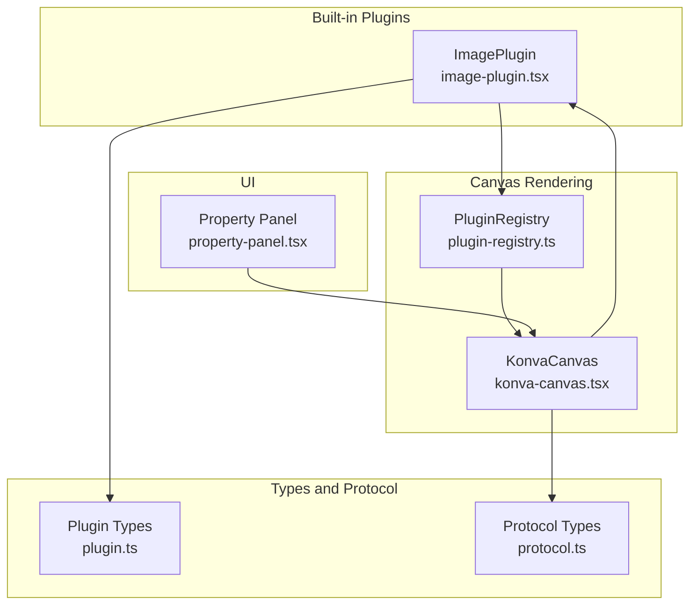
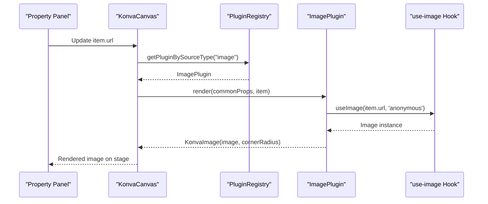
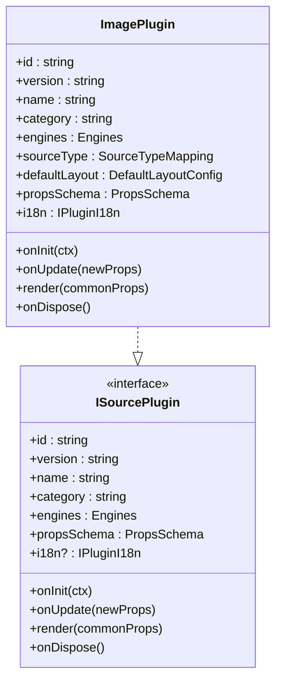
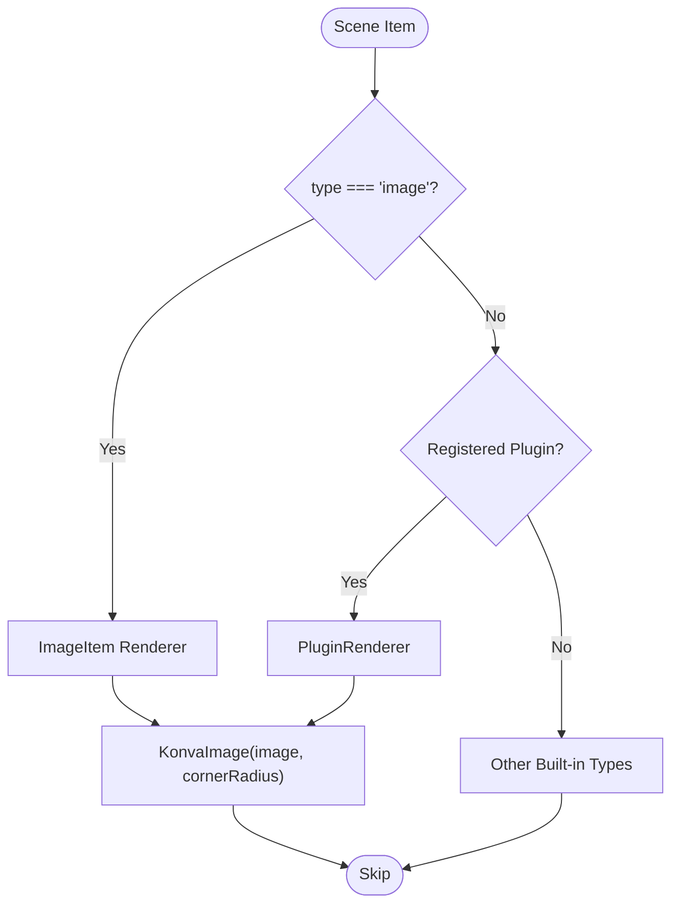
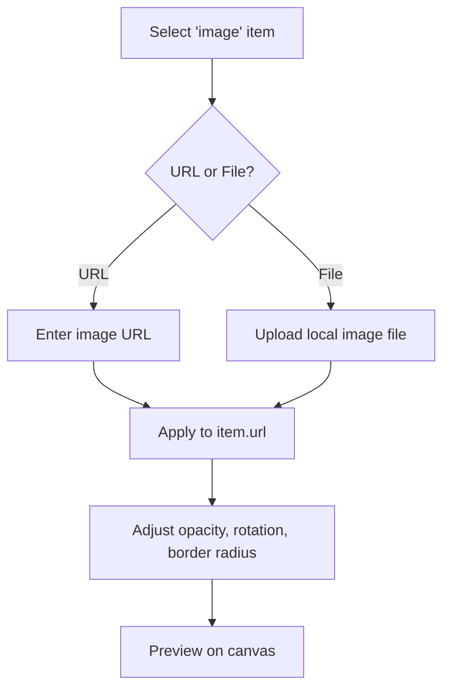
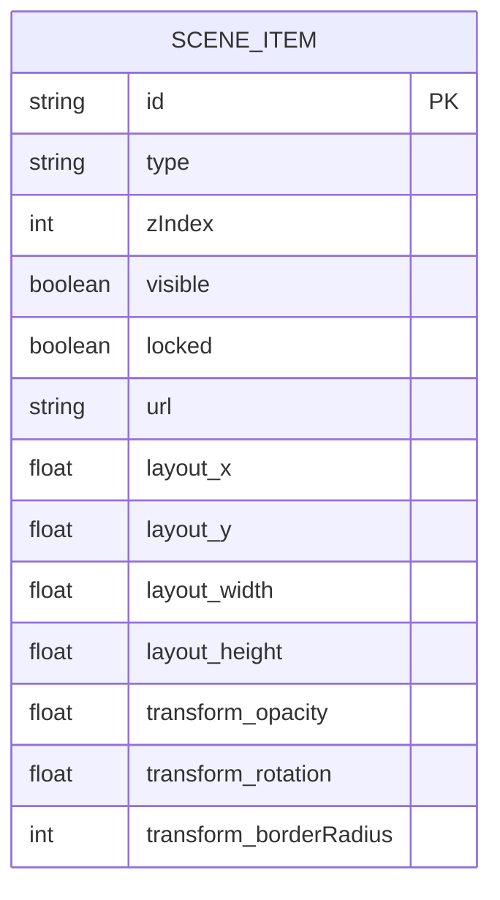
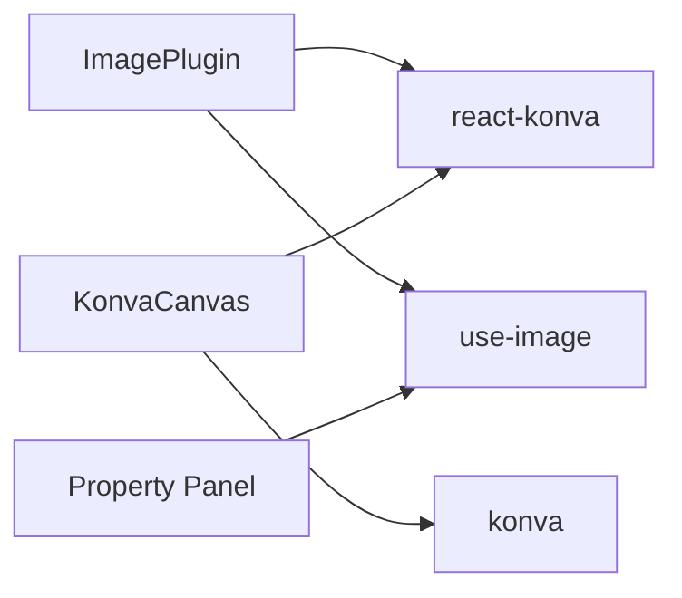

# Image Plugin

<cite>
**Referenced Files in This Document**
- [image-plugin.tsx](file://src/plugins/builtin/image-plugin.tsx)
- [plugin-registry.ts](file://src/services/plugin-registry.ts)
- [plugin.ts](file://src/types/plugin.ts)
- [konva-canvas.tsx](file://src/components/konva-canvas.tsx)
- [protocol.ts](file://src/types/protocol.ts)
- [property-panel.tsx](file://src/components/property-panel.tsx)
- [package.json](file://package.json)
</cite>

## Table of Contents
1. [Introduction](#introduction)
2. [Project Structure](#project-structure)
3. [Core Components](#core-components)
4. [Architecture Overview](#architecture-overview)
5. [Detailed Component Analysis](#detailed-component-analysis)
6. [Dependency Analysis](#dependency-analysis)
7. [Performance Considerations](#performance-considerations)
8. [Troubleshooting Guide](#troubleshooting-guide)
9. [Conclusion](#conclusion)

## Introduction
This document describes the Image Plugin in LiveMixer Web, focusing on static image display functionality. It covers how images are loaded, scaled, positioned, and rendered onto the canvas, along with configuration options for borders, transparency, and performance considerations. The plugin integrates with the canvas rendering system and supports common image formats via the browser’s native image loader.

## Project Structure
The Image Plugin is implemented as a built-in plugin and integrates with the canvas rendering pipeline and property panel for configuration.

**Diagram sources**
- [image-plugin.tsx:1-105](file://src/plugins/builtin/image-plugin.tsx#L1-L105)
- [plugin-registry.ts:1-168](file://src/services/plugin-registry.ts#L1-L168)
- [konva-canvas.tsx:1-744](file://src/components/konva-canvas.tsx#L1-L744)
- [plugin.ts:164-262](file://src/types/plugin.ts#L164-L262)
- [protocol.ts:20-82](file://src/types/protocol.ts#L20-L82)
- [property-panel.tsx:643-1674](file://src/components/property-panel.tsx#L643-L1674)

**Section sources**
- [image-plugin.tsx:1-105](file://src/plugins/builtin/image-plugin.tsx#L1-L105)
- [plugin-registry.ts:78-118](file://src/services/plugin-registry.ts#L78-L118)
- [konva-canvas.tsx:458-470](file://src/components/konva-canvas.tsx#L458-L470)
- [plugin.ts:164-262](file://src/types/plugin.ts#L164-L262)
- [protocol.ts:20-82](file://src/types/protocol.ts#L20-L82)
- [property-panel.tsx:1164-1276](file://src/components/property-panel.tsx#L1164-L1276)

## Core Components
- ImagePlugin: Implements the image source plugin with schema, i18n, and render function.
- PluginRegistry: Registers plugins, initializes contexts, and resolves plugin instances by source type.
- KonvaCanvas: Renders scene items, including images, via Konva nodes and handles transformations.
- Property Panel: Provides UI for configuring image URL (from file or URL), opacity, rotation, and border radius.

Key capabilities:
- Loads images via a hook-based loader.
- Renders images with Konva Image nodes.
- Supports basic transforms: opacity, rotation, and border radius.
- Integrates with the canvas selection and transformation system.

**Section sources**
- [image-plugin.tsx:7-104](file://src/plugins/builtin/image-plugin.tsx#L7-L104)
- [plugin-registry.ts:78-118](file://src/services/plugin-registry.ts#L78-L118)
- [konva-canvas.tsx:80-95](file://src/components/konva-canvas.tsx#L80-L95)
- [property-panel.tsx:1164-1276](file://src/components/property-panel.tsx#L1164-L1276)

## Architecture Overview
The Image Plugin participates in the plugin-driven rendering pipeline. Items with type "image" are handled either by the dedicated image renderer inside the canvas or by the plugin renderer depending on registration.

**Diagram sources**
- [konva-canvas.tsx:458-470](file://src/components/konva-canvas.tsx#L458-L470)
- [image-plugin.tsx:78-100](file://src/plugins/builtin/image-plugin.tsx#L78-L100)
- [plugin-registry.ts:144-157](file://src/services/plugin-registry.ts#L144-L157)

## Detailed Component Analysis

### ImagePlugin Implementation
The plugin defines:
- Metadata: id, version, name, category, engine compatibility.
- Source type mapping: "image" type for add-source dialog.
- Default layout: initial x, y, width, height.
- Properties schema: url (image), borderRadius (number).
- i18n resources for English and Chinese labels.
- Lifecycle: onInit, onUpdate, render, onDispose.
- Render function: loads image via use-image, passes to KonvaImage with cornerRadius.

**Diagram sources**
- [image-plugin.tsx:7-104](file://src/plugins/builtin/image-plugin.tsx#L7-L104)
- [plugin.ts:164-262](file://src/types/plugin.ts#L164-L262)

**Section sources**
- [image-plugin.tsx:7-104](file://src/plugins/builtin/image-plugin.tsx#L7-L104)
- [plugin.ts:164-262](file://src/types/plugin.ts#L164-L262)

### Canvas Rendering Integration
KonvaCanvas handles image rendering in two ways:
- Dedicated ImageItem component for direct "image" type items.
- PluginRenderer for items mapped to registered plugins (including ImagePlugin).

It applies transforms (opacity, rotation, border radius) and integrates with selection/transformer controls.

**Diagram sources**
- [konva-canvas.tsx:411-601](file://src/components/konva-canvas.tsx#L411-L601)
- [konva-canvas.tsx:80-95](file://src/components/konva-canvas.tsx#L80-L95)

**Section sources**
- [konva-canvas.tsx:80-95](file://src/components/konva-canvas.tsx#L80-L95)
- [konva-canvas.tsx:411-601](file://src/components/konva-canvas.tsx#L411-L601)

### Property Panel Configuration
The property panel provides:
- URL input: choose between URL or local file upload for image items.
- Transform controls: opacity and rotation sliders.
- Border radius input for compatible types (window, scene_ref, color) and via plugin props for image items.

**Diagram sources**
- [property-panel.tsx:1164-1276](file://src/components/property-panel.tsx#L1164-L1276)
- [property-panel.tsx:840-916](file://src/components/property-panel.tsx#L840-L916)

**Section sources**
- [property-panel.tsx:1164-1276](file://src/components/property-panel.tsx#L1164-L1276)
- [property-panel.tsx:840-916](file://src/components/property-panel.tsx#L840-L916)

### Data Model and Transforms
Scene items carry layout and transform properties. Images use:
- layout: x, y, width, height.
- transform: opacity, rotation, borderRadius.
- url: image source URL or blob.

**Diagram sources**
- [protocol.ts:20-82](file://src/types/protocol.ts#L20-L82)

**Section sources**
- [protocol.ts:20-82](file://src/types/protocol.ts#L20-L82)

## Dependency Analysis
External libraries used by the Image Plugin and related components:
- react-konva: Konva integration for React.
- use-image: Hook for loading images with caching and error handling.
- konva: Canvas rendering engine.

These dependencies enable efficient image loading and rendering within the canvas.

**Diagram sources**
- [package.json:67-76](file://package.json#L67-L76)
- [image-plugin.tsx:1-5](file://src/plugins/builtin/image-plugin.tsx#L1-L5)
- [konva-canvas.tsx:1-18](file://src/components/konva-canvas.tsx#L1-L18)
- [property-panel.tsx:1-20](file://src/components/property-panel.tsx#L1-L20)

**Section sources**
- [package.json:67-76](file://package.json#L67-L76)
- [image-plugin.tsx:1-5](file://src/plugins/builtin/image-plugin.tsx#L1-L5)
- [konva-canvas.tsx:1-18](file://src/components/konva-canvas.tsx#L1-L18)
- [property-panel.tsx:1-20](file://src/components/property-panel.tsx#L1-L20)

## Performance Considerations
- Image loading: The plugin uses a hook-based loader that caches images and handles cross-origin requests. Prefer hosting images with appropriate CORS headers to avoid loading failures.
- Canvas rendering: Konva draws efficiently via batching and requestAnimationFrame loops. Keep image sizes reasonable to minimize memory usage.
- Large images: Consider pre-scaling images to the intended display size to reduce GPU memory and improve rendering performance.
- Transparency and filters: While the schema exposes a filters field, the current implementation does not apply filters for images. Avoid unnecessary heavy filters for optimal performance.
- Selection and transformation: The transformer enforces minimum size and respects locked items, preventing accidental large redraws.

[No sources needed since this section provides general guidance]

## Troubleshooting Guide
Common issues and resolutions:
- Cross-origin errors: Ensure the image URL allows cross-origin access. The loader uses an anonymous mode to prevent credentials leakage.
- Blank or missing images: Verify the URL is accessible and returns a valid image. Local files are stored as blob URLs; confirm the blob remains valid.
- Transformation not applying: Confirm the item is selected and unlocked; locked items cannot be transformed.
- Border radius not visible: Ensure the image is not cropped; border radius applies to the image node bounds.

**Section sources**
- [image-plugin.tsx:88-98](file://src/plugins/builtin/image-plugin.tsx#L88-L98)
- [konva-canvas.tsx:377-410](file://src/components/konva-canvas.tsx#L377-L410)

## Conclusion
The Image Plugin provides a straightforward way to display static images in LiveMixer Web. It integrates cleanly with the canvas rendering system, supports essential transforms, and offers a user-friendly property panel for configuration. By following best practices for image formats, resolutions, and loading, you can achieve high-quality visuals with strong performance.