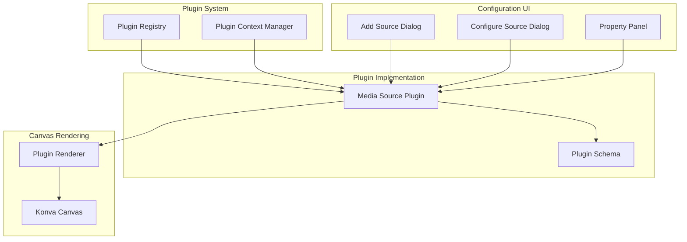
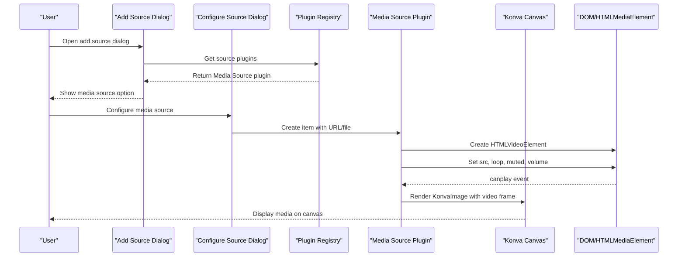
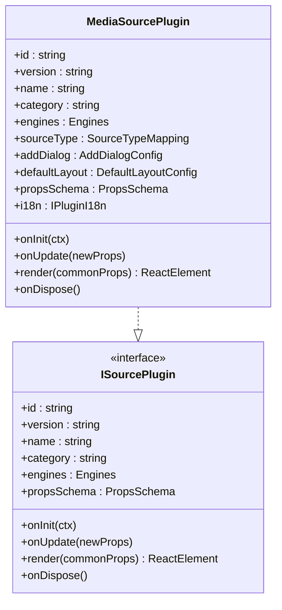
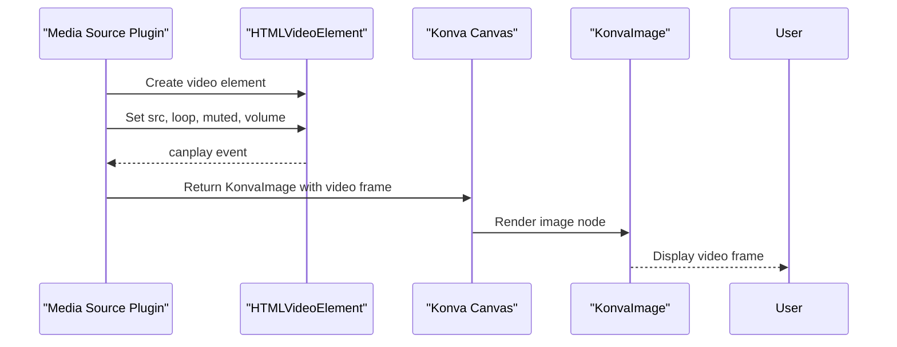
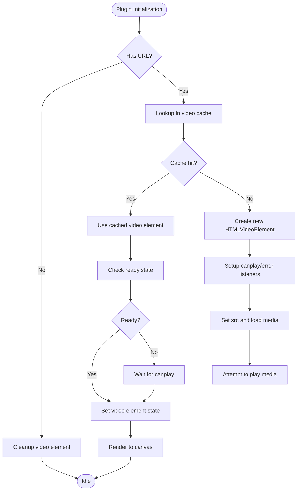
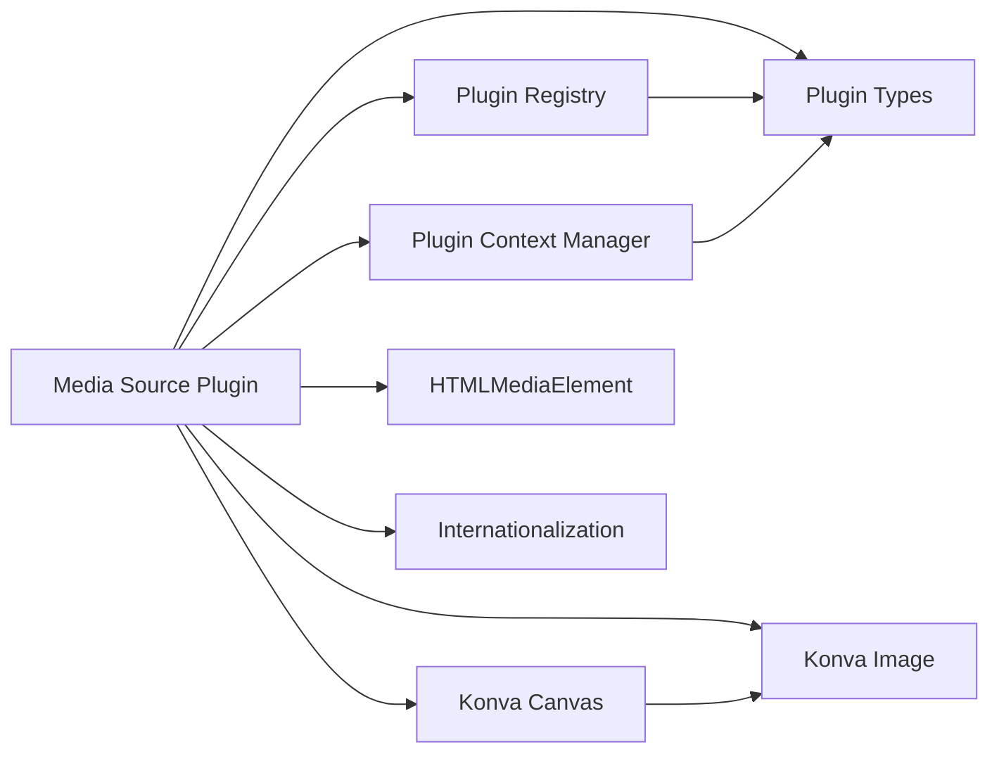

# Media Source Plugin

<cite>
**Referenced Files in This Document**
- [mediasource-plugin.tsx](file://src/plugins/builtin/mediasource-plugin.tsx)
- [plugin.ts](file://src/types/plugin.ts)
- [plugin-context.ts](file://src/types/plugin-context.ts)
- [plugin-registry.ts](file://src/services/plugin-registry.ts)
- [media-stream-manager.ts](file://src/services/media-stream-manager.ts)
- [konva-canvas.tsx](file://src/components/konva-canvas.tsx)
- [add-source-dialog.tsx](file://src/components/add-source-dialog.tsx)
- [configure-source-dialog.tsx](file://src/components/configure-source-dialog.tsx)
- [property-panel.tsx](file://src/components/property-panel.tsx)
</cite>

## Table of Contents
1. [Introduction](#introduction)
2. [Project Structure](#project-structure)
3. [Core Components](#core-components)
4. [Architecture Overview](#architecture-overview)
5. [Detailed Component Analysis](#detailed-component-analysis)
6. [Dependency Analysis](#dependency-analysis)
7. [Performance Considerations](#performance-considerations)
8. [Troubleshooting Guide](#troubleshooting-guide)
9. [Conclusion](#conclusion)

## Introduction
The Media Source Plugin enables video and audio playback within LiveMixer Web. It integrates with HTMLMediaElement to render media frames onto the canvas and provides controls for playback behavior, including looping, muting, volume, and opacity. The plugin supports both video and audio media types and offers flexible configuration through the property panel.

## Project Structure
The Media Source Plugin is implemented as a built-in plugin and integrates with the plugin system, canvas rendering, and configuration dialogs.

**Diagram sources**
- [plugin-registry.ts:1-168](file://src/services/plugin-registry.ts#L1-L168)
- [mediasource-plugin.tsx:1-307](file://src/plugins/builtin/mediasource-plugin.tsx#L1-L307)
- [konva-canvas.tsx:24-38](file://src/components/konva-canvas.tsx#L24-L38)
- [add-source-dialog.tsx:77-96](file://src/components/add-source-dialog.tsx#L77-L96)
- [configure-source-dialog.tsx:29-117](file://src/components/configure-source-dialog.tsx#L29-L117)
- [property-panel.tsx:643-717](file://src/components/property-panel.tsx#L643-L717)

**Section sources**
- [mediasource-plugin.tsx:1-307](file://src/plugins/builtin/mediasource-plugin.tsx#L1-L307)
- [plugin-registry.ts:1-168](file://src/services/plugin-registry.ts#L1-L168)
- [konva-canvas.tsx:1-744](file://src/components/konva-canvas.tsx#L1-L744)

## Core Components
- Media Source Plugin: Implements the plugin interface, manages HTMLMediaElement lifecycle, and renders video frames to the canvas.
- Plugin Registry: Registers plugins and exposes them to the UI and canvas rendering system.
- Konva Canvas: Renders plugin components using Konva nodes and handles selection and transformation.
- Configuration UI: Provides dialogs for adding and configuring media sources, including URL/file selection and property editing.

Key capabilities:
- Supports video and audio playback via HTMLMediaElement
- Configurable playback controls: loop, mute, volume, opacity
- Canvas rendering modes: video frame rendering or audio-only ghost indicator
- Internationalization support for plugin labels

**Section sources**
- [mediasource-plugin.tsx:13-110](file://src/plugins/builtin/mediasource-plugin.tsx#L13-L110)
- [plugin.ts:164-262](file://src/types/plugin.ts#L164-L262)
- [plugin-context.ts:321-403](file://src/types/plugin-context.ts#L321-L403)

## Architecture Overview
The Media Source Plugin follows a plugin-first architecture with clear separation of concerns:

**Diagram sources**
- [add-source-dialog.tsx:98-122](file://src/components/add-source-dialog.tsx#L98-L122)
- [configure-source-dialog.tsx:29-117](file://src/components/configure-source-dialog.tsx#L29-L117)
- [mediasource-plugin.tsx:137-198](file://src/plugins/builtin/mediasource-plugin.tsx#L137-L198)
- [konva-canvas.tsx:458-470](file://src/components/konva-canvas.tsx#L458-L470)

## Detailed Component Analysis

### Media Source Plugin Implementation
The plugin implements the ISourcePlugin interface and manages HTMLMediaElement lifecycle:

**Diagram sources**
- [mediasource-plugin.tsx:13-262](file://src/plugins/builtin/mediasource-plugin.tsx#L13-L262)
- [plugin.ts:164-262](file://src/types/plugin.ts#L164-L262)

Key implementation details:
- HTMLVideoElement caching to avoid recreation during updates
- Cross-origin handling with anonymous mode
- Event-driven initialization with canplay/error handling
- Conditional rendering: video frame vs audio-only ghost indicator
- Volume/mute/loop updates without interrupting playback

**Section sources**
- [mediasource-plugin.tsx:137-225](file://src/plugins/builtin/mediasource-plugin.tsx#L137-L225)

### Canvas Integration and Rendering
The plugin integrates with Konva for rendering:

**Diagram sources**
- [mediasource-plugin.tsx:230-243](file://src/plugins/builtin/mediasource-plugin.tsx#L230-L243)
- [konva-canvas.tsx:458-470](file://src/components/konva-canvas.tsx#L458-L470)

Rendering modes:
- Video mode: Renders video frames as KonvaImage nodes
- Audio-only mode: Renders a transparent ghost indicator with dashed border

**Section sources**
- [mediasource-plugin.tsx:230-299](file://src/plugins/builtin/mediasource-plugin.tsx#L230-L299)
- [konva-canvas.tsx:458-470](file://src/components/konva-canvas.tsx#L458-L470)

### Configuration and Property Management
The plugin exposes configurable properties through its propsSchema:

| Property | Type | Default | Description |
|----------|------|---------|-------------|
| url | video | "" | Media URL or blob URL |
| showVideo | boolean | true | Enable/disable video rendering |
| loop | boolean | true | Loop playback |
| muted | boolean | false | Mute audio |
| volume | number | 1.0 | Volume level (0.0-1.0) |
| opacity | number | 1.0 | Opacity level (0.0-1.0) |

Configuration UI integration:
- Add Source Dialog: Lists Media Source as available source type
- Configure Source Dialog: Allows URL/file selection for media
- Property Panel: Provides live editing of all properties

**Section sources**
- [mediasource-plugin.tsx:37-80](file://src/plugins/builtin/mediasource-plugin.tsx#L37-L80)
- [add-source-dialog.tsx:77-96](file://src/components/add-source-dialog.tsx#L77-L96)
- [configure-source-dialog.tsx:29-117](file://src/components/configure-source-dialog.tsx#L29-L117)
- [property-panel.tsx:643-717](file://src/components/property-panel.tsx#L643-L717)

### Timeline Controls and Synchronization
The plugin integrates with the broader plugin context system for timeline operations:

**Diagram sources**
- [mediasource-plugin.tsx:137-198](file://src/plugins/builtin/mediasource-plugin.tsx#L137-L198)

Playback synchronization:
- Volume and mute updates apply without reloading media
- Loop setting updates immediately without interrupting playback
- Opacity affects canvas rendering but not media playback

**Section sources**
- [mediasource-plugin.tsx:200-210](file://src/plugins/builtin/mediasource-plugin.tsx#L200-L210)

## Dependency Analysis
The Media Source Plugin has minimal external dependencies and integrates cleanly with the plugin ecosystem:

**Diagram sources**
- [mediasource-plugin.tsx:1-10](file://src/plugins/builtin/mediasource-plugin.tsx#L1-L10)
- [plugin.ts:1-267](file://src/types/plugin.ts#L1-L267)
- [plugin-registry.ts:1-168](file://src/services/plugin-registry.ts#L1-L168)
- [plugin-context.ts:1-438](file://src/types/plugin-context.ts#L1-L438)

Key dependencies:
- React hooks for state and lifecycle management
- Konva for canvas rendering
- HTMLMediaElement for media playback
- Plugin system for configuration and integration

**Section sources**
- [mediasource-plugin.tsx:1-10](file://src/plugins/builtin/mediasource-plugin.tsx#L1-L10)
- [plugin.ts:1-267](file://src/types/plugin.ts#L1-L267)

## Performance Considerations
Performance characteristics of the Media Source Plugin:

- Memory management: Video elements are cached globally to avoid recreation during property updates
- Event-driven loading: Uses canplay event to minimize blocking operations
- Minimal DOM manipulation: Video elements are hidden and managed separately from the canvas
- Efficient rendering: Video frames are rendered as KonvaImage nodes for optimal canvas performance

Optimization recommendations:
- Prefer local file URLs for large media files to reduce network latency
- Use appropriate video formats supported by the browser (MP4/H.264, WebM/VP8/VP9)
- Consider reducing video resolution for smoother playback on lower-end devices
- Disable showVideo mode when only audio is needed to conserve resources

[No sources needed since this section provides general guidance]

## Troubleshooting Guide

### Unsupported Media Formats
Common issues and solutions:
- **Problem**: Video fails to load or play
- **Cause**: Browser does not support the codec/format
- **Solution**: Convert to widely supported formats (MP4/H.264, WebM/VP9)
- **Verification**: Test the URL directly in the browser

### CORS Issues
Common issues and solutions:
- **Problem**: Video shows black screen or fails to render
- **Cause**: Cross-origin restrictions prevent video loading
- **Solution**: Ensure server sets appropriate CORS headers or use a proxy
- **Debugging**: Check browser console for CORS-related errors

### Autoplay Policy
Common issues and solutions:
- **Problem**: Video does not start automatically
- **Cause**: Browser autoplay policies restrict automatic playback
- **Solution**: User interaction required to start playback
- **Workaround**: Provide explicit play controls in the UI

### Performance Optimization for Large Media Files
- Use compressed video formats with appropriate bitrates
- Consider progressive download or streaming formats
- Monitor memory usage with browser developer tools
- Implement lazy loading for large media libraries

**Section sources**
- [mediasource-plugin.tsx:166-168](file://src/plugins/builtin/mediasource-plugin.tsx#L166-L168)
- [mediasource-plugin.tsx:182-186](file://src/plugins/builtin/mediasource-plugin.tsx#L182-L186)

## Conclusion
The Media Source Plugin provides robust video and audio playback capabilities within LiveMixer Web. Its integration with HTMLMediaElement ensures compatibility with modern browsers while leveraging the plugin system for extensibility. The plugin offers comprehensive configuration options, efficient rendering through Konva, and seamless integration with the broader LiveMixer ecosystem. Proper handling of CORS, autoplay policies, and media format compatibility ensures reliable playback across diverse deployment scenarios.