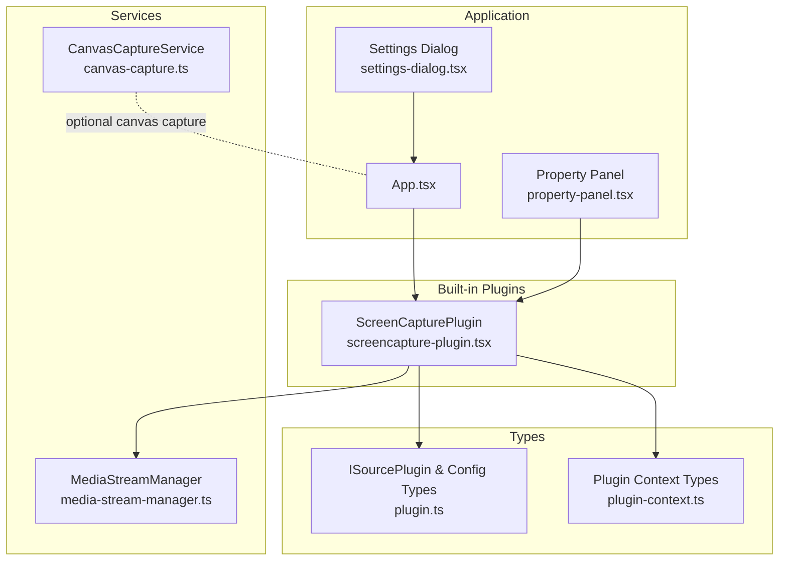
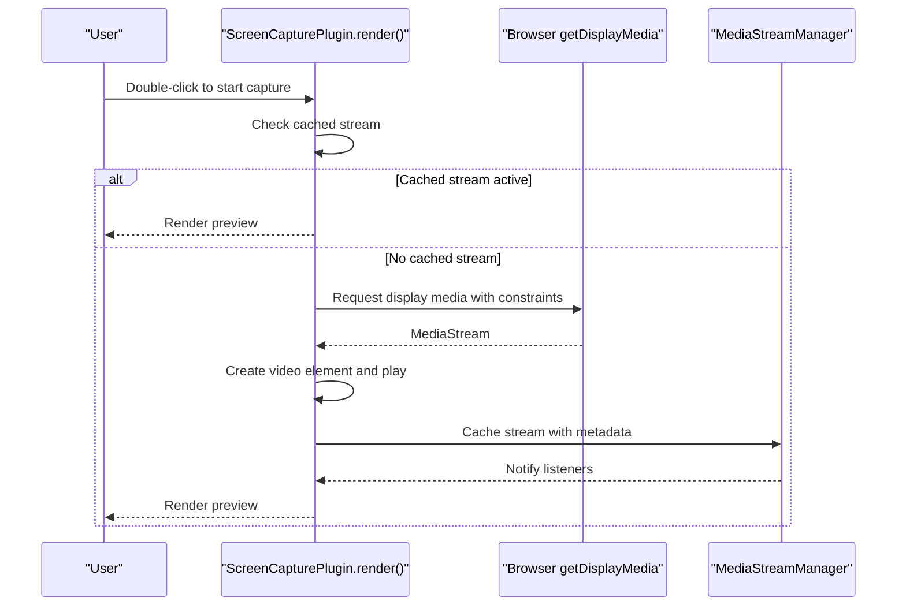
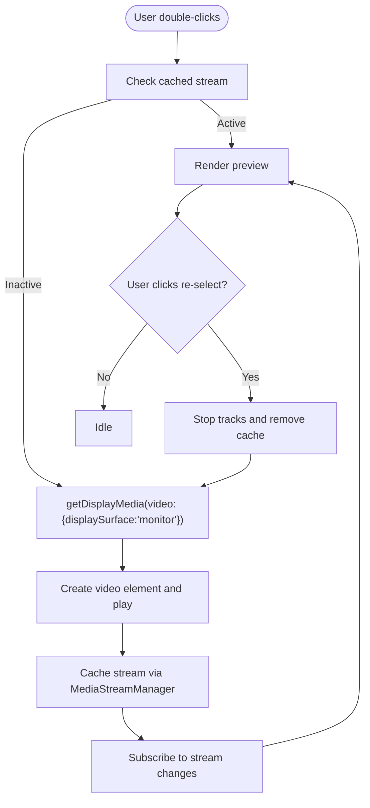
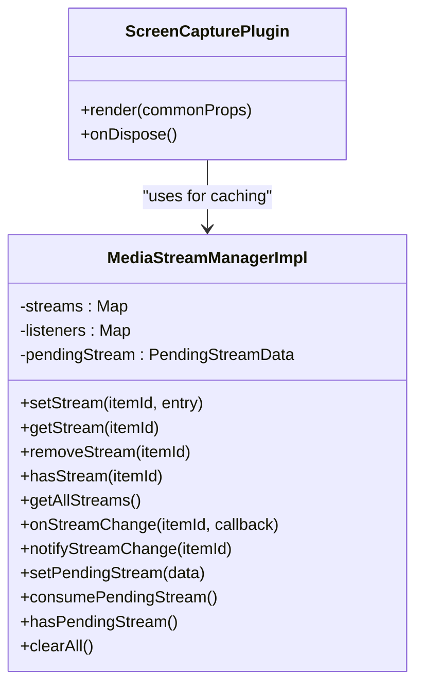
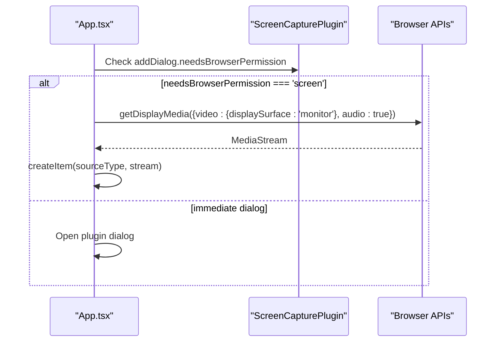
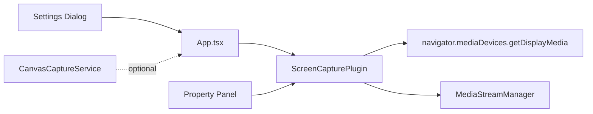

# Screen Capture Plugin

<cite>
**Referenced Files in This Document**
- [screencapture-plugin.tsx](file://src/plugins/builtin/screencapture-plugin.tsx)
- [media-stream-manager.ts](file://src/services/media-stream-manager.ts)
- [plugin.ts](file://src/types/plugin.ts)
- [plugin-context.ts](file://src/types/plugin-context.ts)
- [App.tsx](file://src/App.tsx)
- [canvas-capture.ts](file://src/services/canvas-capture.ts)
- [property-panel.tsx](file://src/components/property-panel.tsx)
- [settings-dialog.tsx](file://src/components/settings-dialog.tsx)
</cite>

## Table of Contents
1. [Introduction](#introduction)
2. [Project Structure](#project-structure)
3. [Core Components](#core-components)
4. [Architecture Overview](#architecture-overview)
5. [Detailed Component Analysis](#detailed-component-analysis)
6. [Dependency Analysis](#dependency-analysis)
7. [Performance Considerations](#performance-considerations)
8. [Troubleshooting Guide](#troubleshooting-guide)
9. [Conclusion](#conclusion)

## Introduction
This document describes the Screen Capture Plugin in LiveMixer Web, focusing on how it integrates with browser screen capture APIs to enable screen sharing, window capture, and tab capture modes. It explains permission handling, user gesture requirements, configuration options for capture area selection, cursor visibility, and frame rate settings. It also provides troubleshooting guidance for common issues and best practices for achieving high-quality screen sharing.

## Project Structure
The Screen Capture Plugin is implemented as a built-in source plugin and integrates with the application’s media stream management service. The plugin exposes a renderable UI for preview and controls, manages stream lifecycle, and coordinates with the global media stream manager for caching and change notifications.

**Diagram sources**
- [screencapture-plugin.tsx:55-463](file://src/plugins/builtin/screencapture-plugin.tsx#L55-L463)
- [media-stream-manager.ts:39-322](file://src/services/media-stream-manager.ts#L39-L322)
- [App.tsx:285-574](file://src/App.tsx#L285-L574)
- [plugin.ts:164-262](file://src/types/plugin.ts#L164-L262)
- [plugin-context.ts:322-403](file://src/types/plugin-context.ts#L322-L403)
- [canvas-capture.ts:5-47](file://src/services/canvas-capture.ts#L5-L47)
- [property-panel.tsx:1087-1141](file://src/components/property-panel.tsx#L1087-L1141)
- [settings-dialog.tsx:374-588](file://src/components/settings-dialog.tsx#L374-L588)

**Section sources**
- [screencapture-plugin.tsx:55-463](file://src/plugins/builtin/screencapture-plugin.tsx#L55-L463)
- [media-stream-manager.ts:39-322](file://src/services/media-stream-manager.ts#L39-L322)
- [plugin.ts:164-262](file://src/types/plugin.ts#L164-L262)
- [plugin-context.ts:322-403](file://src/types/plugin-context.ts#L322-L403)
- [App.tsx:285-574](file://src/App.tsx#L285-L574)
- [canvas-capture.ts:5-47](file://src/services/canvas-capture.ts#L5-L47)
- [property-panel.tsx:1087-1141](file://src/components/property-panel.tsx#L1087-L1141)
- [settings-dialog.tsx:374-588](file://src/components/settings-dialog.tsx#L374-L588)

## Core Components
- ScreenCapturePlugin: Implements the plugin contract, renders a preview rectangle with interactive controls, and manages screen capture lifecycle via browser APIs.
- MediaStreamManager: Centralized service for registering, caching, and notifying changes for media streams used across plugins.
- Plugin Types: Define the plugin contract, UI integration, permissions, and configuration schemas.
- Application Integration: Handles immediate permission requests for screen capture during add-source flows and creates scene items with associated streams.
- Property Panel: Provides re-selection of capture sources and toggles for audio inclusion.
- Settings Dialog: Offers output encoder and FPS configuration affecting overall rendering quality.

**Section sources**
- [screencapture-plugin.tsx:55-463](file://src/plugins/builtin/screencapture-plugin.tsx#L55-L463)
- [media-stream-manager.ts:39-322](file://src/services/media-stream-manager.ts#L39-L322)
- [plugin.ts:164-262](file://src/types/plugin.ts#L164-L262)
- [plugin-context.ts:322-403](file://src/types/plugin-context.ts#L322-L403)
- [App.tsx:285-574](file://src/App.tsx#L285-L574)
- [property-panel.tsx:1087-1141](file://src/components/property-panel.tsx#L1087-L1141)
- [settings-dialog.tsx:374-588](file://src/components/settings-dialog.tsx#L374-L588)

## Architecture Overview
The plugin follows a decoupled architecture:
- The plugin declares its capabilities (source type, add dialog behavior, stream init, audio mixer support).
- On user interaction, the plugin requests display media with constraints.
- The returned stream is cached and managed by MediaStreamManager, which notifies subscribers.
- The plugin renders a Konva-based preview and exposes controls for re-selection and visibility.

**Diagram sources**
- [screencapture-plugin.tsx:191-258](file://src/plugins/builtin/screencapture-plugin.tsx#L191-L258)
- [media-stream-manager.ts:56-91](file://src/services/media-stream-manager.ts#L56-L91)

**Section sources**
- [screencapture-plugin.tsx:158-463](file://src/plugins/builtin/screencapture-plugin.tsx#L158-L463)
- [media-stream-manager.ts:56-91](file://src/services/media-stream-manager.ts#L56-L91)

## Detailed Component Analysis

### ScreenCapturePlugin Implementation
- Plugin identity and metadata: Declares ID, version, category, and source type mapping for “screen_capture”.
- Add dialog configuration: Immediate permission request for screen capture and browser permission flag.
- Default layout and audio mixer: Defines default size and audio controls (volume, mute).
- Stream initialization: Indicates stream creation is required and identifies stream type as “screen”.
- Properties schema: Exposes captureAudio, muted, volume, opacity, and showVideo controls.
- Rendering and interaction:
  - Renders a placeholder with instructions until connected.
  - On double-click, starts capture via getDisplayMedia with displaySurface constraint.
  - Creates a hidden video element, plays it, and caches the stream.
  - Subscribes to stream changes and updates audio settings dynamically.
  - Provides a re-select button overlay to restart capture.

**Diagram sources**
- [screencapture-plugin.tsx:191-258](file://src/plugins/builtin/screencapture-plugin.tsx#L191-L258)
- [media-stream-manager.ts:56-91](file://src/services/media-stream-manager.ts#L56-L91)

**Section sources**
- [screencapture-plugin.tsx:55-163](file://src/plugins/builtin/screencapture-plugin.tsx#L55-L163)
- [screencapture-plugin.tsx:164-463](file://src/plugins/builtin/screencapture-plugin.tsx#L164-L463)

### MediaStreamManager Integration
- Caching and change notifications: Stores streams with metadata and emits change events to subscribers.
- Stream lifecycle: Stops tracks and removes DOM video elements when streams are removed.
- Pending stream handling: Supports dialog-to-app communication for passing pre-selected streams.

**Diagram sources**
- [media-stream-manager.ts:39-322](file://src/services/media-stream-manager.ts#L39-L322)
- [screencapture-plugin.tsx:158-463](file://src/plugins/builtin/screencapture-plugin.tsx#L158-L463)

**Section sources**
- [media-stream-manager.ts:39-322](file://src/services/media-stream-manager.ts#L39-L322)

### Plugin Contract and UI Integration
- Plugin contract: Defines props schema, UI integration, add dialog behavior, default layout, and stream initialization.
- Context integration: Uses plugin context for logging and UI registration (not directly used in this plugin).
- Application add flow: When a plugin requires immediate screen permission, the app requests getDisplayMedia before creating the item.

**Diagram sources**
- [plugin.ts:164-262](file://src/types/plugin.ts#L164-L262)
- [plugin-context.ts:322-403](file://src/types/plugin-context.ts#L322-L403)
- [App.tsx:285-323](file://src/App.tsx#L285-L323)

**Section sources**
- [plugin.ts:164-262](file://src/types/plugin.ts#L164-L262)
- [plugin-context.ts:322-403](file://src/types/plugin-context.ts#L322-L403)
- [App.tsx:285-323](file://src/App.tsx#L285-L323)

### Property Panel and Settings Integration
- Property Panel re-selection: Allows restarting screen capture from the property panel with audio inclusion.
- Settings Dialog: Provides output encoder and FPS selection that influence rendering quality and performance.

**Section sources**
- [property-panel.tsx:1087-1141](file://src/components/property-panel.tsx#L1087-L1141)
- [settings-dialog.tsx:374-588](file://src/components/settings-dialog.tsx#L374-L588)

## Dependency Analysis
- Plugin depends on:
  - Browser MediaDevices API for display media capture.
  - MediaStreamManager for caching and change notifications.
  - React/Konva for rendering and UI interactions.
- Application orchestrates:
  - Immediate permission requests for plugins requiring screen access.
  - Stream creation and metadata propagation to the media stream manager.
- Optional canvas capture service can be used for canvas-based captures elsewhere in the app.

**Diagram sources**
- [screencapture-plugin.tsx:191-258](file://src/plugins/builtin/screencapture-plugin.tsx#L191-L258)
- [media-stream-manager.ts:56-91](file://src/services/media-stream-manager.ts#L56-L91)
- [App.tsx:285-574](file://src/App.tsx#L285-L574)
- [canvas-capture.ts:14-24](file://src/services/canvas-capture.ts#L14-L24)

**Section sources**
- [screencapture-plugin.tsx:191-258](file://src/plugins/builtin/screencapture-plugin.tsx#L191-L258)
- [media-stream-manager.ts:56-91](file://src/services/media-stream-manager.ts#L56-L91)
- [App.tsx:285-574](file://src/App.tsx#L285-L574)
- [canvas-capture.ts:14-24](file://src/services/canvas-capture.ts#L14-L24)

## Performance Considerations
- Frame rate and encoder:
  - Use the Settings Dialog to choose an appropriate video encoder and FPS for your target output.
  - Lower FPS reduces CPU/GPU load; higher FPS improves smoothness but increases resource usage.
- Capture area and cursor visibility:
  - The plugin requests displaySurface set to monitor, which typically corresponds to full-screen capture in supported browsers.
  - Cursor visibility is controlled by the browser’s native picker; ensure the chosen area excludes unnecessary regions to reduce workload.
- Stream reuse:
  - The plugin caches the active stream and reuses it to avoid repeated permission prompts and API calls.
- Audio capture:
  - Enabling audio adds processing overhead; disable if not needed for performance-sensitive scenarios.

[No sources needed since this section provides general guidance]

## Troubleshooting Guide
- Permission denied or canceled:
  - Symptom: Error state with retry prompt or cancellation message.
  - Cause: User declined screen capture permission or closed the picker without selecting an area.
  - Resolution: Ensure the action originates from a user gesture (double-click). Retry by double-clicking the placeholder or using the re-select button in the property panel.
- Unsupported browser:
  - Symptom: getDisplayMedia fails or picker does not appear.
  - Cause: The browser lacks support for getDisplayMedia or displaySurface constraints.
  - Resolution: Use a modern browser that supports screen/window/tab capture APIs. Verify site is served over HTTPS.
- No audio included:
  - Symptom: Video plays without audio.
  - Cause: Audio capture disabled or browser did not offer audio.
  - Resolution: Enable captureAudio in the plugin properties or re-select capture with audio enabled in the property panel.
- Poor quality or stutter:
  - Symptom: Low FPS, choppy playback, or pixelation.
  - Causes: High resolution, high FPS, or insufficient hardware resources.
  - Resolution: Reduce FPS in Settings, lower canvas size, or switch to a less demanding encoder.
- Stream ends unexpectedly:
  - Symptom: Preview disappears after a while.
  - Cause: User clicked “Stop sharing” in the browser’s picker.
  - Resolution: Restart capture using the re-select button or double-click the placeholder.

**Section sources**
- [screencapture-plugin.tsx:191-258](file://src/plugins/builtin/screencapture-plugin.tsx#L191-L258)
- [property-panel.tsx:1087-1141](file://src/components/property-panel.tsx#L1087-L1141)
- [settings-dialog.tsx:374-588](file://src/components/settings-dialog.tsx#L374-L588)

## Conclusion
The Screen Capture Plugin integrates tightly with browser display media APIs and the application’s media stream management system. It provides a user-friendly interface for starting screen capture, managing audio, and re-selecting capture areas. By leveraging caching, change notifications, and configurable properties, it balances usability and performance. For best results, ensure user gestures trigger capture, choose appropriate FPS and encoders, and keep browser support in mind.