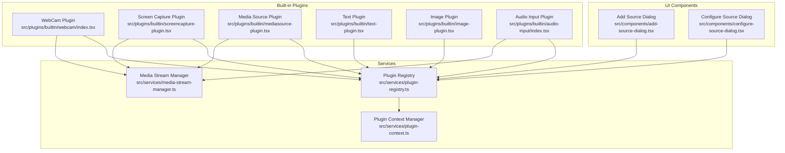
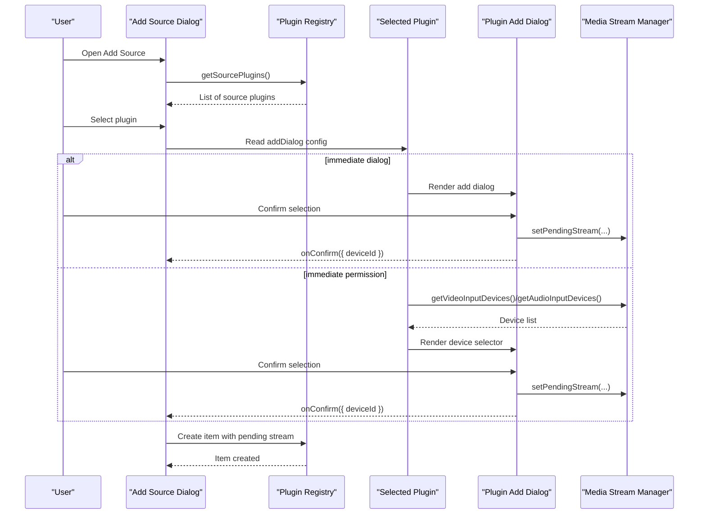
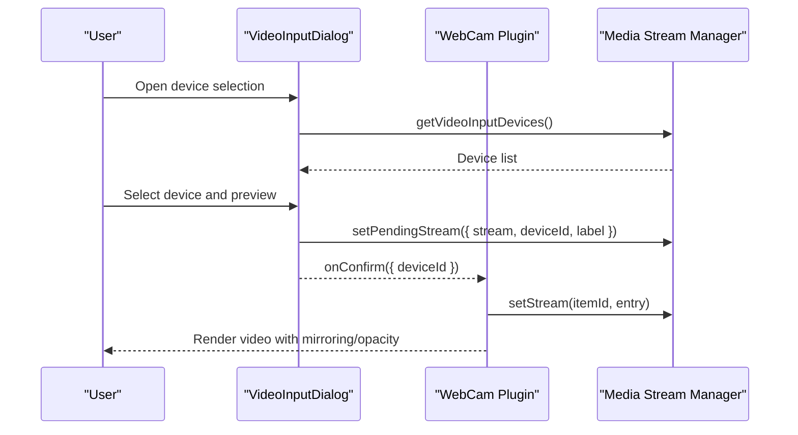
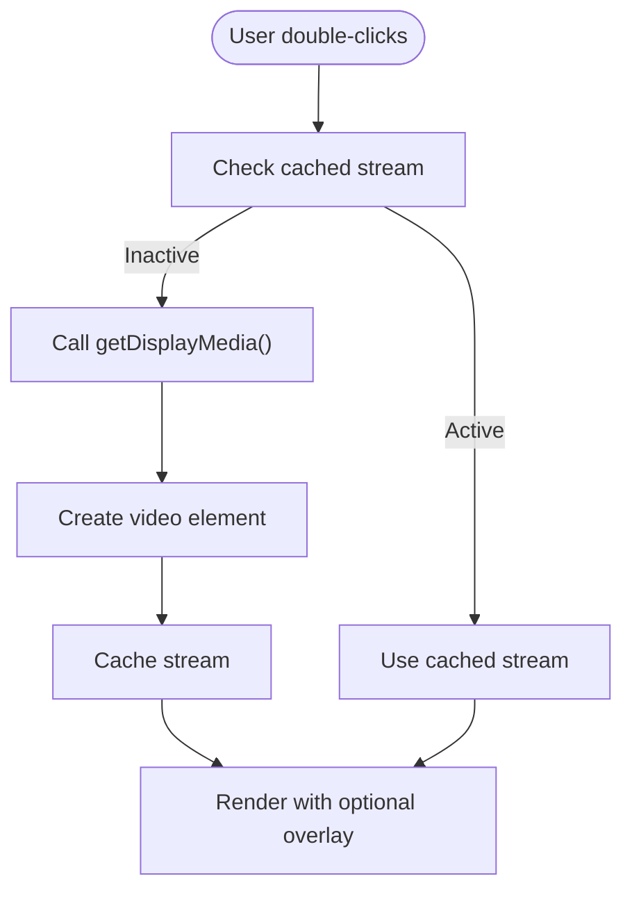
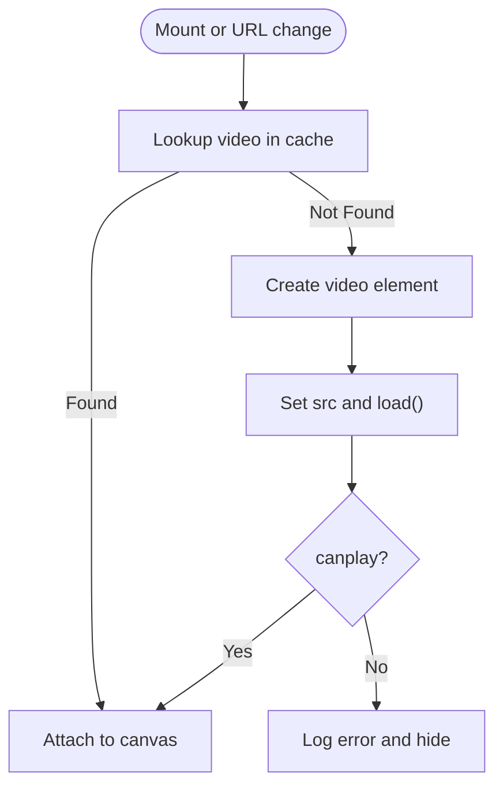
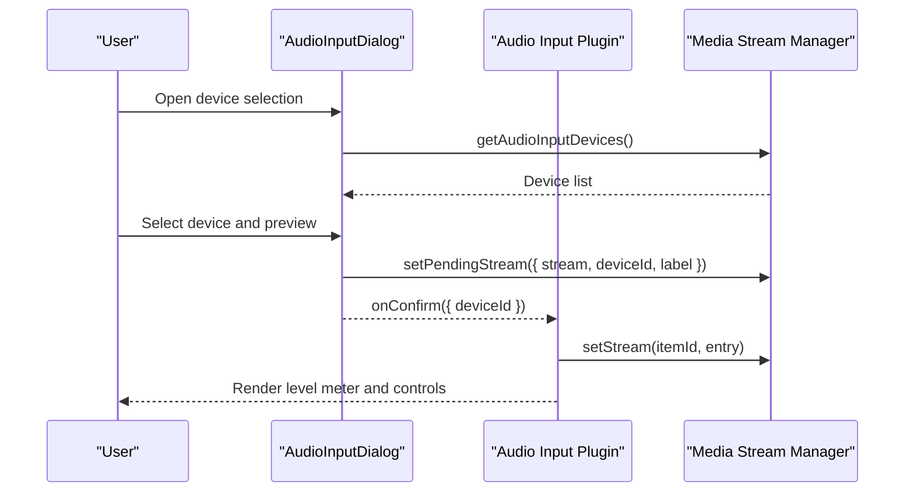
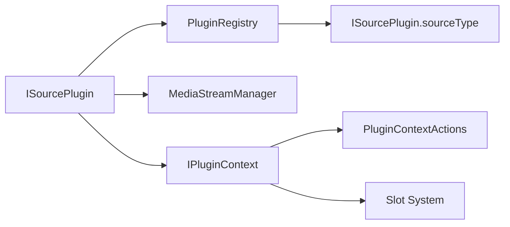

# Source Types and Plugins

<cite>
**Referenced Files in This Document**
- [webcam/index.tsx](file://src/plugins/builtin/webcam/index.tsx)
- [webcam/video-input-dialog.tsx](file://src/plugins/builtin/webcam/video-input-dialog.tsx)
- [screencapture-plugin.tsx](file://src/plugins/builtin/screencapture-plugin.tsx)
- [mediasource-plugin.tsx](file://src/plugins/builtin/mediasource-plugin.tsx)
- [text-plugin.tsx](file://src/plugins/builtin/text-plugin.tsx)
- [image-plugin.tsx](file://src/plugins/builtin/image-plugin.tsx)
- [audio-input/index.tsx](file://src/plugins/builtin/audio-input/index.tsx)
- [audio-input/audio-input-dialog.tsx](file://src/plugins/builtin/audio-input/audio-input-dialog.tsx)
- [media-stream-manager.ts](file://src/services/media-stream-manager.ts)
- [plugin-registry.ts](file://src/services/plugin-registry.ts)
- [plugin-context.ts](file://src/services/plugin-context.ts)
- [plugin.ts](file://src/types/plugin.ts)
- [plugin-context.ts](file://src/types/plugin-context.ts)
- [add-source-dialog.tsx](file://src/components/add-source-dialog.tsx)
- [configure-source-dialog.tsx](file://src/components/configure-source-dialog.tsx)
</cite>

## Table of Contents
1. [Introduction](#introduction)
2. [Project Structure](#project-structure)
3. [Core Components](#core-components)
4. [Architecture Overview](#architecture-overview)
5. [Detailed Component Analysis](#detailed-component-analysis)
6. [Dependency Analysis](#dependency-analysis)
7. [Performance Considerations](#performance-considerations)
8. [Troubleshooting Guide](#troubleshooting-guide)
9. [Conclusion](#conclusion)

## Introduction
This document explains the source types and plugins in LiveMixer Web, focusing on how built-in plugins integrate with the media stream management system. It covers the webcam input, screen capture, media source, text overlay, image, and audio input plugins. For each plugin, it documents configuration dialogs, user interfaces, plugin registration, and integration patterns with the media stream manager. It also provides usage examples, configuration options, and troubleshooting guidance.

## Project Structure
LiveMixer Web organizes plugins under a dedicated builtin folder and exposes them through a plugin registry. The media stream lifecycle is centralized in a media stream manager, while the plugin context system provides secure access to application state and actions.

**Diagram sources**
- [webcam/index.tsx:110-478](file://src/plugins/builtin/webcam/index.tsx#L110-L478)
- [screencapture-plugin.tsx:55-464](file://src/plugins/builtin/screencapture-plugin.tsx#L55-L464)
- [mediasource-plugin.tsx:13-307](file://src/plugins/builtin/mediasource-plugin.tsx#L13-L307)
- [text-plugin.tsx:4-110](file://src/plugins/builtin/text-plugin.tsx#L4-L110)
- [image-plugin.tsx:7-105](file://src/plugins/builtin/image-plugin.tsx#L7-L105)
- [audio-input/index.tsx:105-555](file://src/plugins/builtin/audio-input/index.tsx#L105-L555)
- [plugin-registry.ts:78-118](file://src/services/plugin-registry.ts#L78-L118)
- [media-stream-manager.ts:39-323](file://src/services/media-stream-manager.ts#L39-L323)
- [plugin-context.ts:333-456](file://src/services/plugin-context.ts#L333-L456)
- [add-source-dialog.tsx:98-122](file://src/components/add-source-dialog.tsx#L98-L122)
- [configure-source-dialog.tsx:29-117](file://src/components/configure-source-dialog.tsx#L29-L117)

**Section sources**
- [plugin-registry.ts:78-118](file://src/services/plugin-registry.ts#L78-L118)
- [media-stream-manager.ts:39-323](file://src/services/media-stream-manager.ts#L39-L323)
- [plugin-context.ts:333-456](file://src/services/plugin-context.ts#L333-L456)
- [add-source-dialog.tsx:98-122](file://src/components/add-source-dialog.tsx#L98-L122)
- [configure-source-dialog.tsx:29-117](file://src/components/configure-source-dialog.tsx#L29-L117)

## Core Components
- Plugin interface: Each plugin implements a standardized interface with metadata, configuration, lifecycle hooks, and render logic. See [ISourcePlugin:164-262](file://src/types/plugin.ts#L164-L262).
- Plugin registry: Registers plugins, initializes contexts, and exposes discovery APIs. See [PluginRegistry:78-118](file://src/services/plugin-registry.ts#L78-L118).
- Media stream manager: Centralizes stream creation, caching, and cleanup, and coordinates with plugins. See [MediaStreamManagerImpl:39-323](file://src/services/media-stream-manager.ts#L39-L323).
- Plugin context: Provides secure access to state, actions, and UI slots. See [IPluginContext:322-403](file://src/types/plugin-context.ts#L322-L403) and [PluginContextManager:333-456](file://src/services/plugin-context.ts#L333-L456).

**Section sources**
- [plugin.ts:164-262](file://src/types/plugin.ts#L164-L262)
- [plugin-registry.ts:78-118](file://src/services/plugin-registry.ts#L78-L118)
- [media-stream-manager.ts:39-323](file://src/services/media-stream-manager.ts#L39-L323)
- [plugin-context.ts:333-456](file://src/services/plugin-context.ts#L333-L456)

## Architecture Overview
The plugin architecture separates concerns:
- Discovery and registration: Plugins declare capabilities and UI through the registry.
- Stream lifecycle: Plugins request streams via the media stream manager, which handles device enumeration and caching.
- Rendering: Plugins render their content to the canvas using shared UI primitives.
- Dialogs: Add dialogs are registered as slots and invoked during the add-source flow.

**Diagram sources**
- [add-source-dialog.tsx:98-122](file://src/components/add-source-dialog.tsx#L98-L122)
- [plugin-registry.ts:136-157](file://src/services/plugin-registry.ts#L136-L157)
- [webcam/index.tsx:126-131](file://src/plugins/builtin/webcam/index.tsx#L126-L131)
- [webcam/video-input-dialog.tsx:188-210](file://src/plugins/builtin/webcam/video-input-dialog.tsx#L188-L210)
- [audio-input/index.tsx:121-126](file://src/plugins/builtin/audio-input/index.tsx#L121-L126)
- [audio-input/audio-input-dialog.tsx:260-280](file://src/plugins/builtin/audio-input/audio-input-dialog.tsx#L260-L280)
- [media-stream-manager.ts:282-294](file://src/services/media-stream-manager.ts#L282-L294)

## Detailed Component Analysis

### Webcam Input Plugin
- Purpose: Adds a video input source with device selection and configuration.
- Key features:
  - Device selection dialog with preview and audio toggle.
  - Stream caching and change notifications.
  - Mirroring, opacity, and mute controls.
- Configuration dialog: [VideoInputDialog:37-332](file://src/plugins/builtin/webcam/video-input-dialog.tsx#L37-L332) provides device enumeration, preview, and confirmation.
- Integration:
  - Uses [mediaStreamManager:56-91](file://src/services/media-stream-manager.ts#L56-L91) to cache streams and notify changes.
  - Registers an add dialog slot for seamless integration.
- Properties:
  - deviceId, muted, volume, opacity, mirror.
- Usage example:
  - Add via Add Source dialog, select device in the dialog, confirm to create the item.

**Diagram sources**
- [webcam/video-input-dialog.tsx:14-210](file://src/plugins/builtin/webcam/video-input-dialog.tsx#L14-L210)
- [webcam/index.tsx:110-478](file://src/plugins/builtin/webcam/index.tsx#L110-L478)
- [media-stream-manager.ts:56-91](file://src/services/media-stream-manager.ts#L56-L91)

**Section sources**
- [webcam/index.tsx:110-478](file://src/plugins/builtin/webcam/index.tsx#L110-L478)
- [webcam/video-input-dialog.tsx:37-332](file://src/plugins/builtin/webcam/video-input-dialog.tsx#L37-L332)
- [media-stream-manager.ts:56-91](file://src/services/media-stream-manager.ts#L56-L91)

### Screen Capture Plugin
- Purpose: Shares the current screen or window with optional audio.
- Key features:
  - Double-click to start capture; re-selection button overlay.
  - Audio capture toggle and volume/mute controls.
  - Title display from captured stream label.
- Configuration dialog: Not required; capture is initiated on user interaction.
- Integration:
  - Uses [getDisplayMedia:219-220](file://src/plugins/builtin/screencapture-plugin.tsx#L219-L220) and caches the resulting stream.
  - Supports audio mixer integration via audioMixer config.
- Properties:
  - captureAudio, muted, volume, opacity, showVideo.
- Usage example:
  - Add via Add Source dialog, double-click placeholder to start capture, adjust settings in properties.

**Diagram sources**
- [screencapture-plugin.tsx:191-258](file://src/plugins/builtin/screencapture-plugin.tsx#L191-L258)
- [screencapture-plugin.tsx:313-376](file://src/plugins/builtin/screencapture-plugin.tsx#L313-L376)

**Section sources**
- [screencapture-plugin.tsx:55-464](file://src/plugins/builtin/screencapture-plugin.tsx#L55-L464)
- [media-stream-manager.ts:56-91](file://src/services/media-stream-manager.ts#L56-L91)

### Media Source Plugin
- Purpose: Plays video/audio files either with on-canvas rendering or audio-only mode.
- Key features:
  - URL-based playback with CORS handling.
  - Loop, mute, volume, opacity controls.
  - Ghost indicator mode when showVideo is false.
- Configuration dialog: Not required; configure in property panel.
- Integration:
  - Uses a global video element cache to persist across renders.
  - Renders via Konva Image when showVideo is true.
- Properties:
  - url, showVideo, loop, muted, volume, opacity.
- Usage example:
  - Add via Add Source dialog, choose media URL in properties, enable showVideo to render frames.

**Diagram sources**
- [mediasource-plugin.tsx:135-198](file://src/plugins/builtin/mediasource-plugin.tsx#L135-L198)
- [mediasource-plugin.tsx:230-301](file://src/plugins/builtin/mediasource-plugin.tsx#L230-L301)

**Section sources**
- [mediasource-plugin.tsx:13-307](file://src/plugins/builtin/mediasource-plugin.tsx#L13-L307)

### Text Plugin
- Purpose: Adds customizable text overlays.
- Key features:
  - Content, font size, and color controls.
  - Direct Konva text rendering.
- Configuration dialog: Not required; configure in property panel.
- Properties:
  - content, fontSize, color.
- Usage example:
  - Add via Add Source dialog, edit content and style in properties.

**Section sources**
- [text-plugin.tsx:4-110](file://src/plugins/builtin/text-plugin.tsx#L4-L110)

### Image Plugin
- Purpose: Displays static images with optional border radius.
- Key features:
  - URL-based image loading with CORS.
  - Border radius control.
- Configuration dialog: Not required; configure in property panel.
- Properties:
  - url, borderRadius.
- Usage example:
  - Add via Add Source dialog, set image URL in properties.

**Section sources**
- [image-plugin.tsx:7-105](file://src/plugins/builtin/image-plugin.tsx#L7-L105)

### Audio Input Plugin
- Purpose: Captures microphone audio with real-time level visualization.
- Key features:
  - Device selection dialog with level meter.
  - Audio level visualization and filtering from canvas when showOnCanvas is false.
  - Mute/volume controls and audio mixer integration.
- Configuration dialog: [AudioInputDialog:127-402](file://src/plugins/builtin/audio-input/audio-input-dialog.tsx#L127-L402) provides device selection and level monitoring.
- Integration:
  - Uses [mediaStreamManager:56-91](file://src/services/media-stream-manager.ts#L56-L91) for stream caching and change notifications.
  - Registers an add dialog slot for seamless integration.
- Properties:
  - deviceId, muted, volume, showOnCanvas.
- Usage example:
  - Add via Add Source dialog, select microphone, confirm to create the item; adjust mute/volume in properties.

**Diagram sources**
- [audio-input/audio-input-dialog.tsx:127-280](file://src/plugins/builtin/audio-input/audio-input-dialog.tsx#L127-L280)
- [audio-input/index.tsx:105-555](file://src/plugins/builtin/audio-input/index.tsx#L105-L555)
- [media-stream-manager.ts:56-91](file://src/services/media-stream-manager.ts#L56-L91)

**Section sources**
- [audio-input/index.tsx:105-555](file://src/plugins/builtin/audio-input/index.tsx#L105-L555)
- [audio-input/audio-input-dialog.tsx:127-402](file://src/plugins/builtin/audio-input/audio-input-dialog.tsx#L127-L402)
- [media-stream-manager.ts:56-91](file://src/services/media-stream-manager.ts#L56-L91)

## Dependency Analysis
- Plugin registration and discovery:
  - Plugins are registered via [register:78-118](file://src/services/plugin-registry.ts#L78-L118) and discovered by [getSourcePlugins:136-138](file://src/services/plugin-registry.ts#L136-L138).
  - The add-source dialog lists plugins by reading [sourceType:60-69](file://src/types/plugin.ts#L60-L69) mapping.
- Stream management:
  - Plugins depend on [mediaStreamManager:39-323](file://src/services/media-stream-manager.ts#L39-L323) for device enumeration and stream caching.
  - Legacy plugin APIs proxy to media stream manager for backward compatibility.
- Context and permissions:
  - Plugins receive a scoped context via [createContextForPlugin:333-456](file://src/services/plugin-context.ts#L333-L456) with permission enforcement.

**Diagram sources**
- [plugin-registry.ts:78-118](file://src/services/plugin-registry.ts#L78-L118)
- [plugin.ts:60-69](file://src/types/plugin.ts#L60-L69)
- [media-stream-manager.ts:39-323](file://src/services/media-stream-manager.ts#L39-L323)
- [plugin-context.ts:333-456](file://src/services/plugin-context.ts#L333-L456)

**Section sources**
- [plugin-registry.ts:78-118](file://src/services/plugin-registry.ts#L78-L118)
- [plugin.ts:60-69](file://src/types/plugin.ts#L60-L69)
- [media-stream-manager.ts:39-323](file://src/services/media-stream-manager.ts#L39-L323)
- [plugin-context.ts:333-456](file://src/services/plugin-context.ts#L333-L456)

## Performance Considerations
- Stream reuse: Plugins cache streams to avoid repeated device access and reduce latency. See [webcamStreamCache:29-66](file://src/plugins/builtin/webcam/index.tsx#L29-L66) and [streamCache:13-43](file://src/plugins/builtin/screencapture-plugin.tsx#L13-L43).
- Minimal DOM overhead: MediaSource and Image plugins reuse video elements and images to minimize allocations.
- AudioContext lifecycle: Audio input plugin cleans up analyser nodes and audio contexts on unmount to prevent leaks. See [audio input cleanup:424-440](file://src/plugins/builtin/audio-input/index.tsx#L424-L440).
- Deferred rendering: MediaSource defers rendering until the video is ready to avoid blank frames.

[No sources needed since this section provides general guidance]

## Troubleshooting Guide
- Webcam errors:
  - Symptoms: Red border and “Camera Error” text; check permissions.
  - Resolution: Ensure camera permissions are granted; select a different device in properties; verify device availability via device enumeration.
  - References: [render error handling:328-335](file://src/plugins/builtin/webcam/index.tsx#L328-L335), [device selection dialog:127-133](file://src/plugins/builtin/webcam/video-input-dialog.tsx#L127-L133).
- Screen capture failures:
  - Symptoms: Placeholder with “Connection Failed” or “Double-click to retry”.
  - Resolution: Trigger capture on user interaction; ensure browser supports getDisplayMedia; verify audio capture settings if enabled.
  - References: [capture flow:191-258](file://src/plugins/builtin/screencapture-plugin.tsx#L191-L258), [double-click restart:364-376](file://src/plugins/builtin/screencapture-plugin.tsx#L364-L376).
- Media source playback issues:
  - Symptoms: Empty placeholder or error text; autoplay blocked.
  - Resolution: Provide a valid URL; allow autoplay; ensure CORS allows cross-origin playback.
  - References: [video element lifecycle:135-198](file://src/plugins/builtin/mediasource-plugin.tsx#L135-L198).
- Audio input not detected:
  - Symptoms: Mic error or no level meter.
  - Resolution: Grant microphone permissions; select a working device; verify device enumeration.
  - References: [device enumeration:150-187](file://src/services/media-stream-manager.ts#L150-L187), [audio dialog:142-214](file://src/plugins/builtin/audio-input/audio-input-dialog.tsx#L142-L214).
- Stream cleanup:
  - Symptom: Stuck tracks or memory leaks.
  - Resolution: Ensure streams are removed via [removeStream:77-91](file://src/services/media-stream-manager.ts#L77-L91) on plugin disposal.
  - References: [cleanup in plugins:384-393](file://src/plugins/builtin/webcam/index.tsx#L384-L393), [audio cleanup:424-440](file://src/plugins/builtin/audio-input/index.tsx#L424-L440).

**Section sources**
- [webcam/index.tsx:328-335](file://src/plugins/builtin/webcam/index.tsx#L328-L335)
- [webcam/video-input-dialog.tsx:127-133](file://src/plugins/builtin/webcam/video-input-dialog.tsx#L127-L133)
- [screencapture-plugin.tsx:191-258](file://src/plugins/builtin/screencapture-plugin.tsx#L191-L258)
- [screencapture-plugin.tsx:364-376](file://src/plugins/builtin/screencapture-plugin.tsx#L364-L376)
- [mediasource-plugin.tsx:135-198](file://src/plugins/builtin/mediasource-plugin.tsx#L135-L198)
- [media-stream-manager.ts:77-91](file://src/services/media-stream-manager.ts#L77-L91)
- [audio-input/index.tsx:424-440](file://src/plugins/builtin/audio-input/index.tsx#L424-L440)
- [audio-input/audio-input-dialog.tsx:142-214](file://src/plugins/builtin/audio-input/audio-input-dialog.tsx#L142-L214)

## Conclusion
LiveMixer Web’s plugin system provides a consistent, extensible framework for media sources. Built-in plugins integrate tightly with the media stream manager for reliable device access and stream lifecycle management, while the plugin registry and context system ensure secure, discoverable extension points. The provided dialogs and property panels offer intuitive configuration experiences, and the architecture supports both immediate device selection and deferred configuration workflows.