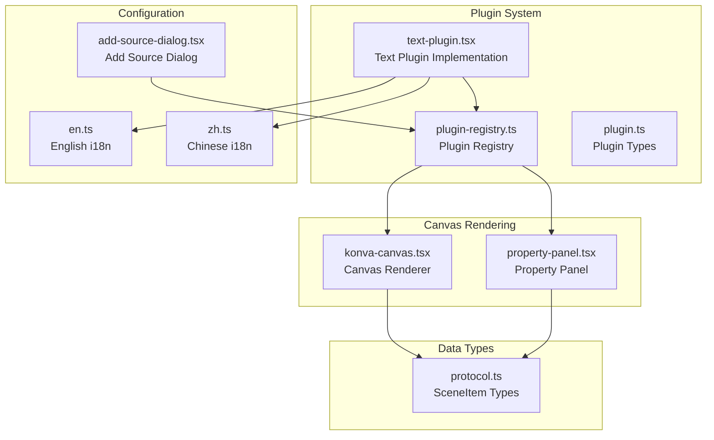
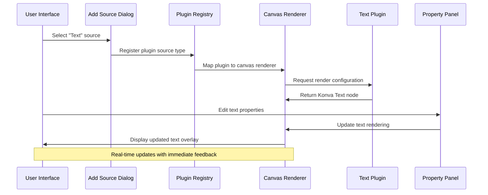
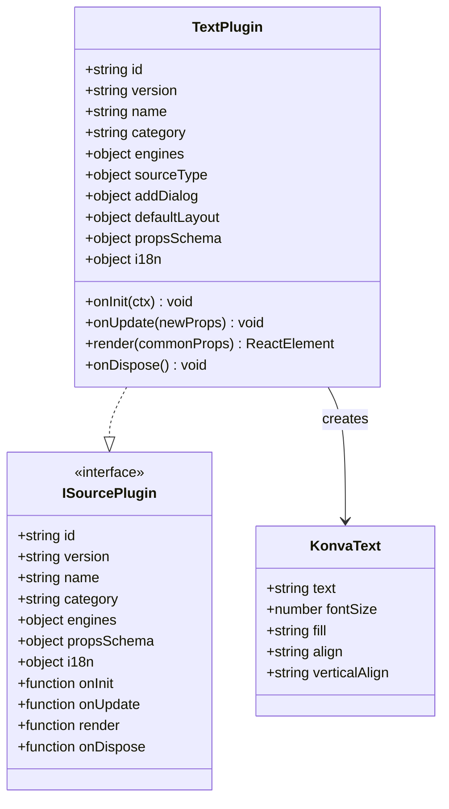
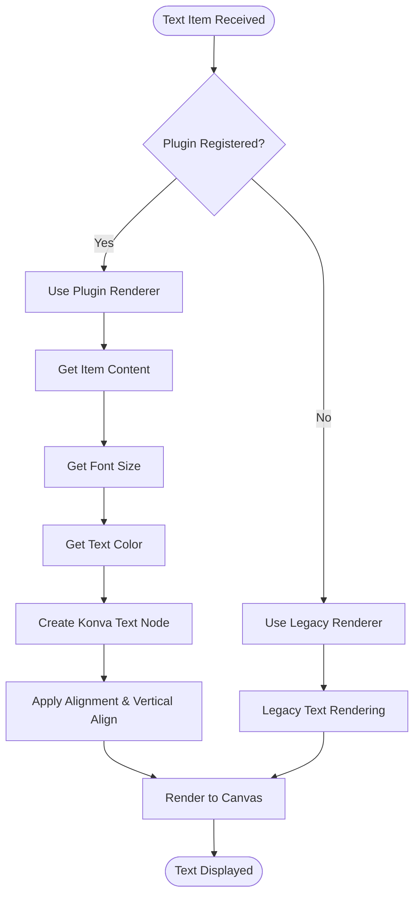
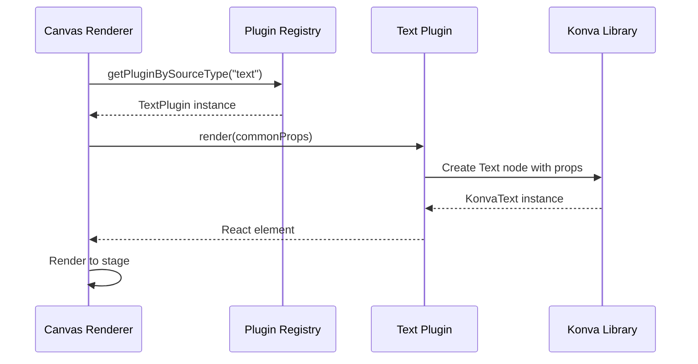
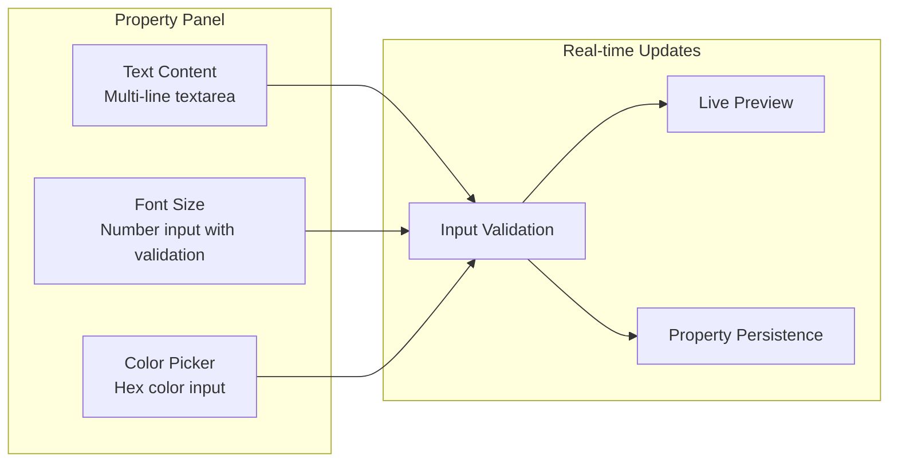
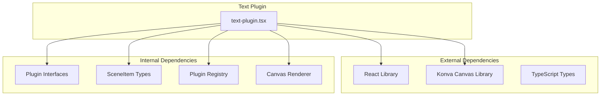

# Text Plugin

<cite>
**Referenced Files in This Document**
- [text-plugin.tsx](file://src/plugins/builtin/text-plugin.tsx)
- [konva-canvas.tsx](file://src/components/konva-canvas.tsx)
- [plugin-registry.ts](file://src/services/plugin-registry.ts)
- [plugin.ts](file://src/types/plugin.ts)
- [protocol.ts](file://src/types/protocol.ts)
- [property-panel.tsx](file://src/components/property-panel.tsx)
- [add-source-dialog.tsx](file://src/components/add-source-dialog.tsx)
- [en.ts](file://src/locales/en.ts)
- [zh.ts](file://src/locales/zh.ts)
</cite>

## Table of Contents
1. [Introduction](#introduction)
2. [Project Structure](#project-structure)
3. [Core Components](#core-components)
4. [Architecture Overview](#architecture-overview)
5. [Detailed Component Analysis](#detailed-component-analysis)
6. [Dependency Analysis](#dependency-analysis)
7. [Performance Considerations](#performance-considerations)
8. [Troubleshooting Guide](#troubleshooting-guide)
9. [Conclusion](#conclusion)

## Introduction
The Text Plugin in LiveMixer Web enables dynamic text overlays on the canvas. It provides configurable font settings, color customization, and real-time updates through the property panel. The plugin integrates with the canvas rendering system via the Konva library and supports both plugin-driven rendering and legacy canvas rendering paths.

## Project Structure
The Text Plugin is implemented as a built-in plugin with supporting infrastructure:

**Diagram sources**
- [text-plugin.tsx:1-110](file://src/plugins/builtin/text-plugin.tsx#L1-L110)
- [plugin-registry.ts:1-168](file://src/services/plugin-registry.ts#L1-L168)
- [konva-canvas.tsx:1-744](file://src/components/konva-canvas.tsx#L1-L744)
- [plugin.ts:164-262](file://src/types/plugin.ts#L164-L262)
- [protocol.ts:20-82](file://src/types/protocol.ts#L20-L82)

**Section sources**
- [text-plugin.tsx:1-110](file://src/plugins/builtin/text-plugin.tsx#L1-L110)
- [plugin-registry.ts:1-168](file://src/services/plugin-registry.ts#L1-L168)
- [konva-canvas.tsx:1-744](file://src/components/konva-canvas.tsx#L1-L744)

## Core Components
The Text Plugin consists of several key components working together:

### Plugin Definition
The Text Plugin implements the ISourcePlugin interface with:
- Unique plugin identification and versioning
- Source type mapping for integration with the add-source dialog
- Property schema defining content, font size, and color configurations
- Internationalization support for multiple languages

### Canvas Integration
The plugin integrates with two rendering systems:
1. **Plugin Renderer Path**: Uses the plugin's render function for custom Konva nodes
2. **Legacy Renderer Path**: Falls back to the main canvas renderer for text items

### Property Management
The property panel provides real-time editing capabilities for:
- Text content with multi-line support
- Font size adjustments with validation
- Color selection with hex value support
- Real-time preview updates

**Section sources**
- [text-plugin.tsx:4-109](file://src/plugins/builtin/text-plugin.tsx#L4-L109)
- [plugin.ts:164-262](file://src/types/plugin.ts#L164-L262)
- [property-panel.tsx:1306-1388](file://src/components/property-panel.tsx#L1306-L1388)

## Architecture Overview
The Text Plugin follows a modular architecture with clear separation of concerns:

**Diagram sources**
- [add-source-dialog.tsx:77-96](file://src/components/add-source-dialog.tsx#L77-L96)
- [plugin-registry.ts:136-157](file://src/services/plugin-registry.ts#L136-L157)
- [konva-canvas.tsx:458-470](file://src/components/konva-canvas.tsx#L458-L470)
- [text-plugin.tsx:83-104](file://src/plugins/builtin/text-plugin.tsx#L83-L104)

## Detailed Component Analysis

### Text Plugin Implementation
The Text Plugin implements the complete ISourcePlugin interface:

**Diagram sources**
- [text-plugin.tsx:4-109](file://src/plugins/builtin/text-plugin.tsx#L4-L109)
- [plugin.ts:164-262](file://src/types/plugin.ts#L164-L262)

#### Configuration Options
The plugin provides three primary configuration options:

| Property | Type | Default | Range | Description |
|----------|------|---------|-------|-------------|
| content | string | "Text content" | N/A | Text content with multi-line support |
| fontSize | number | 32 | 8-200 | Font size in pixels |
| color | color | "#FFFFFF" | Hex color | Text color value |

#### Rendering Pipeline
The rendering process follows this sequence:

**Diagram sources**
- [text-plugin.tsx:83-104](file://src/plugins/builtin/text-plugin.tsx#L83-L104)
- [konva-canvas.tsx:484-496](file://src/components/konva-canvas.tsx#L484-L496)

**Section sources**
- [text-plugin.tsx:31-52](file://src/plugins/builtin/text-plugin.tsx#L31-L52)
- [text-plugin.tsx:83-104](file://src/plugins/builtin/text-plugin.tsx#L83-L104)

### Canvas Integration
The Text Plugin integrates with the canvas rendering system through multiple pathways:

#### Plugin Renderer Path
When a plugin is registered, the canvas renderer delegates text rendering to the plugin's render function:

**Diagram sources**
- [konva-canvas.tsx:458-470](file://src/components/konva-canvas.tsx#L458-L470)
- [plugin-registry.ts:144-157](file://src/services/plugin-registry.ts#L144-L157)

#### Legacy Renderer Path
For backward compatibility, the main canvas renderer handles text items directly:

**Section sources**
- [konva-canvas.tsx:484-496](file://src/components/konva-canvas.tsx#L484-L496)
- [plugin-registry.ts:144-157](file://src/services/plugin-registry.ts#L144-L157)

### Property Panel Integration
The property panel provides comprehensive text editing capabilities:

**Diagram sources**
- [property-panel.tsx:1313-1388](file://src/components/property-panel.tsx#L1313-L1388)

#### Multi-line Text Support
The property panel uses a textarea component that supports:
- Automatic resizing based on content
- Multi-line text editing
- Real-time character counting
- Placeholder text guidance

#### Font Configuration
Font settings include:
- Numeric input with range validation (8-200px)
- Immediate visual feedback
- Consistent behavior across different text types

#### Color Management
Color editing provides:
- Visual color picker integration
- Hex value input with validation
- Real-time color preview
- Accessibility-compliant contrast checking

**Section sources**
- [property-panel.tsx:1313-1388](file://src/components/property-panel.tsx#L1313-L1388)

### Internationalization Support
The Text Plugin supports multiple languages through the plugin's i18n configuration:

| Language | Supported Properties |
|----------|---------------------|
| English | Plugin labels, descriptions, placeholders |
| Chinese | Plugin labels, descriptions, placeholders |

**Section sources**
- [text-plugin.tsx:53-76](file://src/plugins/builtin/text-plugin.tsx#L53-L76)
- [en.ts:284-287](file://src/locales/en.ts#L284-L287)
- [zh.ts:283-286](file://src/locales/zh.ts#L283-L286)

## Dependency Analysis
The Text Plugin has minimal external dependencies and follows a clean architecture pattern:

**Diagram sources**
- [text-plugin.tsx:1-2](file://src/plugins/builtin/text-plugin.tsx#L1-L2)
- [plugin.ts:164-262](file://src/types/plugin.ts#L164-L262)
- [protocol.ts:20-82](file://src/types/protocol.ts#L20-L82)

### Coupling and Cohesion
- **Low Coupling**: Minimal dependencies on external libraries
- **High Cohesion**: All text-related functionality contained within single plugin
- **Clean Separation**: Clear distinction between rendering and property management

### Potential Issues
- **Limited Font Features**: Currently only supports basic font configuration
- **No Advanced Effects**: Missing advanced text effects like shadows or outlines
- **Static Alignment**: Fixed text alignment settings

**Section sources**
- [plugin.ts:164-262](file://src/types/plugin.ts#L164-L262)
- [text-plugin.tsx:1-110](file://src/plugins/builtin/text-plugin.tsx#L1-L110)

## Performance Considerations
The Text Plugin is designed for optimal performance:

### Rendering Optimization
- **Virtual DOM Efficiency**: React's reconciliation minimizes DOM updates
- **Selective Re-rendering**: Only affected text elements update on property changes
- **Canvas-Level Optimization**: Konva handles efficient canvas rendering

### Memory Management
- **Automatic Cleanup**: Plugin lifecycle methods handle proper cleanup
- **Reference Management**: Proper React ref handling prevents memory leaks
- **Event Handler Optimization**: Efficient event binding and unbinding

### Best Practices
- **Avoid Excessive Updates**: Batch property changes when possible
- **Optimize Font Sizes**: Use reasonable font sizes to minimize canvas operations
- **Limit Dynamic Updates**: For frequently changing text, consider alternative approaches

## Troubleshooting Guide

### Common Issues and Solutions

#### Text Not Appearing
**Symptoms**: Text elements don't render on canvas
**Causes**: 
- Plugin not properly registered
- Incorrect source type mapping
- Canvas rendering errors

**Solutions**:
1. Verify plugin registration in the registry
2. Check source type mapping configuration
3. Review browser console for rendering errors

#### Property Updates Not Reflecting
**Symptoms**: Changes to text properties don't appear visually
**Causes**:
- Property persistence issues
- Canvas redraw problems
- Plugin lifecycle conflicts

**Solutions**:
1. Ensure property updates trigger canvas redraw
2. Verify plugin onUpdate method implementation
3. Check for proper state management

#### Performance Degradation
**Symptoms**: Slow response times with multiple text elements
**Causes**:
- Excessive canvas operations
- Poor property update batching
- Memory leaks

**Solutions**:
1. Optimize property update frequency
2. Implement proper cleanup procedures
3. Monitor memory usage patterns

**Section sources**
- [plugin-registry.ts:78-118](file://src/services/plugin-registry.ts#L78-L118)
- [text-plugin.tsx:77-82](file://src/plugins/builtin/text-plugin.tsx#L77-L82)

## Conclusion
The Text Plugin provides a robust foundation for text overlays in LiveMixer Web. Its modular architecture, comprehensive property management, and efficient rendering system make it suitable for various text overlay scenarios. While currently focused on basic text rendering, the plugin's design allows for future enhancements to support advanced typography features and effects.

The plugin successfully balances simplicity with functionality, providing essential text editing capabilities while maintaining excellent performance characteristics. Its integration with the broader LiveMixer ecosystem ensures seamless operation within the overall application architecture.