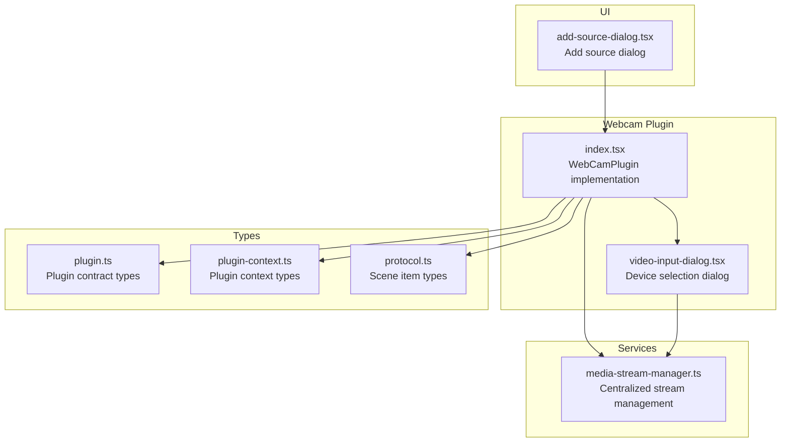
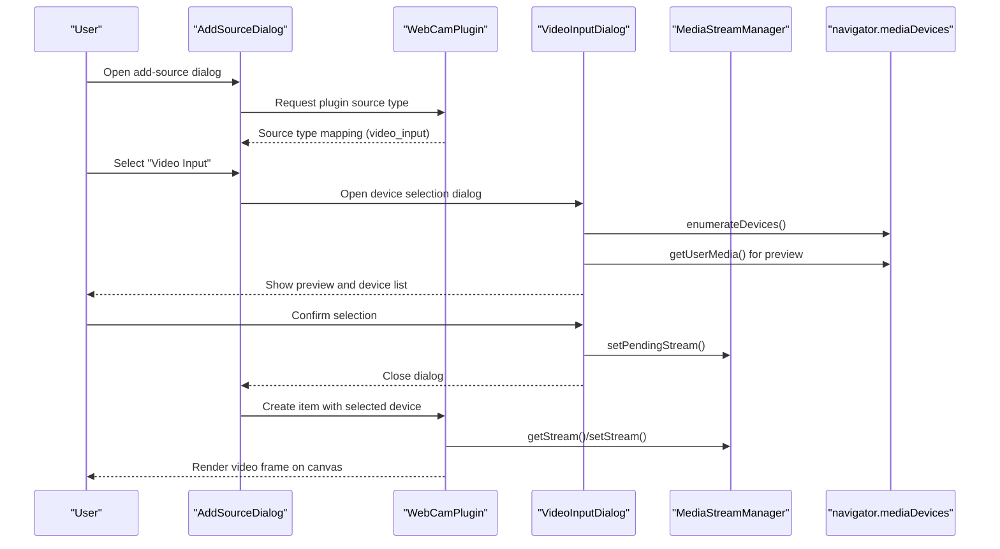
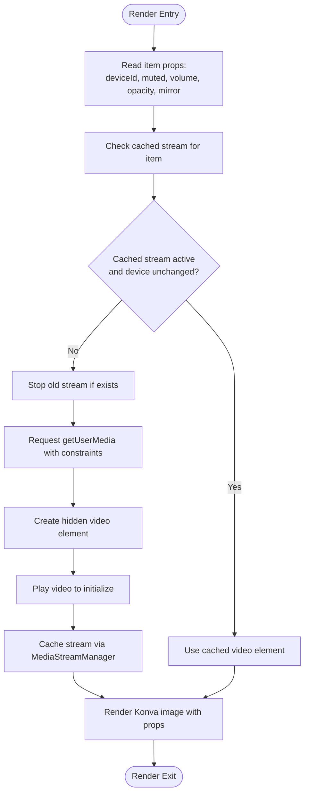
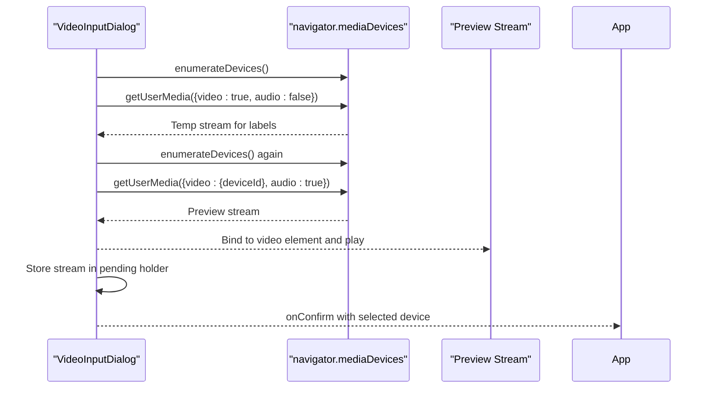
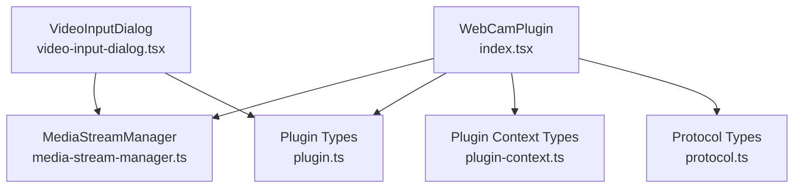

# Webcam Plugin

<cite>
**Referenced Files in This Document**
- [index.tsx](file://src/plugins/builtin/webcam/index.tsx)
- [video-input-dialog.tsx](file://src/plugins/builtin/webcam/video-input-dialog.tsx)
- [media-stream-manager.ts](file://src/services/media-stream-manager.ts)
- [plugin.ts](file://src/types/plugin.ts)
- [plugin-context.ts](file://src/types/plugin-context.ts)
- [protocol.ts](file://src/types/protocol.ts)
- [add-source-dialog.tsx](file://src/components/add-source-dialog.tsx)
- [v1.0.0.json](file://protocol/v1.0.0/v1.0.0.json)
</cite>

## Table of Contents
1. [Introduction](#introduction)
2. [Project Structure](#project-structure)
3. [Core Components](#core-components)
4. [Architecture Overview](#architecture-overview)
5. [Detailed Component Analysis](#detailed-component-analysis)
6. [Dependency Analysis](#dependency-analysis)
7. [Performance Considerations](#performance-considerations)
8. [Troubleshooting Guide](#troubleshooting-guide)
9. [Conclusion](#conclusion)
10. [Appendices](#appendices)

## Introduction
The Webcam Plugin in LiveMixer Web provides a video input source that captures video from local cameras and renders them onto the composition canvas. It integrates with the plugin system to offer device enumeration, camera selection, stream initialization, and video element caching. The plugin exposes configurable properties for device selection, muting, volume, opacity, and mirroring, and renders video frames using a canvas-based renderer.

## Project Structure
The webcam plugin is organized under the built-in plugins directory and includes:
- The main plugin implementation that defines the plugin contract, UI dialogs, and rendering logic
- A dedicated dialog component for device selection and preview
- A centralized media stream manager service that handles device enumeration and stream lifecycle
- Supporting type definitions for plugin contracts, context, and protocol

**Diagram sources**
- [index.tsx:110-478](file://src/plugins/builtin/webcam/index.tsx#L110-L478)
- [video-input-dialog.tsx:37-332](file://src/plugins/builtin/webcam/video-input-dialog.tsx#L37-L332)
- [media-stream-manager.ts:39-323](file://src/services/media-stream-manager.ts#L39-L323)
- [plugin.ts:164-262](file://src/types/plugin.ts#L164-L262)
- [plugin-context.ts:322-403](file://src/types/plugin-context.ts#L322-L403)
- [protocol.ts:20-82](file://src/types/protocol.ts#L20-L82)
- [add-source-dialog.tsx:98-203](file://src/components/add-source-dialog.tsx#L98-L203)

**Section sources**
- [index.tsx:1-478](file://src/plugins/builtin/webcam/index.tsx#L1-L478)
- [video-input-dialog.tsx:1-332](file://src/plugins/builtin/webcam/video-input-dialog.tsx#L1-L332)
- [media-stream-manager.ts:1-323](file://src/services/media-stream-manager.ts#L1-L323)
- [plugin.ts:1-267](file://src/types/plugin.ts#L1-L267)
- [plugin-context.ts:1-438](file://src/types/plugin-context.ts#L1-L438)
- [protocol.ts:1-114](file://src/types/protocol.ts#L1-L114)
- [add-source-dialog.tsx:1-204](file://src/components/add-source-dialog.tsx#L1-L204)

## Core Components
- WebCamPlugin: Implements the ISourcePlugin contract, manages device selection, initializes streams, caches video elements, and renders video frames on the canvas.
- VideoInputDialog: Handles device enumeration, preview, and selection for webcam sources.
- MediaStreamManager: Centralized service for managing streams, device enumeration, and pending stream communication between dialogs and the application.

Key plugin properties:
- deviceId: String identifier for the selected camera
- muted: Boolean controlling audio muting
- volume: Number controlling audio volume (0–1)
- opacity: Number controlling visual opacity (0–1)
- mirror: Boolean enabling horizontal flip for selfie-style mirroring

**Section sources**
- [index.tsx:144-181](file://src/plugins/builtin/webcam/index.tsx#L144-L181)
- [plugin.ts:20-37](file://src/types/plugin.ts#L20-L37)
- [protocol.ts:75-82](file://src/types/protocol.ts#L75-L82)

## Architecture Overview
The webcam plugin follows a layered architecture:
- Plugin Layer: Defines the plugin contract, UI integration, and rendering logic
- Dialog Layer: Manages device selection and preview
- Service Layer: Provides unified stream management and device enumeration
- Type Layer: Enforces contracts for plugins, context, and scene items

**Diagram sources**
- [add-source-dialog.tsx:98-122](file://src/components/add-source-dialog.tsx#L98-L122)
- [index.tsx:119-143](file://src/plugins/builtin/webcam/index.tsx#L119-L143)
- [video-input-dialog.tsx:188-210](file://src/plugins/builtin/webcam/video-input-dialog.tsx#L188-L210)
- [media-stream-manager.ts:282-294](file://src/services/media-stream-manager.ts#L282-L294)

## Detailed Component Analysis

### WebCamPlugin Implementation
The WebCamPlugin implements the ISourcePlugin contract and provides:
- Source type mapping for "video_input"
- Immediate add dialog configuration
- Stream initialization configuration
- Properties schema for device selection, muting, volume, opacity, and mirroring
- Rendering logic using a canvas-based image element

Rendering behavior:
- Creates and caches a video element bound to the MediaStream
- Applies mirroring, opacity, and border radius from item properties
- Displays device label beneath the video frame
- Handles connection state, loading states, and error conditions

**Diagram sources**
- [index.tsx:234-473](file://src/plugins/builtin/webcam/index.tsx#L234-L473)

**Section sources**
- [index.tsx:110-478](file://src/plugins/builtin/webcam/index.tsx#L110-L478)
- [plugin.ts:164-262](file://src/types/plugin.ts#L164-L262)

### VideoInputDialog Component
The VideoInputDialog provides:
- Device enumeration with permission handling
- Preview stream creation and cleanup
- Device selection UI with loading and error states
- Integration with both legacy and new plugin dialog APIs

Device enumeration flow:
- Enumerate devices before permission to detect availability
- Request getUserMedia with minimal constraints to obtain labels
- Re-enumerate devices after permission to populate labels
- Fallback to stream-derived device info if enumeration fails

**Diagram sources**
- [video-input-dialog.tsx:54-136](file://src/plugins/builtin/webcam/video-input-dialog.tsx#L54-L136)
- [video-input-dialog.tsx:139-177](file://src/plugins/builtin/webcam/video-input-dialog.tsx#L139-L177)

**Section sources**
- [video-input-dialog.tsx:37-332](file://src/plugins/builtin/webcam/video-input-dialog.tsx#L37-L332)

### MediaStreamManager Service
The MediaStreamManager centralizes:
- Stream storage keyed by item ID
- Stream change notifications
- Device enumeration with permission handling
- Pending stream communication between dialogs and the application

Key capabilities:
- Unified stream lifecycle management
- Event-driven change notifications
- Device enumeration with fallback strategies
- Pending stream holder for dialog-to-app communication

**Section sources**
- [media-stream-manager.ts:39-323](file://src/services/media-stream-manager.ts#L39-L323)

### Plugin Contract and Context Integration
The plugin integrates with the plugin system via:
- Source type mapping for add-source-dialog
- UI configuration for dialog registration
- Context-ready hook for slot registration
- Property panel integration through propsSchema

**Section sources**
- [plugin.ts:164-262](file://src/types/plugin.ts#L164-L262)
- [plugin-context.ts:322-403](file://src/types/plugin-context.ts#L322-L403)
- [index.tsx:217-227](file://src/plugins/builtin/webcam/index.tsx#L217-L227)

## Dependency Analysis
The webcam plugin depends on:
- MediaStreamManager for stream lifecycle and device enumeration
- Plugin types for contract compliance
- Protocol types for scene item integration
- UI components for dialogs and property panels

**Diagram sources**
- [index.tsx:1-10](file://src/plugins/builtin/webcam/index.tsx#L1-L10)
- [video-input-dialog.tsx:1-14](file://src/plugins/builtin/webcam/video-input-dialog.tsx#L1-L14)
- [media-stream-manager.ts:1-12](file://src/services/media-stream-manager.ts#L1-L12)
- [plugin.ts:1-8](file://src/types/plugin.ts#L1-L8)
- [plugin-context.ts:1-11](file://src/types/plugin-context.ts#L1-L11)
- [protocol.ts:1-11](file://src/types/protocol.ts#L1-L11)

**Section sources**
- [index.tsx:1-10](file://src/plugins/builtin/webcam/index.tsx#L1-L10)
- [video-input-dialog.tsx:1-14](file://src/plugins/builtin/webcam/video-input-dialog.tsx#L1-L14)
- [media-stream-manager.ts:1-12](file://src/services/media-stream-manager.ts#L1-L12)
- [plugin.ts:1-8](file://src/types/plugin.ts#L1-L8)
- [plugin-context.ts:1-11](file://src/types/plugin-context.ts#L1-L11)
- [protocol.ts:1-11](file://src/types/protocol.ts#L1-L11)

## Performance Considerations
- Stream reuse: The plugin checks for an existing active stream with the same device to avoid redundant getUserMedia calls
- Lazy initialization: Streams are started only when a device ID is set
- Cleanup: Tracks are stopped and video elements removed on unmount and when streams change
- Mirroring: Uses CSS transform for mirroring to avoid additional rendering overhead
- Opacity and filters: Applied at the rendering stage for efficient compositing

[No sources needed since this section provides general guidance]

## Troubleshooting Guide
Common webcam issues and resolutions:
- Permissions denied: The dialog requests camera permission and re-enumerates devices after granting access
- No devices detected: The dialog attempts to enumerate devices before permission and falls back to stream-derived device info
- Stream conflicts: The plugin stops existing streams for the same item before creating new ones
- Audio muting and volume: Controlled by plugin properties; ensure muted and volume values are set appropriately
- Mirroring: Enable mirror to flip the video horizontally for selfie-style cameras

**Section sources**
- [video-input-dialog.tsx:54-136](file://src/plugins/builtin/webcam/video-input-dialog.tsx#L54-L136)
- [index.tsx:261-337](file://src/plugins/builtin/webcam/index.tsx#L261-L337)

## Conclusion
The Webcam Plugin provides a robust, extensible solution for capturing and rendering video input sources in LiveMixer Web. Its modular design separates concerns between plugin logic, dialog handling, and stream management, while the MediaStreamManager ensures consistent behavior across plugins. The plugin’s properties enable fine-grained control over appearance and audio behavior, and the dialog system simplifies device selection and preview.

[No sources needed since this section summarizes without analyzing specific files]

## Appendices

### Deprecated Legacy API Methods
The plugin maintains backward compatibility with legacy methods that proxy to MediaStreamManager:
- webcamStreamCache.get/set/delete/has
- setPendingWebcamStream/consumePendingWebcamStream
- onWebcamStreamCacheChange/notifyWebcamStreamCacheChange
- getVideoInputDevices

These methods are marked as deprecated and will be removed in future versions. Use MediaStreamManager directly for new integrations.

**Section sources**
- [index.tsx:28-108](file://src/plugins/builtin/webcam/index.tsx#L28-L108)
- [media-stream-manager.ts:282-294](file://src/services/media-stream-manager.ts#L282-L294)

### Usage Examples for Integrating Webcam Sources
- Adding a webcam source:
  - Open the add-source dialog and select "Video Input"
  - Choose a camera from the device list and confirm
  - The plugin creates a scene item with the selected device ID
- Configuring audio settings:
  - Adjust muted and volume properties in the property panel
  - Changes apply immediately to the underlying video element
- Using in compositions:
  - Reference the scene item in layouts and transforms
  - Combine with other sources for picture-in-picture or overlays

**Section sources**
- [add-source-dialog.tsx:98-122](file://src/components/add-source-dialog.tsx#L98-L122)
- [index.tsx:144-181](file://src/plugins/builtin/webcam/index.tsx#L144-L181)
- [protocol.ts:75-82](file://src/types/protocol.ts#L75-L82)
- [v1.0.0.json:13-36](file://protocol/v1.0.0/v1.0.0.json#L13-L36)