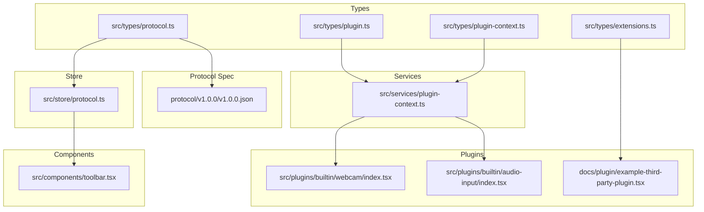
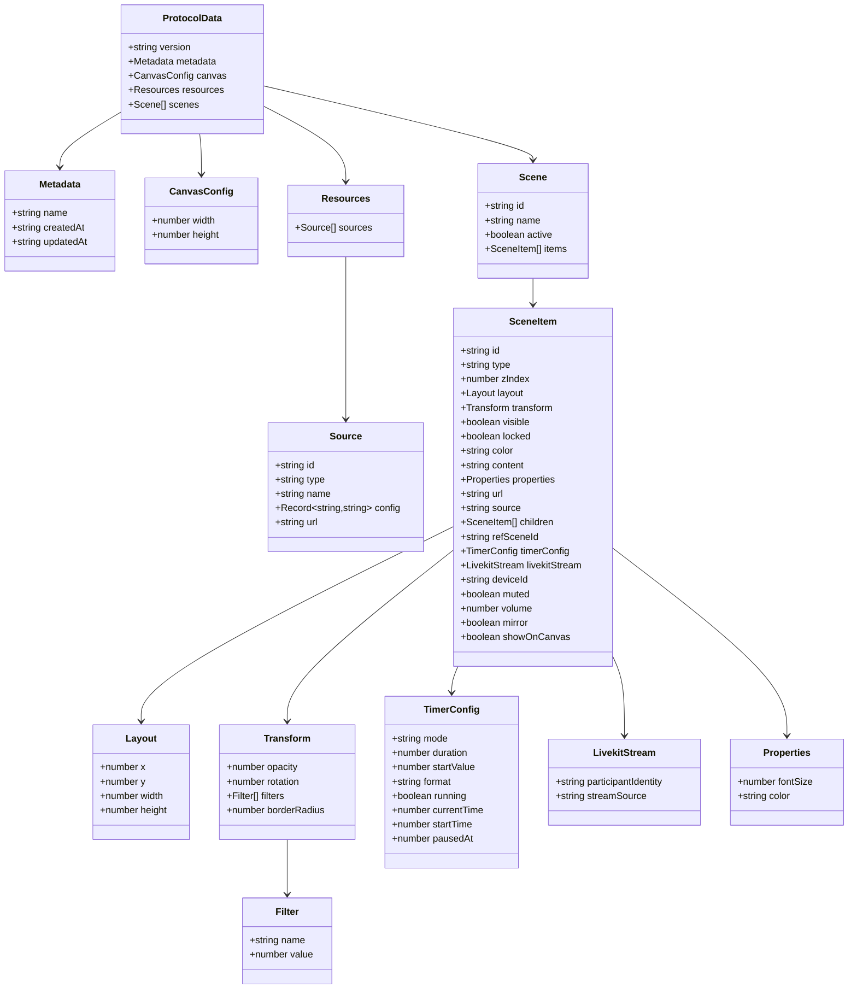
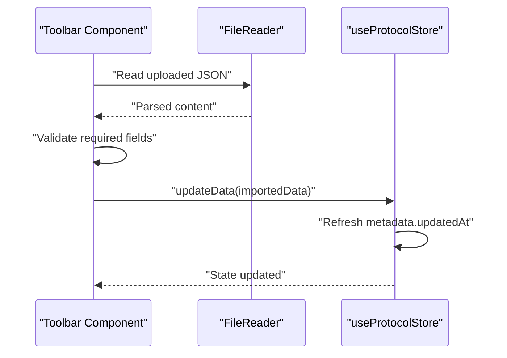
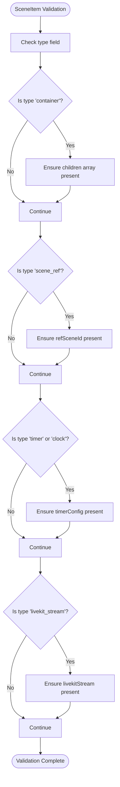
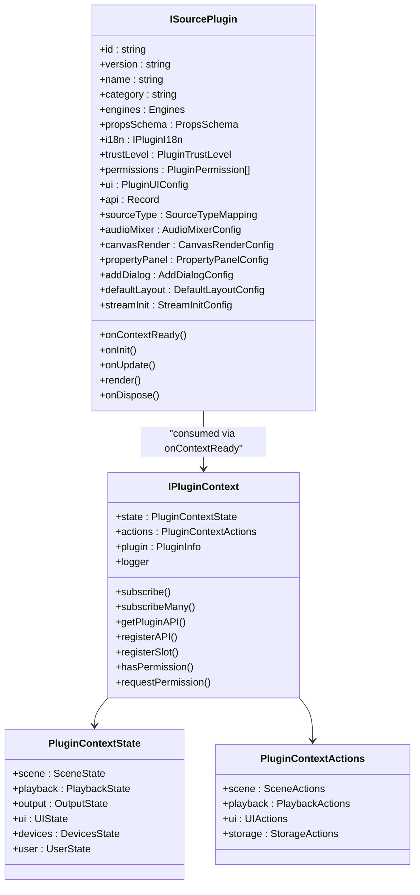
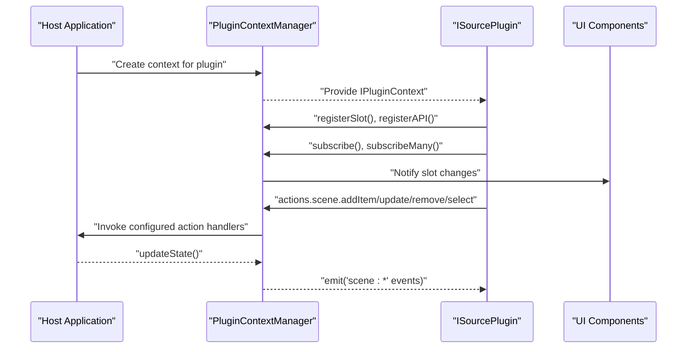
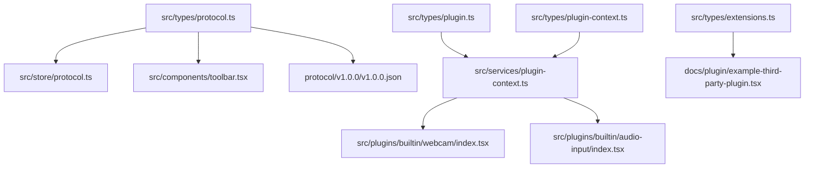

# Data Models and Types

<cite>
**Referenced Files in This Document**
- [protocol.ts](file://src/types/protocol.ts)
- [plugin.ts](file://src/types/plugin.ts)
- [plugin-context.ts](file://src/types/plugin-context.ts)
- [extensions.ts](file://src/types/extensions.ts)
- [protocol-store.ts](file://src/store/protocol.ts)
- [toolbar.tsx](file://src/components/toolbar.tsx)
- [plugin-context-manager.ts](file://src/services/plugin-context.ts)
- [v1.0.0.json](file://protocol/v1.0.0/v1.0.0.json)
- [example-third-party-plugin.tsx](file://docs/plugin/example-third-party-plugin.tsx)
- [webcam-plugin.tsx](file://src/plugins/builtin/webcam/index.tsx)
- [audio-input-plugin.tsx](file://src/plugins/builtin/audio-input/index.tsx)
</cite>

## Table of Contents
1. [Introduction](#introduction)
2. [Project Structure](#project-structure)
3. [Core Components](#core-components)
4. [Architecture Overview](#architecture-overview)
5. [Detailed Component Analysis](#detailed-component-analysis)
6. [Dependency Analysis](#dependency-analysis)
7. [Performance Considerations](#performance-considerations)
8. [Troubleshooting Guide](#troubleshooting-guide)
9. [Conclusion](#conclusion)

## Introduction
This document provides comprehensive documentation for LiveMixer Web's data models and TypeScript interfaces. It focuses on:
- ProtocolData structure and its metadata, canvas configuration, resources, and scenes
- SceneItem types with transformation properties, positioning, opacity, rotation, and filter configurations
- Plugin context types and extension interfaces used for plugin communication
- Data validation rules, type guards, and serialization patterns
- Examples of data structures, type usage patterns, and integration with the store system
- Data flow between components, type safety considerations, and backward compatibility strategies

## Project Structure
LiveMixer Web organizes its data model definitions under src/types and integrates them with the store system and plugin framework. The protocol v1.0.0 specification is provided as a reference JSON schema.

**Diagram sources**
- [protocol.ts:1-114](file://src/types/protocol.ts#L1-L114)
- [plugin.ts:1-267](file://src/types/plugin.ts#L1-L267)
- [plugin-context.ts:1-438](file://src/types/plugin-context.ts#L1-L438)
- [extensions.ts:1-125](file://src/types/extensions.ts#L1-L125)
- [protocol-store.ts:1-68](file://src/store/protocol.ts#L1-L68)
- [plugin-context-manager.ts:1-708](file://src/services/plugin-context.ts#L1-L708)
- [toolbar.tsx:1-48](file://src/components/toolbar.tsx#L1-L48)
- [webcam-plugin.tsx:1-478](file://src/plugins/builtin/webcam/index.tsx#L1-L478)
- [audio-input-plugin.tsx:1-555](file://src/plugins/builtin/audio-input/index.tsx#L1-L555)
- [v1.0.0.json:1-244](file://protocol/v1.0.0/v1.0.0.json#L1-L244)

**Section sources**
- [protocol.ts:1-114](file://src/types/protocol.ts#L1-L114)
- [plugin.ts:1-267](file://src/types/plugin.ts#L1-L267)
- [plugin-context.ts:1-438](file://src/types/plugin-context.ts#L1-L438)
- [extensions.ts:1-125](file://src/types/extensions.ts#L1-L125)
- [protocol-store.ts:1-68](file://src/store/protocol.ts#L1-L68)
- [plugin-context-manager.ts:1-708](file://src/services/plugin-context.ts#L1-L708)
- [toolbar.tsx:1-48](file://src/components/toolbar.tsx#L1-L48)
- [webcam-plugin.tsx:1-478](file://src/plugins/builtin/webcam/index.tsx#L1-L478)
- [audio-input-plugin.tsx:1-555](file://src/plugins/builtin/audio-input/index.tsx#L1-L555)
- [v1.0.0.json:1-244](file://protocol/v1.0.0/v1.0.0.json#L1-L244)

## Core Components
This section documents the primary data structures and their roles in the system.

- ProtocolData
  - Root configuration object representing a complete layout
  - Includes version, metadata, canvas configuration, optional resources, and scenes
  - See [ProtocolData:103-113](file://src/types/protocol.ts#L103-L113)

- CanvasConfig
  - Defines canvas width and height
  - See [CanvasConfig:1-4](file://src/types/protocol.ts#L1-L4)

- Layout
  - Defines item position and size on canvas
  - See [Layout:6-11](file://src/types/protocol.ts#L6-L11)

- Transform
  - Defines visual transformations for items
  - Supports opacity, rotation, filters, and border radius
  - See [Transform:13-18](file://src/types/protocol.ts#L13-L18)

- SceneItem
  - Core building block for canvas items
  - Supports multiple types (color, image, media, text, screen, window, video_input, audio_input, audio_output, container, scene_ref, timer, clock, livekit_stream)
  - Includes z-index, layout, optional transform, visibility, locking, and type-specific properties
  - See [SceneItem:20-82](file://src/types/protocol.ts#L20-L82)

- Scene
  - Collection of items with an id, name, optional active flag, and items array
  - See [Scene:84-89](file://src/types/protocol.ts#L84-L89)

- Source and Resources
  - Source describes named media sources with optional config and url
  - Resources groups sources under a single container
  - See [Source:91-97](file://src/types/protocol.ts#L91-L97) and [Resources:99-101](file://src/types/protocol.ts#L99-L101)

- Plugin Types
  - IPluginContext and related interfaces define the plugin communication surface
  - ISourcePlugin describes plugin capabilities, UI integration, and lifecycle
  - See [plugin-context.ts:1-438](file://src/types/plugin-context.ts#L1-L438) and [plugin.ts:1-267](file://src/types/plugin.ts#L1-L267)

- Extension Interfaces
  - LiveMixerExtensions enables host integrations for saving/loading layouts, sharing, permissions, and i18n overrides
  - See [extensions.ts:1-125](file://src/types/extensions.ts#L1-L125)

**Section sources**
- [protocol.ts:1-114](file://src/types/protocol.ts#L1-L114)
- [plugin-context.ts:1-438](file://src/types/plugin-context.ts#L1-L438)
- [plugin.ts:1-267](file://src/types/plugin.ts#L1-L267)
- [extensions.ts:1-125](file://src/types/extensions.ts#L1-L125)

## Architecture Overview
The data model architecture centers around ProtocolData, which is persisted via a Zustand store and consumed by components and plugins. Plugins interact with the host through a controlled context API that enforces permissions and provides actions for state changes.

**Diagram sources**
- [protocol.ts:1-114](file://src/types/protocol.ts#L1-L114)

**Section sources**
- [protocol.ts:1-114](file://src/types/protocol.ts#L1-L114)

## Detailed Component Analysis

### ProtocolData and Store Integration
- Default creation and persistence
  - The store initializes with a default ProtocolData and persists it to localStorage
  - On updates, it refreshes the updated timestamp in metadata
  - See [useProtocolStore:38-67](file://src/store/protocol.ts#L38-L67)

- Import/export validation
  - Components validate imported JSON against required fields before updating the store
  - See [Toolbar import handler:24-38](file://src/components/toolbar.tsx#L24-L38)

- Backward compatibility
  - The protocol v1.0.0 JSON demonstrates a superset of fields compared to the TypeScript interfaces, enabling forward compatibility
  - See [v1.0.0 schema:1-244](file://protocol/v1.0.0/v1.0.0.json#L1-L244)

**Diagram sources**
- [toolbar.tsx:14-48](file://src/components/toolbar.tsx#L14-L48)
- [protocol-store.ts:44-54](file://src/store/protocol.ts#L44-L54)

**Section sources**
- [protocol-store.ts:1-68](file://src/store/protocol.ts#L1-L68)
- [toolbar.tsx:1-48](file://src/components/toolbar.tsx#L1-L48)
- [v1.0.0.json:1-244](file://protocol/v1.0.0/v1.0.0.json#L1-L244)

### SceneItem Types and Transformation Model
- Type coverage
  - SceneItem.type supports a wide range of built-in and extensible types
  - Container and scene_ref enable nested composition and reuse
  - See [SceneItem type union:22-37](file://src/types/protocol.ts#L22-L37)

- Transformation properties
  - Transform supports opacity, rotation, filters, and border radius
  - Filters are typed as name/value pairs
  - See [Transform:13-18](file://src/types/protocol.ts#L13-L18)

- Type-specific fields
  - Text: content and properties (font size, color)
  - Image/Media: url
  - Video/Screen/Window: source
  - Container: children
  - Scene reference: refSceneId
  - Timer/Clock: timerConfig
  - LiveKit stream: participant identity and source type
  - Video input: deviceId, muted, volume, mirror
  - Audio input: showOnCanvas
  - See [SceneItem fields:44-82](file://src/types/protocol.ts#L44-L82)

**Diagram sources**
- [protocol.ts:20-82](file://src/types/protocol.ts#L20-L82)

**Section sources**
- [protocol.ts:1-114](file://src/types/protocol.ts#L1-L114)

### Plugin Context Types and Extension Interfaces
- IPluginContext
  - Provides readonly state, event subscription, actions, plugin communication, slot registration, permission checking, and logging
  - See [IPluginContext:322-403](file://src/types/plugin-context.ts#L322-L403)

- Plugin permissions and trust levels
  - Enumerated permission types and default grants per trust level
  - See [Permissions:18-85](file://src/types/plugin-context.ts#L18-L85)

- Plugin lifecycle and UI integration
  - ISourcePlugin defines plugin metadata, compatibility, props schema, i18n, UI configuration, and lifecycle hooks
  - See [ISourcePlugin:164-262](file://src/types/plugin.ts#L164-L262)

- Extension interfaces for host integrations
  - LiveMixerExtensions supports custom logo, user component, layout save/load/share, permission checks, custom menu items, and i18n overrides
  - See [LiveMixerExtensions:26-124](file://src/types/extensions.ts#L26-L124)

**Diagram sources**
- [plugin-context.ts:136-403](file://src/types/plugin-context.ts#L136-L403)
- [plugin.ts:164-267](file://src/types/plugin.ts#L164-L267)

**Section sources**
- [plugin-context.ts:1-438](file://src/types/plugin-context.ts#L1-L438)
- [plugin.ts:1-267](file://src/types/plugin.ts#L1-L267)
- [extensions.ts:1-125](file://src/types/extensions.ts#L1-L125)

### Plugin Communication and Data Flow
- Context manager
  - Manages application state, event subscriptions, slot system, and action handlers with permission enforcement
  - Provides scoped logging and plugin API registry
  - See [PluginContextManager:82-701](file://src/services/plugin-context.ts#L82-L701)

- Example third-party plugin
  - Demonstrates props schema, i18n, and render implementation
  - See [ExampleThirdPartyPlugin:15-173](file://docs/plugin/example-third-party-plugin.tsx#L15-L173)

- Built-in plugins
  - Webcam and audio input plugins showcase stream initialization, dialog integration, and canvas render filtering
  - See [WebCamPlugin:110-478](file://src/plugins/builtin/webcam/index.tsx#L110-L478) and [AudioInputPlugin:105-555](file://src/plugins/builtin/audio-input/index.tsx#L105-L555)

**Diagram sources**
- [plugin-context-manager.ts:333-483](file://src/services/plugin-context.ts#L333-L483)
- [plugin.ts:164-262](file://src/types/plugin.ts#L164-L262)
- [webcam-plugin.tsx:217-227](file://src/plugins/builtin/webcam/index.tsx#L217-L227)
- [audio-input-plugin.tsx:238-248](file://src/plugins/builtin/audio-input/index.tsx#L238-L248)

**Section sources**
- [plugin-context-manager.ts:1-708](file://src/services/plugin-context.ts#L1-L708)
- [example-third-party-plugin.tsx:1-173](file://docs/plugin/example-third-party-plugin.tsx#L1-L173)
- [webcam-plugin.tsx:1-478](file://src/plugins/builtin/webcam/index.tsx#L1-L478)
- [audio-input-plugin.tsx:1-555](file://src/plugins/builtin/audio-input/index.tsx#L1-L555)

## Dependency Analysis
This section maps dependencies among core types and services.

**Diagram sources**
- [protocol.ts:1-114](file://src/types/protocol.ts#L1-L114)
- [protocol-store.ts:1-68](file://src/store/protocol.ts#L1-L68)
- [toolbar.tsx:1-48](file://src/components/toolbar.tsx#L1-L48)
- [v1.0.0.json:1-244](file://protocol/v1.0.0/v1.0.0.json#L1-L244)
- [plugin.ts:1-267](file://src/types/plugin.ts#L1-L267)
- [plugin-context.ts:1-438](file://src/types/plugin-context.ts#L1-L438)
- [plugin-context-manager.ts:1-708](file://src/services/plugin-context.ts#L1-L708)
- [extensions.ts:1-125](file://src/types/extensions.ts#L1-L125)
- [example-third-party-plugin.tsx:1-173](file://docs/plugin/example-third-party-plugin.tsx#L1-L173)
- [webcam-plugin.tsx:1-478](file://src/plugins/builtin/webcam/index.tsx#L1-L478)
- [audio-input-plugin.tsx:1-555](file://src/plugins/builtin/audio-input/index.tsx#L1-L555)

**Section sources**
- [protocol.ts:1-114](file://src/types/protocol.ts#L1-L114)
- [plugin.ts:1-267](file://src/types/plugin.ts#L1-L267)
- [plugin-context.ts:1-438](file://src/types/plugin-context.ts#L1-L438)
- [extensions.ts:1-125](file://src/types/extensions.ts#L1-L125)
- [protocol-store.ts:1-68](file://src/store/protocol.ts#L1-L68)
- [plugin-context-manager.ts:1-708](file://src/services/plugin-context.ts#L1-L708)
- [toolbar.tsx:1-48](file://src/components/toolbar.tsx#L1-L48)
- [v1.0.0.json:1-244](file://protocol/v1.0.0/v1.0.0.json#L1-L244)
- [example-third-party-plugin.tsx:1-173](file://docs/plugin/example-third-party-plugin.tsx#L1-L173)
- [webcam-plugin.tsx:1-478](file://src/plugins/builtin/webcam/index.tsx#L1-L478)
- [audio-input-plugin.tsx:1-555](file://src/plugins/builtin/audio-input/index.tsx#L1-L555)

## Performance Considerations
- Efficient state updates
  - Use targeted updates to minimize re-renders; avoid unnecessary deep merges
- Filtered rendering
  - Plugins can leverage canvasRender.shouldFilter to skip expensive rendering for hidden or auxiliary items
- Stream caching
  - Built-in plugins cache media streams to reduce device access overhead
- Event-driven updates
  - Prefer event subscriptions for selective updates rather than polling

## Troubleshooting Guide
- Import validation failures
  - Ensure imported JSON contains required fields: version, scenes, canvas
  - See [Import validation:28-36](file://src/components/toolbar.tsx#L28-L36)

- Permission denials
  - Verify plugin trust level and requested permissions; use requestPermission for non-builtin plugins
  - See [Permissions:18-85](file://src/types/plugin-context.ts#L18-L85)

- Action handler not configured
  - Confirm host application sets action handlers in PluginContextManager
  - See [Action handlers:232-241](file://src/services/plugin-context.ts#L232-L241)

- Backward compatibility
  - Protocol v1.0.0 schema includes additional fields; ensure consumers handle unknown properties gracefully
  - See [v1.0.0 schema:1-244](file://protocol/v1.0.0/v1.0.0.json#L1-L244)

**Section sources**
- [toolbar.tsx:24-48](file://src/components/toolbar.tsx#L24-L48)
- [plugin-context.ts:18-85](file://src/types/plugin-context.ts#L18-L85)
- [plugin-context-manager.ts:232-241](file://src/services/plugin-context.ts#L232-L241)
- [v1.0.0.json:1-244](file://protocol/v1.0.0/v1.0.0.json#L1-L244)

## Conclusion
LiveMixer Web’s data model system provides a robust, extensible foundation for layout configuration and plugin-driven functionality. The ProtocolData structure, combined with strict TypeScript interfaces, ensures type safety and maintainability. The plugin context and extension interfaces enable secure, permission-aware integrations while supporting advanced UI and media workflows. Backward compatibility is addressed through the protocol specification and flexible schema handling.