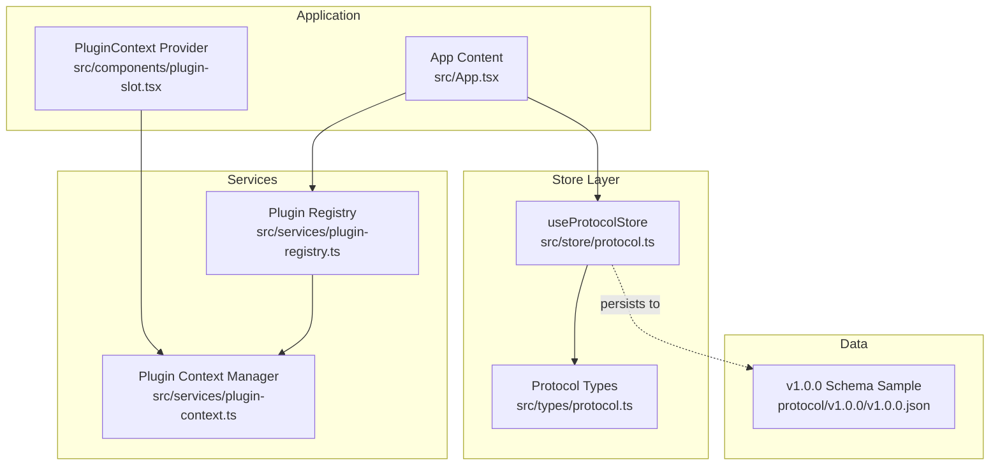
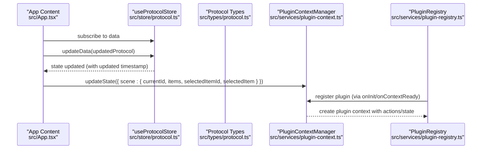
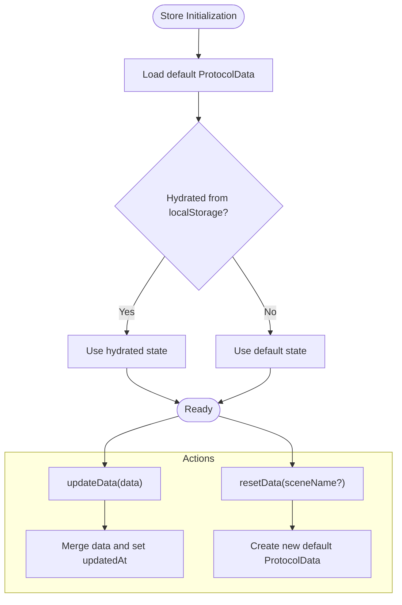
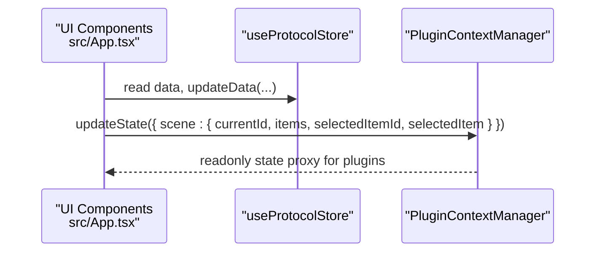
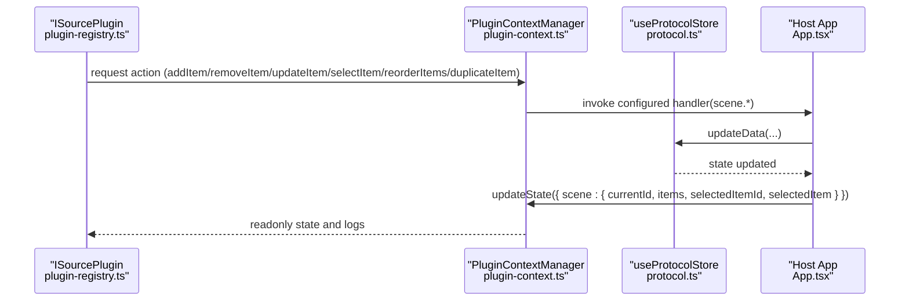
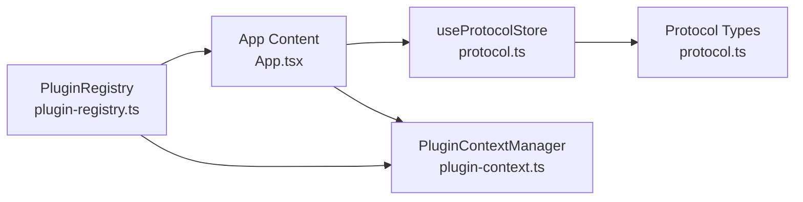

# Protocol Store

<cite>
**Referenced Files in This Document**
- [protocol.ts](file://src/store/protocol.ts)
- [protocol.ts](file://src/types/protocol.ts)
- [App.tsx](file://src/App.tsx)
- [plugin-registry.ts](file://src/services/plugin-registry.ts)
- [plugin-context.ts](file://src/services/plugin-context.ts)
- [plugin-slot.tsx](file://src/components/plugin-slot.tsx)
- [v1.0.0.json](file://protocol/v1.0.0/v1.0.0.json)
</cite>

## Table of Contents
1. [Introduction](#introduction)
2. [Project Structure](#project-structure)
3. [Core Components](#core-components)
4. [Architecture Overview](#architecture-overview)
5. [Detailed Component Analysis](#detailed-component-analysis)
6. [Dependency Analysis](#dependency-analysis)
7. [Performance Considerations](#performance-considerations)
8. [Troubleshooting Guide](#troubleshooting-guide)
9. [Conclusion](#conclusion)
10. [Appendices](#appendices)

## Introduction
This document explains the Protocol Store in LiveMixer Web, a Zustand-based state management module responsible for scene configurations and project data. It covers the ProtocolData model, store actions, persistence via localStorage, integration with the main application, and practical examples of how plugins interact with the store. It also outlines state validation, versioning, and migration strategies.

## Project Structure
The Protocol Store resides under the store module and is typed by the shared protocol types. It integrates with the main application and plugin ecosystem.

**Diagram sources**
- [protocol.ts:1-67](file://src/store/protocol.ts#L1-L67)
- [protocol.ts:1-114](file://src/types/protocol.ts#L1-L114)
- [App.tsx:128-203](file://src/App.tsx#L128-L203)
- [plugin-slot.tsx:49-133](file://src/components/plugin-slot.tsx#L49-L133)
- [plugin-registry.ts:1-168](file://src/services/plugin-registry.ts#L1-L168)
- [plugin-context.ts:82-707](file://src/services/plugin-context.ts#L82-L707)
- [v1.0.0.json:1-244](file://protocol/v1.0.0/v1.0.0.json#L1-L244)

**Section sources**
- [protocol.ts:1-67](file://src/store/protocol.ts#L1-L67)
- [protocol.ts:1-114](file://src/types/protocol.ts#L1-L114)
- [App.tsx:128-203](file://src/App.tsx#L128-L203)
- [plugin-slot.tsx:49-133](file://src/components/plugin-slot.tsx#L49-L133)
- [plugin-registry.ts:1-168](file://src/services/plugin-registry.ts#L1-L168)
- [plugin-context.ts:82-707](file://src/services/plugin-context.ts#L82-L707)
- [v1.0.0.json:1-244](file://protocol/v1.0.0/v1.0.0.json#L1-L244)

## Core Components
- ProtocolData model: Defines the shape of the project configuration including version, metadata, canvas, resources, and scenes.
- useProtocolStore: Zustand store exposing data, updateData, and resetData with localStorage persistence.

Key responsibilities:
- Provide default configuration for new projects.
- Persist and hydrate state from localStorage.
- Update timestamps on edits.
- Allow resetting to a clean default configuration.

**Section sources**
- [protocol.ts:5-28](file://src/store/protocol.ts#L5-L28)
- [protocol.ts:30-35](file://src/store/protocol.ts#L30-L35)
- [protocol.ts:37-67](file://src/store/protocol.ts#L37-L67)
- [protocol.ts:103-114](file://src/types/protocol.ts#L103-L114)

## Architecture Overview
The Protocol Store is consumed by the main application to manage scenes and items. Plugins integrate indirectly via the Plugin Context Manager, which mirrors scene state and exposes actions to plugins with permission checks.

**Diagram sources**
- [App.tsx:128-203](file://src/App.tsx#L128-L203)
- [protocol.ts:37-67](file://src/store/protocol.ts#L37-L67)
- [protocol.ts:1-114](file://src/types/protocol.ts#L1-L114)
- [plugin-context.ts:187-216](file://src/services/plugin-context.ts#L187-L216)
- [plugin-registry.ts:78-118](file://src/services/plugin-registry.ts#L78-L118)

## Detailed Component Analysis

### ProtocolData Model
ProtocolData encapsulates:
- version: Semantic version of the project schema.
- metadata: name, createdAt, updatedAt.
- canvas: width and height.
- resources: optional collection of sources.
- scenes: array of scenes, each with id, name, active flag, and items.

SceneItem supports multiple types (e.g., color, image, media, text, screen, window, video_input, audio_input, audio_output, container, scene_ref, timer, clock, livekit_stream) with flexible layout, transform, visibility, locking, and type-specific properties.

**Section sources**
- [protocol.ts:103-114](file://src/types/protocol.ts#L103-L114)
- [protocol.ts:1-114](file://src/types/protocol.ts#L1-L114)

### Zustand Store: useProtocolStore
- Initial state: default ProtocolData created by createDefaultProtocolData.
- updateData: merges incoming data and updates metadata.updatedAt automatically.
- resetData: replaces current state with a new default configuration optionally using a provided scene name.
- Persistence: Uses zustand/persist with localStorage and JSON serialization.

**Diagram sources**
- [protocol.ts:5-28](file://src/store/protocol.ts#L5-L28)
- [protocol.ts:37-67](file://src/store/protocol.ts#L37-L67)

**Section sources**
- [protocol.ts:5-28](file://src/store/protocol.ts#L5-L28)
- [protocol.ts:37-67](file://src/store/protocol.ts#L37-L67)

### Integration with the Main Application
The main application consumes the store to:
- Select active scene and selected item.
- Add/remove/move scenes.
- Create and configure scene items (including plugin-driven sources).
- Synchronize scene state to the Plugin Context Manager for plugin consumption.

**Diagram sources**
- [App.tsx:128-203](file://src/App.tsx#L128-L203)
- [plugin-context.ts:187-216](file://src/services/plugin-context.ts#L187-L216)

**Section sources**
- [App.tsx:128-203](file://src/App.tsx#L128-L203)
- [plugin-context.ts:187-216](file://src/services/plugin-context.ts#L187-L216)

### Plugin Interaction with Protocol Store
Plugins do not directly mutate ProtocolData. Instead:
- They receive a readonly view of scene state via the Plugin Context Manager.
- They request actions (e.g., add/update/remove items) through the context, which are validated against permissions and delegated to the host application.
- The host application updates the Protocol Store and reflects changes to the Plugin Context Manager.

**Diagram sources**
- [plugin-registry.ts:78-118](file://src/services/plugin-registry.ts#L78-L118)
- [plugin-context.ts:532-700](file://src/services/plugin-context.ts#L532-L700)
- [protocol.ts:37-67](file://src/store/protocol.ts#L37-L67)
- [App.tsx:168-203](file://src/App.tsx#L168-L203)

**Section sources**
- [plugin-registry.ts:78-118](file://src/services/plugin-registry.ts#L78-L118)
- [plugin-context.ts:532-700](file://src/services/plugin-context.ts#L532-L700)
- [protocol.ts:37-67](file://src/store/protocol.ts#L37-L67)
- [App.tsx:168-203](file://src/App.tsx#L168-L203)

### Practical Examples

- Updating state after adding a new scene:
  - Read current scenes from the store.
  - Compute next scene id and push a new scene.
  - Call updateData with the modified scenes array.
  - Select the newly added scene.

- Creating a new scene item:
  - Resolve plugin by source type.
  - Optionally consume a pending stream from media stream manager.
  - Construct item with defaults from plugin props schema.
  - Update current scene items via updateData.

- Resetting to a new project:
  - Invoke resetData to restore default ProtocolData.

Note: The above describe the intended flows. Refer to the source paths below for exact implementation locations.

**Section sources**
- [App.tsx:205-277](file://src/App.tsx#L205-L277)
- [App.tsx:371-400](file://src/App.tsx#L371-L400)
- [protocol.ts:56-60](file://src/store/protocol.ts#L56-L60)

## Dependency Analysis
- useProtocolStore depends on ProtocolData types.
- App Content depends on useProtocolStore and synchronizes scene state to PluginContextManager.
- Plugin Registry creates plugin contexts and initializes plugins.
- Plugin Context Manager validates permissions and exposes safe actions to plugins.

**Diagram sources**
- [protocol.ts:1-67](file://src/store/protocol.ts#L1-L67)
- [protocol.ts:1-114](file://src/types/protocol.ts#L1-L114)
- [App.tsx:128-203](file://src/App.tsx#L128-L203)
- [plugin-context.ts:82-707](file://src/services/plugin-context.ts#L82-L707)
- [plugin-registry.ts:1-168](file://src/services/plugin-registry.ts#L1-L168)

**Section sources**
- [protocol.ts:1-67](file://src/store/protocol.ts#L1-L67)
- [protocol.ts:1-114](file://src/types/protocol.ts#L1-L114)
- [App.tsx:128-203](file://src/App.tsx#L128-L203)
- [plugin-context.ts:82-707](file://src/services/plugin-context.ts#L82-L707)
- [plugin-registry.ts:1-168](file://src/services/plugin-registry.ts#L1-L168)

## Performance Considerations
- Prefer batched updates: minimize frequent small updates to reduce re-renders.
- Keep scenes compact: avoid deeply nested containers unless necessary.
- Use selective updates: pass only changed fields to updateData to limit downstream computations.
- Leverage the readonly state proxy: prevent accidental mutations and improve stability.

## Troubleshooting Guide
Common issues and resolutions:
- State not persisting: Verify localStorage availability and correct storage key "livemixer-protocol".
- Unexpected state resets: Ensure resetData is not called unintentionally; confirm default scene creation logic.
- Plugin action failures: Confirm permissions are granted and action handlers are configured in the host application.
- Outdated updatedAt: updateData automatically sets updatedAt; verify the action is used instead of direct state mutation.

**Section sources**
- [protocol.ts:62-67](file://src/store/protocol.ts#L62-L67)
- [plugin-context.ts:532-700](file://src/services/plugin-context.ts#L532-L700)

## Conclusion
The Protocol Store provides a robust, typed foundation for managing LiveMixer project data with automatic persistence and seamless integration with the plugin ecosystem. By centralizing scene and item state, it enables plugins to operate safely through a controlled context while maintaining a clear separation of concerns.

## Appendices

### ProtocolData Structure Reference
- version: string
- metadata: { name: string; createdAt: string; updatedAt: string }
- canvas: { width: number; height: number }
- resources: { sources: [{ id: string; type: string; name: string; config?: Record; url?: string }] }
- scenes: [{ id: string; name: string; active?: boolean; items: SceneItem[] }]

**Section sources**
- [protocol.ts:103-114](file://src/types/protocol.ts#L103-L114)

### Example Default Configuration
A typical default project includes a single active scene with no items and standard canvas dimensions.

**Section sources**
- [protocol.ts:5-28](file://src/store/protocol.ts#L5-L28)

### Schema Sample (v1.0.0)
The protocol v1.0.0 schema demonstrates a complete project with scenes, transitions, source states, and items.

**Section sources**
- [v1.0.0.json:1-244](file://protocol/v1.0.0/v1.0.0.json#L1-L244)