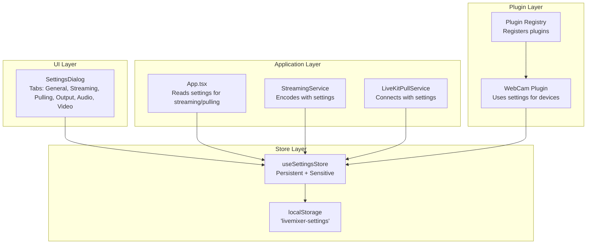
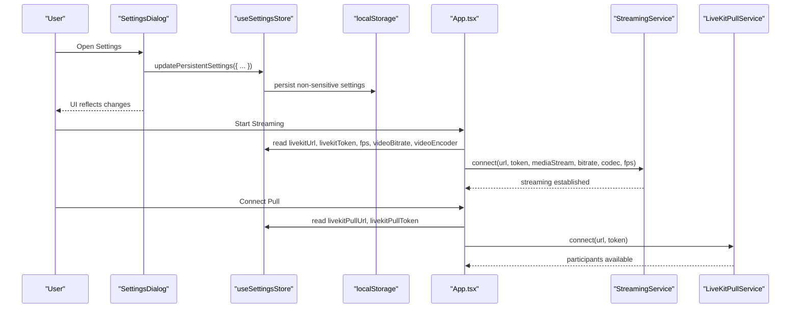
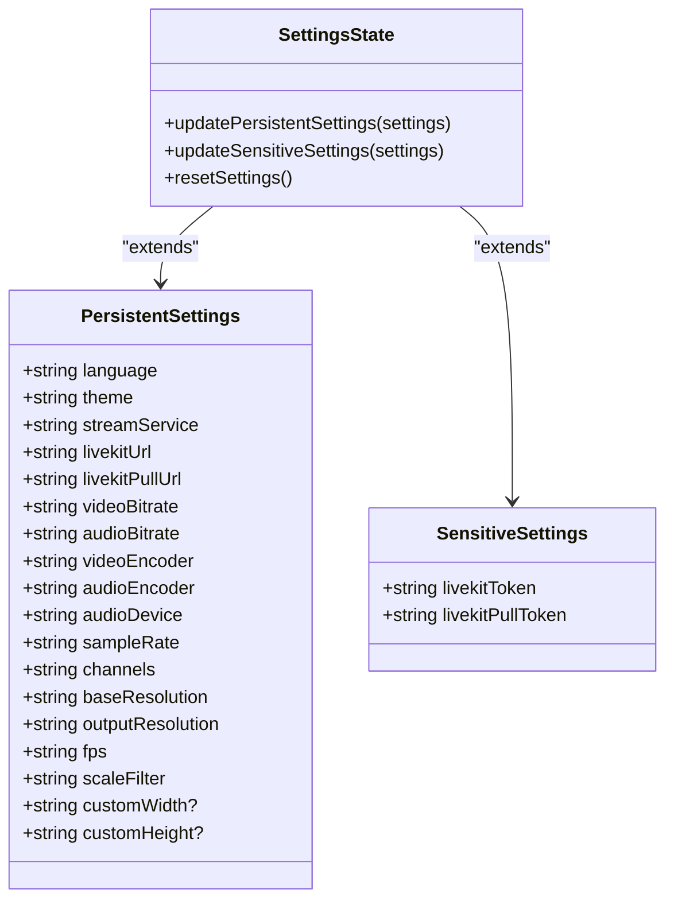
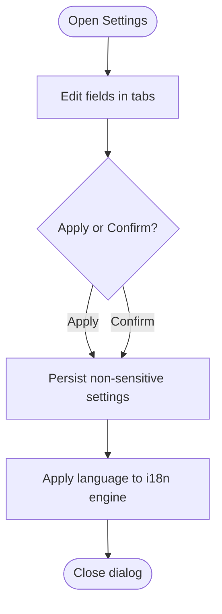
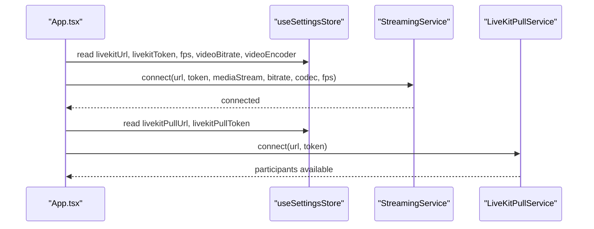
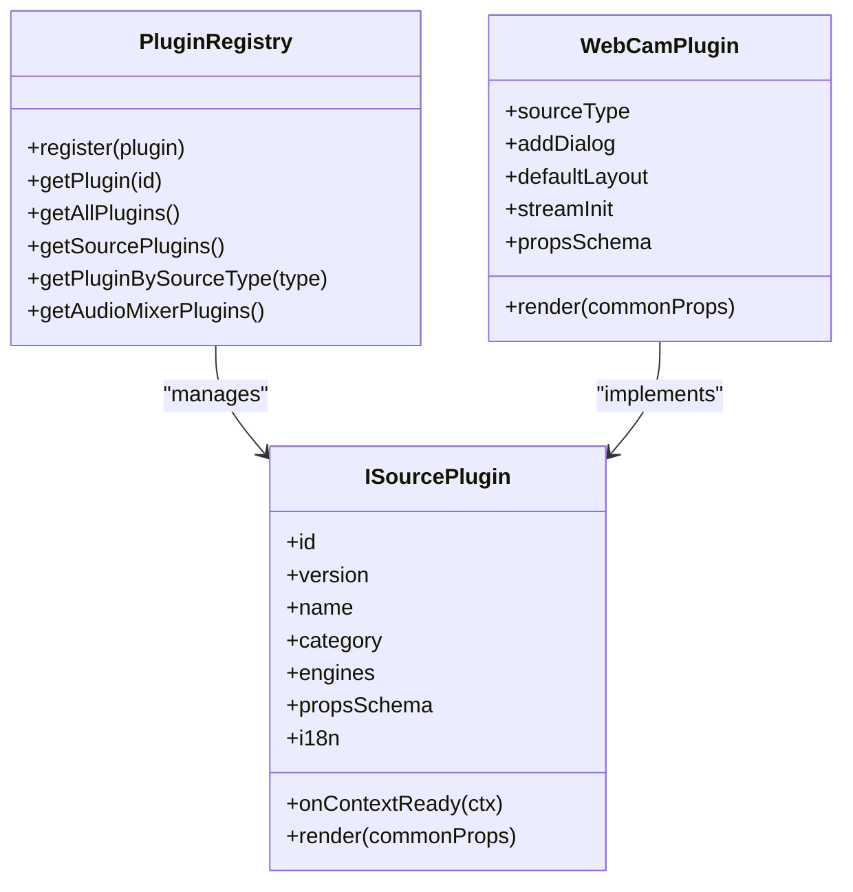
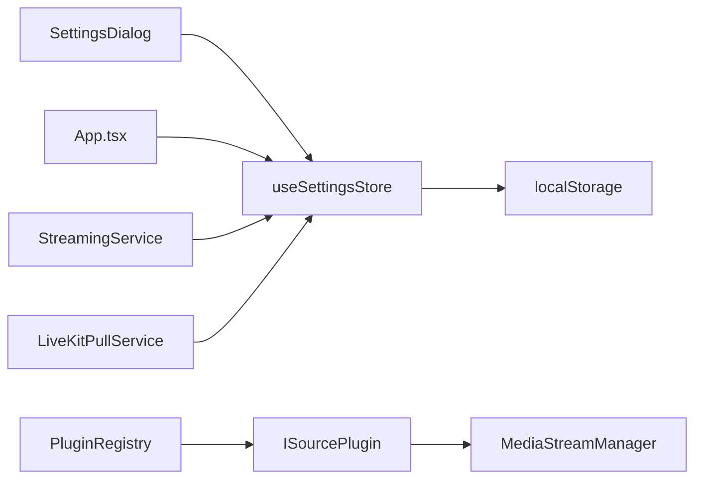

# Settings Store

<cite>
**Referenced Files in This Document**
- [setting.ts](file://src/store/setting.ts)
- [settings-dialog.tsx](file://src/components/settings-dialog.tsx)
- [App.tsx](file://src/App.tsx)
- [main.tsx](file://src/main.tsx)
- [protocol.ts](file://src/store/protocol.ts)
- [en.ts](file://src/locales/en.ts)
- [zh.ts](file://src/locales/zh.ts)
- [plugin-registry.ts](file://src/services/plugin-registry.ts)
- [plugin.ts](file://src/types/plugin.ts)
- [webcam/index.tsx](file://src/plugins/builtin/webcam/index.tsx)
- [streaming.ts](file://src/services/streaming.ts)
- [livekit-pull.ts](file://src/services/livekit-pull.ts)
- [media-stream-manager.ts](file://src/services/media-stream-manager.ts)
</cite>

## Table of Contents
1. [Introduction](#introduction)
2. [Project Structure](#project-structure)
3. [Core Components](#core-components)
4. [Architecture Overview](#architecture-overview)
5. [Detailed Component Analysis](#detailed-component-analysis)
6. [Dependency Analysis](#dependency-analysis)
7. [Performance Considerations](#performance-considerations)
8. [Troubleshooting Guide](#troubleshooting-guide)
9. [Conclusion](#conclusion)

## Introduction
This document describes the Settings Store in LiveMixer Web, which manages application-wide preferences and user configuration. It covers the settings data model, persistence strategy, validation and defaults, UI integration, and how settings synchronize across the application and plugins. It also explains how settings influence LiveKit streaming and pulling, and how they integrate with the plugin system and internationalization.

## Project Structure
The Settings Store is implemented as a Zustand store with persistence middleware. It is consumed by the Settings Dialog UI and referenced throughout the application for runtime configuration.

**Diagram sources**
- [setting.ts:92-138](file://src/store/setting.ts#L92-L138)
- [settings-dialog.tsx:14-647](file://src/components/settings-dialog.tsx#L14-L647)
- [App.tsx:148-156](file://src/App.tsx#L148-L156)
- [streaming.ts:20-124](file://src/services/streaming.ts#L20-L124)
- [livekit-pull.ts:60-179](file://src/services/livekit-pull.ts#L60-L179)
- [plugin-registry.ts:78-118](file://src/services/plugin-registry.ts#L78-L118)
- [webcam/index.tsx:110-233](file://src/plugins/builtin/webcam/index.tsx#L110-L233)

**Section sources**
- [setting.ts:1-139](file://src/store/setting.ts#L1-L139)
- [settings-dialog.tsx:14-647](file://src/components/settings-dialog.tsx#L14-L647)
- [App.tsx:148-156](file://src/App.tsx#L148-L156)

## Core Components
- Settings Store (Zustand with persistence):
  - Non-sensitive settings persisted to localStorage under the key 'livemixer-settings'.
  - Sensitive settings kept in-memory only (tokens).
  - Provides typed update helpers for persistent and sensitive settings, plus reset.
- Settings Dialog:
  - Tabbed UI for General, Streaming, Pulling, Output, Audio, and Video settings.
  - Two-way binding to the store; language changes are applied to i18n engine.
- Application integration:
  - Reads settings for LiveKit streaming and pulling, and for rendering parameters.
- Plugin integration:
  - Plugins can read and use settings for device selection, rendering, and behavior.
- Internationalization:
  - Language settings drive i18n resource loading and conversion.

**Section sources**
- [setting.ts:44-138](file://src/store/setting.ts#L44-L138)
- [settings-dialog.tsx:14-647](file://src/components/settings-dialog.tsx#L14-L647)
- [App.tsx:148-156](file://src/App.tsx#L148-L156)
- [en.ts:158-229](file://src/locales/en.ts#L158-L229)
- [zh.ts:157-228](file://src/locales/zh.ts#L157-L228)

## Architecture Overview
The Settings Store sits at the center of configuration management. It persists non-sensitive preferences, exposes typed setters, and is consumed by UI, services, and plugins. The Settings Dialog acts as the primary editor, while App.tsx reads settings for streaming and pulling.

**Diagram sources**
- [settings-dialog.tsx:20-51](file://src/components/settings-dialog.tsx#L20-L51)
- [setting.ts:92-138](file://src/store/setting.ts#L92-L138)
- [App.tsx:726-788](file://src/App.tsx#L726-L788)
- [streaming.ts:20-124](file://src/services/streaming.ts#L20-L124)
- [livekit-pull.ts:60-179](file://src/services/livekit-pull.ts#L60-L179)

## Detailed Component Analysis

### Settings Store Data Model
The store defines two categories of settings:
- Persistent settings (non-sensitive): language, theme, streaming/pulling URLs, output encoders/bitrates, audio/video parameters, and optional custom video dimensions.
- Sensitive settings (in-memory only): LiveKit access tokens for publishing and subscribing.

It also defines default values for all persistent settings and exposes:
- updatePersistentSettings: merges partial updates into persistent state and persists to localStorage.
- updateSensitiveSettings: updates in-memory sensitive state only.
- resetSettings: restores defaults for both categories.

**Diagram sources**
- [setting.ts:5-89](file://src/store/setting.ts#L5-L89)
- [setting.ts:44-53](file://src/store/setting.ts#L44-L53)

**Section sources**
- [setting.ts:5-89](file://src/store/setting.ts#L5-L89)
- [setting.ts:92-138](file://src/store/setting.ts#L92-L138)

### Settings Persistence and Defaults
- Persistence:
  - Uses zustand/middleware persist with a custom partialize function to exclude sensitive tokens from persistence.
  - Storage: localStorage with key 'livemixer-settings'.
- Defaults:
  - Persistent defaults include sensible values for language, theme, encoders, bitrates, audio/video parameters, and resolutions.
  - Sensitive defaults are empty strings.

Validation and constraints:
- The Settings Dialog applies constraints for numeric fields (e.g., videoBitrate range) and limits options for enumerations (e.g., encoders, FPS).
- The store itself does not enforce validation; validation occurs in the UI layer.

**Section sources**
- [setting.ts:120-138](file://src/store/setting.ts#L120-L138)
- [setting.ts:55-89](file://src/store/setting.ts#L55-L89)
- [settings-dialog.tsx:328-344](file://src/components/settings-dialog.tsx#L328-L344)
- [settings-dialog.tsx:351-371](file://src/components/settings-dialog.tsx#L351-L371)
- [settings-dialog.tsx:378-393](file://src/components/settings-dialog.tsx#L378-L393)
- [settings-dialog.tsx:400-413](file://src/components/settings-dialog.tsx#L400-L413)
- [settings-dialog.tsx:429-442](file://src/components/settings-dialog.tsx#L429-L442)
- [settings-dialog.tsx:448-458](file://src/components/settings-dialog.tsx#L448-L458)
- [settings-dialog.tsx:464-476](file://src/components/settings-dialog.tsx#L464-L476)
- [settings-dialog.tsx:492-509](file://src/components/settings-dialog.tsx#L492-L509)
- [settings-dialog.tsx:518-545](file://src/components/settings-dialog.tsx#L518-L545)
- [settings-dialog.tsx:553-570](file://src/components/settings-dialog.tsx#L553-L570)
- [settings-dialog.tsx:575-587](file://src/components/settings-dialog.tsx#L575-L587)
- [settings-dialog.tsx:594-611](file://src/components/settings-dialog.tsx#L594-L611)

### Settings Dialog UI and Language Integration
- Tabs:
  - General: language, theme.
  - Streaming: service, server URL, token.
  - Pulling: server URL, token.
  - Output: video/audio bitrate, encoders.
  - Audio: device, sample rate, channels.
  - Video: base/output resolution, FPS, scale filter, custom dimensions.
- Language handling:
  - Pending language change is stored locally until Apply/Confirm.
  - On confirm, the store is updated and the i18n engine is switched (zh-CN -> zh, en-US -> en).

**Diagram sources**
- [settings-dialog.tsx:14-647](file://src/components/settings-dialog.tsx#L14-L647)
- [App.tsx:44-107](file://src/App.tsx#L44-L107)

**Section sources**
- [settings-dialog.tsx:14-647](file://src/components/settings-dialog.tsx#L14-L647)
- [App.tsx:44-107](file://src/App.tsx#L44-L107)
- [en.ts:158-229](file://src/locales/en.ts#L158-L229)
- [zh.ts:157-228](file://src/locales/zh.ts#L157-L228)

### Integration with LiveKit Streaming and Pulling
- Streaming:
  - App.tsx reads livekitUrl, livekitToken, fps, videoBitrate, videoEncoder from the store.
  - StreamingService.connect uses these values to configure encoding and publish tracks.
- Pulling:
  - App.tsx reads livekitPullUrl, livekitPullToken from the store.
  - LiveKitPullService.connect uses these values to subscribe to remote participants.

**Diagram sources**
- [App.tsx:726-788](file://src/App.tsx#L726-L788)
- [streaming.ts:20-124](file://src/services/streaming.ts#L20-L124)
- [livekit-pull.ts:60-179](file://src/services/livekit-pull.ts#L60-L179)

**Section sources**
- [App.tsx:726-788](file://src/App.tsx#L726-L788)
- [streaming.ts:20-124](file://src/services/streaming.ts#L20-L124)
- [livekit-pull.ts:60-179](file://src/services/livekit-pull.ts#L60-L179)

### Integration with Plugins
- Plugin Registry:
  - Initializes plugin contexts and registers plugin i18n resources.
- WebCam Plugin:
  - Uses settings for device selection and rendering properties (e.g., mirror, opacity).
  - Integrates with MediaStreamManager for stream lifecycle.
- Plugin Types:
  - Plugins define propsSchema, UI configuration, and capabilities (e.g., audio mixer, canvas render).

**Diagram sources**
- [plugin-registry.ts:5-167](file://src/services/plugin-registry.ts#L5-L167)
- [plugin.ts:164-262](file://src/types/plugin.ts#L164-L262)
- [webcam/index.tsx:110-233](file://src/plugins/builtin/webcam/index.tsx#L110-L233)

**Section sources**
- [plugin-registry.ts:78-118](file://src/services/plugin-registry.ts#L78-L118)
- [webcam/index.tsx:110-233](file://src/plugins/builtin/webcam/index.tsx#L110-L233)
- [plugin.ts:164-262](file://src/types/plugin.ts#L164-L262)

### Settings Updates and Examples
- Update persistent settings:
  - Example: updatePersistentSettings({ theme: 'light' })
  - Persists to localStorage automatically.
- Update sensitive settings:
  - Example: updateSensitiveSettings({ livekitToken: '...' })
  - Updates in-memory only.
- Reset settings:
  - Example: resetSettings()
  - Restores defaults for both persistent and sensitive settings.

These operations are invoked from the Settings Dialog and used by App.tsx for streaming/pulling.

**Section sources**
- [setting.ts:100-118](file://src/store/setting.ts#L100-L118)
- [settings-dialog.tsx:200-207](file://src/components/settings-dialog.tsx#L200-L207)
- [settings-dialog.tsx:264-268](file://src/components/settings-dialog.tsx#L264-L268)
- [settings-dialog.tsx:114-118](file://src/components/settings-dialog.tsx#L114-L118)

### Configuration Loading and Initialization
- Initial language detection:
  - App.tsx reads the saved settings from localStorage to determine initial language before creating the i18n engine.
- Protocol store:
  - A separate store manages scene/project configuration; it is distinct from settings but coexists in the application.

**Section sources**
- [App.tsx:44-107](file://src/App.tsx#L44-L107)
- [protocol.ts:38-67](file://src/store/protocol.ts#L38-L67)

## Dependency Analysis
- Store dependencies:
  - zustand and zustand/middleware persist.
  - localStorage-backed persistence for non-sensitive settings.
- UI dependencies:
  - SettingsDialog consumes useSettingsStore and drives language/i18n changes.
- Service dependencies:
  - StreamingService and LiveKitPullService depend on settings for encoding and connection parameters.
- Plugin dependencies:
  - Plugins rely on settings for device selection and rendering behavior; MediaStreamManager coordinates streams.

**Diagram sources**
- [setting.ts:92-138](file://src/store/setting.ts#L92-L138)
- [settings-dialog.tsx:14-647](file://src/components/settings-dialog.tsx#L14-L647)
- [App.tsx:148-156](file://src/App.tsx#L148-L156)
- [streaming.ts:20-124](file://src/services/streaming.ts#L20-L124)
- [livekit-pull.ts:60-179](file://src/services/livekit-pull.ts#L60-L179)
- [plugin-registry.ts:78-118](file://src/services/plugin-registry.ts#L78-L118)
- [media-stream-manager.ts:39-323](file://src/services/media-stream-manager.ts#L39-L323)

**Section sources**
- [setting.ts:92-138](file://src/store/setting.ts#L92-L138)
- [settings-dialog.tsx:14-647](file://src/components/settings-dialog.tsx#L14-L647)
- [App.tsx:148-156](file://src/App.tsx#L148-L156)
- [streaming.ts:20-124](file://src/services/streaming.ts#L20-L124)
- [livekit-pull.ts:60-179](file://src/services/livekit-pull.ts#L60-L179)
- [plugin-registry.ts:78-118](file://src/services/plugin-registry.ts#L78-L118)
- [media-stream-manager.ts:39-323](file://src/services/media-stream-manager.ts#L39-L323)

## Performance Considerations
- Persist only non-sensitive settings to avoid storing secrets in localStorage.
- Keep the store minimal and focused; avoid unnecessary re-renders by updating only changed fields.
- Defer heavy operations (e.g., reconnecting LiveKit) until after settings are confirmed.
- For plugins, avoid frequent device enumeration; cache device lists and refresh on demand.

## Troubleshooting Guide
- Settings not persisting:
  - Verify localStorage availability and that the key 'livemixer-settings' exists.
  - Ensure partialize excludes sensitive tokens and includes only non-sensitive fields.
- Language not applying:
  - Confirm pendingLanguage is applied on Apply/Confirm and that i18n engine receives the converted language code.
- LiveKit connection failures:
  - Check that livekitUrl and tokens are set in the store before connecting.
  - Validate encoding parameters (bitrate, codec, FPS) are within supported ranges.
- Plugin device issues:
  - Ensure MediaStreamManager has permission and device labels; handle permission prompts gracefully.

**Section sources**
- [setting.ts:120-138](file://src/store/setting.ts#L120-L138)
- [App.tsx:44-107](file://src/App.tsx#L44-L107)
- [App.tsx:726-788](file://src/App.tsx#L726-L788)
- [media-stream-manager.ts:147-273](file://src/services/media-stream-manager.ts#L147-L273)

## Conclusion
The Settings Store provides a centralized, typed, and persisted configuration system for LiveMixer Web. It cleanly separates sensitive and non-sensitive settings, integrates tightly with the UI and services, and enables consistent behavior across plugins. By validating inputs in the UI and keeping secrets out of persistence, it balances usability with security and reliability.