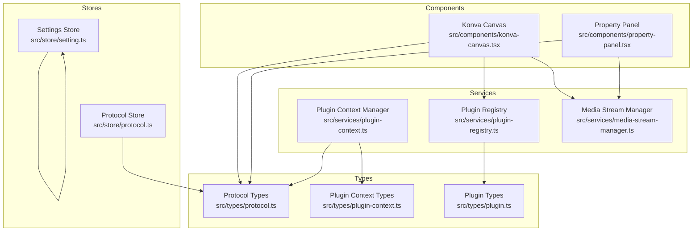
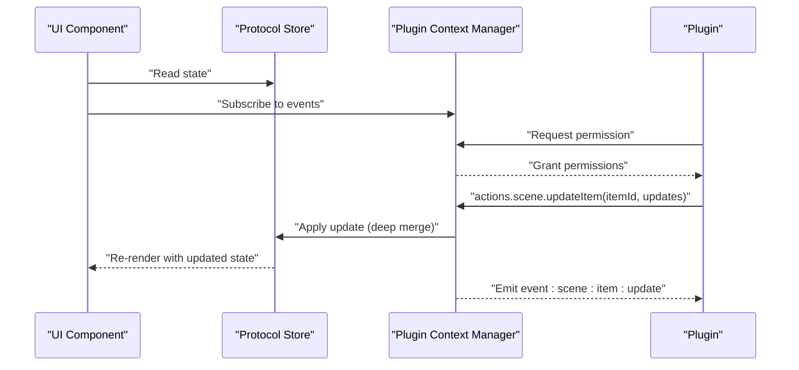
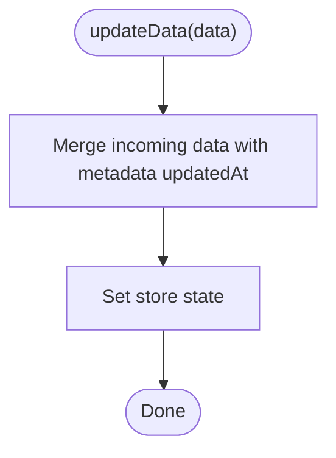
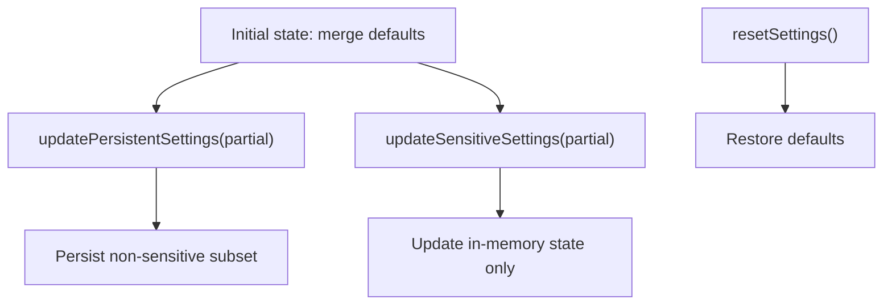
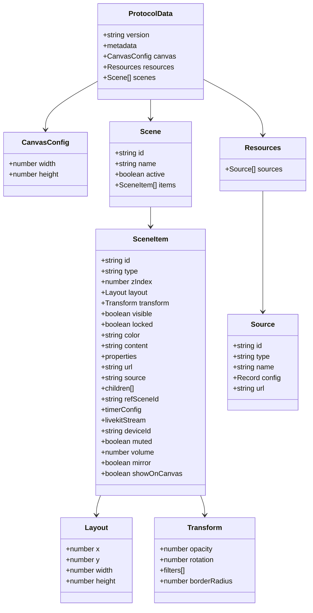
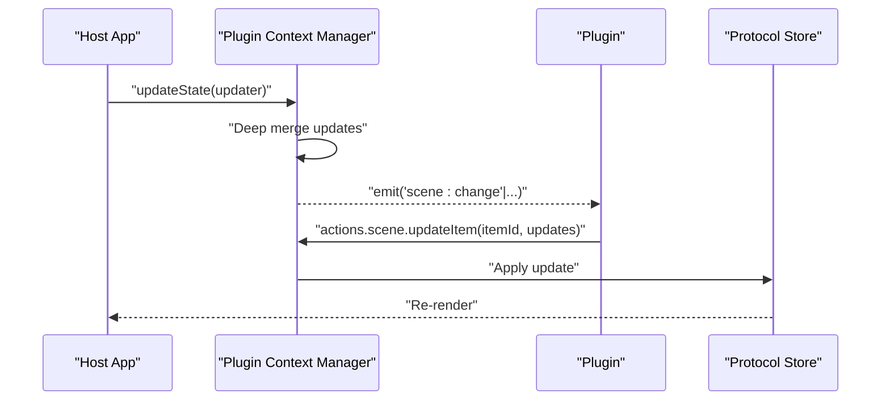
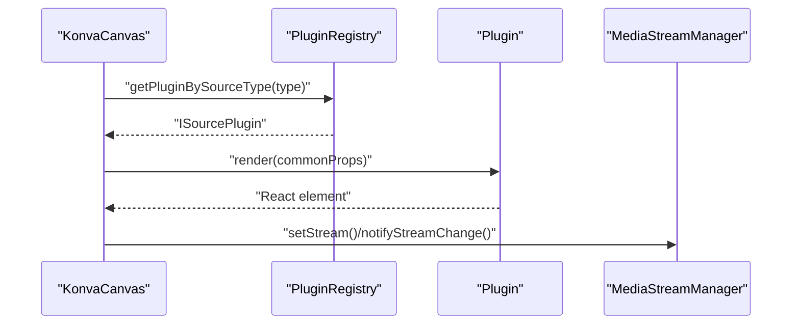
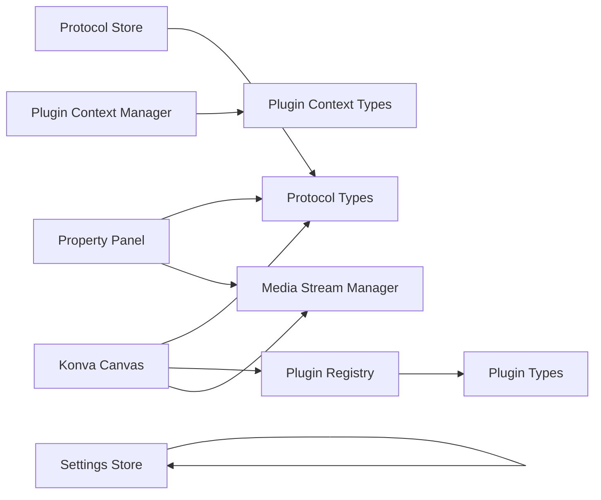

# State Management

<cite>
**Referenced Files in This Document**
- [protocol.ts](file://src/store/protocol.ts)
- [setting.ts](file://src/store/setting.ts)
- [protocol.ts (types)](file://src/types/protocol.ts)
- [plugin-context.ts](file://src/services/plugin-context.ts)
- [plugin-registry.ts](file://src/services/plugin-registry.ts)
- [plugin.ts (types)](file://src/types/plugin.ts)
- [plugin-context.ts (types)](file://src/types/plugin-context.ts)
- [konva-canvas.tsx](file://src/components/konva-canvas.tsx)
- [property-panel.tsx](file://src/components/property-panel.tsx)
- [media-stream-manager.ts](file://src/services/media-stream-manager.ts)
- [webcam plugin](file://src/plugins/builtin/webcam/index.tsx)
- [audio-input plugin](file://src/plugins/builtin/audio-input/index.tsx)
</cite>

## Table of Contents
1. [Introduction](#introduction)
2. [Project Structure](#project-structure)
3. [Core Components](#core-components)
4. [Architecture Overview](#architecture-overview)
5. [Detailed Component Analysis](#detailed-component-analysis)
6. [Dependency Analysis](#dependency-analysis)
7. [Performance Considerations](#performance-considerations)
8. [Troubleshooting Guide](#troubleshooting-guide)
9. [Conclusion](#conclusion)

## Introduction
This document explains LiveMixer Web’s state management system with a focus on:
- Protocol store: managing scene configurations, project metadata, and persistence
- Settings store: application preferences and user configurations
- Data structures for scenes and items
- State synchronization between the host and plugins
- Persistence, validation, and migration strategies
- Examples of state updates, event handling, and plugin integration
- Performance considerations for large scene configurations

## Project Structure
The state management spans three primary areas:
- Stores: protocol and settings
- Types: shared data contracts for scenes, items, and plugin context
- Services: plugin context manager, registry, and media stream manager
- UI: canvas and property panel components that render and edit state

**Diagram sources**
- [protocol.ts:1-68](file://src/store/protocol.ts#L1-L68)
- [setting.ts:1-139](file://src/store/setting.ts#L1-L139)
- [protocol.ts (types):1-114](file://src/types/protocol.ts#L1-L114)
- [plugin-context.ts:1-708](file://src/services/plugin-context.ts#L1-L708)
- [plugin-registry.ts:1-168](file://src/services/plugin-registry.ts#L1-L168)
- [plugin.ts (types):1-267](file://src/types/plugin.ts#L1-L267)
- [plugin-context.ts (types):1-438](file://src/types/plugin-context.ts#L1-L438)
- [konva-canvas.tsx:1-744](file://src/components/konva-canvas.tsx#L1-L744)
- [property-panel.tsx:1-800](file://src/components/property-panel.tsx#L1-L800)
- [media-stream-manager.ts:1-323](file://src/services/media-stream-manager.ts#L1-L323)

**Section sources**
- [protocol.ts:1-68](file://src/store/protocol.ts#L1-L68)
- [setting.ts:1-139](file://src/store/setting.ts#L1-L139)
- [protocol.ts (types):1-114](file://src/types/protocol.ts#L1-L114)
- [plugin-context.ts:1-708](file://src/services/plugin-context.ts#L1-L708)
- [plugin-registry.ts:1-168](file://src/services/plugin-registry.ts#L1-L168)
- [plugin.ts (types):1-267](file://src/types/plugin.ts#L1-L267)
- [plugin-context.ts (types):1-438](file://src/types/plugin-context.ts#L1-L438)
- [konva-canvas.tsx:1-744](file://src/components/konva-canvas.tsx#L1-L744)
- [property-panel.tsx:1-800](file://src/components/property-panel.tsx#L1-L800)
- [media-stream-manager.ts:1-323](file://src/services/media-stream-manager.ts#L1-L323)

## Core Components
- Protocol Store: holds the complete scene graph, canvas configuration, and project metadata. It persists to localStorage and auto-updates timestamps on changes.
- Settings Store: holds non-sensitive preferences and tokens in-memory. It persists only non-sensitive settings to localStorage and excludes sensitive tokens.
- Types: define Scene, SceneItem, Transform, Layout, and ProtocolData contracts used across stores and UI.
- Plugin Context Manager: exposes a controlled API surface to plugins, including readonly state, event subscriptions, and actions gated by permissions.
- Plugin Registry: registers plugins, wires i18n, and resolves plugins by source type for rendering and behavior.
- Media Stream Manager: centralizes media device enumeration and stream lifecycle for plugins.

**Section sources**
- [protocol.ts:1-68](file://src/store/protocol.ts#L1-L68)
- [setting.ts:1-139](file://src/store/setting.ts#L1-L139)
- [protocol.ts (types):1-114](file://src/types/protocol.ts#L1-L114)
- [plugin-context.ts:1-708](file://src/services/plugin-context.ts#L1-L708)
- [plugin-registry.ts:1-168](file://src/services/plugin-registry.ts#L1-L168)
- [media-stream-manager.ts:1-323](file://src/services/media-stream-manager.ts#L1-L323)

## Architecture Overview
The system follows a unidirectional data flow:
- UI components read from stores and plugin context
- UI emits updates via callbacks
- Host applies updates to stores and plugin context
- Plugins receive readonly state and request changes via actions
- Events propagate through the plugin context manager

**Diagram sources**
- [plugin-context.ts:187-216](file://src/services/plugin-context.ts#L187-L216)
- [plugin-context.ts:532-699](file://src/services/plugin-context.ts#L532-L699)
- [protocol.ts:38-67](file://src/store/protocol.ts#L38-L67)
- [plugin-registry.ts:78-118](file://src/services/plugin-registry.ts#L78-L118)

## Detailed Component Analysis

### Protocol Store: Scene Configurations and Persistence
Responsibilities:
- Provide default scene configuration and metadata
- Update protocol data and automatically refresh updatedAt
- Persist to localStorage under a dedicated key

Key behaviors:
- Default scene includes a single active scene with empty items
- updateData merges incoming data and sets updatedAt to current timestamp
- resetData rebuilds default state optionally with a custom scene name
- Uses zustand with persist middleware and JSON storage

**Diagram sources**
- [protocol.ts:44-54](file://src/store/protocol.ts#L44-L54)

**Section sources**
- [protocol.ts:1-68](file://src/store/protocol.ts#L1-L68)

### Settings Store: Preferences and Tokens
Responsibilities:
- Separate persistent and sensitive settings
- Persist only non-sensitive settings to localStorage
- Keep sensitive tokens in memory only
- Provide update and reset helpers

Key behaviors:
- partialize excludes sensitive tokens during persistence
- updatePersistentSettings merges partial settings into state
- updateSensitiveSettings updates in-memory state only
- resetSettings restores defaults for both categories

**Diagram sources**
- [setting.ts:92-139](file://src/store/setting.ts#L92-L139)

**Section sources**
- [setting.ts:1-139](file://src/store/setting.ts#L1-L139)

### Data Structures: Scenes, Items, Transforms, and Streams
Core types:
- CanvasConfig: canvas width and height
- Layout: x, y, width, height
- Transform: opacity, rotation, filters, borderRadius
- SceneItem: polymorphic item with type, zIndex, layout, transform, visibility, locking, and type-specific fields
- Scene: collection of items with id, name, active flag
- Source: external source metadata
- Resources: collection of sources
- ProtocolData: versioned project with metadata, canvas, optional resources, and scenes

Type coverage includes:
- Color, image, media, text, screen, window, video_input, audio_input, audio_output, container, scene_ref, timer, clock, livekit_stream
- Timer configuration supports countdown/countup modes with precise timing
- LiveKit stream configuration captures participant identity and source type

**Diagram sources**
- [protocol.ts (types):1-114](file://src/types/protocol.ts#L1-L114)

**Section sources**
- [protocol.ts (types):1-114](file://src/types/protocol.ts#L1-L114)

### State Synchronization Between Host and Plugins
The Plugin Context Manager provides:
- Readonly state proxy to prevent direct mutations
- Event system for scene/item changes, playback, devices, UI, and plugin lifecycle
- Action handlers for scene, playback, UI, and storage operations
- Permission gates for all actions
- Slot system for UI composition

**Diagram sources**
- [plugin-context.ts:187-216](file://src/services/plugin-context.ts#L187-L216)
- [plugin-context.ts:532-699](file://src/services/plugin-context.ts#L532-L699)
- [protocol.ts:38-67](file://src/store/protocol.ts#L38-L67)

**Section sources**
- [plugin-context.ts:1-708](file://src/services/plugin-context.ts#L1-L708)
- [plugin-context.ts (types):1-438](file://src/types/plugin-context.ts#L1-L438)

### Data Validation and Migration Strategies
Validation:
- SceneItem enforces presence of id and type
- Layout requires numeric x, y, width, height
- Transform supports optional numeric fields with reasonable defaults
- Timer configuration fields are optional and validated per mode
- LiveKit stream configuration requires participant identity and source type

Migration:
- Version field present in ProtocolData; migration strategy can be implemented by checking version and transforming data accordingly
- Default scene creation ensures minimal valid state on first load

**Section sources**
- [protocol.ts (types):20-82](file://src/types/protocol.ts#L20-L82)
- [protocol.ts (types):103-114](file://src/types/protocol.ts#L103-L114)
- [protocol.ts:6-28](file://src/store/protocol.ts#L6-L28)

### Examples: State Updates, Event Handling, and Plugin Integration
- Canvas rendering: KonvaCanvas reads scene items, sorts by zIndex, filters via plugin-provided shouldFilter, and renders items. It also handles drag/transform updates and emits timer/clock state changes.
- Property panel: PropertyPanel updates SceneItem properties and delegates media device changes to MediaStreamManager.
- Plugin integration: Plugins register via PluginRegistry and receive a scoped IPluginContext with permission-gated actions. Example plugins include webcam and audio-input.

**Diagram sources**
- [konva-canvas.tsx:459-470](file://src/components/konva-canvas.tsx#L459-L470)
- [plugin-registry.ts:144-157](file://src/services/plugin-registry.ts#L144-L157)
- [media-stream-manager.ts:56-65](file://src/services/media-stream-manager.ts#L56-L65)

**Section sources**
- [konva-canvas.tsx:1-744](file://src/components/konva-canvas.tsx#L1-L744)
- [property-panel.tsx:643-800](file://src/components/property-panel.tsx#L643-L800)
- [plugin-registry.ts:78-168](file://src/services/plugin-registry.ts#L78-L168)
- [webcam plugin:110-478](file://src/plugins/builtin/webcam/index.tsx#L110-L478)
- [audio-input plugin:105-555](file://src/plugins/builtin/audio-input/index.tsx#L105-L555)
- [media-stream-manager.ts:1-323](file://src/services/media-stream-manager.ts#L1-L323)

## Dependency Analysis
- Protocol Store depends on ProtocolData types and localStorage persistence
- Settings Store depends on localStorage persistence and separates sensitive vs non-sensitive settings
- Plugin Context Manager depends on PluginContextState and PluginContextActions
- Plugin Registry depends on Plugin types and I18nEngine
- KonvaCanvas depends on Scene types, PluginRegistry, and MediaStreamManager
- Property Panel depends on Scene types and MediaStreamManager

**Diagram sources**
- [protocol.ts:1-68](file://src/store/protocol.ts#L1-L68)
- [setting.ts:1-139](file://src/store/setting.ts#L1-L139)
- [plugin-context.ts:1-708](file://src/services/plugin-context.ts#L1-L708)
- [plugin-registry.ts:1-168](file://src/services/plugin-registry.ts#L1-L168)
- [plugin.ts (types):1-267](file://src/types/plugin.ts#L1-L267)
- [plugin-context.ts (types):1-438](file://src/types/plugin-context.ts#L1-L438)
- [konva-canvas.tsx:1-744](file://src/components/konva-canvas.tsx#L1-L744)
- [property-panel.tsx:1-800](file://src/components/property-panel.tsx#L1-L800)
- [media-stream-manager.ts:1-323](file://src/services/media-stream-manager.ts#L1-L323)

**Section sources**
- [protocol.ts:1-68](file://src/store/protocol.ts#L1-L68)
- [setting.ts:1-139](file://src/store/setting.ts#L1-L139)
- [plugin-context.ts:1-708](file://src/services/plugin-context.ts#L1-L708)
- [plugin-registry.ts:1-168](file://src/services/plugin-registry.ts#L1-L168)
- [plugin.ts (types):1-267](file://src/types/plugin.ts#L1-L267)
- [plugin-context.ts (types):1-438](file://src/types/plugin-context.ts#L1-L438)
- [konva-canvas.tsx:1-744](file://src/components/konva-canvas.tsx#L1-L744)
- [property-panel.tsx:1-800](file://src/components/property-panel.tsx#L1-L800)
- [media-stream-manager.ts:1-323](file://src/services/media-stream-manager.ts#L1-L323)

## Performance Considerations
- Large scene configurations:
  - Prefer batched updates to reduce re-renders
  - Use shallow comparisons and memoization in plugin renderers
  - Limit frequent deep merges; coalesce updates where possible
- Rendering:
  - Sort items by zIndex once per frame
  - Filter items via shouldFilter to avoid unnecessary rendering
  - Use requestAnimationFrame for timer/clock updates
- Media streams:
  - Stop unused streams promptly to conserve resources
  - Avoid redundant getUserMedia calls by caching streams
- Persistence:
  - Persist only non-sensitive settings to minimize risk and IO overhead
  - Debounce frequent writes to localStorage

[No sources needed since this section provides general guidance]

## Troubleshooting Guide
Common issues and remedies:
- Streams not appearing:
  - Verify device permissions and labels via MediaStreamManager
  - Confirm plugin’s streamInit configuration and streamType
- Property panel not updating:
  - Ensure updates are applied to both layout and transform sub-objects
  - Check for locked items preventing edits
- Plugin not receiving updates:
  - Confirm plugin has required permissions for scene:write/ui:slot/storage:write
  - Verify event subscriptions and action handler registration
- Timer/clock not updating:
  - Ensure requestAnimationFrame loop is active and items are present
  - Check timerConfig fields for mode, duration, and start/paused states

**Section sources**
- [media-stream-manager.ts:147-273](file://src/services/media-stream-manager.ts#L147-L273)
- [property-panel.tsx:675-691](file://src/components/property-panel.tsx#L675-L691)
- [plugin-context.ts:532-699](file://src/services/plugin-context.ts#L532-L699)
- [konva-canvas.tsx:204-300](file://src/components/konva-canvas.tsx#L204-L300)

## Conclusion
LiveMixer Web’s state management combines explicit stores for protocol and settings with a robust plugin context that enforces permissions and provides a clean API for state synchronization. The type system ensures strong contracts across the system, while services like MediaStreamManager and PluginRegistry encapsulate cross-cutting concerns. By following the recommended patterns—coalescing updates, filtering renders, and validating state—developers can maintain performance and reliability even with large scene configurations.