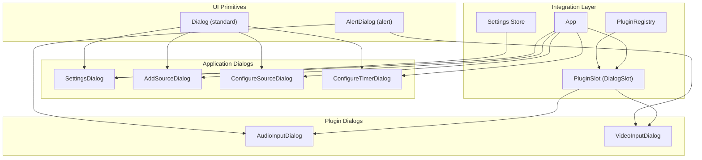
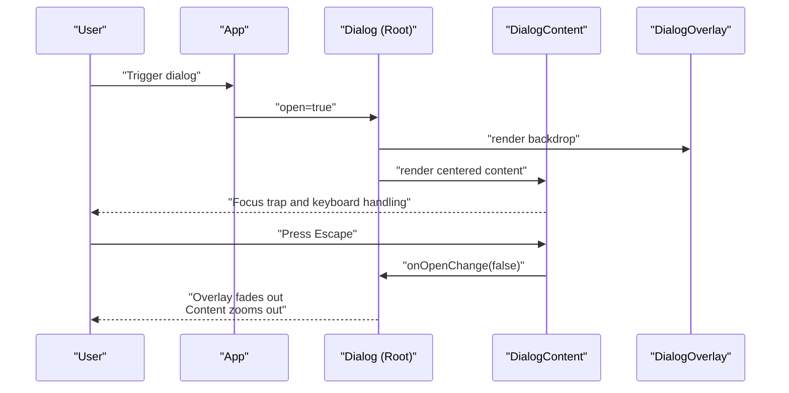
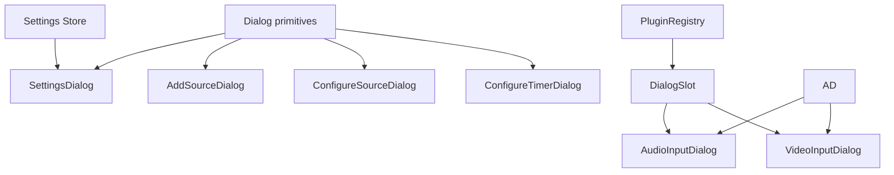

# Dialog System

<cite>
**Referenced Files in This Document**
- [dialog.tsx](file://src/components/ui/dialog.tsx)
- [alert-dialog.tsx](file://src/components/ui/alert-dialog.tsx)
- [settings-dialog.tsx](file://src/components/settings-dialog.tsx)
- [add-source-dialog.tsx](file://src/components/add-source-dialog.tsx)
- [configure-source-dialog.tsx](file://src/components/configure-source-dialog.tsx)
- [configure-timer-dialog.tsx](file://src/components/configure-timer-dialog.tsx)
- [audio-input-dialog.tsx](file://src/plugins/builtin/audio-input/audio-input-dialog.tsx)
- [video-input-dialog.tsx](file://src/plugins/builtin/webcam/video-input-dialog.tsx)
- [setting.ts](file://src/store/setting.ts)
- [plugin-registry.ts](file://src/services/plugin-registry.ts)
- [plugin-slot.tsx](file://src/components/plugin-slot.tsx)
- [App.tsx](file://src/App.tsx)
- [main-layout.tsx](file://src/components/main-layout.tsx)
- [toolbar.tsx](file://src/components/toolbar.tsx)
</cite>

## Table of Contents
1. [Introduction](#introduction)
2. [Project Structure](#project-structure)
3. [Core Components](#core-components)
4. [Architecture Overview](#architecture-overview)
5. [Detailed Component Analysis](#detailed-component-analysis)
6. [Dependency Analysis](#dependency-analysis)
7. [Performance Considerations](#performance-considerations)
8. [Troubleshooting Guide](#troubleshooting-guide)
9. [Conclusion](#conclusion)

## Introduction
This document describes the dialog system architecture used by LiveMixer Web. It covers the base dialog components (standard Dialog and AlertDialog), the modal overlay system, focus management, keyboard navigation patterns, and specialized dialogs such as SettingsDialog, AddSourceDialog, ConfigureSourceDialog, ConfigureTimerDialog, and plugin-specific dialogs for audio and video input. It also explains dialog composition, state management, integration with form components, accessibility considerations, animation transitions, and responsive behavior across screen sizes.

## Project Structure
The dialog system is composed of:
- Base UI primitives for dialogs (standard and alert variants)
- Application-level dialogs for settings and content creation
- Plugin-driven dialogs for media device selection and preview
- A slot-based dialog system enabling third-party plugins to register custom dialogs
- Centralized state management for settings and dialog orchestration

**Diagram sources**
- [dialog.tsx:1-123](file://src/components/ui/dialog.tsx#L1-L123)
- [alert-dialog.tsx:1-142](file://src/components/ui/alert-dialog.tsx#L1-L142)
- [settings-dialog.tsx:1-647](file://src/components/settings-dialog.tsx#L1-L647)
- [add-source-dialog.tsx:1-204](file://src/components/add-source-dialog.tsx#L1-L204)
- [configure-source-dialog.tsx:1-231](file://src/components/configure-source-dialog.tsx#L1-L231)
- [configure-timer-dialog.tsx:1-285](file://src/components/configure-timer-dialog.tsx#L1-L285)
- [audio-input-dialog.tsx:1-402](file://src/plugins/builtin/audio-input/audio-input-dialog.tsx#L1-L402)
- [video-input-dialog.tsx:1-332](file://src/plugins/builtin/webcam/video-input-dialog.tsx#L1-L332)
- [plugin-slot.tsx:308-363](file://src/components/plugin-slot.tsx#L308-L363)
- [plugin-registry.ts:1-168](file://src/services/plugin-registry.ts#L1-L168)
- [setting.ts:1-139](file://src/store/setting.ts#L1-L139)
- [App.tsx:1-1026](file://src/App.tsx#L1-L1026)

**Section sources**
- [dialog.tsx:1-123](file://src/components/ui/dialog.tsx#L1-L123)
- [alert-dialog.tsx:1-142](file://src/components/ui/alert-dialog.tsx#L1-L142)
- [settings-dialog.tsx:1-647](file://src/components/settings-dialog.tsx#L1-L647)
- [add-source-dialog.tsx:1-204](file://src/components/add-source-dialog.tsx#L1-L204)
- [configure-source-dialog.tsx:1-231](file://src/components/configure-source-dialog.tsx#L1-L231)
- [configure-timer-dialog.tsx:1-285](file://src/components/configure-timer-dialog.tsx#L1-L285)
- [audio-input-dialog.tsx:1-402](file://src/plugins/builtin/audio-input/audio-input-dialog.tsx#L1-L402)
- [video-input-dialog.tsx:1-332](file://src/plugins/builtin/webcam/video-input-dialog.tsx#L1-L332)
- [plugin-slot.tsx:308-363](file://src/components/plugin-slot.tsx#L308-L363)
- [plugin-registry.ts:1-168](file://src/services/plugin-registry.ts#L1-L168)
- [setting.ts:1-139](file://src/store/setting.ts#L1-L139)
- [App.tsx:1-1026](file://src/App.tsx#L1-L1026)

## Core Components
- Standard Dialog primitives:
  - Root, Trigger, Portal, Overlay, Content, Header, Footer, Title, Description
  - Overlay provides backdrop blur and fade animations; Content centers and applies zoom/slide transitions
- Alert Dialog primitives:
  - Root, Trigger, Portal, Overlay, Content, Header, Footer, Title, Description, Action, Cancel
  - Designed for destructive actions with prominent styling

These primitives are thin wrappers around Radix UI primitives, adding Tailwind-based styling and animation classes for consistent behavior.

**Section sources**
- [dialog.tsx:9-123](file://src/components/ui/dialog.tsx#L9-L123)
- [alert-dialog.tsx:6-142](file://src/components/ui/alert-dialog.tsx#L6-L142)

## Architecture Overview
The dialog system follows a layered architecture:
- Base primitives provide accessible, animated overlays and content containers
- Application dialogs compose primitives and integrate with forms and stores
- Plugin dialogs extend the system via a slot-based registration mechanism
- State orchestration coordinates dialog visibility and data flow

**Diagram sources**
- [dialog.tsx:17-54](file://src/components/ui/dialog.tsx#L17-L54)
- [App.tsx:1001-1020](file://src/App.tsx#L1001-L1020)

## Detailed Component Analysis

### Base Dialog Components
- DialogOverlay:
  - Fixed-position backdrop with fade-in/fade-out animations
  - Backdrop blur for modern glass-like effect
- DialogContent:
  - Centered grid layout with max-width constraints
  - Slide and zoom transitions on open/close
  - Close button with focus-visible ring and accessible label
- DialogHeader/Footer:
  - Responsive stacking and alignment for actions
- DialogTitle/Description:
  - Semantic labeling for assistive technologies

Accessibility and keyboard patterns:
- Focus trapping inside the dialog ensures focus remains within the dialog until closed
- Escape key closes the dialog
- Click outside the overlay closes the dialog
- Proper ARIA roles and labels are applied by Radix UI

Responsive behavior:
- Max-width constraints and centering adapt to smaller screens
- Grid layout maintains spacing and readability

**Section sources**
- [dialog.tsx:17-123](file://src/components/ui/dialog.tsx#L17-L123)

### AlertDialog Implementation
AlertDialog mirrors the standard Dialog structure but emphasizes destructive actions:
- Prominent action and cancel styles
- Overlay and portal composition similar to standard Dialog
- Suitable for confirmations like delete operations

**Section sources**
- [alert-dialog.tsx:12-142](file://src/components/ui/alert-dialog.tsx#L12-L142)

### SettingsDialog
Purpose:
- Centralized configuration hub for application settings

Key features:
- Tabbed interface for organizing settings
- Integration with the settings store for persistence and sensitivity separation
- Pending language change with apply/confirm semantics
- Form controls for streaming, output, audio, and video settings

State management:
- Local state for pending language change
- Store-managed persistent and sensitive settings
- Controlled inputs bound to store getters/setters

Composition:
- Left sidebar tab navigation
- Right content area renders active tab content
- Footer with cancel/apply/confirm actions

Accessibility:
- Proper labels and focus order
- Keyboard navigation within tabs and forms

Responsive behavior:
- Max-height container with scrollable content area
- Flexible layout adapts to viewport constraints

**Section sources**
- [settings-dialog.tsx:14-647](file://src/components/settings-dialog.tsx#L14-L647)
- [setting.ts:92-139](file://src/store/setting.ts#L92-L139)

### AddSourceDialog
Purpose:
- Allows users to choose a source type for addition to the scene

Key features:
- Lists built-in source types and plugin-provided types
- Supports legacy types (timer, clock) and external plugins
- Grid-based selection cards with icons and descriptions

Integration:
- Uses plugin registry to discover source plugins
- Emits selection to parent handler for subsequent configuration

Accessibility:
- Button-based selection with clear focus states
- Descriptive labels and icons

**Section sources**
- [add-source-dialog.tsx:98-204](file://src/components/add-source-dialog.tsx#L98-L204)
- [plugin-registry.ts:136-157](file://src/services/plugin-registry.ts#L136-L157)

### ConfigureSourceDialog
Purpose:
- Configures content for specific source types (image, media)

Key features:
- Dual input modes: file upload and URL
- Validation for required fields
- Preview and confirmation flow

Form integration:
- Controlled inputs for URL and file selection
- Accept attributes tailored to source type
- Disabled confirm button when invalid

**Section sources**
- [configure-source-dialog.tsx:29-231](file://src/components/configure-source-dialog.tsx#L29-L231)

### ConfigureTimerDialog
Purpose:
- Configures timer or clock sources with mode, duration/format, and appearance

Key features:
- Mode selection (countdown/countup/clock)
- Duration input with hours/minutes/seconds
- Display format presets and style customization

Validation:
- Ensures non-zero duration for countdown/countup modes

**Section sources**
- [configure-timer-dialog.tsx:31-285](file://src/components/configure-timer-dialog.tsx#L31-L285)

### Plugin-Specific Dialogs: AudioInputDialog and VideoInputDialog
Purpose:
- Provide device selection and preview for media streams

Key features:
- Device enumeration and selection
- Real-time preview with audio level meter (audio) or video element (video)
- Permission handling and error reporting
- Confirm/cancel flows that either pass streams directly or store them for later consumption

AudioInputDialog specifics:
- Audio level meter visualization
- AudioContext and AnalyserNode usage for level calculation
- Graceful handling of autoplay policies

VideoInputDialog specifics:
- Video preview with mirrored default
- Aspect ratio handling and loading states
- Cleanup of streams on close

**Section sources**
- [audio-input-dialog.tsx:127-402](file://src/plugins/builtin/audio-input/audio-input-dialog.tsx#L127-L402)
- [video-input-dialog.tsx:37-332](file://src/plugins/builtin/webcam/video-input-dialog.tsx#L37-L332)

### Dialog Composition and Orchestration
Orchestration:
- App manages dialog visibility and data flow
- SettingsDialog, AddSourceDialog, ConfigureSourceDialog, ConfigureTimerDialog are rendered conditionally
- DialogSlot enables plugin dialogs to be shown by ID

Composition patterns:
- Each dialog composes Dialog primitives and form components
- Controlled inputs and callbacks propagate changes to parent state
- Plugin dialogs integrate via the slot system and plugin registry

**Section sources**
- [App.tsx:136-144](file://src/App.tsx#L136-L144)
- [App.tsx:1001-1020](file://src/App.tsx#L1001-L1020)
- [plugin-slot.tsx:320-363](file://src/components/plugin-slot.tsx#L320-L363)
- [plugin-registry.ts:136-157](file://src/services/plugin-registry.ts#L136-L157)

## Dependency Analysis

**Diagram sources**
- [dialog.tsx:1-123](file://src/components/ui/dialog.tsx#L1-L123)
- [alert-dialog.tsx:1-142](file://src/components/ui/alert-dialog.tsx#L1-L142)
- [settings-dialog.tsx:1-647](file://src/components/settings-dialog.tsx#L1-L647)
- [add-source-dialog.tsx:1-204](file://src/components/add-source-dialog.tsx#L1-L204)
- [configure-source-dialog.tsx:1-231](file://src/components/configure-source-dialog.tsx#L1-L231)
- [configure-timer-dialog.tsx:1-285](file://src/components/configure-timer-dialog.tsx#L1-L285)
- [audio-input-dialog.tsx:1-402](file://src/plugins/builtin/audio-input/audio-input-dialog.tsx#L1-L402)
- [video-input-dialog.tsx:1-332](file://src/plugins/builtin/webcam/video-input-dialog.tsx#L1-L332)
- [plugin-slot.tsx:308-363](file://src/components/plugin-slot.tsx#L308-L363)
- [plugin-registry.ts:1-168](file://src/services/plugin-registry.ts#L1-L168)
- [setting.ts:1-139](file://src/store/setting.ts#L1-L139)

**Section sources**
- [App.tsx:1-1026](file://src/App.tsx#L1-L1026)
- [plugin-slot.tsx:308-363](file://src/components/plugin-slot.tsx#L308-L363)
- [plugin-registry.ts:1-168](file://src/services/plugin-registry.ts#L1-L168)

## Performance Considerations
- Overlay animations use CSS transitions and minimal JavaScript; keep animations short for responsiveness
- Media previews (audio level meter, video) should be cleaned up on dialog close to avoid resource leaks
- Large forms in dialogs should avoid heavy computations during render; consider memoization for derived values
- Debounce or throttle frequent updates in settings dialogs to reduce unnecessary store writes

## Troubleshooting Guide
Common issues and resolutions:
- Dialog does not close on Escape:
  - Ensure the dialog primitive receives the open state and onOpenChange handler
  - Verify no focus traps are preventing Escape propagation
- Overlay click does not close:
  - Confirm the overlay click-to-close behavior is enabled by the primitive
- Focus stuck outside dialog:
  - Check that focus trap is active and the first interactive element is reachable
- Media device dialogs fail to enumerate devices:
  - Verify browser permissions and HTTPS context
  - Handle autoplay policy suspension for audio contexts
- Settings changes not applied:
  - For language changes, ensure pending state is applied before closing
  - Confirm store persistence and sensitive settings separation

**Section sources**
- [dialog.tsx:17-54](file://src/components/ui/dialog.tsx#L17-L54)
- [audio-input-dialog.tsx:142-258](file://src/plugins/builtin/audio-input/audio-input-dialog.tsx#L142-L258)
- [video-input-dialog.tsx:53-186](file://src/plugins/builtin/webcam/video-input-dialog.tsx#L53-L186)
- [settings-dialog.tsx:77-90](file://src/components/settings-dialog.tsx#L77-L90)

## Conclusion
LiveMixer Web’s dialog system combines accessible primitives with robust application and plugin dialogs. The standard Dialog and AlertDialog components provide consistent behavior, while specialized dialogs integrate tightly with forms and state management. The slot-based plugin dialog system enables extensibility, and careful attention to focus management, keyboard navigation, and responsive design ensures a high-quality user experience across devices.