# Form Controls and Inputs

<cite>
**Referenced Files in This Document**
- [input.tsx](file://src/components/ui/input.tsx)
- [label.tsx](file://src/components/ui/label.tsx)
- [slider.tsx](file://src/components/ui/slider.tsx)
- [dropdown-menu.tsx](file://src/components/ui/dropdown-menu.tsx)
- [tabs.tsx](file://src/components/ui/tabs.tsx)
- [dialog.tsx](file://src/components/ui/dialog.tsx)
- [alert-dialog.tsx](file://src/components/ui/alert-dialog.tsx)
- [tooltip.tsx](file://src/components/ui/tooltip.tsx)
- [property-panel.tsx](file://src/components/property-panel.tsx)
- [configure-source-dialog.tsx](file://src/components/configure-source-dialog.tsx)
- [add-source-dialog.tsx](file://src/components/add-source-dialog.tsx)
- [toolbar-menu.tsx](file://src/components/toolbar-menu.tsx)
- [media-stream-manager.ts](file://src/services/media-stream-manager.ts)
- [protocol.ts](file://src/types/protocol.ts)
- [utils.ts](file://src/utils/utils.ts)
</cite>

## Table of Contents
1. [Introduction](#introduction)
2. [Project Structure](#project-structure)
3. [Core Components](#core-components)
4. [Architecture Overview](#architecture-overview)
5. [Detailed Component Analysis](#detailed-component-analysis)
6. [Dependency Analysis](#dependency-analysis)
7. [Performance Considerations](#performance-considerations)
8. [Troubleshooting Guide](#troubleshooting-guide)
9. [Conclusion](#conclusion)
10. [Appendices](#appendices)

## Introduction
This document explains LiveMixer Web’s form control components and input systems. It covers Radix UI integration patterns, custom form components, input validation, controlled/uncontrolled patterns, and form state management. Specialized controls include sliders for opacity adjustment, dropdown menus for selection, and tabbed interfaces for property groups. We also address form composition, accessibility compliance, responsive behavior, and styling customization with theme integration.

## Project Structure
LiveMixer organizes UI primitives under a dedicated UI module and composes them into higher-level forms and panels. The property panel demonstrates controlled inputs and dynamic form composition, while dialogs encapsulate modal forms for configuration.

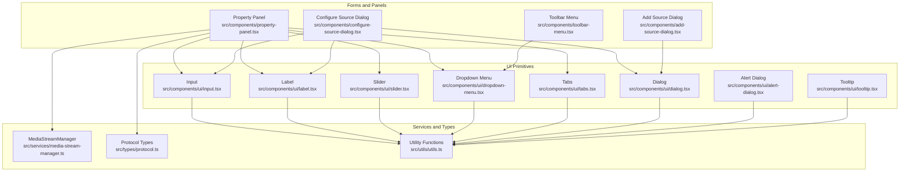

**Diagram sources**
- [input.tsx:1-25](file://src/components/ui/input.tsx#L1-L25)
- [label.tsx:1-21](file://src/components/ui/label.tsx#L1-L21)
- [slider.tsx:1-26](file://src/components/ui/slider.tsx#L1-L26)
- [dropdown-menu.tsx:1-201](file://src/components/ui/dropdown-menu.tsx#L1-L201)
- [tabs.tsx:1-56](file://src/components/ui/tabs.tsx#L1-L56)
- [dialog.tsx:1-123](file://src/components/ui/dialog.tsx#L1-L123)
- [alert-dialog.tsx:1-142](file://src/components/ui/alert-dialog.tsx#L1-L142)
- [tooltip.tsx:1-31](file://src/components/ui/tooltip.tsx#L1-L31)
- [property-panel.tsx:1-1674](file://src/components/property-panel.tsx#L1-L1674)
- [configure-source-dialog.tsx:1-231](file://src/components/configure-source-dialog.tsx#L1-L231)
- [add-source-dialog.tsx:1-204](file://src/components/add-source-dialog.tsx#L1-L204)
- [toolbar-menu.tsx:1-56](file://src/components/toolbar-menu.tsx#L1-L56)
- [media-stream-manager.ts:1-323](file://src/services/media-stream-manager.ts#L1-L323)
- [protocol.ts:1-114](file://src/types/protocol.ts#L1-L114)
- [utils.ts:1-8](file://src/utils/utils.ts#L1-L8)

**Section sources**
- [input.tsx:1-25](file://src/components/ui/input.tsx#L1-L25)
- [label.tsx:1-21](file://src/components/ui/label.tsx#L1-L21)
- [slider.tsx:1-26](file://src/components/ui/slider.tsx#L1-L26)
- [dropdown-menu.tsx:1-201](file://src/components/ui/dropdown-menu.tsx#L1-L201)
- [tabs.tsx:1-56](file://src/components/ui/tabs.tsx#L1-L56)
- [dialog.tsx:1-123](file://src/components/ui/dialog.tsx#L1-L123)
- [alert-dialog.tsx:1-142](file://src/components/ui/alert-dialog.tsx#L1-L142)
- [tooltip.tsx:1-31](file://src/components/ui/tooltip.tsx#L1-L31)
- [property-panel.tsx:1-1674](file://src/components/property-panel.tsx#L1-L1674)
- [configure-source-dialog.tsx:1-231](file://src/components/configure-source-dialog.tsx#L1-L231)
- [add-source-dialog.tsx:1-204](file://src/components/add-source-dialog.tsx#L1-L204)
- [toolbar-menu.tsx:1-56](file://src/components/toolbar-menu.tsx#L1-L56)
- [media-stream-manager.ts:1-323](file://src/services/media-stream-manager.ts#L1-L323)
- [protocol.ts:1-114](file://src/types/protocol.ts#L1-L114)
- [utils.ts:1-8](file://src/utils/utils.ts#L1-L8)

## Core Components
- Input: A thin wrapper around the native input element with consistent dark-theme styling and focus/ring behavior.
- Label: A styled label for form controls with peer-disabled support.
- Slider: A Radix UI-based slider for continuous numeric inputs (e.g., opacity).
- Dropdown Menu: A comprehensive menu system with triggers, items, separators, and submenus.
- Tabs: A tabbed interface for grouping related property sets.
- Dialog and Alert Dialog: Modal containers for forms and confirmations.
- Tooltip: Accessible tooltips built on Radix UI.

These components are composed to build complex forms such as the Property Panel and Configure Source Dialog.

**Section sources**
- [input.tsx:1-25](file://src/components/ui/input.tsx#L1-L25)
- [label.tsx:1-21](file://src/components/ui/label.tsx#L1-L21)
- [slider.tsx:1-26](file://src/components/ui/slider.tsx#L1-L26)
- [dropdown-menu.tsx:1-201](file://src/components/ui/dropdown-menu.tsx#L1-L201)
- [tabs.tsx:1-56](file://src/components/ui/tabs.tsx#L1-L56)
- [dialog.tsx:1-123](file://src/components/ui/dialog.tsx#L1-L123)
- [alert-dialog.tsx:1-142](file://src/components/ui/alert-dialog.tsx#L1-L142)
- [tooltip.tsx:1-31](file://src/components/ui/tooltip.tsx#L1-L31)

## Architecture Overview
LiveMixer’s form system follows a layered pattern:
- UI primitives wrap Radix UI and native elements, exposing consistent APIs and styles.
- Higher-level forms (panels and dialogs) orchestrate state and validation.
- Services (e.g., MediaStreamManager) provide runtime data and lifecycle management for media-related forms.
- Types define the shape of form data and constraints.

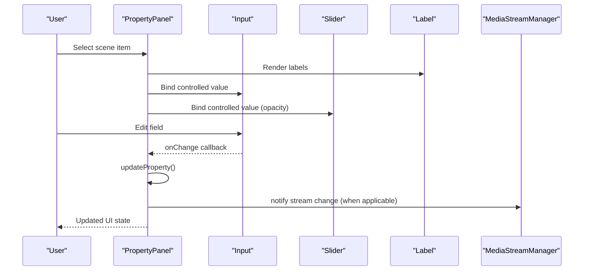

**Diagram sources**
- [property-panel.tsx:643-750](file://src/components/property-panel.tsx#L643-L750)
- [input.tsx:1-25](file://src/components/ui/input.tsx#L1-L25)
- [slider.tsx:1-26](file://src/components/ui/slider.tsx#L1-L26)
- [label.tsx:1-21](file://src/components/ui/label.tsx#L1-L21)
- [media-stream-manager.ts:116-141](file://src/services/media-stream-manager.ts#L116-L141)

**Section sources**
- [property-panel.tsx:643-750](file://src/components/property-panel.tsx#L643-L750)
- [media-stream-manager.ts:116-141](file://src/services/media-stream-manager.ts#L116-L141)

## Detailed Component Analysis

### Input Control Pattern
- Controlled pattern: Property Panel maintains a local copy of the selected item and updates it via a centralized update function. Inputs reflect the current local state and trigger updates on change.
- Validation: Numeric inputs parse and clamp values; disabled state prevents editing when locked.
- Accessibility: Uses semantic labels and maintains focus styles.

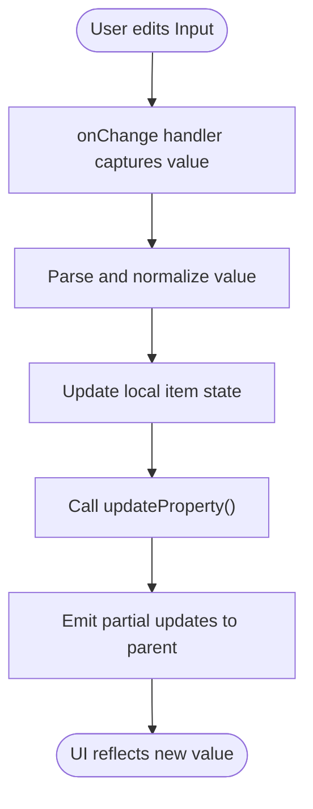

**Diagram sources**
- [property-panel.tsx:739-750](file://src/components/property-panel.tsx#L739-L750)
- [input.tsx:1-25](file://src/components/ui/input.tsx#L1-L25)

**Section sources**
- [property-panel.tsx:739-750](file://src/components/property-panel.tsx#L739-L750)
- [input.tsx:1-25](file://src/components/ui/input.tsx#L1-L25)

### Slider for Opacity Adjustment
- Radix Slider integrates with the transform.opacity field from protocol types.
- Controlled value binding ensures the slider reflects the current opacity and updates it on drag/end.
- Styling emphasizes gradient range and focused thumb states.

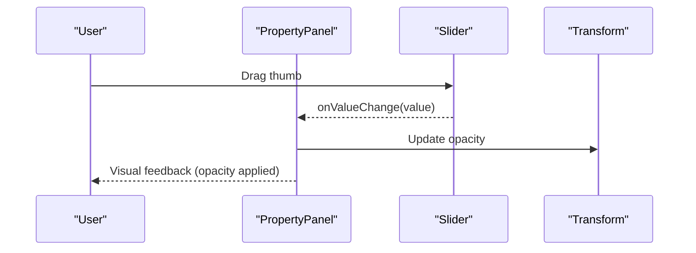

**Diagram sources**
- [property-panel.tsx:1-1674](file://src/components/property-panel.tsx#L1-L1674)
- [slider.tsx:1-26](file://src/components/ui/slider.tsx#L1-L26)
- [protocol.ts:13-18](file://src/types/protocol.ts#L13-L18)

**Section sources**
- [property-panel.tsx:1-1674](file://src/components/property-panel.tsx#L1-L1674)
- [slider.tsx:1-26](file://src/components/ui/slider.tsx#L1-L26)
- [protocol.ts:13-18](file://src/types/protocol.ts#L13-L18)

### Dropdown Menus for Selection
- Dropdown Menu wraps Radix primitives to provide triggers, content, items, and separators.
- Toolbar Menu composes Dropdown Menu to present action lists.
- Property Panel uses native select elements for device selection, complemented by Radix-based dropdowns elsewhere.

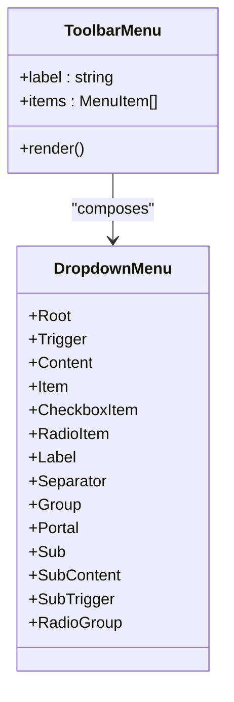

**Diagram sources**
- [dropdown-menu.tsx:1-201](file://src/components/ui/dropdown-menu.tsx#L1-L201)
- [toolbar-menu.tsx:1-56](file://src/components/toolbar-menu.tsx#L1-L56)

**Section sources**
- [dropdown-menu.tsx:1-201](file://src/components/ui/dropdown-menu.tsx#L1-L201)
- [toolbar-menu.tsx:1-56](file://src/components/toolbar-menu.tsx#L1-L56)

### Tabbed Interfaces for Property Groups
- Tabs provide a clean way to group related properties (e.g., position/size, appearance).
- Active state styling highlights the selected tab and content area.

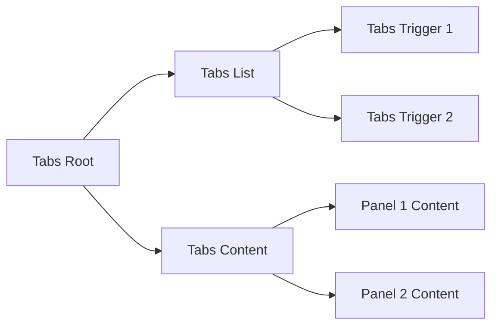

**Diagram sources**
- [tabs.tsx:1-56](file://src/components/ui/tabs.tsx#L1-L56)

**Section sources**
- [tabs.tsx:1-56](file://src/components/ui/tabs.tsx#L1-L56)

### Dialog-Based Forms
- Configure Source Dialog: A modal form supporting file upload or URL input. It validates presence of either file or URL and confirms to the parent.
- Add Source Dialog: Presents selectable source types and plugins, delegating selection to the parent.

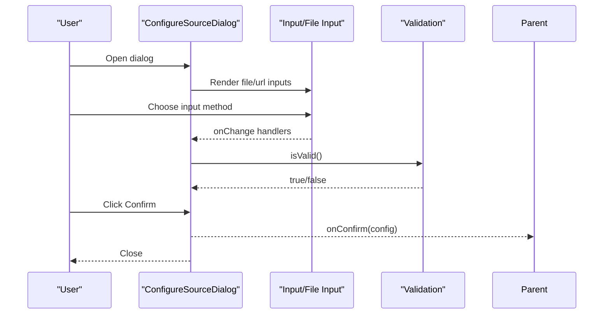

**Diagram sources**
- [configure-source-dialog.tsx:1-231](file://src/components/configure-source-dialog.tsx#L1-L231)
- [dialog.tsx:1-123](file://src/components/ui/dialog.tsx#L1-L123)

**Section sources**
- [configure-source-dialog.tsx:1-231](file://src/components/configure-source-dialog.tsx#L1-L231)
- [dialog.tsx:1-123](file://src/components/ui/dialog.tsx#L1-L123)

### Controlled vs Uncontrolled Patterns
- Controlled: Property Panel maintains local state and calls an updater prop to propagate changes. This enables validation, normalization, and locking behavior.
- Uncontrolled: Native select elements in media dialogs are used for quick selection; they are disabled when streams are active to prevent conflicts.

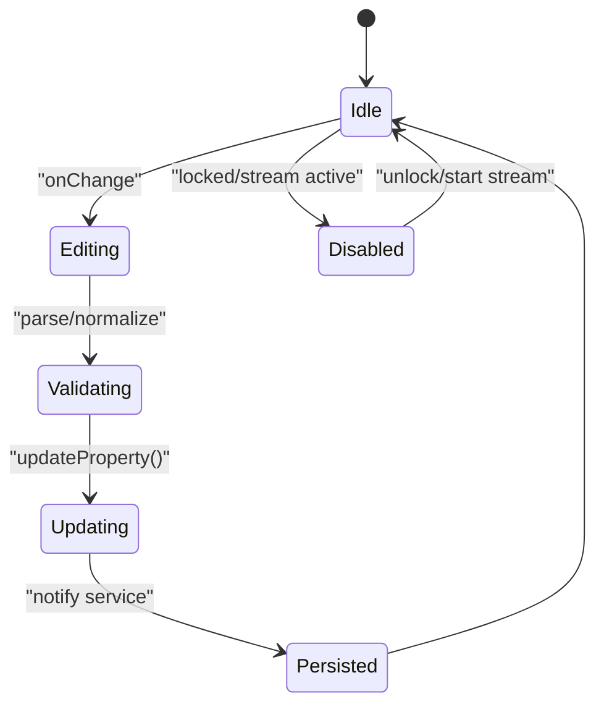

**Diagram sources**
- [property-panel.tsx:675-691](file://src/components/property-panel.tsx#L675-L691)
- [media-stream-manager.ts:56-65](file://src/services/media-stream-manager.ts#L56-L65)

**Section sources**
- [property-panel.tsx:675-691](file://src/components/property-panel.tsx#L675-L691)
- [media-stream-manager.ts:56-65](file://src/services/media-stream-manager.ts#L56-L65)

### Input Validation Strategies
- Presence validation: Dialogs disable confirm until a valid file or URL is provided.
- Type coercion: Numeric fields convert strings to numbers safely.
- Range enforcement: Sliders and numeric inputs can be extended to enforce min/max via props.

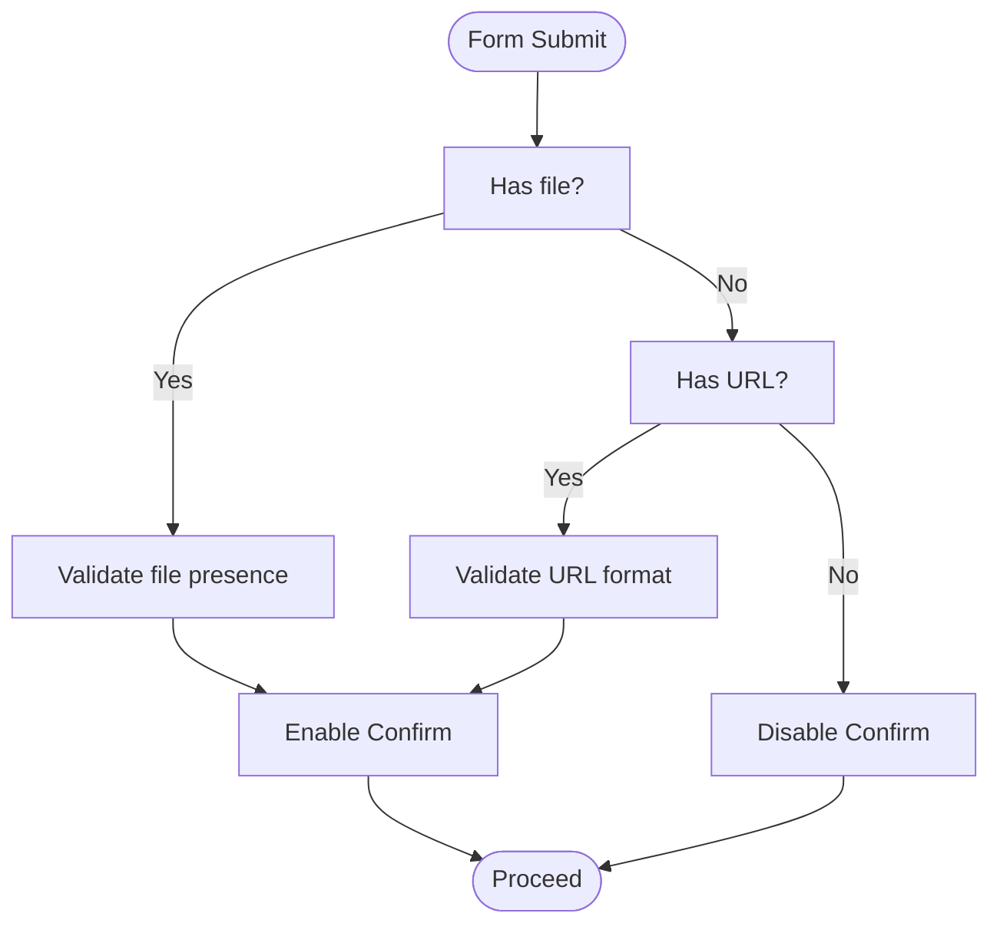

**Diagram sources**
- [configure-source-dialog.tsx:107-112](file://src/components/configure-source-dialog.tsx#L107-L112)

**Section sources**
- [configure-source-dialog.tsx:107-112](file://src/components/configure-source-dialog.tsx#L107-L112)

### Form State Management
- Local state: Property Panel keeps a local copy of the selected item to allow incremental edits without immediately persisting.
- Parent propagation: updateProperty merges partial updates into the local item and invokes the parent callback.
- Service notifications: MediaStreamManager notifies listeners when streams change, keeping UIs synchronized.

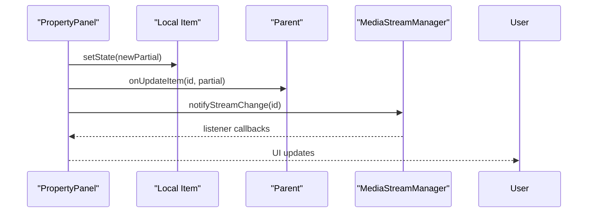

**Diagram sources**
- [property-panel.tsx:675-691](file://src/components/property-panel.tsx#L675-L691)
- [media-stream-manager.ts:130-141](file://src/services/media-stream-manager.ts#L130-L141)

**Section sources**
- [property-panel.tsx:675-691](file://src/components/property-panel.tsx#L675-L691)
- [media-stream-manager.ts:130-141](file://src/services/media-stream-manager.ts#L130-L141)

### Accessibility Compliance
- Labels: Semantic Label components associate labels with inputs for screen readers.
- Focus management: Radix primitives provide keyboard navigation and focus trapping in dialogs.
- Disabled states: Buttons and inputs reflect disabled states to avoid invalid interactions.
- ARIA roles: Radix UI defaults provide accessible roles and attributes.

**Section sources**
- [label.tsx:1-21](file://src/components/ui/label.tsx#L1-L21)
- [dialog.tsx:1-123](file://src/components/ui/dialog.tsx#L1-L123)
- [dropdown-menu.tsx:1-201](file://src/components/ui/dropdown-menu.tsx#L1-L201)
- [tabs.tsx:1-56](file://src/components/ui/tabs.tsx#L1-L56)

### Responsive Input Behavior
- Grid layouts: Property Panel uses responsive grids for position/size controls.
- Adaptive widths: Inputs and buttons scale appropriately within dialog containers.
- Disabled states: When streams are active, selectors become disabled to prevent conflicting operations.

**Section sources**
- [property-panel.tsx:759-800](file://src/components/property-panel.tsx#L759-L800)
- [configure-source-dialog.tsx:133-158](file://src/components/configure-source-dialog.tsx#L133-L158)

### Styling Customization and Theme Integration
- Utility: A shared cn function merges Tailwind classes safely.
- Dark theme: Consistent use of neutral backgrounds, borders, and focus rings tailored for dark UI.
- Gradient accents: Slider range uses a primary gradient; toggles and buttons adopt brand colors.

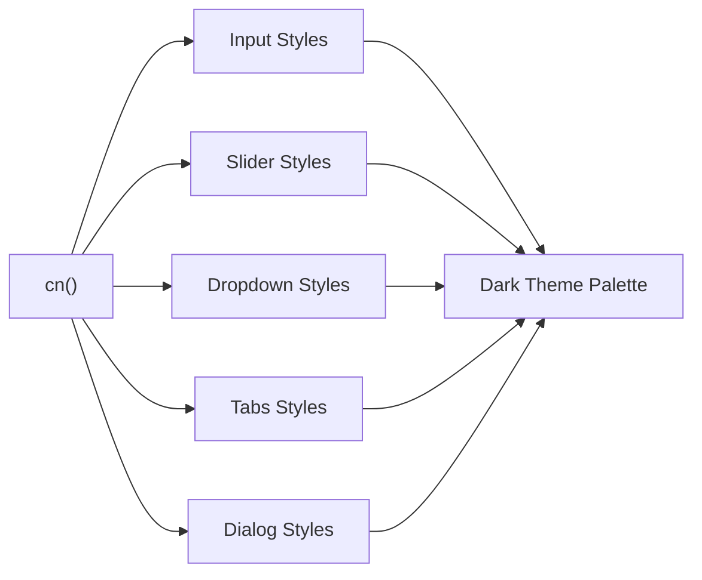

**Diagram sources**
- [utils.ts:1-8](file://src/utils/utils.ts#L1-L8)
- [input.tsx:10-20](file://src/components/ui/input.tsx#L10-L20)
- [slider.tsx:17-21](file://src/components/ui/slider.tsx#L17-L21)
- [dialog.tsx:40-46](file://src/components/ui/dialog.tsx#L40-L46)

**Section sources**
- [utils.ts:1-8](file://src/utils/utils.ts#L1-L8)
- [input.tsx:10-20](file://src/components/ui/input.tsx#L10-L20)
- [slider.tsx:17-21](file://src/components/ui/slider.tsx#L17-L21)
- [dialog.tsx:40-46](file://src/components/ui/dialog.tsx#L40-L46)

## Dependency Analysis
- UI primitives depend on Radix UI and Tailwind utilities.
- Property Panel depends on protocol types and MediaStreamManager for media-related forms.
- Dialogs depend on Dialog primitives and form-specific validation logic.
- Toolbar Menu composes Dropdown Menu for contextual actions.

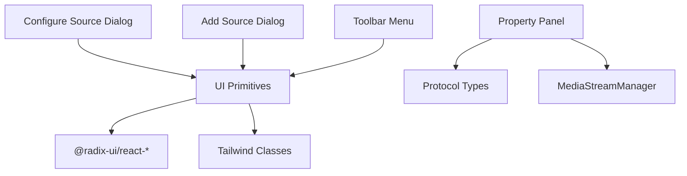

**Diagram sources**
- [property-panel.tsx:1-1674](file://src/components/property-panel.tsx#L1-L1674)
- [protocol.ts:1-114](file://src/types/protocol.ts#L1-L114)
- [media-stream-manager.ts:1-323](file://src/services/media-stream-manager.ts#L1-L323)
- [configure-source-dialog.tsx:1-231](file://src/components/configure-source-dialog.tsx#L1-L231)
- [add-source-dialog.tsx:1-204](file://src/components/add-source-dialog.tsx#L1-L204)
- [toolbar-menu.tsx:1-56](file://src/components/toolbar-menu.tsx#L1-L56)

**Section sources**
- [property-panel.tsx:1-1674](file://src/components/property-panel.tsx#L1-L1674)
- [protocol.ts:1-114](file://src/types/protocol.ts#L1-L114)
- [media-stream-manager.ts:1-323](file://src/services/media-stream-manager.ts#L1-L323)
- [configure-source-dialog.tsx:1-231](file://src/components/configure-source-dialog.tsx#L1-L231)
- [add-source-dialog.tsx:1-204](file://src/components/add-source-dialog.tsx#L1-L204)
- [toolbar-menu.tsx:1-56](file://src/components/toolbar-menu.tsx#L1-L56)

## Performance Considerations
- Prefer controlled inputs for frequent updates to avoid re-render churn.
- Debounce expensive operations (e.g., device enumeration) and cache results where appropriate.
- Use minimal re-renders by updating only changed fields in updateProperty.
- Avoid unnecessary DOM nodes in dropdowns and dialogs; leverage Radix animations efficiently.

## Troubleshooting Guide
- Input not updating: Verify controlled value binding and that updateProperty is invoked on change.
- Slider not reflecting value: Ensure the bound value is a number and within supported range.
- Dropdown not opening: Confirm Radix Provider is initialized and portal rendering is enabled.
- Dialog not closing: Check close handlers and ensure confirm/validation logic is correct.
- Media device selection failing: Inspect permissions and fallback flows in MediaStreamManager.

**Section sources**
- [property-panel.tsx:675-691](file://src/components/property-panel.tsx#L675-L691)
- [slider.tsx:1-26](file://src/components/ui/slider.tsx#L1-L26)
- [dropdown-menu.tsx:1-201](file://src/components/ui/dropdown-menu.tsx#L1-L201)
- [dialog.tsx:1-123](file://src/components/ui/dialog.tsx#L1-L123)
- [media-stream-manager.ts:150-257](file://src/services/media-stream-manager.ts#L150-L257)

## Conclusion
LiveMixer’s form system combines Radix UI primitives with custom wrappers and controlled components to deliver a cohesive, accessible, and theme-consistent input experience. Property Panel and dialog-based forms demonstrate robust state management, validation, and integration with media services. The modular design allows easy extension and customization while maintaining performance and usability.

## Appendices
- Example property schema patterns for plugin-driven forms are demonstrated in the plugin documentation example.

**Section sources**
- [property-panel.tsx:989-1049](file://src/components/property-panel.tsx#L989-L1049)